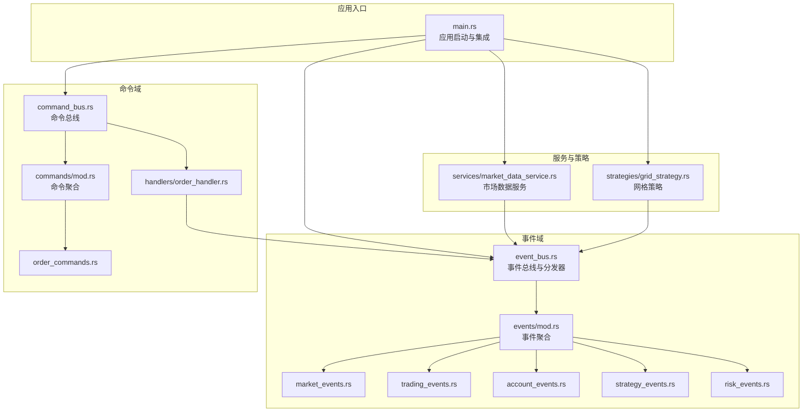
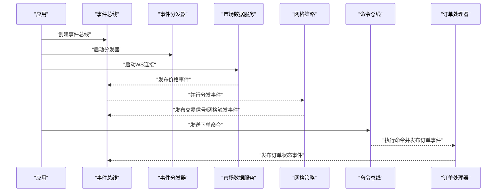
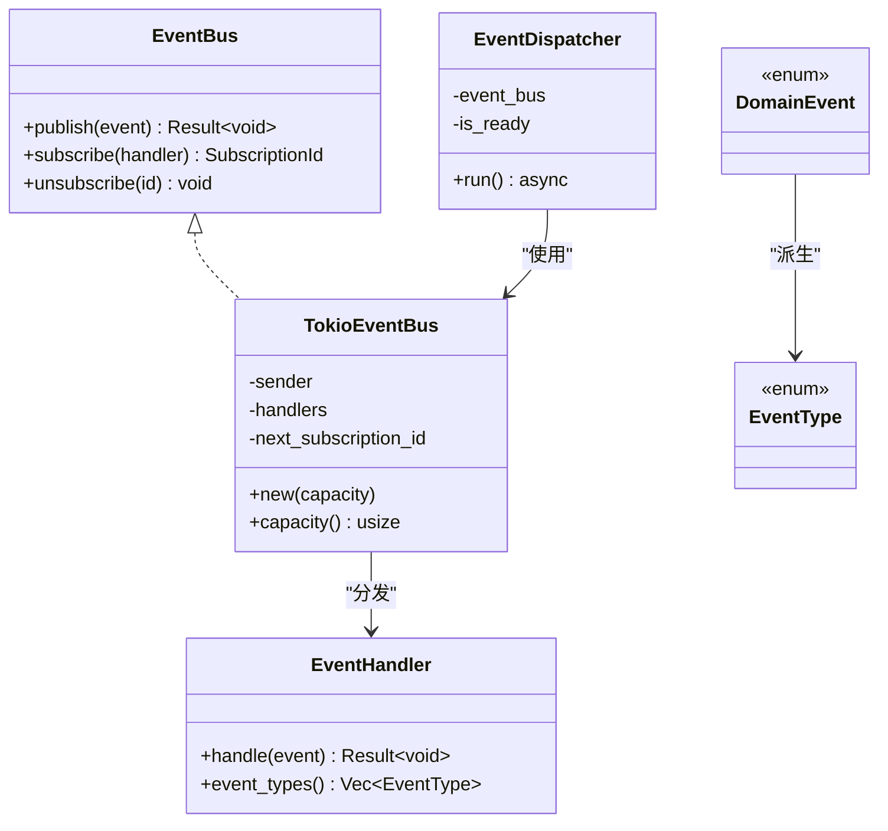
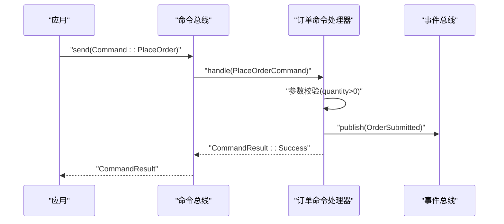
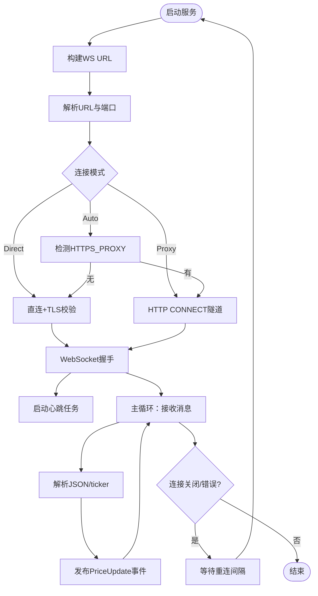
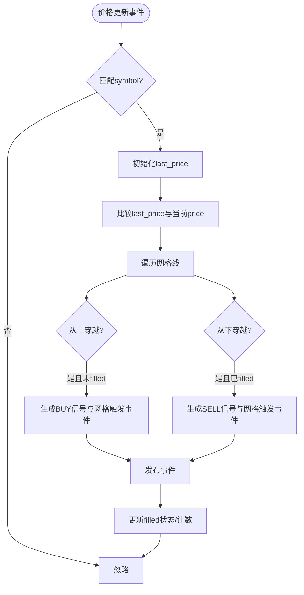
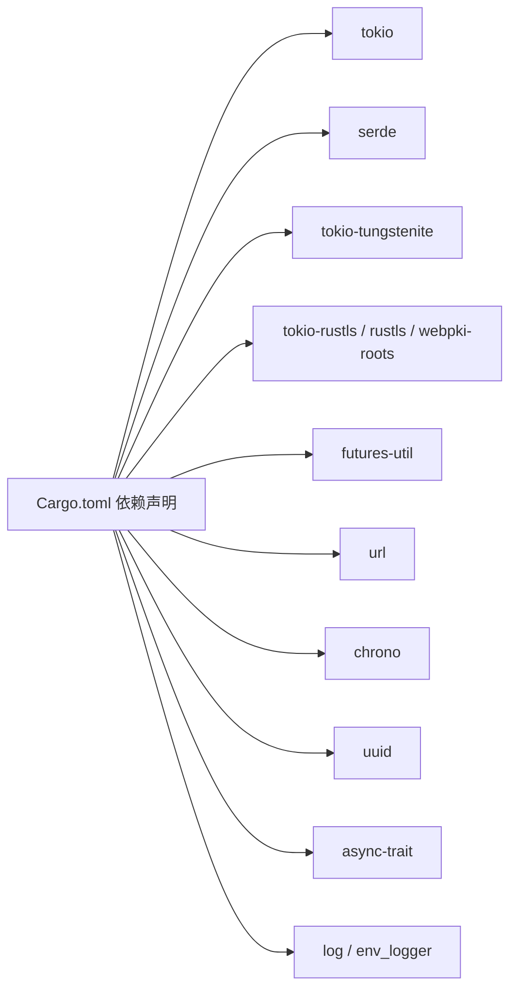

# API参考

<cite>
**本文引用的文件**
- [lib.rs](file://src/lib.rs)
- [event_bus.rs](file://src/event_bus.rs)
- [command_bus.rs](file://src/command_bus.rs)
- [market_data_service.rs](file://src/services/market_data_service.rs)
- [grid_strategy.rs](file://src/strategies/grid_strategy.rs)
- [mod.rs（事件聚合）](file://src/events/mod.rs)
- [market_events.rs](file://src/events/market_events.rs)
- [trading_events.rs](file://src/events/trading_events.rs)
- [account_events.rs](file://src/events/account_events.rs)
- [strategy_events.rs](file://src/events/strategy_events.rs)
- [risk_events.rs](file://src/events/risk_events.rs)
- [mod.rs（命令聚合）](file://src/commands/mod.rs)
- [order_commands.rs](file://src/commands/order_commands.rs)
- [order_handler.rs](file://src/handlers/order_handler.rs)
- [error.rs](file://src/error.rs)
- [Cargo.toml](file://Cargo.toml)
- [main.rs](file://src/main.rs)
</cite>

## 目录
1. [简介](#简介)
2. [项目结构](#项目结构)
3. [核心组件](#核心组件)
4. [架构总览](#架构总览)
5. [详细组件分析](#详细组件分析)
6. [依赖关系分析](#依赖关系分析)
7. [性能考量](#性能考量)
8. [故障排查指南](#故障排查指南)
9. [结论](#结论)
10. [附录](#附录)

## 简介
本文件为 Binance Rust 事件驱动交易系统的完整 API 参考，覆盖事件总线、命令总线、市场数据服务与网格策略四大能力域。内容包括：
- 事件总线 API：事件发布、订阅、取消订阅的接口规范与数据模型
- 命令总线 API：命令发送、执行状态与结果获取的接口规范
- 市场数据服务 API：WebSocket 连接、数据订阅、连接管理与错误处理
- 网格策略 API：策略配置、状态查询、参数调整与事件输出
- 事件与命令类型的数据结构定义、使用示例与版本兼容性说明

## 项目结构
系统采用模块化组织，按职责划分为事件、命令、服务、策略与基础设施层，并通过事件总线实现解耦。

图表来源
- [main.rs:10-93](file://src/main.rs#L10-L93)
- [event_bus.rs:18-110](file://src/event_bus.rs#L18-L110)
- [command_bus.rs:5-19](file://src/command_bus.rs#L5-L19)
- [market_data_service.rs:34-114](file://src/services/market_data_service.rs#L34-L114)
- [grid_strategy.rs:156-278](file://src/strategies/grid_strategy.rs#L156-L278)
- [mod.rs（事件聚合）:48-89](file://src/events/mod.rs#L48-L89)
- [mod.rs（命令聚合）:6-27](file://src/commands/mod.rs#L6-L27)

章节来源
- [lib.rs:1-9](file://src/lib.rs#L1-L9)
- [Cargo.toml:1-27](file://Cargo.toml#L1-L27)

## 核心组件
- 事件总线：提供异步广播式事件发布与订阅，支持处理器并行处理与错误隔离
- 命令总线：面向命令的执行入口，当前支持下单命令
- 市场数据服务：封装 Binance WebSocket 连接、订阅与消息解析，发布价格事件
- 网格策略：基于价格穿越网格线生成交易信号与网格触发事件

章节来源
- [event_bus.rs:18-110](file://src/event_bus.rs#L18-L110)
- [command_bus.rs:5-19](file://src/command_bus.rs#L5-L19)
- [market_data_service.rs:34-114](file://src/services/market_data_service.rs#L34-L114)
- [grid_strategy.rs:156-278](file://src/strategies/grid_strategy.rs#L156-L278)

## 架构总览
系统以事件驱动为核心，事件总线作为中枢，命令总线负责命令执行并产生事件，服务与策略围绕事件进行扩展。

图表来源
- [main.rs:14-22](file://src/main.rs#L14-L22)
- [market_data_service.rs:96-114](file://src/services/market_data_service.rs#L96-L114)
- [grid_strategy.rs:264-278](file://src/strategies/grid_strategy.rs#L264-L278)
- [command_bus.rs:14-18](file://src/command_bus.rs#L14-L18)
- [order_handler.rs:68-91](file://src/handlers/order_handler.rs#L68-L91)

## 详细组件分析

### 事件总线 API 规范
- 接口职责
  - 发布事件：向所有订阅者广播事件
  - 订阅事件：注册事件处理器并返回订阅 ID
  - 取消订阅：移除处理器映射
- 关键类型
  - 事件类型枚举：涵盖价格、K线、订单簿、订单生命周期、账户、策略、风控等
  - 事件元数据：包含事件 ID、时间戳、版本、关联 ID 等
  - 统一事件枚举：聚合所有领域事件
- 方法签名与行为
  - 发布：publish(DomainEvent) -> Result<(), EventError>
  - 订阅：subscribe<T: EventHandler>(Arc<T>) -> SubscriptionId
  - 取消：unsubscribe(SubscriptionId) -> void
- 处理器契约
  - handle(&DomainEvent) -> Result<(), EventError>
  - event_types() -> Vec<EventType> 用于过滤
- 并发与错误
  - 分发器并行调用各处理器，错误独立记录
  - 通道容量与广播机制保证高吞吐

图表来源
- [event_bus.rs:18-110](file://src/event_bus.rs#L18-L110)
- [event_bus.rs:112-158](file://src/event_bus.rs#L112-L158)
- [mod.rs（事件聚合）:48-89](file://src/events/mod.rs#L48-L89)

章节来源
- [event_bus.rs:18-110](file://src/event_bus.rs#L18-L110)
- [event_bus.rs:112-158](file://src/event_bus.rs#L112-L158)
- [mod.rs（事件聚合）:21-46](file://src/events/mod.rs#L21-L46)
- [mod.rs（事件聚合）:48-89](file://src/events/mod.rs#L48-L89)

### 命令总线 API 规范
- 接口职责
  - send(Command) -> CommandResult
  - 当前支持下单命令，未来可扩展其他命令
- 命令与结果
  - 命令类型：PlaceOrder
  - 结果类型：Success/Failure/Accepted，包含语义化字段
- 下单命令详情
  - 字段：symbol、side、order_type、price、quantity、client_order_id
  - 参数校验：数量必须大于 0
  - 执行流程：参数校验 -> 发布订单提交事件 -> 返回成功结果
- 使用示例路径
  - [main.rs:24-41](file://src/main.rs#L24-L41)

图表来源
- [command_bus.rs:14-18](file://src/command_bus.rs#L14-L18)
- [order_handler.rs:93-137](file://src/handlers/order_handler.rs#L93-L137)
- [mod.rs（命令聚合）:6-27](file://src/commands/mod.rs#L6-L27)

章节来源
- [command_bus.rs:5-19](file://src/command_bus.rs#L5-L19)
- [order_handler.rs:93-137](file://src/handlers/order_handler.rs#L93-L137)
- [mod.rs（命令聚合）:6-27](file://src/commands/mod.rs#L6-L27)

### 市场数据服务 API 规范
- 连接与订阅
  - 构造：MarketDataService::new(Arc<TokioEventBus>, Vec<String>)
  - 订阅：每个交易对生成 "@ticker" 流，组合流支持多对订阅
  - 运行：start() 自动重连，异常后按间隔重试
- 连接模式
  - Auto：优先使用 HTTPS_PROXY 环境变量
  - Direct：强制直连
  - Proxy：强制使用代理（需设置 HTTPS_PROXY）
- 代理与 TLS
  - 支持 HTTP CONNECT 隧道
  - 使用 rustls 进行 TLS 握手与证书校验
- 消息处理
  - 解析 Binance ticker 数据，提取 symbol/c/p/E
  - 过滤非 24hrTicker 消息
  - 发布 PriceUpdate 事件
- 配置方法
  - with_connection_mode(mode)
  - with_reconnect_interval(seconds)
  - with_connect_timeout(seconds)

图表来源
- [market_data_service.rs:53-114](file://src/services/market_data_service.rs#L53-L114)
- [market_data_service.rs:117-178](file://src/services/market_data_service.rs#L117-L178)
- [market_data_service.rs:303-374](file://src/services/market_data_service.rs#L303-L374)
- [market_data_service.rs:376-407](file://src/services/market_data_service.rs#L376-L407)

章节来源
- [market_data_service.rs:34-114](file://src/services/market_data_service.rs#L34-L114)
- [market_data_service.rs:117-178](file://src/services/market_data_service.rs#L117-L178)
- [market_data_service.rs:303-374](file://src/services/market_data_service.rs#L303-L374)
- [market_data_service.rs:376-407](file://src/services/market_data_service.rs#L376-L407)

### 网格策略 API 规范
- 策略配置
  - GridConfig：strategy_id、symbol、lower_price、upper_price、grid_count、quantity_per_grid、profit_threshold_pct
  - 计算：grid_spacing()、build_grid_lines() 生成网格线集合
- 状态与事件
  - GridState：grid_lines、last_price、signal_count
  - on_price_update()：价格穿越网格线时生成 TradingSignalEvent 与 GridTriggerEvent
- 方法
  - new(config, event_bus) -> GridStrategy
  - config() -> &GridConfig
  - handle(event) -> 实现 EventHandler
- 使用示例路径
  - [main.rs:42-61](file://src/main.rs#L42-L61)

图表来源
- [grid_strategy.rs:189-252](file://src/strategies/grid_strategy.rs#L189-L252)
- [grid_strategy.rs:264-278](file://src/strategies/grid_strategy.rs#L264-L278)

章节来源
- [grid_strategy.rs:26-81](file://src/strategies/grid_strategy.rs#L26-L81)
- [grid_strategy.rs:83-154](file://src/strategies/grid_strategy.rs#L83-L154)
- [grid_strategy.rs:156-278](file://src/strategies/grid_strategy.rs#L156-L278)

### 事件类型与数据结构
- 事件元数据 EventMetadata：event_id、timestamp、version、correlation_id、causation_id
- 统一事件 DomainEvent：聚合所有领域事件
- 市场事件：PriceUpdate、KlineCompleted、OrderBookUpdate
- 交易事件：OrderSubmitted、OrderFilled、OrderCancelled、OrderRejected
- 账户事件：BalanceUpdate、PositionChange
- 策略事件：TradingSignal、GridTrigger、GridStateChange
- 风控事件：RiskCheck、RiskAlert

章节来源
- [mod.rs（事件聚合）:21-46](file://src/events/mod.rs#L21-L46)
- [mod.rs（事件聚合）:48-89](file://src/events/mod.rs#L48-L89)
- [market_events.rs:7-56](file://src/events/market_events.rs#L7-L56)
- [trading_events.rs:8-97](file://src/events/trading_events.rs#L8-L97)
- [account_events.rs:7-54](file://src/events/account_events.rs#L7-L54)
- [strategy_events.rs:7-80](file://src/events/strategy_events.rs#L7-L80)
- [risk_events.rs:7-72](file://src/events/risk_events.rs#L7-L72)

### 命令类型与数据结构
- Command：当前支持 PlaceOrder
- CommandType：PlaceOrder
- CommandResult：Success/Failure/Accepted
- PlaceOrderCommand：symbol、side、order_type、price、quantity、client_order_id

章节来源
- [mod.rs（命令聚合）:6-27](file://src/commands/mod.rs#L6-L27)
- [order_commands.rs:3-72](file://src/commands/order_commands.rs#L3-L72)

### 错误与异常
- DomainError：统一错误类型，包含基础设施、事件总线、命令总线、服务等子错误
- EventBusError：发布失败、订阅失败、处理失败、通道关闭
- CommandBusError：执行失败、处理器未找到、验证失败
- ServiceError：订单、账户、风控、市场数据错误

章节来源
- [error.rs:12-34](file://src/error.rs#L12-L34)
- [error.rs:85-112](file://src/error.rs#L85-L112)
- [error.rs:114-128](file://src/error.rs#L114-L128)

## 依赖关系分析
- 运行时依赖：Tokio、Serde、Tokio-Tungstenite、Rustls、WebPki Roots、Futures、URL、Chrono、UUID、Async-Trait、Env Logger、Dashmap、ParkingLot
- 模块依赖：lib.rs 汇总导出；事件与命令模块分别聚合；服务与策略依赖事件总线

图表来源
- [Cargo.toml:6-25](file://Cargo.toml#L6-L25)

章节来源
- [Cargo.toml:1-27](file://Cargo.toml#L1-L27)

## 性能考量
- 事件总线采用广播通道，具备高吞吐与低延迟特性
- 分发器并行处理多个处理器，提升整体并发度
- 市场数据服务使用心跳与自动重连，保障连接稳定性
- 建议根据负载调整事件总线容量与处理器数量，避免内存压力

## 故障排查指南
- 事件总线
  - 发布失败：检查通道容量与订阅者数量
  - 处理器未收到事件：确认 event_types 过滤条件与订阅范围
- 市场数据服务
  - 连接失败：检查代理配置、网络连通性与证书链
  - 消息解析失败：确认 Binance 消息格式变化
- 命令总线
  - 参数校验失败：检查下单数量与价格字段
  - 事件发布失败：检查事件总线状态与订阅者健康

章节来源
- [error.rs:85-112](file://src/error.rs#L85-L112)
- [market_data_service.rs:117-178](file://src/services/market_data_service.rs#L117-L178)
- [order_handler.rs:102-135](file://src/handlers/order_handler.rs#L102-L135)

## 结论
本系统通过事件总线实现松耦合扩展，命令总线提供清晰的命令执行入口，市场数据服务与网格策略分别承担数据接入与策略逻辑。建议在生产环境中结合监控与可观测性工具，持续优化事件总线容量与处理器并发度。

## 附录
- 版本与兼容性
  - 事件元数据包含版本字段，默认 1.0
  - 建议在升级事件结构时增加版本号并在分发器侧兼容旧版本
- 迁移指南
  - 新增事件类型：在 DomainEvent 枚举中添加新变体，并在事件聚合模块导出
  - 修改事件字段：保持向后兼容，新增字段设默认值，避免破坏既有订阅者
  - 命令扩展：在 Command 与 CommandResult 中新增变体，确保命令处理器分支完备