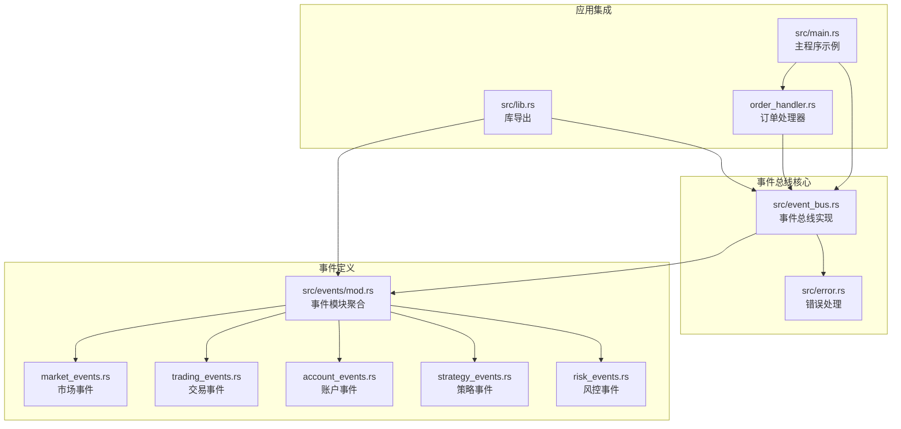
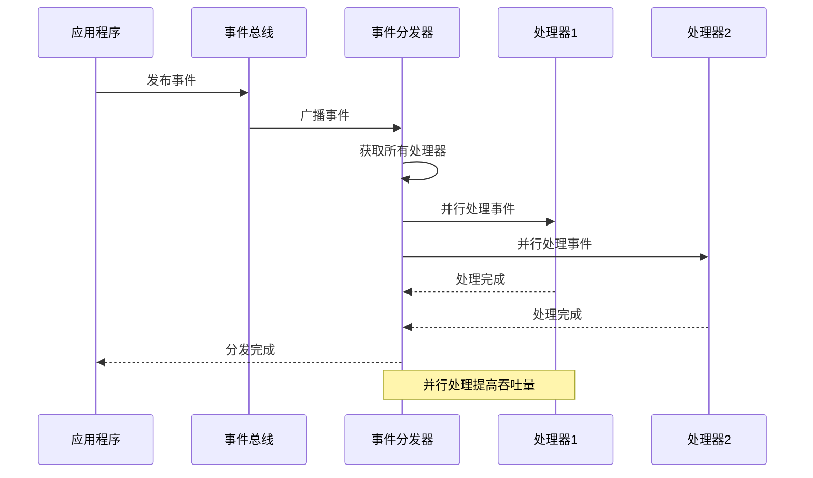
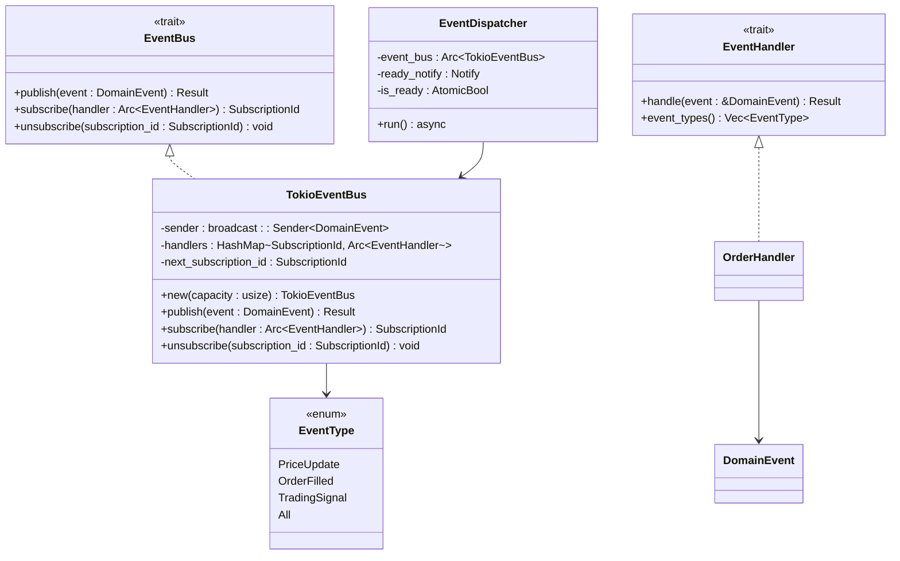

# 事件总线API

<cite>
**本文档引用的文件**
- [event_bus.rs](file://src/event_bus.rs)
- [mod.rs](file://src/events/mod.rs)
- [market_events.rs](file://src/events/market_events.rs)
- [trading_events.rs](file://src/events/trading_events.rs)
- [account_events.rs](file://src/events/account_events.rs)
- [strategy_events.rs](file://src/events/strategy_events.rs)
- [risk_events.rs](file://src/events/risk_events.rs)
- [error.rs](file://src/error.rs)
- [lib.rs](file://src/lib.rs)
- [main.rs](file://src/main.rs)
- [order_handler.rs](file://src/handlers/order_handler.rs)
</cite>

## 目录
1. [简介](#简介)
2. [项目结构](#项目结构)
3. [核心组件](#核心组件)
4. [架构概览](#架构概览)
5. [详细组件分析](#详细组件分析)
6. [依赖关系分析](#依赖关系分析)
7. [性能考虑](#性能考虑)
8. [故障排除指南](#故障排除指南)
9. [结论](#结论)
10. [附录](#附录)

## 简介
本文档提供了Binance Rust项目中事件总线API的完整参考文档。该事件总线系统采用异步设计，支持事件的发布、订阅和分发，为系统的事件驱动架构提供基础支撑。系统包含完整的错误处理机制、线程安全保证和高性能的并发处理能力。

## 项目结构
事件总线相关的代码主要分布在以下模块中：



**图表来源**
- [event_bus.rs:1-257](file://src/event_bus.rs#L1-L257)
- [mod.rs:1-102](file://src/events/mod.rs#L1-L102)
- [main.rs:1-93](file://src/main.rs#L1-L93)

**章节来源**
- [lib.rs:1-9](file://src/lib.rs#L1-L9)
- [event_bus.rs:1-257](file://src/event_bus.rs#L1-L257)

## 核心组件
事件总线系统包含以下核心组件：

### 事件总线Trait (EventBus)
事件总线的核心接口，定义了事件发布、订阅和取消订阅的标准方法。

### 事件处理器Trait (EventHandler)
定义事件处理的标准接口，要求实现异步事件处理和事件类型过滤。

### 事件类型枚举 (EventType)
定义系统支持的所有事件类型常量，用于事件过滤和路由。

### 事件分发器 (EventDispatcher)
负责监听事件总线并将其分发给所有注册的处理器。

**章节来源**
- [event_bus.rs:18-39](file://src/event_bus.rs#L18-L39)
- [event_bus.rs:41-59](file://src/event_bus.rs#L41-L59)
- [event_bus.rs:112-158](file://src/event_bus.rs#L112-L158)

## 架构概览
事件总线采用发布-订阅模式，结合广播通道实现高效的事件分发：



**图表来源**
- [event_bus.rs:88-110](file://src/event_bus.rs#L88-L110)
- [event_bus.rs:129-157](file://src/event_bus.rs#L129-L157)

## 详细组件分析

### EventBus Trait 详解

#### publish() 方法
- **功能**: 发布事件到事件总线
- **参数**: `DomainEvent` - 要发布的事件对象
- **返回值**: `Result<(), EventError>` - 成功或错误
- **异步**: 是
- **错误处理**: 
  - `EventBusError::PublishFailed` - 发布失败
  - `EventBusError::ChannelClosed` - 通道关闭

#### subscribe() 方法
- **功能**: 注册事件处理器
- **参数**: `Arc<T: EventHandler>` - 事件处理器的Arc包装
- **返回值**: `SubscriptionId` - 订阅ID
- **生命周期**: 返回的ID用于后续取消订阅
- **线程安全**: 使用Arc确保多线程安全

#### unsubscribe() 方法
- **功能**: 取消事件处理器订阅
- **参数**: `SubscriptionId` - 要取消的订阅ID
- **注意事项**: 
  - 取消订阅后处理器不再接收事件
  - 不会抛出异常，即使ID不存在
  - 适用于清理资源和停止处理

**章节来源**
- [event_bus.rs:20-29](file://src/event_bus.rs#L20-L29)
- [error.rs:85-99](file://src/error.rs#L85-L99)

### EventHandler Trait 实现要求

#### handle() 方法
- **功能**: 处理传入的事件
- **参数**: `&DomainEvent` - 事件引用（避免克隆）
- **返回值**: `Result<(), EventError>`
- **异步**: 是
- **性能**: 接收引用避免昂贵的事件克隆

#### event_types() 方法
- **功能**: 返回处理器感兴趣的事件类型列表
- **用途**: 事件过滤，提高处理效率
- **特殊值**: `EventType::All` 表示订阅所有事件

**章节来源**
- [event_bus.rs:32-39](file://src/event_bus.rs#L32-L39)

### EventType 枚举详解

系统支持以下事件类型常量：

#### 市场数据事件
- `PriceUpdate` - 价格更新
- `KlineCompleted` - K线完成
- `OrderBookUpdate` - 订单簿更新

#### 交易事件
- `OrderSubmitted` - 订单提交
- `OrderFilled` - 订单成交
- `OrderCancelled` - 订单取消
- `OrderRejected` - 订单拒绝

#### 账户事件
- `BalanceUpdate` - 余额更新
- `PositionChange` - 持仓变动

#### 策略事件
- `TradingSignal` - 交易信号
- `GridTrigger` - 网格触发
- `GridStateChange` - 网格状态变更

#### 风控事件
- `RiskCheck` - 风控检查
- `RiskAlert` - 风控告警

#### 通用常量
- `All` - 订阅所有事件类型

**章节来源**
- [event_bus.rs:42-59](file://src/event_bus.rs#L42-L59)

### EventDispatcher 使用指南

#### 初始化流程
1. 创建TokioEventBus实例
2. 创建EventDispatcher实例
3. 启动分发器任务
4. 等待分发器就绪

#### 运行机制
- **事件监听**: 订阅广播通道
- **并行处理**: 使用`join_all`并发处理所有处理器
- **错误隔离**: 单个处理器失败不影响其他处理器
- **就绪通知**: 通过Notify机制通知主程序

#### 停止流程
- 分发器在通道关闭时自动停止
- 无显式停止方法，遵循Tokio通道的生命周期

**章节来源**
- [event_bus.rs:112-158](file://src/event_bus.rs#L112-L158)
- [main.rs:14-22](file://src/main.rs#L14-L22)

### 事件类型定义

#### DomainEvent 统一事件枚举
系统使用统一的DomainEvent枚举来封装所有事件类型，支持序列化和反序列化。

#### 事件元数据
每个事件都包含标准的EventMetadata，提供事件的唯一标识、时间戳、版本等信息。

**章节来源**
- [mod.rs:48-89](file://src/events/mod.rs#L48-L89)
- [mod.rs:21-46](file://src/events/mod.rs#L21-L46)

## 依赖关系分析



**图表来源**
- [event_bus.rs:18-110](file://src/event_bus.rs#L18-L110)
- [order_handler.rs:68-91](file://src/handlers/order_handler.rs#L68-L91)

**章节来源**
- [event_bus.rs:1-257](file://src/event_bus.rs#L1-L257)
- [order_handler.rs:1-137](file://src/handlers/order_handler.rs#L1-L137)

## 性能考虑

### 并发处理
- **并行分发**: 使用`futures_util::future::join_all`并发处理所有处理器
- **无阻塞**: 事件分发不阻塞事件发布
- **内存效率**: 使用Arc共享处理器实例，避免重复克隆

### 内存管理
- **引用传递**: 事件参数使用引用而非所有权转移
- **原子计数**: 使用Arc进行智能指针计数
- **读写分离**: 使用RwLock实现读多写少的高效访问

### 错误处理
- **快速失败**: 处理器内部错误不会影响其他处理器
- **错误隔离**: 单个处理器失败不影响整体系统稳定性
- **优雅降级**: 失败的处理器会被标记为失败状态

## 故障排除指南

### 常见问题及解决方案

#### 事件未到达处理器
1. **检查订阅**: 确认处理器已正确订阅
2. **验证事件类型**: 确认处理器的`event_types()`包含目标事件
3. **检查分发器状态**: 确认分发器仍在运行

#### 性能问题
1. **处理器数量**: 减少不必要的处理器订阅
2. **事件过滤**: 实现精确的事件类型过滤
3. **内存使用**: 监控Arc引用计数

#### 错误处理
- **EventBusError::PublishFailed**: 检查通道容量和网络连接
- **EventBusError::ChannelClosed**: 重新启动分发器
- **EventBusError::HandleFailed**: 检查处理器实现

**章节来源**
- [error.rs:85-99](file://src/error.rs#L85-L99)

## 结论
Binance Rust项目的事件总线API提供了完整的事件驱动架构基础。其设计具有以下特点：

1. **异步非阻塞**: 采用Tokio异步运行时，提供高性能的事件处理
2. **线程安全**: 使用Arc和RwLock确保多线程环境下的安全性
3. **可扩展性**: 支持动态订阅和取消订阅，灵活的事件类型过滤
4. **错误隔离**: 单个处理器失败不影响整体系统稳定性
5. **性能优化**: 并行处理所有处理器，最大化吞吐量

该API为构建复杂的金融交易系统提供了坚实的基础，支持从简单的事件发布订阅到复杂的策略执行和风险管理场景。

## 附录

### 完整使用示例

#### 基本事件发布订阅
```rust
// 创建事件总线
let event_bus = Arc::new(TokioEventBus::new(100));

// 创建处理器
let handler = Arc::new(MyEventHandler::new());

// 订阅事件
let subscription_id = event_bus.subscribe(handler);

// 发布事件
let event = DomainEvent::PriceUpdate(PriceUpdateEvent { /* 事件数据 */ });
event_bus.publish(event).await?;

// 取消订阅
event_bus.unsubscribe(subscription_id);
```

#### 事件分发器初始化
```rust
// 创建分发器并启动
let ready_notify = Arc::new(Notify::new());
let dispatcher = EventDispatcher::with_ready_notify(event_bus.clone(), ready_notify.clone());
tokio::spawn(dispatcher.run());
ready_notify.notified().await; // 等待就绪
```

#### 自定义事件处理器实现
```rust
struct MyEventHandler {
    // 处理器状态
}

#[async_trait]
impl EventHandler for MyEventHandler {
    async fn handle(&self, event: &DomainEvent) -> Result<(), EventError> {
        match event {
            DomainEvent::PriceUpdate(price_event) => {
                // 处理价格更新事件
            }
            _ => {
                // 忽略不感兴趣的事件
            }
        }
        Ok(())
    }
    
    fn event_types(&self) -> Vec<EventType> {
        vec![EventType::PriceUpdate, EventType::OrderFilled]
    }
}
```

**章节来源**
- [main.rs:14-61](file://src/main.rs#L14-L61)
- [order_handler.rs:68-91](file://src/handlers/order_handler.rs#L68-L91)