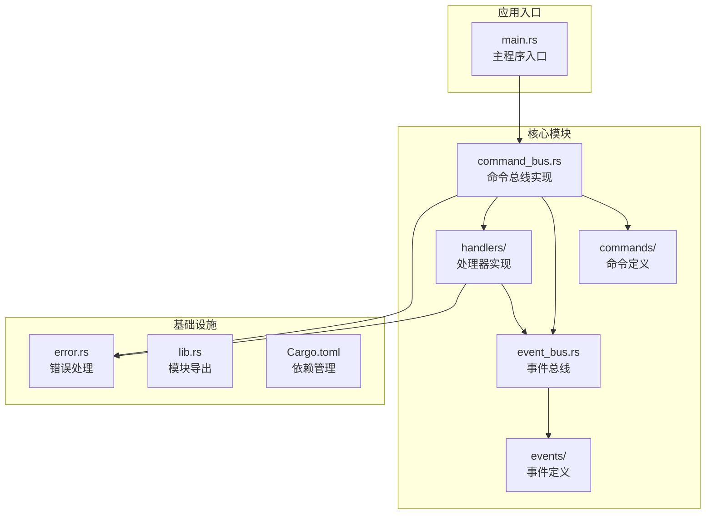
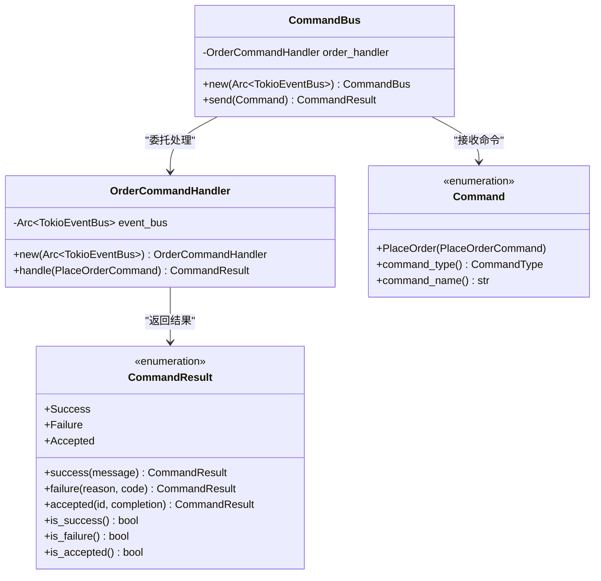
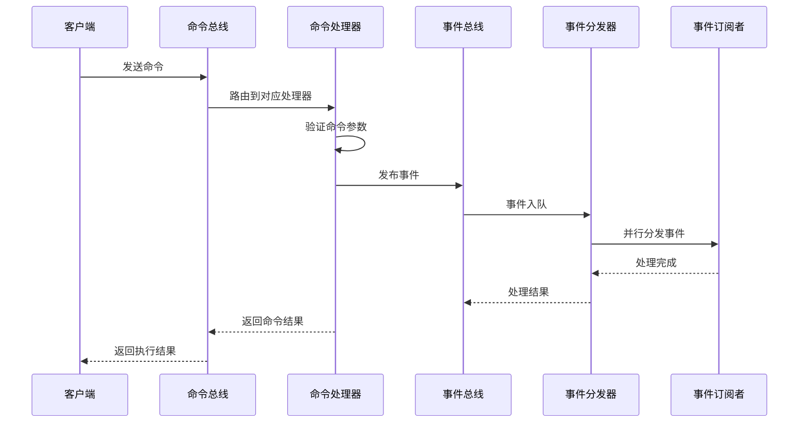
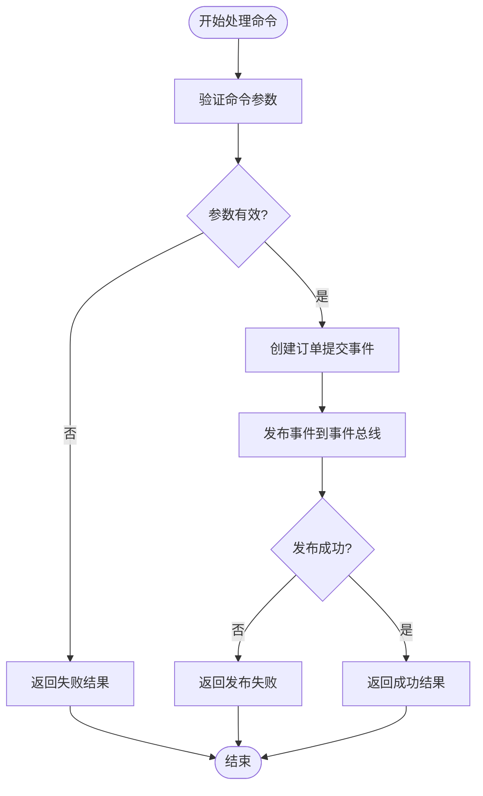
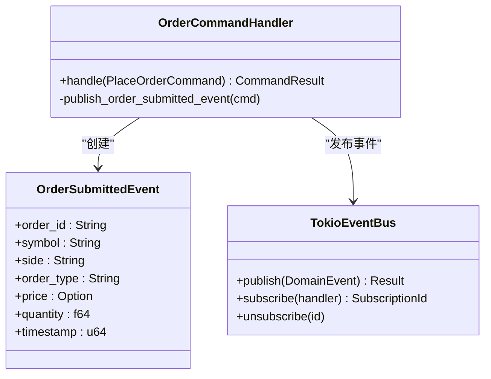
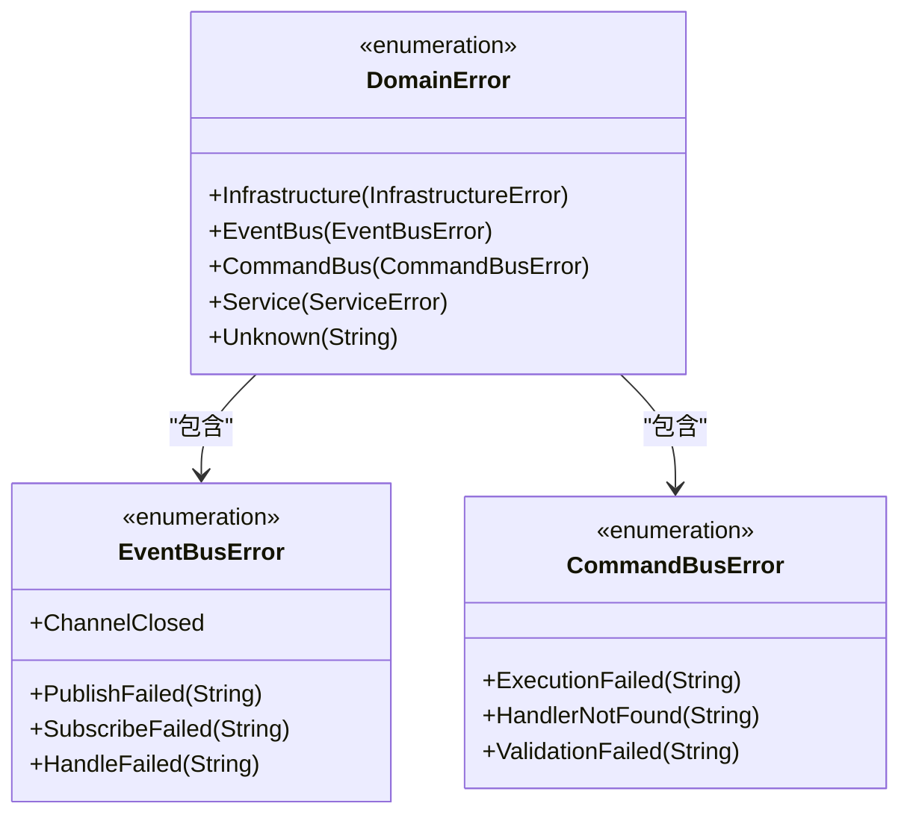
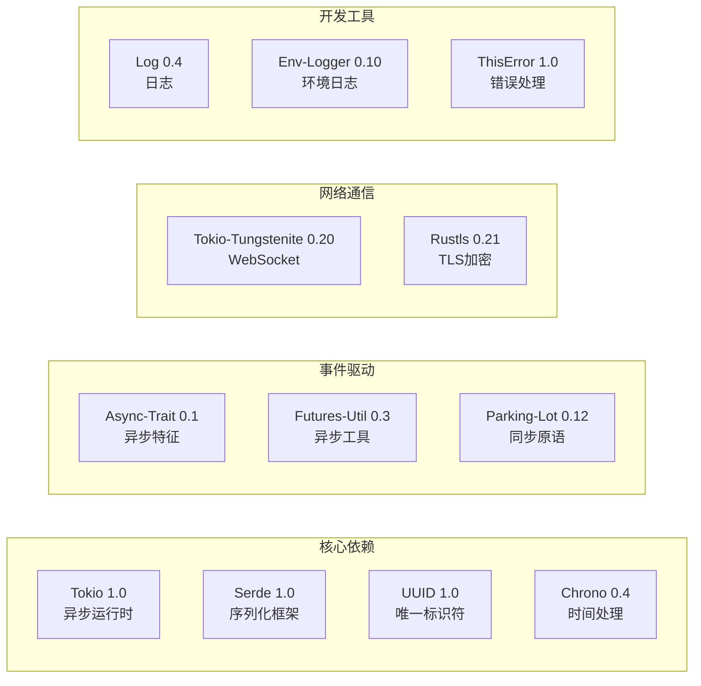
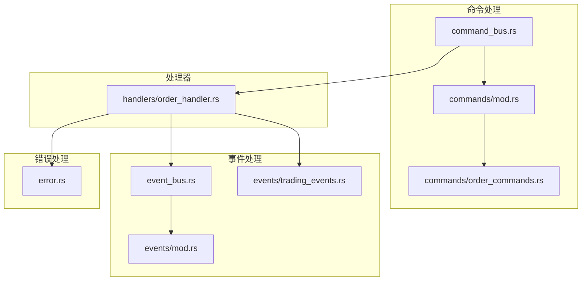

# 命令总线API

<cite>
**本文档引用的文件**
- [command_bus.rs](file://src/command_bus.rs)
- [commands/mod.rs](file://src/commands/mod.rs)
- [commands/order_commands.rs](file://src/commands/order_commands.rs)
- [handlers/order_handler.rs](file://src/handlers/order_handler.rs)
- [event_bus.rs](file://src/event_bus.rs)
- [events/mod.rs](file://src/events/mod.rs)
- [events/trading_events.rs](file://src/events/trading_events.rs)
- [error.rs](file://src/error.rs)
- [main.rs](file://src/main.rs)
- [lib.rs](file://src/lib.rs)
- [Cargo.toml](file://Cargo.toml)
</cite>

## 目录
1. [简介](#简介)
2. [项目结构](#项目结构)
3. [核心组件](#核心组件)
4. [架构概览](#架构概览)
5. [详细组件分析](#详细组件分析)
6. [依赖关系分析](#依赖关系分析)
7. [性能考虑](#性能考虑)
8. [故障排除指南](#故障排除指南)
9. [结论](#结论)

## 简介

本文件提供了Binance Rust事件驱动交易系统的命令总线API完整参考文档。命令总线作为系统的核心协调组件，负责接收、路由和执行各种业务命令，同时与事件总线紧密协作，实现命令-事件的解耦架构。

该系统采用现代化的Rust设计模式，支持异步处理、并发安全和类型安全的命令处理流程。命令总线API提供了简洁而强大的接口，使开发者能够轻松地创建、发送和处理各种交易相关的命令。

## 项目结构

项目采用模块化的架构设计，主要包含以下核心模块：

**图表来源**
- [lib.rs:1-9](file://src/lib.rs#L1-L9)
- [Cargo.toml:1-27](file://Cargo.toml#L1-L27)

**章节来源**
- [lib.rs:1-9](file://src/lib.rs#L1-L9)
- [Cargo.toml:1-27](file://Cargo.toml#L1-L27)

## 核心组件

### 命令总线(CommandBus)

命令总线是系统的核心协调器，负责接收和处理来自外部的命令请求。它提供了简单而强大的API接口，支持异步命令处理和并发执行。

#### 主要特性
- **异步处理**: 基于Tokio运行时的异步命令处理
- **类型安全**: 编译时保证命令类型的安全性
- **扩展性**: 易于添加新的命令类型和处理器
- **错误隔离**: 完善的错误处理和传播机制

#### 接口规范

**图表来源**
- [command_bus.rs:5-19](file://src/command_bus.rs#L5-L19)
- [commands/mod.rs:6-42](file://src/commands/mod.rs#L6-L42)

**章节来源**
- [command_bus.rs:1-19](file://src/command_bus.rs#L1-L19)
- [commands/mod.rs:6-42](file://src/commands/mod.rs#L6-L42)

### 命令类型定义

系统支持多种命令类型，当前主要实现下单命令：

#### 命令枚举(Command)
- **PlaceOrder**: 下单命令，包含完整的下单参数

#### 命令结果(CommandResult)
- **Success**: 命令执行成功，包含消息和可选数据
- **Failure**: 命令执行失败，包含错误原因和代码
- **Accepted**: 命令已被接受，包含跟踪ID和预计完成时间

**章节来源**
- [commands/mod.rs:6-77](file://src/commands/mod.rs#L6-L77)

## 架构概览

系统采用命令-事件分离的事件驱动架构，实现了高度解耦的设计：

**图表来源**
- [command_bus.rs:14-18](file://src/command_bus.rs#L14-L18)
- [handlers/order_handler.rs:102-135](file://src/handlers/order_handler.rs#L102-L135)
- [event_bus.rs:129-157](file://src/event_bus.rs#L129-L157)

## 详细组件分析

### 命令处理流程

#### 下单命令处理流程

**图表来源**
- [handlers/order_handler.rs:102-135](file://src/handlers/order_handler.rs#L102-L135)

#### 命令生命周期

1. **命令创建**: 通过工厂方法或构造函数创建命令对象
2. **命令发送**: 通过命令总线的send方法发送命令
3. **命令路由**: 命令总线根据命令类型路由到相应处理器
4. **命令执行**: 处理器执行业务逻辑并返回结果
5. **事件发布**: 处理器发布相关领域事件
6. **结果返回**: 命令总线返回最终执行结果

**章节来源**
- [handlers/order_handler.rs:102-135](file://src/handlers/order_handler.rs#L102-L135)

### 命令类型详解

#### PlaceOrderCommand 结构定义

| 字段名 | 数据类型 | 必填 | 描述 | 示例值 |
|--------|----------|------|------|--------|
| symbol | String | 是 | 交易对符号 | "BTCUSDT" |
| side | OrderSide | 是 | 订单方向 | Buy/Sell |
| order_type | OrderType | 是 | 订单类型 | Limit/Market/StopLoss/TakeProfit |
| price | Option<f64> | 可选 | 价格（限价单需要） | Some(50000.0) |
| quantity | f64 | 是 | 数量 | 0.001 |
| client_order_id | Option<String> | 可选 | 客户端订单ID | None |

#### 订单方向(OrderSide)
- **Buy**: 买入方向
- **Sell**: 卖出方向

#### 订单类型(OrderType)
- **Limit**: 限价单
- **Market**: 市价单
- **StopLoss**: 止损单
- **TakeProfit**: 止盈单

**章节来源**
- [commands/order_commands.rs:36-72](file://src/commands/order_commands.rs#L36-L72)
- [commands/order_commands.rs:3-24](file://src/commands/order_commands.rs#L3-L24)

### 事件总线集成

#### 事件发布流程

**图表来源**
- [handlers/order_handler.rs:120-129](file://src/handlers/order_handler.rs#L120-L129)
- [events/trading_events.rs:8-25](file://src/events/trading_events.rs#L8-L25)

**章节来源**
- [handlers/order_handler.rs:120-135](file://src/handlers/order_handler.rs#L120-L135)
- [events/trading_events.rs:8-25](file://src/events/trading_events.rs#L8-L25)

### 错误处理机制

#### 错误类型层次结构

**图表来源**
- [error.rs:12-34](file://src/error.rs#L12-L34)
- [error.rs:85-112](file://src/error.rs#L85-L112)

**章节来源**
- [error.rs:12-112](file://src/error.rs#L12-L112)

## 依赖关系分析

### 外部依赖

系统使用了现代化的Rust生态系统中的关键依赖：

**图表来源**
- [Cargo.toml:6-25](file://Cargo.toml#L6-L25)

### 内部模块依赖

**图表来源**
- [lib.rs:1-9](file://src/lib.rs#L1-L9)

**章节来源**
- [Cargo.toml:6-25](file://Cargo.toml#L6-L25)
- [lib.rs:1-9](file://src/lib.rs#L1-L9)

## 性能考虑

### 异步并发处理

系统采用基于Tokio的异步并发模型，具有以下性能特点：

- **非阻塞I/O**: 使用Tokio的异步运行时处理网络和文件操作
- **并行事件处理**: 事件分发器使用`join_all`并行处理多个事件处理器
- **零拷贝优化**: 使用Arc进行共享所有权，避免不必要的数据复制
- **内存池**: 使用广播通道进行事件分发，减少内存分配

### 内存管理

- **智能指针**: 广泛使用Arc进行共享所有权管理
- **无锁数据结构**: 使用parking_lot的RwLock实现高效的读写分离
- **延迟初始化**: 订阅ID按需生成，避免不必要的初始化开销

### 网络性能

- **WebSocket连接**: 使用Tokio-Tungstenite实现高效的WebSocket通信
- **TLS加密**: 支持Rustls提供高性能的TLS加密
- **连接池**: 支持多种连接模式（直连、代理、自动检测）

## 故障排除指南

### 常见问题及解决方案

#### 命令执行失败

**症状**: 命令返回Failure结果
**可能原因**:
- 参数验证失败
- 事件发布失败
- 处理器内部错误

**解决步骤**:
1. 检查命令参数的有效性
2. 查看事件总线的发布状态
3. 检查处理器的日志输出

#### 事件未被处理

**症状**: 订阅者未收到预期的事件
**可能原因**:
- 订阅ID无效
- 事件类型过滤
- 处理器未正确注册

**解决步骤**:
1. 验证订阅ID的正确性
2. 检查事件处理器的event_types实现
3. 确认处理器已正确注册到事件总线

#### 并发问题

**症状**: 事件处理出现竞态条件
**可能原因**:
- 共享状态访问冲突
- 锁竞争
- 死锁

**解决步骤**:
1. 检查共享状态的访问模式
2. 优化锁的粒度和持有时间
3. 避免嵌套锁的使用

**章节来源**
- [error.rs:85-112](file://src/error.rs#L85-L112)
- [event_bus.rs:129-157](file://src/event_bus.rs#L129-L157)

## 结论

命令总线API为Binance Rust事件驱动交易系统提供了强大而灵活的命令处理能力。通过采用现代的Rust设计模式和事件驱动架构，系统实现了高度的解耦、可扩展性和可靠性。

### 主要优势

1. **类型安全**: 编译时保证命令和事件的类型安全
2. **异步并发**: 基于Tokio的高性能异步处理
3. **事件驱动**: 完整的事件总线集成，支持复杂的业务流程
4. **错误隔离**: 完善的错误处理和传播机制
5. **易于扩展**: 模块化设计支持新功能的快速添加

### 未来发展方向

- 支持更多命令类型和处理器
- 实现命令执行状态查询功能
- 添加命令重试和补偿机制
- 增强监控和可观测性
- 优化性能和资源使用

该API为构建高性能、可扩展的金融交易系统奠定了坚实的基础，为开发者提供了清晰的接口和强大的功能支持。