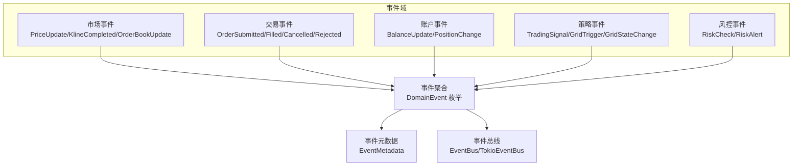
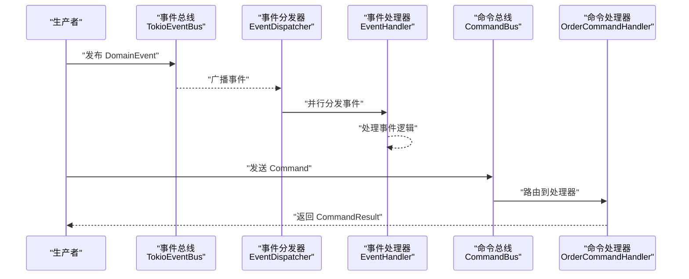
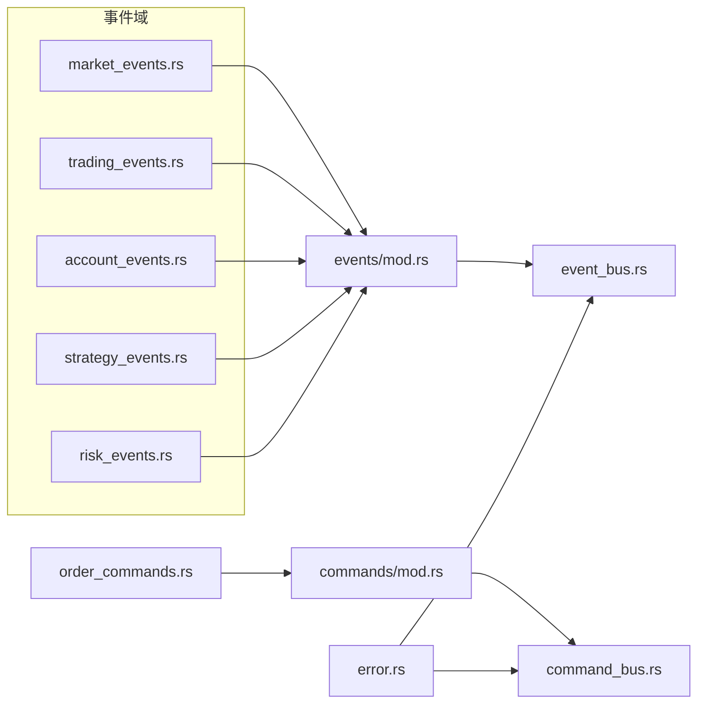

# 数据结构API

<cite>
**本文引用的文件**
- [src/lib.rs](file://src/lib.rs)
- [src/events/mod.rs](file://src/events/mod.rs)
- [src/events/market_events.rs](file://src/events/market_events.rs)
- [src/events/trading_events.rs](file://src/events/trading_events.rs)
- [src/events/account_events.rs](file://src/events/account_events.rs)
- [src/events/strategy_events.rs](file://src/events/strategy_events.rs)
- [src/events/risk_events.rs](file://src/events/risk_events.rs)
- [src/commands/mod.rs](file://src/commands/mod.rs)
- [src/commands/order_commands.rs](file://src/commands/order_commands.rs)
- [src/event_bus.rs](file://src/event_bus.rs)
- [src/command_bus.rs](file://src/command_bus.rs)
- [src/error.rs](file://src/error.rs)
- [Cargo.toml](file://Cargo.toml)
</cite>

## 目录
1. [简介](#简介)
2. [项目结构](#项目结构)
3. [核心组件](#核心组件)
4. [架构总览](#架构总览)
5. [详细组件分析](#详细组件分析)
6. [依赖关系分析](#依赖关系分析)
7. [性能考虑](#性能考虑)
8. [故障排查指南](#故障排查指南)
9. [结论](#结论)
10. [附录](#附录)

## 简介
本文件为该事件驱动系统的“数据结构API”完整参考文档，覆盖事件与命令的结构定义、错误类型层次、公共数据模型、序列化规范以及使用示例与最佳实践。读者可据此理解系统内所有领域事件、命令、错误类型及元数据的字段、语义与约束，并据此进行集成与扩展。

## 项目结构
该项目采用按职责分层的模块组织方式：
- 顶层模块导出各子模块，便于统一引入与使用
- 事件模块按业务域拆分（市场、交易、账户、策略、风控），并在事件总线中统一聚合
- 命令模块集中管理命令类型与命令结果
- 错误模块提供分层错误类型与统一错误出口
- 事件总线与命令总线负责事件/命令的发布、订阅与执行

图表来源
- [src/events/mod.rs:48-89](file://src/events/mod.rs#L48-L89)
- [src/event_bus.rs:18-29](file://src/event_bus.rs#L18-L29)

章节来源
- [src/lib.rs:1-9](file://src/lib.rs#L1-L9)
- [src/events/mod.rs:1-102](file://src/events/mod.rs#L1-L102)
- [src/event_bus.rs:1-257](file://src/event_bus.rs#L1-L257)

## 核心组件
本节概述系统中的核心数据结构与接口，包括事件、命令、错误与公共模型。

- 事件元数据 EventMetadata
  - 字段与类型：事件唯一标识、UTC 时间戳、版本字符串、关联ID、因果ID（可选）
  - 默认行为：构造时自动生成唯一ID、当前时间戳、默认版本号
  - 用途：跨事件追踪、事件溯源、审计与调试
- 统一事件枚举 DomainEvent
  - 结构：以标签化枚举形式承载各类事件负载
  - 分类：市场数据、交易、账户、策略、风控
  - 序列化：通过 serde 的 tag/content 方式输出
- 事件总线 EventBus
  - 接口：发布、订阅、取消订阅
  - 实现：TokioEventBus 基于广播通道，支持并发分发
- 命令与命令总线
  - 命令：当前包含下单命令 PlaceOrderCommand
  - 命令结果：统一 Success/Failure/Accepted 三态
  - 命令总线：根据命令类型路由到对应处理器

章节来源
- [src/events/mod.rs:21-46](file://src/events/mod.rs#L21-L46)
- [src/events/mod.rs:48-89](file://src/events/mod.rs#L48-L89)
- [src/event_bus.rs:18-29](file://src/event_bus.rs#L18-L29)
- [src/event_bus.rs:61-85](file://src/event_bus.rs#L61-L85)
- [src/commands/mod.rs:6-21](file://src/commands/mod.rs#L6-L21)
- [src/commands/mod.rs:23-42](file://src/commands/mod.rs#L23-L42)
- [src/command_bus.rs:5-19](file://src/command_bus.rs#L5-L19)

## 架构总览
下图展示事件与命令在系统中的流转路径与关键交互点。

图表来源
- [src/event_bus.rs:87-110](file://src/event_bus.rs#L87-L110)
- [src/event_bus.rs:112-158](file://src/event_bus.rs#L112-L158)
- [src/command_bus.rs:8-18](file://src/command_bus.rs#L8-L18)

## 详细组件分析

### 事件模型与字段定义

- 事件元数据 EventMetadata
  - 字段
    - event_id: 字符串，唯一标识
    - timestamp: UTC 时间戳
    - version: 字符串，版本号
    - correlation_id: 字符串（可选），用于关联一组事件
    - causation_id: 字符串（可选），指向触发该事件的上游事件
  - 约束
    - event_id 建议全局唯一
    - timestamp 使用 UTC，建议采用毫秒级时间戳
    - version 用于兼容性控制
  - 默认值：构造时自动生成 UUID、当前时间、默认版本号

- 统一事件枚举 DomainEvent
  - 结构：以 event_type 作为标签，payload 作为内容
  - 主要变体
    - 市场数据：PriceUpdate、KlineCompleted、OrderBookUpdate
    - 交易：OrderSubmitted、OrderFilled、OrderCancelled、OrderRejected
    - 账户：BalanceUpdate、PositionChange
    - 策略：TradingSignal、GridTrigger、GridStateChange
    - 风控：RiskCheck、RiskAlert
  - 约束
    - 每个 payload 事件均实现序列化
    - 事件类型与负载一一对应，便于反序列化定位

- 可存储事件 StorableEvent
  - 字段
    - sequence: u64，全局递增序号
    - stream_id: 字符串，聚合根标识
    - event: DomainEvent，事件负载
    - metadata: EventMetadata，事件元数据
  - 用途：事件溯源持久化

章节来源
- [src/events/mod.rs:21-46](file://src/events/mod.rs#L21-L46)
- [src/events/mod.rs:48-89](file://src/events/mod.rs#L48-L89)
- [src/events/mod.rs:91-102](file://src/events/mod.rs#L91-L102)

#### 市场数据事件
- PriceUpdateEvent
  - 字段：symbol、price、price_change_pct_24h、timestamp（毫秒）
  - 约束：price 与 price_change_pct_为数值；timestamp 为毫秒时间戳
- KlineCompletedEvent
  - 字段：symbol、interval、open、high、low、close、volume、close_time（毫秒）
  - 约束：interval 为 K 线周期字符串；close_time 为毫秒
- OrderBookUpdateEvent
  - 字段：symbol、best_bid、best_ask、bid_qty、ask_qty、timestamp（毫秒）
  - 约束：bid_qty/ask_qty 为数值；timestamp 为毫秒

章节来源
- [src/events/market_events.rs:7-18](file://src/events/market_events.rs#L7-L18)
- [src/events/market_events.rs:20-39](file://src/events/market_events.rs#L20-L39)
- [src/events/market_events.rs:41-56](file://src/events/market_events.rs#L41-L56)

#### 交易事件
- OrderSubmittedEvent
  - 字段：order_id、symbol、side、order_type、price（可选）、quantity、timestamp（毫秒）
  - 约束：limit 单 price 必填；market 单 price 为空
- OrderFilledEvent
  - 字段：order_id、fill_id、fill_price、fill_qty、commission、commission_asset、is_maker、timestamp（毫秒）
- OrderCancelledEvent
  - 字段：order_id、symbol、reason、timestamp（毫秒）
- OrderRejectedEvent
  - 字段：order_id（可选）、symbol、reason、error_code（可选）、timestamp（毫秒）

章节来源
- [src/events/trading_events.rs:8-25](file://src/events/trading_events.rs#L8-L25)
- [src/events/trading_events.rs:50-69](file://src/events/trading_events.rs#L50-L69)
- [src/events/trading_events.rs:71-82](file://src/events/trading_events.rs#L71-L82)
- [src/events/trading_events.rs:84-97](file://src/events/trading_events.rs#L84-L97)

#### 账户事件
- BalanceUpdateEvent
  - 字段：asset、available_balance、locked_balance、total_balance、timestamp（毫秒）
  - 约束：total_balance = available_balance + locked_balance
- PositionChangeEvent
  - 字段：symbol、side、quantity、entry_price、unrealized_pnl、leverage、timestamp（毫秒）

章节来源
- [src/events/account_events.rs:7-20](file://src/events/account_events.rs#L7-L20)
- [src/events/account_events.rs:37-54](file://src/events/account_events.rs#L37-L54)

#### 策略事件
- TradingSignalEvent
  - 字段：signal_id、strategy_id、symbol、signal_type、strength（0.0~1.0）、suggested_price、suggested_quantity（可选）、stop_loss_price（可选）、take_profit_price（可选）、timestamp（毫秒）
- GridTriggerEvent
  - 字段：grid_id、strategy_id、symbol、grid_level、trigger_price、action（Buy/Sell）、quantity、expected_profit、timestamp（毫秒）
- GridStateChangeEvent
  - 字段：strategy_id、symbol、old_state、new_state、reason、current_position、unrealized_pnl、timestamp（毫秒）

章节来源
- [src/events/strategy_events.rs:7-30](file://src/events/strategy_events.rs#L7-L30)
- [src/events/strategy_events.rs:32-53](file://src/events/strategy_events.rs#L32-L53)
- [src/events/strategy_events.rs:61-80](file://src/events/strategy_events.rs#L61-L80)

#### 风控事件
- RiskCheckEvent
  - 字段：check_id、check_type（CapitalAdequacy/PositionLimit/StopLoss/MarketVolatility/Liquidity）、result（Pass/Fail/Warning）、risk_level（Low/Medium/High/Critical）、risk_score（0.0~1.0）、details、timestamp（毫秒）
- RiskAlertEvent
  - 字段：alert_id、level（RiskLevel）、alert_type、message、triggered_rule、suggested_action（可选）、timestamp（毫秒）

章节来源
- [src/events/risk_events.rs:7-24](file://src/events/risk_events.rs#L7-L24)
- [src/events/risk_events.rs:26-53](file://src/events/risk_events.rs#L26-L53)
- [src/events/risk_events.rs:55-72](file://src/events/risk_events.rs#L55-L72)

### 命令模型与字段定义

- 命令 Command
  - 变体：PlaceOrder
  - 方法：command_type()、command_name()
- 命令类型 CommandType
  - 变体：PlaceOrder
- 命令结果 CommandResult
  - Success：message、data（可选）
  - Failure：reason、code
  - Accepted：tracking_id、estimated_completion（可选）
  - 辅助构造方法：success()/success_with_data()/failure()/accepted()
  - 判定方法：is_success()/is_failure()/is_accepted()

- 下单命令 PlaceOrderCommand
  - 字段：symbol、side（Buy/Sell）、order_type（Limit/Market/StopLoss/TakeProfit）、price（可选）、quantity、client_order_id（可选）
  - 构造辅助：buy_limit()/sell_limit()/with_client_order_id()

章节来源
- [src/commands/mod.rs:6-21](file://src/commands/mod.rs#L6-L21)
- [src/commands/mod.rs:23-42](file://src/commands/mod.rs#L23-L42)
- [src/commands/order_commands.rs:3-7](file://src/commands/order_commands.rs#L3-L7)
- [src/commands/order_commands.rs:18-24](file://src/commands/order_commands.rs#L18-L24)
- [src/commands/order_commands.rs:36-44](file://src/commands/order_commands.rs#L36-L44)
- [src/commands/order_commands.rs:45-72](file://src/commands/order_commands.rs#L45-L72)

### 错误类型层次结构

- 统一错误 DomainError
  - 分层来源：Infrastructure、EventBus、CommandBus、Service、Unknown
- 基础设施错误 InfrastructureError
  - 子类：Config、Io、Log、Database、LoggerInit
  - 工具方法：config_with_context()/io_with_operation()/log_operation()
- 事件总线错误 EventBusError
  - 子类：PublishFailed、SubscribeFailed、HandleFailed、ChannelClosed
- 命令总线错误 CommandBusError
  - 子类：ExecutionFailed、HandlerNotFound、ValidationFailed
- 领域服务错误 ServiceError
  - 子类：Order、Account、Risk、MarketData

章节来源
- [src/error.rs:12-34](file://src/error.rs#L12-L34)
- [src/error.rs:36-83](file://src/error.rs#L36-L83)
- [src/error.rs:85-99](file://src/error.rs#L85-L99)
- [src/error.rs:101-112](file://src/error.rs#L101-L112)
- [src/error.rs:114-128](file://src/error.rs#L114-L128)

### 公共数据结构与枚举

- 事件类型 EventType
  - 取值：PriceUpdate、KlineCompleted、OrderBookUpdate、OrderSubmitted、OrderFilled、OrderCancelled、OrderRejected、BalanceUpdate、PositionChange、TradingSignal、GridTrigger、GridStateChange、RiskCheck、RiskAlert、All
- 事件总线接口 EventBus
  - 方法：publish(event)、subscribe(handler)、unsubscribe(id)
- 事件处理器接口 EventHandler
  - 方法：handle(event)、event_types()
- 事件分发器 EventDispatcher
  - 方法：run()，并行分发事件给所有订阅处理器
- Tokio 事件总线 TokioEventBus
  - 字段：广播发送端、处理器映射、下一个订阅ID
  - 方法：new(capacity)、capacity()、publish()、subscribe()、unsubscribe()

章节来源
- [src/event_bus.rs:41-59](file://src/event_bus.rs#L41-L59)
- [src/event_bus.rs:18-39](file://src/event_bus.rs#L18-L39)
- [src/event_bus.rs:112-158](file://src/event_bus.rs#L112-L158)
- [src/event_bus.rs:61-85](file://src/event_bus.rs#L61-L85)

### 序列化与反序列化规范

- JSON 映射
  - DomainEvent：使用 serde 标签字段 event_type 与负载字段 payload
  - 各事件结构体：使用 serde 注解进行序列化/反序列化
- 时间戳格式
  - 事件时间戳多为毫秒级 Unix 时间戳（u64）
  - 元数据时间戳为 UTC 时间（DateTime<Utc>）
- 依赖库
  - serde/serde_json：结构体序列化
  - chrono：时间类型支持
  - uuid：生成唯一标识

章节来源
- [src/events/mod.rs:48-89](file://src/events/mod.rs#L48-L89)
- [src/events/market_events.rs:7-18](file://src/events/market_events.rs#L7-L18)
- [src/events/trading_events.rs:8-25](file://src/events/trading_events.rs#L8-L25)
- [src/events/account_events.rs:7-20](file://src/events/account_events.rs#L7-L20)
- [src/events/strategy_events.rs:7-30](file://src/events/strategy_events.rs#L7-L30)
- [src/events/risk_events.rs:7-24](file://src/events/risk_events.rs#L7-L24)
- [src/events/mod.rs:21-46](file://src/events/mod.rs#L21-L46)
- [Cargo.toml:6-25](file://Cargo.toml#L6-L25)

### 使用示例与最佳实践

- 发布事件
  - 构造具体事件（如 PriceUpdateEvent）并调用事件总线 publish
  - 使用 EventDispatcher.run() 并行分发事件
- 订阅事件
  - 实现 EventHandler trait，注册到 EventBus
  - 通过 EventType 过滤感兴趣事件
- 发送命令
  - 构造 PlaceOrderCommand，经 CommandBus.send() 提交
  - 根据 CommandResult 的状态进行后续处理
- 错误处理
  - 使用 DomainError 作为统一错误出口
  - 对基础设施、事件总线、命令总线、服务层错误进行分类处理
- 最佳实践
  - 事件字段尽量使用强类型与明确的单位（如价格 f64、数量 f64、时间戳 u64）
  - 使用 EventMetadata 进行事件追踪与审计
  - 对高吞吐场景使用并行分发与异步处理
  - 对命令执行结果进行幂等与重试策略设计

章节来源
- [src/event_bus.rs:119-158](file://src/event_bus.rs#L119-L158)
- [src/event_bus.rs:183-256](file://src/event_bus.rs#L183-L256)
- [src/command_bus.rs:8-18](file://src/command_bus.rs#L8-L18)
- [src/error.rs:129-132](file://src/error.rs#L129-L132)

## 依赖关系分析

图表来源
- [src/events/mod.rs:5-15](file://src/events/mod.rs#L5-L15)
- [src/event_bus.rs:5-16](file://src/event_bus.rs#L5-L16)
- [src/command_bus.rs:1-4](file://src/command_bus.rs#L1-L4)
- [src/commands/mod.rs:1-4](file://src/commands/mod.rs#L1-L4)
- [src/commands/order_commands.rs:1-72](file://src/commands/order_commands.rs#L1-L72)
- [src/error.rs:10-34](file://src/error.rs#L10-L34)

章节来源
- [src/events/mod.rs:1-15](file://src/events/mod.rs#L1-L15)
- [src/event_bus.rs:1-16](file://src/event_bus.rs#L1-L16)
- [src/command_bus.rs:1-4](file://src/command_bus.rs#L1-L4)
- [src/commands/mod.rs:1-4](file://src/commands/mod.rs#L1-L4)
- [src/commands/order_commands.rs:1-72](file://src/commands/order_commands.rs#L1-L72)
- [src/error.rs:10-34](file://src/error.rs#L10-L34)

## 性能考虑
- 异步与并行
  - 事件总线基于广播通道，分发阶段并行调用多个处理器
  - 建议处理器内部避免阻塞操作，必要时使用异步 I/O
- 缓冲与容量
  - TokioEventBus 支持设置通道容量，需结合吞吐量与内存预算评估
- 序列化开销
  - 事件与命令均采用 serde 序列化，建议在高频路径避免不必要的重复序列化
- 错误传播
  - 分发器捕获处理器错误并记录，不影响其他处理器的执行

章节来源
- [src/event_bus.rs:119-158](file://src/event_bus.rs#L119-L158)
- [src/event_bus.rs:61-85](file://src/event_bus.rs#L61-L85)

## 故障排查指南
- 发布失败
  - 现象：EventBusError::PublishFailed
  - 排查：检查通道容量、订阅者是否存活、网络/WS 连接状态
- 处理失败
  - 现象：EventBusError::HandleFailed
  - 排查：查看处理器日志、参数校验、外部依赖可用性
- 命令执行失败
  - 现象：CommandBusError::ExecutionFailed
  - 排查：确认命令参数、处理器是否存在、业务规则校验
- 验证失败
  - 现象：CommandBusError::ValidationFailed
  - 排查：检查必填字段、数值范围、枚举取值
- 通道关闭
  - 现象：EventBusError::ChannelClosed
  - 排查：重新订阅或重建事件总线实例

章节来源
- [src/error.rs:85-99](file://src/error.rs#L85-L99)
- [src/error.rs:101-112](file://src/error.rs#L101-L112)
- [src/event_bus.rs:88-93](file://src/event_bus.rs#L88-L93)

## 结论
本数据结构API文档系统性地梳理了事件、命令、错误与公共模型的定义与约束，明确了序列化规范与使用范式。建议在集成过程中严格遵循字段类型与约束，合理利用事件元数据进行追踪，并通过命令结果与错误类型进行可观测性与可靠性保障。

## 附录

### 事件类型与负载映射表
- PriceUpdate → PriceUpdateEvent
- KlineCompleted → KlineCompletedEvent
- OrderBookUpdate → OrderBookUpdateEvent
- OrderSubmitted → OrderSubmittedEvent
- OrderFilled → OrderFilledEvent
- OrderCancelled → OrderCancelledEvent
- OrderRejected → OrderRejectedEvent
- BalanceUpdate → BalanceUpdateEvent
- PositionChange → PositionChangeEvent
- TradingSignal → TradingSignalEvent
- GridTrigger → GridTriggerEvent
- GridStateChange → GridStateChangeEvent
- RiskCheck → RiskCheckEvent
- RiskAlert → RiskAlertEvent

章节来源
- [src/events/mod.rs:48-89](file://src/events/mod.rs#L48-L89)

### 命令与处理器映射
- PlaceOrder → OrderCommandHandler（通过 CommandBus 路由）

章节来源
- [src/commands/mod.rs:6-9](file://src/commands/mod.rs#L6-L9)
- [src/command_bus.rs:8-18](file://src/command_bus.rs#L8-L18)