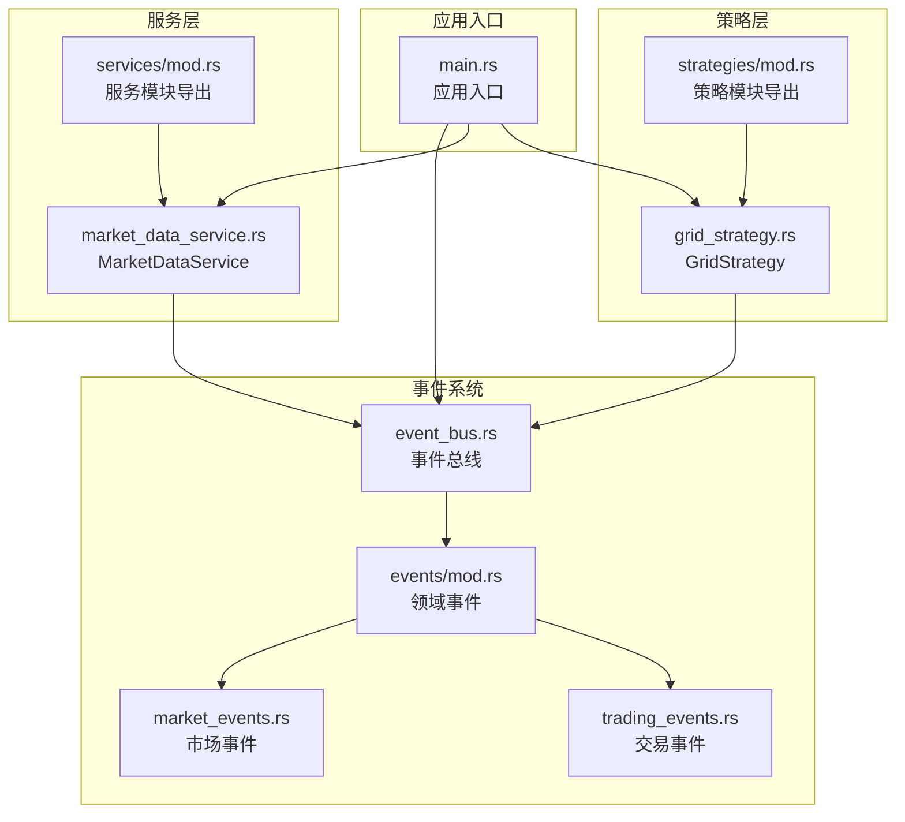
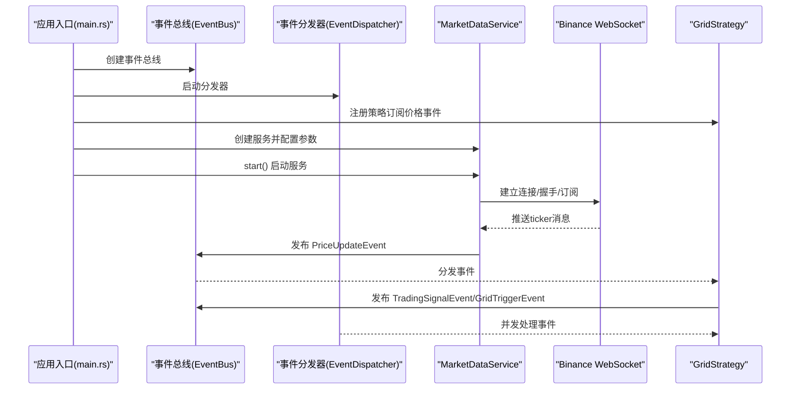
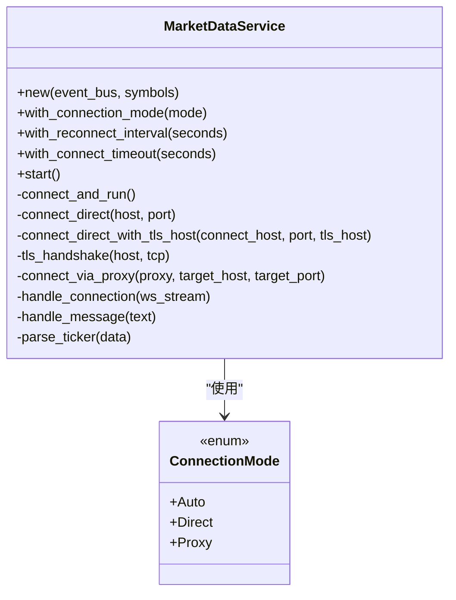
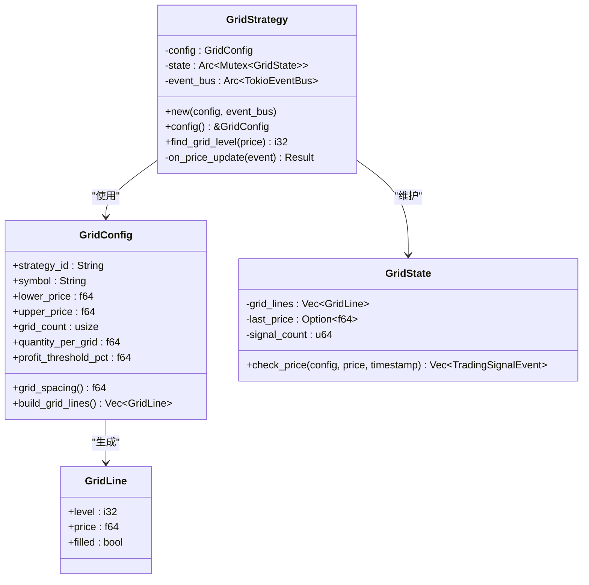
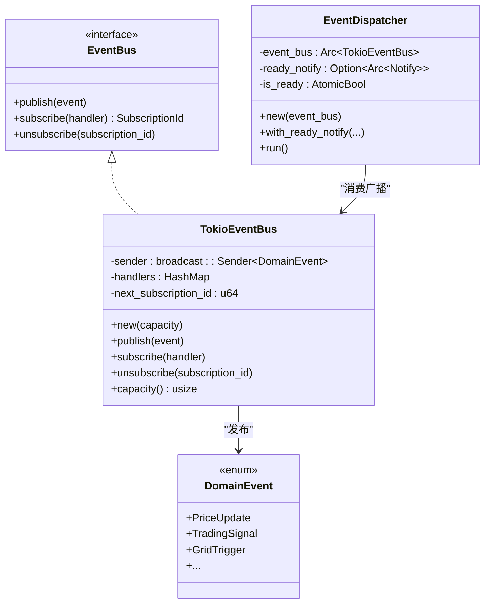
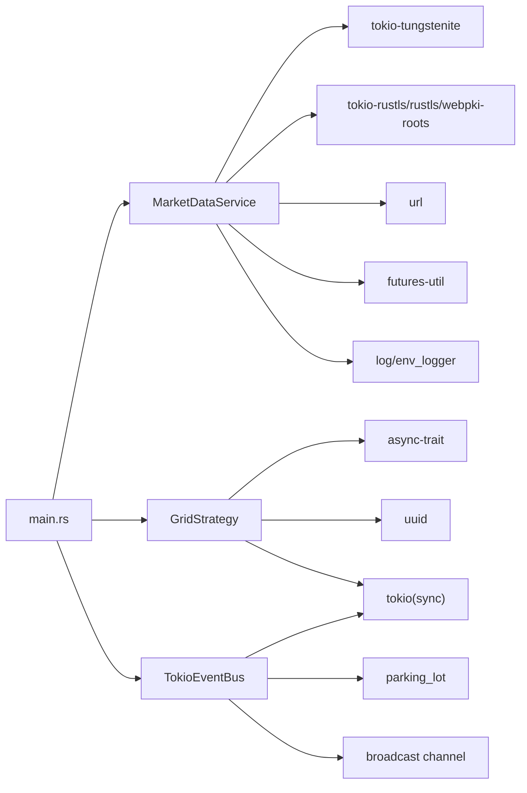

# 服务API

<cite>
**本文引用的文件**
- [market_data_service.rs](file://src/services/market_data_service.rs)
- [grid_strategy.rs](file://src/strategies/grid_strategy.rs)
- [event_bus.rs](file://src/event_bus.rs)
- [market_events.rs](file://src/events/market_events.rs)
- [trading_events.rs](file://src/events/trading_events.rs)
- [mod.rs（服务模块）](file://src/services/mod.rs)
- [mod.rs（策略模块）](file://src/strategies/mod.rs)
- [lib.rs](file://src/lib.rs)
- [main.rs](file://src/main.rs)
- [Cargo.toml](file://Cargo.toml)
</cite>

## 目录
1. [简介](#简介)
2. [项目结构](#项目结构)
3. [核心组件](#核心组件)
4. [架构总览](#架构总览)
5. [详细组件分析](#详细组件分析)
6. [依赖关系分析](#依赖关系分析)
7. [性能考虑](#性能考虑)
8. [故障排查指南](#故障排查指南)
9. [结论](#结论)
10. [附录](#附录)

## 简介
本文件为服务API的完整参考文档，聚焦以下能力：
- MarketDataService 的 WebSocket 连接管理API：连接建立、数据订阅、连接状态管理与自动重连机制
- 服务初始化参数：WebSocket端点URL、代理配置、连接超时设置等
- 网格策略API：GridStrategy 的配置参数、策略状态查询、参数动态调整方法
- 服务生命周期管理：启动、停止、暂停、恢复等操作
- 服务监控与诊断：连接状态检查、消息统计、错误报告
- 最佳实践与性能优化建议
- 使用示例：如何集成与使用各服务组件

## 项目结构
该项目采用“事件驱动”架构，围绕事件总线进行解耦，服务负责产生事件，策略订阅事件并生成交易信号，命令总线用于执行外部命令（示例中演示下单命令）。

图表来源
- [main.rs:1-93](file://src/main.rs#L1-L93)
- [event_bus.rs:1-257](file://src/event_bus.rs#L1-L257)
- [market_data_service.rs:1-503](file://src/services/market_data_service.rs#L1-L503)
- [grid_strategy.rs:1-401](file://src/strategies/grid_strategy.rs#L1-L401)
- [services/mod.rs:1-12](file://src/services/mod.rs#L1-L12)
- [strategies/mod.rs:1-8](file://src/strategies/mod.rs#L1-L8)
- [events/mod.rs:1-102](file://src/events/mod.rs#L1-L102)

章节来源
- [lib.rs:1-9](file://src/lib.rs#L1-L9)
- [Cargo.toml:1-27](file://Cargo.toml#L1-L27)

## 核心组件
- MarketDataService：负责连接Binance WebSocket，订阅ticker数据，解析并发布价格更新事件；支持自动重连、心跳保活、代理/直连模式切换。
- GridStrategy：基于价格区间构建网格，当价格穿越网格线时生成交易信号与网格触发事件；提供配置查询与网格级别定位。
- 事件总线：TokioEventBus 提供广播式事件发布/订阅，EventDispatcher 负责并发分发事件给订阅者。
- 领域事件：PriceUpdateEvent、TradingSignalEvent、GridTriggerEvent 等，作为策略与服务之间的契约数据结构。

章节来源
- [market_data_service.rs:34-440](file://src/services/market_data_service.rs#L34-L440)
- [grid_strategy.rs:156-278](file://src/strategies/grid_strategy.rs#L156-L278)
- [event_bus.rs:18-158](file://src/event_bus.rs#L18-L158)
- [market_events.rs:7-18](file://src/events/market_events.rs#L7-L18)
- [trading_events.rs:8-48](file://src/events/trading_events.rs#L8-L48)

## 架构总览
MarketDataService 通过 WebSocket 与 Binance 交互，解析消息后发布 PriceUpdateEvent；GridStrategy 订阅该事件，计算网格穿越并发布 TradingSignalEvent 与 GridTriggerEvent；命令总线用于演示外部命令下发（如下单）。

图表来源
- [main.rs:10-93](file://src/main.rs#L10-L93)
- [event_bus.rs:87-158](file://src/event_bus.rs#L87-L158)
- [market_data_service.rs:96-178](file://src/services/market_data_service.rs#L96-L178)
- [grid_strategy.rs:159-278](file://src/strategies/grid_strategy.rs#L159-L278)

## 详细组件分析

### MarketDataService：WebSocket 连接管理API
- 连接建立
  - 支持三种连接模式：Auto（优先使用HTTPS_PROXY）、Direct（直连）、Proxy（强制代理）
  - 支持通过环境变量控制：USE_SSH_TUNNEL（走本地9443，TLS校验仍指向stream.binance.com）
  - 支持HTTP CONNECT代理隧道，发送CONNECT请求并读取响应头
  - TLS握手使用rustls+webpki-roots，支持自定义超时
- 数据订阅
  - 单流：直接使用 stream 名称
  - 组合流：发送 SUBSCRIBE 请求，参数为多个 stream
  - 心跳：定时发送 Ping，自动回复 Pong
- 连接状态管理与自动重连
  - start() 循环尝试连接，失败按重连间隔等待后重试
  - handle_connection() 中断即退出循环，触发外层重新连接
- 参数与配置
  - with_connection_mode(mode)：设置连接模式
  - with_reconnect_interval(seconds)：设置重连间隔
  - with_connect_timeout(seconds)：设置连接/TLS/握手/代理超时
  - 内部根据环境变量自动选择端点（直连或SSH隧道）

图表来源
- [market_data_service.rs:23-440](file://src/services/market_data_service.rs#L23-L440)

章节来源
- [market_data_service.rs:53-114](file://src/services/market_data_service.rs#L53-L114)
- [market_data_service.rs:117-178](file://src/services/market_data_service.rs#L117-L178)
- [market_data_service.rs:180-301](file://src/services/market_data_service.rs#L180-L301)
- [market_data_service.rs:303-374](file://src/services/market_data_service.rs#L303-L374)
- [market_data_service.rs:376-440](file://src/services/market_data_service.rs#L376-L440)

### GridStrategy：网格策略API
- 配置参数
  - strategy_id：策略唯一标识
  - symbol：订阅的交易对
  - lower_price/upper_price：网格区间上下限
  - grid_count：网格数量
  - quantity_per_grid：每格交易数量
  - profit_threshold_pct：止盈阈值百分比（默认0.5%）
- 状态查询
  - config()：返回当前配置（不可变引用）
  - find_grid_level(price)：根据价格定位网格级别
- 参数动态调整
  - 当前实现未提供运行时动态调整配置的方法；如需调整，可在策略外部重建策略实例并重新注册订阅
- 策略行为
  - 监听 PriceUpdateEvent，若 symbol 匹配则计算穿越信号
  - 买入：价格从上方穿越网格线且未filled
  - 卖出：价格从下方穿越网格线且已filled
  - 发布 TradingSignalEvent 与 GridTriggerEvent

图表来源
- [grid_strategy.rs:26-81](file://src/strategies/grid_strategy.rs#L26-L81)
- [grid_strategy.rs:83-154](file://src/strategies/grid_strategy.rs#L83-L154)
- [grid_strategy.rs:159-278](file://src/strategies/grid_strategy.rs#L159-L278)

章节来源
- [grid_strategy.rs:45-81](file://src/strategies/grid_strategy.rs#L45-L81)
- [grid_strategy.rs:159-278](file://src/strategies/grid_strategy.rs#L159-L278)

### 事件总线与事件模型
- 事件总线
  - EventBus Trait：publish、subscribe、unsubscribe
  - TokioEventBus：基于广播通道，支持并发分发
  - EventDispatcher：订阅广播通道并并发调用各处理器
- 事件类型
  - PriceUpdateEvent：价格更新
  - TradingSignalEvent：交易信号
  - GridTriggerEvent：网格触发
  - 其他市场/交易/风控事件
- 事件序列化
  - 所有事件均实现 serde 的 Serialize/Deserialize

图表来源
- [event_bus.rs:18-158](file://src/event_bus.rs#L18-L158)
- [events/mod.rs:48-89](file://src/events/mod.rs#L48-L89)

章节来源
- [event_bus.rs:18-158](file://src/event_bus.rs#L18-L158)
- [events/mod.rs:48-89](file://src/events/mod.rs#L48-L89)

### 服务生命周期管理
- MarketDataService
  - 启动：start() 循环尝试连接，失败按重连间隔等待
  - 停止：当前实现未提供显式停止方法；示例通过任务abort中断
  - 暂停/恢复：未提供；可通过外部控制任务生命周期实现
- GridStrategy
  - 注册：通过事件总线 subscribe 订阅 PriceUpdate 事件
  - 取消：unsubscribe 取消订阅
- 命令总线（示例）
  - 示例展示了命令总线的使用方式，便于扩展外部命令执行

章节来源
- [market_data_service.rs:96-114](file://src/services/market_data_service.rs#L96-L114)
- [main.rs:58-93](file://src/main.rs#L58-L93)
- [event_bus.rs:95-110](file://src/event_bus.rs#L95-L110)

### 服务监控与诊断API
- 连接状态检查
  - 日志输出连接/握手/代理/心跳等关键步骤
  - 通过心跳 Ping/Pong 与 Close 消息判断连接健康
- 消息统计
  - parse_ticker 对 ticker 数据进行解析并发布事件
  - 可通过事件总线容量 capacity() 了解队列积压情况
- 错误报告
  - 统一的 DomainError/ServiceError 包装，便于上层捕获与上报
  - handle_message 中 JSON 解析失败、字段缺失等错误路径清晰

章节来源
- [market_data_service.rs:167-178](file://src/services/market_data_service.rs#L167-L178)
- [market_data_service.rs:303-374](file://src/services/market_data_service.rs#L303-L374)
- [event_bus.rs:81-84](file://src/event_bus.rs#L81-L84)

## 依赖关系分析
- 运行时依赖
  - tokio（full 特性）、tokio-tungstenite、futures-util、url、tokio-rustls、rustls、webpki-roots、log、env_logger、chrono、async-trait、uuid、thiserror、config、parking_lot、dashmap
- 模块导出
  - services/mod.rs 导出 ConnectionMode 与 MarketDataService
  - strategies/mod.rs 导出 GridStrategy

图表来源
- [Cargo.toml:6-25](file://Cargo.toml#L6-L25)
- [market_data_service.rs:6-21](file://src/services/market_data_service.rs#L6-L21)
- [grid_strategy.rs:6-13](file://src/strategies/grid_strategy.rs#L6-L13)
- [event_bus.rs:7-10](file://src/event_bus.rs#L7-L10)

章节来源
- [Cargo.toml:6-25](file://Cargo.toml#L6-L25)
- [services/mod.rs:9-12](file://src/services/mod.rs#L9-L12)
- [strategies/mod.rs:5-8](file://src/strategies/mod.rs#L5-L8)

## 性能考虑
- 连接与握手
  - 合理设置 connect_timeout，避免长时间阻塞
  - 代理模式下 CONNECT 隧道建立耗时较长，建议在部署环境预热
- 心跳与保活
  - 30秒心跳频率适中，可根据网络质量调整
  - Ping/Pong 自动处理，减少手动逻辑
- 事件分发
  - 并发分发所有处理器，注意处理器内部的串行化与锁竞争
  - broadcast 队列容量 capacity() 反映积压，建议监控并扩容
- 网格计算
  - 网格数量与价格精度影响计算复杂度，建议在策略初始化时完成网格构建
- I/O 与内存
  - 使用 Arc + Mutex 管理策略状态，避免频繁拷贝
  - 事件序列化/反序列化开销较小，建议保持默认 serde 配置

[本节为通用性能建议，无需特定文件引用]

## 故障排查指南
- 连接失败
  - 检查 HTTPS_PROXY/https_proxy 环境变量是否正确设置（代理模式）
  - 检查 connect_timeout 是否过短
  - 检查 USE_SSH_TUNNEL 是否启用以及本地9443可达
- 握手失败
  - TLS 校验失败通常与证书链有关，确认 webpki-roots 可用
- 代理隧道
  - CONNECT 响应非200会报错；检查代理服务器可用性与认证
- 心跳异常
  - 若长时间无 Ping/Pong，检查网络质量与防火墙
- 事件未到达
  - 确认订阅是否成功（subscribe 返回的订阅ID）
  - 检查 EventDispatcher 是否已就绪（ready_notify）
- 网格无信号
  - 确认 PriceUpdateEvent 的 symbol 与策略配置一致
  - 检查 last_price 初始值导致的第一次穿越判定

章节来源
- [market_data_service.rs:149-301](file://src/services/market_data_service.rs#L149-L301)
- [event_bus.rs:129-158](file://src/event_bus.rs#L129-L158)
- [grid_strategy.rs:189-252](file://src/strategies/grid_strategy.rs#L189-L252)

## 结论
本项目以事件驱动为核心，MarketDataService 与 GridStrategy 分别承担“数据接入”与“策略计算”的职责，配合事件总线实现松耦合扩展。通过清晰的连接模式、心跳保活与自动重连机制，保证了实时行情的稳定性；通过事件模型与策略模块化设计，便于后续扩展风控、账户同步与命令执行等能力。

[本节为总结性内容，无需特定文件引用]

## 附录

### 使用示例：集成与使用
- 初始化事件总线与分发器
  - 创建 TokioEventBus，启动 EventDispatcher.run()
- 注册网格策略
  - 构造 GridConfig，创建 GridStrategy，并通过事件总线 subscribe
- 启动市场数据服务
  - 构造 MarketDataService，设置连接模式与超时，调用 start()
- 命令总线（示例）
  - 构造 CommandBus，发送下单命令并查看结果

章节来源
- [main.rs:14-93](file://src/main.rs#L14-L93)

### API清单与最佳实践
- MarketDataService
  - 连接模式：Auto/Direct/Proxy
  - 超时设置：connect_timeout
  - 重连间隔：reconnect_interval
  - 代理：HTTPS_PROXY/https_proxy
  - SSH隧道：USE_SSH_TUNNEL
  - 最佳实践：生产环境建议 Direct；代理环境设置代理变量；合理设置超时与重连间隔
- GridStrategy
  - 配置项：strategy_id/symbol/lower/upper/grid_count/quantity/profit_threshold
  - 查询：config()、find_grid_level()
  - 最佳实践：策略初始化时一次性构建网格；避免在热路径频繁重建

章节来源
- [market_data_service.rs:78-94](file://src/services/market_data_service.rs#L78-L94)
- [grid_strategy.rs:45-63](file://src/strategies/grid_strategy.rs#L45-L63)