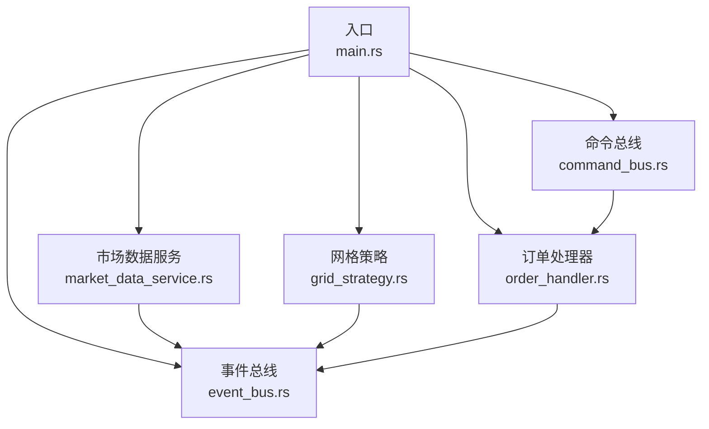
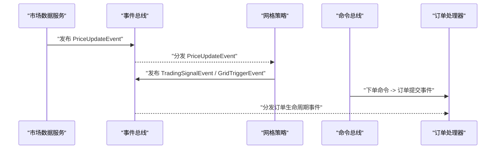
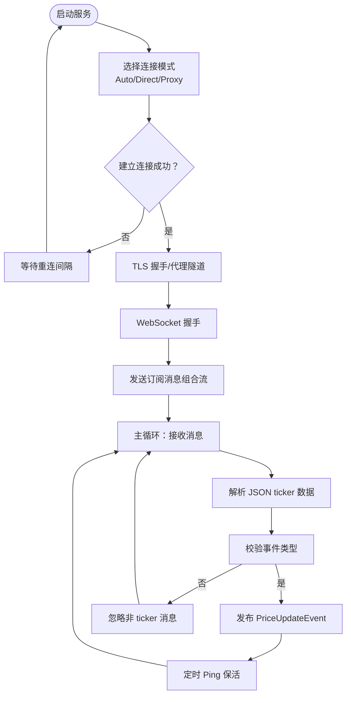
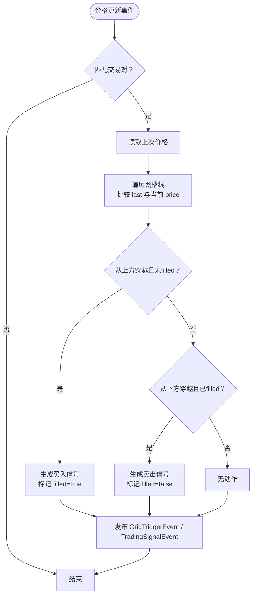
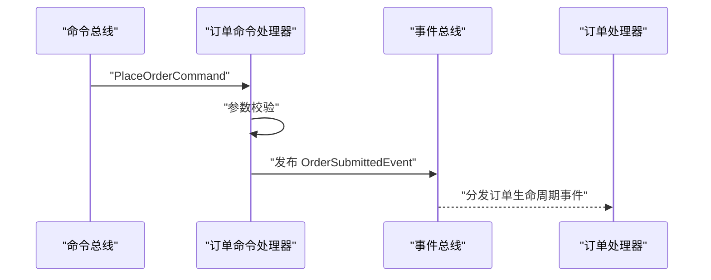
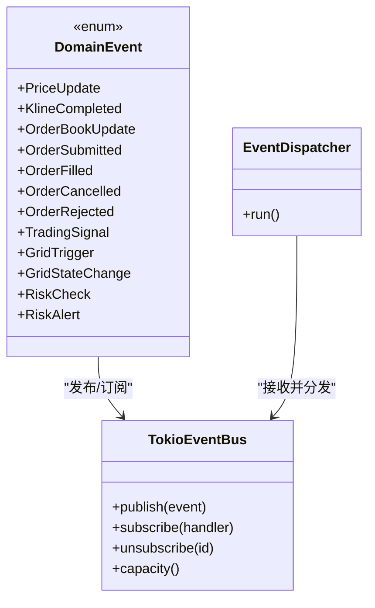
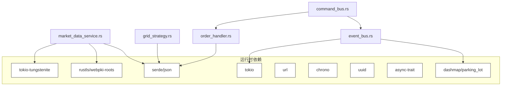

# 业务服务

<cite>
**本文引用的文件**
- [src/lib.rs](file://src/lib.rs)
- [src/main.rs](file://src/main.rs)
- [src/services/market_data_service.rs](file://src/services/market_data_service.rs)
- [src/strategies/grid_strategy.rs](file://src/strategies/grid_strategy.rs)
- [src/handlers/order_handler.rs](file://src/handlers/order_handler.rs)
- [src/event_bus.rs](file://src/event_bus.rs)
- [src/error.rs](file://src/error.rs)
- [src/commands/mod.rs](file://src/commands/mod.rs)
- [src/commands/order_commands.rs](file://src/commands/order_commands.rs)
- [src/events/mod.rs](file://src/events/mod.rs)
- [src/events/market_events.rs](file://src/events/market_events.rs)
- [src/events/trading_events.rs](file://src/events/trading_events.rs)
- [src/events/strategy_events.rs](file://src/events/strategy_events.rs)
- [Cargo.toml](file://Cargo.toml)
</cite>

## 目录
1. [简介](#简介)
2. [项目结构](#项目结构)
3. [核心组件](#核心组件)
4. [架构总览](#架构总览)
5. [详细组件分析](#详细组件分析)
6. [依赖关系分析](#依赖关系分析)
7. [性能考虑](#性能考虑)
8. [故障排查指南](#故障排查指南)
9. [结论](#结论)
10. [附录](#附录)

## 简介
本文件面向业务服务层，系统性梳理 Binance Rust 事件驱动交易系统中的业务服务与策略能力，重点覆盖：
- 市场数据服务：WebSocket 连接管理、实时数据解析、事件发布、网络异常与自动重连机制
- 网格策略引擎：网格配置参数、价格区间设置、订单簿管理（概念）、风险控制机制（概念）、收益计算（概念）
- 订单处理服务：订单类型支持、执行算法（概念）、滑点处理（概念）、手续费计算（概念）
- 服务配置选项、性能调优建议与监控指标
- 服务间数据流转与业务规则约束

## 项目结构
该仓库采用模块化组织，围绕“事件总线”为中心，形成事件驱动的解耦架构：
- lib.rs 汇总导出各子模块
- main.rs 作为入口，演示事件总线、命令总线、市场数据服务与网格策略的集成
- services 提供市场数据服务
- strategies 提供网格策略
- handlers 提供订单处理服务
- events 定义领域事件
- commands 定义命令与命令结果
- infrastructure 提供基础设施（错误、日志等）

图表来源
- [src/main.rs:10-93](file://src/main.rs#L10-L93)
- [src/lib.rs:1-9](file://src/lib.rs#L1-L9)

章节来源
- [src/lib.rs:1-9](file://src/lib.rs#L1-L9)
- [src/main.rs:10-93](file://src/main.rs#L10-L93)

## 核心组件
- 事件总线与事件模型：统一的 DomainEvent 枚举与 TokioEventBus 广播分发，支持并行处理多个处理器
- 市场数据服务：负责连接 Binance WebSocket，解析 ticker 数据，发布 PriceUpdateEvent
- 网格策略：监听价格事件，按网格区间生成 TradingSignalEvent 与 GridTriggerEvent
- 订单处理：处理订单生命周期事件（提交、成交、取消、拒绝），并支持下单命令
- 错误体系：分层错误类型，统一返回 DomainError

章节来源
- [src/event_bus.rs:18-110](file://src/event_bus.rs#L18-L110)
- [src/events/mod.rs:48-89](file://src/events/mod.rs#L48-L89)
- [src/services/market_data_service.rs:34-440](file://src/services/market_data_service.rs#L34-L440)
- [src/strategies/grid_strategy.rs:156-278](file://src/strategies/grid_strategy.rs#L156-L278)
- [src/handlers/order_handler.rs:9-91](file://src/handlers/order_handler.rs#L9-L91)
- [src/error.rs:12-34](file://src/error.rs#L12-L34)

## 架构总览
系统采用事件驱动架构：市场数据服务产生 PriceUpdateEvent，网格策略订阅并生成 TradingSignalEvent/GridTriggerEvent，命令总线接收下单命令并发布 OrderSubmittedEvent，订单处理器消费订单事件。

图表来源
- [src/services/market_data_service.rs:376-407](file://src/services/market_data_service.rs#L376-L407)
- [src/strategies/grid_strategy.rs:189-252](file://src/strategies/grid_strategy.rs#L189-L252)
- [src/handlers/order_handler.rs:68-91](file://src/handlers/order_handler.rs#L68-L91)
- [src/command_bus.rs:14-18](file://src/command_bus.rs#L14-L18)

## 详细组件分析

### 市场数据服务（WebSocket 实时行情）
- 连接模式与代理支持
  - 支持 Auto/Direct/Proxy 三种模式；可通过环境变量 HTTPS_PROXY 控制代理；支持 SSH 隧道模式（本地端口转发，TLS 主机名仍指向 stream.binance.com）
- 连接与握手
  - 使用 rustls 进行 TLS 握手，支持直连与代理 CONNECT 隧道；握手与连接均设置超时
- 消息订阅与心跳
  - 组合流与单流两种订阅方式；定时 Ping/Pong 保活
- 数据解析与事件发布
  - 解析 Binance ticker 数据，提取 symbol、price、24h 涨跌幅与时间戳，封装为 PriceUpdateEvent 并发布
- 自动重连与异常处理
  - start 循环尝试连接，失败后按固定间隔重连；连接过程出现错误会记录并等待重连

图表来源
- [src/services/market_data_service.rs:96-114](file://src/services/market_data_service.rs#L96-L114)
- [src/services/market_data_service.rs:117-178](file://src/services/market_data_service.rs#L117-L178)
- [src/services/market_data_service.rs:303-374](file://src/services/market_data_service.rs#L303-L374)
- [src/services/market_data_service.rs:376-407](file://src/services/market_data_service.rs#L376-L407)

章节来源
- [src/services/market_data_service.rs:23-42](file://src/services/market_data_service.rs#L23-L42)
- [src/services/market_data_service.rs:53-76](file://src/services/market_data_service.rs#L53-L76)
- [src/services/market_data_service.rs:117-178](file://src/services/market_data_service.rs#L117-L178)
- [src/services/market_data_service.rs:303-374](file://src/services/market_data_service.rs#L303-L374)
- [src/services/market_data_service.rs:376-407](file://src/services/market_data_service.rs#L376-L407)

### 网格策略引擎（核心算法）
- 网格配置参数
  - 策略 ID、交易对、区间上下限、网格数量、每格数量、利润阈值百分比
- 价格区间与网格线
  - 网格间距 = (upper - lower) / grid_count；生成从 0 到 grid_count 的网格线，初始 filled=false
- 价格穿越检测与信号生成
  - 价格从高往低穿越网格线且该格未 filled → 生成买入信号（含止损、止盈建议）
  - 价格从低往高穿越网格线且该格已 filled → 生成卖出信号（清仓）
- 事件发布
  - 发布 GridTriggerEvent 与 TradingSignalEvent；同时记录信号计数与网格级别映射
- 风险控制与收益计算（概念）
  - 止损/止盈建议基于网格价格与配置参数推导；当前实现打印信号，未执行下单

图表来源
- [src/strategies/grid_strategy.rs:189-252](file://src/strategies/grid_strategy.rs#L189-L252)
- [src/strategies/grid_strategy.rs:102-153](file://src/strategies/grid_strategy.rs#L102-L153)
- [src/strategies/grid_strategy.rs:254-261](file://src/strategies/grid_strategy.rs#L254-L261)

章节来源
- [src/strategies/grid_strategy.rs:26-81](file://src/strategies/grid_strategy.rs#L26-L81)
- [src/strategies/grid_strategy.rs:156-278](file://src/strategies/grid_strategy.rs#L156-L278)

### 订单处理服务（业务逻辑）
- 订单生命周期事件处理
  - 订单提交：记录订单信息
  - 订单成交：记录成交详情与手续费
  - 订单取消：记录取消原因
  - 订单拒绝：记录拒绝原因
- 下单命令处理
  - 参数校验（数量>0）
  - 发布 OrderSubmittedEvent
  - 返回 CommandResult（成功/失败/受理）

图表来源
- [src/handlers/order_handler.rs:68-91](file://src/handlers/order_handler.rs#L68-L91)
- [src/handlers/order_handler.rs:102-135](file://src/handlers/order_handler.rs#L102-L135)
- [src/command_bus.rs:14-18](file://src/command_bus.rs#L14-L18)

章节来源
- [src/handlers/order_handler.rs:9-91](file://src/handlers/order_handler.rs#L9-L91)
- [src/commands/mod.rs:6-77](file://src/commands/mod.rs#L6-L77)
- [src/commands/order_commands.rs:36-72](file://src/commands/order_commands.rs#L36-L72)

### 事件模型与数据流转
- 事件类型
  - 市场数据：PriceUpdate、KlineCompleted、OrderBookUpdate
  - 交易：OrderSubmitted、OrderFilled、OrderCancelled、OrderRejected
  - 策略：TradingSignal、GridTrigger、GridStateChange
  - 风控：RiskCheck、RiskAlert
- 事件总线
  - 广播通道，支持并行分发至多个处理器
  - 支持订阅/取消订阅与容量管理

图表来源
- [src/events/mod.rs:48-89](file://src/events/mod.rs#L48-L89)
- [src/event_bus.rs:62-110](file://src/event_bus.rs#L62-L110)
- [src/event_bus.rs:112-158](file://src/event_bus.rs#L112-L158)

章节来源
- [src/events/mod.rs:17-102](file://src/events/mod.rs#L17-L102)
- [src/event_bus.rs:18-110](file://src/event_bus.rs#L18-L110)

## 依赖关系分析
- 运行时依赖
  - tokio（full）、tokio-tungstenite、futures-util、rustls/webpki-roots、serde/serde_json、url、chrono、uuid、async-trait、dashmap、parking_lot
- 模块间耦合
  - 事件总线为核心枢纽，服务与策略通过事件解耦
  - 命令总线与处理器通过事件进行最终落地

图表来源
- [Cargo.toml:6-25](file://Cargo.toml#L6-L25)
- [src/services/market_data_service.rs:6-21](file://src/services/market_data_service.rs#L6-L21)
- [src/strategies/grid_strategy.rs:6-13](file://src/strategies/grid_strategy.rs#L6-L13)
- [src/handlers/order_handler.rs:1-7](file://src/handlers/order_handler.rs#L1-L7)
- [src/event_bus.rs:5-11](file://src/event_bus.rs#L5-L11)
- [src/command_bus.rs:1-5](file://src/command_bus.rs#L1-L5)

章节来源
- [Cargo.toml:6-25](file://Cargo.toml#L6-L25)

## 性能考虑
- 事件总线
  - 使用广播通道，支持并行处理多个处理器；可通过调整容量与处理器数量平衡吞吐与延迟
- WebSocket 连接
  - 合理设置连接超时与重连间隔；组合流订阅减少连接数
- 网格策略
  - 网格数量与价格步长影响 CPU 占用；建议根据市场波动率动态调整
- 订单处理
  - 事件处理链路尽量无阻塞；持久化与外部调用建议异步化

## 故障排查指南
- 常见错误类型
  - 基础设施错误：配置、IO、日志、数据库
  - 事件总线错误：发布失败、订阅失败、处理失败、通道关闭
  - 命令总线错误：执行失败、处理器未找到、验证失败
  - 服务错误：订单、账户、风控、市场数据
- 排查步骤
  - 检查网络与代理设置（HTTPS_PROXY、USE_SSH_TUNNEL）
  - 查看 WebSocket 握手与心跳日志
  - 核对事件序列与处理器订阅情况
  - 检查命令参数与返回的 CommandResult

章节来源
- [src/error.rs:12-128](file://src/error.rs#L12-L128)
- [src/services/market_data_service.rs:117-178](file://src/services/market_data_service.rs#L117-L178)
- [src/handlers/order_handler.rs:102-135](file://src/handlers/order_handler.rs#L102-L135)

## 结论
本系统以事件总线为核心，实现了市场数据接入、策略信号生成与订单生命周期管理的解耦设计。市场数据服务具备完善的连接、解析与重连机制；网格策略提供清晰的配置与信号生成流程；订单处理服务支持命令式下单与事件式落地。建议在生产环境中结合容量与并发需求优化事件总线与处理器配置，并完善风控与收益计算模块以支撑实盘交易。

## 附录

### 服务配置选项与环境变量
- 连接模式
  - Auto：优先使用 HTTPS_PROXY 环境变量
  - Direct：强制直连
  - Proxy：强制使用代理（需设置 HTTPS_PROXY）
- 代理与隧道
  - HTTPS_PROXY 或 https_proxy：HTTP 代理地址
  - USE_SSH_TUNNEL：启用 SSH 隧道（本地端口 9443，TLS 主机名 stream.binance.com）
- 重连与超时
  - 重连间隔：默认 5 秒
  - 连接/握手/读写超时：默认 30 秒

章节来源
- [src/services/market_data_service.rs:23-42](file://src/services/market_data_service.rs#L23-L42)
- [src/services/market_data_service.rs:53-94](file://src/services/market_data_service.rs#L53-L94)
- [src/services/market_data_service.rs:138-147](file://src/services/market_data_service.rs#L138-L147)

### 事件与命令参考
- 事件类型
  - 市场数据：PriceUpdate、KlineCompleted、OrderBookUpdate
  - 交易：OrderSubmitted、OrderFilled、OrderCancelled、OrderRejected
  - 策略：TradingSignal、GridTrigger、GridStateChange
  - 风控：RiskCheck、RiskAlert
- 命令类型
  - PlaceOrder：支持 Limit/Market/StopLoss/TakeProfit

章节来源
- [src/events/mod.rs:48-89](file://src/events/mod.rs#L48-L89)
- [src/commands/mod.rs:6-27](file://src/commands/mod.rs#L6-L27)
- [src/commands/order_commands.rs:3-35](file://src/commands/order_commands.rs#L3-L35)