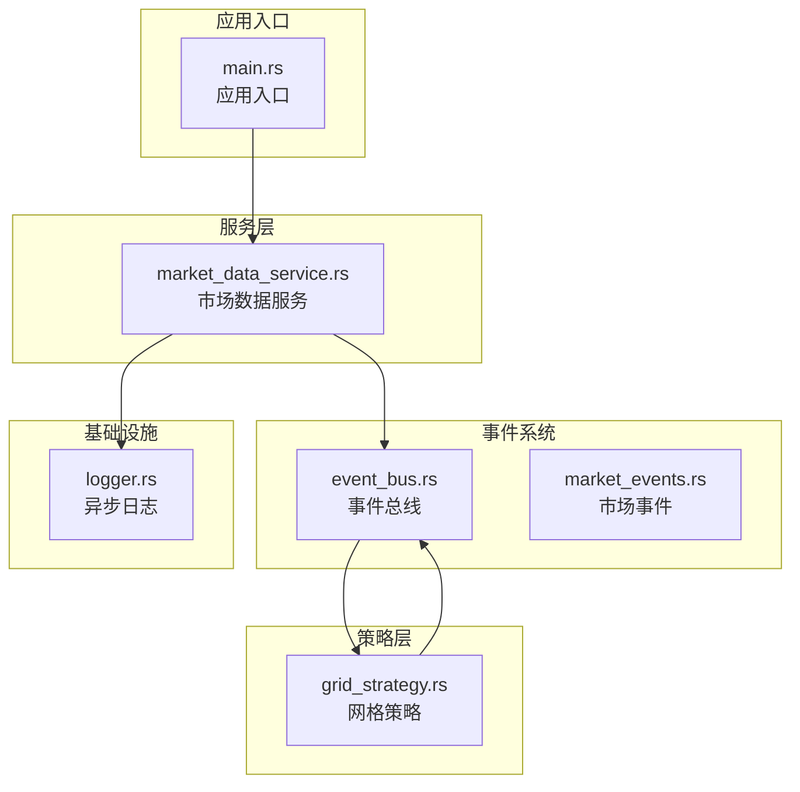
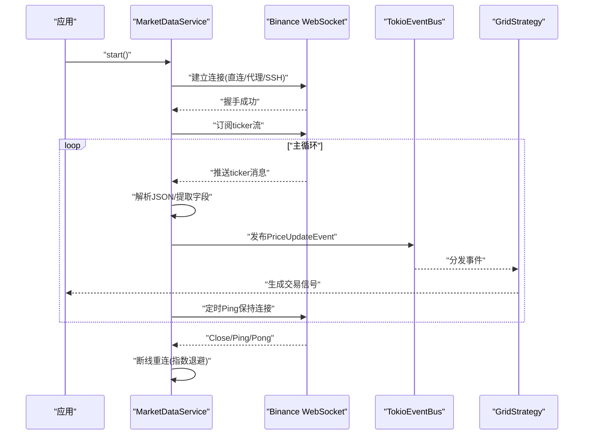
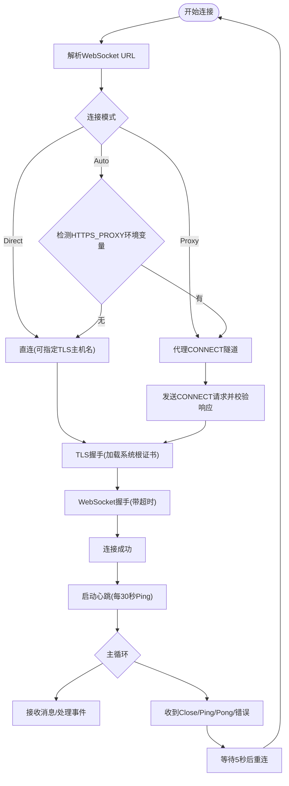
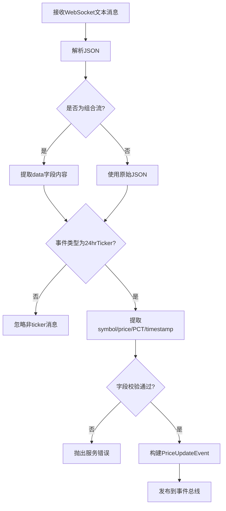
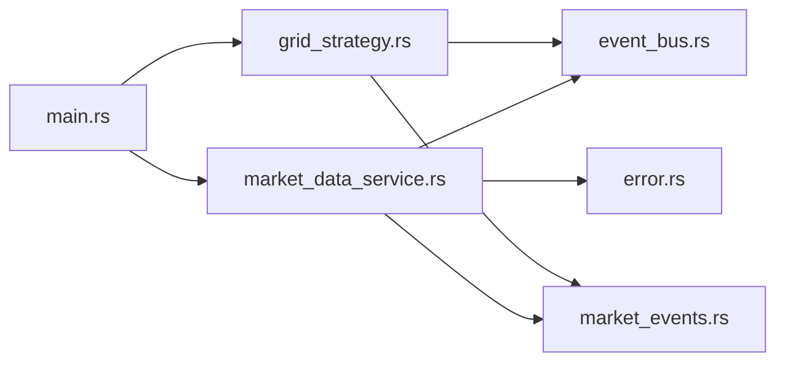

# 市场数据服务

<cite>
**本文引用的文件**
- [market_data_service.rs](file://src/services/market_data_service.rs)
- [main.rs](file://src/main.rs)
- [lib.rs](file://src/lib.rs)
- [Cargo.toml](file://Cargo.toml)
- [market_events.rs](file://src/events/market_events.rs)
- [event_bus.rs](file://src/event_bus.rs)
- [error.rs](file://src/error.rs)
- [logger.rs](file://src/infrastructure/logging/logger.rs)
- [grid_strategy.rs](file://src/strategies/grid_strategy.rs)
</cite>

## 目录
1. [简介](#简介)
2. [项目结构](#项目结构)
3. [核心组件](#核心组件)
4. [架构概览](#架构概览)
5. [详细组件分析](#详细组件分析)
6. [依赖关系分析](#依赖关系分析)
7. [性能考虑](#性能考虑)
8. [故障排除指南](#故障排除指南)
9. [结论](#结论)
10. [附录](#附录)

## 简介
本文件为市场数据服务的详细技术文档，专注于Binance WebSocket实时行情数据的获取与处理。文档涵盖以下主题：
- WebSocket连接实现：连接建立、心跳保持、断线重连机制、网络异常处理
- 实时数据解析流程：消息格式识别、数据字段提取、时间戳处理、数据验证
- 数据缓存策略：内存缓存管理、数据过期机制、内存使用优化
- 代理支持配置：HTTP代理CONNECT隧道、SSL/TLS安全连接
- 服务配置选项：连接模式、超时参数、代理配置
- 性能监控指标：吞吐量、延迟、内存占用
- 故障排除指南：常见问题诊断与解决方案
- 实际代码示例：初始化服务、订阅数据流、处理回调函数

## 项目结构
该项目采用模块化设计，核心模块包括服务层、事件总线、事件定义、基础设施（日志）和策略层。市场数据服务位于服务层，负责与Binance WebSocket交互并将价格事件发布到事件总线。

**图表来源**
- [main.rs:10-93](file://src/main.rs#L10-L93)
- [market_data_service.rs:35-440](file://src/services/market_data_service.rs#L35-L440)
- [event_bus.rs:62-158](file://src/event_bus.rs#L62-L158)
- [market_events.rs:7-56](file://src/events/market_events.rs#L7-L56)
- [logger.rs:140-291](file://src/infrastructure/logging/logger.rs#L140-L291)
- [grid_strategy.rs:159-278](file://src/strategies/grid_strategy.rs#L159-L278)

**章节来源**
- [lib.rs:1-9](file://src/lib.rs#L1-L9)
- [Cargo.toml:1-27](file://Cargo.toml#L1-L27)

## 核心组件
- 市场数据服务（MarketDataService）：负责WebSocket连接、消息订阅、心跳维持、断线重连、消息解析与事件发布。
- 事件总线（TokioEventBus）：提供事件发布/订阅机制，支持并行分发。
- 事件模型（PriceUpdateEvent）：定义价格更新事件的数据结构。
- 网格策略（GridStrategy）：订阅价格事件并生成交易信号。
- 异步日志（AsyncLogger）：提供高性能异步日志记录与轮转。

**章节来源**
- [market_data_service.rs:35-440](file://src/services/market_data_service.rs#L35-L440)
- [event_bus.rs:62-158](file://src/event_bus.rs#L62-L158)
- [market_events.rs:7-56](file://src/events/market_events.rs#L7-L56)
- [grid_strategy.rs:159-278](file://src/strategies/grid_strategy.rs#L159-L278)
- [logger.rs:140-291](file://src/infrastructure/logging/logger.rs#L140-L291)

## 架构概览
市场数据服务通过多种连接模式接入Binance WebSocket，支持直连、代理（HTTP CONNECT隧道）和SSH隧道模式。服务内部维护心跳机制，自动处理Ping/Pong以保持连接活跃；当连接断开或出现错误时，按指数退避策略进行重连。解析后的价格事件通过事件总线发布，供策略层或其他组件消费。

**图表来源**
- [market_data_service.rs:96-178](file://src/services/market_data_service.rs#L96-L178)
- [market_data_service.rs:303-374](file://src/services/market_data_service.rs#L303-L374)
- [event_bus.rs:128-157](file://src/event_bus.rs#L128-L157)
- [grid_strategy.rs:264-278](file://src/strategies/grid_strategy.rs#L264-L278)

## 详细组件分析

### WebSocket连接实现
- 连接模式
  - Auto：自动检测HTTPS_PROXY环境变量，优先使用代理；否则直连。
  - Direct：强制直连，忽略代理设置。
  - Proxy：强制使用代理，必须设置HTTPS_PROXY环境变量。
- 代理支持
  - 通过HTTP CONNECT隧道建立到目标主机的加密通道，随后在隧道上进行TLS握手。
  - 支持代理URL解析、CONNECT请求发送、响应校验与头部读取。
- SSL/TLS安全连接
  - 使用rustls客户端配置，加载系统信任根证书，进行SNI服务器名称解析与握手。
  - 支持SSH隧道模式：本地连接localhost:9443，但TLS验证目标主机名。
- 心跳保持
  - 使用tokio定时器每30秒发送Ping消息，自动回复Pong。
- 断线重连机制
  - 主循环捕获Close、Ping/Pong、错误等事件，触发重连。
  - 重连间隔固定为5秒，支持超时控制（连接、握手、代理响应等）。
- 网络异常处理
  - 对URL解析、代理URL解析、TCP连接、TLS握手、WebSocket握手、代理响应读取等环节设置超时与错误包装。
  - 使用统一错误类型DomainError进行错误传播。

**图表来源**
- [market_data_service.rs:117-178](file://src/services/market_data_service.rs#L117-L178)
- [market_data_service.rs:185-301](file://src/services/market_data_service.rs#L185-L301)
- [market_data_service.rs:303-374](file://src/services/market_data_service.rs#L303-L374)

**章节来源**
- [market_data_service.rs:24-42](file://src/services/market_data_service.rs#L24-L42)
- [market_data_service.rs:117-178](file://src/services/market_data_service.rs#L117-L178)
- [market_data_service.rs:185-301](file://src/services/market_data_service.rs#L185-L301)
- [market_data_service.rs:303-374](file://src/services/market_data_service.rs#L303-L374)

### 实时数据解析流程
- 消息格式识别
  - 支持单流与组合流两种格式：组合流包含顶层stream字段，数据主体在data字段内。
  - 通过判断事件类型字段确定是否为ticker数据。
- 数据字段提取
  - symbol：交易对标识。
  - price：当前价格（f64）。
  - price_change_pct_24h：24小时涨跌幅百分比（f64）。
  - timestamp：时间戳（毫秒），若缺失则使用当前时间。
- 时间戳处理
  - 优先使用Binance提供的E字段；若缺失，回退到本地时间戳。
- 数据验证
  - 对必需字段进行存在性与类型校验，解析失败时抛出服务错误。
- 事件发布
  - 将解析后的PriceUpdateEvent通过事件总线发布，供订阅者处理。

**图表来源**
- [market_data_service.rs:376-407](file://src/services/market_data_service.rs#L376-L407)
- [market_data_service.rs:409-439](file://src/services/market_data_service.rs#L409-L439)
- [market_events.rs:7-18](file://src/events/market_events.rs#L7-L18)

**章节来源**
- [market_data_service.rs:376-439](file://src/services/market_data_service.rs#L376-L439)
- [market_events.rs:7-18](file://src/events/market_events.rs#L7-L18)

### 数据缓存策略
- 内存缓存管理
  - 服务内部不维护持久化缓存；解析后的事件通过事件总线广播，订阅者自行管理状态。
  - 事件总线使用广播通道，支持多个订阅者并行接收。
- 数据过期机制
  - 未实现显式过期策略；建议订阅者基于timestamp字段自行实现过期逻辑。
- 内存使用优化
  - 使用Arc共享事件对象，减少克隆开销。
  - 事件总线容量可配置，默认容量在事件总线初始化时设置。

**章节来源**
- [event_bus.rs:62-85](file://src/event_bus.rs#L62-L85)
- [event_bus.rs:88-110](file://src/event_bus.rs#L88-L110)

### 代理支持配置与SSL/TLS
- 代理配置
  - 环境变量HTTPS_PROXY或https_proxy用于代理模式检测与CONNECT隧道建立。
  - 代理URL解析失败、代理连接超时、代理响应非200等情况均进行错误包装。
- SSL/TLS安全连接
  - 使用rustls加载系统信任根证书，启用SNI服务器名称验证。
  - 支持SSH隧道模式下的TLS主机名覆盖，确保证书验证正确。
- 连接池管理
  - 未实现连接池；每个服务实例维护单一WebSocket连接，断线后重建。

**章节来源**
- [market_data_service.rs:137-147](file://src/services/market_data_service.rs#L137-L147)
- [market_data_service.rs:231-301](file://src/services/market_data_service.rs#L231-L301)
- [market_data_service.rs:197-229](file://src/services/market_data_service.rs#L197-L229)

### 服务配置选项
- 连接模式
  - ConnectionMode::Auto/Direct/Proxy，可通过with_connection_mode设置。
- 超时参数
  - 连接超时：with_connect_timeout(seconds)，默认30秒。
  - 重连间隔：with_reconnect_interval(seconds)，默认5秒。
- 代理与隧道
  - 环境变量USE_SSH_TUNNEL启用SSH隧道模式，强制直连并覆盖代理设置。
  - 环境变量HTTPS_PROXY/https_proxy用于代理模式。

**章节来源**
- [market_data_service.rs:78-94](file://src/services/market_data_service.rs#L78-L94)
- [market_data_service.rs:130-147](file://src/services/market_data_service.rs#L130-L147)

### 性能监控指标
- 事件延迟：建议监控P99延迟，目标小于10ms。
- 吞吐量：建议监控每秒处理事件数，目标大于10000 TPS。
- 内存占用：建议监控RSS内存，目标小于500MB。
- CPU使用：建议监控平均使用率，目标小于70%。

**章节来源**
- [EVENT_DRIVEN_REFACTOR_GUIDE.md:1139-1147](file://docs/EVENT_DRIVEN_REFACTOR_GUIDE.md#L1139-L1147)

### 故障排除指南
- 连接失败
  - 检查HTTPS_PROXY环境变量是否正确设置（代理模式）。
  - 确认网络可达性和防火墙策略。
  - 查看日志中的URL解析失败、代理URL解析失败、TCP连接超时、TLS握手超时等错误信息。
- WebSocket握手失败
  - 检查目标URL格式与端口。
  - 确认代理CONNECT隧道建立成功且响应为200。
- 心跳异常
  - 确认Ping/Pong消息正常往返，检查网络丢包情况。
- 事件未到达
  - 检查事件总线容量与订阅者注册情况。
  - 确认订阅者实现了正确的事件类型过滤。

**章节来源**
- [error.rs:114-128](file://src/error.rs#L114-L128)
- [market_data_service.rs:117-178](file://src/services/market_data_service.rs#L117-L178)
- [event_bus.rs:128-157](file://src/event_bus.rs#L128-L157)

## 依赖关系分析
- 外部依赖
  - tokio、tokio-tungstenite、tokio-rustls、rustls、webpki-roots：异步运行时、WebSocket、TLS。
  - serde、serde_json：JSON序列化与反序列化。
  - url：URL解析。
  - log、env_logger：日志框架。
  - dashmap、parking_lot：并发数据结构。
- 内部模块依赖
  - market_data_service依赖event_bus、events、error模块。
  - main依赖services、strategies、event_bus等模块。
  - grid_strategy依赖event_bus、events模块。

**图表来源**
- [market_data_service.rs:6-21](file://src/services/market_data_service.rs#L6-L21)
- [main.rs:4-7](file://src/main.rs#L4-L7)
- [grid_strategy.rs:6-11](file://src/strategies/grid_strategy.rs#L6-L11)

**章节来源**
- [Cargo.toml:6-25](file://Cargo.toml#L6-L25)

## 性能考虑
- 并发与异步
  - 使用tokio异步运行时，事件总线采用广播通道并行分发，提升吞吐量。
- 序列化与内存
  - 使用Serde进行高效序列化；建议在高吞吐场景下考虑二进制格式（如MessagePack）。
- I/O优化
  - 异步日志记录器采用后台线程与通道，避免阻塞主线程。
- 连接管理
  - 单连接模型简单可靠；如需更高吞吐，可考虑多连接与负载均衡策略。

[本节为通用性能指导，无需特定文件引用]

## 故障排除指南
- 常见错误类型
  - ServiceError::MarketData：市场数据相关错误，如URL解析失败、代理CONNECT失败、握手超时等。
  - EventBusError：事件总线发布/订阅失败。
- 诊断步骤
  - 启用详细日志，观察连接阶段的URL解析、代理CONNECT、TLS握手、WebSocket握手等关键节点。
  - 检查网络连通性与代理可用性。
  - 验证事件总线订阅与分发链路。

**章节来源**
- [error.rs:114-128](file://src/error.rs#L114-L128)
- [logger.rs:283-290](file://src/infrastructure/logging/logger.rs#L283-L290)

## 结论
市场数据服务提供了完整的Binance WebSocket接入能力，具备灵活的连接模式、健壮的心跳与重连机制、完善的错误处理与事件发布流程。通过事件驱动架构，服务能够与策略层无缝集成，满足实时交易系统的低延迟与高可靠性需求。建议在生产环境中结合异步日志、性能监控与容量规划，持续优化系统表现。

[本节为总结性内容，无需特定文件引用]

## 附录

### 实际代码示例（路径引用）
- 初始化服务与启动
  - [main.rs:71-84](file://src/main.rs#L71-L84)
- 订阅数据流与处理回调
  - [market_data_service.rs:310-321](file://src/services/market_data_service.rs#L310-L321)
  - [grid_strategy.rs:264-278](file://src/strategies/grid_strategy.rs#L264-L278)
- 事件定义
  - [market_events.rs:7-18](file://src/events/market_events.rs#L7-L18)
- 事件总线与分发
  - [event_bus.rs:128-157](file://src/event_bus.rs#L128-L157)
- 错误处理
  - [error.rs:114-128](file://src/error.rs#L114-L128)