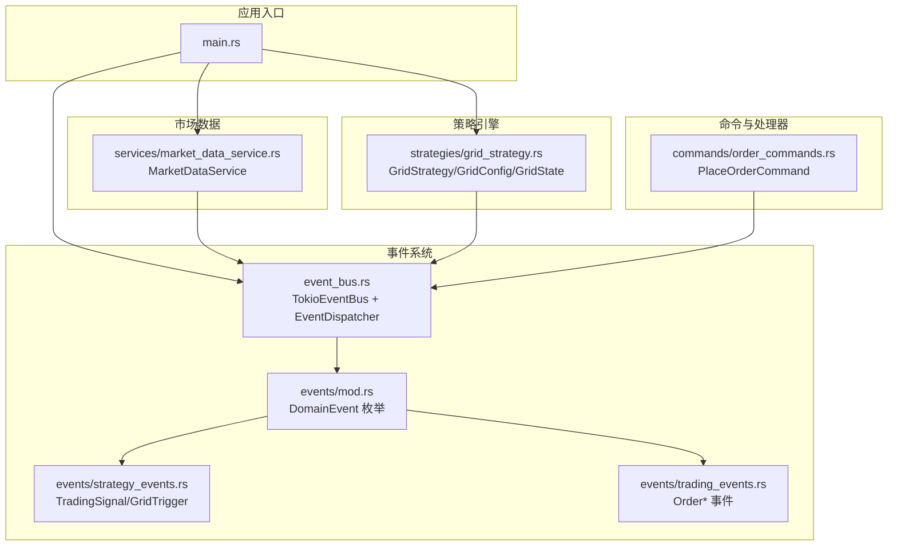
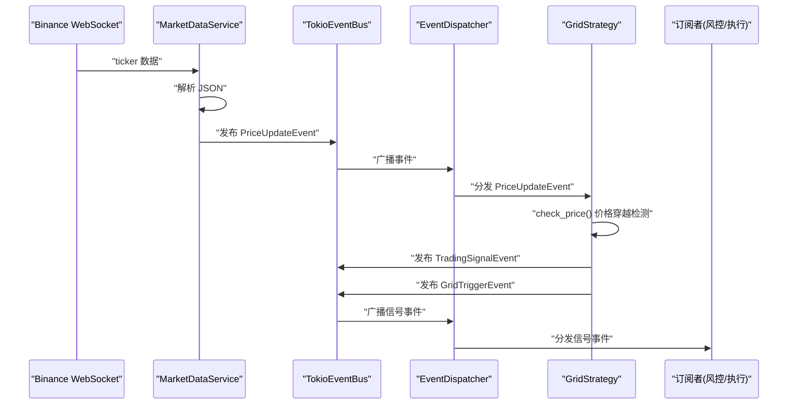
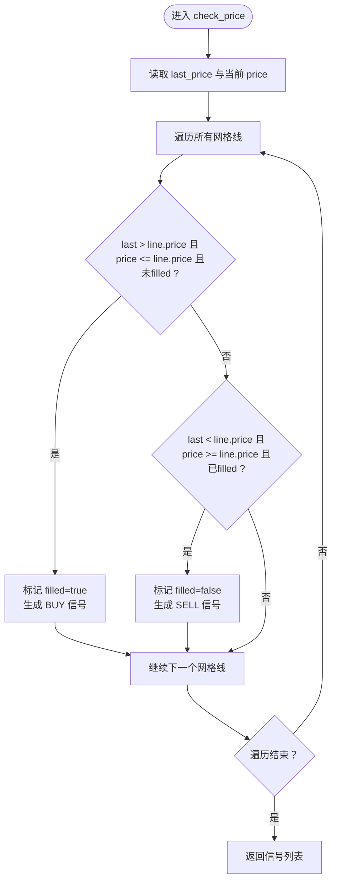
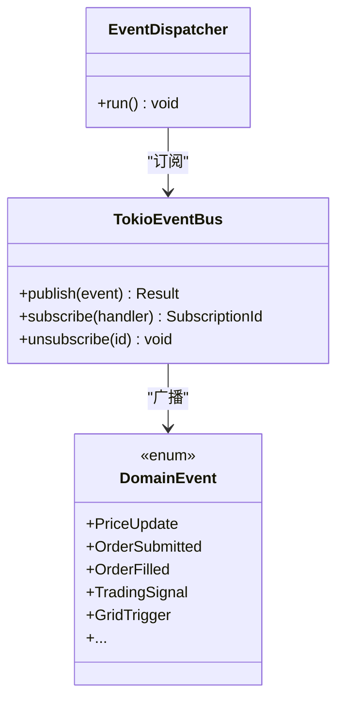
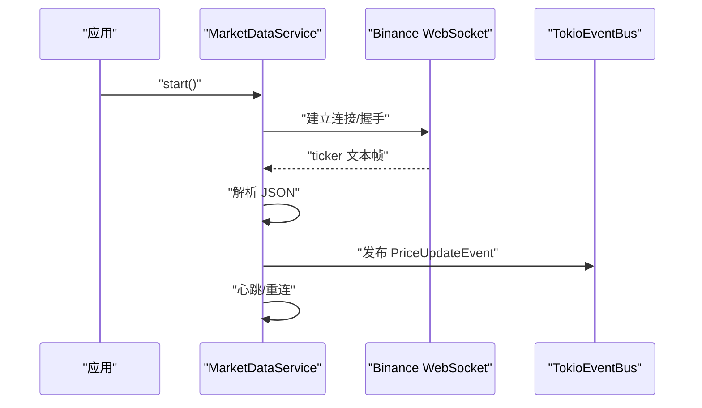
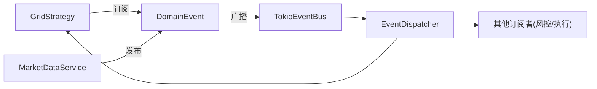

# 网格策略引擎

<cite>
**本文引用的文件**
- [grid_strategy.rs](file://src/strategies/grid_strategy.rs)
- [main.rs](file://src/main.rs)
- [lib.rs](file://src/lib.rs)
- [Cargo.toml](file://Cargo.toml)
- [event_bus.rs](file://src/event_bus.rs)
- [market_data_service.rs](file://src/services/market_data_service.rs)
- [order_commands.rs](file://src/commands/order_commands.rs)
- [mod.rs](file://src/events/mod.rs)
- [strategy_events.rs](file://src/events/strategy_events.rs)
- [trading_events.rs](file://src/events/trading_events.rs)
- [error.rs](file://src/error.rs)
- [CODE_EXPLANATION.md](file://docs/CODE_EXPLANATION.md)
- [EVENT_DRIVEN_REFACTOR_GUIDE.md](file://docs/EVENT_DRIVEN_REFACTOR_GUIDE.md)
</cite>

## 目录
1. [简介](#简介)
2. [项目结构](#项目结构)
3. [核心组件](#核心组件)
4. [架构总览](#架构总览)
5. [详细组件分析](#详细组件分析)
6. [依赖关系分析](#依赖关系分析)
7. [性能考量](#性能考量)
8. [故障排查指南](#故障排查指南)
9. [结论](#结论)
10. [附录](#附录)

## 简介
本文件面向网格策略引擎的技术文档，围绕事件驱动架构下的网格交易算法进行系统化阐述。内容涵盖：
- 网格交易算法原理与实现细节
- 价格穿越检测机制与交易信号生成
- 策略配置参数与资金分配
- 风险控制与流动性管理
- 收益计算与性能评估
- 参数调优与部署实践

该系统以事件驱动为核心，通过事件总线解耦市场数据、策略引擎与后续执行模块，具备良好的可扩展性与可维护性。

## 项目结构
项目采用模块化组织，核心模块如下：
- 策略引擎：网格策略实现与状态管理
- 事件系统：事件总线、事件类型与分发器
- 市场数据服务：Binance WebSocket 实时行情接入
- 命令与处理器：命令总线与后续执行扩展点
- 错误处理：统一错误类型与传播

图表来源
- [main.rs:10-93](file://src/main.rs#L10-L93)
- [event_bus.rs:62-158](file://src/event_bus.rs#L62-L158)
- [mod.rs:49-89](file://src/events/mod.rs#L49-L89)
- [strategy_events.rs:7-80](file://src/events/strategy_events.rs#L7-L80)
- [trading_events.rs:8-48](file://src/events/trading_events.rs#L8-L48)
- [grid_strategy.rs:156-278](file://src/strategies/grid_strategy.rs#L156-L278)
- [market_data_service.rs:34-114](file://src/services/market_data_service.rs#L34-L114)
- [order_commands.rs:36-72](file://src/commands/order_commands.rs#L36-L72)

章节来源
- [main.rs:10-93](file://src/main.rs#L10-L93)
- [lib.rs:1-9](file://src/lib.rs#L1-L9)
- [Cargo.toml:1-27](file://Cargo.toml#L1-L27)

## 核心组件
- 网格策略引擎
  - GridConfig：策略配置，包含区间上下限、网格数量、每格数量、利润阈值等
  - GridState：策略运行时状态，维护网格线集合、上一次价格与信号计数
  - GridStrategy：事件处理器，监听价格更新，生成交易信号与网格触发事件
- 事件系统
  - TokioEventBus：基于广播通道的事件总线
  - EventDispatcher：事件分发器，负责并发分发事件给订阅者
  - DomainEvent：统一事件枚举，包含价格、交易、账户、策略、风控等事件
- 市场数据服务
  - MarketDataService：连接 Binance WebSocket，解析 ticker 数据并发布 PriceUpdateEvent
- 命令与处理器
  - PlaceOrderCommand：下单命令结构，为后续执行模块提供输入

章节来源
- [grid_strategy.rs:26-81](file://src/strategies/grid_strategy.rs#L26-L81)
- [grid_strategy.rs:83-154](file://src/strategies/grid_strategy.rs#L83-L154)
- [grid_strategy.rs:156-278](file://src/strategies/grid_strategy.rs#L156-L278)
- [event_bus.rs:62-158](file://src/event_bus.rs#L62-L158)
- [mod.rs:49-89](file://src/events/mod.rs#L49-L89)
- [market_data_service.rs:34-114](file://src/services/market_data_service.rs#L34-L114)
- [order_commands.rs:36-72](file://src/commands/order_commands.rs#L36-L72)

## 架构总览
事件驱动架构下，系统通过以下流程工作：
- MarketDataService 接收 Binance WebSocket 实时行情，解析为 PriceUpdateEvent 并发布到事件总线
- EventDispatcher 并发分发事件给所有订阅者
- GridStrategy 作为 EventHandler 接收 PriceUpdateEvent，执行价格穿越检测，生成 TradingSignalEvent 与 GridTriggerEvent，并再次发布到事件总线
- 后续模块（风控、订单执行等）订阅相应事件并处理

图表来源
- [market_data_service.rs:376-440](file://src/services/market_data_service.rs#L376-L440)
- [event_bus.rs:129-157](file://src/event_bus.rs#L129-L157)
- [grid_strategy.rs:189-252](file://src/strategies/grid_strategy.rs#L189-L252)
- [strategy_events.rs:7-80](file://src/events/strategy_events.rs#L7-L80)

## 详细组件分析

### 网格策略引擎
- 算法原理
  - 在价格区间 [lower_price, upper_price] 内按网格数量均匀划分 N 条网格线
  - 价格从上方穿越某网格线时生成买入信号；从下方穿越且已持有仓位时生成卖出信号
  - 每个网格仅触发一次买卖，避免重复交易
- 关键数据结构
  - GridLine：网格线，包含级别、价格、是否已触发
  - GridConfig：策略配置，提供网格间距计算与网格线构建
  - GridState：运行时状态，维护网格线、上一次价格与信号计数
- 价格穿越检测
  - 通过 last_price 与当前 price 的比较判断穿越方向
  - 买入条件：last > price_line && price <= price_line && !filled
  - 卖出条件：last < price_line && price >= price_line && filled
- 信号生成与事件发布
  - 生成 TradingSignalEvent（含建议价格、数量、止盈止损等）
  - 生成 GridTriggerEvent（用于后续执行模块）
  - 并发发布到事件总线，供订阅者处理

图表来源
- [grid_strategy.rs:102-153](file://src/strategies/grid_strategy.rs#L102-L153)

章节来源
- [grid_strategy.rs:15-81](file://src/strategies/grid_strategy.rs#L15-L81)
- [grid_strategy.rs:83-154](file://src/strategies/grid_strategy.rs#L83-L154)
- [grid_strategy.rs:156-278](file://src/strategies/grid_strategy.rs#L156-L278)

### 事件系统
- 事件总线
  - TokioEventBus：基于 broadcast::channel 的广播通道，支持多订阅者
  - 支持订阅/取消订阅与发布
- 事件分发器
  - EventDispatcher：独立任务，从广播通道接收事件并并发调用所有处理器
  - join_all 并发执行，提升吞吐
- 事件类型
  - DomainEvent：统一枚举，包含 PriceUpdate、Order*、TradingSignal、GridTrigger 等
  - EventType：用于过滤订阅，降低处理开销

图表来源
- [event_bus.rs:62-158](file://src/event_bus.rs#L62-L158)
- [mod.rs:49-89](file://src/events/mod.rs#L49-L89)

章节来源
- [event_bus.rs:18-110](file://src/event_bus.rs#L18-L110)
- [event_bus.rs:112-158](file://src/event_bus.rs#L112-L158)
- [mod.rs:49-89](file://src/events/mod.rs#L49-L89)

### 市场数据服务
- 连接模式
  - Auto/Direct/Proxy：根据环境变量与配置自动选择连接方式
  - 支持 HTTP CONNECT 代理隧道，满足企业网络需求
- WebSocket 处理
  - 解析组合流与单流格式的 ticker 数据
  - 心跳检测与自动重连
- 事件发布
  - 解析为 PriceUpdateEvent 并发布到事件总线

图表来源
- [market_data_service.rs:96-178](file://src/services/market_data_service.rs#L96-L178)
- [market_data_service.rs:303-374](file://src/services/market_data_service.rs#L303-L374)
- [market_data_service.rs:376-440](file://src/services/market_data_service.rs#L376-L440)

章节来源
- [market_data_service.rs:23-114](file://src/services/market_data_service.rs#L23-L114)
- [market_data_service.rs:116-178](file://src/services/market_data_service.rs#L116-L178)
- [market_data_service.rs:303-440](file://src/services/market_data_service.rs#L303-L440)

### 策略事件与交易事件
- TradingSignalEvent：策略生成的交易信号，包含建议价格、数量、止盈止损、强度等
- GridTriggerEvent：网格触发事件，携带网格级别、动作与数量
- Order* 事件：订单生命周期事件，为后续执行模块提供输入

章节来源
- [strategy_events.rs:7-80](file://src/events/strategy_events.rs#L7-L80)
- [strategy_events.rs:82-106](file://src/events/strategy_events.rs#L82-L106)
- [trading_events.rs:8-97](file://src/events/trading_events.rs#L8-L97)

### 应用入口与初始化
- 初始化事件总线与分发器
- 注册网格策略并订阅价格事件
- 启动市场数据服务，接收实时行情
- 示例中演示了下单命令的构造与发送（为后续执行模块预留）

章节来源
- [main.rs:10-93](file://src/main.rs#L10-L93)

## 依赖关系分析
- 模块耦合
  - 策略引擎依赖事件总线与事件类型，通过 EventHandler 接口解耦
  - 市场数据服务与策略引擎通过事件总线松耦合
- 外部依赖
  - Tokio：异步运行时与通道
  - serde/serde_json：事件序列化
  - tokio-tungstenite/rustls：WebSocket/TLS
  - parking_lot/dashmap：高性能并发容器

图表来源
- [grid_strategy.rs:264-278](file://src/strategies/grid_strategy.rs#L264-L278)
- [event_bus.rs:129-157](file://src/event_bus.rs#L129-L157)
- [mod.rs:49-89](file://src/events/mod.rs#L49-L89)

章节来源
- [Cargo.toml:6-25](file://Cargo.toml#L6-L25)

## 性能考量
- 并发分发
  - EventDispatcher 使用 join_all 并发调用所有处理器，提升吞吐
- 事件过滤
  - EventHandler::event_types 提供事件类型过滤，减少无关事件处理
- 通道容量
  - 事件总线广播通道容量可调，平衡延迟与内存占用
- WebSocket 连接
  - 自动重连与心跳维持连接稳定性，降低断线影响
- 内存与序列化
  - 事件结构体使用 serde 序列化，便于持久化与传输

章节来源
- [event_bus.rs:129-157](file://src/event_bus.rs#L129-L157)
- [event_bus.rs:162-181](file://src/event_bus.rs#L162-L181)
- [market_data_service.rs:96-114](file://src/services/market_data_service.rs#L96-L114)

## 故障排查指南
- 事件总线错误
  - 发布失败：检查广播通道容量与订阅者数量
  - 处理失败：查看处理器日志，定位具体错误
- WebSocket 连接问题
  - 代理配置：确认 HTTPS_PROXY 环境变量与连接模式
  - TLS 握手：检查证书与服务器名称
  - 心跳与重连：确认心跳触发与重连间隔设置
- 策略信号异常
  - 网格线生成：检查 lower_price、upper_price、grid_count
  - 价格穿越：确认 last_price 与当前价格的边界条件
- 错误类型
  - 统一使用 DomainError，分层错误便于定位

章节来源
- [error.rs:14-34](file://src/error.rs#L14-L34)
- [error.rs:85-99](file://src/error.rs#L85-L99)
- [market_data_service.rs:116-178](file://src/services/market_data_service.rs#L116-L178)
- [grid_strategy.rs:102-153](file://src/strategies/grid_strategy.rs#L102-L153)

## 结论
本网格策略引擎以事件驱动架构为核心，实现了从实时行情到策略信号再到后续执行的完整链路。其优势在于：
- 解耦性强：模块间通过事件通信，易于扩展与维护
- 实时性好：WebSocket 实时推送与并发分发，延迟低
- 可靠性高：自动重连、心跳检测与统一错误处理
- 可扩展：支持多策略并行、多订阅者协作

建议在实际部署中结合风控模块与订单执行模块，完善资金管理与止损止盈策略，进一步提升收益稳定性与回撤控制能力。

## 附录

### 策略配置参数说明
- 策略唯一ID：strategy_id
- 交易对：symbol
- 区间下限：lower_price
- 区间上限：upper_price
- 网格数量：grid_count
- 每格交易数量：quantity_per_grid
- 利润阈值百分比：profit_threshold_pct（用于止盈建议）

章节来源
- [grid_strategy.rs:26-43](file://src/strategies/grid_strategy.rs#L26-L43)

### 价格穿越检测与信号生成流程
- 买入条件：last > line.price 且 price <= line.price 且 未filled
- 卖出条件：last < line.price 且 price >= line.price 且 已filled
- 生成 TradingSignalEvent 与 GridTriggerEvent 并发布

章节来源
- [grid_strategy.rs:102-153](file://src/strategies/grid_strategy.rs#L102-L153)
- [grid_strategy.rs:189-252](file://src/strategies/grid_strategy.rs#L189-L252)

### 风险控制与流动性管理建议
- 止损与止盈
  - 买入时建议止损价：买入价 × (1 - 2%)
  - 止盈价：买入价 × (1 + profit_threshold_pct/100)
- 流动性管理
  - 选择流动性高的交易对与合适的网格间距
  - 控制每格资金与总仓位，避免过度集中
- 回撤与风控
  - 建议引入最大回撤阈值与暂停机制（待实现）

章节来源
- [grid_strategy.rs:117-147](file://src/strategies/grid_strategy.rs#L117-L147)

### 收益计算与性能评估
- 收益计算
  - 单笔网格收益：(卖出成交价 - 买入成交价) × 数量
  - 总收益：累计卖出收益 - 累计买入成本 - 手续费
- 性能指标
  - 年化收益率、最大回撤、胜率、盈亏比、夏普比率（待实现）
- 回测框架
  - 建议基于历史数据重放事件，验证策略有效性（待实现）

章节来源
- [strategy_events.rs:7-80](file://src/events/strategy_events.rs#L7-L80)
- [trading_events.rs:50-97](file://src/events/trading_events.rs#L50-L97)

### 参数调优与部署示例
- 参数调优
  - 网格数量：根据波动率与流动性调整
  - 网格间距：与波动率匹配，避免频繁穿越
  - 每格资金：根据账户规模与风险偏好设定
- 部署示例
  - 开发环境：Auto 模式，自动检测代理
  - 生产环境：Direct 模式，直连 Binance
  - 代理模式：设置 HTTPS_PROXY，使用 HTTP CONNECT 隧道

章节来源
- [main.rs:42-93](file://src/main.rs#L42-L93)
- [market_data_service.rs:23-82](file://src/services/market_data_service.rs#L23-L82)