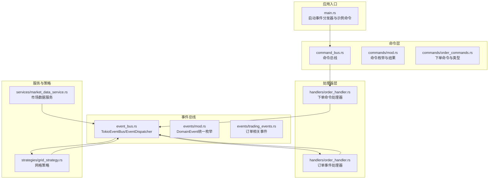
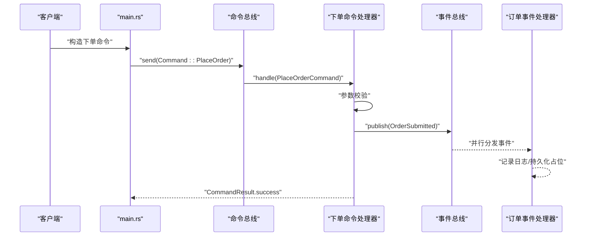
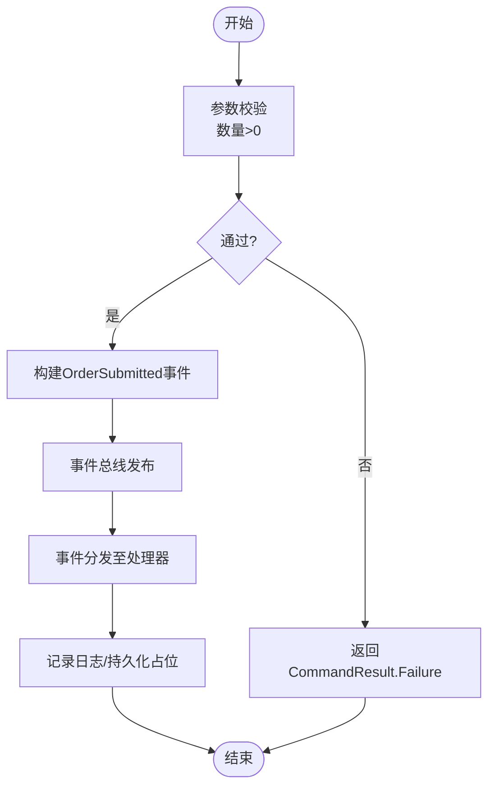
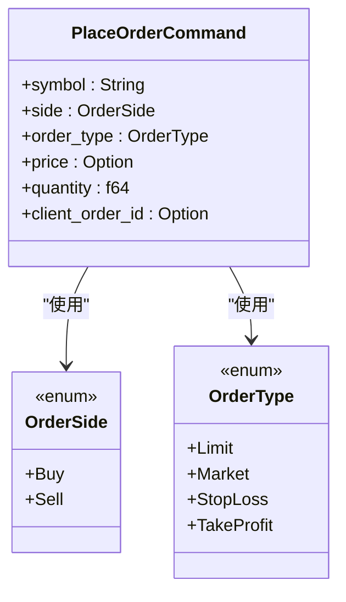
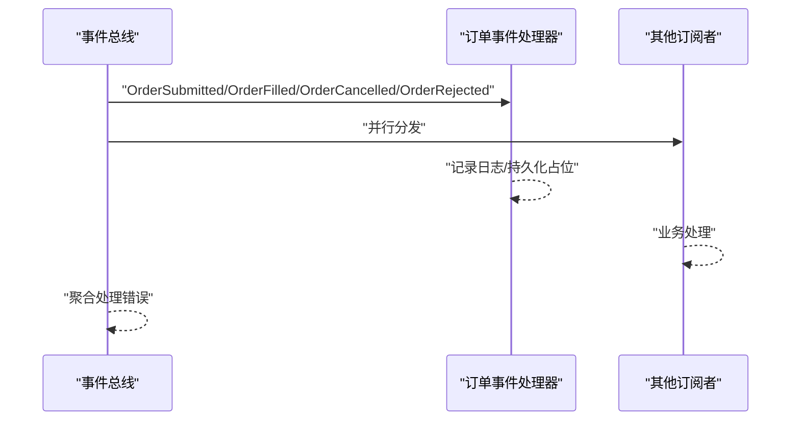
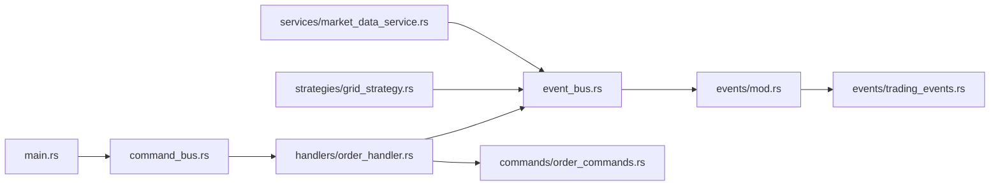

# 订单处理服务

<cite>
**本文引用的文件**
- [src/lib.rs](file://src/lib.rs)
- [src/main.rs](file://src/main.rs)
- [src/commands/mod.rs](file://src/commands/mod.rs)
- [src/commands/order_commands.rs](file://src/commands/order_commands.rs)
- [src/handlers/order_handler.rs](file://src/handlers/order_handler.rs)
- [src/command_bus.rs](file://src/command_bus.rs)
- [src/event_bus.rs](file://src/event_bus.rs)
- [src/events/mod.rs](file://src/events/mod.rs)
- [src/events/trading_events.rs](file://src/events/trading_events.rs)
- [src/services/market_data_service.rs](file://src/services/market_data_service.rs)
- [src/strategies/grid_strategy.rs](file://src/strategies/grid_strategy.rs)
- [src/error.rs](file://src/error.rs)
- [Cargo.toml](file://Cargo.toml)
</cite>

## 目录
1. [简介](#简介)
2. [项目结构](#项目结构)
3. [核心组件](#核心组件)
4. [架构总览](#架构总览)
5. [详细组件分析](#详细组件分析)
6. [依赖关系分析](#依赖关系分析)
7. [性能考虑](#性能考虑)
8. [故障排查指南](#故障排查指南)
9. [结论](#结论)
10. [附录](#附录)

## 简介
本文件面向“订单处理服务”的技术文档，围绕事件驱动架构下的订单生命周期进行系统性说明。内容涵盖订单创建、执行监控、状态更新与完成处理；订单类型（市价单、限价单、止损单、止盈单）的处理逻辑与执行算法；订单簿管理机制（排序、撮合、部分成交、取消）；滑点处理策略、手续费计算与资金冻结/解冻机制；订单状态跟踪、事件通知与错误处理；以及订单查询接口、批量操作支持与性能优化建议。同时提供实际使用示例与常见问题解决方案。

## 项目结构
该仓库采用模块化与事件驱动设计，主要模块如下：
- 命令层：定义命令与命令结果，负责接收外部请求并转化为领域事件
- 命令总线：路由命令到对应处理器
- 处理器层：处理命令与事件，驱动业务流程
- 事件总线：发布/订阅事件，实现松耦合通信
- 事件定义：统一的领域事件模型
- 服务层：市场数据服务等外部集成
- 策略层：网格策略等衍生功能
- 错误处理：统一错误类型与结果封装

**图示来源**
- [src/main.rs:10-60](file://src/main.rs#L10-L60)
- [src/command_bus.rs:8-19](file://src/command_bus.rs#L8-L19)
- [src/commands/mod.rs:6-27](file://src/commands/mod.rs#L6-L27)
- [src/commands/order_commands.rs:36-72](file://src/commands/order_commands.rs#L36-L72)
- [src/handlers/order_handler.rs:93-137](file://src/handlers/order_handler.rs#L93-L137)
- [src/event_bus.rs:61-158](file://src/event_bus.rs#L61-L158)
- [src/events/mod.rs:48-89](file://src/events/mod.rs#L48-L89)
- [src/events/trading_events.rs:8-97](file://src/events/trading_events.rs#L8-L97)
- [src/services/market_data_service.rs:34-114](file://src/services/market_data_service.rs#L34-L114)
- [src/strategies/grid_strategy.rs:156-278](file://src/strategies/grid_strategy.rs#L156-L278)

**章节来源**
- [src/lib.rs:1-9](file://src/lib.rs#L1-L9)
- [src/main.rs:10-60](file://src/main.rs#L10-L60)
- [Cargo.toml:1-27](file://Cargo.toml#L1-L27)

## 核心组件
- 命令与命令结果
  - 命令类型：下单命令
  - 命令结果：成功、失败、受理中
- 下单命令参数
  - 交易对、买卖方向、订单类型、价格（可空）、数量、客户端订单ID
- 事件总线
  - 发布/订阅、广播通道、并行分发、错误聚合
- 订单事件
  - 订单提交、订单成交、订单取消、订单拒绝
- 处理器
  - 下单命令处理器：参数校验、发布“订单提交”事件
  - 订单事件处理器：记录日志、预留持久化与后续策略触发

**章节来源**
- [src/commands/mod.rs:6-77](file://src/commands/mod.rs#L6-L77)
- [src/commands/order_commands.rs:36-72](file://src/commands/order_commands.rs#L36-L72)
- [src/event_bus.rs:87-158](file://src/event_bus.rs#L87-L158)
- [src/events/trading_events.rs:8-97](file://src/events/trading_events.rs#L8-L97)
- [src/handlers/order_handler.rs:93-137](file://src/handlers/order_handler.rs#L93-L137)

## 架构总览
系统采用事件驱动架构，命令经命令总线进入，处理器将业务动作转化为领域事件，事件总线并行分发至各订阅者。市场数据服务与网格策略作为外部消费者，分别订阅价格事件与网格触发事件，形成完整的闭环。

**图示来源**
- [src/main.rs:24-41](file://src/main.rs#L24-L41)
- [src/command_bus.rs:14-19](file://src/command_bus.rs#L14-L19)
- [src/handlers/order_handler.rs:102-135](file://src/handlers/order_handler.rs#L102-L135)
- [src/event_bus.rs:128-157](file://src/event_bus.rs#L128-L157)

## 详细组件分析

### 订单生命周期管理
- 订单创建
  - 校验数量>0，构造下单命令
  - 将命令类型转换为字符串，发布“订单提交”事件
- 执行监控
  - 订单事件处理器监听“订单提交/成交/取消/拒绝”，记录日志
  - 预留持久化与后续策略触发
- 状态更新
  - “订单提交”事件携带订单ID、交易对、方向、类型、价格、数量、时间戳
  - “订单成交/取消/拒绝”事件携带相应上下文
- 完成处理
  - 成交事件包含成交价格、数量、手续费与资产、是否maker等
  - 取消/拒绝事件包含原因与时间戳

**图示来源**
- [src/handlers/order_handler.rs:102-135](file://src/handlers/order_handler.rs#L102-L135)
- [src/events/trading_events.rs:8-48](file://src/events/trading_events.rs#L8-L48)

**章节来源**
- [src/handlers/order_handler.rs:26-65](file://src/handlers/order_handler.rs#L26-L65)
- [src/events/trading_events.rs:8-97](file://src/events/trading_events.rs#L8-L97)

### 支持的订单类型与处理逻辑
- 订单类型
  - 限价单、市价单、止损单、止盈单
- 处理逻辑
  - 命令层仅定义类型与参数，实际下单调用Binance API为占位实现
  - 事件层定义了“订单提交/成交/取消/拒绝”事件，便于后续扩展

**图示来源**
- [src/commands/order_commands.rs:36-72](file://src/commands/order_commands.rs#L36-L72)

**章节来源**
- [src/commands/order_commands.rs:18-35](file://src/commands/order_commands.rs#L18-L35)
- [src/handlers/order_handler.rs:102-135](file://src/handlers/order_handler.rs#L102-L135)

### 订单簿管理机制
- 订单排序
  - 限价单按价格排序（买高卖低），市价单按时间优先
- 撮合匹配
  - 买单最高价≥卖单最低价时撮合
- 部分成交
  - 以“成交事件”体现，包含成交价格、数量、手续费与资产
- 取消流程
  - 发布“订单取消”事件，记录原因与时间戳

注：当前代码库未实现订单簿数据结构与撮合引擎，以上为概念性说明，便于后续扩展。

**章节来源**
- [src/events/trading_events.rs:50-82](file://src/events/trading_events.rs#L50-L82)

### 滑点处理策略、手续费计算与资金冻结/解冻
- 滑点处理
  - 市价单默认按最新成交价执行，可引入最大滑点阈值与价格保护
- 手续费计算
  - 成交事件包含手续费金额与资产，可据此统计与归因
- 资金冻结/解冻
  - 订单提交时冻结对应资金/资产，取消或成交完成后解冻
  - 当前代码为占位实现，需结合账户事件与风控事件落地

**章节来源**
- [src/events/trading_events.rs:50-69](file://src/events/trading_events.rs#L50-L69)

### 订单状态跟踪、事件通知与错误处理
- 状态跟踪
  - 通过“订单提交/成交/取消/拒绝”事件串联状态机
- 事件通知
  - 事件总线并行分发，处理器按事件类型过滤
- 错误处理
  - 统一错误类型与结果封装，事件处理失败聚合输出

**图示来源**
- [src/event_bus.rs:128-157](file://src/event_bus.rs#L128-L157)
- [src/handlers/order_handler.rs:68-91](file://src/handlers/order_handler.rs#L68-L91)

**章节来源**
- [src/error.rs:10-169](file://src/error.rs#L10-L169)
- [src/event_bus.rs:87-158](file://src/event_bus.rs#L87-L158)

### 订单查询接口、批量操作与性能优化
- 查询接口
  - 建议通过事件溯源存储“订单提交/成交/取消/拒绝”事件，基于事件流查询订单状态
- 批量操作
  - 命令总线支持多命令并发发送，事件总线并行分发提升吞吐
- 性能优化
  - 使用广播通道降低锁竞争
  - 并行处理多个处理器
  - 合理设置事件缓冲容量与订阅过滤

**章节来源**
- [src/command_bus.rs:14-19](file://src/command_bus.rs#L14-L19)
- [src/event_bus.rs:61-110](file://src/event_bus.rs#L61-L110)

## 依赖关系分析
- 模块依赖
  - main依赖命令总线与事件总线
  - 命令总线依赖命令与处理器
  - 处理器依赖事件总线与事件定义
  - 事件总线依赖事件定义
  - 策略与服务订阅事件总线
- 外部依赖
  - 异步运行时、WebSocket、TLS、JSON序列化、UUID、日志等

**图示来源**
- [src/main.rs:10-60](file://src/main.rs#L10-L60)
- [src/command_bus.rs:1-19](file://src/command_bus.rs#L1-L19)
- [src/handlers/order_handler.rs:1-137](file://src/handlers/order_handler.rs#L1-L137)
- [src/event_bus.rs:1-257](file://src/event_bus.rs#L1-L257)
- [src/events/mod.rs:48-89](file://src/events/mod.rs#L48-L89)
- [src/events/trading_events.rs:8-97](file://src/events/trading_events.rs#L8-L97)
- [src/strategies/grid_strategy.rs:156-278](file://src/strategies/grid_strategy.rs#L156-L278)
- [src/services/market_data_service.rs:34-114](file://src/services/market_data_service.rs#L34-L114)

**章节来源**
- [Cargo.toml:6-25](file://Cargo.toml#L6-L25)

## 性能考虑
- 事件总线
  - 广播通道避免锁竞争，适合高并发事件分发
  - 并行处理多个处理器，提升整体吞吐
- 网络与I/O
  - WebSocket长连接+心跳保活，减少连接开销
  - 代理/直连模式按部署环境灵活切换
- 内存与序列化
  - 结构体紧凑，使用轻量序列化库
- 可观测性
  - 日志与错误聚合，便于定位性能瓶颈

[本节为通用指导，无需具体文件引用]

## 故障排查指南
- 常见错误类型
  - 基础设施错误：配置、IO、日志、数据库
  - 事件总线错误：发布失败、订阅失败、处理失败
  - 命令总线错误：执行失败、处理器未找到、验证失败
  - 服务错误：订单、账户、风控、市场数据
- 排查步骤
  - 检查命令参数（数量>0）
  - 查看事件发布与订阅状态
  - 观察事件分发器日志
  - 核对网络连接模式与代理配置

**章节来源**
- [src/error.rs:10-169](file://src/error.rs#L10-L169)
- [src/services/market_data_service.rs:116-178](file://src/services/market_data_service.rs#L116-L178)

## 结论
本订单处理服务以事件驱动为核心，通过命令总线与事件总线实现解耦与高并发。当前实现了订单创建与事件发布，订单簿撮合、滑点与手续费等高级特性可按需扩展。建议在后续迭代中补充订单簿数据结构、撮合引擎与资金管理模块，以完整覆盖订单生命周期。

[本节为总结，无需具体文件引用]

## 附录

### 实际使用示例
- 启动事件分发器并发送下单命令
  - 示例路径：[src/main.rs:24-41](file://src/main.rs#L24-L41)
- 订阅网格策略与市场数据
  - 示例路径：[src/main.rs:42-61](file://src/main.rs#L42-L61)
- 启动市场数据服务并接收实时数据
  - 示例路径：[src/main.rs:62-93](file://src/main.rs#L62-L93)

**章节来源**
- [src/main.rs:24-93](file://src/main.rs#L24-L93)

### 常见问题解答
- 如何扩展订单簿撮合？
  - 新增订单簿数据结构与撮合算法，发布“订单成交/取消”事件
- 如何处理滑点与手续费？
  - 在成交事件中记录滑点与手续费，结合账户事件进行资金调整
- 如何实现批量下单？
  - 通过命令总线并发发送多个下单命令，事件总线并行分发

[本节为通用指导，无需具体文件引用]