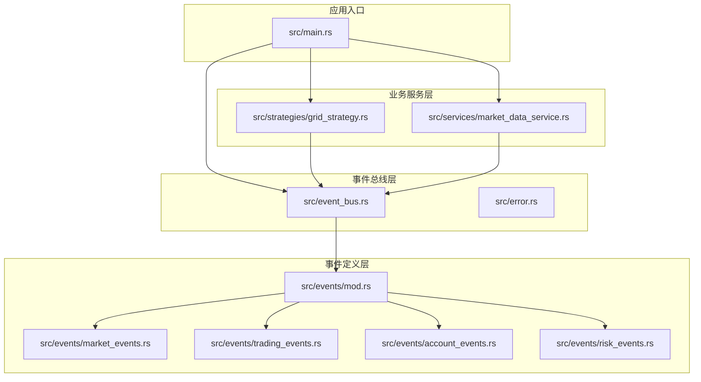
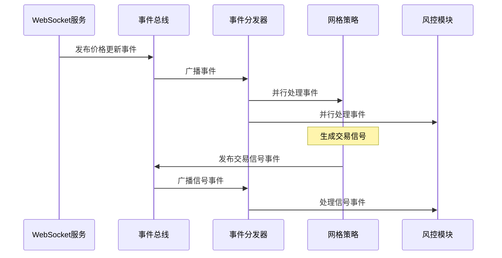
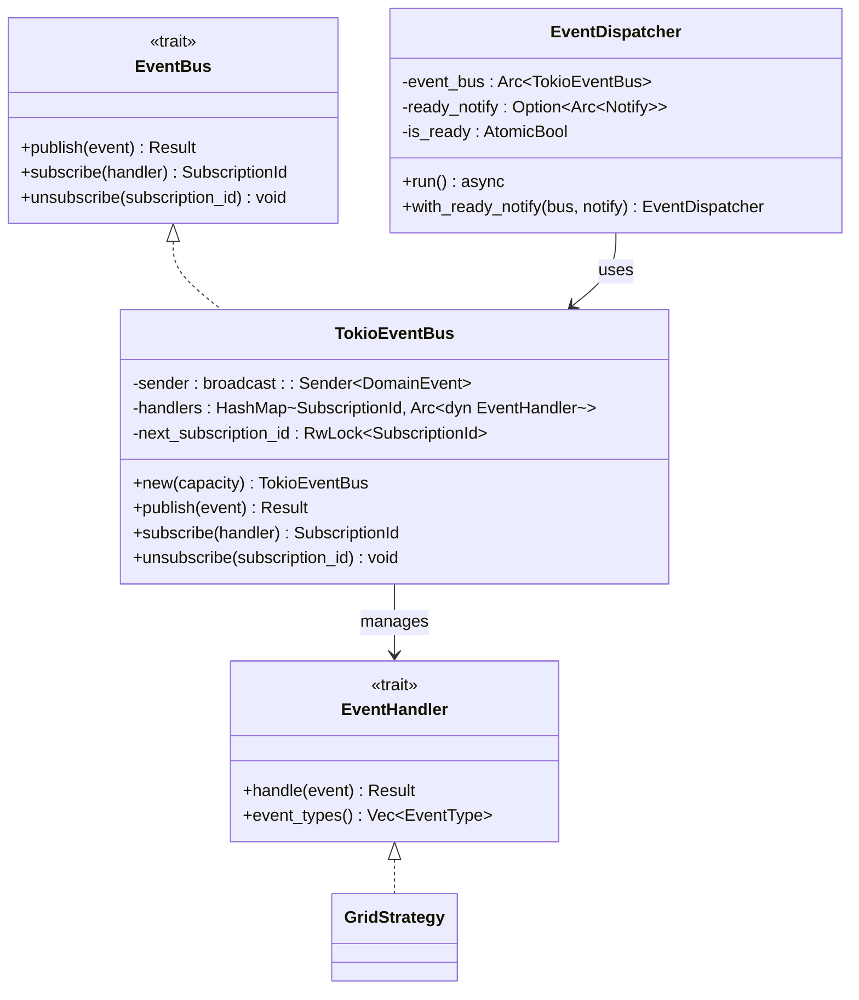
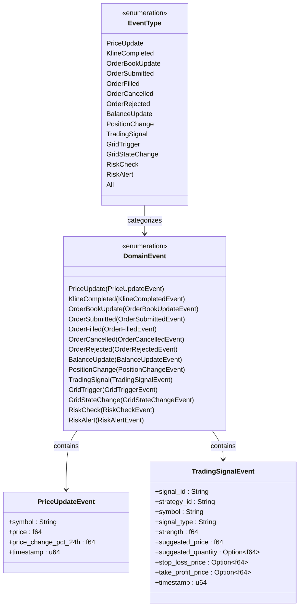
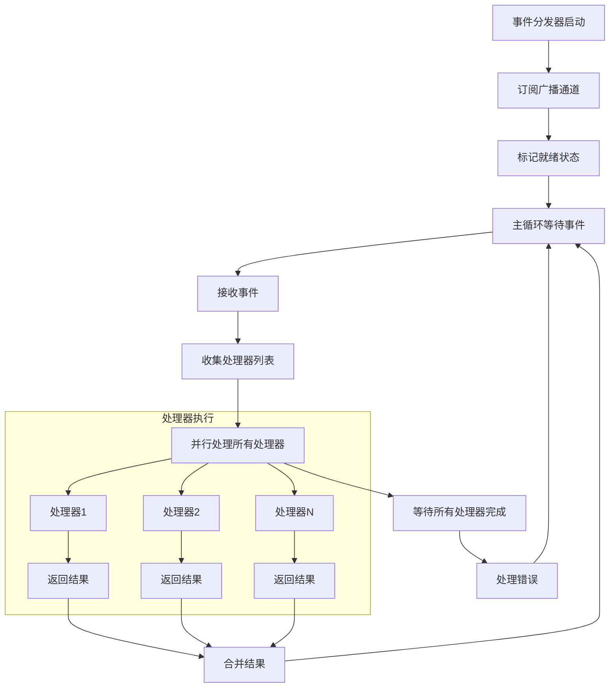
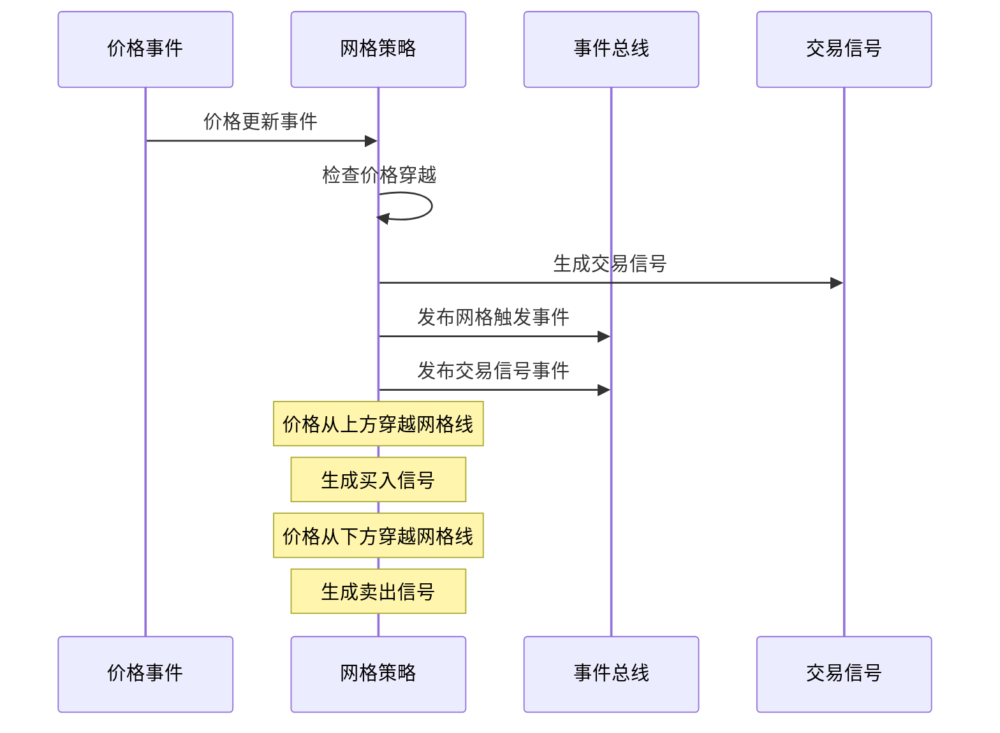
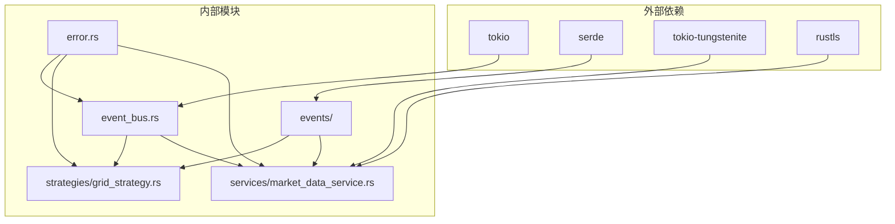

# 事件分发机制

<cite>
**本文档引用的文件**
- [event_bus.rs](file://src/event_bus.rs)
- [lib.rs](file://src/lib.rs)
- [main.rs](file://src/main.rs)
- [events/mod.rs](file://src/events/mod.rs)
- [events/market_events.rs](file://src/events/market_events.rs)
- [events/trading_events.rs](file://src/events/trading_events.rs)
- [events/account_events.rs](file://src/events/account_events.rs)
- [events/risk_events.rs](file://src/events/risk_events.rs)
- [strategies/grid_strategy.rs](file://src/strategies/grid_strategy.rs)
- [services/market_data_service.rs](file://src/services/market_data_service.rs)
- [error.rs](file://src/error.rs)
- [Cargo.toml](file://Cargo.toml)
- [CODE_EXPLANATION.md](file://docs/CODE_EXPLANATION.md)
</cite>

## 目录
1. [简介](#简介)
2. [项目结构](#项目结构)
3. [核心组件](#核心组件)
4. [架构概览](#架构概览)
5. [详细组件分析](#详细组件分析)
6. [依赖关系分析](#依赖关系分析)
7. [性能考虑](#性能考虑)
8. [故障排除指南](#故障排除指南)
9. [结论](#结论)

## 简介
本文档深入解析Binance Rust事件驱动交易系统中的事件分发机制，全面阐述事件总线的实现原理、事件订阅模式和事件路由策略。系统采用事件驱动架构，通过事件总线实现模块间的松耦合通信，支持实时市场数据处理、策略信号生成和风险管理等功能。

## 项目结构
项目采用模块化设计，核心围绕事件驱动架构构建：

**图表来源**
- [lib.rs:1-9](file://src/lib.rs#L1-L9)
- [main.rs:1-93](file://src/main.rs#L1-L93)
- [event_bus.rs:1-257](file://src/event_bus.rs#L1-L257)

**章节来源**
- [lib.rs:1-9](file://src/lib.rs#L1-L9)
- [Cargo.toml:1-27](file://Cargo.toml#L1-L27)

## 核心组件
系统的核心组件包括事件总线、事件处理器、事件类型定义和事件分发器：

### 事件总线接口
事件总线提供统一的事件发布订阅接口，支持异步处理和并发控制：

- **EventBus Trait**: 定义事件发布的标准接口
- **EventHandler Trait**: 定义事件处理器的标准接口  
- **TokioEventBus**: 基于Tokio广播通道的事件总线实现
- **EventDispatcher**: 独立的任务分发器，负责事件的接收和路由

### 事件类型系统
系统定义了完整的事件类型体系，涵盖市场数据、交易执行、账户管理和风险控制等各个方面：

- **市场事件**: 价格更新、K线完成、订单簿更新
- **交易事件**: 订单提交、成交、取消、拒绝
- **账户事件**: 余额更新、持仓变动
- **策略事件**: 交易信号、网格触发、状态变更
- **风险事件**: 风控检查、告警信息

**章节来源**
- [event_bus.rs:18-39](file://src/event_bus.rs#L18-L39)
- [events/mod.rs:48-89](file://src/events/mod.rs#L48-L89)

## 架构概览
系统采用事件驱动架构，通过事件总线实现模块间的解耦通信：

**图表来源**
- [market_data_service.rs:376-407](file://src/services/market_data_service.rs#L376-L407)
- [event_bus.rs:129-157](file://src/event_bus.rs#L129-L157)
- [grid_strategy.rs:234-249](file://src/strategies/grid_strategy.rs#L234-L249)

## 详细组件分析

### 事件总线实现
TokioEventBus是系统的核心通信枢纽，基于Tokio的广播通道实现：

**图表来源**
- [event_bus.rs:18-110](file://src/event_bus.rs#L18-L110)
- [event_bus.rs:112-158](file://src/event_bus.rs#L112-L158)

#### 事件发布流程
事件发布采用异步非阻塞方式，通过广播通道将事件分发给所有订阅者：

1. **事件接收**: 事件分发器从广播通道接收事件
2. **处理器收集**: 读取所有已注册的事件处理器
3. **并行处理**: 使用`join_all`并发执行所有处理器
4. **错误隔离**: 单个处理器失败不影响其他处理器
5. **结果汇总**: 收集并处理所有处理器的执行结果

#### 订阅管理机制
系统提供灵活的订阅管理功能：

- **动态订阅**: 运行时动态注册和注销事件处理器
- **订阅ID管理**: 自动生成唯一的订阅ID用于标识处理器
- **线程安全**: 使用Arc和RwLock确保多线程环境下的安全性
- **内存管理**: 自动清理不再使用的处理器引用

**章节来源**
- [event_bus.rs:62-110](file://src/event_bus.rs#L62-L110)
- [event_bus.rs:112-158](file://src/event_bus.rs#L112-L158)

### 事件类型系统
系统定义了完整的事件类型体系，支持精确的事件分类和过滤：

**图表来源**
- [event_bus.rs:42-59](file://src/event_bus.rs#L42-L59)
- [events/mod.rs:48-89](file://src/events/mod.rs#L48-L89)
- [events/market_events.rs:7-18](file://src/events/market_events.rs#L7-L18)
- [events/trading_events.rs:8-25](file://src/events/trading_events.rs#L8-L25)

#### 事件元数据系统
每个事件都包含丰富的元数据信息，支持事件溯源和追踪：

- **事件ID**: 唯一标识符，便于事件追踪
- **时间戳**: 精确记录事件发生时间
- **版本信息**: 支持事件格式演进
- **关联ID**: 支持事件链路追踪
- **因果关系**: 记录事件的触发关系

**章节来源**
- [events/mod.rs:21-46](file://src/events/mod.rs#L21-L46)
- [events/mod.rs:91-102](file://src/events/mod.rs#L91-L102)

### 事件分发器工作流程
事件分发器是事件系统的核心执行组件，负责事件的接收、验证、路由和传递：

**图表来源**
- [event_bus.rs:129-157](file://src/event_bus.rs#L129-L157)

#### 并发控制策略
系统采用多种并发控制策略确保事件处理的高效性和可靠性：

- **Tokio广播通道**: 支持一对多的异步事件分发
- **并行处理**: 使用`join_all`并发执行所有事件处理器
- **原子状态管理**: 使用AtomicBool确保就绪状态的线程安全
- **条件通知**: 使用Notify实现事件分发器就绪通知

**章节来源**
- [event_bus.rs:129-157](file://src/event_bus.rs#L129-L157)

### 网格策略事件处理
网格策略作为事件处理器的典型实现，展示了事件驱动架构的实际应用：

**图表来源**
- [grid_strategy.rs:189-252](file://src/strategies/grid_strategy.rs#L189-L252)
- [grid_strategy.rs:264-278](file://src/strategies/grid_strategy.rs#L264-L278)

#### 事件过滤机制
网格策略实现了基于事件类型的过滤机制，只处理特定的事件类型：

- **事件类型匹配**: 通过`event_types()`方法声明感兴趣的事件
- **条件处理**: 在`handle()`方法中根据事件类型进行条件判断
- **性能优化**: 避免不必要的事件处理，提高系统效率

**章节来源**
- [grid_strategy.rs:264-278](file://src/strategies/grid_strategy.rs#L264-L278)

## 依赖关系分析
系统采用清晰的依赖层次结构，确保模块间的松耦合：

**图表来源**
- [Cargo.toml:6-24](file://Cargo.toml#L6-L24)
- [lib.rs:1-9](file://src/lib.rs#L1-L9)

### 错误处理架构
系统采用分层错误处理架构，提供统一的错误类型和便捷的错误转换：

- **DomainError**: 统一的业务错误类型
- **EventBusError**: 事件总线专用错误
- **ServiceError**: 服务层错误
- **InfrastructureError**: 基础设施错误

**章节来源**
- [error.rs:10-34](file://src/error.rs#L10-L34)

## 性能考虑
系统在设计时充分考虑了性能优化，采用多种策略提升事件处理效率：

### 并发处理优化
- **Tokio广播通道**: 支持高效的异步事件分发
- **并行处理器执行**: 使用`join_all`并发处理多个事件处理器
- **零拷贝设计**: 事件处理器接收事件引用而非所有权
- **内存池管理**: 使用Arc实现共享所有权，避免不必要的内存复制

### 背压处理机制
- **广播通道背压**: 当处理器处理速度跟不上时自动丢弃旧事件
- **容量控制**: 通过构造函数参数控制事件缓冲区大小
- **动态调整**: 支持运行时调整事件处理能力

### 内存管理优化
- **智能指针**: 使用Arc实现共享所有权
- **RwLock读写分离**: 允许多个处理器并发读取处理器列表
- **自动清理**: 事件处理器生命周期由Arc引用计数自动管理

## 故障排除指南
系统提供了完善的错误处理和监控机制：

### 常见问题诊断
1. **事件未到达处理器**
   - 检查事件总线是否正确初始化
   - 验证事件处理器是否正确订阅
   - 确认事件类型过滤设置

2. **事件处理性能问题**
   - 监控处理器执行时间
   - 检查是否存在长时间阻塞操作
   - 评估处理器数量和复杂度

3. **内存泄漏问题**
   - 确认事件处理器正确注销
   - 检查Arc引用计数
   - 验证事件总线生命周期管理

### 监控指标建议
- **事件吞吐量**: 每秒处理的事件数量
- **处理器延迟**: 事件从发布到处理完成的时间
- **内存使用**: 事件缓冲区和处理器占用的内存
- **错误率**: 事件处理失败的比例
- **处理器数量**: 当前注册的事件处理器数量

**章节来源**
- [error.rs:85-99](file://src/error.rs#L85-L99)

## 结论
Binance Rust事件驱动交易系统通过精心设计的事件分发机制，实现了模块间的高效解耦和实时响应。系统采用Tokio广播通道实现事件总线，结合并行处理和背压控制机制，确保了高并发场景下的稳定性和性能。事件类型系统提供了精确的事件分类和过滤能力，而网格策略等业务组件则展示了事件驱动架构在实际应用中的强大表现力。

该系统的设计理念和实现模式为构建高性能、可扩展的事件驱动应用提供了优秀的参考模板，特别适用于需要实时数据处理和复杂业务逻辑的金融交易系统。