# 事件处理器

<cite>
**本文档引用的文件**
- [lib.rs](file://src/lib.rs)
- [event_bus.rs](file://src/event_bus.rs)
- [order_handler.rs](file://src/handlers/order_handler.rs)
- [mod.rs](file://src/handlers/mod.rs)
- [trading_events.rs](file://src/events/trading_events.rs)
- [market_events.rs](file://src/events/market_events.rs)
- [account_events.rs](file://src/events/account_events.rs)
- [order_commands.rs](file://src/commands/order_commands.rs)
- [error.rs](file://src/error.rs)
- [main.rs](file://src/main.rs)
- [Cargo.toml](file://Cargo.toml)
</cite>

## 目录
1. [简介](#简介)
2. [项目结构](#项目结构)
3. [核心组件](#核心组件)
4. [架构概览](#架构概览)
5. [详细组件分析](#详细组件分析)
6. [依赖关系分析](#依赖关系分析)
7. [性能考虑](#性能考虑)
8. [故障排除指南](#故障排除指南)
9. [结论](#结论)

## 简介

Binance Rust事件驱动交易系统是一个基于事件驱动架构的高性能交易系统，采用异步事件处理模式实现松耦合的组件通信。该系统的核心是事件处理器机制，它提供了灵活的事件发布/订阅模式、强大的事件过滤能力以及可扩展的处理器注册机制。

系统采用Rust语言构建，充分利用了Tokio异步运行时的优势，实现了高并发的事件处理能力。通过事件驱动的方式，系统能够优雅地处理市场数据、订单执行、账户管理和风险管理等各种业务场景。

## 项目结构

系统采用模块化的目录结构，按照功能层次进行组织：

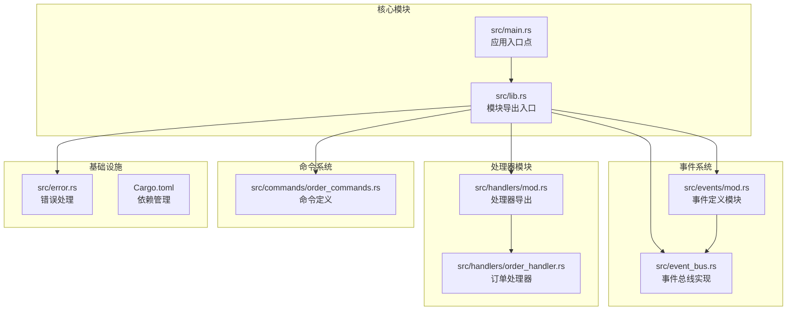

**图表来源**
- [lib.rs:1-9](file://src/lib.rs#L1-L9)
- [event_bus.rs:1-257](file://src/event_bus.rs#L1-L257)
- [order_handler.rs:1-137](file://src/handlers/order_handler.rs#L1-L137)

**章节来源**
- [lib.rs:1-9](file://src/lib.rs#L1-L9)
- [Cargo.toml:1-27](file://Cargo.toml#L1-L27)

## 核心组件

### 事件总线接口设计

事件总线系统提供了统一的事件发布/订阅接口，支持异步事件处理和并发安全的处理器管理。

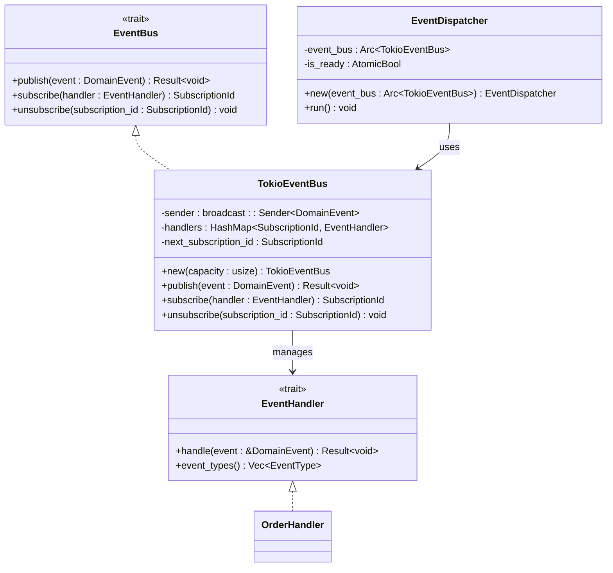

**图表来源**
- [event_bus.rs:18-110](file://src/event_bus.rs#L18-L110)
- [order_handler.rs:16-91](file://src/handlers/order_handler.rs#L16-L91)

### 事件类型系统

系统定义了完整的事件类型体系，涵盖市场数据、交易执行、账户管理和风险管理等各个领域。

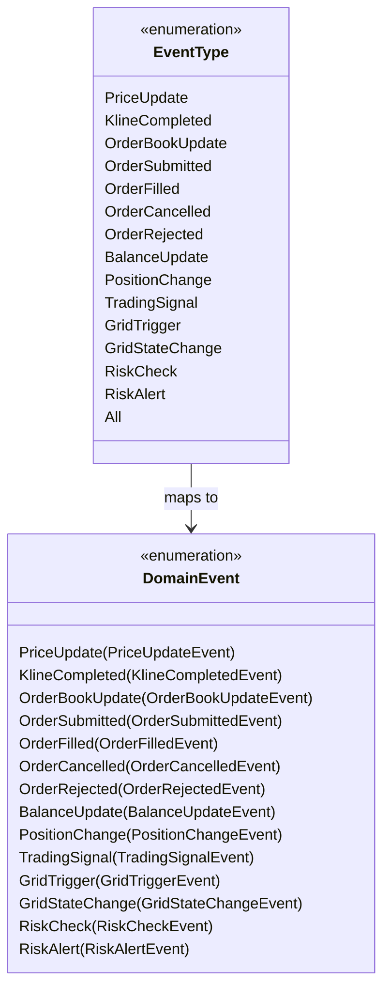

**图表来源**
- [event_bus.rs:42-59](file://src/event_bus.rs#L42-L59)
- [events/mod.rs:48-89](file://src/events/mod.rs#L48-L89)

**章节来源**
- [event_bus.rs:18-181](file://src/event_bus.rs#L18-L181)
- [events/mod.rs:48-102](file://src/events/mod.rs#L48-L102)

## 架构概览

系统采用事件驱动架构，通过事件总线实现组件间的松耦合通信：

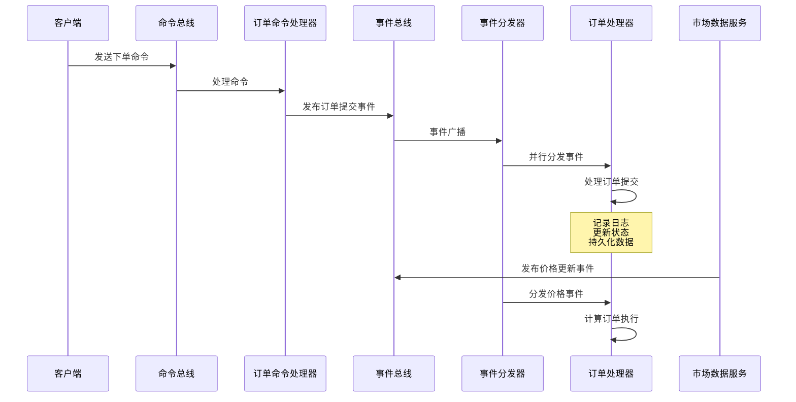

**图表来源**
- [main.rs:10-93](file://src/main.rs#L10-L93)
- [order_handler.rs:93-136](file://src/handlers/order_handler.rs#L93-L136)

系统架构特点：
- **异步事件处理**：基于Tokio异步运行时，支持高并发事件处理
- **松耦合设计**：通过事件总线实现组件解耦
- **并行处理**：事件分发器并行处理多个处理器
- **可扩展性**：支持动态注册和注销处理器

## 详细组件分析

### 订单处理器实现

订单处理器是系统中最核心的业务处理器之一，负责处理所有订单相关的事件：

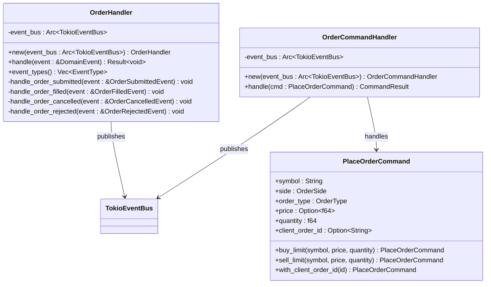

**图表来源**
- [order_handler.rs:16-91](file://src/handlers/order_handler.rs#L16-L91)
- [order_handler.rs:93-136](file://src/handlers/order_handler.rs#L93-L136)
- [order_commands.rs:37-72](file://src/commands/order_commands.rs#L37-L72)

#### 订单生命周期管理

订单处理器实现了完整的订单生命周期管理：

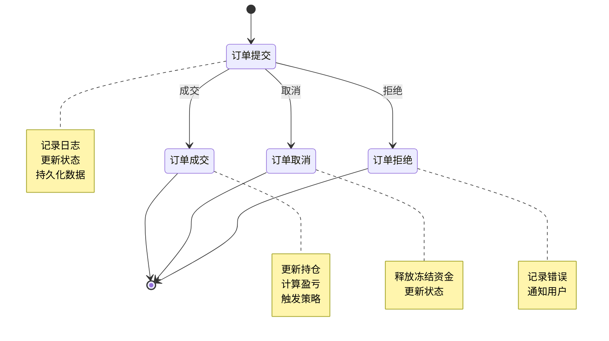

**图表来源**
- [order_handler.rs:26-65](file://src/handlers/order_handler.rs#L26-L65)

#### 订单状态跟踪机制

系统通过事件驱动的方式实现订单状态的实时跟踪：

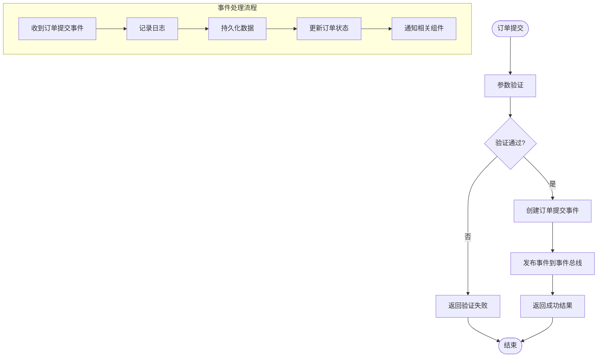

**图表来源**
- [order_handler.rs:102-135](file://src/handlers/order_handler.rs#L102-L135)

**章节来源**
- [order_handler.rs:16-136](file://src/handlers/order_handler.rs#L16-L136)

### 事件处理器注册机制

系统提供了灵活的处理器注册和管理机制：

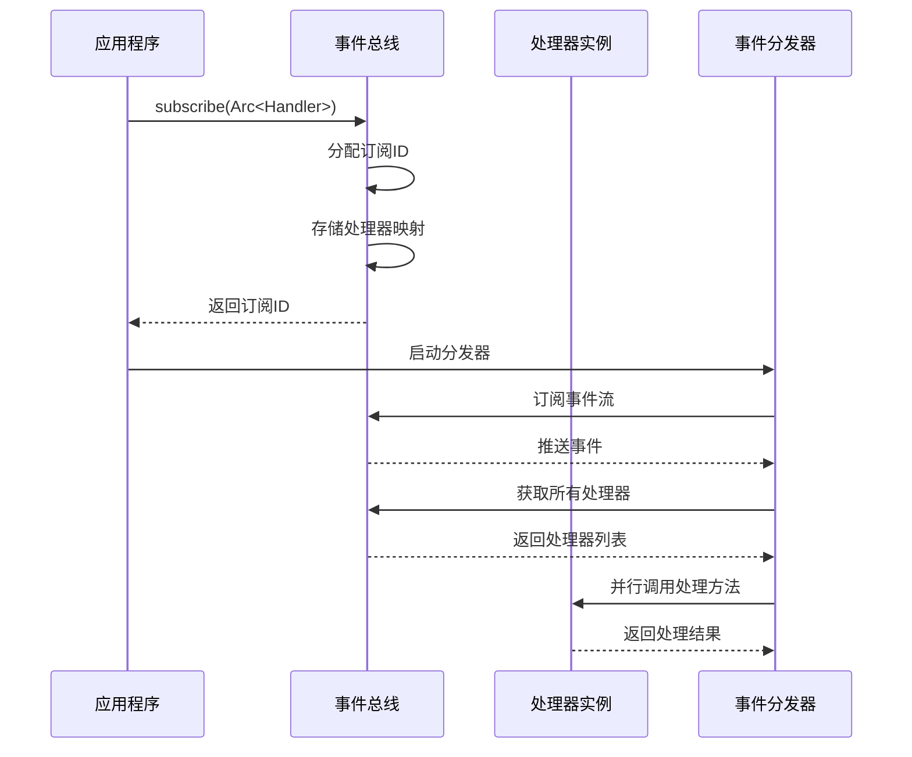

**图表来源**
- [event_bus.rs:95-110](file://src/event_bus.rs#L95-L110)
- [event_bus.rs:129-157](file://src/event_bus.rs#L129-L157)

**章节来源**
- [event_bus.rs:95-157](file://src/event_bus.rs#L95-L157)

### 通用事件处理器模板

系统提供了通用的事件处理器模板，支持快速开发自定义处理器：

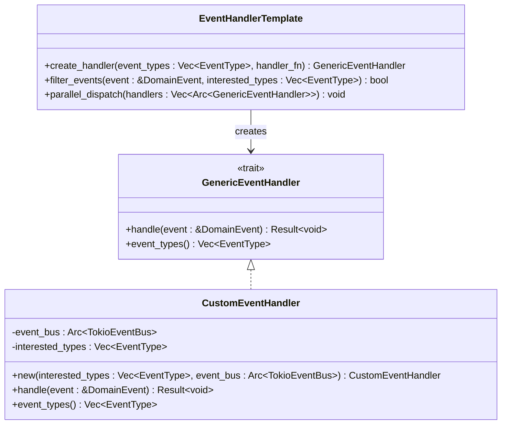

**图表来源**
- [event_bus.rs:31-39](file://src/event_bus.rs#L31-L39)

## 依赖关系分析

系统采用清晰的依赖层次结构，确保模块间的松耦合：

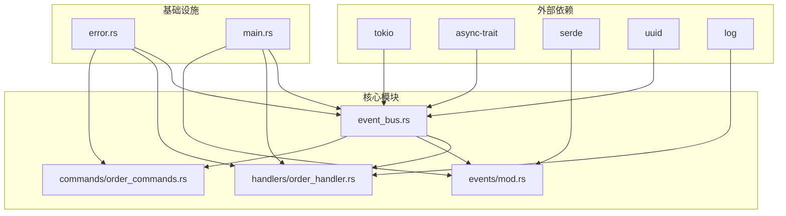

**图表来源**
- [Cargo.toml:6-24](file://Cargo.toml#L6-L24)
- [lib.rs:1-9](file://src/lib.rs#L1-L9)

**章节来源**
- [Cargo.toml:6-24](file://Cargo.toml#L6-L24)
- [lib.rs:1-9](file://src/lib.rs#L1-L9)

## 性能考虑

### 异步处理模式

系统采用异步事件处理模式，通过Tokio运行时实现高效的并发处理：

- **非阻塞I/O**：使用Tokio的异步网络库处理WebSocket连接
- **并行事件分发**：事件分发器并行调用所有注册的处理器
- **零拷贝优化**：事件数据通过Arc共享，避免不必要的数据复制
- **内存池管理**：使用parking_lot的RwLock实现高效的读写锁

### 错误处理策略

系统实现了多层次的错误处理机制：

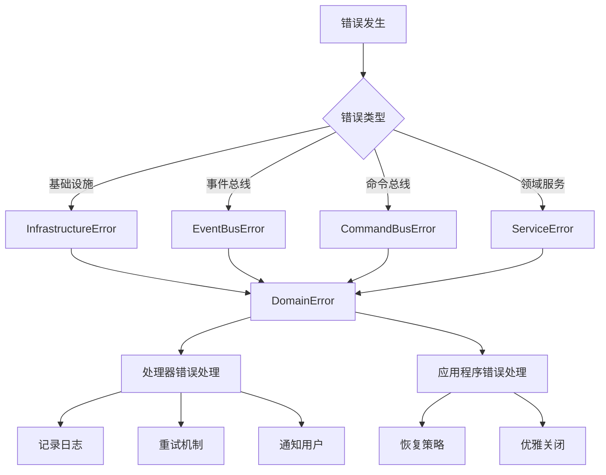

**图表来源**
- [error.rs:12-128](file://src/error.rs#L12-L128)

### 性能优化技巧

1. **事件过滤优化**：处理器可以指定感兴趣的事件类型，减少不必要的处理
2. **批量处理**：事件分发器支持批量事件处理，提高吞吐量
3. **内存管理**：使用Arc智能指针实现共享所有权，避免重复分配
4. **并发控制**：通过Tokio的任务调度实现高效的并发控制

**章节来源**
- [error.rs:12-169](file://src/error.rs#L12-L169)

## 故障排除指南

### 常见问题诊断

#### 事件未被处理

**症状**：事件发布后没有响应
**排查步骤**：
1. 检查处理器是否正确注册
2. 验证事件类型过滤设置
3. 确认事件分发器正在运行
4. 检查处理器的event_types实现

#### 订阅ID冲突

**症状**：处理器注册失败或行为异常
**解决方案**：
- 使用事件总线提供的订阅ID管理机制
- 确保每个处理器都有唯一的订阅ID
- 实现适当的清理机制

#### 内存泄漏

**症状**：长时间运行后内存使用持续增长
**预防措施**：
- 及时取消不需要的订阅
- 使用弱引用避免循环引用
- 监控Arc引用计数

### 调试工具和技巧

1. **日志级别调整**：根据需要调整日志详细程度
2. **事件追踪**：使用EventMetadata中的correlation_id追踪事件流
3. **性能监控**：监控事件处理延迟和吞吐量
4. **内存分析**：定期检查内存使用情况

**章节来源**
- [event_bus.rs:183-256](file://src/event_bus.rs#L183-L256)

## 结论

Binance Rust事件驱动交易系统通过精心设计的事件处理器架构，实现了高性能、可扩展的交易系统。系统的主要优势包括：

- **事件驱动架构**：通过事件总线实现组件间的松耦合通信
- **异步处理能力**：利用Tokio异步运行时实现高并发处理
- **模块化设计**：清晰的模块划分便于维护和扩展
- **完善的错误处理**：多层次的错误处理机制确保系统稳定性
- **灵活的扩展性**：支持动态注册和注销处理器

该系统为构建复杂的金融交易应用提供了坚实的基础，开发者可以基于现有的事件处理器模板快速实现自定义的业务逻辑。通过遵循系统的架构原则和最佳实践，可以构建出高性能、可靠的事件驱动交易系统。