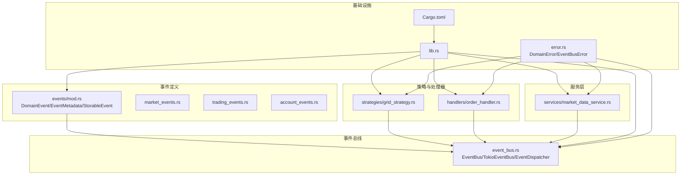
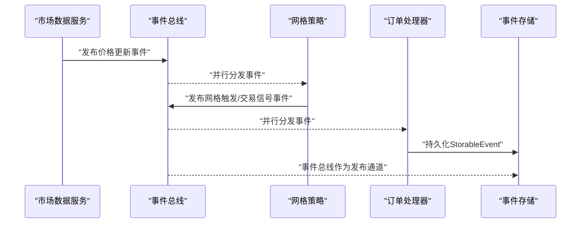
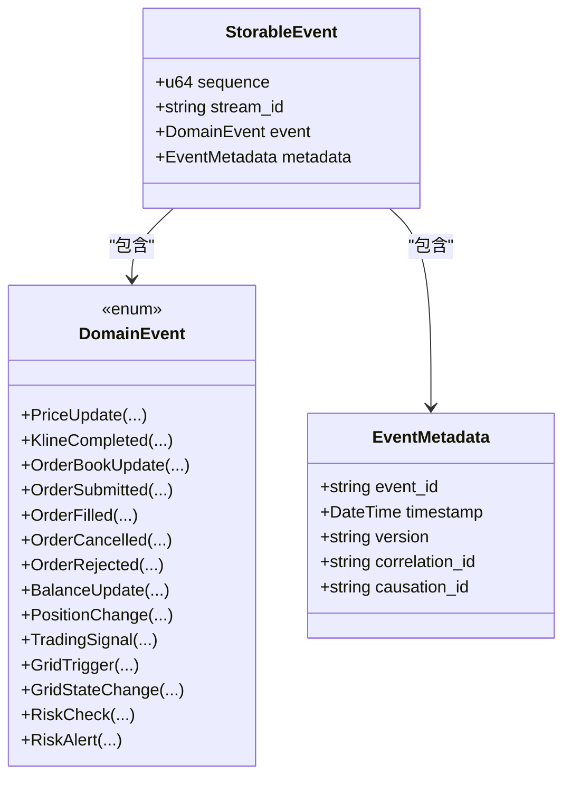
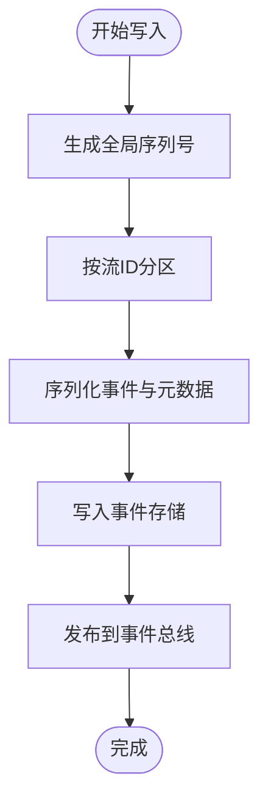
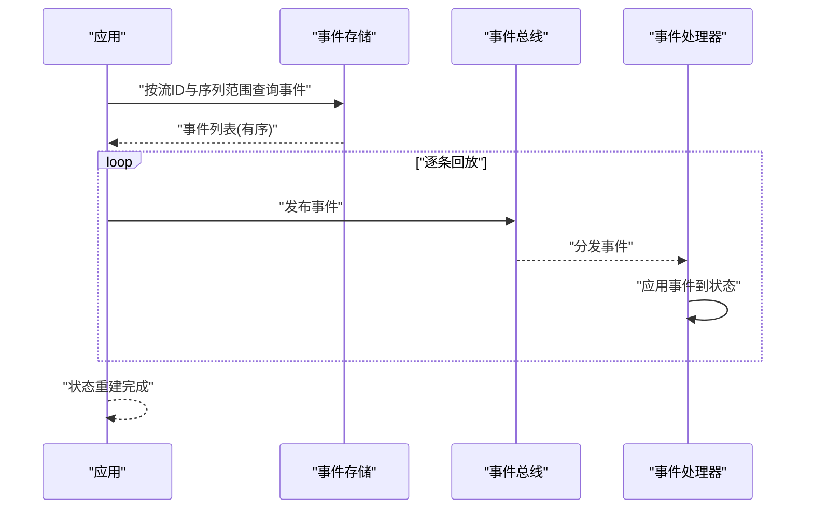
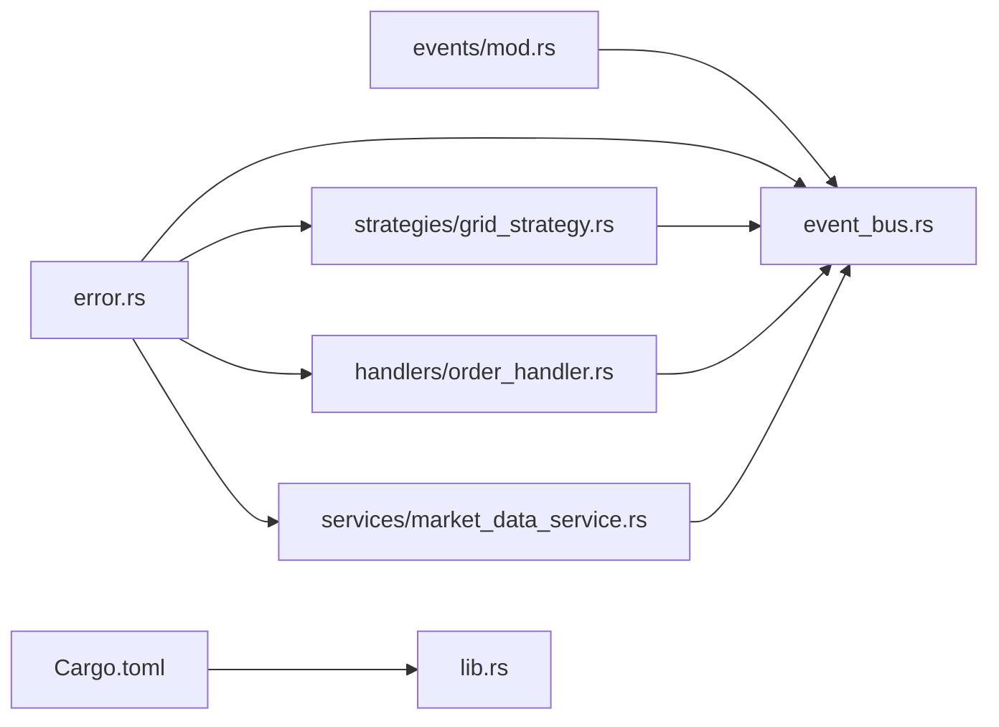

# 事件持久化与回放

<cite>
**本文引用的文件**
- [lib.rs](file://src/lib.rs)
- [event_bus.rs](file://src/event_bus.rs)
- [events/mod.rs](file://src/events/mod.rs)
- [events/market_events.rs](file://src/events/market_events.rs)
- [events/trading_events.rs](file://src/events/trading_events.rs)
- [events/account_events.rs](file://src/events/account_events.rs)
- [handlers/order_handler.rs](file://src/handlers/order_handler.rs)
- [strategies/grid_strategy.rs](file://src/strategies/grid_strategy.rs)
- [services/market_data_service.rs](file://src/services/market_data_service.rs)
- [error.rs](file://src/error.rs)
- [Cargo.toml](file://Cargo.toml)
- [EVENT_DRIVEN_REFACTOR_GUIDE.md](file://docs/EVENT_DRIVEN_REFACTOR_GUIDE.md)
</cite>

## 目录
1. [引言](#引言)
2. [项目结构](#项目结构)
3. [核心组件](#核心组件)
4. [架构总览](#架构总览)
5. [详细组件分析](#详细组件分析)
6. [依赖关系分析](#依赖关系分析)
7. [性能考量](#性能考量)
8. [故障排查指南](#故障排查指南)
9. [结论](#结论)
10. [附录](#附录)

## 引言
本文件面向Binance Rust事件驱动交易系统，聚焦“事件持久化与回放”的技术实现与最佳实践。基于现有代码库，系统已具备完整的事件模型、事件总线与事件处理器框架，并在重构指南中提供了事件持久化与回放的实现思路。本文将围绕以下主题展开：
- 可存储事件StorableEvent的设计与实现要点（序列号、流ID、事件版本控制）
- 事件溯源的实现原理、事件存储策略与查询接口设计
- 事件回放机制（重放顺序、状态重建、一致性保证）
- 性能优化、数据压缩与备份恢复策略
- 事件持久化的最佳实践与故障恢复方案

## 项目结构
系统采用模块化组织，事件定义集中在events模块，事件总线与分发器位于event_bus模块，策略与处理器分别在strategies与handlers目录，服务层负责外部数据接入（如市场数据服务），错误处理统一在error模块。

**图表来源**
- [lib.rs:1-9](file://src/lib.rs#L1-L9)
- [event_bus.rs:1-257](file://src/event_bus.rs#L1-L257)
- [events/mod.rs:1-102](file://src/events/mod.rs#L1-L102)
- [strategies/grid_strategy.rs:1-401](file://src/strategies/grid_strategy.rs#L1-L401)
- [handlers/order_handler.rs:1-33](file://src/handlers/order_handler.rs#L1-L33)
- [services/market_data_service.rs:1-503](file://src/services/market_data_service.rs#L1-L503)
- [error.rs:1-169](file://src/error.rs#L1-L169)
- [Cargo.toml:1-27](file://Cargo.toml#L1-L27)

**章节来源**
- [lib.rs:1-9](file://src/lib.rs#L1-L9)
- [Cargo.toml:1-27](file://Cargo.toml#L1-L27)

## 核心组件
- 事件模型与元数据
  - DomainEvent：统一事件枚举，涵盖市场、交易、账户、策略、风控事件。
  - EventMetadata：事件元数据，包含事件唯一ID、时间戳、版本、关联ID与因果ID。
  - StorableEvent：事件溯源专用载体，包含全局序列号、聚合根流ID、事件体与元数据。
- 事件总线与分发
  - EventBus与TokioEventBus：异步广播式事件总线，支持订阅、取消订阅与并发分发。
  - EventDispatcher：事件接收与并行处理分发器。
- 事件处理器
  - EventHandler：事件处理抽象，策略与处理器均实现该接口。
- 服务与策略
  - MarketDataService：从Binance WebSocket拉取市场数据并发布价格更新事件。
  - GridStrategy：监听价格事件，生成网格触发与交易信号事件。
  - OrderHandler：示例处理器，演示如何消费订单相关事件（注释中预留持久化位置）。

**章节来源**
- [events/mod.rs:21-102](file://src/events/mod.rs#L21-L102)
- [event_bus.rs:18-110](file://src/event_bus.rs#L18-L110)
- [event_bus.rs:112-158](file://src/event_bus.rs#L112-L158)
- [strategies/grid_strategy.rs:156-278](file://src/strategies/grid_strategy.rs#L156-L278)
- [handlers/order_handler.rs:9-33](file://src/handlers/order_handler.rs#L9-L33)
- [services/market_data_service.rs:34-440](file://src/services/market_data_service.rs#L34-L440)

## 架构总览
事件驱动流水线如下：
- 市场数据服务从Binance WebSocket接收行情，解析为DomainEvent并发布到事件总线。
- 事件总线将事件广播给所有订阅的处理器（策略、订单处理器等）。
- 处理器根据业务逻辑产生新的事件（如网格触发、交易信号），再次发布到事件总线。
- 事件持久化层（见“事件持久化与回放”章节）负责将StorableEvent写入存储，并提供查询与回放能力。

**图表来源**
- [services/market_data_service.rs:304-407](file://src/services/market_data_service.rs#L304-L407)
- [strategies/grid_strategy.rs:189-252](file://src/strategies/grid_strategy.rs#L189-L252)
- [handlers/order_handler.rs:26-33](file://src/handlers/order_handler.rs#L26-L33)
- [event_bus.rs:88-110](file://src/event_bus.rs#L88-L110)

## 详细组件分析

### 可存储事件StorableEvent设计与实现
- 结构组成
  - sequence：全局递增序列号，用于事件排序与回放顺序保证。
  - stream_id：流ID，代表聚合根（如订单、账户）的唯一标识，用于按流查询与回放。
  - event：DomainEvent，事件负载。
  - metadata：EventMetadata，包含事件版本、时间戳、因果链等。
- 版本控制
  - EventMetadata.version用于事件版本追踪，便于演进兼容与回放校验。
- 一致性与因果链
  - EventMetadata.causation_id与correlation_id可用于构建事件因果关系与关联追踪。

**图表来源**
- [events/mod.rs:21-102](file://src/events/mod.rs#L21-L102)

**章节来源**
- [events/mod.rs:21-102](file://src/events/mod.rs#L21-L102)

### 事件溯源实现原理与存储策略
- 事件溯源核心思想
  - 以不可变事件记录系统状态变化，通过事件的有序重放重建当前状态。
- 存储策略建议（基于现有StorableEvent设计）
  - 表/集合设计
    - 表名：event_store
    - 字段：sequence（主键/排序键）、stream_id（分区键）、event_type、payload（序列化后的DomainEvent）、metadata（序列化后的EventMetadata）、created_at等。
  - 写入流程
    - 生成全局递增sequence（可使用原子计数器或数据库自增）。
    - 以stream_id进行分区写入，保障同聚合根事件的顺序性。
    - 写入完成后发布到事件总线，确保下游处理器可见。
  - 查询接口
    - 按流ID范围查询：按stream_id与sequence范围查询事件列表。
    - 按事件类型过滤：增加event_type索引，支持类型过滤查询。
    - 最终一致性：写入与发布顺序保证，结合确认机制避免丢弃。

**图表来源**
- [EVENT_DRIVEN_REFACTOR_GUIDE.md:1150-1168](file://docs/EVENT_DRIVEN_REFACTOR_GUIDE.md#L1150-L1168)
- [events/mod.rs:91-102](file://src/events/mod.rs#L91-L102)

**章节来源**
- [EVENT_DRIVEN_REFACTOR_GUIDE.md:1150-1168](file://docs/EVENT_DRIVEN_REFACTOR_GUIDE.md#L1150-L1168)
- [events/mod.rs:91-102](file://src/events/mod.rs#L91-L102)

### 事件回放机制：顺序、状态重建与一致性
- 重放顺序
  - 依据StorableEvent.sequence严格升序回放；若存在并发写入，需结合stream_id分区内排序。
- 状态重建
  - 处理器实现事件应用接口，按事件类型应用到内存状态；必要时引入快照（snapshot）减少回放成本。
- 一致性保证
  - 使用事务写入事件存储与发布，或采用发布前置的确认机制（参考重构指南中的发布确认流程）。
  - 对于跨聚合根的最终一致性场景，采用补偿事务或幂等处理。

**图表来源**
- [EVENT_DRIVEN_REFACTOR_GUIDE.md:1150-1168](file://docs/EVENT_DRIVEN_REFACTOR_GUIDE.md#L1150-L1168)
- [event_bus.rs:129-157](file://src/event_bus.rs#L129-L157)

**章节来源**
- [EVENT_DRIVEN_REFACTOR_GUIDE.md:1150-1168](file://docs/EVENT_DRIVEN_REFACTOR_GUIDE.md#L1150-L1168)
- [event_bus.rs:129-157](file://src/event_bus.rs#L129-L157)

### 事件存储性能优化、压缩与备份恢复
- 性能优化
  - 批量写入：累积一定数量事件后批量写入，降低I/O次数。
  - 异步写入：写入与发布并行，提升吞吐。
  - 分区与分片：按stream_id哈希分区，提高并发读写能力。
- 数据压缩
  - 事件载荷采用高效序列化（如bincode或更紧凑的二进制格式），必要时启用压缩（如zstd/snappy）。
- 备份与恢复
  - 定期快照：定期生成聚合根状态快照，缩短回放时间。
  - 归档策略：历史事件归档至低成本存储，保留最近N天的热数据在高性能存储。
  - 恢复流程：先恢复快照，再按sequence增量回放到最新状态。

**章节来源**
- [EVENT_DRIVEN_REFACTOR_GUIDE.md:1150-1168](file://docs/EVENT_DRIVEN_REFACTOR_GUIDE.md#L1150-L1168)

### 事件持久化最佳实践与故障恢复
- 最佳实践
  - 幂等性：事件处理器需保证重复应用不会产生副作用。
  - 版本演进：通过EventMetadata.version与Schema迁移策略，平滑演进事件结构。
  - 分布式追踪：利用correlation_id与causation_id串联事件链路，便于排障。
- 故障恢复
  - 丢事件检测：对比发布与持久化确认，发现缺失则触发重放。
  - 乱序处理：结合sequence与timestamp，按顺序窗口处理，延迟窗口外事件。
  - 调试与可观测性：使用日志与指标监控事件积压、回放速率与错误率。

**章节来源**
- [EVENT_DRIVEN_REFACTOR_GUIDE.md:1150-1194](file://docs/EVENT_DRIVEN_REFACTOR_GUIDE.md#L1150-L1194)

## 依赖关系分析
- 模块耦合
  - 事件定义模块被事件总线、策略、处理器广泛依赖，形成核心依赖环。
  - 服务层（市场数据服务）依赖事件总线进行事件发布。
  - 错误处理模块为各层提供统一错误类型。
- 外部依赖
  - tokio、tokio-tungstenite、serde、chrono、uuid等为事件总线、序列化与时间处理提供支撑。

**图表来源**
- [lib.rs:1-9](file://src/lib.rs#L1-L9)
- [Cargo.toml:6-24](file://Cargo.toml#L6-L24)

**章节来源**
- [lib.rs:1-9](file://src/lib.rs#L1-L9)
- [Cargo.toml:6-24](file://Cargo.toml#L6-L24)

## 性能考量
- 事件总线
  - 广播通道容量与背压：合理设置容量，避免内存膨胀；在高吞吐场景下考虑多通道或分区。
  - 并行分发：EventDispatcher对多个处理器并行处理，注意处理器内部锁竞争与共享状态保护。
- 事件序列化
  - 使用高效的序列化库与二进制格式，减少CPU与带宽开销。
- 存储层
  - 写入批量化、异步刷盘与索引优化（按stream_id与sequence）。
  - 读放大控制：只读取所需范围，避免全表扫描。

## 故障排查指南
- 常见问题与定位
  - 事件丢失：检查发布前置持久化与确认机制；核对事件存储写入与事件总线发布之间的顺序。
  - 事件乱序：确认sequence生成与应用顺序；对延迟事件设置处理窗口。
  - 处理器崩溃：启用幂等与快照，回放时跳过已应用事件。
- 日志与监控
  - 记录事件ID、流ID、序列号、处理耗时与错误码，便于快速定位。
  - 监控事件积压、回放速率与错误率，异常时及时告警。

**章节来源**
- [EVENT_DRIVEN_REFACTOR_GUIDE.md:1150-1226](file://docs/EVENT_DRIVEN_REFACTOR_GUIDE.md#L1150-L1226)
- [error.rs:85-99](file://src/error.rs#L85-L99)

## 结论
本系统已具备完善的事件模型与事件总线框架，StorableEvent为事件持久化与回放提供了清晰的数据结构基础。结合重构指南中的发布前置确认、顺序回放与一致性保证策略，可进一步完善事件存储与回放能力，满足生产级的可靠性与性能要求。建议尽快落地事件存储实现与回放接口，并配套监控与告警体系，持续优化写入与查询性能。

## 附录
- 事件类型一览（来自DomainEvent枚举）
  - 市场数据：价格更新、K线完成、订单簿更新
  - 交易：订单提交、成交、取消、拒绝
  - 账户：余额更新、持仓变动
  - 策略：交易信号、网格触发、网格状态变更
  - 风控：风控检查、风控告警

**章节来源**
- [events/mod.rs:48-89](file://src/events/mod.rs#L48-L89)