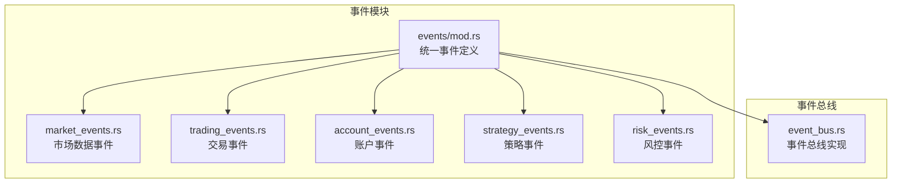
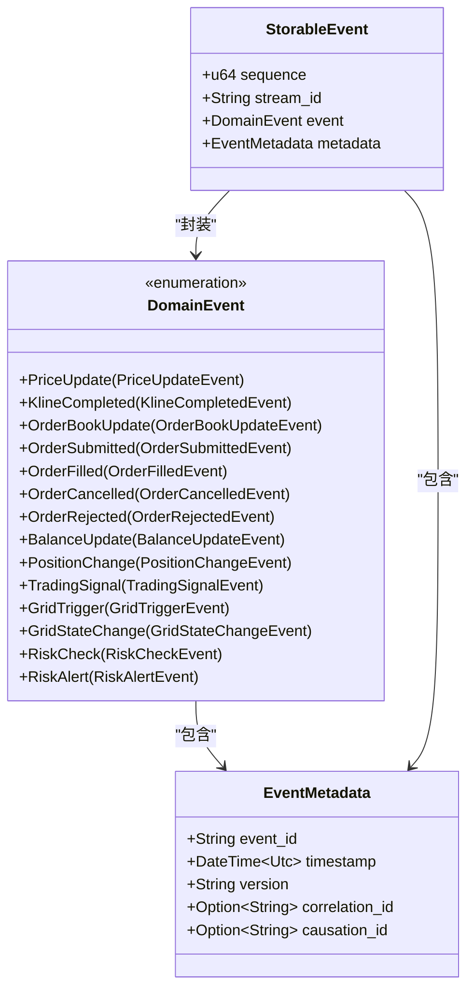
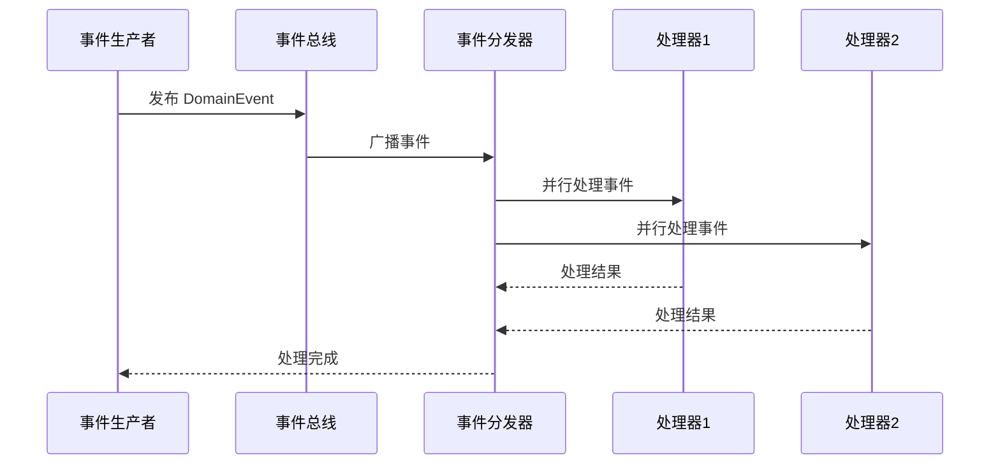
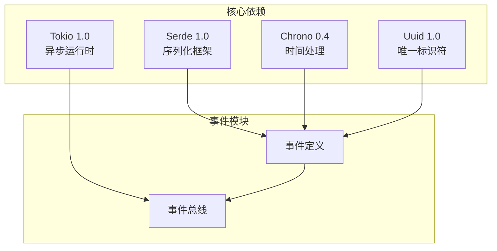

# 事件类型定义

<cite>
**本文档引用的文件**
- [src/events/mod.rs](file://src/events/mod.rs)
- [src/events/market_events.rs](file://src/events/market_events.rs)
- [src/events/trading_events.rs](file://src/events/trading_events.rs)
- [src/events/account_events.rs](file://src/events/account_events.rs)
- [src/events/strategy_events.rs](file://src/events/strategy_events.rs)
- [src/events/risk_events.rs](file://src/events/risk_events.rs)
- [src/event_bus.rs](file://src/event_bus.rs)
- [src/lib.rs](file://src/lib.rs)
- [Cargo.toml](file://Cargo.toml)
</cite>

## 目录
1. [简介](#简介)
2. [项目结构](#项目结构)
3. [核心组件](#核心组件)
4. [架构概览](#架构概览)
5. [详细组件分析](#详细组件分析)
6. [依赖分析](#依赖分析)
7. [性能考虑](#性能考虑)
8. [故障排除指南](#故障排除指南)
9. [结论](#结论)

## 简介

本文件详细介绍了Binance Rust事件驱动交易系统中的事件类型定义。该系统采用统一的事件枚举设计模式，通过DomainEvent统一管理所有类型的事件，包括市场数据事件、交易事件、账户事件、策略事件和风控事件。系统还提供了完整的事件元数据管理机制，支持事件溯源和版本控制。

## 项目结构

事件系统采用模块化设计，按照功能域进行组织：

**图表来源**
- [src/events/mod.rs:1-102](file://src/events/mod.rs#L1-L102)
- [src/event_bus.rs:1-257](file://src/event_bus.rs#L1-L257)

**章节来源**
- [src/lib.rs:1-9](file://src/lib.rs#L1-L9)
- [Cargo.toml:1-27](file://Cargo.toml#L1-L27)

## 核心组件

### 统一事件枚举 DomainEvent

系统采用统一的DomainEvent枚举来管理所有事件类型，通过Serde的标签化序列化实现事件类型的动态识别。

**图表来源**
- [src/events/mod.rs:48-102](file://src/events/mod.rs#L48-L102)

### 事件元数据 EventMetadata

EventMetadata为所有事件提供统一的元数据管理，包含事件标识、时间戳、版本控制和关联追踪信息。

**章节来源**
- [src/events/mod.rs:21-46](file://src/events/mod.rs#L21-L46)

## 架构概览

事件驱动系统的整体架构采用发布-订阅模式，通过事件总线实现松耦合的组件通信：

**图表来源**
- [src/event_bus.rs:87-158](file://src/event_bus.rs#L87-L158)

**章节来源**
- [src/event_bus.rs:18-59](file://src/event_bus.rs#L18-L59)

## 详细组件分析

### 市场数据事件

市场数据事件负责处理交易市场的实时数据更新，包括价格、K线和订单簿信息。

#### PriceUpdateEvent（价格更新事件）

价格更新事件记录单一交易对的价格变化信息，包含当前价格、24小时涨跌幅和时间戳。

| 字段名 | 类型 | 描述 | 示例值 |
|--------|------|------|--------|
| symbol | String | 交易对符号 | "BTCUSDT" |
| price | f64 | 当前价格 | 50000.0 |
| price_change_pct_24h | f64 | 24小时涨跌幅百分比 | 2.5 |
| timestamp | u64 | 时间戳（毫秒） | 1234567890000 |

**章节来源**
- [src/events/market_events.rs:7-18](file://src/events/market_events.rs#L7-L18)

#### KlineCompletedEvent（K线完成事件）

K线完成事件记录指定时间间隔的完整K线数据，包含开盘、最高、最低、收盘价格和成交量。

| 字段名 | 类型 | 描述 | 示例值 |
|--------|------|------|--------|
| symbol | String | 交易对符号 | "BTCUSDT" |
| interval | String | K线间隔 | "1h" |
| open | f64 | 开盘价 | 3000.0 |
| high | f64 | 最高价 | 3050.0 |
| low | f64 | 最低价 | 2980.0 |
| close | f64 | 收盘价 | 3020.0 |
| volume | f64 | 成交量 | 10000.0 |
| close_time | u64 | 收盘时间（毫秒） | 1234567890000 |

**章节来源**
- [src/events/market_events.rs:20-39](file://src/events/market_events.rs#L20-L39)

#### OrderBookUpdateEvent（订单簿更新事件）

订单簿更新事件记录市场最佳买卖价和对应的挂单量，以及更新时间戳。

| 字段名 | 类型 | 描述 | 示例值 |
|--------|------|------|--------|
| symbol | String | 交易对符号 | "BTCUSDT" |
| best_bid | f64 | 买一价 | 49999.0 |
| best_ask | f64 | 卖一价 | 50001.0 |
| bid_qty | f64 | 买一量 | 0.5 |
| ask_qty | f64 | 卖一量 | 0.3 |
| timestamp | u64 | 时间戳（毫秒） | 1234567890000 |

**章节来源**
- [src/events/market_events.rs:41-56](file://src/events/market_events.rs#L41-L56)

### 交易事件

交易事件处理订单生命周期中的各种状态变化，从订单提交到最终成交或取消。

#### OrderSubmittedEvent（订单提交事件）

订单提交事件记录新订单的创建信息，包含订单ID、交易对、方向、类型和数量。

| 字段名 | 类型 | 描述 | 示例值 |
|--------|------|------|--------|
| order_id | String | 订单ID | "uuid字符串" |
| symbol | String | 交易对符号 | "BTCUSDT" |
| side | String | 订单方向 | "BUY" |
| order_type | String | 订单类型 | "LIMIT" |
| price | Option<f64> | 价格（市价单为None） | Some(50000.0) |
| quantity | f64 | 数量 | 0.001 |
| timestamp | u64 | 时间戳（毫秒） | 当前时间戳 |

**章节来源**
- [src/events/trading_events.rs:8-25](file://src/events/trading_events.rs#L8-L25)

#### OrderFilledEvent（订单成交事件）

订单成交事件记录订单部分或完全成交的信息，包含成交ID、成交价格、数量和手续费。

| 字段名 | 类型 | 描述 | 示例值 |
|--------|------|------|--------|
| order_id | String | 订单ID | "order_123" |
| fill_id | String | 成交ID | "fill_456" |
| fill_price | f64 | 成交价格 | 50000.0 |
| fill_qty | f64 | 成交数量 | 0.001 |
| commission | f64 | 手续费 | 0.5 |
| commission_asset | String | 手续费资产 | "USDT" |
| is_maker | bool | 是否卖方 | false |
| timestamp | u64 | 时间戳（毫秒） | 1234567890000 |

**章节来源**
- [src/events/trading_events.rs:50-69](file://src/events/trading_events.rs#L50-L69)

#### OrderCancelledEvent（订单取消事件）

订单取消事件记录订单被取消的情况，包含取消原因和时间戳。

| 字段名 | 类型 | 描述 | 示例值 |
|--------|------|------|--------|
| order_id | String | 订单ID | "order_123" |
| symbol | String | 交易对符号 | "BTCUSDT" |
| reason | String | 取消原因 | "用户主动取消" |
| timestamp | u64 | 时间戳（毫秒） | 1234567890000 |

**章节来源**
- [src/events/trading_events.rs:71-82](file://src/events/trading_events.rs#L71-L82)

#### OrderRejectedEvent（订单拒绝事件）

订单拒绝事件记录订单被交易所或系统拒绝的情况，包含拒绝原因和错误代码。

| 字段名 | 类型 | 描述 | 示例值 |
|--------|------|------|--------|
| order_id | Option<String> | 订单ID（如果有） | Some("order_123") |
| symbol | String | 交易对符号 | "BTCUSDT" |
| reason | String | 拒绝原因 | "价格超出限制" |
| error_code | Option<i32> | 错误代码 | Some(1001) |
| timestamp | u64 | 时间戳（毫秒） | 1234567890000 |

**章节来源**
- [src/events/trading_events.rs:84-97](file://src/events/trading_events.rs#L84-L97)

### 账户事件

账户事件处理用户账户的资产和持仓变化，包括余额更新和持仓变动。

#### BalanceUpdateEvent（余额更新事件）

余额更新事件记录特定资产的余额变化，包含可用余额、冻结余额和总余额。

| 字段名 | 类型 | 描述 | 示例值 |
|--------|------|------|--------|
| asset | String | 资产符号 | "USDT" |
| available_balance | f64 | 可用余额 | 10000.0 |
| locked_balance | f64 | 冻结余额 | 500.0 |
| total_balance | f64 | 总余额 | 10500.0 |
| timestamp | u64 | 时间戳（毫秒） | 当前时间戳 |

**章节来源**
- [src/events/account_events.rs:7-20](file://src/events/account_events.rs#L7-L20)

#### PositionChangeEvent（持仓变动事件）

持仓变动事件记录特定交易对的持仓变化，包含持仓方向、数量、开仓均价和未实现盈亏。

| 字段名 | 类型 | 描述 | 示例值 |
|--------|------|------|--------|
| symbol | String | 交易对符号 | "BTCUSDT" |
| side | String | 持仓方向 | "LONG" |
| quantity | f64 | 持仓数量 | 0.5 |
| entry_price | f64 | 开仓均价 | 45000.0 |
| unrealized_pnl | f64 | 未实现盈亏 | 2500.0 |
| leverage | i32 | 杠杆倍数 | 10 |
| timestamp | u64 | 时间戳（毫秒） | 1234567890000 |

**章节来源**
- [src/events/account_events.rs:37-54](file://src/events/account_events.rs#L37-L54)

### 策略事件

策略事件处理交易策略的信号生成、网格交易触发和状态变化。

#### TradingSignalEvent（交易信号事件）

交易信号事件记录策略生成的交易建议，包含信号类型、强度和建议价格。

| 字段名 | 类型 | 描述 | 示例值 |
|--------|------|------|--------|
| signal_id | String | 信号ID | "signal_001" |
| strategy_id | String | 策略ID | "strategy_grid_1" |
| symbol | String | 交易对符号 | "BTCUSDT" |
| signal_type | String | 信号类型 | "BUY" |
| strength | f64 | 信号强度（0.0-1.0） | 0.8 |
| suggested_price | f64 | 建议价格 | 50000.0 |
| suggested_quantity | Option<f64> | 建议数量 | Some(0.001) |
| stop_loss_price | Option<f64> | 止损价格 | Some(49000.0) |
| take_profit_price | Option<f64> | 止盈价格 | Some(52000.0) |
| timestamp | u64 | 时间戳（毫秒） | 1234567890000 |

**章节来源**
- [src/events/strategy_events.rs:7-30](file://src/events/strategy_events.rs#L7-L30)

#### GridTriggerEvent（网格触发事件）

网格触发事件记录网格交易策略的触发条件，包含网格级别、触发价格和操作类型。

| 字段名 | 类型 | 描述 | 示例值 |
|--------|------|------|--------|
| grid_id | String | 网格ID | "grid_strategy_1_5" |
| strategy_id | String | 策略ID | "grid_strategy_1" |
| symbol | String | 交易对符号 | "BTCUSDT" |
| grid_level | i32 | 网格级别 | 5 |
| trigger_price | f64 | 触发价格 | 49500.0 |
| action | GridAction | 操作类型 | GridAction::Buy |
| quantity | f64 | 数量 | 0.001 |
| expected_profit | f64 | 预期利润 | 0.0 |
| timestamp | u64 | 时间戳（毫秒） | 当前时间戳 |

**章节来源**
- [src/events/strategy_events.rs:32-53](file://src/events/strategy_events.rs#L32-L53)

#### GridStateChangeEvent（网格状态变更事件）

网格状态变更事件记录网格交易策略的状态变化，包含旧状态、新状态和变更原因。

| 字段名 | 类型 | 描述 | 示例值 |
|--------|------|------|--------|
| strategy_id | String | 策略ID | "grid_strategy_1" |
| symbol | String | 交易对符号 | "BTCUSDT" |
| old_state | String | 旧状态 | "ACTIVE" |
| new_state | String | 新状态 | "PAUSED" |
| reason | String | 变更原因 | "手动暂停" |
| current_position | f64 | 当前持仓量 | 0.5 |
| unrealized_pnl | f64 | 当前未实现盈亏 | 2500.0 |
| timestamp | u64 | 时间戳（毫秒） | 1234567890000 |

**章节来源**
- [src/events/strategy_events.rs:61-80](file://src/events/strategy_events.rs#L61-L80)

### 风控事件

风控事件处理风险检查和告警机制，包括资金充足性检查和风险级别评估。

#### RiskCheckEvent（风控检查事件）

风控检查事件记录风险检查的结果，包含检查类型、结果和风险等级。

| 字段名 | 类型 | 描述 | 示例值 |
|--------|------|------|--------|
| check_id | String | 检查ID | "check_001" |
| check_type | RiskCheckType | 检查类型 | CapitalAdequacy |
| result | RiskCheckResult | 检查结果 | Pass |
| risk_level | RiskLevel | 风险等级 | Low |
| risk_score | f64 | 风险分数（0.0-1.0） | 0.2 |
| details | String | 详细信息 | "资金充足" |
| timestamp | u64 | 时间戳（毫秒） | 1234567890000 |

**章节来源**
- [src/events/risk_events.rs:7-24](file://src/events/risk_events.rs#L7-L24)

#### RiskAlertEvent（风控告警事件）

风控告警事件记录风险告警信息，包含告警级别、类型和建议操作。

| 字段名 | 类型 | 描述 | 示例值 |
|--------|------|------|--------|
| alert_id | String | 告警ID | "uuid字符串" |
| level | RiskLevel | 告警级别 | High |
| alert_type | String | 告警类型 | "POSITION_LIMIT" |
| message | String | 告警消息 | "持仓超过限制" |
| triggered_rule | String | 触发的规则 | "max_position_btc <= 1.0" |
| suggested_action | Option<String> | 建议操作 | Some("减少仓位") |
| timestamp | u64 | 时间戳（毫秒） | 当前时间戳 |

**章节来源**
- [src/events/risk_events.rs:55-72](file://src/events/risk_events.rs#L55-L72)

## 依赖分析

事件系统的核心依赖关系如下：

**图表来源**
- [Cargo.toml:6-25](file://Cargo.toml#L6-L25)

**章节来源**
- [Cargo.toml:1-27](file://Cargo.toml#L1-L27)

## 性能考虑

事件系统的性能特性主要体现在以下方面：

### 序列化性能
- 使用Serde进行高效的JSON序列化
- 事件结构简单，序列化开销较小
- 支持二进制格式（如MessagePack）以进一步提升性能

### 并发处理
- 事件总线基于Tokio广播通道实现
- 支持多处理器并行处理同一事件
- 使用原子操作和读写锁保证线程安全

### 内存管理
- 事件对象按需分配，避免内存泄漏
- 支持对象池复用以减少GC压力
- 使用Arc共享数据，避免不必要的克隆

## 故障排除指南

### 事件序列化问题
- 确保所有事件字段都实现了Serde的Serialize和Deserialize特征
- 检查可选字段的正确处理
- 验证时间戳格式的一致性

### 事件总线问题
- 检查事件订阅是否正确注册
- 验证事件处理器的事件类型过滤逻辑
- 确认事件总线容量设置合理

### 版本兼容性问题
- 使用EventMetadata.version字段进行版本控制
- 实现事件升级和降级机制
- 保持向后兼容的字段命名

**章节来源**
- [src/events/mod.rs:21-46](file://src/events/mod.rs#L21-L46)
- [src/event_bus.rs:162-181](file://src/event_bus.rs#L162-L181)

## 结论

Binance Rust事件驱动交易系统通过统一的DomainEvent设计模式，实现了高度模块化的事件管理。系统支持完整的事件生命周期管理，从事件创建、序列化、发布到处理和存储。通过事件元数据和版本控制机制，系统具备了良好的可追溯性和兼容性。事件总线的异步处理能力和并发安全性确保了系统的高性能和可靠性。

该事件系统为构建复杂的金融交易应用提供了坚实的基础，支持从简单的市场数据监控到复杂的算法交易策略执行等各种应用场景。