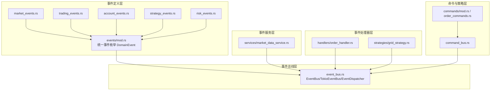
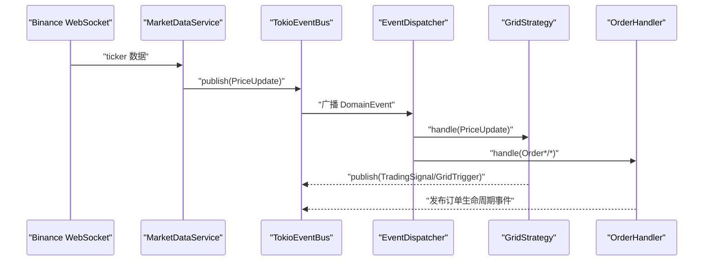
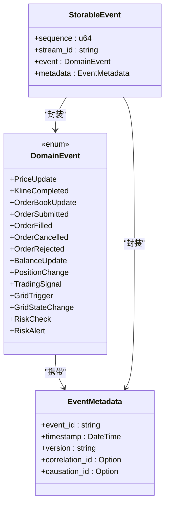
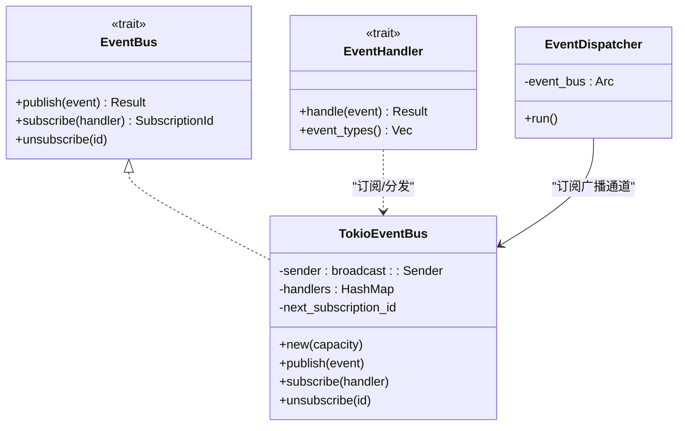
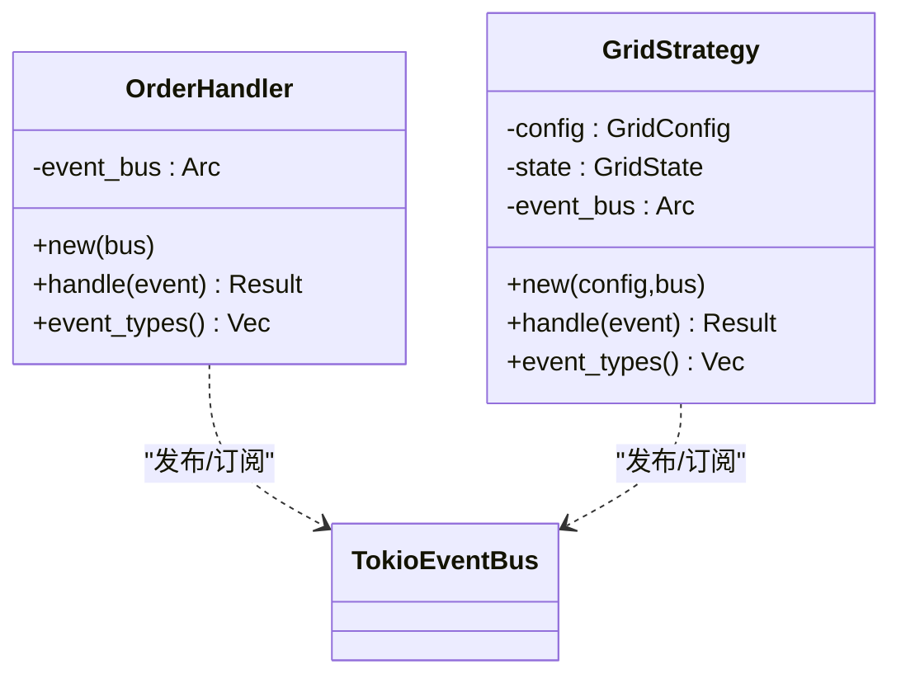
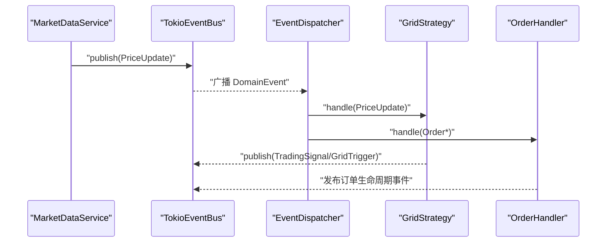
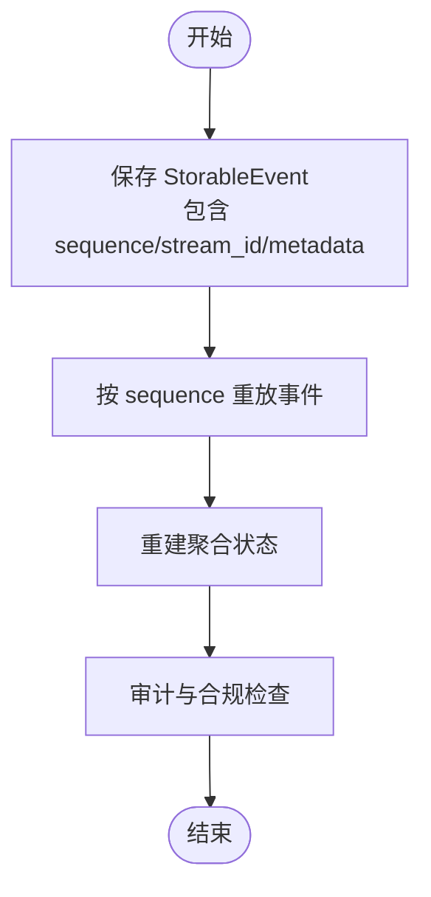
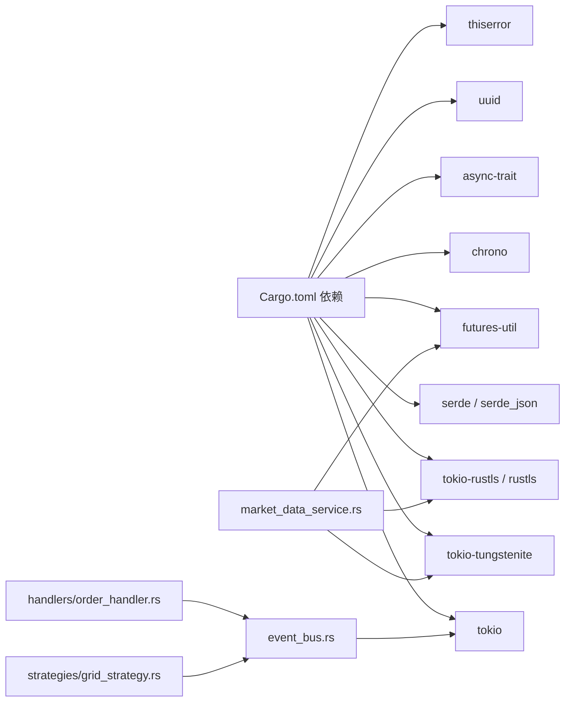
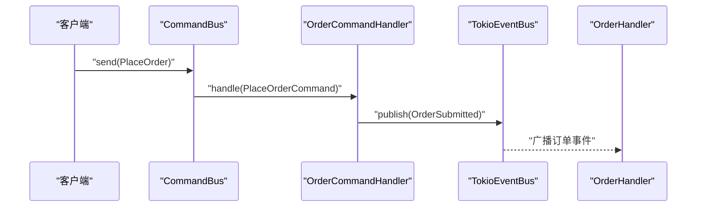

# 事件系统

<cite>
**本文引用的文件**
- [src/events/mod.rs](file://src/events/mod.rs)
- [src/events/market_events.rs](file://src/events/market_events.rs)
- [src/events/trading_events.rs](file://src/events/trading_events.rs)
- [src/events/account_events.rs](file://src/events/account_events.rs)
- [src/events/strategy_events.rs](file://src/events/strategy_events.rs)
- [src/events/risk_events.rs](file://src/events/risk_events.rs)
- [src/event_bus.rs](file://src/event_bus.rs)
- [src/handlers/order_handler.rs](file://src/handlers/order_handler.rs)
- [src/services/market_data_service.rs](file://src/services/market_data_service.rs)
- [src/strategies/grid_strategy.rs](file://src/strategies/grid_strategy.rs)
- [src/command_bus.rs](file://src/command_bus.rs)
- [src/commands/mod.rs](file://src/commands/mod.rs)
- [src/commands/order_commands.rs](file://src/commands/order_commands.rs)
- [src/error.rs](file://src/error.rs)
- [Cargo.toml](file://Cargo.toml)
- [docs/EVENT_DRIVEN_REFACTOR_GUIDE.md](file://docs/EVENT_DRIVEN_REFACTOR_GUIDE.md)
</cite>

## 目录
1. [简介](#简介)
2. [项目结构](#项目结构)
3. [核心组件](#核心组件)
4. [架构总览](#架构总览)
5. [详细组件分析](#详细组件分析)
6. [依赖关系分析](#依赖关系分析)
7. [性能考量](#性能考量)
8. [故障排查指南](#故障排查指南)
9. [结论](#结论)
10. [附录](#附录)

## 简介
本文件系统化阐述 Binance Rust 事件驱动交易系统中的事件模型与处理机制，覆盖事件类型分类、生命周期、处理器实现模式、事件分发与异步处理流程，并给出事件定义、处理器模板与订阅最佳实践。同时结合现有代码，说明事件持久化、事件溯源与事件回放的高级能力与落地路径。

## 项目结构
事件系统围绕“事件定义 + 事件总线 + 事件处理器 + 事件服务”的分层组织，配合命令总线与策略引擎形成完整的事件驱动闭环。

**图表来源**
- [src/events/mod.rs:48-89](file://src/events/mod.rs#L48-L89)
- [src/event_bus.rs:18-110](file://src/event_bus.rs#L18-L110)
- [src/handlers/order_handler.rs:9-91](file://src/handlers/order_handler.rs#L9-L91)
- [src/strategies/grid_strategy.rs:156-278](file://src/strategies/grid_strategy.rs#L156-L278)
- [src/services/market_data_service.rs:34-440](file://src/services/market_data_service.rs#L34-L440)
- [src/command_bus.rs:5-19](file://src/command_bus.rs#L5-L19)
- [src/commands/mod.rs:6-42](file://src/commands/mod.rs#L6-L42)

**章节来源**
- [src/events/mod.rs:1-102](file://src/events/mod.rs#L1-L102)
- [src/event_bus.rs:1-257](file://src/event_bus.rs#L1-L257)
- [src/services/market_data_service.rs:1-503](file://src/services/market_data_service.rs#L1-L503)
- [src/strategies/grid_strategy.rs:1-401](file://src/strategies/grid_strategy.rs#L1-L401)
- [src/handlers/order_handler.rs:1-137](file://src/handlers/order_handler.rs#L1-L137)
- [src/command_bus.rs:1-19](file://src/command_bus.rs#L1-L19)
- [src/commands/mod.rs:1-77](file://src/commands/mod.rs#L1-L77)
- [src/commands/order_commands.rs:1-72](file://src/commands/order_commands.rs#L1-L72)

## 核心组件
- 事件定义与统一枚举：在统一的 DomainEvent 枚举中聚合所有事件类型，便于序列化、路由与持久化。
- 事件元数据：EventMetadata 提供事件唯一标识、时间戳、版本、关联与因果追踪字段。
- 可存储事件：StorableEvent 为事件溯源提供序列号、聚合根标识与元数据。
- 事件总线：TokioEventBus 基于广播通道，EventDispatcher 并行分发事件至所有订阅处理器。
- 事件处理器：实现 EventHandler trait，按事件类型过滤并异步处理。
- 事件服务：MarketDataService 从 Binance WebSocket 接收行情，解析为 PriceUpdateEvent 并发布。
- 命令与命令总线：命令驱动事件产生，例如下单命令触发订单提交事件；CommandBus 路由命令到对应处理器。
- 策略引擎：GridStrategy 监听价格事件，生成交易信号与网格触发事件。

**章节来源**
- [src/events/mod.rs:21-102](file://src/events/mod.rs#L21-L102)
- [src/event_bus.rs:18-181](file://src/event_bus.rs#L18-L181)
- [src/services/market_data_service.rs:34-440](file://src/services/market_data_service.rs#L34-L440)
- [src/handlers/order_handler.rs:9-91](file://src/handlers/order_handler.rs#L9-L91)
- [src/command_bus.rs:5-19](file://src/command_bus.rs#L5-L19)
- [src/strategies/grid_strategy.rs:156-278](file://src/strategies/grid_strategy.rs#L156-L278)

## 架构总览
事件驱动架构以“事件生产者 → 发布事件 → 事件总线 → 订阅者处理”为核心，实现市场数据、交易、账户、策略与风控的解耦协作。

**图表来源**
- [src/services/market_data_service.rs:376-440](file://src/services/market_data_service.rs#L376-L440)
- [src/event_bus.rs:87-158](file://src/event_bus.rs#L87-L158)
- [src/strategies/grid_strategy.rs:264-278](file://src/strategies/grid_strategy.rs#L264-L278)
- [src/handlers/order_handler.rs:68-91](file://src/handlers/order_handler.rs#L68-L91)

## 详细组件分析

### 事件类型与生命周期
- 市场数据事件：价格更新、K 线完成、订单簿更新。生命周期从服务端推送开始，经事件总线分发，最终由策略与风控订阅者消费。
- 交易事件：订单提交、成交、取消、拒绝。生命周期从命令总线产生命令，经命令处理器发布事件，再由订单处理器消费。
- 账户事件：余额更新、持仓变动。通常由账户同步服务或风控服务发布，驱动策略调整与风控拦截。
- 策略事件：交易信号、网格触发、网格状态变更。由策略引擎生成并发布，驱动后续交易或风控动作。
- 风控事件：风控检查、风控告警。由风控监控服务生成，触发拦截或告警。

**图表来源**
- [src/events/mod.rs:48-89](file://src/events/mod.rs#L48-L89)
- [src/events/mod.rs:21-46](file://src/events/mod.rs#L21-L46)
- [src/events/mod.rs:91-102](file://src/events/mod.rs#L91-L102)

**章节来源**
- [src/events/market_events.rs:7-56](file://src/events/market_events.rs#L7-L56)
- [src/events/trading_events.rs:8-97](file://src/events/trading_events.rs#L8-L97)
- [src/events/account_events.rs:7-54](file://src/events/account_events.rs#L7-L54)
- [src/events/strategy_events.rs:7-80](file://src/events/strategy_events.rs#L7-L80)
- [src/events/risk_events.rs:7-72](file://src/events/risk_events.rs#L7-L72)

### 事件总线与分发机制
- 事件总线接口：EventBus 定义发布、订阅、取消订阅能力；EventHandler 定义处理与事件类型过滤。
- TokioEventBus：基于广播通道，支持高吞吐事件分发；EventDispatcher 订阅广播通道并并行调用所有处理器。
- 事件类型枚举：EventType 映射 DomainEvent 子类型，支持 All 通配订阅。

**图表来源**
- [src/event_bus.rs:18-110](file://src/event_bus.rs#L18-L110)
- [src/event_bus.rs:112-158](file://src/event_bus.rs#L112-L158)

**章节来源**
- [src/event_bus.rs:18-181](file://src/event_bus.rs#L18-L181)

### 事件处理器实现模式
- 订单处理器：实现 EventHandler，按 EventType 过滤并处理订单生命周期事件，记录日志并预留持久化与状态更新位置。
- 策略处理器：GridStrategy 实现 EventHandler，监听价格事件，生成交易信号与网格触发事件，发布到事件总线。

**图表来源**
- [src/handlers/order_handler.rs:9-91](file://src/handlers/order_handler.rs#L9-L91)
- [src/strategies/grid_strategy.rs:156-278](file://src/strategies/grid_strategy.rs#L156-L278)

**章节来源**
- [src/handlers/order_handler.rs:9-137](file://src/handlers/order_handler.rs#L9-L137)
- [src/strategies/grid_strategy.rs:156-278](file://src/strategies/grid_strategy.rs#L156-L278)

### 事件分发与异步处理流程
- MarketDataService 从 WebSocket 接收 ticker 数据，解析为 PriceUpdateEvent，发布到事件总线。
- EventDispatcher 订阅广播通道，收集所有已订阅处理器，使用 join_all 并行调用，统一错误处理。
- 策略与处理器各自独立处理，互不阻塞，提升整体吞吐。

**图表来源**
- [src/services/market_data_service.rs:376-440](file://src/services/market_data_service.rs#L376-L440)
- [src/event_bus.rs:129-158](file://src/event_bus.rs#L129-L158)
- [src/strategies/grid_strategy.rs:264-278](file://src/strategies/grid_strategy.rs#L264-L278)
- [src/handlers/order_handler.rs:68-91](file://src/handlers/order_handler.rs#L68-L91)

**章节来源**
- [src/services/market_data_service.rs:303-440](file://src/services/market_data_service.rs#L303-L440)
- [src/event_bus.rs:112-158](file://src/event_bus.rs#L112-L158)

### 事件定义与处理器模板
- 事件定义模板：参考各事件模块的结构，统一使用 serde 序列化，包含必要字段与时间戳。
- 处理器模板：实现 EventHandler trait，定义 event_types 过滤器与 handle 异步处理方法。
- 订阅最佳实践：按需订阅 EventType，避免过度订阅；使用 All 时注意性能与资源消耗。

**章节来源**
- [src/events/market_events.rs:7-56](file://src/events/market_events.rs#L7-L56)
- [src/events/trading_events.rs:8-97](file://src/events/trading_events.rs#L8-L97)
- [src/events/account_events.rs:7-54](file://src/events/account_events.rs#L7-L54)
- [src/events/strategy_events.rs:7-80](file://src/events/strategy_events.rs#L7-L80)
- [src/events/risk_events.rs:7-72](file://src/events/risk_events.rs#L7-L72)
- [src/event_bus.rs:31-59](file://src/event_bus.rs#L31-L59)

### 事件持久化、事件溯源与事件回放
- 可存储事件：StorableEvent 提供序列号、聚合根标识与元数据，适合作为事件存储的载体。
- 事件溯源：通过顺序化存储事件，可重放事件重建状态，实现审计与回溯。
- 事件回放：可从指定序列号开始重放事件，恢复策略状态或风控参数。

**图表来源**
- [src/events/mod.rs:91-102](file://src/events/mod.rs#L91-L102)

**章节来源**
- [src/events/mod.rs:91-102](file://src/events/mod.rs#L91-L102)

## 依赖关系分析
- 事件总线依赖 tokio 广播通道与 parking_lot 读写锁，保证高并发下的线程安全与高性能。
- 事件服务依赖 tokio-tungstenite、rustls、futures-util 等异步网络与序列化库。
- 错误类型统一收敛到 DomainError，便于跨层传播与统一处理。

**图表来源**
- [Cargo.toml:6-25](file://Cargo.toml#L6-L25)
- [src/services/market_data_service.rs:8-21](file://src/services/market_data_service.rs#L8-L21)
- [src/event_bus.rs:5-10](file://src/event_bus.rs#L5-L10)
- [src/handlers/order_handler.rs:1-6](file://src/handlers/order_handler.rs#L1-L6)
- [src/strategies/grid_strategy.rs:7-12](file://src/strategies/grid_strategy.rs#L7-L12)

**章节来源**
- [Cargo.toml:6-25](file://Cargo.toml#L6-L25)
- [src/error.rs:12-132](file://src/error.rs#L12-L132)

## 性能考量
- 并行分发：EventDispatcher 使用 join_all 并行调用所有处理器，降低尾延迟。
- 广播通道：TokioEventBus 基于 broadcast channel，具备高吞吐与低开销特性。
- 订阅粒度：合理划分订阅范围，避免不必要的事件过滤与处理。
- 背压与容量：根据业务峰值设置事件总线容量，防止内存膨胀与丢弃。

[本节为通用指导，无需列出章节来源]

## 故障排查指南
- 事件发布失败：检查 EventBusError::PublishFailed，关注通道容量与订阅者数量。
- 订阅异常：确认订阅 ID 有效性与处理器生命周期，避免在取消订阅后仍尝试处理。
- WebSocket 连接问题：检查 MarketDataService 的代理、TLS 握手与心跳机制，定位连接超时与代理响应。
- 错误统一：通过 DomainError 统一捕获基础设施、事件总线、命令总线与服务层错误，便于定位与恢复。

**章节来源**
- [src/error.rs:85-128](file://src/error.rs#L85-L128)
- [src/event_bus.rs:87-110](file://src/event_bus.rs#L87-L110)
- [src/services/market_data_service.rs:117-301](file://src/services/market_data_service.rs#L117-L301)

## 结论
该事件系统以清晰的事件模型与高效的事件总线为基础，实现了市场数据、交易、账户、策略与风控的解耦协作。通过并行分发与可扩展的处理器模式，系统具备良好的实时性与可维护性。建议在后续迭代中完善事件存储、事件溯源与事件回放能力，进一步强化审计与合规能力。

[本节为总结性内容，无需列出章节来源]

## 附录

### 事件类型一览与用途
- 市场数据事件：驱动策略决策与风控监控
- 交易事件：记录订单生命周期，支撑风控拦截与账户同步
- 账户事件：反映资金与持仓变化，驱动策略参数调整
- 策略事件：生成交易信号与网格触发，驱动后续执行
- 风控事件：实时告警与拦截，保障系统安全

**章节来源**
- [src/events/market_events.rs:7-56](file://src/events/market_events.rs#L7-L56)
- [src/events/trading_events.rs:8-97](file://src/events/trading_events.rs#L8-L97)
- [src/events/account_events.rs:7-54](file://src/events/account_events.rs#L7-L54)
- [src/events/strategy_events.rs:7-80](file://src/events/strategy_events.rs#L7-L80)
- [src/events/risk_events.rs:7-72](file://src/events/risk_events.rs#L7-L72)

### 命令与事件联动
- 下单命令触发订单提交事件，随后可能产生成交、取消或拒绝事件，最终驱动账户与风控处理。

**图表来源**
- [src/command_bus.rs:14-19](file://src/command_bus.rs#L14-L19)
- [src/handlers/order_handler.rs:102-136](file://src/handlers/order_handler.rs#L102-L136)
- [src/events/trading_events.rs:8-48](file://src/events/trading_events.rs#L8-L48)

**章节来源**
- [src/command_bus.rs:1-19](file://src/command_bus.rs#L1-L19)
- [src/commands/mod.rs:6-42](file://src/commands/mod.rs#L6-L42)
- [src/commands/order_commands.rs:36-72](file://src/commands/order_commands.rs#L36-L72)
- [src/handlers/order_handler.rs:93-136](file://src/handlers/order_handler.rs#L93-L136)

### 事件溯源与回放的落地建议
- 数据库设计：为 StorableEvent 建立事件表，包含序列号、聚合根标识、事件类型、负载与元数据。
- 快照机制：定期生成聚合快照，减少回放时长。
- 回放策略：按流 ID 与起始序列号进行增量回放，支持并行与断点续播。

**章节来源**
- [src/events/mod.rs:91-102](file://src/events/mod.rs#L91-L102)
- [docs/EVENT_DRIVEN_REFACTOR_GUIDE.md:65-69](file://docs/EVENT_DRIVEN_REFACTOR_GUIDE.md#L65-L69)