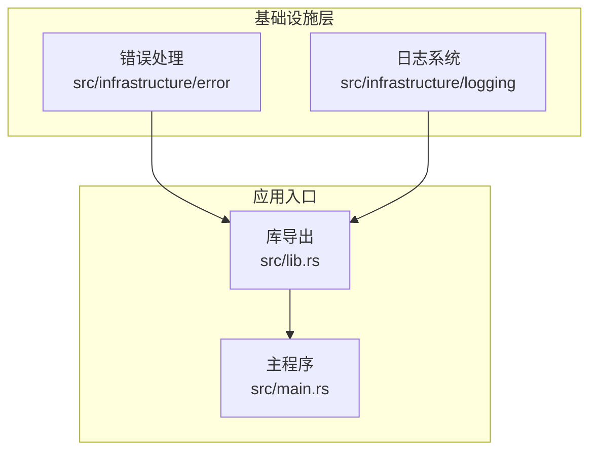
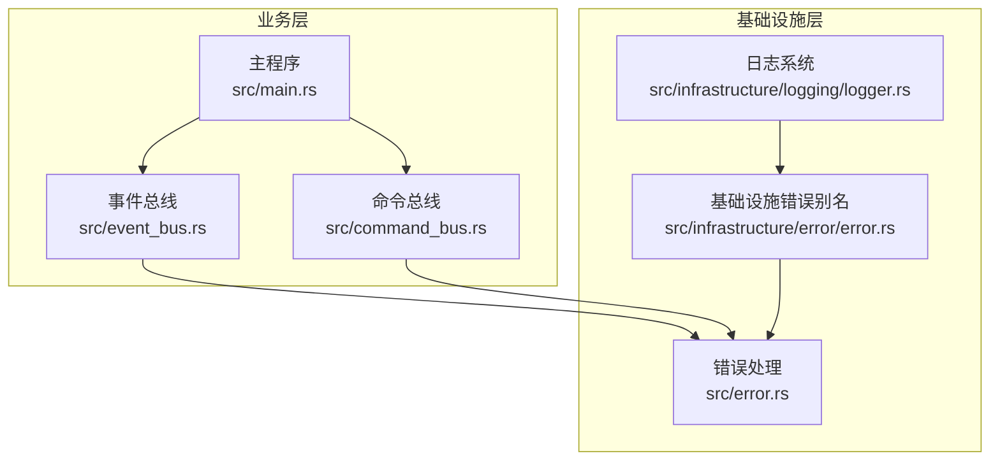
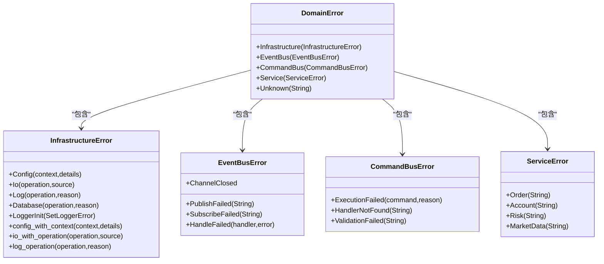
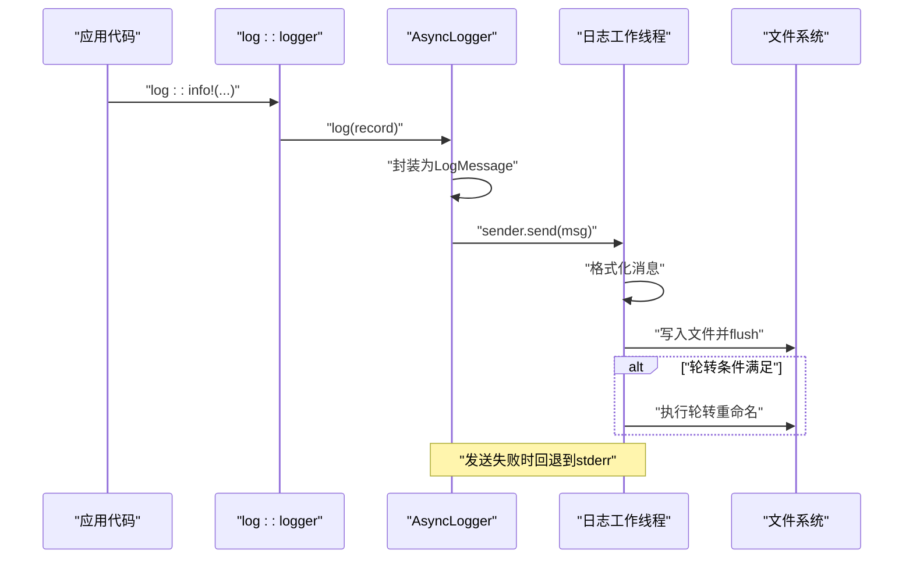
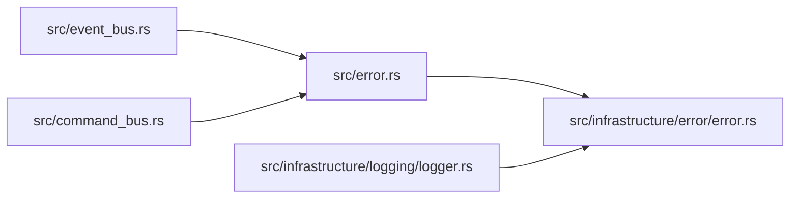

# 基础设施

<cite>
**本文引用的文件**
- [src/infrastructure/mod.rs](file://src/infrastructure/mod.rs)
- [src/infrastructure/error/mod.rs](file://src/infrastructure/error/mod.rs)
- [src/infrastructure/error/error.rs](file://src/infrastructure/error/error.rs)
- [src/infrastructure/logging/mod.rs](file://src/infrastructure/logging/mod.rs)
- [src/infrastructure/logging/logger.rs](file://src/infrastructure/logging/logger.rs)
- [src/error.rs](file://src/error.rs)
- [src/lib.rs](file://src/lib.rs)
- [src/main.rs](file://src/main.rs)
- [Cargo.toml](file://Cargo.toml)
- [src/event_bus.rs](file://src/event_bus.rs)
- [src/command_bus.rs](file://src/command_bus.rs)
</cite>

## 目录
1. [简介](#简介)
2. [项目结构](#项目结构)
3. [核心组件](#核心组件)
4. [架构总览](#架构总览)
5. [详细组件分析](#详细组件分析)
6. [依赖关系分析](#依赖关系分析)
7. [性能考虑](#性能考虑)
8. [故障排除指南](#故障排除指南)
9. [结论](#结论)
10. [附录](#附录)

## 简介
本文件聚焦于Binance Rust事件驱动交易系统的基础设施层，系统性阐述以下主题：
- 错误处理体系：统一错误类型、自动转换、错误传播与恢复、调试信息记录
- 日志系统：异步写入、日志级别、结构化格式、轮转与性能优化
- 配置管理：配置文件加载、环境变量支持、动态更新与验证（基于现有依赖进行设计说明）
- 使用示例、性能调优建议、故障排除与运维最佳实践
- 监控集成与告警机制的落地建议

## 项目结构
基础设施层位于src/infrastructure目录，包含两个子模块：
- 错误处理：src/infrastructure/error
- 日志系统：src/infrastructure/logging

图表来源
- [src/infrastructure/mod.rs:1-2](file://src/infrastructure/mod.rs#L1-L2)
- [src/infrastructure/error/mod.rs:1-1](file://src/infrastructure/error/mod.rs#L1-L1)
- [src/infrastructure/logging/mod.rs:1-7](file://src/infrastructure/logging/mod.rs#L1-L7)
- [src/lib.rs:1-9](file://src/lib.rs#L1-L9)
- [src/main.rs:1-93](file://src/main.rs#L1-L93)

章节来源
- [src/infrastructure/mod.rs:1-2](file://src/infrastructure/mod.rs#L1-L2)
- [src/infrastructure/error/mod.rs:1-1](file://src/infrastructure/error/mod.rs#L1-L1)
- [src/infrastructure/logging/mod.rs:1-7](file://src/infrastructure/logging/mod.rs#L1-L7)
- [src/lib.rs:1-9](file://src/lib.rs#L1-L9)

## 核心组件
- 统一错误类型与分层错误模型：通过DomainError聚合各层错误，基础设施层错误由InfrastructureError承载，便于统一捕获与传播。
- 异步日志记录器：AsyncLogger实现异步写入、可选文件轮转、结构化日志格式（文本/JSON），并兼容log crate接口。
- 配置管理：通过依赖引入的config crate支持多种格式（TOML/JSON/YAML/INI/RON/JSON5），结合环境变量实现灵活配置。

章节来源
- [src/error.rs:12-131](file://src/error.rs#L12-L131)
- [src/infrastructure/logging/logger.rs:11-79](file://src/infrastructure/logging/logger.rs#L11-L79)
- [Cargo.toml:22-22](file://Cargo.toml#L22-L22)

## 架构总览
基础设施层与业务层解耦，通过公共错误与日志接口为上层提供一致的运行时支撑。

图表来源
- [src/event_bus.rs:15-17](file://src/event_bus.rs#L15-L17)
- [src/command_bus.rs:1-19](file://src/command_bus.rs#L1-L19)
- [src/error.rs:12-131](file://src/error.rs#L12-L131)
- [src/infrastructure/error/error.rs:1-6](file://src/infrastructure/error/error.rs#L1-L6)
- [src/infrastructure/logging/logger.rs:140-291](file://src/infrastructure/logging/logger.rs#L140-L291)

## 详细组件分析

### 组件A：错误处理系统
- 设计理念
  - 分层错误：每层拥有独立错误枚举，便于定位问题来源
  - 自动转换：利用From trait实现错误向上游自动转换
  - 统一出口：对外暴露DomainError，屏蔽内部细节
- 关键类型
  - DomainError：聚合层内错误
  - InfrastructureError：基础设施层错误（配置、IO、日志、数据库、日志初始化）
  - EventBusError、CommandBusError、ServiceError：对应领域错误
- 实现要点
  - 提供便捷构造函数（如config_with_context、io_with_operation、log_operation）
  - 通过thiserror实现稳定的错误字符串表示
  - 与上层事件总线、命令总线错误类型保持一致的错误语义

图表来源
- [src/error.rs:12-128](file://src/error.rs#L12-L128)

章节来源
- [src/error.rs:12-131](file://src/error.rs#L12-L131)
- [src/error.rs:36-83](file://src/error.rs#L36-L83)
- [src/error.rs:85-128](file://src/error.rs#L85-L128)

### 组件B：日志系统
- 异步日志写入
  - 使用多生产者单消费者通道将日志消息投递至专用线程
  - 专用线程负责格式化、落盘与轮转，避免阻塞业务线程
- 日志级别与格式
  - 支持log crate的LevelFilter级别
  - 支持文本与JSON两种格式；JSON包含时间戳、级别、模块、文件、行号等字段
- 文件轮转
  - 基于文件大小阈值进行轮转，保留最多N个历史文件
  - 轮转时采用顺序重命名策略，删除最旧文件
- 性能与可靠性
  - 每次写入后立即flush，保证高延迟场景下的可观测性
  - 发送失败时回退到stderr输出，确保不会丢失关键错误信息
- 配置项
  - 级别、格式、文件路径、轮转大小、最大文件数、缓冲区大小

图表来源
- [src/infrastructure/logging/logger.rs:305-338](file://src/infrastructure/logging/logger.rs#L305-L338)
- [src/infrastructure/logging/logger.rs:155-234](file://src/infrastructure/logging/logger.rs#L155-L234)
- [src/infrastructure/logging/logger.rs:81-138](file://src/infrastructure/logging/logger.rs#L81-L138)

章节来源
- [src/infrastructure/logging/logger.rs:11-79](file://src/infrastructure/logging/logger.rs#L11-L79)
- [src/infrastructure/logging/logger.rs:140-291](file://src/infrastructure/logging/logger.rs#L140-L291)
- [src/infrastructure/logging/logger.rs:305-338](file://src/infrastructure/logging/logger.rs#L305-L338)

### 组件C：配置管理系统（设计与实现说明）
- 依赖支持
  - 通过config crate支持多种配置格式（TOML/JSON/YAML/INI/RON/JSON5）
  - 结合环境变量实现灵活的配置覆盖
- 加载流程
  - 读取配置文件或环境变量，解析为结构化配置对象
  - 提供默认值与类型安全的访问接口
- 动态更新与验证
  - 建议在应用启动阶段完成配置加载与校验
  - 对于需要热更新的参数，建议通过配置中心或外部信号触发重新加载
- 与基础设施的关系
  - 日志配置（级别、格式、文件路径、轮转）可由配置驱动
  - 错误处理中的日志初始化错误（LoggerInit）属于基础设施层错误范畴

章节来源
- [Cargo.toml:22-22](file://Cargo.toml#L22-L22)
- [src/error.rs:55-56](file://src/error.rs#L55-L56)

## 依赖关系分析
- 错误处理
  - 上层事件总线与命令总线直接复用错误类型，减少适配成本
  - 基础设施错误通过公共模块导出，供日志系统等底层组件使用
- 日志系统
  - 依赖log crate接口，通过AsyncLogger实现具体写入逻辑
  - 与基础设施错误类型协作，将IO/轮转异常映射为InfrastructureError

图表来源
- [src/error.rs:12-131](file://src/error.rs#L12-L131)
- [src/infrastructure/error/error.rs:1-6](file://src/infrastructure/error/error.rs#L1-L6)
- [src/infrastructure/logging/logger.rs:140-291](file://src/infrastructure/logging/logger.rs#L140-L291)
- [src/event_bus.rs:15-17](file://src/event_bus.rs#L15-L17)
- [src/command_bus.rs:1-19](file://src/command_bus.rs#L1-L19)

章节来源
- [src/error.rs:12-131](file://src/error.rs#L12-L131)
- [src/infrastructure/error/error.rs:1-6](file://src/infrastructure/error/error.rs#L1-L6)
- [src/infrastructure/logging/logger.rs:140-291](file://src/infrastructure/logging/logger.rs#L140-L291)
- [src/event_bus.rs:15-17](file://src/event_bus.rs#L15-L17)
- [src/command_bus.rs:1-19](file://src/command_bus.rs#L1-L19)

## 性能考虑
- 日志性能
  - 异步写入降低业务线程阻塞风险；合理设置缓冲区大小与轮转阈值
  - JSON格式便于结构化采集，但序列化开销略高于文本格式；根据采集链路选择
  - flush频率与磁盘I/O能力匹配，避免过度flush导致抖动
- 错误传播
  - 使用From自动转换减少重复包装；仅在必要时添加上下文信息
  - 对高频错误（如网络抖动）采用降采样或聚合，避免日志风暴
- 配置加载
  - 在启动阶段一次性加载并校验配置，避免运行期频繁IO
  - 对大体量配置采用增量更新策略，确保一致性

## 故障排除指南
- 日志相关
  - 初始化失败：检查日志级别与文件路径权限；确认轮转阈值与磁盘空间
  - 写入失败：关注回退到stderr的提示，排查磁盘满、权限不足或路径不可写
  - 轮转异常：核对最大文件数与重命名顺序，确保旧文件清理成功
- 错误相关
  - 基础设施错误：优先处理配置、IO与日志初始化类错误
  - 事件总线/命令总线错误：关注发布失败、订阅失败与处理器未找到等问题
- 运维建议
  - 为关键路径增加结构化日志字段（模块、文件、行号），提升检索效率
  - 对错误进行分级与聚合，建立告警阈值与收敛窗口

章节来源
- [src/infrastructure/logging/logger.rs:155-234](file://src/infrastructure/logging/logger.rs#L155-L234)
- [src/infrastructure/logging/logger.rs:305-338](file://src/infrastructure/logging/logger.rs#L305-L338)
- [src/error.rs:36-83](file://src/error.rs#L36-L83)
- [src/event_bus.rs:87-110](file://src/event_bus.rs#L87-L110)
- [src/command_bus.rs:14-19](file://src/command_bus.rs#L14-L19)

## 结论
基础设施层通过统一错误类型与异步日志系统，为事件驱动交易系统提供了稳定可靠的运行时支撑。配合配置管理能力，可在不同环境中快速部署与调优。建议在生产环境中启用结构化日志与合理的轮转策略，并结合监控与告警机制，持续优化系统稳定性与可观测性。

## 附录

### 使用示例（步骤说明）
- 初始化日志
  - 构造LoggerConfig并调用AsyncLogger::init完成初始化
  - 使用log crate宏输出日志，确保级别符合配置
- 错误处理
  - 在业务逻辑中返回InfrastructureError或上抛DomainError
  - 对高频错误进行降采样或聚合，避免日志风暴
- 配置加载
  - 使用config crate加载配置文件或环境变量
  - 在启动阶段完成校验，确保日志与网络参数有效

章节来源
- [src/infrastructure/logging/logger.rs:283-290](file://src/infrastructure/logging/logger.rs#L283-L290)
- [src/error.rs:12-131](file://src/error.rs#L12-L131)
- [Cargo.toml:22-22](file://Cargo.toml#L22-L22)