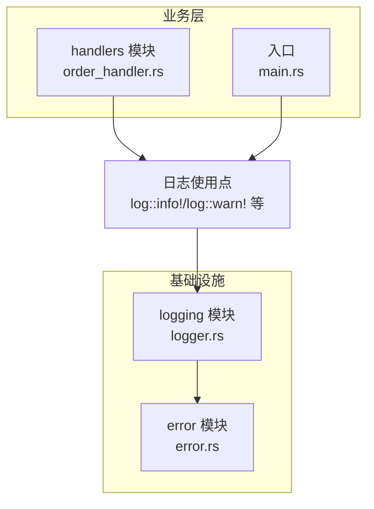
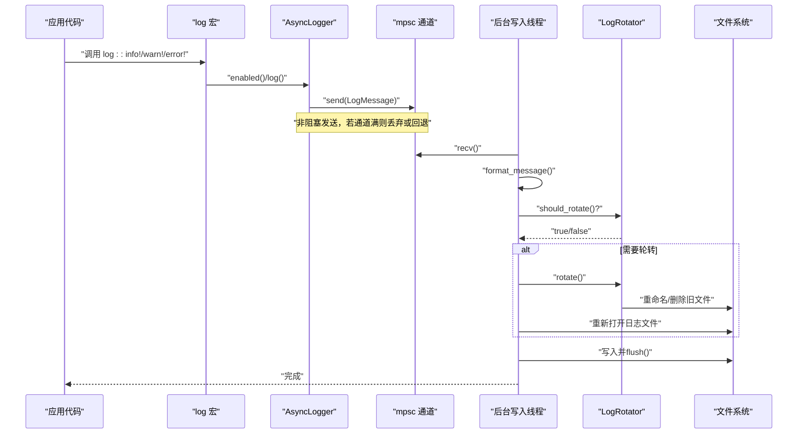
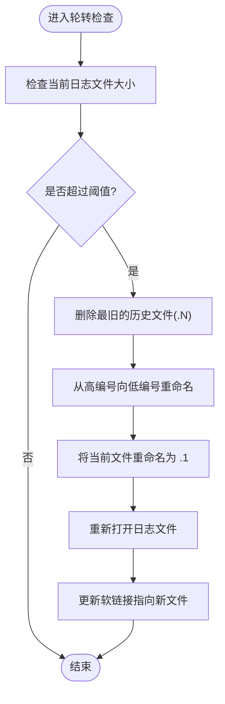
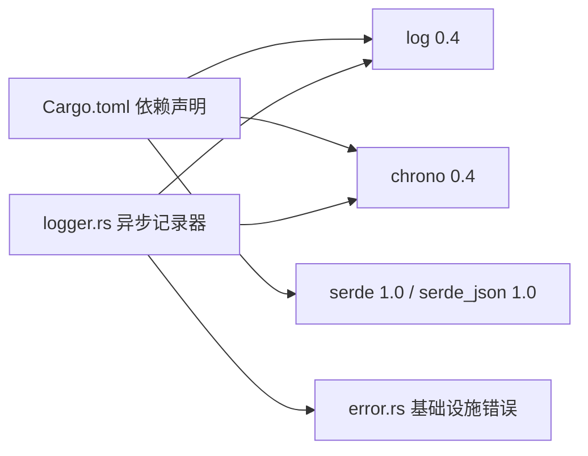

# 日志系统

<cite>
**本文引用的文件**
- [logger.rs](file://src/infrastructure/logging/logger.rs)
- [mod.rs](file://src/infrastructure/logging/mod.rs)
- [order_handler.rs](file://src/handlers/order_handler.rs)
- [main.rs](file://src/main.rs)
- [default.toml](file://config/default.toml)
- [error.rs](file://src/error.rs)
- [Cargo.toml](file://Cargo.toml)
</cite>

## 目录
1. [简介](#简介)
2. [项目结构](#项目结构)
3. [核心组件](#核心组件)
4. [架构总览](#架构总览)
5. [详细组件分析](#详细组件分析)
6. [依赖关系分析](#依赖关系分析)
7. [性能考量](#性能考量)
8. [故障排查指南](#故障排查指南)
9. [结论](#结论)
10. [附录](#附录)

## 简介
本文件面向Binance Rust事件驱动交易系统，系统性阐述日志子系统的实现与使用。重点覆盖以下方面：
- 异步日志记录器的架构与实现，包括异步写入队列、缓冲区管理与背压处理机制
- 日志级别设计与使用场景（DEBUG/INFO/WARN/ERROR）
- 结构化日志格式（JSON/文本），字段标准化、时间戳格式与上下文信息嵌入
- 性能优化策略（批量写入、内存池、I/O调度）
- 日志配置示例、调试技巧与性能监控方法

## 项目结构
日志系统位于基础设施层，采用模块化组织，便于在应用各处统一使用。



**图表来源**
- [logger.rs:1-453](file://src/infrastructure/logging/logger.rs#L1-L453)
- [order_handler.rs:1-138](file://src/handlers/order_handler.rs#L1-L138)
- [error.rs:1-169](file://src/error.rs#L1-L169)
- [main.rs:1-172](file://src/main.rs#L1-L172)

**章节来源**
- [mod.rs:1-7](file://src/infrastructure/logging/mod.rs#L1-L7)

## 核心组件
- 日志配置对象：负责定义日志级别、格式、输出目标、轮转策略与缓冲区大小等参数
- 异步日志记录器：基于标准库多生产者单消费者通道与后台线程，实现非阻塞日志写入
- 日志轮转器：按大小进行滚动备份，支持最大文件数量限制
- 结构化格式化器：支持文本与JSON两种格式，统一时间戳与上下文字段

**章节来源**
- [logger.rs:17-79](file://src/infrastructure/logging/logger.rs#L17-L79)
- [logger.rs:161-174](file://src/infrastructure/logging/logger.rs#L161-L174)
- [logger.rs:283-319](file://src/infrastructure/logging/logger.rs#L283-L319)

## 架构总览
日志系统采用"同步API + 异步写入"的模式：
- 应用代码通过标准日志宏（如log::info!）发起日志请求
- 异步记录器将日志封装为消息并通过通道发送给后台线程
- 后台线程负责格式化、轮转检查、文件写入与刷新



**图表来源**
- [logger.rs:343-376](file://src/infrastructure/logging/logger.rs#L343-L376)
- [logger.rs:176-261](file://src/infrastructure/logging/logger.rs#L176-L261)
- [logger.rs:283-319](file://src/infrastructure/logging/logger.rs#L283-L319)

## 详细组件分析

### 日志配置与格式
- 配置项
  - 日志级别：由外部log库的LevelFilter控制，用于过滤低于阈值的日志
  - 输出格式：支持文本与JSON两种
  - 文件路径：可选；未设置时输出到标准错误
  - 轮转大小：按字节阈值触发滚动
  - 最大文件数：保留历史文件数量
  - 缓冲区大小：当前实现中作为默认值存在，但未在写入路径中显式使用
- 格式化
  - **精简文本格式**：包含简化的时间戳、级别、消息正文，格式为`[MM-DD HH:MM:SS] LEVEL - 消息`
  - **JSON格式**：包含时间戳、级别、消息正文以及可选的模块、文件、行号，便于结构化采集与检索

**更新** 新增了精简的文本日志格式，时间戳格式从完整的`%Y-%m-%d %H:%M:%S%.3f`简化为`%m-%d %H:%M:%S`，去除了毫秒精度

**章节来源**
- [logger.rs:17-79](file://src/infrastructure/logging/logger.rs#L17-L79)
- [logger.rs:283-319](file://src/infrastructure/logging/logger.rs#L283-L319)

### 异步日志记录器
- 实现要点
  - 使用标准库多生产者单消费者通道，发送端在Drop时自动关闭，保证后台线程能正常退出
  - 后台线程循环接收消息，格式化后写入文件或标准输出
  - 每次写入后立即flush，确保日志及时落盘
  - 当发送失败时，回退到标准错误输出，避免丢失关键日志
  - **控制台输出优化**：只有WARN和ERROR级别输出到控制台，INFO和DEBUG级别仅写入文件
- 背压与丢弃
  - 通道为同步阻塞通道，发送端在通道满时会阻塞，形成天然背压
  - 若需无阻塞行为，可考虑切换为非阻塞通道或增加缓冲队列长度，但当前实现未采用非阻塞发送

```mermaid
classDiagram
class LoggerConfig {
+level : LevelFilter
+format : LogFormat
+file_path : Option<String>
+rotate_size : Option<u64>
+max_files : usize
+buffer_size : Option<usize>
+new(...)
+default()
+with_buffer_size(...)
+level()
+format()
+file_path()
+rotate_size()
+max_files()
+buffer_size()
}
class LogRotator {
+base_path : String
+max_size : u64
+max_files : usize
+new(...)
+should_rotate() bool
+rotate() Result
}
class AsyncLogger {
-config : LoggerConfig
-sender : Option<mpsc : : Sender<LogMessage>>
-handle : Option<thread : : JoinHandle<()>>
+new(config)
+init(config) Result
-format_message(config, msg) String
+enabled(meta) bool
+log(record)
+flush()
~drop()
}
class LogMessage {
+level : Level
+args : String
+module_path : Option<String>
+file : Option<String>
+line : Option<u32>
}
AsyncLogger --> LoggerConfig : "持有"
AsyncLogger --> LogRotator : "可选使用"
AsyncLogger --> LogMessage : "发送"
```

**图表来源**
- [logger.rs:17-79](file://src/infrastructure/logging/logger.rs#L17-L79)
- [logger.rs:161-174](file://src/infrastructure/logging/logger.rs#L161-L174)
- [logger.rs:283-319](file://src/infrastructure/logging/logger.rs#L283-L319)

**章节来源**
- [logger.rs:161-174](file://src/infrastructure/logging/logger.rs#L161-L174)
- [logger.rs:176-261](file://src/infrastructure/logging/logger.rs#L176-L261)
- [logger.rs:343-376](file://src/infrastructure/logging/logger.rs#L343-L376)

### 日志轮转机制
- 触发条件：当前日志文件大小超过设定阈值
- 轮转策略：将现有日志文件重命名为 .1，依次向后移动，删除超出最大文件数的最旧文件
- 重新打开：轮转完成后重新打开主日志文件，继续写入
- **软链接管理**：自动创建软链接指向当前会话日志文件，便于持续跟踪



**图表来源**
- [logger.rs:92-124](file://src/infrastructure/logging/logger.rs#L92-L124)
- [logger.rs:263-281](file://src/infrastructure/logging/logger.rs#L263-L281)

**章节来源**
- [logger.rs:92-124](file://src/infrastructure/logging/logger.rs#L92-L124)
- [logger.rs:263-281](file://src/infrastructure/logging/logger.rs#L263-L281)

### 日志级别设计与使用场景
- **DEBUG**：开发调试阶段的详细信息，如订单提交、成交、取消等常规操作事件
- **INFO**：关键业务流程信息，如系统启动、配置加载、API连接状态等重要事件
- **WARN**：潜在问题或异常情况，如订单被拒、网络连接异常等
- **ERROR**：严重错误，如IO失败、初始化失败等

**更新** 订单处理事件（提交、成交、取消、拒绝）现在使用DEBUG级别，将常规操作事件从INFO降级到DEBUG，同时保持关键事件的INFO级别

**章节来源**
- [order_handler.rs:27-66](file://src/handlers/order_handler.rs#L27-L66)

### 结构化日志格式设计
- 字段标准化
  - **时间戳**：精简格式使用本地时间，格式为`%m-%d %H:%M:%S`（月-日 时:分:秒）
  - 级别：字符串形式，便于检索
  - 消息正文：原始日志内容
  - 上下文：模块路径、文件名、行号（可选）
- JSON格式优势
  - 易于结构化采集与查询
  - 与日志平台集成友好
- 文本格式优势
  - **精简输出**：去除冗余字段，提高可读性和解析效率
  - 人类可读性强，便于快速定位问题

**更新** 文本格式从完整的JSON结构改为精简的`[MM-DD HH:MM:SS] LEVEL - 消息`格式，显著减少了日志体积和解析开销

**章节来源**
- [logger.rs:283-319](file://src/infrastructure/logging/logger.rs#L283-L319)

### 日志初始化与全局注册
- 初始化流程
  - 创建异步记录器实例
  - 注册为全局日志记录器
  - 设置最大日志级别
- 错误处理
  - 初始化失败映射为基础设施层错误，便于上层统一处理

**章节来源**
- [logger.rs:321-328](file://src/infrastructure/logging/logger.rs#L321-L328)
- [error.rs:55-56](file://src/error.rs#L55-L56)

## 依赖关系分析
- 外部依赖
  - log：标准日志抽象接口
  - chrono：时间戳格式化
  - serde/serde_json：JSON序列化（在格式化中直接拼接字符串，未使用serde_json）
- 内部依赖
  - 错误模块：基础设施层错误类型用于包装IO与初始化错误
  - 业务模块：通过log宏在各业务模块中使用日志



**图表来源**
- [Cargo.toml:6-25](file://Cargo.toml#L6-L25)
- [logger.rs:1-9](file://src/infrastructure/logging/logger.rs#L1-L9)
- [error.rs:37-57](file://src/error.rs#L37-L57)

**章节来源**
- [Cargo.toml:6-25](file://Cargo.toml#L6-L25)
- [logger.rs:1-9](file://src/infrastructure/logging/logger.rs#L1-L9)
- [error.rs:37-57](file://src/error.rs#L37-L57)

## 性能考量
- 写入路径
  - 每条日志写入后立即flush，确保实时性，但可能影响吞吐量
  - 可考虑引入批量写入与延迟flush策略，在牺牲少量实时性的情况下提升吞吐
- 缓冲区管理
  - 当前实现未在写入路径中使用配置的缓冲区大小
  - 可通过标准库BufWriter或自定义环形缓冲区提升写入效率
- I/O调度
  - 后台线程承担所有I/O，避免主线程阻塞
  - 若日志量巨大，可考虑多线程写入或异步文件I/O（如tokio fs）
- 背压处理
  - 当前通道为阻塞通道，满载时发送端阻塞，形成天然背压
  - 可根据业务需求调整通道容量或采用非阻塞发送+丢弃策略
- **控制台输出优化**
  - 只有WARN和ERROR级别输出到控制台，减少控制台输出压力

**更新** 新增了控制台输出优化策略，通过级别过滤减少不必要的控制台输出

**章节来源**
- [logger.rs:238-249](file://src/infrastructure/logging/logger.rs#L238-L249)
- [logger.rs:343-376](file://src/infrastructure/logging/logger.rs#L343-L376)

## 故障排查指南
- 初始化失败
  - 症状：无法设置全局日志记录器
  - 排查：检查日志配置、权限与路径
  - 参考：基础设施层错误类型中的日志初始化错误
- 文件写入失败
  - 症状：日志无法写入或刷新失败
  - 排查：确认文件路径、磁盘空间、权限
  - 回退：发送失败时会回退到标准错误输出
- 轮转失败
  - 症状：轮转过程中出现错误
  - 排查：检查文件重命名权限、磁盘空间
- 级别过滤
  - 症状：某些日志未显示
  - 排查：确认日志级别阈值与记录器级别
- **格式问题**
  - 症状：日志格式不符合预期
  - 排查：检查配置中的format选项，确认使用的是精简文本格式还是JSON格式

**更新** 新增了格式问题的排查指南

**章节来源**
- [logger.rs:175-201](file://src/infrastructure/logging/logger.rs#L175-L201)
- [logger.rs:360-368](file://src/infrastructure/logging/logger.rs#L360-L368)
- [logger.rs:189-192](file://src/infrastructure/logging/logger.rs#L189-L192)
- [error.rs:55-56](file://src/error.rs#L55-L56)

## 结论
该日志系统以最小依赖实现了可靠的异步日志记录能力，具备：
- 清晰的配置与格式化接口
- 基于通道的异步写入与天然背压
- 文件轮转与回退机制
- 与业务模块解耦的良好设计
- **优化的输出策略**：精简格式、级别过滤和控制台输出优化

**更新** 新增了日志格式优化、级别调整和控制台输出优化等改进

建议在生产环境中结合业务负载评估是否引入批量写入、缓冲区优化与多线程I/O，以进一步提升吞吐与稳定性。

## 附录

### 日志配置示例
- 基本配置
  - 级别：INFO
  - 格式：text（精简格式）
  - 文件路径：可选
  - 轮转大小：默认50MB
  - 最大文件数：10
  - 缓冲区大小：默认1024字节
- 自定义配置
  - 可通过链式方法设置缓冲区大小
  - 可选择JSON格式以适配结构化日志平台

**更新** 配置示例中格式默认为text（精简格式）

**章节来源**
- [logger.rs:27-79](file://src/infrastructure/logging/logger.rs#L27-L79)
- [default.toml:6-16](file://config/default.toml#L6-L16)

### 调试技巧
- 使用DEBUG记录常规操作事件，如订单提交、成交、取消
- 使用INFO记录关键流程事件，如系统启动、配置加载、API连接状态
- 使用WARN记录异常事件，如订单被拒、网络连接异常
- 使用ERROR记录严重错误
- 在生产环境适当提高级别，减少DEBUG/INFO噪声

**更新** 调整了调试技巧中对INFO和DEBUG级别的使用建议

**章节来源**
- [order_handler.rs:27-66](file://src/handlers/order_handler.rs#L27-L66)

### 性能监控方法
- 监控指标
  - 日志写入延迟（从log宏到文件flush完成）
  - 通道积压长度（发送端阻塞频率）
  - 文件大小与轮转次数
  - 控制台输出量（通过级别过滤效果）
- 工具建议
  - 使用系统工具（如iostat、iotop）观察磁盘I/O
  - 使用日志平台的聚合查询定位热点模块
  - 监控日志文件大小增长速度，调整轮转阈值

**更新** 新增了控制台输出量的监控建议

[本节为通用指导，无需特定文件引用]