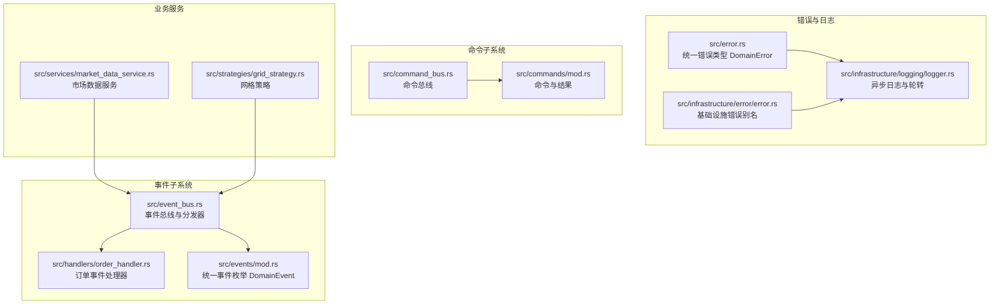
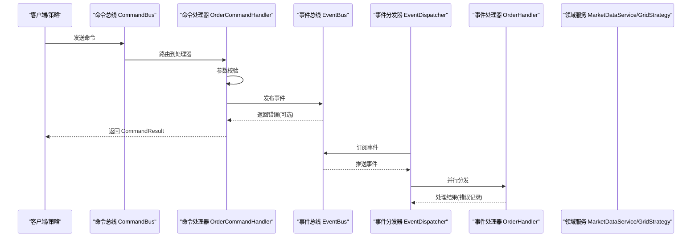
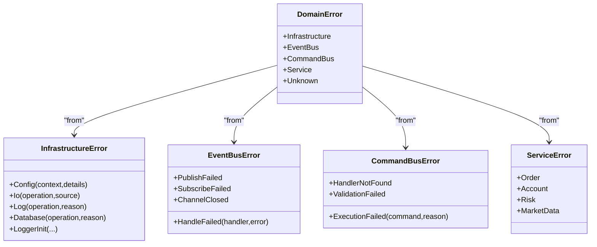
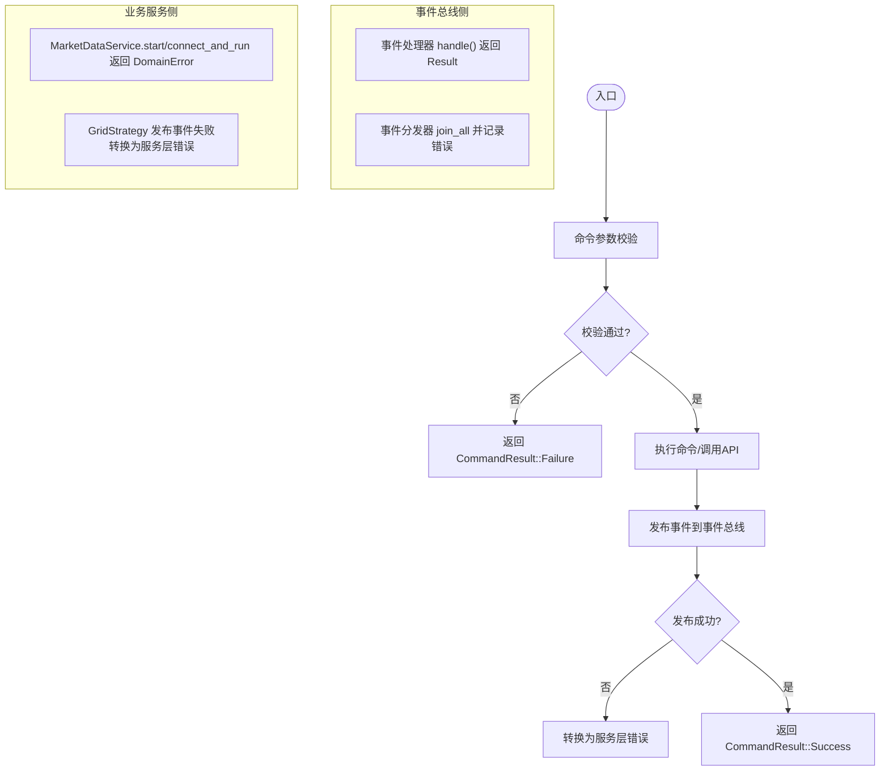
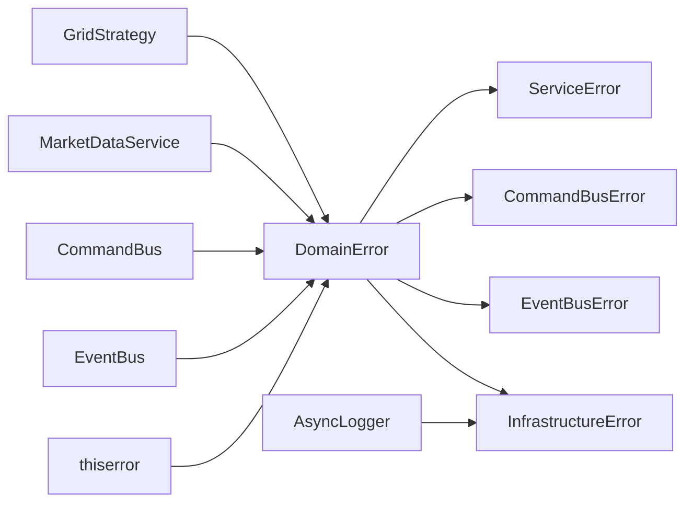

# 错误处理系统

<cite>
**本文引用的文件**
- [src/error.rs](file://src/error.rs)
- [src/infrastructure/error/error.rs](file://src/infrastructure/error/error.rs)
- [src/event_bus.rs](file://src/event_bus.rs)
- [src/command_bus.rs](file://src/command_bus.rs)
- [src/handlers/order_handler.rs](file://src/handlers/order_handler.rs)
- [src/services/market_data_service.rs](file://src/services/market_data_service.rs)
- [src/infrastructure/logging/logger.rs](file://src/infrastructure/logging/logger.rs)
- [src/events/mod.rs](file://src/events/mod.rs)
- [src/commands/mod.rs](file://src/commands/mod.rs)
- [src/strategies/grid_strategy.rs](file://src/strategies/grid_strategy.rs)
- [Cargo.toml](file://Cargo.toml)
</cite>

## 目录
1. [简介](#简介)
2. [项目结构](#项目结构)
3. [核心组件](#核心组件)
4. [架构总览](#架构总览)
5. [详细组件分析](#详细组件分析)
6. [依赖分析](#依赖分析)
7. [性能考虑](#性能考虑)
8. [故障排查指南](#故障排查指南)
9. [结论](#结论)
10. [附录](#附录)

## 简介
本文件系统化阐述 Binance Rust 事件驱动交易系统的统一错误处理机制。内容涵盖错误类型分层设计（基础设施、事件总线、命令总线、领域服务与未知错误）、错误传播路径（事件总线、命令总线、业务服务）、错误恢复策略（自动重试、降级与优雅降级）、最佳实践（分类、日志与调试信息收集），并结合具体代码路径给出流程图与排障建议。

## 项目结构
围绕错误处理的关键模块与文件如下：
- 统一错误类型与分层错误类型定义：src/error.rs
- 基础设施错误模块别名：src/infrastructure/error/error.rs
- 事件总线与事件处理器：src/event_bus.rs、src/handlers/order_handler.rs
- 命令总线与命令结果：src/command_bus.rs、src/commands/mod.rs
- 领域服务与错误恢复：src/services/market_data_service.rs、src/strategies/grid_strategy.rs
- 日志系统与基础设施错误集成：src/infrastructure/logging/logger.rs
- 事件模型与统一事件枚举：src/events/mod.rs
- 依赖声明：Cargo.toml

图表来源
- [src/error.rs:12-34](file://src/error.rs#L12-L34)
- [src/infrastructure/error/error.rs:1-6](file://src/infrastructure/error/error.rs#L1-L6)
- [src/infrastructure/logging/logger.rs:140-291](file://src/infrastructure/logging/logger.rs#L140-L291)
- [src/event_bus.rs:18-110](file://src/event_bus.rs#L18-L110)
- [src/handlers/order_handler.rs:16-91](file://src/handlers/order_handler.rs#L16-L91)
- [src/events/mod.rs:48-89](file://src/events/mod.rs#L48-L89)
- [src/command_bus.rs:5-19](file://src/command_bus.rs#L5-L19)
- [src/commands/mod.rs:6-77](file://src/commands/mod.rs#L6-L77)
- [src/services/market_data_service.rs:34-114](file://src/services/market_data_service.rs#L34-L114)
- [src/strategies/grid_strategy.rs:156-278](file://src/strategies/grid_strategy.rs#L156-L278)

章节来源
- [src/error.rs:12-34](file://src/error.rs#L12-L34)
- [src/infrastructure/error/error.rs:1-6](file://src/infrastructure/error/error.rs#L1-L6)
- [src/infrastructure/logging/logger.rs:140-291](file://src/infrastructure/logging/logger.rs#L140-L291)
- [src/event_bus.rs:18-110](file://src/event_bus.rs#L18-L110)
- [src/handlers/order_handler.rs:16-91](file://src/handlers/order_handler.rs#L16-L91)
- [src/events/mod.rs:48-89](file://src/events/mod.rs#L48-L89)
- [src/command_bus.rs:5-19](file://src/command_bus.rs#L5-L19)
- [src/commands/mod.rs:6-77](file://src/commands/mod.rs#L6-L77)
- [src/services/market_data_service.rs:34-114](file://src/services/market_data_service.rs#L34-L114)
- [src/strategies/grid_strategy.rs:156-278](file://src/strategies/grid_strategy.rs#L156-L278)

## 核心组件
- 统一错误类型 DomainError：聚合基础设施、事件总线、命令总线、服务层与未知错误，提供 From 转换以实现自动向上冒泡。
- 分层错误类型：
  - 基础设施层：InfrastructureError（配置、IO、日志、数据库、日志初始化）
  - 事件总线层：EventBusError（发布失败、订阅失败、处理失败、通道关闭）
  - 命令总线层：CommandBusError（执行失败、处理器未找到、验证失败）
  - 领域服务层：ServiceError（订单、账户、风控、市场数据）
- 统一结果类型 Result<T> = Result<T, DomainError>，便于跨层返回与处理。
- 日志系统：AsyncLogger 提供异步写入、轮转与回退机制，与基础设施错误类型集成，保证日志可用性。

章节来源
- [src/error.rs:12-34](file://src/error.rs#L12-L34)
- [src/error.rs:36-83](file://src/error.rs#L36-L83)
- [src/error.rs:85-112](file://src/error.rs#L85-L112)
- [src/error.rs:114-128](file://src/error.rs#L114-L128)
- [src/error.rs:130-131](file://src/error.rs#L130-L131)
- [src/infrastructure/error/error.rs:1-6](file://src/infrastructure/error/error.rs#L1-L6)
- [src/infrastructure/logging/logger.rs:140-291](file://src/infrastructure/logging/logger.rs#L140-L291)

## 架构总览
统一错误处理在系统中的传播路径如下：
- 事件总线：发布/订阅/分发过程中捕获错误并记录；处理器内部错误通过 Result 返回。
- 命令总线：命令执行前进行参数校验，执行失败时封装为 CommandResult；发布事件失败时映射为服务层错误。
- 领域服务：市场数据服务与网格策略在连接、解析、发布事件时产生错误，统一包装为 DomainError 并向上传播。
- 日志系统：异步日志器负责错误与调试信息的持久化与轮转，确保可观测性。

图表来源
- [src/command_bus.rs:14-18](file://src/command_bus.rs#L14-L18)
- [src/handlers/order_handler.rs:103-135](file://src/handlers/order_handler.rs#L103-L135)
- [src/event_bus.rs:88-110](file://src/event_bus.rs#L88-L110)
- [src/event_bus.rs:129-157](file://src/event_bus.rs#L129-L157)
- [src/handlers/order_handler.rs:69-91](file://src/handlers/order_handler.rs#L69-L91)

## 详细组件分析

### 错误类型层次结构与继承关系
- DomainError 作为统一出口，包含以下分支：
  - Infrastructure(InfrastructureError)
  - EventBus(EventBusError)
  - CommandBus(CommandBusError)
  - Service(ServiceError)
  - Unknown(String)
- 各层错误类型独立定义，通过 thiserror 的 #[from] 实现自动转换，形成清晰的分层与向上冒泡能力。
- 基础设施错误 InfrastructureError 提供便捷构造方法，便于在各层快速构建上下文化的错误。

图表来源
- [src/error.rs:12-34](file://src/error.rs#L12-L34)
- [src/error.rs:36-83](file://src/error.rs#L36-L83)
- [src/error.rs:85-112](file://src/error.rs#L85-L112)
- [src/error.rs:114-128](file://src/error.rs#L114-L128)

章节来源
- [src/error.rs:12-34](file://src/error.rs#L12-L34)
- [src/error.rs:36-83](file://src/error.rs#L36-L83)
- [src/error.rs:85-112](file://src/error.rs#L85-L112)
- [src/error.rs:114-128](file://src/error.rs#L114-L128)

### 错误传播机制（事件总线、命令总线、业务服务）
- 事件总线：
  - 发布失败映射为 EventBusError::PublishFailed，调用方通过 Result 捕获。
  - 分发器并行调用多个处理器，逐个记录错误但不中断整体流程。
- 命令总线：
  - 参数校验失败直接返回 CommandResult::Failure；命令执行失败映射为服务层错误。
  - 发布事件失败时，将错误转换为服务层错误并返回。
- 业务服务：
  - 市场数据服务在连接、TLS、代理、握手、消息解析、事件发布等环节均返回 DomainError。
  - 网格策略在发布事件失败时同样转换为服务层错误。

图表来源
- [src/handlers/order_handler.rs:103-135](file://src/handlers/order_handler.rs#L103-L135)
- [src/event_bus.rs:88-110](file://src/event_bus.rs#L88-L110)
- [src/event_bus.rs:142-157](file://src/event_bus.rs#L142-L157)
- [src/services/market_data_service.rs:96-114](file://src/services/market_data_service.rs#L96-L114)
- [src/strategies/grid_strategy.rs:234-249](file://src/strategies/grid_strategy.rs#L234-L249)

章节来源
- [src/handlers/order_handler.rs:103-135](file://src/handlers/order_handler.rs#L103-L135)
- [src/event_bus.rs:88-110](file://src/event_bus.rs#L88-L110)
- [src/event_bus.rs:142-157](file://src/event_bus.rs#L142-L157)
- [src/services/market_data_service.rs:96-114](file://src/services/market_data_service.rs#L96-L114)
- [src/strategies/grid_strategy.rs:234-249](file://src/strategies/grid_strategy.rs#L234-L249)

### 错误恢复策略
- 自动重试与优雅降级：
  - 市场数据服务在 start 循环中捕获错误后等待固定间隔再重连，属于“自动重试”。
  - 事件分发器在并行处理中记录错误而不中断，体现“优雅降级”（不影响其他处理器）。
  - 命令处理器在参数校验失败时直接返回失败结果，避免无效执行。
- 降级处理：
  - 事件发布失败时转换为服务层错误并返回，避免阻塞命令流程。
  - 网格策略在发布事件失败时记录错误并继续运行，保障主流程稳定。

章节来源
- [src/services/market_data_service.rs:96-114](file://src/services/market_data_service.rs#L96-L114)
- [src/event_bus.rs:142-157](file://src/event_bus.rs#L142-L157)
- [src/handlers/order_handler.rs:103-135](file://src/handlers/order_handler.rs#L103-L135)
- [src/strategies/grid_strategy.rs:234-249](file://src/strategies/grid_strategy.rs#L234-L249)

### 错误处理最佳实践
- 错误分类：
  - 基础设施错误：配置、IO、日志、数据库；通过专用错误类型与便捷构造方法快速定位。
  - 事件总线错误：发布/订阅/处理失败；在事件分发器中统一记录。
  - 命令总线错误：执行失败、处理器未找到、验证失败；在命令处理器中尽早拦截。
  - 服务错误：订单、账户、风控、市场数据；在服务层统一包装为 DomainError。
- 日志记录：
  - 使用 AsyncLogger 异步写入与轮转，确保高吞吐下的可观测性。
  - 在错误发生点记录上下文（模块、文件、行号、错误详情），便于排障。
- 调试信息收集：
  - 事件与命令在关键节点打印调试信息（如价格、订单参数、处理结果）。
  - 对网络连接、代理、TLS 握手等过程输出详细日志，辅助定位问题。

章节来源
- [src/infrastructure/logging/logger.rs:140-291](file://src/infrastructure/logging/logger.rs#L140-L291)
- [src/services/market_data_service.rs:304-374](file://src/services/market_data_service.rs#L304-L374)
- [src/handlers/order_handler.rs:27-65](file://src/handlers/order_handler.rs#L27-L65)

## 依赖分析
- 错误处理依赖关系：
  - 统一错误类型 DomainError 依赖各层错误类型并通过 thiserror 自动转换。
  - 事件总线与命令总线依赖统一错误类型进行错误传播。
  - 业务服务在连接、解析、发布事件时返回 DomainError。
  - 日志系统与基础设施错误类型集成，保证日志可用性。
- 外部依赖：
  - thiserror：错误派生与自动转换。
  - log、tokio、tokio-tungstenite、futures-util、url、tokio-rustls、rustls、webpki-roots 等用于网络与日志功能。

图表来源
- [src/error.rs:10-11](file://src/error.rs#L10-L11)
- [src/error.rs:12-34](file://src/error.rs#L12-L34)
- [src/event_bus.rs:15-16](file://src/event_bus.rs#L15-L16)
- [src/command_bus.rs:1-4](file://src/command_bus.rs#L1-L4)
- [src/services/market_data_service.rs:6-7](file://src/services/market_data_service.rs#L6-L7)
- [src/strategies/grid_strategy.rs:6-7](file://src/strategies/grid_strategy.rs#L6-L7)
- [src/infrastructure/logging/logger.rs:8-9](file://src/infrastructure/logging/logger.rs#L8-L9)

章节来源
- [src/error.rs:10-11](file://src/error.rs#L10-L11)
- [src/error.rs:12-34](file://src/error.rs#L12-L34)
- [src/event_bus.rs:15-16](file://src/event_bus.rs#L15-L16)
- [src/command_bus.rs:1-4](file://src/command_bus.rs#L1-L4)
- [src/services/market_data_service.rs:6-7](file://src/services/market_data_service.rs#L6-L7)
- [src/strategies/grid_strategy.rs:6-7](file://src/strategies/grid_strategy.rs#L6-L7)
- [src/infrastructure/logging/logger.rs:8-9](file://src/infrastructure/logging/logger.rs#L8-L9)
- [Cargo.toml:10-24](file://Cargo.toml#L10-L24)

## 性能考虑
- 异步日志：AsyncLogger 采用异步写入与轮转，避免阻塞主线程，适合高并发场景。
- 事件分发：并行处理多个事件处理器，join_all 等待全部完成，同时记录错误，提升吞吐。
- 重连策略：市场数据服务按固定间隔重连，避免频繁重试导致资源浪费。
- 结果类型：统一 Result<T, DomainError> 减少错误分支判断成本，提高编译期安全性。

## 故障排查指南
- 常见错误场景与定位要点：
  - 事件发布失败：检查事件总线容量与通道状态，查看 EventBusError::PublishFailed。
  - 订阅/处理失败：关注事件处理器 handle 的返回值与 EventDispatcher 的错误记录。
  - 命令验证失败：检查命令参数校验逻辑，返回 CommandResult::Failure。
  - 服务层错误：市场数据服务在连接、TLS、代理、握手、消息解析、事件发布等环节可能失败，统一包装为 ServiceError。
  - 基础设施错误：配置、IO、日志、数据库错误，使用便捷构造方法快速定位上下文。
- 日志与调试：
  - 启用 AsyncLogger 并配置轮转大小与文件数，确保错误日志可追溯。
  - 在关键路径打印调试信息（如价格、订单参数、处理结果），便于复现问题。

章节来源
- [src/event_bus.rs:88-110](file://src/event_bus.rs#L88-L110)
- [src/event_bus.rs:142-157](file://src/event_bus.rs#L142-L157)
- [src/handlers/order_handler.rs:103-135](file://src/handlers/order_handler.rs#L103-L135)
- [src/services/market_data_service.rs:117-178](file://src/services/market_data_service.rs#L117-L178)
- [src/infrastructure/logging/logger.rs:140-291](file://src/infrastructure/logging/logger.rs#L140-L291)

## 结论
该错误处理系统通过分层错误类型与统一出口 DomainError，实现了清晰的错误分类与自动冒泡；事件总线、命令总线与业务服务在关键节点进行错误捕获与转换，配合异步日志与重连策略，提供了可靠的可观测性与恢复能力。遵循本文最佳实践，可在生产环境中获得更高的稳定性与可维护性。

## 附录
- 代码片段路径参考（不含具体代码内容）：
  - 统一错误类型定义：[src/error.rs:12-34](file://src/error.rs#L12-L34)
  - 基础设施错误类型与便捷构造：[src/error.rs:36-83](file://src/error.rs#L36-L83)
  - 事件总线错误类型与实现：[src/event_bus.rs:85-110](file://src/event_bus.rs#L85-L110)
  - 命令总线与命令结果：[src/command_bus.rs:5-19](file://src/command_bus.rs#L5-L19)、[src/commands/mod.rs:6-77](file://src/commands/mod.rs#L6-L77)
  - 订单命令处理器与事件发布：[src/handlers/order_handler.rs:93-135](file://src/handlers/order_handler.rs#L93-L135)
  - 事件分发器与错误记录：[src/event_bus.rs:129-157](file://src/event_bus.rs#L129-L157)
  - 市场数据服务重连与错误包装：[src/services/market_data_service.rs:96-114](file://src/services/market_data_service.rs#L96-L114)
  - 网格策略事件发布与错误转换：[src/strategies/grid_strategy.rs:234-249](file://src/strategies/grid_strategy.rs#L234-L249)
  - 异步日志器初始化与轮转：[src/infrastructure/logging/logger.rs:283-291](file://src/infrastructure/logging/logger.rs#L283-L291)
  - 事件模型与统一事件枚举：[src/events/mod.rs:48-89](file://src/events/mod.rs#L48-L89)