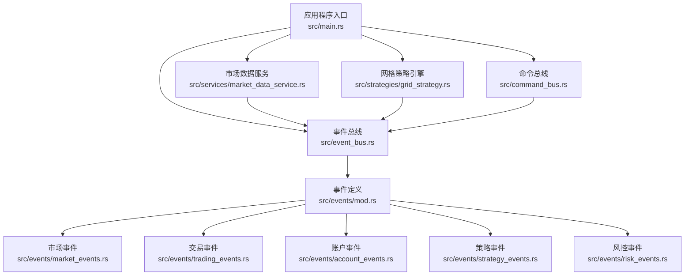
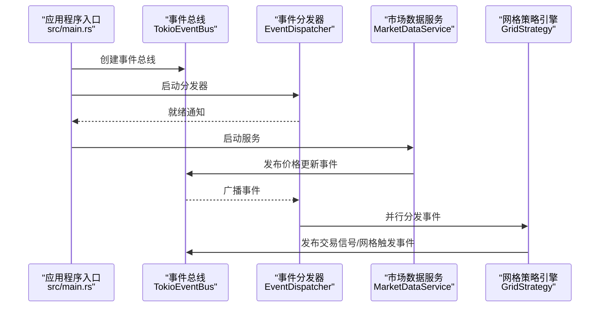
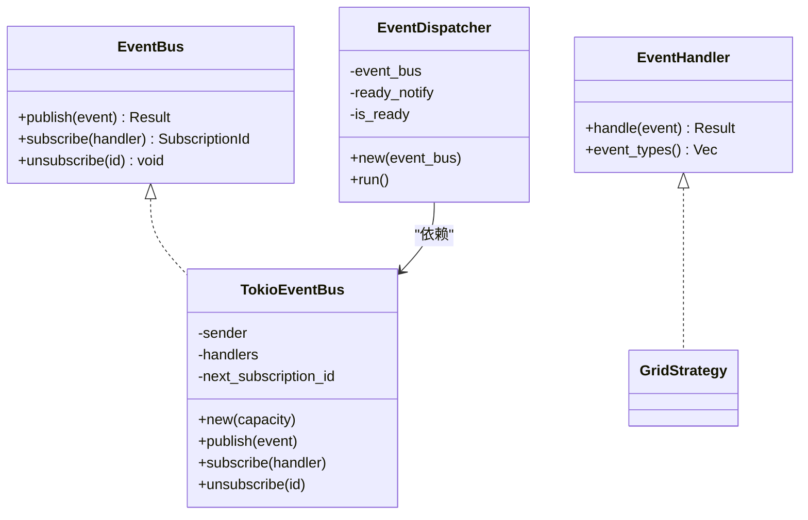
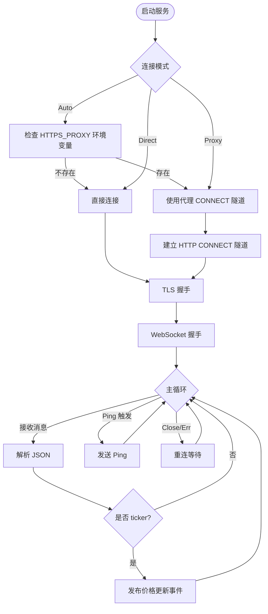
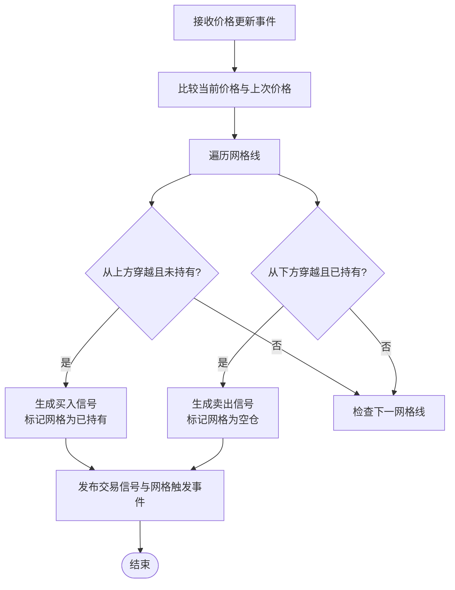
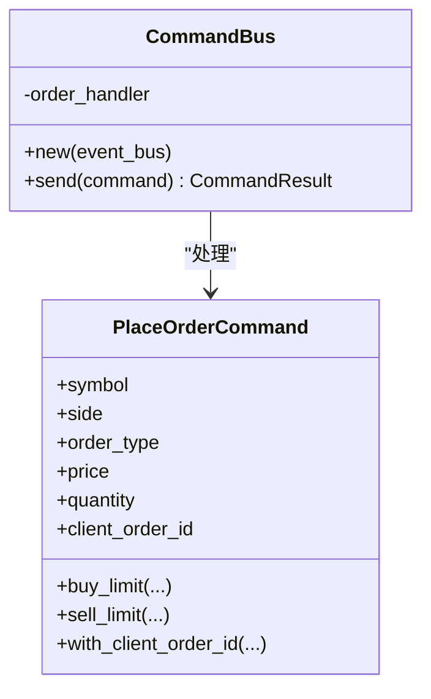
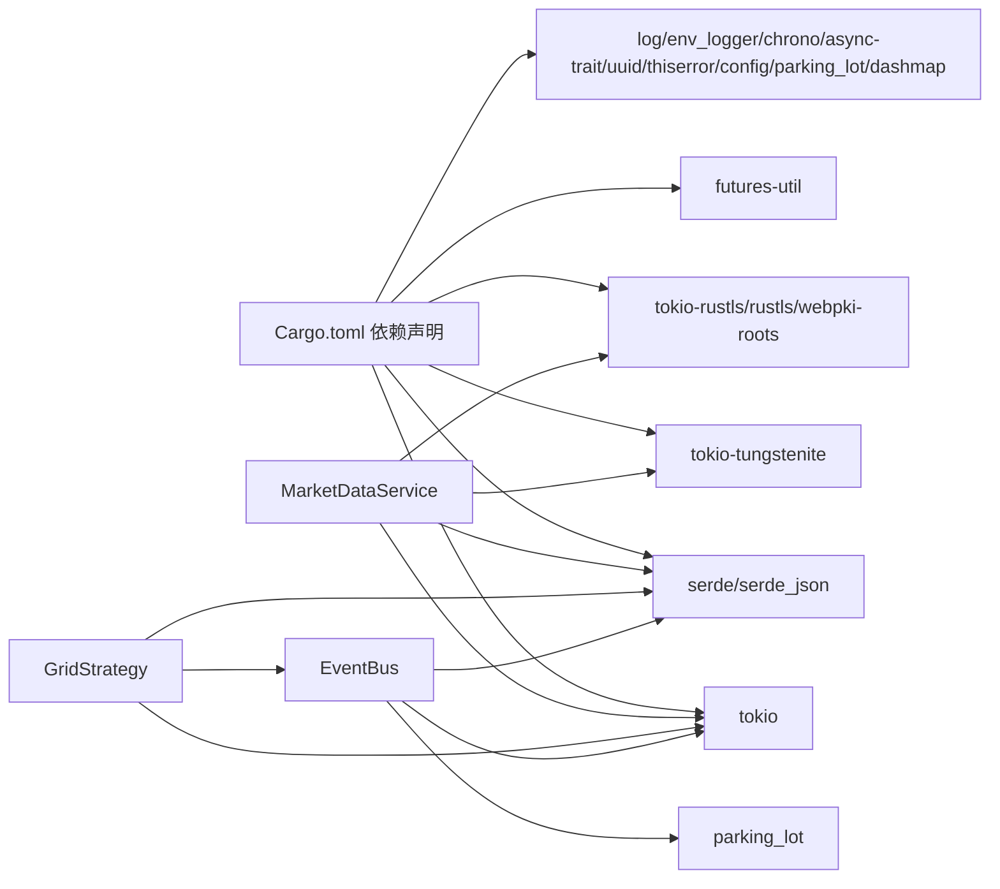

# 代码贡献指南

<cite>
**本文档引用的文件**
- [Cargo.toml](file://Cargo.toml)
- [lib.rs](file://src/lib.rs)
- [main.rs](file://src/main.rs)
- [event_bus.rs](file://src/event_bus.rs)
- [command_bus.rs](file://src/command_bus.rs)
- [order_commands.rs](file://src/commands/order_commands.rs)
- [grid_strategy.rs](file://src/strategies/grid_strategy.rs)
- [market_data_service.rs](file://src/services/market_data_service.rs)
- [error.rs](file://src/error.rs)
- [events/mod.rs](file://src/events/mod.rs)
- [events/market_events.rs](file://src/events/market_events.rs)
- [CODE_EXPLANATION.md](file://docs/CODE_EXPLANATION.md)
- [EVENT_DRIVEN_REFACTOR_GUIDE.md](file://docs/EVENT_DRIVEN_REFACTOR_GUIDE.md)
</cite>

## 目录
1. [简介](#简介)
2. [项目结构](#项目结构)
3. [核心组件](#核心组件)
4. [架构概览](#架构概览)
5. [详细组件分析](#详细组件分析)
6. [依赖关系分析](#依赖关系分析)
7. [性能考虑](#性能考虑)
8. [故障排查指南](#故障排查指南)
9. [结论](#结论)
10. [附录](#附录)

## 简介
本指南面向希望参与 Binance Rust 事件驱动交易系统开发的开发者，提供从代码风格、提交规范、代码审查标准到开发环境搭建与重构指导的完整流程。项目采用事件驱动架构，通过事件总线解耦各模块，结合 WebSocket 实时数据接入与网格策略引擎，形成可扩展、可维护的量化交易系统。

## 项目结构
项目采用按功能域划分的模块化组织方式，核心模块包括事件定义、事件总线、命令总线、策略引擎、市场数据服务与错误处理等。顶层入口负责装配组件并启动系统。

**图表来源**
- [main.rs:1-93](file://src/main.rs#L1-L93)
- [event_bus.rs:1-257](file://src/event_bus.rs#L1-L257)
- [command_bus.rs:1-19](file://src/command_bus.rs#L1-L19)
- [market_data_service.rs:1-503](file://src/services/market_data_service.rs#L1-L503)
- [grid_strategy.rs:1-401](file://src/strategies/grid_strategy.rs#L1-L401)
- [events/mod.rs:1-102](file://src/events/mod.rs#L1-L102)

**章节来源**
- [lib.rs:1-9](file://src/lib.rs#L1-L9)
- [main.rs:1-93](file://src/main.rs#L1-L93)

## 核心组件
- 事件总线：提供发布/订阅能力，支持并行分发与线程安全。
- 命令总线：封装命令分发，当前实现聚焦订单命令处理。
- 事件定义：统一的 DomainEvent 枚举与事件元数据，便于序列化与溯源。
- 市场数据服务：WebSocket 连接、代理支持、心跳保活与消息解析。
- 网格策略引擎：基于价格穿越生成交易信号，支持网格状态管理。
- 错误处理：分层错误模型，统一错误类型与便捷构造。

**章节来源**
- [event_bus.rs:1-257](file://src/event_bus.rs#L1-L257)
- [command_bus.rs:1-19](file://src/command_bus.rs#L1-L19)
- [events/mod.rs:1-102](file://src/events/mod.rs#L1-L102)
- [market_data_service.rs:1-503](file://src/services/market_data_service.rs#L1-L503)
- [grid_strategy.rs:1-401](file://src/strategies/grid_strategy.rs#L1-L401)
- [error.rs:1-169](file://src/error.rs#L1-L169)

## 架构概览
系统采用事件驱动架构，事件生产者发布事件至事件总线，事件分发器并行投递给订阅者。命令通过命令总线进入系统，最终由事件总线驱动策略与服务协同工作。

**图表来源**
- [main.rs:10-93](file://src/main.rs#L10-L93)
- [event_bus.rs:112-158](file://src/event_bus.rs#L112-L158)
- [market_data_service.rs:303-374](file://src/services/market_data_service.rs#L303-L374)
- [grid_strategy.rs:189-252](file://src/strategies/grid_strategy.rs#L189-L252)

## 详细组件分析

### 事件总线与事件分发器
- 设计要点
  - 基于广播通道实现一对多事件分发，具备背压处理能力。
  - 通过 Arc<RwLock<...>> 管理处理器集合，支持并发读取与动态订阅/取消。
  - 分发器并行执行所有处理器，提升吞吐量；单个处理器错误不影响整体。
- 关键接口
  - 发布：publish
  - 订阅：subscribe 返回订阅ID
  - 取消：unsubscribe
- 并发与线程安全
  - 使用 Send + Sync trait 约束，配合 Arc 共享与 RwLock 保护可变状态。

**图表来源**
- [event_bus.rs:18-110](file://src/event_bus.rs#L18-L110)
- [event_bus.rs:112-158](file://src/event_bus.rs#L112-L158)
- [grid_strategy.rs:264-278](file://src/strategies/grid_strategy.rs#L264-L278)

**章节来源**
- [event_bus.rs:1-257](file://src/event_bus.rs#L1-L257)

### 市场数据服务（WebSocket 实时数据）
- 连接模式
  - Auto：自动检测 HTTPS_PROXY 环境变量。
  - Direct：强制直连。
  - Proxy：强制使用代理。
- 代理支持
  - HTTP CONNECT 隧道：在代理与目标服务器之间建立隧道，随后进行 TLS 握手。
  - 支持 SSH 隧道模式（通过环境变量启用），强制直连并指定 TLS 主机名。
- 心跳与重连
  - 心跳：定时发送 Ping，维持连接活性。
  - 重连：异常断开后按固定间隔重试。
- 消息处理
  - 解析 Binance ticker 数据，过滤非 ticker 消息，发布价格更新事件。

**图表来源**
- [market_data_service.rs:23-82](file://src/services/market_data_service.rs#L23-L82)
- [market_data_service.rs:116-178](file://src/services/market_data_service.rs#L116-L178)
- [market_data_service.rs:231-301](file://src/services/market_data_service.rs#L231-L301)
- [market_data_service.rs:303-374](file://src/services/market_data_service.rs#L303-L374)

**章节来源**
- [market_data_service.rs:1-503](file://src/services/market_data_service.rs#L1-L503)

### 网格策略引擎
- 策略原理
  - 在价格区间内均匀布置网格，价格穿越网格线时生成买入/卖出信号。
  - 每个网格仅触发一次，避免重复交易。
- 状态管理
  - GridState 维护网格线、上次价格与信号计数。
  - 通过 Mutex 保护状态并发访问。
- 事件处理
  - 订阅价格更新事件，生成交易信号并发布到事件总线。

**图表来源**
- [grid_strategy.rs:102-154](file://src/strategies/grid_strategy.rs#L102-L154)
- [grid_strategy.rs:189-252](file://src/strategies/grid_strategy.rs#L189-L252)

**章节来源**
- [grid_strategy.rs:1-401](file://src/strategies/grid_strategy.rs#L1-L401)

### 命令总线与命令定义
- 命令总线
  - 当前实现仅处理下单命令，未来可扩展更多命令类型。
- 命令定义
  - 订单命令包含交易对、方向、类型、价格、数量等字段。
  - 提供便捷构造函数与客户端订单ID设置。

**图表来源**
- [command_bus.rs:1-19](file://src/command_bus.rs#L1-L19)
- [order_commands.rs:1-72](file://src/commands/order_commands.rs#L1-L72)

**章节来源**
- [command_bus.rs:1-19](file://src/command_bus.rs#L1-L19)
- [order_commands.rs:1-72](file://src/commands/order_commands.rs#L1-L72)

### 错误处理与统一模型
- 分层错误
  - 基础设施层、事件总线层、命令总线层、服务层分别定义错误类型。
  - 通过 From trait 自动向上转换，对外暴露统一 DomainError。
- 错误构造
  - 提供便捷构造函数，增强错误上下文信息。
- 使用建议
  - 在各层捕获具体错误并转换为上层错误类型，保持调用链清晰。

**章节来源**
- [error.rs:1-169](file://src/error.rs#L1-L169)

## 依赖关系分析
- 依赖管理
  - 使用 Cargo 管理依赖，核心依赖包括异步运行时、WebSocket、序列化、并发工具等。
- 模块依赖
  - 事件总线被市场数据服务与策略引擎共同依赖。
  - 命令总线依赖事件总线与命令处理器。
  - 事件模块被事件总线与服务/策略共享。

**图表来源**
- [Cargo.toml:6-24](file://Cargo.toml#L6-L24)
- [market_data_service.rs:1-22](file://src/services/market_data_service.rs#L1-L22)
- [grid_strategy.rs:6-13](file://src/strategies/grid_strategy.rs#L6-L13)
- [event_bus.rs:5-11](file://src/event_bus.rs#L5-L11)

**章节来源**
- [Cargo.toml:1-27](file://Cargo.toml#L1-L27)

## 性能考虑
- 异步与并发
  - 使用 tokio 异步运行时与广播通道，提升事件分发吞吐量。
  - 事件分发器并行执行所有处理器，降低延迟。
- 内存与序列化
  - 事件结构体使用 serde 序列化，注意字段大小与序列化开销。
- 网络与连接
  - WebSocket 心跳与自动重连机制保证连接稳定性。
  - 代理隧道与直连模式根据部署环境选择最优路径。

[本节为通用性能讨论，无需特定文件来源]

## 故障排查指南
- WebSocket 连接失败
  - 检查代理环境变量与连接模式配置。
  - 查看握手与 TLS 握手日志，确认证书与主机名匹配。
- 事件未到达订阅者
  - 确认订阅者正确注册且事件类型过滤符合预期。
  - 检查事件总线容量与背压情况。
- 策略信号异常
  - 核对网格配置与价格穿越逻辑，确保状态一致性。
  - 检查事件发布与订阅链路是否完整。

**章节来源**
- [market_data_service.rs:116-178](file://src/services/market_data_service.rs#L116-L178)
- [event_bus.rs:128-157](file://src/event_bus.rs#L128-L157)
- [grid_strategy.rs:189-252](file://src/strategies/grid_strategy.rs#L189-L252)

## 结论
本项目通过事件驱动架构实现了模块解耦与高扩展性，结合 WebSocket 实时数据与网格策略引擎，为量化交易提供了坚实基础。遵循本文档的代码风格、提交规范与审查标准，有助于保持代码质量与团队协作效率。

[本节为总结性内容，无需特定文件来源]

## 附录

### 代码风格规范
- Rust 编码标准
  - 使用 async/await 异步编程，避免阻塞操作。
  - 使用 Result 与 ? 操作符进行错误传播，避免 unwrap。
  - 采用 Send + Sync trait 约束跨线程安全。
- 命名约定
  - 模块与文件：小写下划线 snake_case。
  - 结构体与枚举：帕斯卡命名 PascalCase。
  - 方法与函数：小写下划线 snake_case。
  - 常量：大写下划线 UPPER_CASE。
- 注释规范
  - 公共 API 使用文档注释，说明用途、参数与返回值。
  - 复杂逻辑添加行内注释，解释关键步骤与设计权衡。
- 模块组织原则
  - 按功能域划分模块，事件、命令、服务、策略分层清晰。
  - 公共类型在 lib.rs 中统一导出，避免循环依赖。

**章节来源**
- [event_bus.rs:1-257](file://src/event_bus.rs#L1-L257)
- [grid_strategy.rs:1-401](file://src/strategies/grid_strategy.rs#L1-L401)
- [lib.rs:1-9](file://src/lib.rs#L1-L9)

### 提交规范
- Commit Message 格式
  - 类型: 摘要
  - 范围: 详细描述（不超过一行）
  - 影响范围: 如涉及破坏性变更，明确标注
- 分支管理策略
  - 主分支：稳定发布版本。
  - 开发分支：feature/* 或 refactor/*
  - 修复分支：fix/*
- Pull Request 流程
  - 提交 PR 前确保通过测试与 lint。
  - 代码审查至少一名维护者批准。
  - 合并前清理不必要的提交历史。

[本节为通用流程说明，无需特定文件来源]

### 代码审查标准
- 代码质量
  - 通过单元测试与集成测试覆盖关键路径。
  - 避免重复代码，遵循 DRY 原则。
  - 使用精确导入，减少模块暴露面。
- 性能考量
  - 评估事件分发与序列化开销，避免热点路径阻塞。
  - 控制事件大小与嵌套层级，减少内存占用。
- 安全性检查
  - 校验外部输入与网络数据，防止注入与越界。
  - 严格处理 TLS 证书与主机名验证，避免中间人攻击。

**章节来源**
- [CODE_EXPLANATION.md:13-58](file://docs/CODE_EXPLANATION.md#L13-L58)

### 开发环境搭建
- Rust 工具链
  - 安装 rustup、稳定版 Rust 与 Cargo。
- IDE 配置
  - 推荐使用 VS Code + rust-analyzer，启用格式化与 Lint。
- 调试环境
  - 设置 RUST_LOG 环境变量控制日志级别。
  - 使用 tokio::time::sleep 进行时间控制与测试。
- 依赖管理
  - 使用 Cargo 管理依赖，定期更新以获得安全补丁。

**章节来源**
- [EVENT_DRIVEN_REFACTOR_GUIDE.md:262-328](file://docs/EVENT_DRIVEN_REFACTOR_GUIDE.md#L262-L328)

### 代码重构指导
- 消除重复代码
  - 提取公共函数（如 WebSocket URL 构建）。
  - 删除无用代码与未使用的 trait。
- 简化复杂逻辑
  - 通过 Display trait 简化枚举转换。
  - 使用更精确的导入减少命名冲突。
- 改进代码结构
  - 明确模块边界与职责，保持高内聚低耦合。
  - 事件与命令分离，遵循 CQRS 思想。

**章节来源**
- [CODE_EXPLANATION.md:11-58](file://docs/CODE_EXPLANATION.md#L11-L58)

### 最佳实践与常见问题
- 最佳实践
  - 事件驱动：通过事件总线解耦模块，便于扩展与测试。
  - 错误处理：分层错误模型，统一出口，增强可观测性。
  - 并发安全：合理使用 Arc、RwLock 与 Mutex，避免死锁。
- 常见问题
  - 代理连接失败：检查代理地址与认证，确认 HTTP CONNECT 成功。
  - 事件丢失：检查订阅者注册与事件类型过滤。
  - 性能瓶颈：关注事件分发与序列化性能，必要时引入缓冲与批处理。

**章节来源**
- [EVENT_DRIVEN_REFACTOR_GUIDE.md:331-560](file://docs/EVENT_DRIVEN_REFACTOR_GUIDE.md#L331-L560)