# 开发指南

<cite>
**本文引用的文件**
- [Cargo.toml](file://Cargo.toml)
- [lib.rs](file://src/lib.rs)
- [main.rs](file://src/main.rs)
- [event_bus.rs](file://src/event_bus.rs)
- [command_bus.rs](file://src/command_bus.rs)
- [mod.rs](file://src/events/mod.rs)
- [market_events.rs](file://src/events/market_events.rs)
- [trading_events.rs](file://src/events/trading_events.rs)
- [order_commands.rs](file://src/commands/order_commands.rs)
- [order_handler.rs](file://src/handlers/order_handler.rs)
- [market_data_service.rs](file://src/services/market_data_service.rs)
- [grid_strategy.rs](file://src/strategies/grid_strategy.rs)
- [momentum_strategy.rs](file://src/strategies/momentum_strategy.rs)
- [indicators.rs](file://src/strategies/indicators.rs)
- [error.rs](file://src/error.rs)
- [binance_client.rs](file://src/clients/binance_client.rs)
- [mod.rs](file://src/backtest/mod.rs)
- [engine.rs](file://src/backtest/engine.rs)
- [data_loader.rs](file://src/backtest/data_loader.rs)
- [recorder.rs](file://src/backtest/recorder.rs)
- [report.rs](file://src/backtest/report.rs)
- [strategy_v2.rs](file://src/backtest/strategy_v2.rs)
- [backtest.rs](file://src/bin/backtest.rs)
- [CODE_EXPLANATION.md](file://docs/CODE_EXPLANATION.md)
</cite>

## 目录
1. [简介](#简介)
2. [项目结构](#项目结构)
3. [核心组件](#核心组件)
4. [架构总览](#架构总览)
5. [详细组件分析](#详细组件分析)
6. [依赖分析](#依赖分析)
7. [性能考虑](#性能考虑)
8. [故障排查指南](#故障排查指南)
9. [结论](#结论)
10. [附录](#附录)

## 简介
本指南面向希望参与 Binance Rust 事件驱动交易系统的开发者，提供从环境搭建、代码贡献、测试策略到扩展开发与性能优化的完整指引。系统采用事件驱动架构，围绕事件总线、命令总线、策略引擎与领域服务协同工作，实时接入 Binance WebSocket 数据，支持网格交易策略演示与扩展。新增回测系统模块提供 K 线回测、参数优化与 V2 多策略引擎，支持做空与追踪止损等高级特性。

## 项目结构
项目采用按职责分层的模块组织方式：
- 核心运行入口位于应用根目录，负责装配事件总线、策略、服务与命令总线
- 事件总线与命令总线提供跨模块解耦的通信与执行通道
- 事件与事件处理器定义在 events 与 handlers 模块
- 领域服务封装业务能力，如市场数据服务
- 策略模块实现交易策略逻辑，包含网格策略与动量策略
- 回测系统提供历史数据回测、参数优化与报告生成
- 客户端模块封装 Binance API 访问与数据下载
- 错误处理模块提供统一错误类型与转换

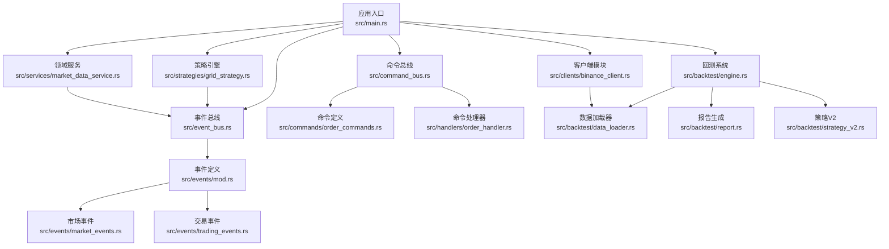

图表来源
- [main.rs:10-93](file://src/main.rs#L10-L93)
- [lib.rs:1-9](file://src/lib.rs#L1-L9)
- [event_bus.rs:18-110](file://src/event_bus.rs#L18-L110)
- [command_bus.rs:1-19](file://src/command_bus.rs#L1-L19)
- [grid_strategy.rs:156-278](file://src/strategies/grid_strategy.rs#L156-L278)
- [market_data_service.rs:32-42](file://src/services/market_data_service.rs#L32-L42)
- [mod.rs:48-89](file://src/events/mod.rs#L48-L89)
- [engine.rs:110-122](file://src/backtest/engine.rs#L110-L122)
- [data_loader.rs:66-76](file://src/backtest/data_loader.rs#L66-L76)
- [report.rs:34-85](file://src/backtest/report.rs#L34-L85)
- [strategy_v2.rs:14-27](file://src/backtest/strategy_v2.rs#L14-L27)
- [binance_client.rs:16-25](file://src/clients/binance_client.rs#L16-L25)

章节来源
- [lib.rs:1-9](file://src/lib.rs#L1-L9)
- [main.rs:10-93](file://src/main.rs#L10-L93)

## 核心组件
- 事件总线与分发器：提供广播式事件发布/订阅，支持并行分发与错误隔离
- 命令总线与命令处理器：封装命令执行逻辑，将命令转换为领域事件
- 事件与事件类型：统一的领域事件枚举与事件元数据
- 市场数据服务：连接 Binance WebSocket，解析行情并发布事件
- 网格策略：监听价格事件，生成交易信号并发布
- 动量策略：基于多数据流的高频动量交易策略
- 回测引擎：支持 K 线回测、参数优化与 V2 多策略引擎
- Binance 客户端：封装 REST API 访问与历史数据下载
- 错误处理：分层错误类型与统一结果包装

章节来源
- [event_bus.rs:18-110](file://src/event_bus.rs#L18-L110)
- [command_bus.rs:1-19](file://src/command_bus.rs#L1-L19)
- [mod.rs:48-89](file://src/events/mod.rs#L48-L89)
- [market_data_service.rs:32-42](file://src/services/market_data_service.rs#L32-L42)
- [grid_strategy.rs:156-278](file://src/strategies/grid_strategy.rs#L156-L278)
- [momentum_strategy.rs:204-225](file://src/strategies/momentum_strategy.rs#L204-L225)
- [engine.rs:110-122](file://src/backtest/engine.rs#L110-L122)
- [binance_client.rs:16-25](file://src/clients/binance_client.rs#L16-L25)
- [error.rs:12-34](file://src/error.rs#L12-L34)

## 架构总览
系统采用事件驱动架构，事件总线作为中枢，策略与服务通过订阅事件实现解耦；命令总线负责将命令转换为事件，驱动系统状态变更。新增回测系统提供离线验证与参数优化能力。

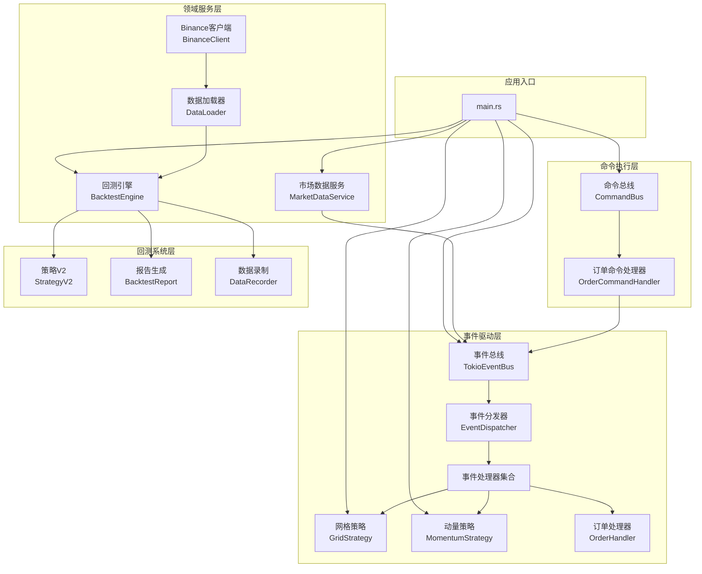

图表来源
- [event_bus.rs:62-158](file://src/event_bus.rs#L62-L158)
- [command_bus.rs:5-19](file://src/command_bus.rs#L5-L19)
- [order_handler.rs:9-91](file://src/handlers/order_handler.rs#L9-L91)
- [grid_strategy.rs:156-278](file://src/strategies/grid_strategy.rs#L156-L278)
- [momentum_strategy.rs:204-225](file://src/strategies/momentum_strategy.rs#L204-L225)
- [market_data_service.rs:96-178](file://src/services/market_data_service.rs#L96-L178)
- [main.rs:14-60](file://src/main.rs#L14-L60)
- [engine.rs:110-122](file://src/backtest/engine.rs#L110-L122)
- [strategy_v2.rs:188-195](file://src/backtest/strategy_v2.rs#L188-L195)
- [report.rs:87-94](file://src/backtest/report.rs#L87-L94)
- [recorder.rs:10-13](file://src/backtest/recorder.rs#L10-L13)

## 详细组件分析

### 事件总线与分发器
- EventBus/EventHandler 抽象定义了发布、订阅与处理接口
- TokioEventBus 基于广播通道实现一对多事件分发
- EventDispatcher 独立任务从通道接收事件并并行调用所有处理器
- extract_event_type 提供 DomainEvent 到 EventType 的映射

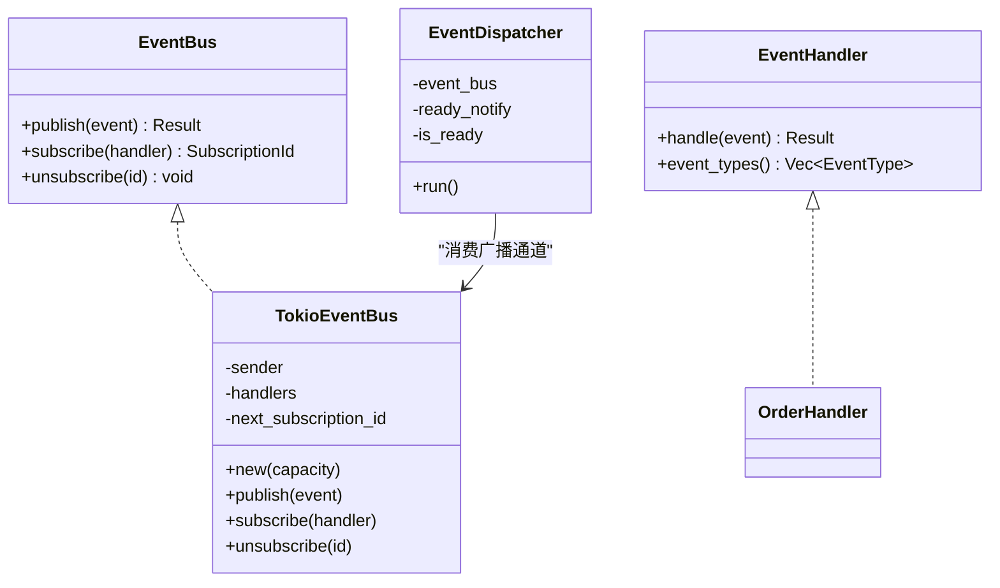

图表来源
- [event_bus.rs:18-110](file://src/event_bus.rs#L18-L110)
- [event_bus.rs:62-158](file://src/event_bus.rs#L62-L158)

章节来源
- [event_bus.rs:18-110](file://src/event_bus.rs#L18-L110)
- [event_bus.rs:112-158](file://src/event_bus.rs#L112-L158)

### 命令总线与命令处理器
- CommandBus 根据命令类型路由至对应处理器
- OrderCommandHandler 校验参数并发布 OrderSubmitted 事件
- 事件驱动的命令执行避免直接耦合外部系统

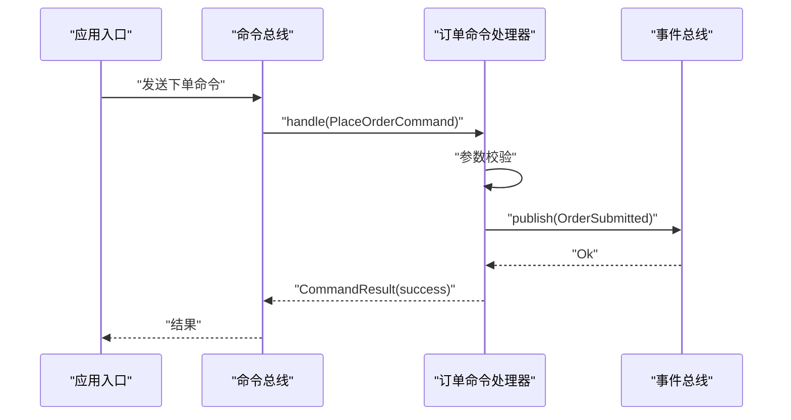

图表来源
- [command_bus.rs:8-19](file://src/command_bus.rs#L8-L19)
- [order_handler.rs:93-137](file://src/handlers/order_handler.rs#L93-L137)
- [order_handler.rs:102-135](file://src/handlers/order_handler.rs#L102-L135)

章节来源
- [command_bus.rs:1-19](file://src/command_bus.rs#L1-L19)
- [order_handler.rs:93-137](file://src/handlers/order_handler.rs#L93-L137)

### 事件定义与事件类型
- DomainEvent 统一枚举系统内所有事件
- 事件元数据包含事件 ID、时间戳、版本、关联 ID 等
- 事件类型覆盖市场、交易、账户、策略、风控等维度

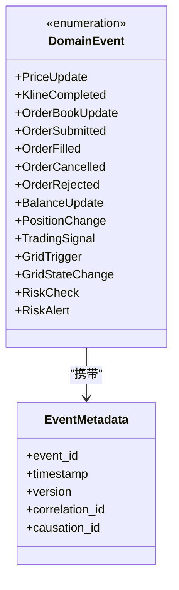

图表来源
- [mod.rs:48-89](file://src/events/mod.rs#L48-L89)
- [mod.rs:21-46](file://src/events/mod.rs#L21-L46)

章节来源
- [mod.rs:48-89](file://src/events/mod.rs#L48-L89)
- [mod.rs:21-46](file://src/events/mod.rs#L21-L46)

### 市场数据服务
- 支持自动/直连/代理三种连接模式
- 通过 HTTP CONNECT 隧道与代理协作
- 心跳保活与自动重连保障稳定性
- 解析 Binance ticker 数据并发布 PriceUpdate 事件

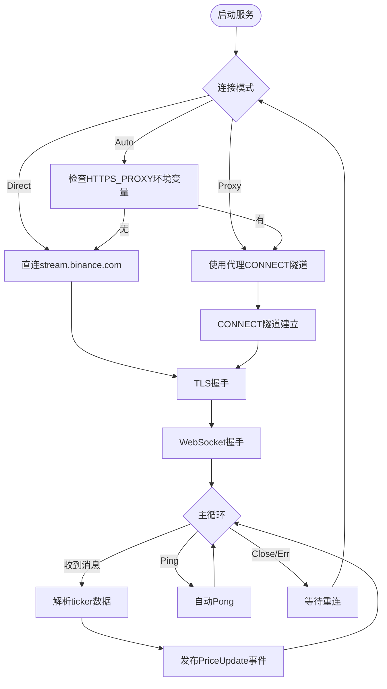

图表来源
- [market_data_service.rs:96-178](file://src/services/market_data_service.rs#L96-L178)
- [market_data_service.rs:117-178](file://src/services/market_data_service.rs#L117-L178)
- [market_data_service.rs:303-374](file://src/services/market_data_service.rs#L303-L374)

章节来源
- [market_data_service.rs:23-32](file://src/services/market_data_service.rs#L23-L32)
- [market_data_service.rs:117-178](file://src/services/market_data_service.rs#L117-L178)
- [market_data_service.rs:303-374](file://src/services/market_data_service.rs#L303-L374)

### 网格策略
- 根据价格穿越网格线生成交易信号
- 发布 GridTrigger 与 TradingSignal 事件
- 使用 Arc<Mutex<GridState>> 管理策略内部状态

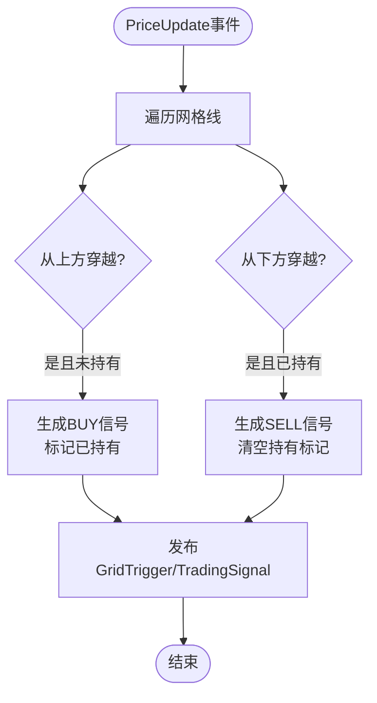

图表来源
- [grid_strategy.rs:102-154](file://src/strategies/grid_strategy.rs#L102-L154)
- [grid_strategy.rs:234-249](file://src/strategies/grid_strategy.rs#L234-L249)

章节来源
- [grid_strategy.rs:156-278](file://src/strategies/grid_strategy.rs#L156-L278)

### 动量策略
- 基于多数据流（K线、成交流、盘口）的高频动量交易策略
- 支持趋势方向 + RSI 超卖/超买回归 + 成交量确认 + 盘口强度
- 实现持久化状态管理与数据超时保护机制

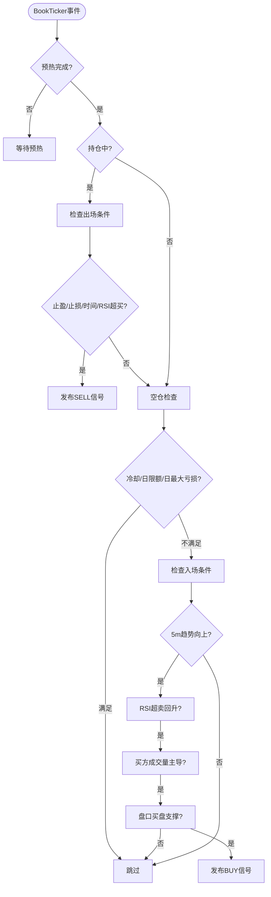

图表来源
- [momentum_strategy.rs:306-438](file://src/strategies/momentum_strategy.rs#L306-L438)
- [momentum_strategy.rs:344-382](file://src/strategies/momentum_strategy.rs#L344-L382)
- [momentum_strategy.rs:384-437](file://src/strategies/momentum_strategy.rs#L384-L437)

章节来源
- [momentum_strategy.rs:204-225](file://src/strategies/momentum_strategy.rs#L204-L225)
- [momentum_strategy.rs:306-438](file://src/strategies/momentum_strategy.rs#L306-L438)

### 回测引擎
- 支持 K 线模式与回放模式两种回测方式
- 实现参数优化与 V2 多策略引擎
- 生成详细的回测报告与统计指标

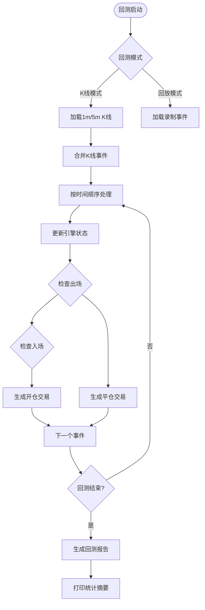

图表来源
- [engine.rs:124-150](file://src/backtest/engine.rs#L124-L150)
- [engine.rs:316-327](file://src/backtest/engine.rs#L316-L327)
- [engine.rs:483-489](file://src/backtest/engine.rs#L483-L489)

章节来源
- [engine.rs:110-122](file://src/backtest/engine.rs#L110-L122)
- [engine.rs:124-150](file://src/backtest/engine.rs#L124-L150)
- [engine.rs:316-327](file://src/backtest/engine.rs#L316-L327)

### 技术指标计算
- EMA 指标：实现指数移动平均线计算，支持预热阶段与平滑计算
- RSI 指标：计算相对强弱指数，支持超买超卖检测
- VolumeRatio 指标：计算买卖量比率，支持滑动窗口统计

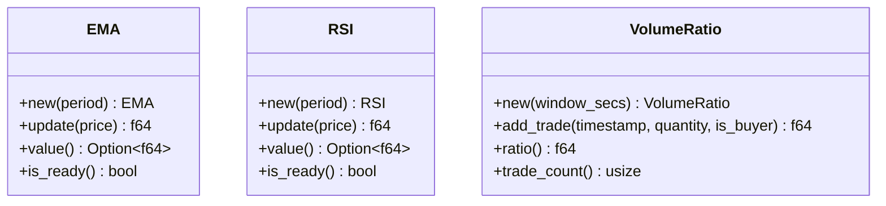

图表来源
- [indicators.rs:7-63](file://src/strategies/indicators.rs#L7-L63)
- [indicators.rs:65-144](file://src/strategies/indicators.rs#L65-L144)
- [indicators.rs:146-209](file://src/strategies/indicators.rs#L146-L209)

章节来源
- [indicators.rs:7-63](file://src/strategies/indicators.rs#L7-L63)
- [indicators.rs:65-144](file://src/strategies/indicators.rs#L65-L144)
- [indicators.rs:146-209](file://src/strategies/indicators.rs#L146-L209)

### Binance 客户端
- 封装 REST API 访问，支持下单、撤单、查询账户等功能
- 实现 HMAC-SHA256 签名与请求重试机制
- 提供历史 K 线数据下载与解析

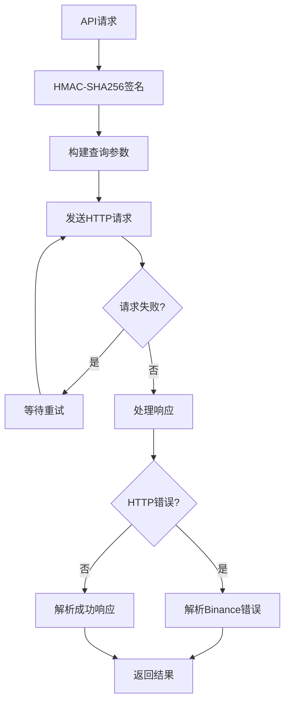

图表来源
- [binance_client.rs:182-214](file://src/clients/binance_client.rs#L182-L214)
- [binance_client.rs:216-244](file://src/clients/binance_client.rs#L216-L244)
- [binance_client.rs:304-326](file://src/clients/binance_client.rs#L304-L326)

章节来源
- [binance_client.rs:16-25](file://src/clients/binance_client.rs#L16-L25)
- [binance_client.rs:182-214](file://src/clients/binance_client.rs#L182-L214)
- [binance_client.rs:216-244](file://src/clients/binance_client.rs#L216-L244)

### 错误处理
- 分层错误类型：Infrastructure/EventBus/CommandBus/Service/Unknown
- 统一结果类型 Result<T> = Result<T, DomainError>
- 通过 From trait 自动向上转换，便于传播与定位

章节来源
- [error.rs:12-34](file://src/error.rs#L12-L34)
- [error.rs:85-128](file://src/error.rs#L85-L128)

## 依赖分析
- 运行时与异步：Tokio（full）、futures-util
- 网络与安全：tokio-tungstenite、tokio-rustls、rustls、webpki-roots
- 序列化：serde、serde_json、chrono
- 并发与同步：parking_lot（RwLock）、dashmap（哈希表）
- 日志与配置：log、env_logger、config
- 错误处理：thiserror
- 测试：tokio-test（dev-dependencies）
- HTTP 客户端：reqwest（支持 rustls-tls）
- 加密：hmac、sha2、hex
- 配置：toml

章节来源
- [Cargo.toml:6-27](file://Cargo.toml#L6-L27)

## 性能考虑
- 事件总线采用广播通道，具备背压与多订阅者并行处理能力
- EventDispatcher 使用 join_all 并行调用所有处理器，降低整体延迟
- 策略内部状态使用 Mutex 保护，避免竞态；建议在高频路径尽量减少锁粒度
- 市场数据服务的心跳与自动重连避免连接中断导致的数据丢失
- 回测引擎实现内存预加载与零 IO 操作，提升参数优化效率
- V2 策略引擎支持 Intra-bar 止盈止损，提高交易精度
- 技术指标使用滑动窗口与预热机制，平衡准确性与时效性
- 建议对高频事件序列化与反序列化进行基准测试，必要时引入零拷贝或缓冲池

## 故障排查指南
- WebSocket 连接失败
  - 检查连接模式与代理配置，确认环境变量 HTTPS_PROXY 或连接模式设置正确
  - 查看 TLS 握手与 CONNECT 隧道建立日志
- 事件未到达处理器
  - 确认处理器已订阅相应 EventType
  - 检查 EventDispatcher 是否正常运行与 ready 通知
- 命令执行失败
  - 校验命令参数（如数量必须大于0）
  - 检查事件发布是否成功
- 策略无信号
  - 确认订阅的交易对与价格事件一致
  - 检查网格区间与数量配置是否合理
  - 验证技术指标计算是否正常
- 回测结果异常
  - 检查数据加载是否成功
  - 确认参数配置合理性
  - 验证策略状态初始化
- API 调用失败
  - 检查签名生成与时间戳
  - 查看重试机制是否正常工作
  - 确认网络连接与代理设置

章节来源
- [market_data_service.rs:117-178](file://src/services/market_data_service.rs#L117-L178)
- [order_handler.rs:102-135](file://src/handlers/order_handler.rs#L102-L135)
- [grid_strategy.rs:264-278](file://src/strategies/grid_strategy.rs#L264-L278)
- [engine.rs:124-150](file://src/backtest/engine.rs#L124-L150)
- [binance_client.rs:304-326](file://src/clients/binance_client.rs#L304-L326)

## 结论
本项目以事件驱动为核心，结合命令总线与领域服务，构建了可扩展、可维护的实时交易系统原型。新增回测系统模块提供了完整的离线验证与参数优化能力，支持多种策略类型与高级交易特性。通过清晰的模块边界与统一错误模型，开发者可以快速添加新的事件类型、处理器与业务服务，并在保证性能与稳定性的前提下进行迭代演进。

## 附录

### 开发环境搭建与 IDE 配置
- Rust 工具链与 Cargo
- 推荐 IDE：VS Code + rust-analyzer 或 IntelliJ IDEA + Rust 插件
- 启用 clippy 与 fmt 检查
- 本地运行：cargo run
- 回测运行：cargo run --bin backtest

章节来源
- [Cargo.toml:1-27](file://Cargo.toml#L1-L27)

### 调试设置与性能分析
- 使用 tokio::time::sleep 控制运行时长，便于观察事件流
- 在策略与服务中加入日志输出，定位事件流转
- 使用火焰图工具（perf + flamegraph）分析热点路径
- 回测系统支持详细统计报告输出

章节来源
- [main.rs:86-92](file://src/main.rs#L86-L92)
- [report.rs:258-310](file://src/backtest/report.rs#L258-L310)

### 测试策略
- 单元测试
  - 事件与命令数据结构的序列化/反序列化
  - 网格策略的状态机与穿越检测
  - 技术指标计算的准确性验证
  - 回测引擎的状态管理与参数优化
- 集成测试
  - 事件总线的发布/订阅与并行分发
  - 市场数据服务的连接、心跳与消息解析
  - Binance 客户端的 API 调用与错误处理
- 性能测试
  - 事件吞吐量与延迟基准
  - 多处理器并行处理的扩展性评估
  - 回测引擎的内存使用与执行效率
  - 技术指标计算的性能基准

章节来源
- [grid_strategy.rs:280-401](file://src/strategies/grid_strategy.rs#L280-L401)
- [momentum_strategy.rs:470-489](file://src/strategies/momentum_strategy.rs#L470-L489)
- [indicators.rs:211-260](file://src/strategies/indicators.rs#L211-L260)
- [engine.rs:483-630](file://src/backtest/engine.rs#L483-L630)
- [binance_client.rs:592-648](file://src/clients/binance_client.rs#L592-L648)

### 代码贡献指南
- 代码风格
  - 遵循 Rust 社区风格（cargo fmt），启用 clippy（cargo clippy）
  - 保持模块职责单一，事件与命令命名语义明确
  - 新增模块需提供相应的文档注释
- 提交规范
  - 提交信息遵循约定式提交（feat/fix/docs/chore）
  - 每个功能提交包含测试用例
  - 回测相关修改需包含性能影响评估
- 测试要求
  - 新增功能需配套单元测试与集成测试
  - 对关键路径进行性能回归测试
  - 回测模块需提供参数优化测试
- 审查流程
  - 提交 PR，至少一名维护者审查
  - 通过 CI（格式、编译、测试、覆盖率）
  - 回测相关代码需通过性能基准测试

### 扩展开发指南
- 添加新的事件类型
  - 在事件枚举中新增变体，补充事件数据结构
  - 在事件类型映射函数中添加对应分支
  - 在处理器中实现事件处理逻辑
- 实现自定义事件处理器
  - 实现 EventHandler trait，声明感兴趣的事件类型
  - 在应用入口注册处理器并订阅事件总线
- 开发新的业务服务
  - 封装服务初始化、连接与消息处理
  - 通过事件总线发布领域事件，供策略与其他服务消费
- 扩展回测系统
  - 新增策略类型需实现 run_backtest_v2 函数
  - 提供参数优化器与性能评估
  - 实现自定义报告格式与统计指标
- 集成新客户端
  - 实现新的 API 客户端封装
  - 提供数据下载与解析功能
  - 集成到现有事件流中

章节来源
- [mod.rs:48-89](file://src/events/mod.rs#L48-L89)
- [event_bus.rs:31-39](file://src/event_bus.rs#L31-L39)
- [strategy_v2.rs:188-195](file://src/backtest/strategy_v2.rs#L188-L195)
- [backtest.rs:123-172](file://src/bin/backtest.rs#L123-L172)
- [binance_client.rs:147-174](file://src/clients/binance_client.rs#L147-L174)

### 新模块开发规范
- 回测系统模块规范
  - 使用 BacktestConfig 统一配置管理
  - 实现 BacktestEngine::run_backtest_on_data 支持零 IO 参数优化
  - 提供 StrategyV2Config 支持多策略类型
  - 实现 DataRecorder 支持实时数据录制
- 技术指标模块规范
  - 实现流式计算接口，支持预热与平滑
  - 提供 is_ready 方法检查就绪状态
  - 使用滑动窗口与 VecDeque 优化内存使用
- 客户端模块规范
  - 实现统一的错误处理与重试机制
  - 提供签名验证与时间戳管理
  - 支持代理与 SSH 隧道访问

章节来源
- [engine.rs:483-489](file://src/backtest/engine.rs#L483-L489)
- [strategy_v2.rs:29-69](file://src/backtest/strategy_v2.rs#L29-L69)
- [recorder.rs:10-13](file://src/backtest/recorder.rs#L10-L13)
- [indicators.rs:17-63](file://src/strategies/indicators.rs#L17-L63)
- [binance_client.rs:182-214](file://src/clients/binance_client.rs#L182-L214)

### 性能优化建议
- 事件处理优化
  - 使用 Arc<Mutex<T>> 管理共享状态，减少锁竞争
  - 实现批量处理与事件合并，降低事件总线压力
  - 优化事件序列化，使用零拷贝或缓冲池
- 回测性能优化
  - 实现内存预加载，避免重复磁盘 IO
  - 使用并行参数优化，充分利用多核 CPU
  - 实现增量回测，支持部分数据更新
- 策略执行优化
  - 使用滑动窗口与预计算，减少重复计算
  - 实现条件缓存，避免频繁的状态检查
  - 优化技术指标计算，使用增量更新
- 内存管理最佳实践
  - 使用 VecDeque 替代 Vec 进行滑动窗口
  - 实现对象池，复用临时对象减少 GC 压力
  - 合理使用 Arc 共享数据，避免不必要的复制
- 并发编程注意事项
  - 使用 tokio::sync::Mutex 保护共享状态
  - 实现适当的锁粒度，避免全局锁
  - 使用 channel 进行异步通信，避免阻塞操作
  - 实现优雅关闭，确保资源正确释放

章节来源
- [engine.rs:492-507](file://src/backtest/engine.rs#L492-L507)
- [indicators.rs:146-209](file://src/strategies/indicators.rs#L146-L209)
- [momentum_strategy.rs:42-81](file://src/strategies/momentum_strategy.rs#L42-L81)
- [binance_client.rs:216-244](file://src/clients/binance_client.rs#L216-L244)