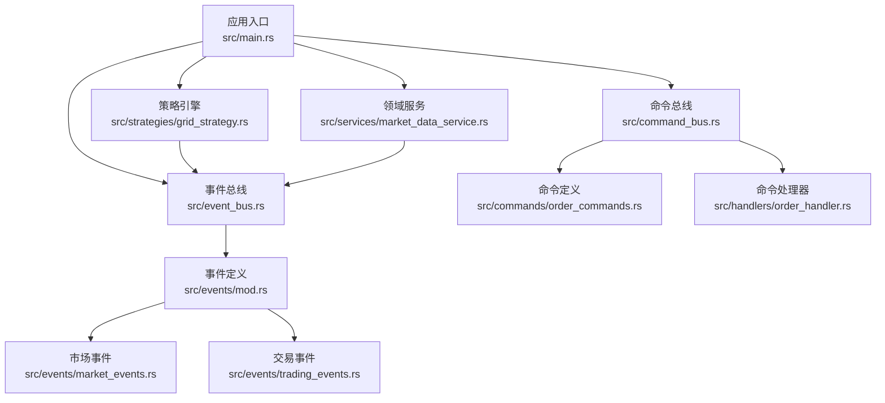
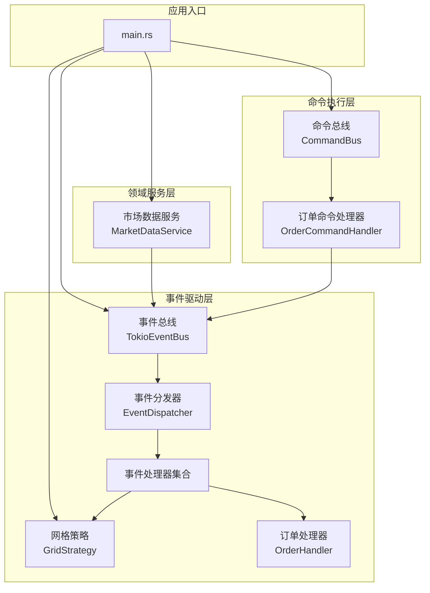
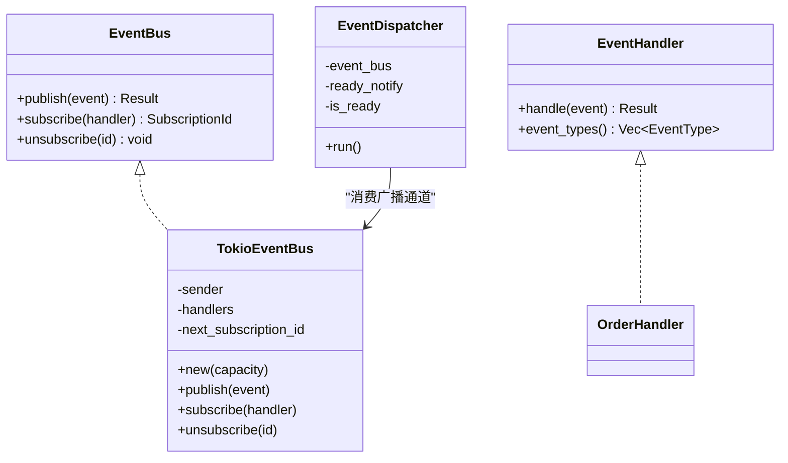
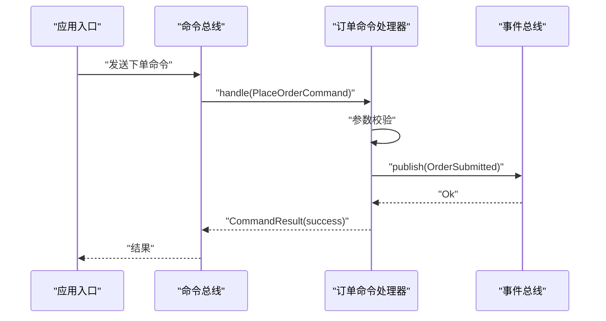
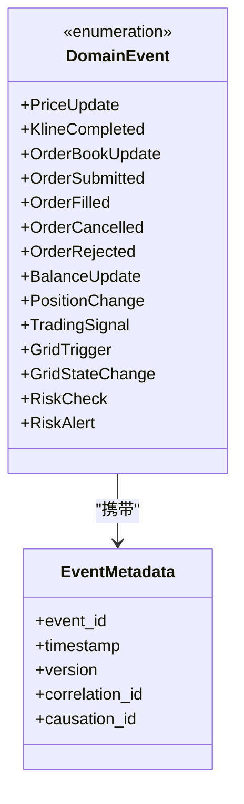

# 开发指南

<cite>
**本文引用的文件**
- [Cargo.toml](file://Cargo.toml)
- [lib.rs](file://src/lib.rs)
- [main.rs](file://src/main.rs)
- [event_bus.rs](file://src/event_bus.rs)
- [command_bus.rs](file://src/command_bus.rs)
- [mod.rs](file://src/events/mod.rs)
- [market_events.rs](file://src/events/market_events.rs)
- [trading_events.rs](file://src/events/trading_events.rs)
- [order_commands.rs](file://src/commands/order_commands.rs)
- [order_handler.rs](file://src/handlers/order_handler.rs)
- [market_data_service.rs](file://src/services/market_data_service.rs)
- [grid_strategy.rs](file://src/strategies/grid_strategy.rs)
- [error.rs](file://src/error.rs)
- [CODE_EXPLANATION.md](file://docs/CODE_EXPLANATION.md)
</cite>

## 目录
1. [简介](#简介)
2. [项目结构](#项目结构)
3. [核心组件](#核心组件)
4. [架构总览](#架构总览)
5. [详细组件分析](#详细组件分析)
6. [依赖分析](#依赖分析)
7. [性能考虑](#性能考虑)
8. [故障排查指南](#故障排查指南)
9. [结论](#结论)
10. [附录](#附录)

## 简介
本指南面向希望参与 Binance Rust 事件驱动交易系统的开发者，提供从环境搭建、代码贡献、测试策略到扩展开发与性能优化的完整指引。系统采用事件驱动架构，围绕事件总线、命令总线、策略引擎与领域服务协同工作，实时接入 Binance WebSocket 数据，支持网格交易策略演示与扩展。

## 项目结构
项目采用按职责分层的模块组织方式：
- 核心运行入口位于应用根目录，负责装配事件总线、策略、服务与命令总线
- 事件总线与命令总线提供跨模块解耦的通信与执行通道
- 事件与事件处理器定义在 events 与 handlers 模块
- 领域服务封装业务能力，如市场数据服务
- 策略模块实现交易策略逻辑
- 错误处理模块提供统一错误类型与转换

图表来源
- [main.rs:10-93](file://src/main.rs#L10-L93)
- [lib.rs:1-9](file://src/lib.rs#L1-L9)
- [event_bus.rs:18-110](file://src/event_bus.rs#L18-L110)
- [command_bus.rs:1-19](file://src/command_bus.rs#L1-L19)
- [grid_strategy.rs:156-278](file://src/strategies/grid_strategy.rs#L156-L278)
- [market_data_service.rs:32-42](file://src/services/market_data_service.rs#L32-L42)
- [mod.rs:48-89](file://src/events/mod.rs#L48-L89)

章节来源
- [lib.rs:1-9](file://src/lib.rs#L1-L9)
- [main.rs:10-93](file://src/main.rs#L10-L93)

## 核心组件
- 事件总线与分发器：提供广播式事件发布/订阅，支持并行分发与错误隔离
- 命令总线与命令处理器：封装命令执行逻辑，将命令转换为领域事件
- 事件与事件类型：统一的领域事件枚举与事件元数据
- 市场数据服务：连接 Binance WebSocket，解析行情并发布事件
- 网格策略：监听价格事件，生成交易信号并发布
- 错误处理：分层错误类型与统一结果包装

章节来源
- [event_bus.rs:18-110](file://src/event_bus.rs#L18-L110)
- [command_bus.rs:1-19](file://src/command_bus.rs#L1-L19)
- [mod.rs:48-89](file://src/events/mod.rs#L48-L89)
- [market_data_service.rs:32-42](file://src/services/market_data_service.rs#L32-L42)
- [grid_strategy.rs:156-278](file://src/strategies/grid_strategy.rs#L156-L278)
- [error.rs:12-34](file://src/error.rs#L12-L34)

## 架构总览
系统采用事件驱动架构，事件总线作为中枢，策略与服务通过订阅事件实现解耦；命令总线负责将命令转换为事件，驱动系统状态变更。

图表来源
- [event_bus.rs:62-158](file://src/event_bus.rs#L62-L158)
- [command_bus.rs:5-19](file://src/command_bus.rs#L5-L19)
- [order_handler.rs:9-91](file://src/handlers/order_handler.rs#L9-L91)
- [grid_strategy.rs:156-278](file://src/strategies/grid_strategy.rs#L156-L278)
- [market_data_service.rs:96-178](file://src/services/market_data_service.rs#L96-L178)
- [main.rs:14-60](file://src/main.rs#L14-L60)

## 详细组件分析

### 事件总线与分发器
- EventBus/EventHandler 抽象定义了发布、订阅与处理接口
- TokioEventBus 基于广播通道实现一对多事件分发
- EventDispatcher 独立任务从通道接收事件并并行调用所有处理器
- extract_event_type 提供 DomainEvent 到 EventType 的映射

图表来源
- [event_bus.rs:18-110](file://src/event_bus.rs#L18-L110)
- [event_bus.rs:62-158](file://src/event_bus.rs#L62-L158)

章节来源
- [event_bus.rs:18-110](file://src/event_bus.rs#L18-L110)
- [event_bus.rs:112-158](file://src/event_bus.rs#L112-L158)

### 命令总线与命令处理器
- CommandBus 根据命令类型路由至对应处理器
- OrderCommandHandler 校验参数并发布 OrderSubmitted 事件
- 事件驱动的命令执行避免直接耦合外部系统

图表来源
- [command_bus.rs:8-19](file://src/command_bus.rs#L8-L19)
- [order_handler.rs:93-137](file://src/handlers/order_handler.rs#L93-L137)
- [order_handler.rs:102-135](file://src/handlers/order_handler.rs#L102-L135)

章节来源
- [command_bus.rs:1-19](file://src/command_bus.rs#L1-L19)
- [order_handler.rs:93-137](file://src/handlers/order_handler.rs#L93-L137)

### 事件定义与事件类型
- DomainEvent 统一枚举系统内所有事件
- 事件元数据包含事件 ID、时间戳、版本、关联 ID 等
- 事件类型覆盖市场、交易、账户、策略、风控等维度

图表来源
- [mod.rs:48-89](file://src/events/mod.rs#L48-L89)
- [mod.rs:21-46](file://src/events/mod.rs#L21-L46)

章节来源
- [mod.rs:48-89](file://src/events/mod.rs#L48-L89)
- [mod.rs:21-46](file://src/events/mod.rs#L21-L46)

### 市场数据服务
- 支持自动/直连/代理三种连接模式
- 通过 HTTP CONNECT 隧道与代理协作
- 心跳保活与自动重连保障稳定性
- 解析 Binance ticker 数据并发布 PriceUpdate 事件

```mermaid
flowchart TD
Start(["启动服务"]) --> Mode{"连接模式"}
Mode --> |Auto| CheckEnv["检查HTTPS_PROXY环境变量"]
Mode --> |Direct| Direct["直连stream.binance.com"]
Mode --> |Proxy| Proxy["使用代理CONNECT隧道"]
CheckEnv --> |有| Proxy
CheckEnv --> |无| Direct
Direct --> TLS["TLS握手"]
Proxy --> Tunnel["CONNECT隧道建立"]
Tunnel --> TLS
TLS --> WS["WebSocket握手"]
WS --> Loop{"主循环"}
Loop --> |收到消息| Parse["解析ticker数据"]
Parse --> Publish["发布PriceUpdate事件"]
Publish --> Loop
Loop --> |Ping| Pong["自动Pong"]
Pong --> Loop
Loop --> |Close/Err| Reconnect["等待重连"]
Reconnect --> Mode
```

图表来源
- [market_data_service.rs:96-178](file://src/services/market_data_service.rs#L96-L178)
- [market_data_service.rs:117-178](file://src/services/market_data_service.rs#L117-L178)
- [market_data_service.rs:303-374](file://src/services/market_data_service.rs#L303-L374)

章节来源
- [market_data_service.rs:23-32](file://src/services/market_data_service.rs#L23-L32)
- [market_data_service.rs:117-178](file://src/services/market_data_service.rs#L117-L178)
- [market_data_service.rs:303-374](file://src/services/market_data_service.rs#L303-L374)

### 网格策略
- 根据价格穿越网格线生成交易信号
- 发布 GridTrigger 与 TradingSignal 事件
- 使用 Arc<Mutex<GridState>> 管理策略内部状态

图表来源
- [grid_strategy.rs:102-154](file://src/strategies/grid_strategy.rs#L102-L154)
- [grid_strategy.rs:234-249](file://src/strategies/grid_strategy.rs#L234-L249)

章节来源
- [grid_strategy.rs:156-278](file://src/strategies/grid_strategy.rs#L156-L278)

### 错误处理
- 分层错误类型：Infrastructure/EventBus/CommandBus/Service/Unknown
- 统一结果类型 Result<T> = Result<T, DomainError>
- 通过 From trait 自动向上转换，便于传播与定位

章节来源
- [error.rs:12-34](file://src/error.rs#L12-L34)
- [error.rs:85-128](file://src/error.rs#L85-L128)

## 依赖分析
- 运行时与异步：Tokio（full）、futures-util
- 网络与安全：tokio-tungstenite、tokio-rustls、rustls、webpki-roots
- 序列化：serde、serde_json、chrono
- 并发与同步：parking_lot（RwLock）、dashmap（哈希表）
- 日志与配置：log、env_logger、config
- 错误处理：thiserror
- 测试：tokio-test（dev-dependencies）

章节来源
- [Cargo.toml:6-27](file://Cargo.toml#L6-L27)

## 性能考虑
- 事件总线采用广播通道，具备背压与多订阅者并行处理能力
- EventDispatcher 使用 join_all 并行调用所有处理器，降低整体延迟
- 策略内部状态使用 Mutex 保护，避免竞态；建议在高频路径尽量减少锁粒度
- 市场数据服务的心跳与自动重连避免连接中断导致的数据丢失
- 建议对高频事件序列化与反序列化进行基准测试，必要时引入零拷贝或缓冲池

## 故障排查指南
- WebSocket 连接失败
  - 检查连接模式与代理配置，确认环境变量 HTTPS_PROXY 或连接模式设置正确
  - 查看 TLS 握手与 CONNECT 隧道建立日志
- 事件未到达处理器
  - 确认处理器已订阅相应 EventType
  - 检查 EventDispatcher 是否正常运行与 ready 通知
- 命令执行失败
  - 校验命令参数（如数量必须大于0）
  - 检查事件发布是否成功
- 策略无信号
  - 确认订阅的交易对与价格事件一致
  - 检查网格区间与数量配置是否合理

章节来源
- [market_data_service.rs:117-178](file://src/services/market_data_service.rs#L117-L178)
- [order_handler.rs:102-135](file://src/handlers/order_handler.rs#L102-L135)
- [grid_strategy.rs:264-278](file://src/strategies/grid_strategy.rs#L264-L278)

## 结论
本项目以事件驱动为核心，结合命令总线与领域服务，构建了可扩展、可维护的实时交易系统原型。通过清晰的模块边界与统一错误模型，开发者可以快速添加新的事件类型、处理器与业务服务，并在保证性能与稳定性的前提下进行迭代演进。

## 附录

### 开发环境搭建与 IDE 配置
- Rust 工具链与 Cargo
- 推荐 IDE：VS Code + rust-analyzer 或 IntelliJ IDEA + Rust 插件
- 启用 clippy 与 fmt 检查
- 本地运行：cargo run

章节来源
- [Cargo.toml:1-27](file://Cargo.toml#L1-L27)

### 调试设置与性能分析
- 使用 tokio::time::sleep 控制运行时长，便于观察事件流
- 在策略与服务中加入日志输出，定位事件流转
- 使用火焰图工具（perf + flamegraph）分析热点路径

章节来源
- [main.rs:86-92](file://src/main.rs#L86-L92)

### 测试策略
- 单元测试
  - 事件与命令数据结构的序列化/反序列化
  - 网格策略的状态机与穿越检测
- 集成测试
  - 事件总线的发布/订阅与并行分发
  - 市场数据服务的连接、心跳与消息解析
- 性能测试
  - 事件吞吐量与延迟基准
  - 多处理器并行处理的扩展性评估

章节来源
- [market_events.rs:58-94](file://src/events/market_events.rs#L58-L94)
- [trading_events.rs:99-136](file://src/events/trading_events.rs#L99-L136)
- [grid_strategy.rs:280-401](file://src/strategies/grid_strategy.rs#L280-L401)
- [market_data_service.rs:442-503](file://src/services/market_data_service.rs#L442-L503)

### 代码贡献指南
- 代码风格
  - 遵循 Rust 社区风格（cargo fmt），启用 clippy（cargo clippy）
  - 保持模块职责单一，事件与命令命名语义明确
- 提交规范
  - 提交信息遵循约定式提交（feat/fix/docs/chore）
  - 每个功能提交包含测试用例
- 测试要求
  - 新增功能需配套单元测试与集成测试
  - 对关键路径进行性能回归测试
- 审查流程
  - 提交 PR，至少一名维护者审查
  - 通过 CI（格式、编译、测试、覆盖率）

### 扩展开发指南
- 添加新的事件类型
  - 在事件枚举中新增变体，补充事件数据结构
  - 在事件类型映射函数中添加对应分支
  - 在处理器中实现事件处理逻辑
- 实现自定义事件处理器
  - 实现 EventHandler trait，声明感兴趣的事件类型
  - 在应用入口注册处理器并订阅事件总线
- 开发新的业务服务
  - 封装服务初始化、连接与消息处理
  - 通过事件总线发布领域事件，供策略与其他服务消费

章节来源
- [mod.rs:48-89](file://src/events/mod.rs#L48-L89)
- [event_bus.rs:31-39](file://src/event_bus.rs#L31-L39)
- [CODE_EXPLANATION.md:703-725](file://docs/CODE_EXPLANATION.md#L703-L725)