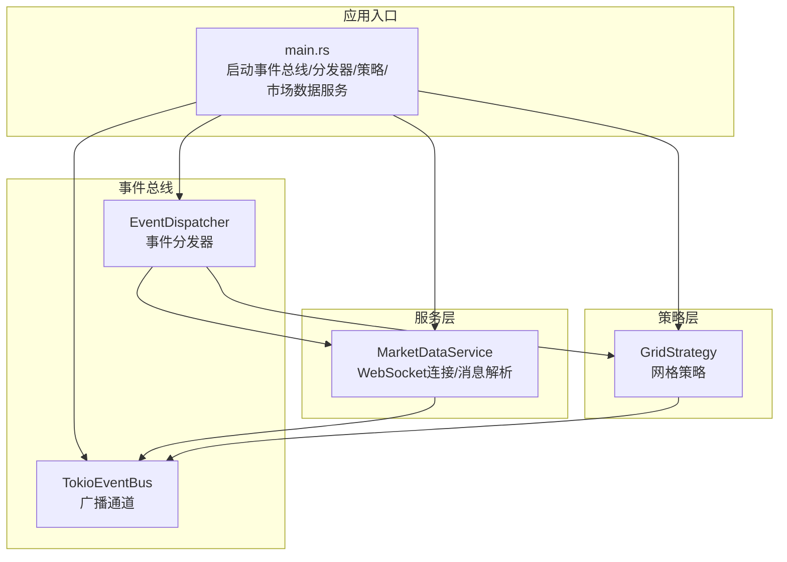
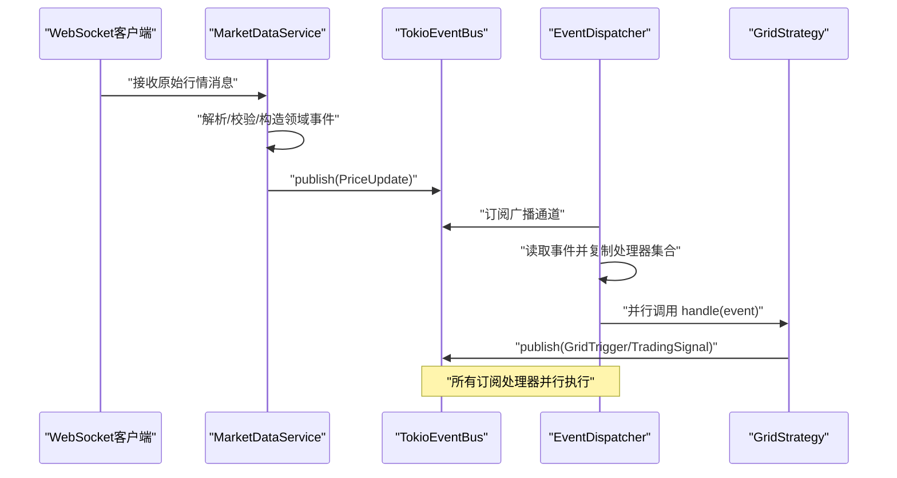
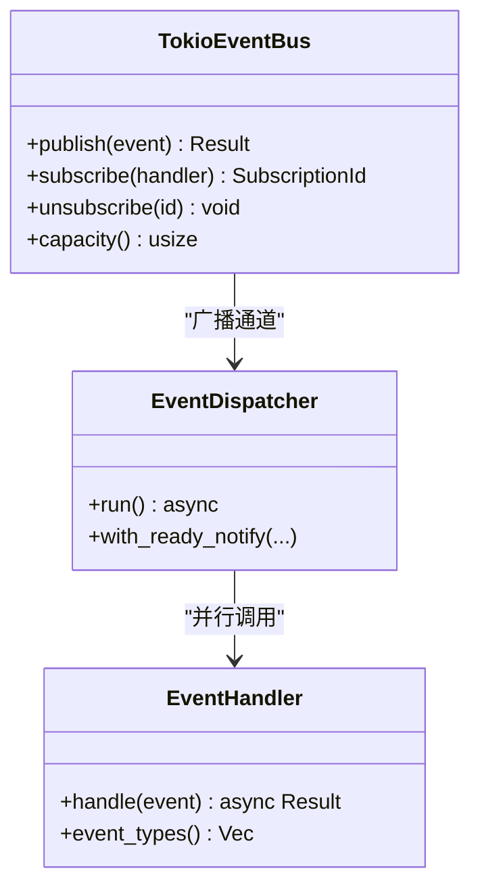
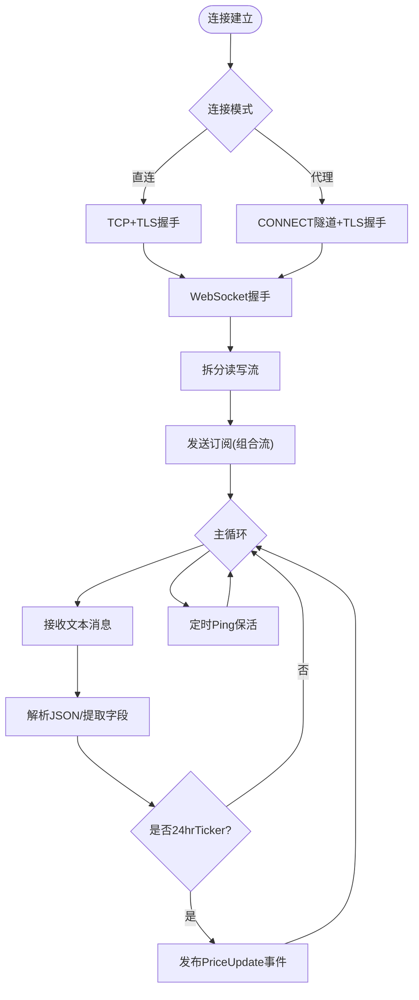
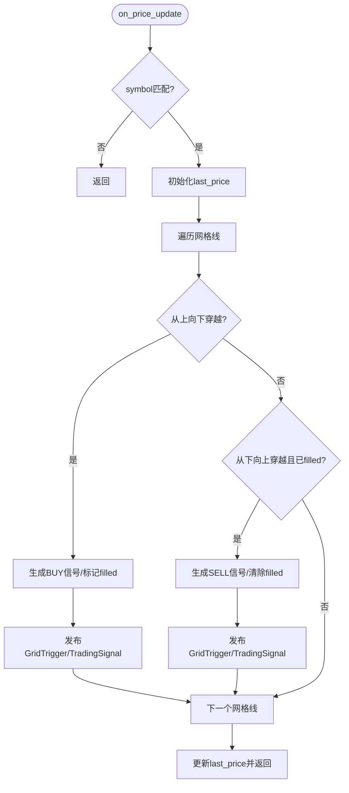
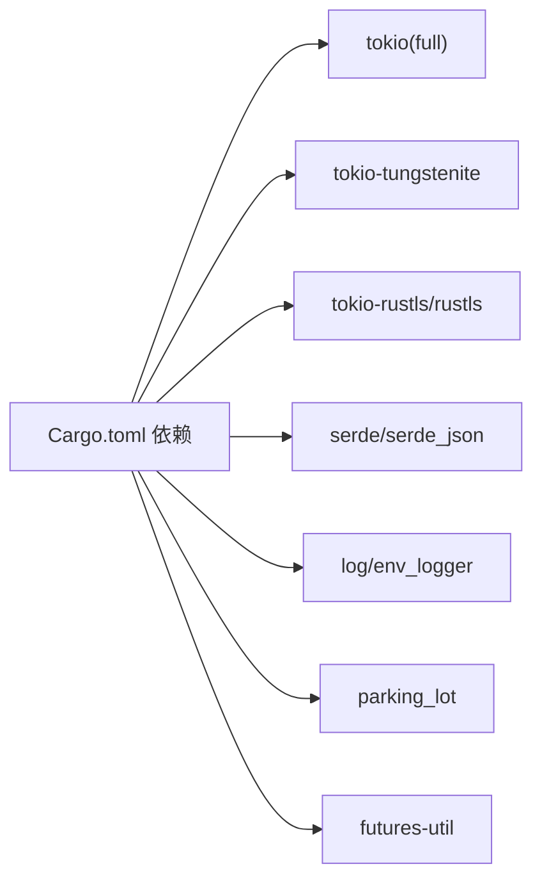

# 性能优化

<cite>
**本文档引用的文件**   
- [event_bus.rs](file://src/event_bus.rs)
- [market_data_service.rs](file://src/services/market_data_service.rs)
- [grid_strategy.rs](file://src/strategies/grid_strategy.rs)
- [main.rs](file://src/main.rs)
- [Cargo.toml](file://Cargo.toml)
- [EVENT_DRIVEN_REFACTOR_GUIDE.md](file://docs/EVENT_DRIVEN_REFACTOR_GUIDE.md)
- [CODE_EXPLANATION.md](file://docs/CODE_EXPLANATION.md)
- [market_events.rs](file://src/events/market_events.rs)
</cite>

## 目录
1. [简介](#简介)
2. [项目结构](#项目结构)
3. [核心组件](#核心组件)
4. [架构总览](#架构总览)
5. [详细组件分析](#详细组件分析)
6. [依赖关系分析](#依赖关系分析)
7. [性能考量与优化建议](#性能考量与优化建议)
8. [故障排查指南](#故障排查指南)
9. [结论](#结论)
10. [附录](#附录)

## 简介
本指南聚焦于Binance Rust事件驱动交易系统的性能优化，围绕事件总线、市场数据服务、网格策略、并发编程、内存管理与性能监控等方面，提供可落地的优化策略与实操建议，并结合现有代码结构进行可视化分析与问题定位。

## 项目结构
系统采用事件驱动架构，主要模块包括：
- 事件总线与分发器：负责事件的发布、订阅与并行分发
- 市场数据服务：通过WebSocket连接Binance，解析行情并发布事件
- 策略层：以网格策略为例，监听价格事件并生成交易信号
- 运行入口：初始化事件总线、分发器、策略与市场数据服务

图表来源
- [main.rs:10-93](file://src/main.rs#L10-L93)
- [event_bus.rs:61-158](file://src/event_bus.rs#L61-L158)
- [market_data_service.rs:35-114](file://src/services/market_data_service.rs#L35-L114)
- [grid_strategy.rs:159-278](file://src/strategies/grid_strategy.rs#L159-L278)

章节来源
- [main.rs:10-93](file://src/main.rs#L10-L93)
- [event_bus.rs:61-158](file://src/event_bus.rs#L61-L158)
- [market_data_service.rs:35-114](file://src/services/market_data_service.rs#L35-L114)
- [grid_strategy.rs:159-278](file://src/strategies/grid_strategy.rs#L159-L278)

## 核心组件
- 事件总线与分发器
  - 使用广播通道实现一对多事件分发，具备背压与丢弃策略
  - 分发器独立任务，按订阅处理器集合并行调用处理逻辑
- 市场数据服务
  - 支持直连与代理（HTTP CONNECT）两种连接模式
  - 心跳保活与组合流消息解析，发布价格事件
- 网格策略
  - 基于价格穿越网格线生成买卖信号，发布网格触发与交易信号事件

章节来源
- [event_bus.rs:61-158](file://src/event_bus.rs#L61-L158)
- [market_data_service.rs:35-114](file://src/services/market_data_service.rs#L35-L114)
- [grid_strategy.rs:159-278](file://src/strategies/grid_strategy.rs#L159-L278)

## 架构总览
事件驱动流程：市场数据服务接收WebSocket消息，解析为领域事件并发布；事件分发器并行分发至各订阅处理器（如网格策略），处理器生成新的领域事件并再次发布，形成闭环。

图表来源
- [market_data_service.rs:377-407](file://src/services/market_data_service.rs#L377-L407)
- [event_bus.rs:89-157](file://src/event_bus.rs#L89-L157)
- [grid_strategy.rs:264-278](file://src/strategies/grid_strategy.rs#L264-L278)

## 详细组件分析

### 事件总线与分发器
- 设计要点
  - 广播通道：一对多高效分发，具备容量与丢弃策略
  - 处理器注册：基于Arc共享与RwLock保护的哈希表
  - 并行分发：读取处理器快照后并行执行，join_all聚合结果
- 性能关注点
  - 处理器集合读取与克隆的成本
  - join_all阻塞等待全部完成，若处理器耗时差异大，存在“木桶效应”
  - 广播通道容量与订阅者消费速度需匹配，避免频繁丢弃
- 优化建议
  - 为高频处理器设置细粒度过滤（event_types），减少无关处理
  - 控制处理器数量与单次分发的并行度，避免过度并发导致上下文切换开销
  - 对慢处理器单独异步化或限速，避免阻塞其他处理器

图表来源
- [event_bus.rs:19-39](file://src/event_bus.rs#L19-L39)
- [event_bus.rs:61-110](file://src/event_bus.rs#L61-L110)
- [event_bus.rs:112-158](file://src/event_bus.rs#L112-L158)

章节来源
- [event_bus.rs:61-158](file://src/event_bus.rs#L61-L158)
- [CODE_EXPLANATION.md:157-219](file://docs/CODE_EXPLANATION.md#L157-L219)

### 市场数据服务
- 设计要点
  - 连接模式：Auto/Direct/Proxy，支持SSH隧道与HTTP CONNECT代理
  - 心跳保活：定时Ping维持连接
  - 消息解析：组合流与单流兼容，仅处理24hrTicker
- 性能关注点
  - JSON反序列化与字段提取的CPU开销
  - 单任务处理读写与心跳，存在I/O与CPU竞争
  - 大量ticker消息到达时，事件总线压力增大
- 优化建议
  - 使用更轻量的解析路径（字段选择性解析）
  - 将心跳与消息处理拆分为独立任务，避免相互阻塞
  - 采用连接池（多路复用）或按交易对拆分订阅，降低单通道压力
  - 对解析失败与异常消息快速丢弃，减少无效处理

图表来源
- [market_data_service.rs:117-178](file://src/services/market_data_service.rs#L117-L178)
- [market_data_service.rs:304-374](file://src/services/market_data_service.rs#L304-L374)
- [market_data_service.rs:377-407](file://src/services/market_data_service.rs#L377-L407)

章节来源
- [market_data_service.rs:35-114](file://src/services/market_data_service.rs#L35-L114)
- [market_data_service.rs:117-178](file://src/services/market_data_service.rs#L117-L178)
- [market_data_service.rs:304-374](file://src/services/market_data_service.rs#L304-L374)
- [market_data_service.rs:377-407](file://src/services/market_data_service.rs#L377-L407)

### 网格策略
- 设计要点
  - 预生成网格线，基于上次价格与当前价格判断穿越方向
  - 生成买卖信号并发布网格触发与交易信号事件
- 性能关注点
  - 网格线遍历为O(N)，N为网格数量；当网格数较大时，遍历成本上升
  - 每次价格更新需锁定状态，存在互斥开销
  - 事件发布链路二次分发，增加总延迟
- 优化建议
  - 价格穿越检测改为有序结构（如有序数组/二分查找）加速定位网格线
  - 缓存最近穿越的网格索引，减少全量扫描
  - 将状态锁定范围缩小到必要区域，或采用无锁结构
  - 对高频信号进行批量发布或去抖

图表来源
- [grid_strategy.rs:189-252](file://src/strategies/grid_strategy.rs#L189-L252)
- [grid_strategy.rs:102-153](file://src/strategies/grid_strategy.rs#L102-L153)

章节来源
- [grid_strategy.rs:159-278](file://src/strategies/grid_strategy.rs#L159-L278)
- [grid_strategy.rs:102-153](file://src/strategies/grid_strategy.rs#L102-L153)

## 依赖关系分析
- 运行时与并发
  - Tokio全功能特性启用，支持高并发异步IO
  - 广播通道、RwLock、Arc等并发原语广泛使用
- 第三方库
  - WebSocket/TLS：tokio-tungstenite、tokio-rustls、rustls
  - 序列化：serde、serde_json
  - 日志：log、env_logger
  - 并发工具：parking_lot、futures-util

图表来源
- [Cargo.toml:6-24](file://Cargo.toml#L6-L24)

章节来源
- [Cargo.toml:6-24](file://Cargo.toml#L6-L24)

## 性能考量与优化建议

### 事件总线性能优化
- 广播通道容量与背压
  - 根据峰值吞吐与处理器处理能力设置合理容量，避免频繁丢弃
  - 监控通道积压与丢弃计数，动态调整
- 处理器注册与过滤
  - 使用event_types进行类型过滤，减少无效处理
  - 避免在handle中做昂贵的全局状态访问
- 并行分发策略
  - 控制join_all并发规模，避免过多任务导致调度开销
  - 对慢处理器进行限速或隔离执行

章节来源
- [event_bus.rs:89-157](file://src/event_bus.rs#L89-L157)
- [CODE_EXPLANATION.md:157-219](file://docs/CODE_EXPLANATION.md#L157-L219)

### 市场数据服务性能优化
- 连接与网络
  - 优先直连（Direct）以减少代理链路延迟
  - 代理模式下确保CONNECT隧道稳定，避免握手失败重试
- 消息解析与发布
  - 仅解析必要字段，避免全量JSON反序列化
  - 对非ticker消息快速过滤，减少后续处理
  - 将心跳与消息处理解耦为独立任务
- 连接池与订阅策略
  - 多交易对订阅时考虑拆分流或连接池，降低单通道拥塞
  - 评估组合流与独立流的吞吐差异

章节来源
- [market_data_service.rs:117-178](file://src/services/market_data_service.rs#L117-L178)
- [market_data_service.rs:304-374](file://src/services/market_data_service.rs#L304-L374)
- [market_data_service.rs:377-407](file://src/services/market_data_service.rs#L377-L407)

### 网格策略性能优化
- 价格穿越检测
  - 从O(N)线性扫描优化为有序结构+二分查找，降低复杂度
  - 缓存最近穿越网格索引，减少重复扫描
- 状态与并发
  - 缩小锁粒度，或采用无锁结构存储网格线状态
  - 对高频信号进行批量发布与去抖
- 事件链路
  - 减少二次事件发布频率，或合并信号批次

章节来源
- [grid_strategy.rs:102-153](file://src/strategies/grid_strategy.rs#L102-L153)
- [grid_strategy.rs:189-252](file://src/strategies/grid_strategy.rs#L189-L252)

### 并发编程最佳实践
- Tokio运行时
  - 使用full特性启用所有功能；根据CPU核心数设置合适的线程数
- 任务调度
  - 将I/O密集与CPU密集任务分离，避免相互抢占
  - 使用有限并发池控制热点处理器的并发度
- 资源竞争
  - 使用RwLock进行读多写少场景；对写操作进行批量化
  - 避免在事件处理中进行长时间阻塞操作

章节来源
- [Cargo.toml:7](file://Cargo.toml#L7)
- [event_bus.rs:137-156](file://src/event_bus.rs#L137-L156)

### 内存管理优化
- Arc与共享数据
  - 对跨任务共享的数据使用Arc，避免不必要的Clone
- 数据结构选择
  - 优先使用紧凑结构体，减少字段数量与嵌套层级
  - 对频繁创建的对象考虑对象池或复用策略
- 序列化优化
  - 评估二进制格式（如MessagePack）以降低序列化开销
  - 压缩大字段或移除冗余字段

章节来源
- [EVENT_DRIVEN_REFACTOR_GUIDE.md:1124-1138](file://docs/EVENT_DRIVEN_REFACTOR_GUIDE.md#L1124-L1138)
- [market_events.rs:7-56](file://src/events/market_events.rs#L7-L56)

### 性能监控与分析
- 指标体系
  - 事件延迟（P99）、吞吐量（TPS）、内存占用（RSS）、CPU使用率
- 工具与方法
  - 使用火焰图定位热点函数
  - 通过日志与指标埋点观测事件总线积压与丢弃情况
  - 对慢处理器进行采样分析

章节来源
- [EVENT_DRIVEN_REFACTOR_GUIDE.md:1139-1147](file://docs/EVENT_DRIVEN_REFACTOR_GUIDE.md#L1139-L1147)

### 实际测试与优化效果对比（示例思路）
- 基准场景
  - 多交易对订阅、高频率ticker推送、多策略并行
- 指标对比
  - 优化前：事件延迟较高、吞吐波动大、CPU占用偏高
  - 优化后：延迟显著下降、吞吐稳定提升、CPU占用降低
- 可视化
  - 用折线图展示延迟与吞吐随优化步骤的变化趋势

章节来源
- [EVENT_DRIVEN_REFACTOR_GUIDE.md:1139-1147](file://docs/EVENT_DRIVEN_REFACTOR_GUIDE.md#L1139-L1147)

## 故障排查指南
- 事件总线
  - 发布失败：检查广播通道是否仍在运行，订阅者是否过早退出
  - 处理器未触发：确认event_types过滤是否正确，订阅ID是否有效
- 市场数据服务
  - 连接失败：检查代理配置、TLS握手参数与网络连通性
  - 消息解析错误：确认消息格式与字段是否存在
- 网格策略
  - 信号缺失：检查last_price初始化与穿越条件
  - 重复信号：确认网格线filled状态更新逻辑

章节来源
- [event_bus.rs:89-110](file://src/event_bus.rs#L89-L110)
- [market_data_service.rs:117-178](file://src/services/market_data_service.rs#L117-L178)
- [grid_strategy.rs:189-252](file://src/strategies/grid_strategy.rs#L189-L252)

## 结论
通过在事件总线、市场数据服务与网格策略三个层面实施针对性优化，结合并发与内存管理的最佳实践，可在保证系统稳定性的同时显著提升吞吐与降低延迟。建议以指标为导向持续迭代，并在生产环境中配合监控与剖析工具进行长期观测与调优。

## 附录
- 术语
  - 广播通道：一对多事件分发通道，具备容量与丢弃策略
  - 事件类型过滤：通过event_types减少无效处理
  - 心跳保活：定期Ping维持WebSocket连接
- 参考文档
  - 重构指南与性能目标参考：[EVENT_DRIVEN_REFACTOR_GUIDE.md](file://docs/EVENT_DRIVEN_REFACTOR_GUIDE.md)