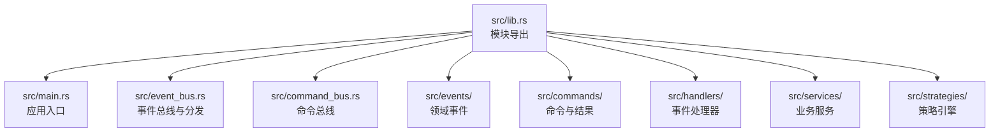
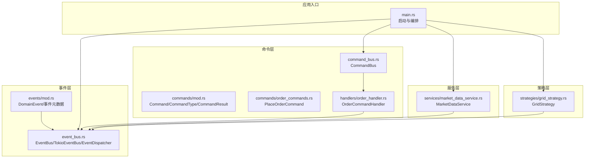
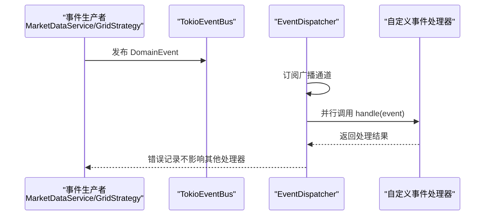
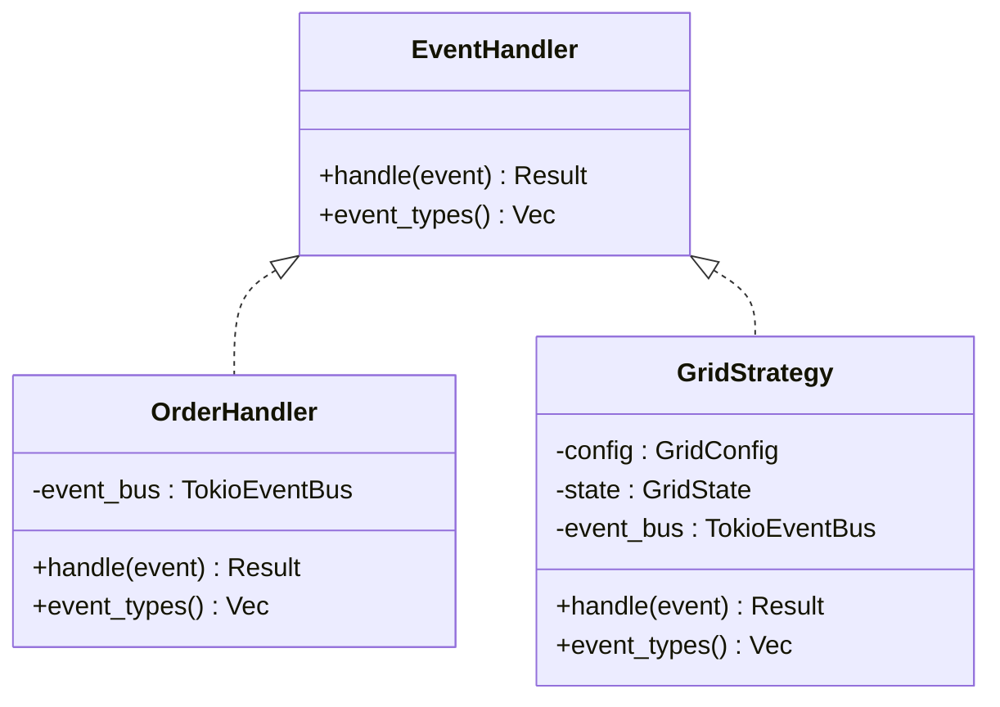
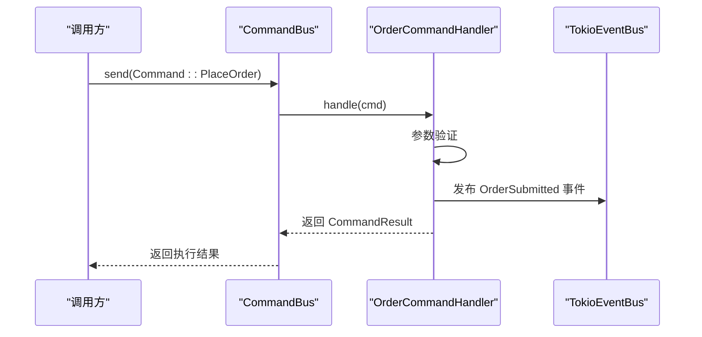
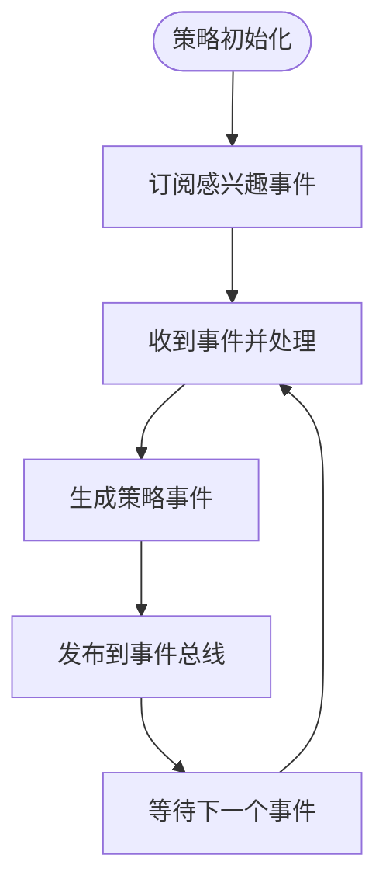
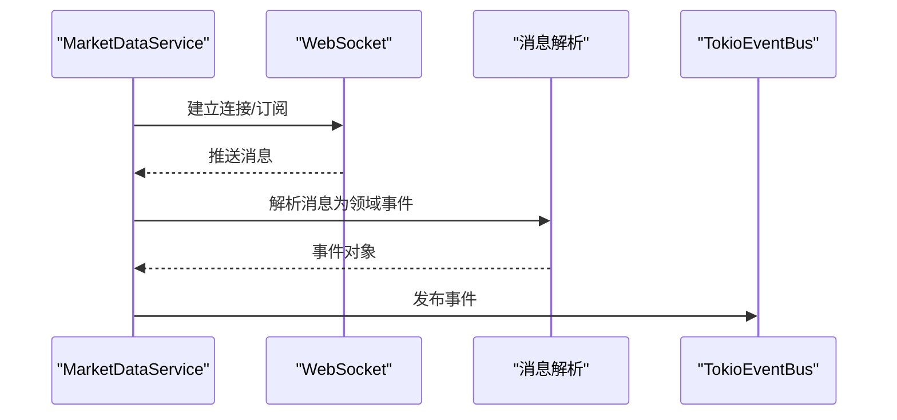
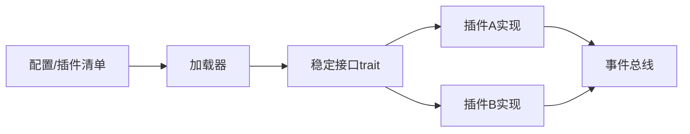
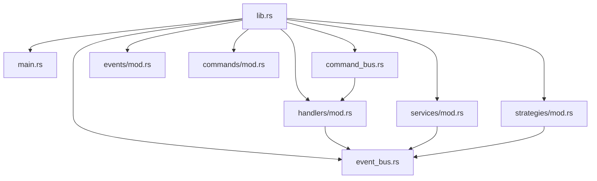

# 扩展开发

<cite>
**本文引用的文件**
- [src/lib.rs](file://src/lib.rs)
- [src/main.rs](file://src/main.rs)
- [src/event_bus.rs](file://src/event_bus.rs)
- [src/command_bus.rs](file://src/command_bus.rs)
- [src/events/mod.rs](file://src/events/mod.rs)
- [src/commands/mod.rs](file://src/commands/mod.rs)
- [src/commands/order_commands.rs](file://src/commands/order_commands.rs)
- [src/handlers/mod.rs](file://src/handlers/mod.rs)
- [src/handlers/order_handler.rs](file://src/handlers/order_handler.rs)
- [src/services/mod.rs](file://src/services/mod.rs)
- [src/services/market_data_service.rs](file://src/services/market_data_service.rs)
- [src/strategies/mod.rs](file://src/strategies/mod.rs)
- [src/strategies/grid_strategy.rs](file://src/strategies/grid_strategy.rs)
- [docs/CODE_EXPLANATION.md](file://docs/CODE_EXPLANATION.md)
</cite>

## 目录
1. [简介](#简介)
2. [项目结构](#项目结构)
3. [核心组件](#核心组件)
4. [架构总览](#架构总览)
5. [详细组件分析](#详细组件分析)
6. [依赖关系分析](#依赖关系分析)
7. [性能考量](#性能考量)
8. [故障排查指南](#故障排查指南)
9. [结论](#结论)
10. [附录](#附录)

## 简介
本指南面向希望在现有事件驱动架构基础上扩展功能的开发者，覆盖以下主题：
- 添加新的事件类型：事件定义、事件类型枚举扩展与事件处理器实现
- 自定义事件处理器：实现 EventHandler trait、事件过滤机制与异步处理模式
- 新业务服务的开发：服务接口设计、依赖注入与生命周期管理
- 命令系统的扩展：新命令类型的定义、命令处理器实现与命令验证机制
- 策略引擎的扩展：新策略类型实现、策略配置管理与策略间协调机制
- 插件系统的开发：动态加载机制、插件接口设计与版本兼容性管理
- 实际扩展示例：基于仓库中的开发指南，给出从简单到复杂的扩展步骤
- 最佳实践与常见陷阱：避免耦合、提升性能与稳定性

## 项目结构
项目采用模块化组织，核心围绕事件总线、命令总线、策略与服务展开。顶层模块导出各子模块，便于统一引入。

**图表来源**
- [src/lib.rs:1-9](file://src/lib.rs#L1-L9)
- [src/main.rs:1-93](file://src/main.rs#L1-L93)

**章节来源**
- [src/lib.rs:1-9](file://src/lib.rs#L1-L9)
- [src/main.rs:1-93](file://src/main.rs#L1-L93)

## 核心组件
- 事件总线与分发：提供 EventBus trait、TokioEventBus 实现与 EventDispatcher 并行分发
- 命令总线：集中路由命令到对应处理器，并返回标准化结果
- 领域事件：统一的 DomainEvent 枚举及事件元数据
- 业务服务：市场数据服务（WebSocket 实时行情）、未来可扩展订单执行、风控等
- 策略引擎：网格策略监听价格事件并生成交易信号
- 错误与基础设施：统一错误类型与日志

**章节来源**
- [src/event_bus.rs:18-39](file://src/event_bus.rs#L18-L39)
- [src/event_bus.rs:62-110](file://src/event_bus.rs#L62-L110)
- [src/event_bus.rs:112-158](file://src/event_bus.rs#L112-L158)
- [src/command_bus.rs:1-19](file://src/command_bus.rs#L1-L19)
- [src/events/mod.rs:48-89](file://src/events/mod.rs#L48-L89)
- [src/services/market_data_service.rs:34-42](file://src/services/market_data_service.rs#L34-L42)
- [src/strategies/grid_strategy.rs:156-278](file://src/strategies/grid_strategy.rs#L156-L278)

## 架构总览
系统采用事件驱动架构，事件通过事件总线广播，处理器并行消费；命令通过命令总线路由至处理器，处理器发布领域事件推动后续流程。

**图表来源**
- [src/main.rs:10-93](file://src/main.rs#L10-L93)
- [src/event_bus.rs:18-158](file://src/event_bus.rs#L18-L158)
- [src/command_bus.rs:5-19](file://src/command_bus.rs#L5-L19)
- [src/commands/mod.rs:6-42](file://src/commands/mod.rs#L6-L42)
- [src/commands/order_commands.rs:36-72](file://src/commands/order_commands.rs#L36-L72)
- [src/handlers/order_handler.rs:93-137](file://src/handlers/order_handler.rs#L93-L137)
- [src/services/market_data_service.rs:34-42](file://src/services/market_data_service.rs#L34-L42)
- [src/strategies/grid_strategy.rs:156-278](file://src/strategies/grid_strategy.rs#L156-L278)

## 详细组件分析

### 事件系统扩展：新增事件类型与处理器
- 新增领域事件
  - 在事件模块中添加事件数据结构与 DomainEvent 成员
  - 在事件类型枚举中增加对应类型
  - 更新事件类型提取函数映射
- 实现事件处理器
  - 实现 EventHandler trait，handle 方法中匹配新事件类型
  - 在 event_types 中声明感兴趣事件，用于过滤
  - 在 main 或服务初始化时注册处理器
- 示例参考
  - 新增事件与类型扩展的步骤与示例参见开发指南

**图表来源**
- [src/event_bus.rs:88-158](file://src/event_bus.rs#L88-L158)

**章节来源**
- [src/events/mod.rs:48-89](file://src/events/mod.rs#L48-L89)
- [src/event_bus.rs:41-59](file://src/event_bus.rs#L41-L59)
- [src/event_bus.rs:162-181](file://src/event_bus.rs#L162-L181)
- [docs/CODE_EXPLANATION.md:703-725](file://docs/CODE_EXPLANATION.md#L703-L725)

### 自定义事件处理器：实现与过滤
- 实现 EventHandler
  - handle：按需匹配事件类型并处理
  - event_types：返回感兴趣的 EventType 列表，用于过滤
- 异步处理模式
  - EventDispatcher 并行调用所有处理器，单个失败不影响其他
- 依赖注入
  - 处理器通常持有事件总线引用，用于发布后续事件

**图表来源**
- [src/event_bus.rs:31-39](file://src/event_bus.rs#L31-L39)
- [src/handlers/order_handler.rs:68-91](file://src/handlers/order_handler.rs#L68-L91)
- [src/strategies/grid_strategy.rs:264-278](file://src/strategies/grid_strategy.rs#L264-L278)

**章节来源**
- [src/event_bus.rs:31-39](file://src/event_bus.rs#L31-L39)
- [src/handlers/order_handler.rs:68-91](file://src/handlers/order_handler.rs#L68-L91)
- [src/strategies/grid_strategy.rs:264-278](file://src/strategies/grid_strategy.rs#L264-L278)

### 命令系统扩展：新增命令与处理器
- 定义命令
  - 在命令模块中新增命令枚举成员与数据结构
  - 扩展 CommandType 与 CommandResult
- 命令处理器
  - 在命令总线中新增分支，路由到新处理器
  - 处理器内部进行参数校验、调用下游服务、发布领域事件
- 命令验证
  - 在处理器中对输入进行合法性检查，返回标准化结果

**图表来源**
- [src/command_bus.rs:8-19](file://src/command_bus.rs#L8-L19)
- [src/handlers/order_handler.rs:93-137](file://src/handlers/order_handler.rs#L93-L137)
- [src/commands/order_commands.rs:36-72](file://src/commands/order_commands.rs#L36-L72)

**章节来源**
- [src/commands/mod.rs:6-42](file://src/commands/mod.rs#L6-L42)
- [src/command_bus.rs:8-19](file://src/command_bus.rs#L8-L19)
- [src/handlers/order_handler.rs:93-137](file://src/handlers/order_handler.rs#L93-L137)
- [src/commands/order_commands.rs:36-72](file://src/commands/order_commands.rs#L36-L72)

### 策略引擎扩展：新增策略与协调
- 新策略实现
  - 实现 EventHandler，订阅所需事件，生成策略事件并发布
  - 在 main 中注册策略实例
- 配置管理
  - 通过配置对象管理策略参数，如网格策略的区间、数量、数量等
- 策略间协调
  - 通过事件总线解耦策略间交互，避免直接耦合

**图表来源**
- [src/strategies/grid_strategy.rs:156-278](file://src/strategies/grid_strategy.rs#L156-L278)

**章节来源**
- [src/strategies/grid_strategy.rs:156-278](file://src/strategies/grid_strategy.rs#L156-L278)
- [docs/CODE_EXPLANATION.md:669-702](file://docs/CODE_EXPLANATION.md#L669-L702)

### 业务服务扩展：市场数据服务的扩展思路
- 接入新数据源
  - 仿照 MarketDataService 的模式，封装连接、解析与事件发布
- 生命周期管理
  - 提供 start/stop/重连等生命周期方法
- 依赖注入
  - 通过构造函数注入事件总线与配置

**图表来源**
- [src/services/market_data_service.rs:96-114](file://src/services/market_data_service.rs#L96-L114)
- [src/services/market_data_service.rs:303-374](file://src/services/market_data_service.rs#L303-L374)
- [src/services/market_data_service.rs:376-407](file://src/services/market_data_service.rs#L376-L407)

**章节来源**
- [src/services/market_data_service.rs:34-42](file://src/services/market_data_service.rs#L34-L42)
- [src/services/market_data_service.rs:96-114](file://src/services/market_data_service.rs#L96-L114)
- [src/services/market_data_service.rs:303-374](file://src/services/market_data_service.rs#L303-L374)
- [src/services/market_data_service.rs:376-407](file://src/services/market_data_service.rs#L376-L407)

### 插件系统开发：动态加载与版本兼容
- 动态加载机制
  - 通过模块导出与统一入口（lib.rs）聚合能力
  - 在运行时根据配置选择启用的模块
- 插件接口设计
  - 以 trait（如 EventHandler）定义稳定的接口契约
- 版本兼容性管理
  - 事件元数据包含版本字段，便于演进与回放

[本图为概念性示意，不直接映射具体文件，故不提供图表来源]

## 依赖关系分析
- 模块导出与依赖
  - lib.rs 将各模块导出，main 通过统一入口使用
- 事件与处理器
  - 事件总线持有处理器集合，分发器并发调用
- 命令与事件
  - 命令处理器发布领域事件，推动后续处理
- 服务与事件
  - 市场数据服务解析消息并发布事件

**图表来源**
- [src/lib.rs:1-9](file://src/lib.rs#L1-L9)
- [src/main.rs:1-9](file://src/main.rs#L1-L9)
- [src/command_bus.rs:1-7](file://src/command_bus.rs#L1-L7)
- [src/handlers/mod.rs:1-3](file://src/handlers/mod.rs#L1-L3)
- [src/services/mod.rs:1-12](file://src/services/mod.rs#L1-L12)
- [src/strategies/mod.rs:1-8](file://src/strategies/mod.rs#L1-L8)

**章节来源**
- [src/lib.rs:1-9](file://src/lib.rs#L1-L9)
- [src/main.rs:1-9](file://src/main.rs#L1-L9)

## 性能考量
- 并行分发：事件分发器对所有处理器并行调用，提升吞吐
- 背压与容量：广播通道具备背压，避免过载
- 异步与零拷贝：事件引用传递，避免大对象克隆
- 连接与重连：服务侧提供自动重连与心跳，保证稳定性

[本节为通用建议，不直接分析具体文件，故不提供章节来源]

## 故障排查指南
- 事件未到达处理器
  - 检查处理器是否正确注册与订阅
  - 确认 event_types 过滤是否包含目标事件
- 事件处理失败
  - 查看分发器错误日志，单个处理器失败不影响其他
- 命令执行异常
  - 检查命令参数校验与事件发布是否成功
- 服务连接问题
  - 检查代理配置、超时设置与心跳机制

**章节来源**
- [src/event_bus.rs:129-158](file://src/event_bus.rs#L129-L158)
- [src/handlers/order_handler.rs:102-135](file://src/handlers/order_handler.rs#L102-L135)
- [src/services/market_data_service.rs:116-178](file://src/services/market_data_service.rs#L116-L178)

## 结论
通过事件驱动架构，系统实现了高内聚、低耦合的扩展能力。新增事件、命令、策略与服务均遵循统一的契约与流程，便于维护与演进。建议在扩展时严格遵守接口契约、做好事件过滤与错误隔离，并结合配置管理与生命周期控制，确保系统稳定与可运维。

[本节为总结性内容，不直接分析具体文件，故不提供章节来源]

## 附录

### 扩展示例：从简单到复杂
- 简单事件与处理器
  - 在事件模块新增事件数据结构与 DomainEvent 成员
  - 在事件类型枚举中添加对应类型
  - 实现 EventHandler 并在 main 中注册
- 命令扩展
  - 在命令模块新增命令与结果类型
  - 在命令总线中新增分支路由
  - 在处理器中实现参数校验与事件发布
- 策略扩展
  - 实现 EventHandler，订阅所需事件并生成策略事件
  - 在 main 中注册策略实例
- 服务扩展
  - 参考 MarketDataService 的模式，封装连接、解析与事件发布
  - 提供生命周期方法与配置项

**章节来源**
- [docs/CODE_EXPLANATION.md:669-762](file://docs/CODE_EXPLANATION.md#L669-L762)