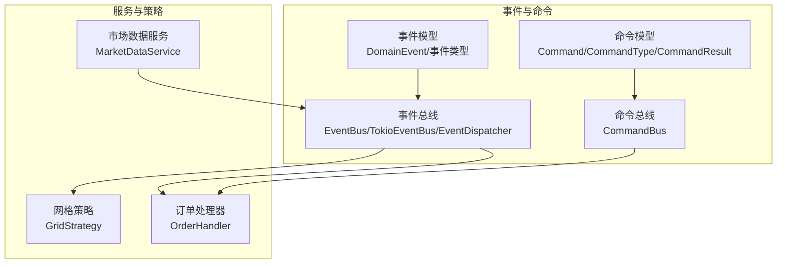
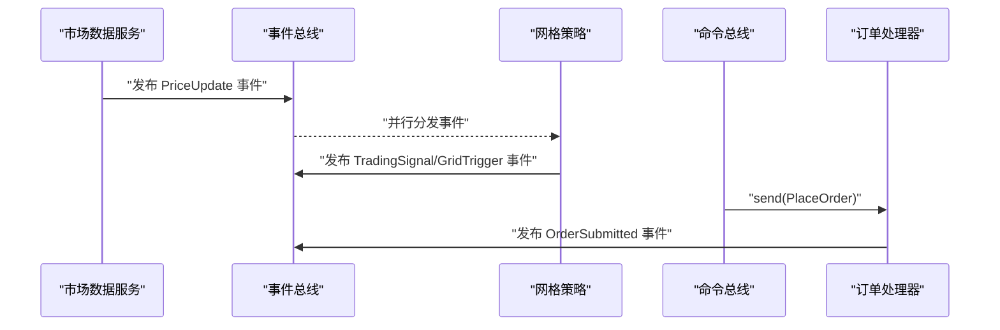
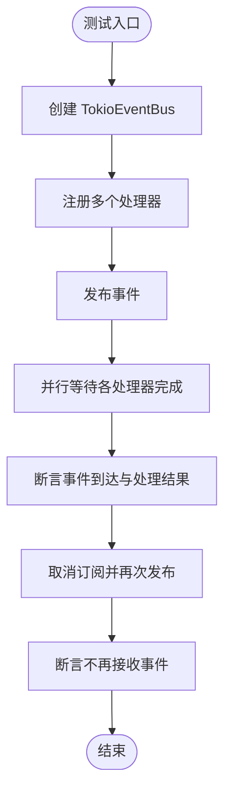
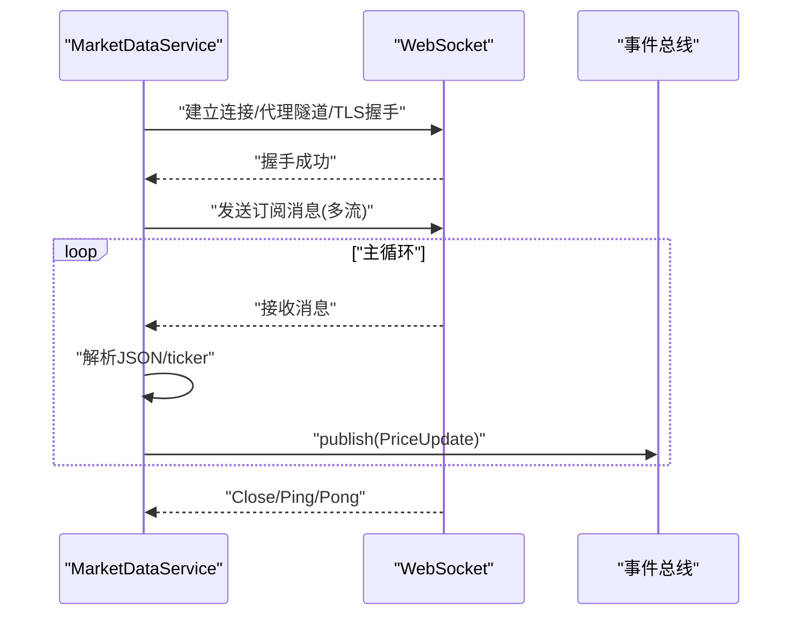
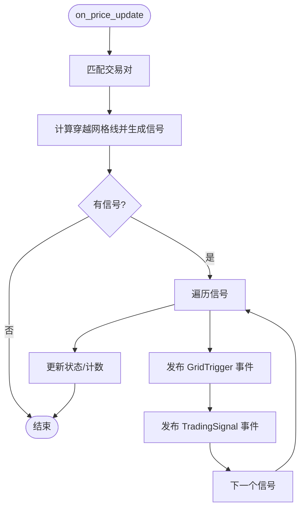
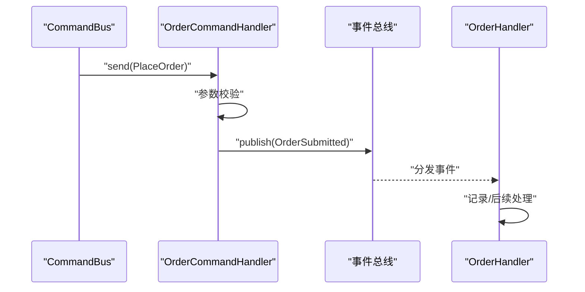
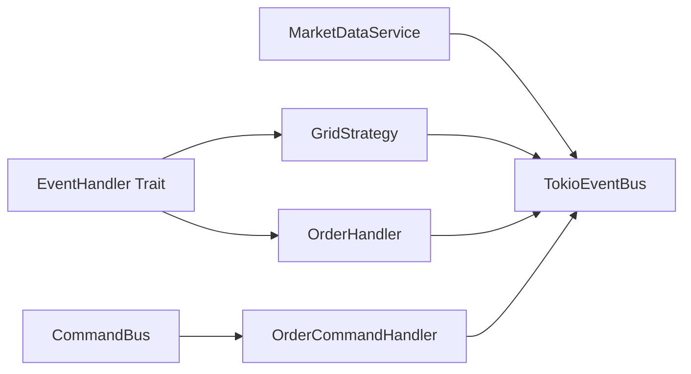

# 测试策略

<cite>
**本文引用的文件**
- [src/lib.rs](file://src/lib.rs)
- [src/event_bus.rs](file://src/event_bus.rs)
- [src/command_bus.rs](file://src/command_bus.rs)
- [src/services/market_data_service.rs](file://src/services/market_data_service.rs)
- [src/strategies/grid_strategy.rs](file://src/strategies/grid_strategy.rs)
- [src/events/mod.rs](file://src/events/mod.rs)
- [src/events/market_events.rs](file://src/events/market_events.rs)
- [src/events/trading_events.rs](file://src/events/trading_events.rs)
- [src/events/strategy_events.rs](file://src/events/strategy_events.rs)
- [src/commands/mod.rs](file://src/commands/mod.rs)
- [src/commands/order_commands.rs](file://src/commands/order_commands.rs)
- [src/handlers/order_handler.rs](file://src/handlers/order_handler.rs)
- [src/error.rs](file://src/error.rs)
- [Cargo.toml](file://Cargo.toml)
</cite>

## 目录
1. [引言](#引言)
2. [项目结构](#项目结构)
3. [核心组件](#核心组件)
4. [架构总览](#架构总览)
5. [详细组件分析](#详细组件分析)
6. [依赖关系分析](#依赖关系分析)
7. [性能考虑](#性能考虑)
8. [故障排查指南](#故障排查指南)
9. [结论](#结论)
10. [附录](#附录)

## 引言
本测试策略面向Binance Rust事件驱动交易系统，旨在确保系统在高并发、异步事件驱动场景下的质量与稳定性。文档覆盖单元测试、集成测试、性能测试、测试数据准备、测试环境配置以及持续集成建议，帮助团队建立完善的测试体系。

## 项目结构
系统采用模块化设计，围绕事件总线、命令总线、事件与命令模型、策略与服务进行组织。核心模块包括：
- 事件与事件总线：事件定义、事件总线接口与实现、事件分发器
- 命令与命令总线：命令定义、命令处理器、命令总线路由
- 市场数据服务：WebSocket连接、消息解析、事件发布
- 策略：网格策略，监听价格事件并生成交易信号
- 处理器：订单事件处理器，消费订单相关事件
- 错误模型：统一错误类型与错误传播

**图表来源**
- [src/event_bus.rs:1-257](file://src/event_bus.rs#L1-L257)
- [src/command_bus.rs:1-19](file://src/command_bus.rs#L1-L19)
- [src/services/market_data_service.rs:1-503](file://src/services/market_data_service.rs#L1-L503)
- [src/strategies/grid_strategy.rs:1-401](file://src/strategies/grid_strategy.rs#L1-L401)
- [src/handlers/order_handler.rs:1-137](file://src/handlers/order_handler.rs#L1-L137)
- [src/events/mod.rs:1-102](file://src/events/mod.rs#L1-L102)
- [src/commands/mod.rs:1-77](file://src/commands/mod.rs#L1-L77)

**章节来源**
- [src/lib.rs:1-9](file://src/lib.rs#L1-L9)
- [Cargo.toml:1-27](file://Cargo.toml#L1-L27)

## 核心组件
- 事件总线与事件分发器：负责事件发布、订阅、并行分发与错误处理
- 市场数据服务：连接Binance WebSocket，解析行情，发布价格更新事件
- 网格策略：监听价格事件，按网格规则生成交易信号与网格触发事件
- 订单处理器：消费订单生命周期事件，记录与后续处理
- 命令总线与命令处理器：接收命令，参数校验，发布订单提交事件
- 事件与命令模型：统一的事件/命令类型与序列化结构
- 错误模型：分层错误类型，便于定位与传播

**章节来源**
- [src/event_bus.rs:1-257](file://src/event_bus.rs#L1-L257)
- [src/services/market_data_service.rs:1-503](file://src/services/market_data_service.rs#L1-L503)
- [src/strategies/grid_strategy.rs:1-401](file://src/strategies/grid_strategy.rs#L1-L401)
- [src/handlers/order_handler.rs:1-137](file://src/handlers/order_handler.rs#L1-L137)
- [src/command_bus.rs:1-19](file://src/command_bus.rs#L1-L19)
- [src/commands/order_commands.rs:1-72](file://src/commands/order_commands.rs#L1-L72)
- [src/events/mod.rs:1-102](file://src/events/mod.rs#L1-L102)
- [src/error.rs:1-169](file://src/error.rs#L1-L169)

## 架构总览
事件驱动的典型流程：市场数据服务解析行情并发布价格事件；事件总线将事件广播给所有订阅者；网格策略作为事件处理器根据价格穿越网格线生成交易信号与网格触发事件；命令总线接收命令，参数校验后发布订单提交事件；订单处理器消费订单事件并记录。

**图表来源**
- [src/services/market_data_service.rs:376-407](file://src/services/market_data_service.rs#L376-L407)
- [src/event_bus.rs:119-157](file://src/event_bus.rs#L119-L157)
- [src/strategies/grid_strategy.rs:189-252](file://src/strategies/grid_strategy.rs#L189-L252)
- [src/command_bus.rs:14-18](file://src/command_bus.rs#L14-L18)
- [src/handlers/order_handler.rs:68-91](file://src/handlers/order_handler.rs#L68-L91)

## 详细组件分析

### 事件总线测试策略
目标：验证事件总线的发布/订阅、并行分发、错误处理与取消订阅行为。
- 发布/订阅：创建多个处理器，验证订阅ID分配、事件到达与处理顺序
- 并行分发：构造多个处理器，验证事件被并行处理且错误不影响其他处理器
- 取消订阅：验证取消订阅后不再接收事件
- 边界条件：空订阅、大量订阅、广播通道容量、错误事件处理

**图表来源**
- [src/event_bus.rs:183-256](file://src/event_bus.rs#L183-L256)

**章节来源**
- [src/event_bus.rs:183-256](file://src/event_bus.rs#L183-L256)

### 市场数据服务测试策略
目标：验证WebSocket连接、代理/直连、消息解析、心跳与事件发布。
- 连接模式：Auto/Direct/Proxy，SSH隧道模式
- 代理连接：CONNECT隧道、代理响应校验、TLS握手
- 直连TLS：服务器名称解析、证书链、握手超时
- 消息解析：单流/组合流、ticker字段校验、JSON解析失败处理
- 心跳与保活：Ping/Pong、定时心跳、连接关闭处理
- 事件发布：PriceUpdate事件发布、错误捕获与日志

**图表来源**
- [src/services/market_data_service.rs:117-178](file://src/services/market_data_service.rs#L117-L178)
- [src/services/market_data_service.rs:303-374](file://src/services/market_data_service.rs#L303-L374)
- [src/services/market_data_service.rs:376-407](file://src/services/market_data_service.rs#L376-L407)

**章节来源**
- [src/services/market_data_service.rs:44-114](file://src/services/market_data_service.rs#L44-L114)
- [src/services/market_data_service.rs:117-178](file://src/services/market_data_service.rs#L117-L178)
- [src/services/market_data_service.rs:303-374](file://src/services/market_data_service.rs#L303-L374)
- [src/services/market_data_service.rs:376-407](file://src/services/market_data_service.rs#L376-L407)
- [src/events/market_events.rs:58-94](file://src/events/market_events.rs#L58-L94)

### 网格策略测试策略
目标：验证网格构建、穿越判断、信号生成、事件发布与状态管理。
- 网格构建：网格数量、间距、价格序列正确性
- 价格穿越：从上方/下方穿越网格线，生成BUY/SELL信号
- 状态管理：已填充网格不重复买入、卖出后清空filled
- 事件发布：GridTrigger与TradingSignal事件内容与数量
- 边界条件：首次价格、相同价格、零间距、利润阈值

**图表来源**
- [src/strategies/grid_strategy.rs:189-252](file://src/strategies/grid_strategy.rs#L189-L252)
- [src/strategies/grid_strategy.rs:102-153](file://src/strategies/grid_strategy.rs#L102-L153)

**章节来源**
- [src/strategies/grid_strategy.rs:280-400](file://src/strategies/grid_strategy.rs#L280-L400)

### 订单命令与处理器测试策略
目标：验证命令参数校验、命令路由、事件发布与处理器消费。
- 命令参数：数量校验、下单类型与方向、客户端订单ID
- 命令路由：CommandBus根据命令类型分发至对应处理器
- 事件发布：OrderSubmitted事件字段完整性与时间戳
- 处理器消费：OrderHandler按事件类型分派处理逻辑

**图表来源**
- [src/command_bus.rs:14-18](file://src/command_bus.rs#L14-L18)
- [src/handlers/order_handler.rs:68-91](file://src/handlers/order_handler.rs#L68-L91)
- [src/handlers/order_handler.rs:102-135](file://src/handlers/order_handler.rs#L102-L135)

**章节来源**
- [src/commands/mod.rs:1-77](file://src/commands/mod.rs#L1-L77)
- [src/commands/order_commands.rs:1-72](file://src/commands/order_commands.rs#L1-L72)
- [src/handlers/order_handler.rs:1-137](file://src/handlers/order_handler.rs#L1-L137)

## 依赖关系分析
- 事件总线依赖：Tokio广播通道、异步任务、原子标志与Notify用于就绪通知
- 市场数据服务依赖：WebSocket、TLS、代理CONNECT、心跳定时器、JSON解析
- 网格策略依赖：事件总线、价格事件、同步锁保护状态
- 命令总线依赖：事件总线、命令处理器
- 错误模型：分层错误类型，便于在各层之间传播与转换

**图表来源**
- [src/event_bus.rs:18-39](file://src/event_bus.rs#L18-L39)
- [src/services/market_data_service.rs:35-42](file://src/services/market_data_service.rs#L35-L42)
- [src/strategies/grid_strategy.rs:159-163](file://src/strategies/grid_strategy.rs#L159-L163)
- [src/handlers/order_handler.rs:16-18](file://src/handlers/order_handler.rs#L16-L18)
- [src/command_bus.rs:5-7](file://src/command_bus.rs#L5-L7)

**章节来源**
- [src/event_bus.rs:1-257](file://src/event_bus.rs#L1-L257)
- [src/services/market_data_service.rs:1-503](file://src/services/market_data_service.rs#L1-L503)
- [src/strategies/grid_strategy.rs:1-401](file://src/strategies/grid_strategy.rs#L1-L401)
- [src/handlers/order_handler.rs:1-137](file://src/handlers/order_handler.rs#L1-L137)
- [src/command_bus.rs:1-19](file://src/command_bus.rs#L1-L19)

## 性能考虑
- 异步与并发
  - 事件总线并行分发：使用JoinAll等待所有处理器完成，注意处理器数量与错误聚合
  - 市场数据服务：心跳Ping/Pong、定时器与WebSocket读写分离，避免阻塞
  - 网格策略：状态锁粒度控制，避免长时间持有互斥锁
- 内存与资源
  - 广播通道容量：合理设置容量，避免发布积压导致丢弃
  - 代理/直连切换：减少不必要的TLS握手与连接重建
  - 事件序列化：避免重复序列化大对象
- 基准测试建议
  - 事件吞吐：构造大量事件，测量发布/订阅延迟与处理器耗时
  - 并发处理器：逐步增加处理器数量，观察延迟与错误率变化
  - 内存占用：监控长时间运行下的堆栈与锁竞争
  - 压力测试：模拟高并发WebSocket消息与命令提交

[本节为通用性能指导，无需具体文件引用]

## 故障排查指南
- 事件总线
  - 发布失败：检查通道容量、订阅者数量、错误类型
  - 处理器异常：验证错误聚合与日志输出
- 市场数据服务
  - 连接失败：检查代理URL、证书链、超时设置
  - 消息解析：验证ticker字段存在性与数值类型
  - 心跳异常：确认Ping/Pong与定时器工作
- 网格策略
  - 信号缺失：检查价格穿越条件、网格状态filled标志
  - 事件未发布：确认事件总线可用与处理器订阅
- 订单命令
  - 参数校验失败：检查数量与下单类型
  - 事件未发布：确认事件总线发布路径与处理器订阅

**章节来源**
- [src/error.rs:85-128](file://src/error.rs#L85-L128)
- [src/services/market_data_service.rs:117-178](file://src/services/market_data_service.rs#L117-L178)
- [src/services/market_data_service.rs:376-407](file://src/services/market_data_service.rs#L376-L407)
- [src/strategies/grid_strategy.rs:189-252](file://src/strategies/grid_strategy.rs#L189-L252)
- [src/handlers/order_handler.rs:102-135](file://src/handlers/order_handler.rs#L102-L135)

## 结论
通过覆盖事件总线、市场数据服务、网格策略、命令与处理器的单元与集成测试，结合性能与故障排查策略，可以有效保障系统的质量与稳定性。建议在CI中引入自动化测试与覆盖率统计，并设置质量门禁以保证每次变更的可靠性。

## 附录

### 测试数据准备
- 模拟事件数据
  - 价格事件：包含symbol、price、24h涨跌幅、timestamp
  - 订单事件：提交/成交/取消/拒绝事件字段
  - 策略事件：交易信号、网格触发、网格状态变更
- 测试用市场数据
  - 单流与组合流格式的ticker JSON
  - 异常场景：缺失字段、非法数值、非ticker消息
- 边界条件
  - 零间距网格、首次价格、相同价格、空订阅、通道满载

**章节来源**
- [src/events/market_events.rs:58-94](file://src/events/market_events.rs#L58-L94)
- [src/events/trading_events.rs:99-136](file://src/events/trading_events.rs#L99-L136)
- [src/events/strategy_events.rs:108-148](file://src/events/strategy_events.rs#L108-L148)
- [src/services/market_data_service.rs:467-502](file://src/services/market_data_service.rs#L467-L502)

### 测试环境配置
- 测试数据库：可选，若涉及持久化可使用内存数据库或测试专用实例
- 模拟服务：WebSocket代理/直连、Binance API模拟器
- 隔离环境：Docker容器或命名空间隔离，避免端口冲突与网络影响
- 日志与指标：开启详细日志，收集事件延迟与错误率

[本节为通用配置建议，无需具体文件引用]

### 持续集成配置建议
- 自动化测试流程
  - 单元测试：cargo test（启用并发与超时）
  - 集成测试：启动模拟服务，验证组件交互
  - 性能回归：基准测试与压力测试
- 覆盖率报告：使用cargo-tarpaulin或类似工具生成覆盖率报告
- 质量门禁
  - 最小覆盖率阈值
  - 关键路径必须通过
  - 性能指标（延迟/吞吐）阈值

**章节来源**
- [Cargo.toml:26-27](file://Cargo.toml#L26-L27)