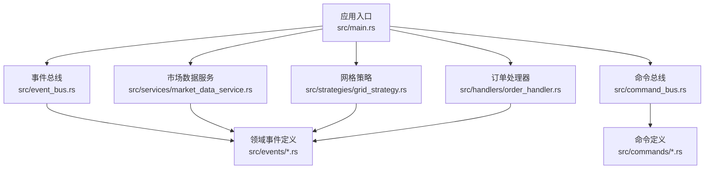
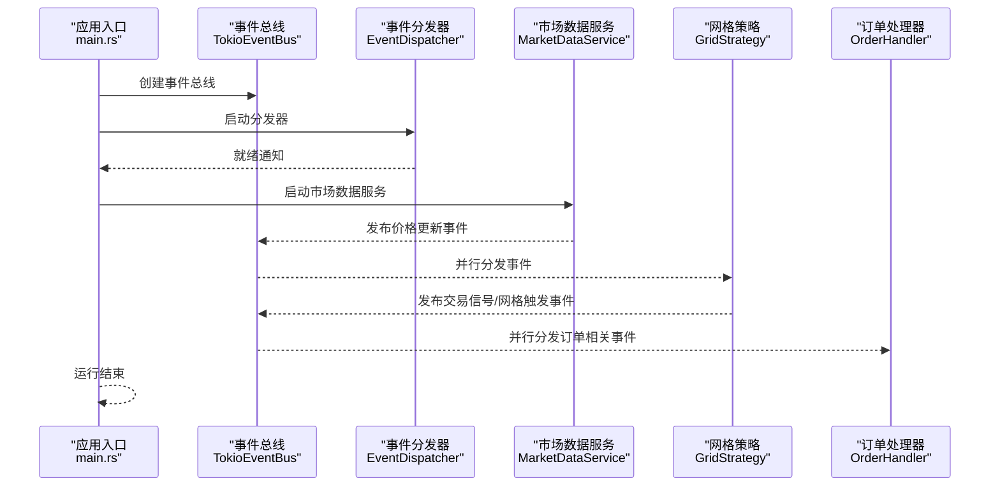
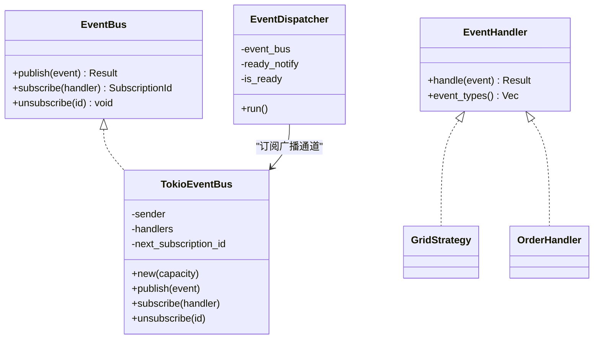
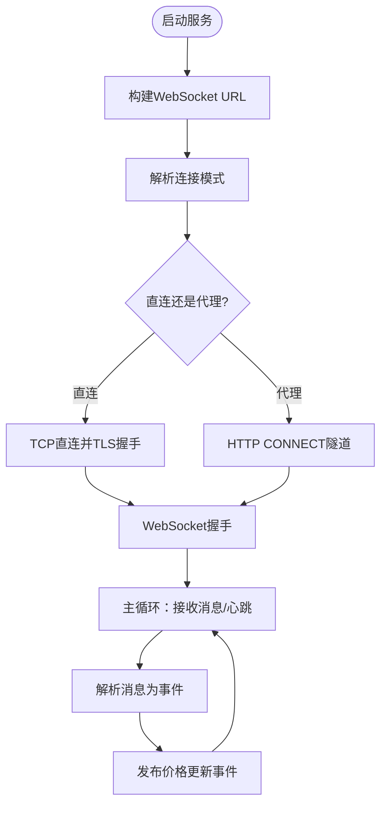
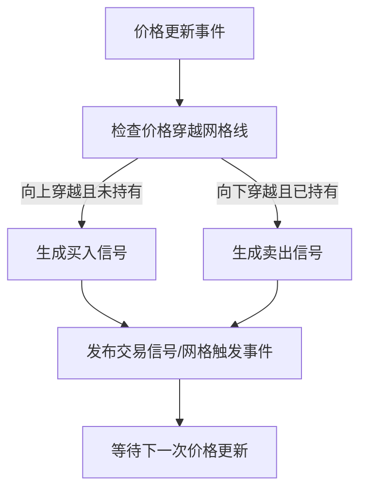
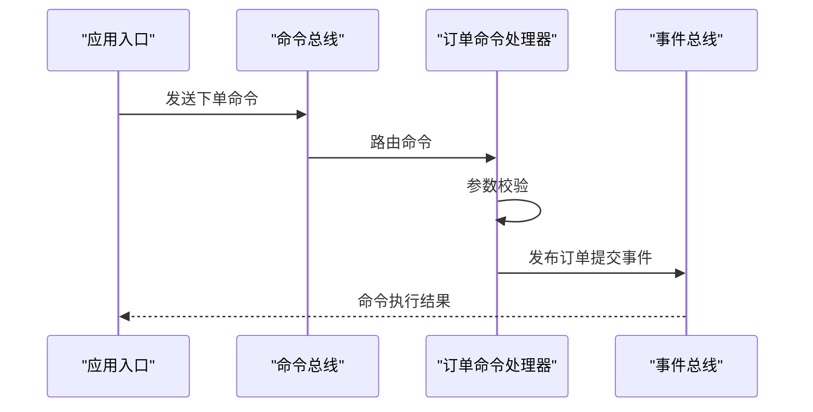
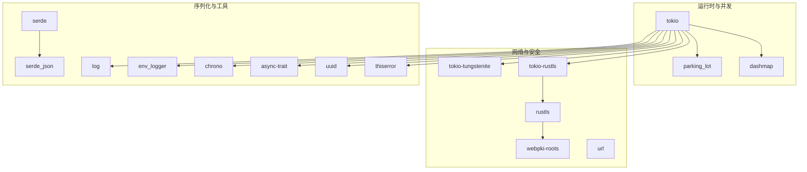

# 快速开始

<cite>
**本文引用的文件**   
- [Cargo.toml](file://Cargo.toml)
- [main.rs](file://src/main.rs)
- [lib.rs](file://src/lib.rs)
- [event_bus.rs](file://src/event_bus.rs)
- [command_bus.rs](file://src/command_bus.rs)
- [market_data_service.rs](file://src/services/market_data_service.rs)
- [grid_strategy.rs](file://src/strategies/grid_strategy.rs)
- [order_handler.rs](file://src/handlers/order_handler.rs)
- [order_commands.rs](file://src/commands/order_commands.rs)
- [market_events.rs](file://src/events/market_events.rs)
- [CODE_EXPLANATION.md](file://docs/CODE_EXPLANATION.md)
</cite>

## 目录
1. [简介](#简介)
2. [项目结构](#项目结构)
3. [核心组件](#核心组件)
4. [架构总览](#架构总览)
5. [详细组件分析](#详细组件分析)
6. [依赖分析](#依赖分析)
7. [性能考虑](#性能考虑)
8. [故障排除指南](#故障排除指南)
9. [结论](#结论)
10. [附录](#附录)

## 简介
本指南面向首次接触 Binance Rust 事件驱动交易系统的开发者，帮助你在约 30 分钟内完成环境搭建、项目编译与运行，并掌握从事件监听到基础网格交易策略的入门实践。你将学会：
- 安装 Rust 工具链与项目依赖
- 克隆与编译项目
- 启动事件总线与市场数据服务
- 注册并运行网格交易策略
- 配置连接模式与代理
- 常见问题排查与优化建议

## 项目结构
该项目采用模块化组织，核心模块包括事件总线、命令总线、市场数据服务、策略引擎、事件与命令定义、以及处理器等。

图表来源
- [main.rs:10-93](file://src/main.rs#L10-L93)
- [lib.rs:1-9](file://src/lib.rs#L1-L9)

章节来源
- [main.rs:10-93](file://src/main.rs#L10-L93)
- [lib.rs:1-9](file://src/lib.rs#L1-L9)

## 核心组件
- 事件总线与分发器：负责事件的发布、订阅与并行分发。
- 命令总线：负责接收命令并路由至相应处理器。
- 市场数据服务：通过 WebSocket 连接 Binance，解析实时行情并发布价格事件。
- 网格策略：监听价格事件，在预设区间内按网格生成交易信号。
- 订单处理器：处理订单生命周期事件（提交、成交、取消、拒绝）。
- 事件与命令：统一的领域事件与命令模型，便于扩展与维护。

章节来源
- [event_bus.rs:18-158](file://src/event_bus.rs#L18-L158)
- [command_bus.rs:5-19](file://src/command_bus.rs#L5-L19)
- [market_data_service.rs:34-114](file://src/services/market_data_service.rs#L34-L114)
- [grid_strategy.rs:156-278](file://src/strategies/grid_strategy.rs#L156-L278)
- [order_handler.rs:9-91](file://src/handlers/order_handler.rs#L9-L91)

## 架构总览
系统采用事件驱动架构，组件之间通过事件总线松耦合协作。WebSocket 实时推送价格数据，事件总线将价格更新分发给订阅者（如网格策略），策略根据规则生成交易信号并再次发布到事件总线，供后续模块消费。

图表来源
- [main.rs:14-61](file://src/main.rs#L14-L61)
- [event_bus.rs:112-158](file://src/event_bus.rs#L112-L158)
- [market_data_service.rs:96-114](file://src/services/market_data_service.rs#L96-L114)
- [grid_strategy.rs:264-278](file://src/strategies/grid_strategy.rs#L264-L278)
- [order_handler.rs:68-91](file://src/handlers/order_handler.rs#L68-L91)

## 详细组件分析

### 事件总线与分发器
- 事件总线提供发布/订阅能力，内部使用广播通道实现一对多分发。
- 事件分发器独立运行，从广播通道接收事件并并行调用所有订阅处理器。
- 支持通过事件类型过滤，提升处理效率。

图表来源
- [event_bus.rs:18-158](file://src/event_bus.rs#L18-L158)
- [grid_strategy.rs:264-278](file://src/strategies/grid_strategy.rs#L264-L278)
- [order_handler.rs:68-91](file://src/handlers/order_handler.rs#L68-L91)

章节来源
- [event_bus.rs:18-158](file://src/event_bus.rs#L18-L158)

### 市场数据服务（WebSocket）
- 支持三种连接模式：自动检测、直连、强制代理。
- 自动重连与心跳保活，解析 Binance ticker 数据并发布价格更新事件。
- 支持单流与组合流订阅，兼容不同订阅规模。

图表来源
- [market_data_service.rs:53-178](file://src/services/market_data_service.rs#L53-L178)
- [market_data_service.rs:303-374](file://src/services/market_data_service.rs#L303-L374)

章节来源
- [market_data_service.rs:23-32](file://src/services/market_data_service.rs#L23-L32)
- [market_data_service.rs:96-114](file://src/services/market_data_service.rs#L96-L114)

### 网格策略
- 在指定价格区间内均匀布置网格，价格穿越网格线时生成买入/卖出信号。
- 通过事件总线发布交易信号与网格触发事件，便于后续风控与执行模块接入。

图表来源
- [grid_strategy.rs:102-154](file://src/strategies/grid_strategy.rs#L102-L154)
- [grid_strategy.rs:264-278](file://src/strategies/grid_strategy.rs#L264-L278)

章节来源
- [grid_strategy.rs:26-81](file://src/strategies/grid_strategy.rs#L26-L81)
- [grid_strategy.rs:156-278](file://src/strategies/grid_strategy.rs#L156-L278)

### 命令总线与下单命令
- 命令总线接收命令并路由到对应处理器。
- 下单命令支持限价/市价/止损/止盈等类型，参数校验后发布订单提交事件。

图表来源
- [command_bus.rs:8-19](file://src/command_bus.rs#L8-L19)
- [order_commands.rs:36-72](file://src/commands/order_commands.rs#L36-L72)
- [order_handler.rs:93-137](file://src/handlers/order_handler.rs#L93-L137)

章节来源
- [command_bus.rs:5-19](file://src/command_bus.rs#L5-L19)
- [order_commands.rs:36-72](file://src/commands/order_commands.rs#L36-L72)
- [order_handler.rs:93-137](file://src/handlers/order_handler.rs#L93-L137)

## 依赖分析
项目使用现代 Rust 生态中的异步与网络库，核心依赖如下：
- 异步运行时与并发：tokio（全功能特性）
- WebSocket 与 TLS：tokio-tungstenite、tokio-rustls、rustls、webpki-roots
- 序列化：serde、serde_json
- 并发容器与同步原语：parking_lot、dashmap
- 日志与错误处理：log、env_logger、thiserror
- 事件与命令模型：自定义 DomainEvent/Command

图表来源
- [Cargo.toml:6-24](file://Cargo.toml#L6-L24)

章节来源
- [Cargo.toml:1-27](file://Cargo.toml#L1-L27)

## 性能考虑
- 事件总线使用广播通道与并行分发，降低事件处理延迟。
- WebSocket 使用心跳与自动重连，保证连接稳定性。
- 策略侧仅在价格穿越网格线时生成信号，避免高频重复处理。
- 建议在生产环境使用直连模式以减少代理带来的额外延迟。

## 故障排除指南
- WebSocket 握手失败或超时
  - 检查网络连通性与防火墙设置。
  - 若使用代理，请确认 HTTPS_PROXY 环境变量正确配置。
  - 参考连接模式与代理隧道实现细节。
  - 章节来源
    - [market_data_service.rs:167-178](file://src/services/market_data_service.rs#L167-L178)
    - [market_data_service.rs:231-301](file://src/services/market_data_service.rs#L231-L301)

- 事件处理失败或分发器未就绪
  - 确认事件分发器已启动并通过就绪通知。
  - 检查订阅处理器是否正确实现事件类型过滤。
  - 章节来源
    - [main.rs:18-22](file://src/main.rs#L18-L22)
    - [event_bus.rs:112-158](file://src/event_bus.rs#L112-L158)

- 命令执行失败
  - 检查命令参数（如数量必须大于 0）。
  - 确认事件总线可正常发布事件。
  - 章节来源
    - [order_handler.rs:102-137](file://src/handlers/order_handler.rs#L102-L137)

- 代理模式但未设置 HTTPS_PROXY
  - 章节来源
    - [market_data_service.rs:149-161](file://src/services/market_data_service.rs#L149-L161)

## 结论
通过本快速开始指南，你已经完成了 Rust 工具链安装、项目编译与运行，理解了事件驱动架构在实时交易系统中的应用，并成功运行了首个网格策略示例。建议在此基础上逐步扩展风控与订单执行模块，完善生产环境配置与监控体系。

## 附录

### 环境搭建与项目编译
- 安装 Rust（稳定版）
  - 使用官方安装器安装最新稳定版 Rust。
- 克隆与编译
  - 克隆仓库后，使用 cargo build 或 cargo run 进行编译与运行。
- 运行示例
  - 直接运行默认示例，观察事件总线、市场数据服务与网格策略的协同工作。

章节来源
- [Cargo.toml:1-27](file://Cargo.toml#L1-L27)
- [main.rs:10-93](file://src/main.rs#L10-L93)

### 配置与参数调整
- 连接模式
  - Auto：自动检测 HTTPS_PROXY 环境变量。
  - Direct：强制直连（推荐服务器环境）。
  - Proxy：强制使用代理（需设置 HTTPS_PROXY）。
- 代理配置
  - 设置 HTTPS_PROXY 环境变量后，服务将通过 HTTP CONNECT 隧道连接目标主机。
- 章节来源
  - [main.rs:65-76](file://src/main.rs#L65-L76)
  - [market_data_service.rs:23-32](file://src/services/market_data_service.rs#L23-L32)
  - [market_data_service.rs:142-147](file://src/services/market_data_service.rs#L142-L147)

### 常见使用场景示例
- 事件监听
  - 启动事件总线与分发器，注册简单处理器打印事件。
  - 章节来源
    - [main.rs:14-22](file://src/main.rs#L14-L22)
    - [event_bus.rs:112-158](file://src/event_bus.rs#L112-L158)

- 网格交易策略
  - 配置网格区间、网格数量与每格数量，启动市场数据服务与网格策略。
  - 观察控制台输出的交易信号与网格触发事件。
  - 章节来源
    - [main.rs:42-61](file://src/main.rs#L42-L61)
    - [grid_strategy.rs:156-278](file://src/strategies/grid_strategy.rs#L156-L278)

- 命令执行（下单）
  - 构造下单命令并通过命令总线发送，观察事件总线发布的订单提交事件。
  - 章节来源
    - [main.rs:24-41](file://src/main.rs#L24-L41)
    - [command_bus.rs:8-19](file://src/command_bus.rs#L8-L19)
    - [order_handler.rs:102-137](file://src/handlers/order_handler.rs#L102-L137)

### API 与事件参考
- 事件类型与数据结构
  - 价格更新、K 线完成、订单簿更新、订单生命周期事件、交易信号、网格事件等。
- 章节来源
  - [market_events.rs:7-56](file://src/events/market_events.rs#L7-L56)
  - [event_bus.rs:42-59](file://src/event_bus.rs#L42-L59)
  - [CODE_EXPLANATION.md:52-89](file://docs/CODE_EXPLANATION.md#L52-L89)