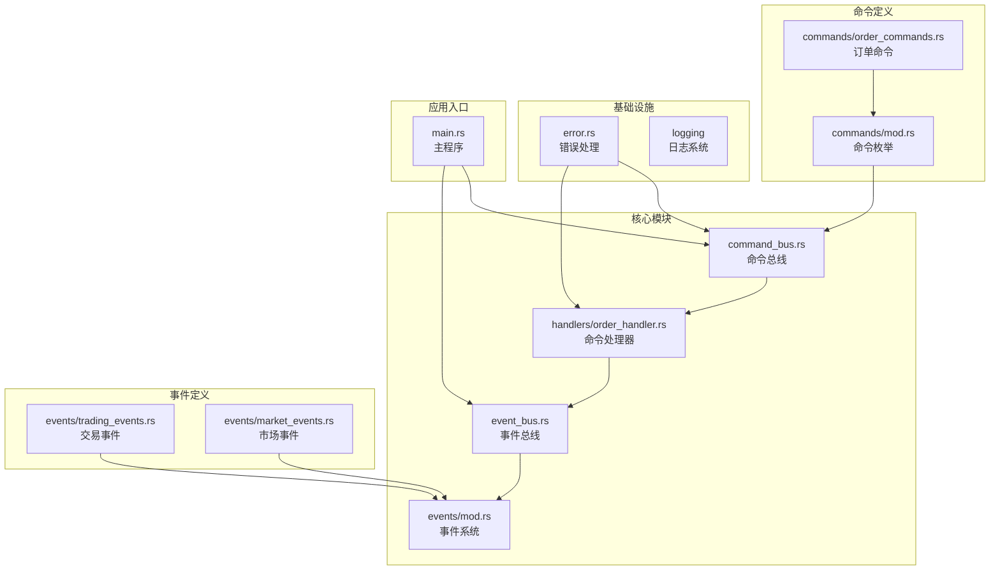
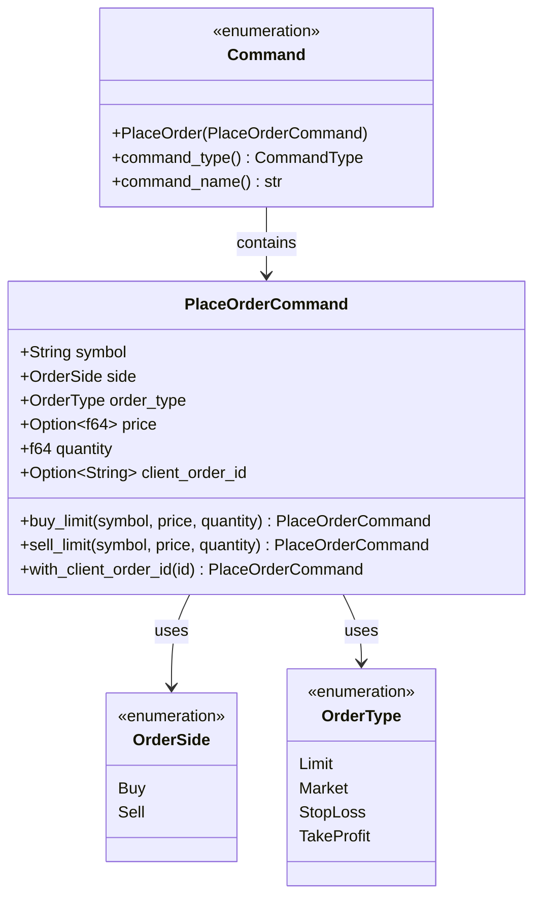
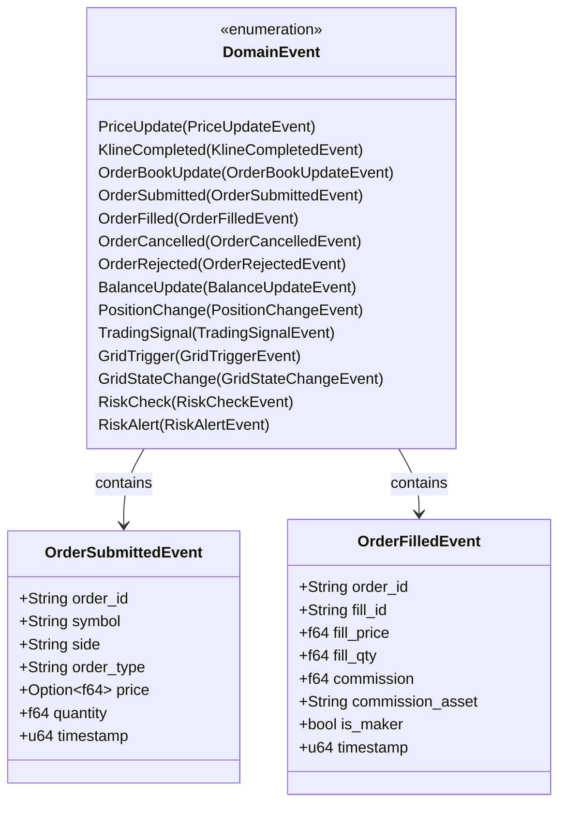
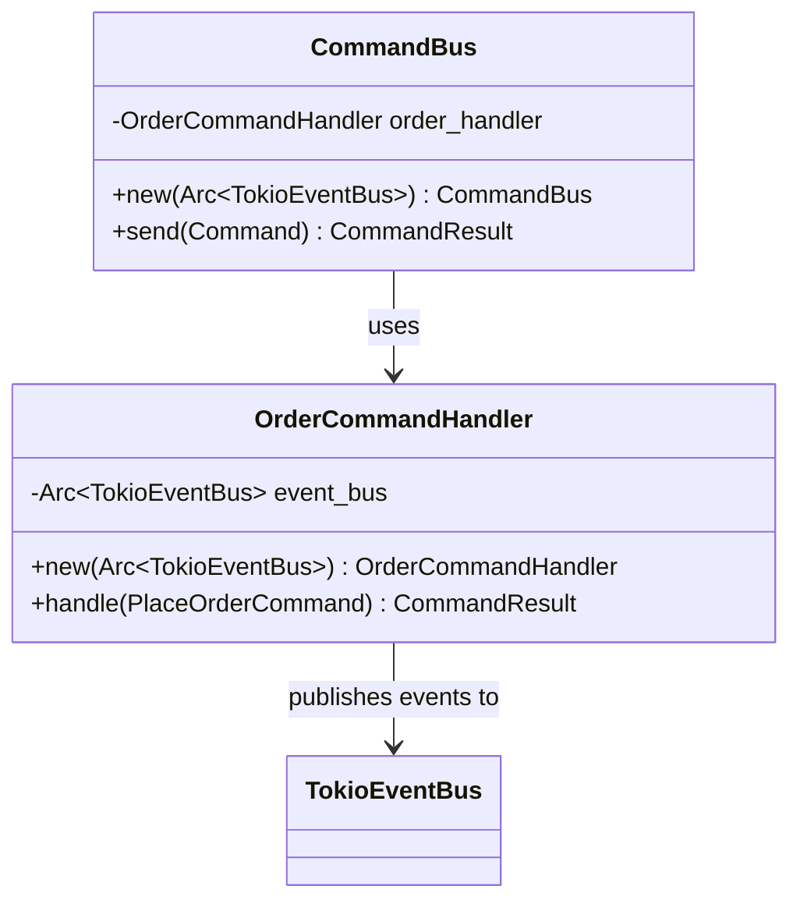
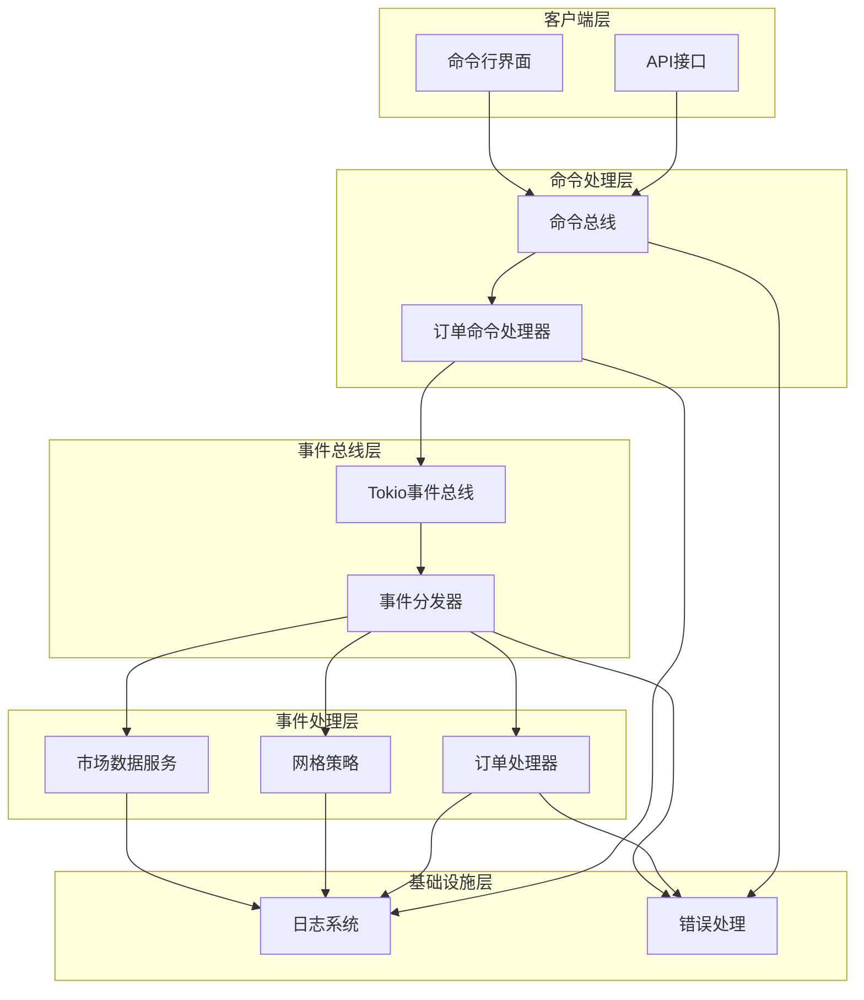
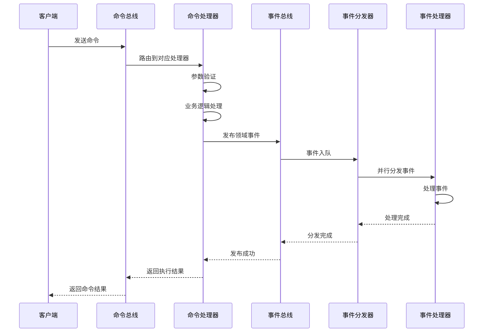
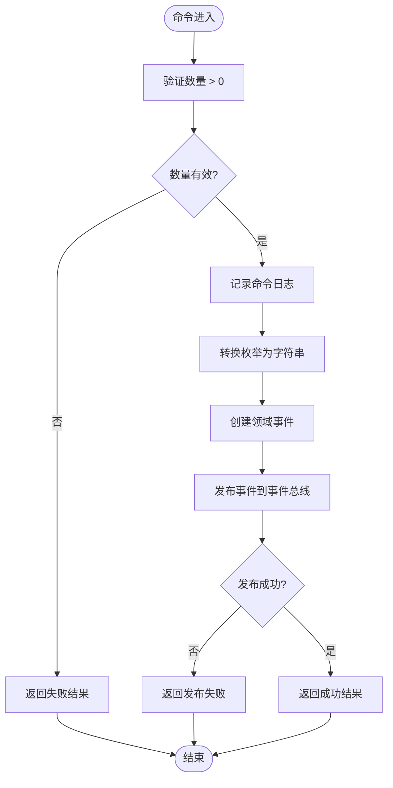
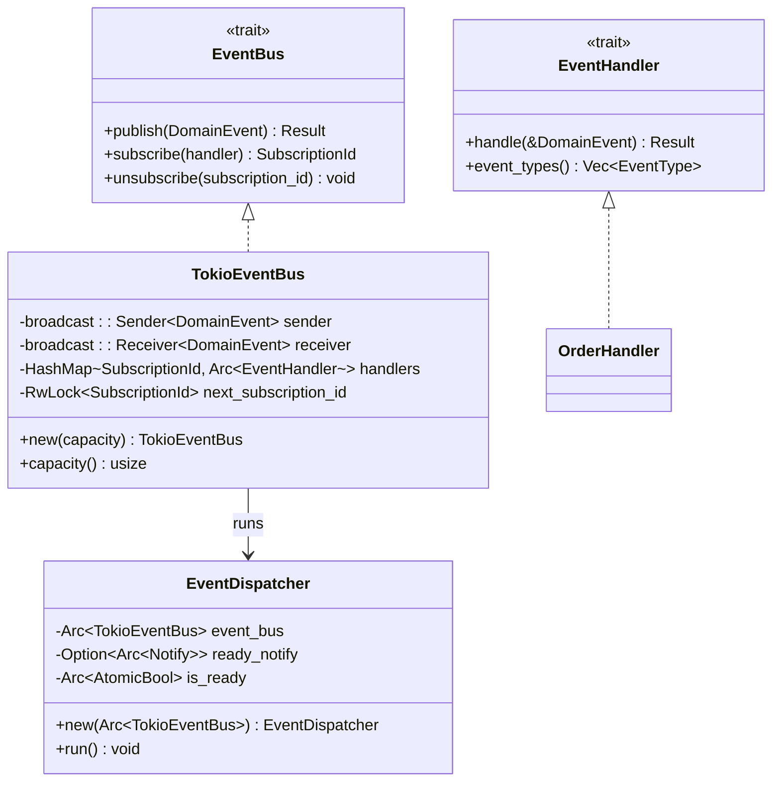
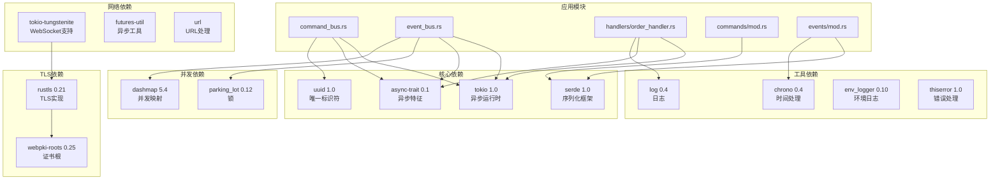

# CQRS模式

<cite>
**本文档引用的文件**
- [lib.rs](file://src/lib.rs)
- [command_bus.rs](file://src/command_bus.rs)
- [commands/mod.rs](file://src/commands/mod.rs)
- [commands/order_commands.rs](file://src/commands/order_commands.rs)
- [handlers/order_handler.rs](file://src/handlers/order_handler.rs)
- [event_bus.rs](file://src/event_bus.rs)
- [events/mod.rs](file://src/events/mod.rs)
- [events/trading_events.rs](file://src/events/trading_events.rs)
- [events/market_events.rs](file://src/events/market_events.rs)
- [error.rs](file://src/error.rs)
- [main.rs](file://src/main.rs)
- [Cargo.toml](file://Cargo.toml)
</cite>

## 目录
1. [引言](#引言)
2. [项目结构](#项目结构)
3. [核心组件](#核心组件)
4. [架构概览](#架构概览)
5. [详细组件分析](#详细组件分析)
6. [依赖关系分析](#依赖关系分析)
7. [性能考虑](#性能考虑)
8. [故障排除指南](#故障排除指南)
9. [结论](#结论)
10. [附录](#附录)

## 引言

本项目实现了基于Rust的Binance量化交易系统的CQRS（命令查询职责分离）模式。CQRS是一种将命令（写操作）和查询（读操作）分离的设计模式，在高频交易环境中具有显著优势。

### CQRS模式的核心价值

在量化交易系统中，CQRS模式提供了以下关键优势：

- **系统解耦**：命令处理和查询处理完全分离，降低组件间的耦合度
- **性能优化**：可以针对写入和读取操作分别优化，实现最佳性能
- **可扩展性**：支持水平扩展，命令处理和查询处理可以独立扩展
- **可测试性**：命令和查询可以独立测试，提高测试效率
- **领域建模**：更好地反映业务领域的复杂性，命令和查询有不同的语义

### 量化交易系统中的应用价值

在Binance量化交易环境中，CQRS模式特别适用于：

- **订单管理**：复杂的订单生命周期管理
- **风险管理**：实时风险监控和控制
- **市场数据分析**：高性能的市场数据处理
- **策略执行**：灵活的交易策略实现

## 项目结构

该项目采用模块化的Rust项目结构，清晰地分离了CQRS相关的各个组件：



**图表来源**
- [lib.rs:1-9](file://src/lib.rs#L1-L9)
- [command_bus.rs:1-19](file://src/command_bus.rs#L1-L19)
- [handlers/order_handler.rs:1-137](file://src/handlers/order_handler.rs#L1-L137)

**章节来源**
- [lib.rs:1-9](file://src/lib.rs#L1-L9)
- [Cargo.toml:1-27](file://Cargo.toml#L1-L27)

## 核心组件

### 命令系统

命令系统是CQRS模式的"写"端，负责处理所有状态变更请求。

#### 命令接口定义

命令系统通过枚举类型统一管理所有命令类型：



**图表来源**
- [commands/mod.rs:6-27](file://src/commands/mod.rs#L6-L27)
- [commands/order_commands.rs:37-44](file://src/commands/order_commands.rs#L37-L44)

#### 命令结果模型

命令执行结果采用统一的结果类型，支持多种执行状态：

```mermaid
classDiagram
class CommandResult {
<<enumeration>>
+Success {
message : String
data : Option~String~
}
+Failure {
reason : String
code : u32
}
+Accepted {
tracking_id : String
estimated_completion : Option~String~
}
+success(message) CommandResult
+success_with_data(message, data) CommandResult
+failure(reason, code) CommandResult
+accepted(tracking_id, estimated_completion) CommandResult
+is_success() bool
+is_failure() bool
+is_accepted() bool
}
```

**图表来源**
- [commands/mod.rs:29-77](file://src/commands/mod.rs#L29-L77)

**章节来源**
- [commands/mod.rs:1-77](file://src/commands/mod.rs#L1-L77)
- [commands/order_commands.rs:1-72](file://src/commands/order_commands.rs#L1-L72)

### 事件系统

事件系统是CQRS模式中实现最终一致性的关键组件。

#### 事件类型定义

系统支持多种类型的领域事件：



**图表来源**
- [events/mod.rs:49-89](file://src/events/mod.rs#L49-L89)
- [events/trading_events.rs:10-48](file://src/events/trading_events.rs#L10-L48)

**章节来源**
- [events/mod.rs:1-102](file://src/events/mod.rs#L1-L102)
- [events/trading_events.rs:1-136](file://src/events/trading_events.rs#L1-L136)

### 命令总线

命令总线是命令系统的入口点，负责命令的路由和处理。



**图表来源**
- [command_bus.rs:5-19](file://src/command_bus.rs#L5-L19)
- [handlers/order_handler.rs:93-137](file://src/handlers/order_handler.rs#L93-L137)

**章节来源**
- [command_bus.rs:1-19](file://src/command_bus.rs#L1-L19)
- [handlers/order_handler.rs:93-137](file://src/handlers/order_handler.rs#L93-L137)

## 架构概览

该系统采用了事件驱动的架构模式，命令和查询通过事件总线进行解耦：



**图表来源**
- [main.rs:10-93](file://src/main.rs#L10-L93)
- [event_bus.rs:62-158](file://src/event_bus.rs#L62-L158)

## 详细组件分析

### 命令执行流程

命令执行是一个异步的、事件驱动的流程：



**图表来源**
- [command_bus.rs:14-18](file://src/command_bus.rs#L14-L18)
- [handlers/order_handler.rs:103-135](file://src/handlers/order_handler.rs#L103-L135)
- [event_bus.rs:129-157](file://src/event_bus.rs#L129-L157)

#### 命令验证和参数检查

命令处理器实现了基本的参数验证逻辑：



**图表来源**
- [handlers/order_handler.rs:105-134](file://src/handlers/order_handler.rs#L105-L134)

**章节来源**
- [handlers/order_handler.rs:103-135](file://src/handlers/order_handler.rs#L103-L135)

### 事件总线实现

事件总线采用广播模式实现事件的发布和订阅：



**图表来源**
- [event_bus.rs:18-110](file://src/event_bus.rs#L18-L110)
- [event_bus.rs:61-158](file://src/event_bus.rs#L61-L158)

**章节来源**
- [event_bus.rs:1-257](file://src/event_bus.rs#L1-L257)

### 错误处理机制

系统实现了分层的错误处理机制：

```mermaid
classDiagram
class DomainError {
<<enumeration>>
Infrastructure(InfrastructureError)
EventBus(EventBusError)
CommandBus(CommandBusError)
Service(ServiceError)
Unknown(String)
}
class InfrastructureError {
<<enumeration>>
Config { context : String, details : String }
Io { operation : String, source : io : : Error }
Log { operation : String, reason : String }
Database { operation : String, reason : String }
LoggerInit(SetLoggerError)
}
class EventBusError {
<<enumeration>>
PublishFailed(String)
SubscribeFailed(String)
HandleFailed { handler : String, error : String }
ChannelClosed
}
class CommandBusError {
<<enumeration>>
ExecutionFailed { command : String, reason : String }
HandlerNotFound(String)
ValidationFailed(String)
}
DomainError --> InfrastructureError : contains
DomainError --> EventBusError : contains
DomainError --> CommandBusError : contains
```

**图表来源**
- [error.rs:12-128](file://src/error.rs#L12-L128)

**章节来源**
- [error.rs:1-169](file://src/error.rs#L1-L169)

## 依赖关系分析

项目使用Cargo进行依赖管理，主要依赖包括：



**图表来源**
- [Cargo.toml:6-25](file://Cargo.toml#L6-L25)

**章节来源**
- [Cargo.toml:1-27](file://Cargo.toml#L1-L27)

## 性能考虑

### 异步处理优势

系统充分利用Rust的异步特性：

- **非阻塞I/O**：使用Tokio作为异步运行时，避免阻塞操作
- **并行事件处理**：事件分发器支持并行处理多个事件处理器
- **零拷贝序列化**：使用Serde进行高效的JSON序列化

### 内存管理

- **Arc智能指针**：共享所有权，减少内存复制
- **广播通道**：高效的消息传递机制
- **原子操作**：最小化锁竞争

### 扩展性设计

- **插件化架构**：新的命令处理器和事件处理器易于添加
- **配置驱动**：通过配置文件控制系统行为
- **水平扩展**：支持多实例部署

## 故障排除指南

### 常见问题诊断

#### 命令执行失败

当命令执行失败时，检查以下方面：

1. **参数验证**：确认命令参数符合业务规则
2. **事件发布**：检查事件总线是否正常工作
3. **处理器注册**：确认相应的事件处理器已注册

#### 事件处理异常

事件处理异常的排查步骤：

1. **日志检查**：查看详细的错误日志
2. **处理器状态**：确认事件处理器正常运行
3. **网络连接**：检查与Binance API的连接状态

#### 性能问题

性能问题的识别和解决：

1. **事件积压**：监控事件队列长度
2. **处理器负载**：检查各处理器的处理时间
3. **内存使用**：监控内存使用情况

**章节来源**
- [error.rs:85-128](file://src/error.rs#L85-L128)
- [event_bus.rs:142-156](file://src/event_bus.rs#L142-L156)

## 结论

本项目成功实现了基于Rust的Binance量化交易系统的CQRS模式。通过命令和查询的分离，系统实现了良好的解耦性和可扩展性。

### 主要成就

- **完整的CQRS实现**：命令总线、事件总线、事件处理器的完整实现
- **事件驱动架构**：基于事件的最终一致性保证
- **高性能设计**：利用Rust的异步特性和零拷贝序列化
- **生产级错误处理**：分层的错误处理机制和完善的错误类型

### 技术亮点

- **模块化设计**：清晰的模块边界和职责分离
- **类型安全**：充分利用Rust的类型系统保证安全性
- **并发友好**：支持高并发的事件处理
- **可测试性**：良好的抽象层次便于单元测试

### 未来发展方向

1. **事件溯源**：实现完整的事件溯源功能
2. **分布式部署**：支持微服务架构的分布式部署
3. **监控告警**：集成完整的监控和告警系统
4. **性能优化**：进一步优化内存使用和处理速度

## 附录

### 使用示例

#### 定义自定义命令类型

要定义一个新的命令类型，需要：

1. 在命令模块中添加新的命令结构体
2. 在命令枚举中添加对应的变体
3. 实现命令的构造函数和验证逻辑

#### 实现命令处理器

命令处理器的实现步骤：

1. 创建处理器结构体，包含必要的依赖
2. 实现命令处理逻辑
3. 发布相应的领域事件
4. 返回命令执行结果

#### 处理命令执行结果

命令执行结果的处理方式：

```rust
match command_result {
    CommandResult::Success { message, data } => {
        // 处理成功响应
    }
    CommandResult::Failure { reason, code } => {
        // 处理失败响应
    }
    CommandResult::Accepted { tracking_id, estimated_completion } => {
        // 处理接受响应
    }
}
```

### 最佳实践

1. **命令幂等性**：确保命令可以重复执行而不产生副作用
2. **事件不可变性**：事件应该设计为不可变对象
3. **错误隔离**：每个组件应该独立处理自己的错误
4. **性能监控**：建立完善的性能监控指标
5. **测试覆盖**：确保关键路径都有单元测试覆盖