# 事件驱动架构

<cite>
**本文引用的文件**
- [event_bus.rs](file://src/event_bus.rs)
- [events/mod.rs](file://src/events/mod.rs)
- [events/market_events.rs](file://src/events/market_events.rs)
- [events/trading_events.rs](file://src/events/trading_events.rs)
- [events/risk_events.rs](file://src/events/risk_events.rs)
- [events/strategy_events.rs](file://src/events/strategy_events.rs)
- [strategies/grid_strategy.rs](file://src/strategies/grid_strategy.rs)
- [strategies/momentum_strategy.rs](file://src/strategies/momentum_strategy.rs)
- [services/market_data_service.rs](file://src/services/market_data_service.rs)
- [risk/risk_monitor_service.rs](file://src/risk/risk_monitor_service.rs)
- [risk/rules.rs](file://src/risk/rules.rs)
- [backtest/engine.rs](file://src/backtest/engine.rs)
- [backtest/data_loader.rs](file://src/backtest/data_loader.rs)
- [backtest/recorder.rs](file://src/backtest/recorder.rs)
- [backtest/report.rs](file://src/backtest/report.rs)
- [config.rs](file://src/config.rs)
- [error.rs](file://src/error.rs)
- [main.rs](file://src/main.rs)
- [command_bus.rs](file://src/command_bus.rs)
- [handlers/order_handler.rs](file://src/handlers/order_handler.rs)
- [Cargo.toml](file://Cargo.toml)
- [EVENT_DRIVEN_REFACTOR_GUIDE.md](file://docs/EVENT_DRIVEN_REFACTOR_GUIDE.md)
- [CODE_EXPLANATION.md](file://docs/CODE_EXPLANATION.md)
</cite>

## 目录
1. [简介](#简介)
2. [项目结构](#项目结构)
3. [核心组件](#核心组件)
4. [架构总览](#架构总览)
5. [详细组件分析](#详细组件分析)
6. [依赖关系分析](#依赖关系分析)
7. [性能考量](#性能考量)
8. [故障排查指南](#故障排查指南)
9. [结论](#结论)
10. [附录](#附录)

## 简介
本项目基于事件驱动架构（EDA）构建，围绕"发布-订阅"模式组织系统：市场数据服务通过事件总线发布实时行情与交易事件；策略、风控、订单执行等模块以事件处理器的形式订阅感兴趣事件，实现解耦、可扩展与低延迟响应。Tokio 广播通道提供一对多的事件分发，配合 Arc、RwLock 实现线程安全与高效并发。

**更新** 新增回测系统、风控管理和动量策略模块，扩展事件总线以支持更多事件类型和处理器。

## 项目结构
项目采用按职责分层与按领域划分相结合的组织方式：
- 顶层模块导出：事件、事件总线、命令、处理器、服务、策略、基础设施等
- 事件层：统一的 DomainEvent 枚举与各子事件模块（新增风控事件、策略事件）
- 事件总线层：EventBus/EventHandler 抽象、TokioEventBus 实现、EventDispatcher 分发器
- 服务层：市场数据服务（WebSocket 连接、解析、发布）、订单执行服务（待实现）
- 策略层：网格策略（订阅价格事件，生成交易信号）、动量策略（多数据流高频策略）
- 风控层：风控监控服务、风控规则引擎
- 回测层：回测引擎、数据加载器、报告生成器
- 错误层：统一错误类型与错误传播
- 应用入口：main 启动事件总线与分发器，注册策略与服务

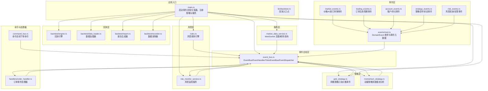

**图表来源**
- [main.rs:1-93](file://src/main.rs#L1-L93)
- [event_bus.rs:18-158](file://src/event_bus.rs#L18-L158)
- [events/mod.rs:48-106](file://src/events/mod.rs#L48-L106)
- [strategies/grid_strategy.rs:156-278](file://src/strategies/grid_strategy.rs#L156-L278)
- [strategies/momentum_strategy.rs:205-489](file://src/strategies/momentum_strategy.rs#L205-L489)
- [risk/risk_monitor_service.rs:14-175](file://src/risk/risk_monitor_service.rs#L14-L175)
- [risk/rules.rs:12-419](file://src/risk/rules.rs#L12-L419)
- [backtest/engine.rs:110-631](file://src/backtest/engine.rs#L110-L631)
- [backtest/data_loader.rs:66-193](file://src/backtest/data_loader.rs#L66-L193)
- [backtest/report.rs:34-312](file://src/backtest/report.rs#L34-L312)
- [backtest/recorder.rs:10-55](file://src/backtest/recorder.rs#L10-L55)
- [command_bus.rs:1-19](file://src/command_bus.rs#L1-L19)
- [handlers/order_handler.rs:9-137](file://src/handlers/order_handler.rs#L9-L137)

**章节来源**
- [main.rs:1-93](file://src/main.rs#L1-L93)
- [Cargo.toml:1-27](file://Cargo.toml#L1-L27)

## 核心组件
- 事件总线抽象与实现
  - EventBus/EventHandler：定义发布、订阅、处理与事件类型过滤接口
  - TokioEventBus：基于 Tokio broadcast channel 的实现，内部维护处理器映射与订阅 ID 分配
  - EventDispatcher：独立任务，从广播通道接收事件并并行分发给所有订阅处理器
- 事件定义
  - DomainEvent：统一事件枚举，聚合市场、交易、账户、策略、风控等事件
  - 事件元数据 EventMetadata：事件唯一 ID、时间戳、版本、关联/因果 ID
- 事件类型枚举 EventType：用于订阅过滤，支持 All 全量订阅
- 订阅 ID 管理：原子自增分配，配合 RwLock 保护处理器映射
- 并行处理与错误处理：EventDispatcher 使用 join_all 并发执行，单个处理器错误不影响其他处理器
- 线程安全与并发模型：Arc 共享、RwLock 读写分离、Tokio 广播通道天然支持多播

**更新** 新增风控事件和策略事件类型，扩展事件总线以支持更多处理器订阅。

**章节来源**
- [event_bus.rs:18-158](file://src/event_bus.rs#L18-L158)
- [events/mod.rs:21-106](file://src/events/mod.rs#L21-L106)

## 架构总览
事件驱动的整体流程如下：
- 生产者（市场数据服务）解析实时数据，封装为 DomainEvent 并发布
- 事件总线通过广播通道将事件投递给所有订阅者
- EventDispatcher 并行调用各处理器的 handle 方法
- 处理器根据事件类型进行业务处理，并可继续发布新的领域事件（如网格策略生成交易信号）

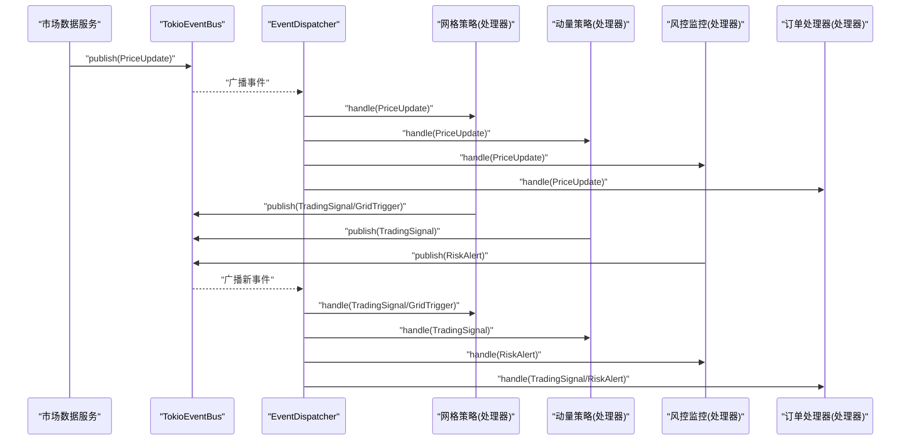

**图表来源**
- [services/market_data_service.rs:402-407](file://src/services/market_data_service.rs#L402-L407)
- [event_bus.rs:88-110](file://src/event_bus.rs#L88-L110)
- [event_bus.rs:129-157](file://src/event_bus.rs#L129-L157)
- [strategies/grid_strategy.rs:234-249](file://src/strategies/grid_strategy.rs#L234-L249)
- [strategies/momentum_strategy.rs:440-466](file://src/strategies/momentum_strategy.rs#L440-L466)
- [risk/risk_monitor_service.rs:38-79](file://src/risk/risk_monitor_service.rs#L38-L79)
- [handlers/order_handler.rs:69-91](file://src/handlers/order_handler.rs#L69-L91)

## 详细组件分析

### 事件总线与分发器
- 发布-订阅接口
  - 发布：TokioEventBus.publish 将事件发送至广播通道
  - 订阅：subscribe 分配自增订阅 ID，并将处理器加入共享映射
  - 取消订阅：unsubscribe 移除处理器映射
- 并发分发
  - EventDispatcher.run 无限循环从广播通道接收事件
  - 读取所有处理器快照并并发执行，join_all 等待全部完成
  - 单个处理器错误被捕获并记录，不影响其他处理器
- 线程安全
  - Arc<RwLock<HashMap<...>>> 保护处理器映射与订阅 ID
  - broadcast::channel 天然支持多播与背压

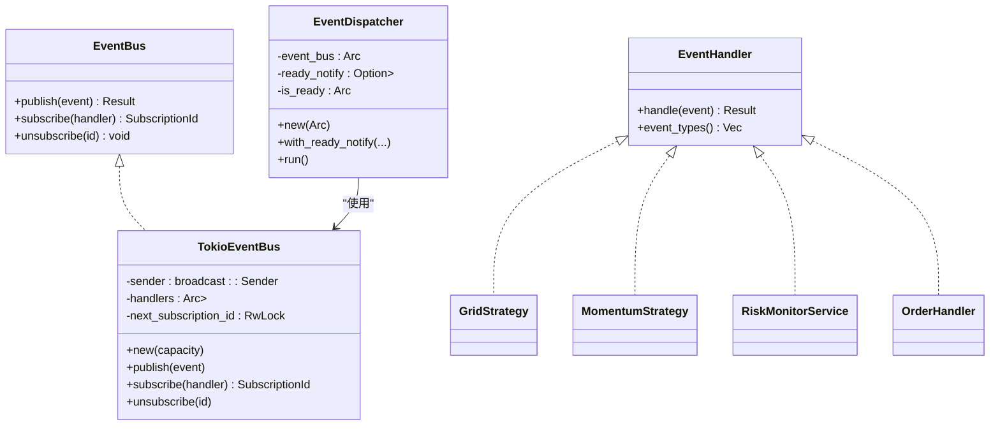

**图表来源**
- [event_bus.rs:18-158](file://src/event_bus.rs#L18-L158)
- [strategies/grid_strategy.rs:264-278](file://src/strategies/grid_strategy.rs#L264-L278)
- [strategies/momentum_strategy.rs:469-489](file://src/strategies/momentum_strategy.rs#L469-L489)
- [risk/risk_monitor_service.rs:81-135](file://src/risk/risk_monitor_service.rs#L81-L135)
- [handlers/order_handler.rs:68-91](file://src/handlers/order_handler.rs#L68-L91)

**章节来源**
- [event_bus.rs:61-158](file://src/event_bus.rs#L61-L158)

### 事件类型与事件提取
- DomainEvent 统一枚举，涵盖市场、交易、账户、策略、风控事件
- EventType 枚举用于订阅过滤，支持 All 全量订阅
- extract_event_type 将 DomainEvent 映射为 EventType，便于订阅过滤与日志

**更新** 新增风控事件类型（RiskCheck、RiskAlert）和策略事件类型（TradingSignal、GridTrigger、GridStateChange），扩展事件总线以支持更丰富的事件处理场景。

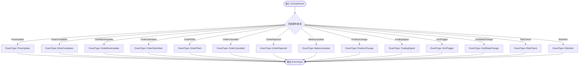

**图表来源**
- [event_bus.rs:162-181](file://src/event_bus.rs#L162-L181)
- [events/mod.rs:48-106](file://src/events/mod.rs#L48-L106)

**章节来源**
- [event_bus.rs:41-59](file://src/event_bus.rs#L41-L59)
- [events/mod.rs:48-106](file://src/events/mod.rs#L48-L106)

### 事件处理器接口与订阅过滤
- EventHandler.handle：异步处理事件，接收引用避免拷贝
- event_types：返回感兴趣的事件类型集合，用于过滤，提升分发效率
- 订阅过滤：处理器可声明仅处理特定 EventType，EventDispatcher 在分发前可根据处理器的 event_types 进行过滤（当前实现为全量分发，可通过扩展实现按类型过滤）

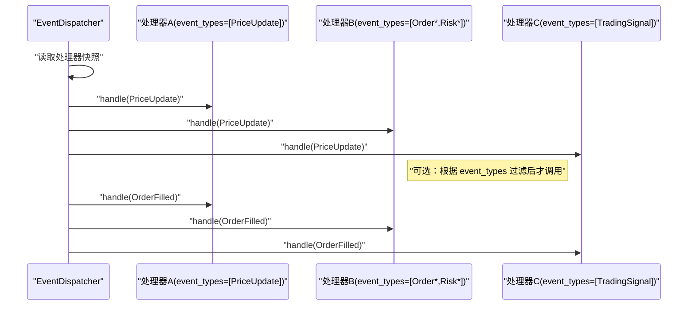

**图表来源**
- [event_bus.rs:31-39](file://src/event_bus.rs#L31-L39)
- [event_bus.rs:137-148](file://src/event_bus.rs#L137-L148)

**章节来源**
- [event_bus.rs:31-39](file://src/event_bus.rs#L31-L39)

### 网格策略（订阅价格事件，生成交易信号）
- 订阅类型：仅订阅 EventType::PriceUpdate
- 处理逻辑：当价格穿越网格线时，生成交易信号与网格触发事件，并发布到事件总线
- 状态管理：使用 Mutex 保护策略内部状态（网格线填充状态、最后价格等）

**图表来源**
- [strategies/grid_strategy.rs:264-278](file://src/strategies/grid_strategy.rs#L264-L278)
- [strategies/grid_strategy.rs:189-252](file://src/strategies/grid_strategy.rs#L189-L252)

**章节来源**
- [strategies/grid_strategy.rs:156-278](file://src/strategies/grid_strategy.rs#L156-L278)

### 动量策略（多数据流高频策略）
- 订阅类型：订阅 EventType::KlineCompleted、EventType::AggTrade、EventType::BookTicker
- 处理逻辑：基于多数据流（K线、成交流、盘口）的高频动量短线策略，核心逻辑包括趋势方向、RSI超卖/超买回归、成交量确认、盘口强度
- 状态管理：使用 Mutex 保护策略内部状态，支持持久化和恢复
- 风险控制：内置止损、止盈、时间止损、日限额等风控机制

**更新** 新增动量策略模块，提供基于多数据流的高频动量策略实现，支持复杂的交易信号生成和风险管理。

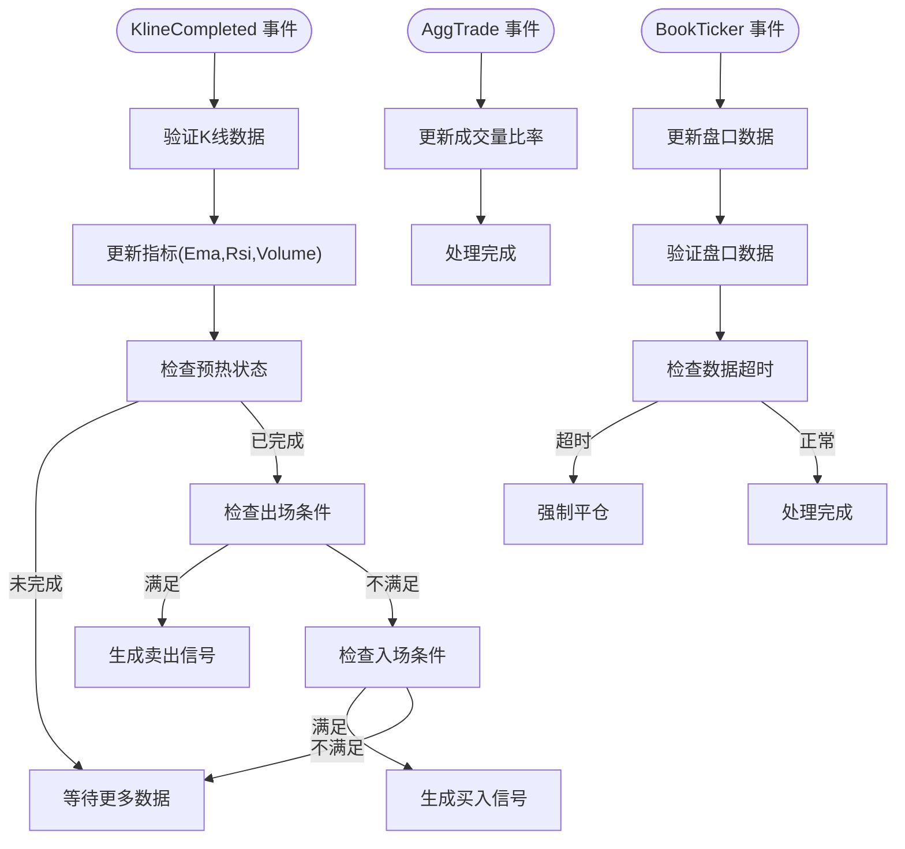

**图表来源**
- [strategies/momentum_strategy.rs:227-438](file://src/strategies/momentum_strategy.rs#L227-L438)
- [strategies/momentum_strategy.rs:292-304](file://src/strategies/momentum_strategy.rs#L292-L304)
- [strategies/momentum_strategy.rs:306-438](file://src/strategies/momentum_strategy.rs#L306-L438)

**章节来源**
- [strategies/momentum_strategy.rs:205-489](file://src/strategies/momentum_strategy.rs#L205-L489)

### 市场数据服务（WebSocket 实时数据接入）
- 连接模式：Auto/Direct/Proxy，支持 HTTP CONNECT 代理隧道
- 消息处理：解析 ticker 数据，封装为 PriceUpdateEvent 并发布
- 心跳与重连：定时 Ping、异常自动重连
- 并发与稳定性：tokio::select! 并发处理消息与心跳，TLS 握手与代理隧道

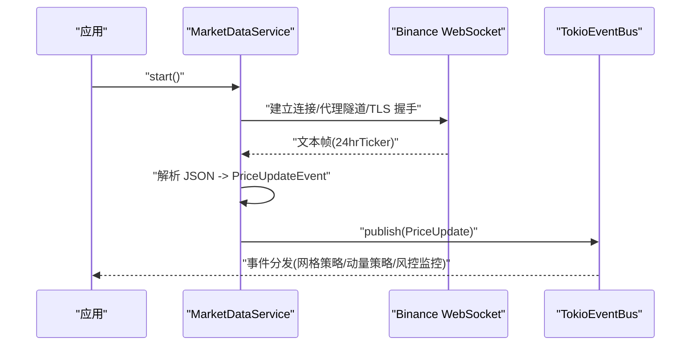

**图表来源**
- [services/market_data_service.rs:96-178](file://src/services/market_data_service.rs#L96-L178)
- [services/market_data_service.rs:376-407](file://src/services/market_data_service.rs#L376-L407)

**章节来源**
- [services/market_data_service.rs:34-440](file://src/services/market_data_service.rs#L34-L440)

### 风控监控服务
- 风控规则引擎：实现资金充足性、持仓限额、单笔金额、日亏损、下单频率等多重风控检查
- 实时监控：监听账户余额更新、订单成交、持仓变动等事件，动态更新风控状态
- 风控告警：当风控检查不通过时，发布 RiskAlert 事件到事件总线
- 策略集成：支持与动量策略等交易策略的集成，提供交易前风控检查

**更新** 新增完整的风控管理系统，包括风控监控服务和规则引擎，提供多层次的风险控制能力。

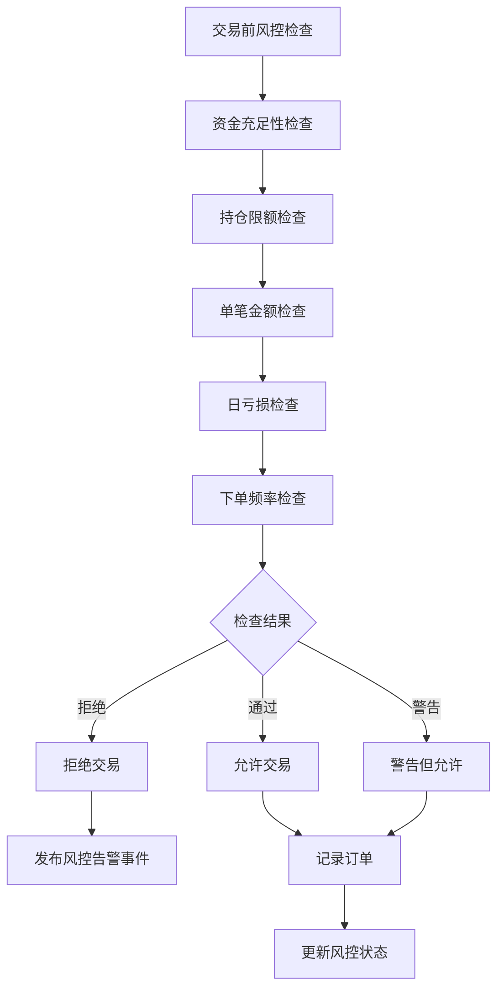

**图表来源**
- [risk/risk_monitor_service.rs:38-79](file://src/risk/risk_monitor_service.rs#L38-L79)
- [risk/rules.rs:191-271](file://src/risk/rules.rs#L191-L271)

**章节来源**
- [risk/risk_monitor_service.rs:14-175](file://src/risk/risk_monitor_service.rs#L14-L175)
- [risk/rules.rs:12-419](file://src/risk/rules.rs#L12-L419)

### 回测系统
- 回测引擎：支持K线模式和回放模式两种回测方式，模拟交易并记录结果
- 数据加载：支持从Binance API下载历史K线数据，以及从本地录制文件加载回放数据
- 报告生成：生成包含基础指标、详细指标和逐笔明细的完整回测报告
- 参数优化：提供零IO的高速参数优化接口

**更新** 新增完整的回测系统，包括回测引擎、数据加载器、报告生成器和数据录制器，支持策略开发和验证。

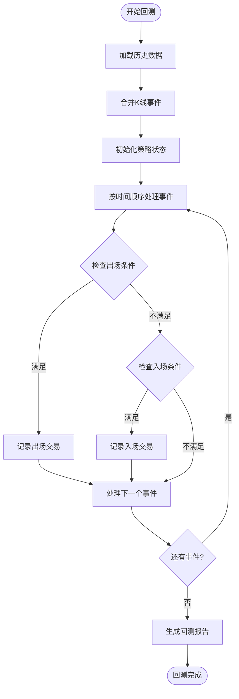

**图表来源**
- [backtest/engine.rs:124-314](file://src/backtest/engine.rs#L124-L314)
- [backtest/engine.rs:316-476](file://src/backtest/engine.rs#L316-L476)
- [backtest/data_loader.rs:78-137](file://src/backtest/data_loader.rs#L78-L137)
- [backtest/report.rs:87-199](file://src/backtest/report.rs#L87-L199)

**章节来源**
- [backtest/engine.rs:110-631](file://src/backtest/engine.rs#L110-L631)
- [backtest/data_loader.rs:66-193](file://src/backtest/data_loader.rs#L66-L193)
- [backtest/report.rs:34-312](file://src/backtest/report.rs#L34-L312)
- [backtest/recorder.rs:10-55](file://src/backtest/recorder.rs#L10-L55)

### 命令总线与订单命令处理
- 命令总线：根据命令类型路由到对应处理器
- 订单命令：下单命令校验参数，构造 OrderSubmitted 事件并发布
- 订单处理器：实现 EventHandler，处理订单生命周期事件（待完善持久化与状态更新）

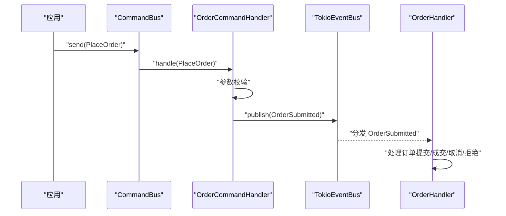

**图表来源**
- [command_bus.rs:5-19](file://src/command_bus.rs#L5-L19)
- [handlers/order_handler.rs:93-137](file://src/handlers/order_handler.rs#L93-L137)
- [handlers/order_handler.rs:68-91](file://src/handlers/order_handler.rs#L68-L91)

**章节来源**
- [command_bus.rs:1-19](file://src/command_bus.rs#L1-L19)
- [handlers/order_handler.rs:1-137](file://src/handlers/order_handler.rs#L1-L137)

## 依赖关系分析
- 运行时与并发
  - tokio：异步运行时、广播通道、Notify、select!
  - futures-util：join_all 并行执行
  - parking_lot：RwLock 替代标准锁，高性能读写
- 序列化与时间
  - serde/serde_json：事件序列化
  - chrono：时间戳
  - uuid：事件 ID
- 网络与安全
  - tokio-tungstenite：WebSocket 客户端
  - rustls/webpki-roots：TLS 握手
  - url：URL 解析
- 日志与错误
  - log/env_logger：日志
  - thiserror：错误派生

**更新** 新增回测系统依赖（tokio-time用于API限频控制）、风控系统依赖（chrono用于时间戳管理）、动量策略依赖（tokio-sync用于状态同步）。

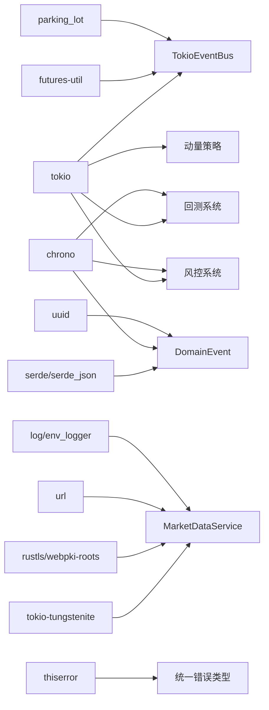

**图表来源**
- [Cargo.toml:6-24](file://Cargo.toml#L6-L24)
- [event_bus.rs:5-10](file://src/event_bus.rs#L5-L10)
- [events/mod.rs:17-19](file://src/events/mod.rs#L17-L19)
- [services/market_data_service.rs:8-21](file://src/services/market_data_service.rs#L8-L21)
- [error.rs:10-11](file://src/error.rs#L10-L11)
- [backtest/engine.rs:5-8](file://src/backtest/engine.rs#L5-L8)
- [risk/rules.rs:5-6](file://src/risk/rules.rs#L5-L6)
- [strategies/momentum_strategy.rs:13-15](file://src/strategies/momentum_strategy.rs#L13-L15)

**章节来源**
- [Cargo.toml:1-27](file://Cargo.toml#L1-L27)

## 性能考量
- 广播通道与并行分发
  - broadcast::channel 支持一对多广播，天然具备背压与多读者能力
  - EventDispatcher 使用 join_all 并发执行所有处理器，显著降低总延迟
- 线程安全与锁粒度
  - Arc<RwLock<...>> 保护处理器映射，读多写少场景下 RwLock 更优
  - 订阅 ID 分配使用原子自增，避免锁竞争
- 序列化与内存
  - 事件结构体使用 serde，避免不必要的克隆
  - 事件引用传参（&DomainEvent），减少拷贝成本
- I/O 与网络
  - WebSocket 长连接 + 心跳维持，减少握手与连接开销
  - 代理隧道与 TLS 握手在启动阶段完成，运行时仅转发数据
- **更新** 回测系统的零IO优化：预加载数据到内存，使用零IO的参数优化接口，显著提升回测速度

[本节为通用性能建议，不直接分析具体文件]

## 故障排查指南
- 事件发布失败
  - EventBusError::PublishFailed：检查广播通道容量与背压情况
  - 检查 EventDispatcher 是否仍在运行
- 订阅/取消订阅异常
  - 确认订阅 ID 分配与映射一致性
  - 取消订阅后处理器不再收到事件
- 处理器错误
  - EventDispatcher 对单个处理器错误进行捕获并记录，不影响其他处理器
  - 检查处理器 event_types 过滤是否正确
- WebSocket 连接问题
  - 代理隧道：确认 HTTPS_PROXY 环境变量与 CONNECT 成功
  - TLS 握手：检查证书与服务器名称
  - 心跳：确认 Ping/Pong 循环正常
- 命令处理失败
  - 参数校验失败：检查下单命令字段
  - 发布事件失败：检查事件总线状态
- **更新** 风控系统问题
  - 风控检查失败：检查风控配置参数是否合理
  - 风控告警事件：确认风控监控服务正常运行
  - 风控状态异常：检查风控状态持久化和恢复机制
- **更新** 回测系统问题
  - 数据下载失败：检查Binance API访问权限和网络连接
  - 回测报告异常：确认回测数据完整性和时间范围
  - 回测性能问题：检查回测数据预加载和零IO优化设置

**章节来源**
- [error.rs:85-99](file://src/error.rs#L85-L99)
- [event_bus.rs:150-155](file://src/event_bus.rs#L150-L155)
- [services/market_data_service.rs:149-164](file://src/services/market_data_service.rs#L149-L164)
- [handlers/order_handler.rs:102-135](file://src/handlers/order_handler.rs#L102-L135)
- [risk/risk_monitor_service.rs:38-79](file://src/risk/risk_monitor_service.rs#L38-L79)
- [risk/rules.rs:191-271](file://src/risk/rules.rs#L191-L271)
- [backtest/data_loader.rs:78-137](file://src/backtest/data_loader.rs#L78-L137)

## 结论
该事件驱动架构通过发布-订阅模式实现了模块解耦、可扩展与低延迟响应。Tokio 广播通道与并行分发机制有效提升了吞吐与实时性；Arc/RwLock 提供了高效的线程安全保障。结合网格策略、动量策略、市场数据服务、风控监控和回测系统，系统具备完整的量化交易解决方案能力。

**更新** 新增的回测系统提供了完整的策略开发和验证工具链，风控管理系统确保了交易的安全性，动量策略模块扩展了系统的交易能力。这些模块的集成进一步完善了事件驱动体系，使其能够支持更复杂的量化交易场景。

[本节为总结性内容，不直接分析具体文件]

## 附录
- 事件驱动重构指南与开发路线图
  - 事件定义、事件总线、命令总线、事件存储、策略引擎、风控监控、回测系统等模块的开发顺序与验收标准
- 代码详解与最佳实践
  - 事件总线、市场数据服务、网格策略、动量策略、风控监控、回测系统、错误处理等模块的实现要点与注意事项

**章节来源**
- [EVENT_DRIVEN_REFACTOR_GUIDE.md:1-1280](file://docs/EVENT_DRIVEN_REFACTOR_GUIDE.md#L1-L1280)
- [CODE_EXPLANATION.md:1-762](file://docs/CODE_EXPLANATION.md#L1-L762)