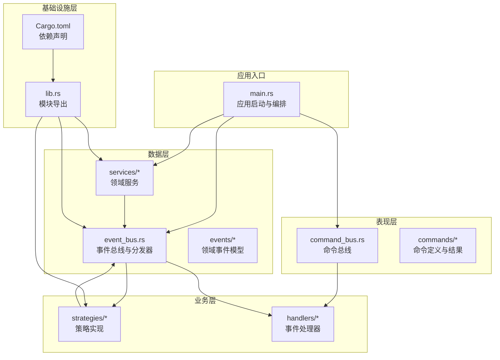
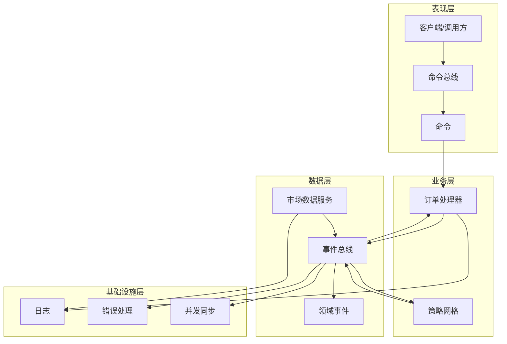
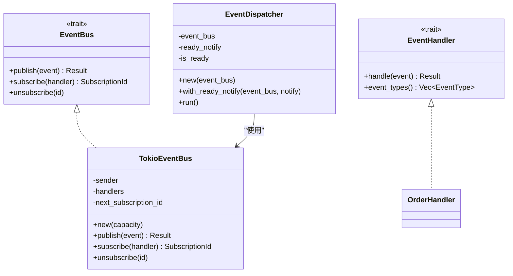
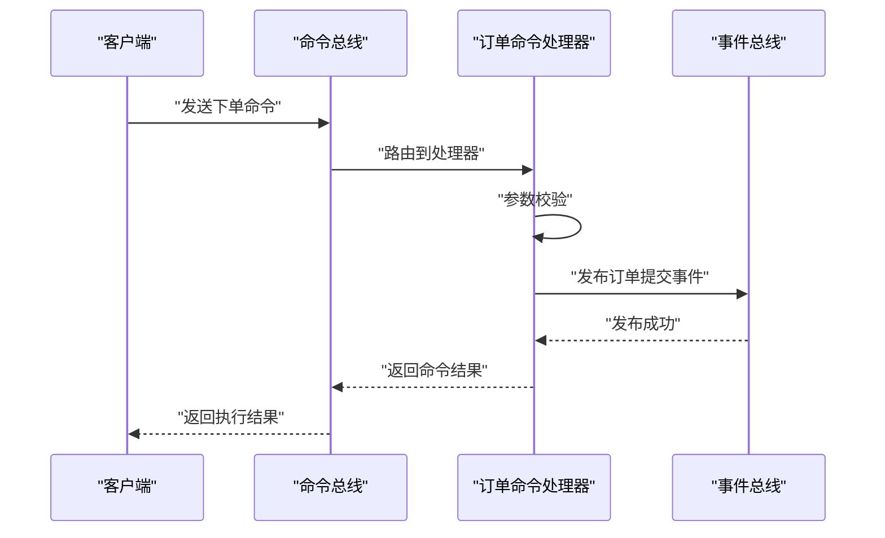
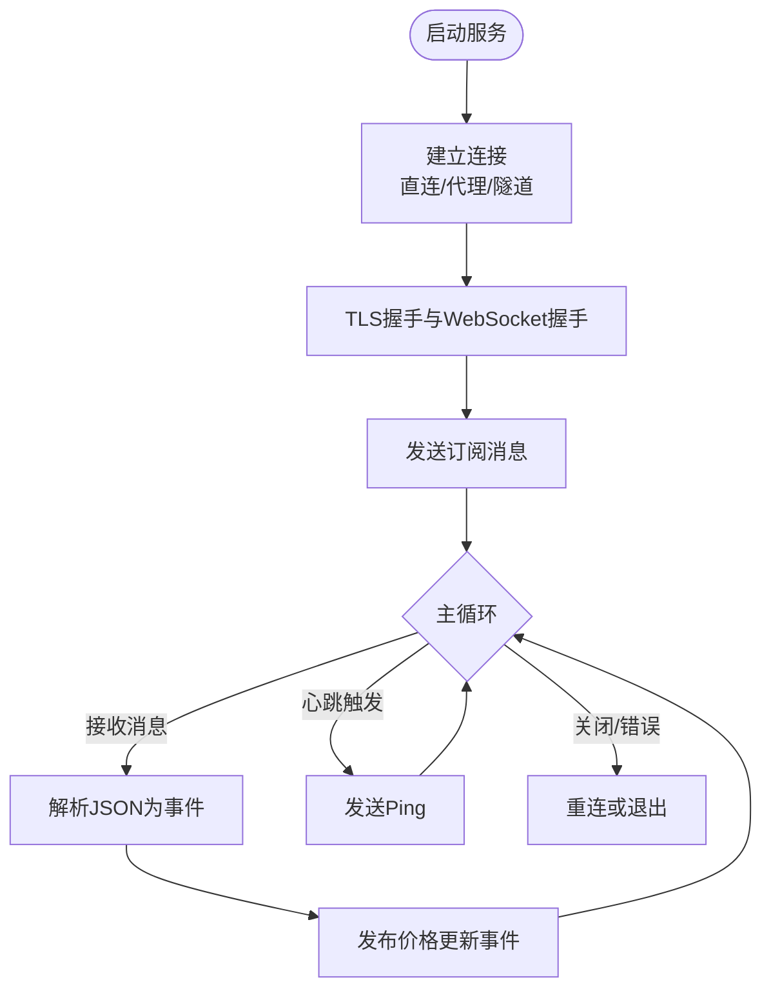
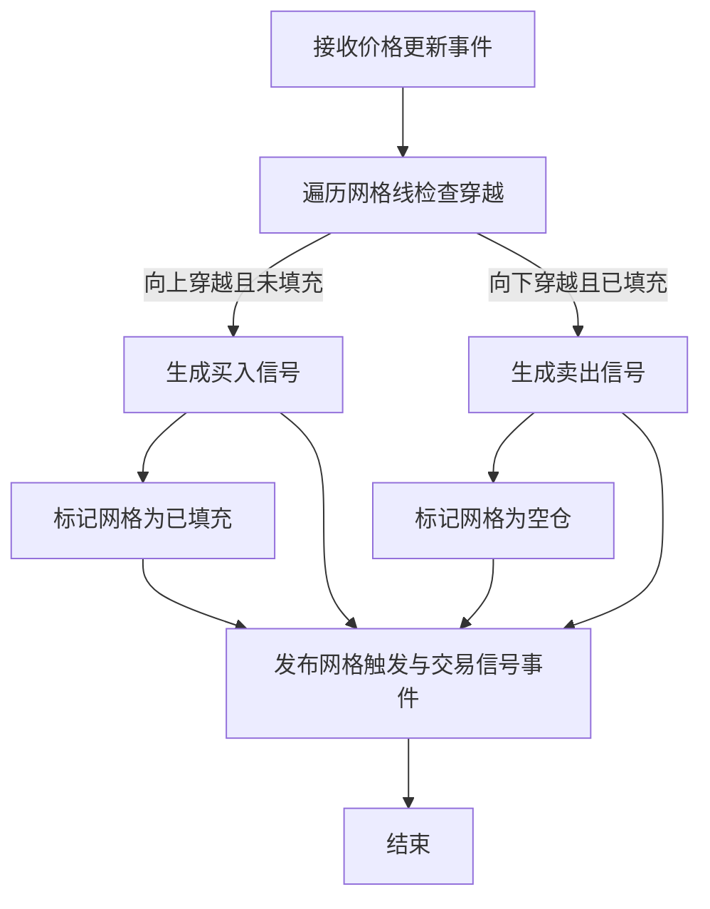
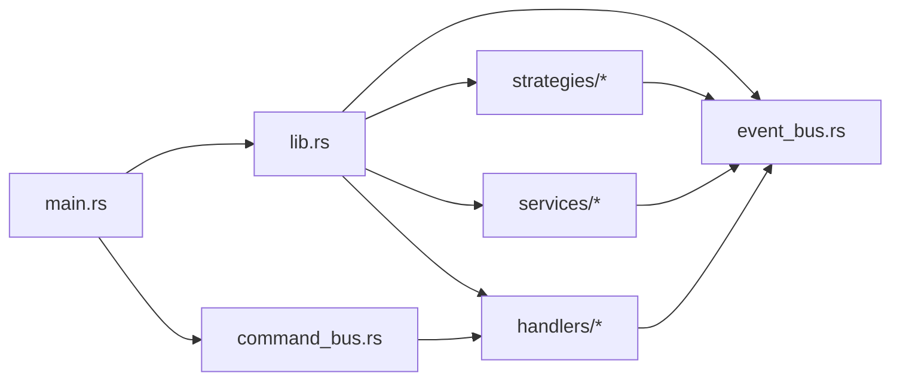

# 分层架构设计

<cite>
**本文档引用的文件**
- [src/lib.rs](file://src/lib.rs)
- [src/main.rs](file://src/main.rs)
- [src/event_bus.rs](file://src/event_bus.rs)
- [src/command_bus.rs](file://src/command_bus.rs)
- [src/commands/mod.rs](file://src/commands/mod.rs)
- [src/commands/order_commands.rs](file://src/commands/order_commands.rs)
- [src/handlers/mod.rs](file://src/handlers/mod.rs)
- [src/handlers/order_handler.rs](file://src/handlers/order_handler.rs)
- [src/events/mod.rs](file://src/events/mod.rs)
- [src/events/trading_events.rs](file://src/events/trading_events.rs)
- [src/services/mod.rs](file://src/services/mod.rs)
- [src/services/market_data_service.rs](file://src/services/market_data_service.rs)
- [src/strategies/mod.rs](file://src/strategies/mod.rs)
- [src/strategies/grid_strategy.rs](file://src/strategies/grid_strategy.rs)
- [Cargo.toml](file://Cargo.toml)
</cite>

## 目录
1. [引言](#引言)
2. [项目结构](#项目结构)
3. [核心组件](#核心组件)
4. [架构总览](#架构总览)
5. [详细组件分析](#详细组件分析)
6. [依赖分析](#依赖分析)
7. [性能考虑](#性能考虑)
8. [故障排查指南](#故障排查指南)
9. [结论](#结论)
10. [附录](#附录)

## 引言
本项目采用事件驱动的分层架构，围绕事件总线构建“表现层-业务层-数据层-基础设施层”的清晰职责划分。通过命令总线与事件总线解耦业务流程与数据来源，策略层基于事件进行决策，服务层负责外部系统集成（如Binance WebSocket），基础设施层提供日志、错误处理等横切能力。该架构强调关注点分离、可维护性与可测试性，并为未来扩展（如风控、账户同步、多策略并行）预留了清晰的演进路径。

## 项目结构
项目采用按职责分层的模块组织方式，顶层模块导出各层功能，便于在入口处统一组装与运行。

**图表来源**
- [src/main.rs:10-93](file://src/main.rs#L10-L93)
- [src/command_bus.rs:1-19](file://src/command_bus.rs#L1-L19)
- [src/event_bus.rs:18-110](file://src/event_bus.rs#L18-L110)
- [src/services/market_data_service.rs:34-114](file://src/services/market_data_service.rs#L34-L114)
- [src/strategies/grid_strategy.rs:156-278](file://src/strategies/grid_strategy.rs#L156-L278)
- [src/lib.rs:1-9](file://src/lib.rs#L1-L9)
- [Cargo.toml:1-27](file://Cargo.toml#L1-L27)

**章节来源**
- [src/lib.rs:1-9](file://src/lib.rs#L1-L9)
- [src/main.rs:10-93](file://src/main.rs#L10-L93)
- [Cargo.toml:1-27](file://Cargo.toml#L1-L27)

## 核心组件
- 事件总线与分发器：提供事件发布、订阅与并行分发能力，支持异步处理与并发安全。
- 命令总线：封装命令路由与执行，当前实现仅覆盖下单命令，体现“命令-事件”解耦。
- 市场数据服务：连接Binance WebSocket，解析行情并发布价格更新事件。
- 网格策略：订阅价格事件，基于网格规则生成交易信号与网格触发事件。
- 订单处理器：订阅订单生命周期事件，作为示例演示事件处理与副作用（日志）。
- 事件与命令模型：统一的领域事件与命令定义，支撑跨层通信与测试。

**章节来源**
- [src/event_bus.rs:18-110](file://src/event_bus.rs#L18-L110)
- [src/command_bus.rs:1-19](file://src/command_bus.rs#L1-L19)
- [src/services/market_data_service.rs:34-114](file://src/services/market_data_service.rs#L34-L114)
- [src/strategies/grid_strategy.rs:156-278](file://src/strategies/grid_strategy.rs#L156-L278)
- [src/handlers/order_handler.rs:9-91](file://src/handlers/order_handler.rs#L9-L91)
- [src/events/mod.rs:48-89](file://src/events/mod.rs#L48-L89)
- [src/commands/mod.rs:6-42](file://src/commands/mod.rs#L6-L42)

## 架构总览
整体采用事件驱动的分层设计：表现层通过命令总线发起业务动作；业务层（策略）通过事件总线订阅领域事件；数据层通过服务组件接入外部系统并发布事件；基础设施层提供通用能力（日志、错误、并发容器等）。事件总线是系统的核心枢纽，贯穿所有层，保证低耦合与高内聚。

**图表来源**
- [src/main.rs:24-60](file://src/main.rs#L24-L60)
- [src/command_bus.rs:8-19](file://src/command_bus.rs#L8-L19)
- [src/handlers/order_handler.rs:93-137](file://src/handlers/order_handler.rs#L93-L137)
- [src/services/market_data_service.rs:303-374](file://src/services/market_data_service.rs#L303-L374)
- [src/strategies/grid_strategy.rs:156-278](file://src/strategies/grid_strategy.rs#L156-L278)
- [src/event_bus.rs:112-158](file://src/event_bus.rs#L112-L158)

## 详细组件分析

### 事件总线与分发器
- 职责：事件发布、订阅、分发；提供事件类型枚举与处理器接口；内部使用广播通道与读写锁维护订阅者集合。
- 并发与性能：分发器并行调用所有订阅处理器，join_all聚合结果，错误独立处理；使用原子布尔与Notify实现“就绪通知”，避免阻塞等待。
- 错误处理：发布失败映射为事件总线错误；处理器错误通过日志输出，不影响其他处理器执行。

**图表来源**
- [src/event_bus.rs:18-110](file://src/event_bus.rs#L18-L110)
- [src/event_bus.rs:112-158](file://src/event_bus.rs#L112-L158)
- [src/handlers/order_handler.rs:68-91](file://src/handlers/order_handler.rs#L68-L91)

**章节来源**
- [src/event_bus.rs:18-110](file://src/event_bus.rs#L18-L110)
- [src/event_bus.rs:112-158](file://src/event_bus.rs#L112-L158)

### 命令总线与命令模型
- 职责：接收命令，路由至对应处理器；当前实现仅覆盖下单命令。
- 命令模型：统一的命令枚举与命令结果类型，支持成功、失败、受理等状态，便于上层判断与测试。
- 依赖：依赖事件总线以发布领域事件，实现命令到事件的转换。

**图表来源**
- [src/command_bus.rs:8-19](file://src/command_bus.rs#L8-L19)
- [src/handlers/order_handler.rs:93-137](file://src/handlers/order_handler.rs#L93-L137)
- [src/event_bus.rs:88-110](file://src/event_bus.rs#L88-L110)

**章节来源**
- [src/command_bus.rs:1-19](file://src/command_bus.rs#L1-L19)
- [src/commands/mod.rs:6-42](file://src/commands/mod.rs#L6-L42)
- [src/commands/order_commands.rs:36-72](file://src/commands/order_commands.rs#L36-L72)
- [src/handlers/order_handler.rs:93-137](file://src/handlers/order_handler.rs#L93-L137)

### 市场数据服务
- 职责：连接Binance WebSocket，解析ticker消息，发布价格更新事件；支持直连、代理与SSH隧道三种连接模式。
- 性能与可靠性：自动重连、心跳保活、超时控制；解析与发布分离，降低阻塞风险。
- 事件发布：解析成功后发布价格更新事件，供策略与其它订阅者消费。

**图表来源**
- [src/services/market_data_service.rs:96-114](file://src/services/market_data_service.rs#L96-L114)
- [src/services/market_data_service.rs:116-178](file://src/services/market_data_service.rs#L116-L178)
- [src/services/market_data_service.rs:303-374](file://src/services/market_data_service.rs#L303-L374)
- [src/services/market_data_service.rs:376-407](file://src/services/market_data_service.rs#L376-L407)

**章节来源**
- [src/services/market_data_service.rs:34-114](file://src/services/market_data_service.rs#L34-L114)
- [src/services/market_data_service.rs:116-178](file://src/services/market_data_service.rs#L116-L178)
- [src/services/market_data_service.rs:303-374](file://src/services/market_data_service.rs#L303-L374)
- [src/services/market_data_service.rs:376-407](file://src/services/market_data_service.rs#L376-L407)

### 网格策略
- 职责：订阅价格事件，根据网格配置生成交易信号与网格触发事件；记录信号计数与仓位状态。
- 决策逻辑：价格穿越网格线时生成买卖信号；买入后标记网格为已填充，卖出后清空；支持止盈与止损建议。
- 事件发布：同时发布网格触发事件与交易信号事件，供后续处理或持久化。

**图表来源**
- [src/strategies/grid_strategy.rs:189-252](file://src/strategies/grid_strategy.rs#L189-L252)
- [src/strategies/grid_strategy.rs:102-153](file://src/strategies/grid_strategy.rs#L102-L153)

**章节来源**
- [src/strategies/grid_strategy.rs:156-278](file://src/strategies/grid_strategy.rs#L156-L278)
- [src/strategies/grid_strategy.rs:189-252](file://src/strategies/grid_strategy.rs#L189-L252)
- [src/strategies/grid_strategy.rs:102-153](file://src/strategies/grid_strategy.rs#L102-L153)

### 订单处理器
- 职责：订阅订单生命周期事件（提交、成交、取消、拒绝），进行日志记录与后续处理占位。
- 事件过滤：通过event_types方法声明感兴趣事件类型，避免无关事件处理开销。

**章节来源**
- [src/handlers/order_handler.rs:68-91](file://src/handlers/order_handler.rs#L68-L91)
- [src/handlers/order_handler.rs:93-137](file://src/handlers/order_handler.rs#L93-L137)

### 事件与命令模型
- 事件模型：统一的领域事件枚举，包含市场、交易、账户、策略、风控等事件；支持序列化与事件溯源存储结构。
- 命令模型：命令类型与命令结果类型，支持不同执行阶段的状态反馈。

**章节来源**
- [src/events/mod.rs:48-89](file://src/events/mod.rs#L48-L89)
- [src/commands/mod.rs:6-42](file://src/commands/mod.rs#L6-L42)

## 依赖分析
- 模块导出：lib.rs集中导出各层模块，便于main.rs统一引入与组装。
- 运行时依赖：Tokio提供异步运行时与并发工具；parking_lot与dashmap提供高性能同步与并发容器；serde系列用于事件序列化。
- 层间依赖：业务层依赖事件总线；数据层依赖事件总线发布事件；表现层依赖命令总线；命令总线依赖事件总线。

**图表来源**
- [src/lib.rs:1-9](file://src/lib.rs#L1-L9)
- [src/main.rs:10-93](file://src/main.rs#L10-L93)
- [src/command_bus.rs:1-19](file://src/command_bus.rs#L1-L19)

**章节来源**
- [src/lib.rs:1-9](file://src/lib.rs#L1-L9)
- [Cargo.toml:6-25](file://Cargo.toml#L6-L25)

## 性能考虑
- 异步与并行：事件分发器使用并行future聚合，提高事件处理吞吐；Tokio事件总线基于广播通道，减少锁竞争。
- 并发安全：使用parking_lot的RwLock保护订阅者集合；使用原子布尔与Notify实现轻量级就绪通知。
- I/O与网络：市场数据服务采用心跳保活与自动重连，避免长连接异常导致的数据中断；TLS与代理连接均设置超时，防止阻塞。
- 事件容量：事件总线提供容量配置，结合业务负载合理设置，避免内存压力。

[本节为通用性能指导，无需特定文件引用]

## 故障排查指南
- 事件发布失败：检查事件总线发布错误映射与日志输出，定位具体发布环节（广播通道满、下游处理异常等）。
- 订阅与取消订阅：通过单元测试验证订阅ID有效性与取消订阅后不panic的行为。
- 命令执行失败：检查命令参数校验与事件发布结果，确认命令结果状态码与消息。
- 市场数据连接问题：检查连接模式、代理环境变量、TLS握手与WebSocket握手超时；查看心跳与Ping/Pong处理。
- 策略信号异常：核对网格配置、网格间距与穿越逻辑，确认信号计数与仓位状态一致性。

**章节来源**
- [src/event_bus.rs:183-256](file://src/event_bus.rs#L183-L256)
- [src/handlers/order_handler.rs:102-137](file://src/handlers/order_handler.rs#L102-L137)
- [src/services/market_data_service.rs:116-178](file://src/services/market_data_service.rs#L116-L178)
- [src/strategies/grid_strategy.rs:280-401](file://src/strategies/grid_strategy.rs#L280-L401)

## 结论
该分层架构通过事件总线实现了表现层、业务层、数据层与基础设施层的清晰解耦，具备良好的可维护性与可扩展性。命令-事件模式使业务流程可测试、可观测；策略层与服务层通过事件交互，满足事件驱动系统的异步与并发需求。未来可在策略层增加风控与账户同步服务，进一步完善事件溯源与持久化能力。

## 附录
- 模块化设计要点：接口抽象（EventBus/EventHandler）、依赖注入（通过构造函数注入事件总线）、配置管理（连接模式、重连间隔、超时等）。
- 架构演进路径：引入更多策略与风控服务、事件溯源存储、分布式事件总线、可观测性增强（指标、链路追踪）。

[本节为概念性总结，无需特定文件引用]