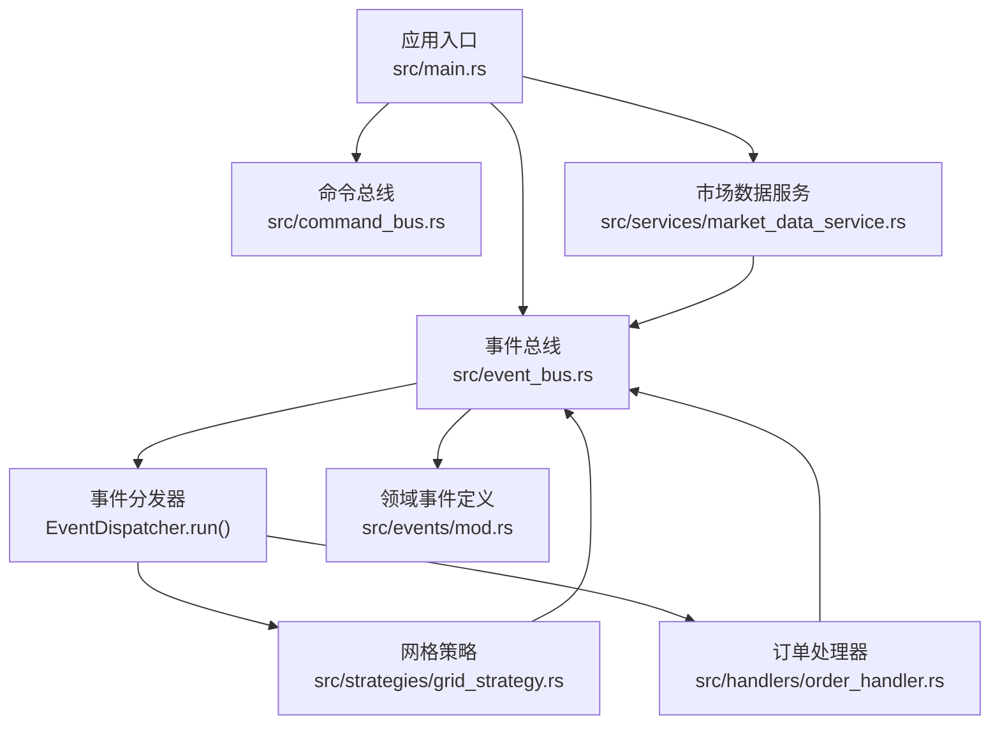
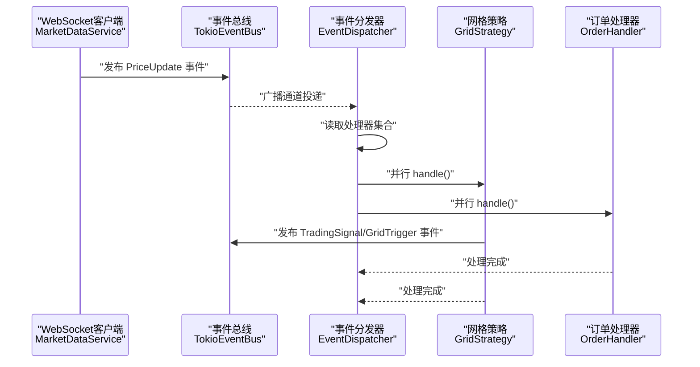
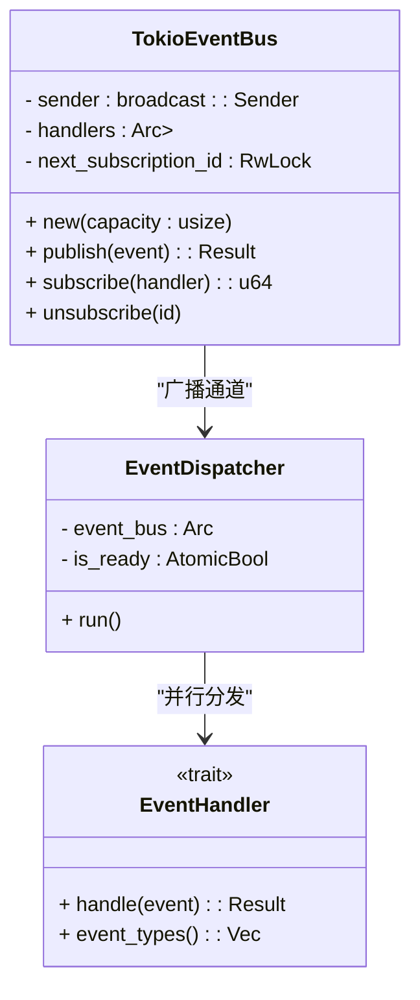
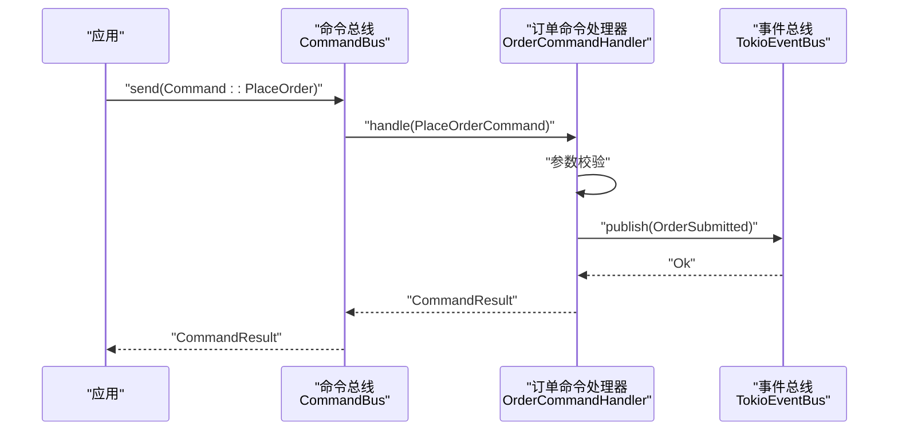
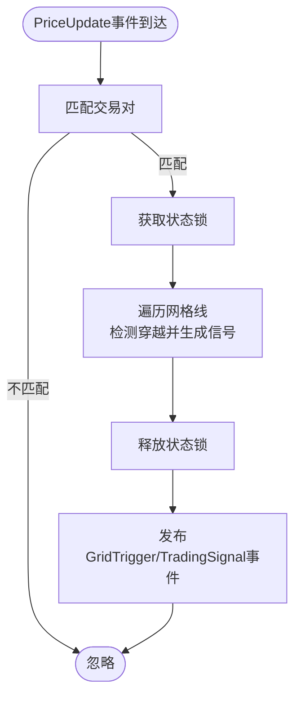
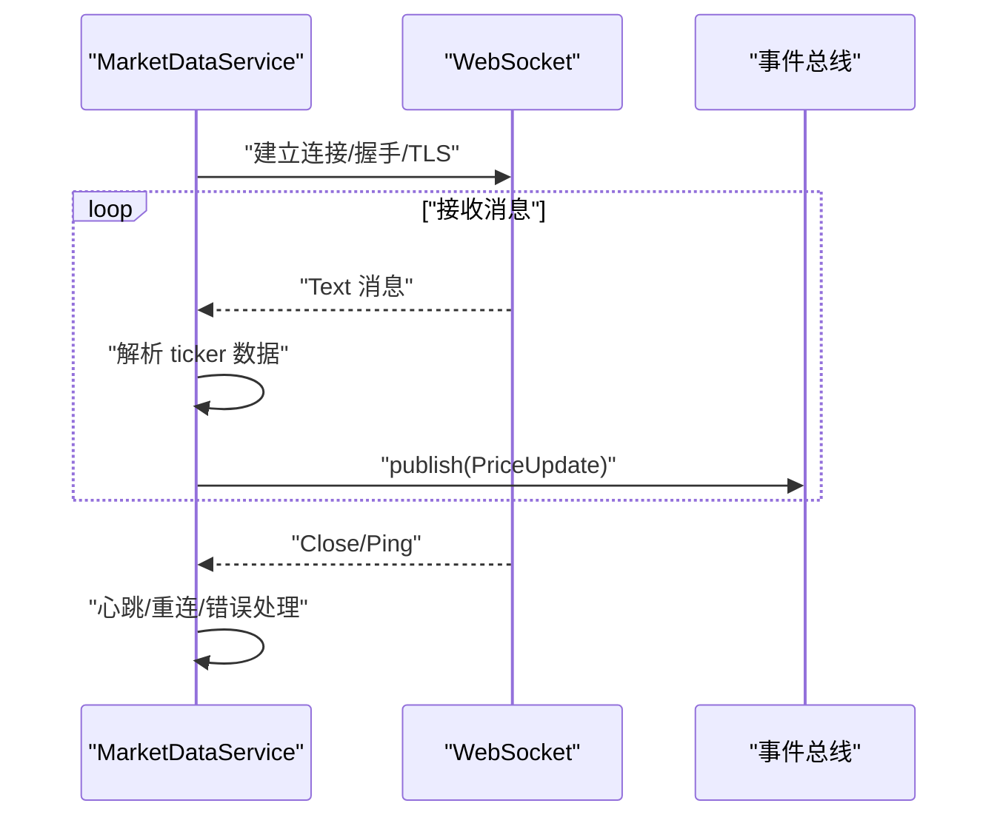
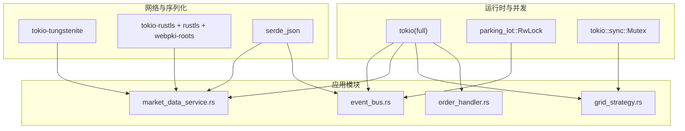
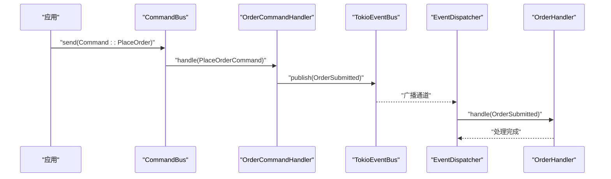

# 性能与扩展性

<cite>
**本文引用的文件**
- [src/main.rs](file://src/main.rs)
- [src/lib.rs](file://src/lib.rs)
- [src/event_bus.rs](file://src/event_bus.rs)
- [src/command_bus.rs](file://src/command_bus.rs)
- [src/handlers/order_handler.rs](file://src/handlers/order_handler.rs)
- [src/strategies/grid_strategy.rs](file://src/strategies/grid_strategy.rs)
- [src/services/market_data_service.rs](file://src/services/market_data_service.rs)
- [src/events/mod.rs](file://src/events/mod.rs)
- [src/events/market_events.rs](file://src/events/market_events.rs)
- [src/events/trading_events.rs](file://src/events/trading_events.rs)
- [Cargo.toml](file://Cargo.toml)
- [docs/CODE_EXPLANATION.md](file://docs/CODE_EXPLANATION.md)
- [docs/EVENT_DRIVEN_REFACTOR_GUIDE.md](file://docs/EVENT_DRIVEN_REFACTOR_GUIDE.md)
</cite>

## 目录
1. [引言](#引言)
2. [项目结构](#项目结构)
3. [核心组件](#核心组件)
4. [架构总览](#架构总览)
5. [详细组件分析](#详细组件分析)
6. [依赖关系分析](#依赖关系分析)
7. [性能考量](#性能考量)
8. [故障排查指南](#故障排查指南)
9. [结论](#结论)
10. [附录](#附录)

## 引言
本文件面向Binance Rust事件驱动交易系统的性能与扩展性设计，聚焦以下主题：
- 系统性能特征与瓶颈识别：事件处理吞吐量、内存使用效率、CPU利用率
- 异步并发模型：Tokio运行时、任务调度策略、资源管理
- 广播通道性能：容量配置与事件缓冲区对系统性能的影响
- 线程安全设计：Arc、RwLock、Mutex的使用场景与权衡
- 缓存与内存管理：事件处理器缓存、数据结构优化、垃圾回收影响
- 基准测试与监控：方法与指标定义
- 水平扩展：多实例部署、负载均衡、状态共享
- 垂直扩展：限制因素与优化策略
- 调优最佳实践与常见问题

## 项目结构
项目采用模块化组织，围绕事件驱动架构展开：
- 应用入口与演示：main.rs
- 事件总线与命令总线：event_bus.rs、command_bus.rs
- 事件与命令定义：events/、commands/
- 处理器与策略：handlers/、strategies/
- 领域服务：services/（如市场数据服务）
- 基础设施与依赖：Cargo.toml

**图表来源**
- [src/main.rs:10-93](file://src/main.rs#L10-L93)
- [src/event_bus.rs:112-158](file://src/event_bus.rs#L112-L158)
- [src/strategies/grid_strategy.rs:156-278](file://src/strategies/grid_strategy.rs#L156-L278)
- [src/handlers/order_handler.rs:9-91](file://src/handlers/order_handler.rs#L9-L91)
- [src/services/market_data_service.rs:304-374](file://src/services/market_data_service.rs#L304-L374)
- [src/events/mod.rs:48-89](file://src/events/mod.rs#L48-L89)

**章节来源**
- [src/lib.rs:1-9](file://src/lib.rs#L1-L9)
- [Cargo.toml:6-24](file://Cargo.toml#L6-L24)

## 核心组件
- 事件总线与分发器：基于Tokio广播通道，支持多订阅者并行处理
- 命令总线：将命令路由至对应处理器（当前实现下单命令）
- 策略与处理器：网格策略与订单处理器，均实现EventHandler
- 市场数据服务：WebSocket连接、心跳与消息解析，发布价格事件
- 事件定义：统一的DomainEvent枚举与事件元数据

**章节来源**
- [src/event_bus.rs:18-110](file://src/event_bus.rs#L18-L110)
- [src/command_bus.rs:5-19](file://src/command_bus.rs#L5-L19)
- [src/strategies/grid_strategy.rs:156-278](file://src/strategies/grid_strategy.rs#L156-L278)
- [src/handlers/order_handler.rs:9-91](file://src/handlers/order_handler.rs#L9-L91)
- [src/services/market_data_service.rs:34-42](file://src/services/market_data_service.rs#L34-L42)
- [src/events/mod.rs:48-89](file://src/events/mod.rs#L48-L89)

## 架构总览
事件驱动架构通过“事件生产者 → 事件总线 → 订阅者处理”的流水线实现解耦与扩展。

**图表来源**
- [src/services/market_data_service.rs:304-374](file://src/services/market_data_service.rs#L304-L374)
- [src/event_bus.rs:112-158](file://src/event_bus.rs#L112-L158)
- [src/strategies/grid_strategy.rs:264-278](file://src/strategies/grid_strategy.rs#L264-L278)
- [src/handlers/order_handler.rs:68-91](file://src/handlers/order_handler.rs#L68-L91)

## 详细组件分析

### 事件总线与分发器
- 广播通道：Tokio广播通道天然支持一对多广播，具备背压与丢弃旧消息的能力
- 并行分发：分发器读取处理器映射，对每个处理器创建异步任务并join_all并发执行
- 线程安全：处理器注册表使用Arc包裹的RwLock，读多写少场景下RwLock优于Mutex
- 容量控制：构造函数接受capacity参数，直接影响事件缓冲区大小与内存占用

**图表来源**
- [src/event_bus.rs:62-110](file://src/event_bus.rs#L62-L110)
- [src/event_bus.rs:112-158](file://src/event_bus.rs#L112-L158)
- [src/event_bus.rs:31-39](file://src/event_bus.rs#L31-L39)

**章节来源**
- [src/event_bus.rs:61-110](file://src/event_bus.rs#L61-L110)
- [src/event_bus.rs:112-158](file://src/event_bus.rs#L112-L158)
- [docs/CODE_EXPLANATION.md:126-268](file://docs/CODE_EXPLANATION.md#L126-L268)

### 命令总线与下单命令
- 命令路由：根据命令类型分派至对应处理器（当前支持下单命令）
- 参数校验与事件发布：下单命令处理器进行参数校验并通过事件总线发布订单提交事件
- 结果封装：CommandResult统一返回成功/失败/受理状态

**图表来源**
- [src/command_bus.rs:8-19](file://src/command_bus.rs#L8-L19)
- [src/handlers/order_handler.rs:93-137](file://src/handlers/order_handler.rs#L93-L137)
- [src/events/trading_events.rs:8-48](file://src/events/trading_events.rs#L8-L48)

**章节来源**
- [src/command_bus.rs:5-19](file://src/command_bus.rs#L5-L19)
- [src/handlers/order_handler.rs:93-137](file://src/handlers/order_handler.rs#L93-L137)

### 网格策略
- 状态保护：使用Arc<Mutex<GridState>>保证并发安全；策略内部在需要时才获取锁
- 事件驱动：监听PriceUpdate事件，计算穿越网格线产生的交易信号，并发布GridTrigger与TradingSignal
- 信号生成：按网格级别生成买入/卖出信号，设置止盈止损建议

**图表来源**
- [src/strategies/grid_strategy.rs:189-252](file://src/strategies/grid_strategy.rs#L189-L252)
- [src/strategies/grid_strategy.rs:156-182](file://src/strategies/grid_strategy.rs#L156-L182)

**章节来源**
- [src/strategies/grid_strategy.rs:156-278](file://src/strategies/grid_strategy.rs#L156-L278)

### 市场数据服务
- 连接模式：支持Auto/Direct/Proxy三种模式，自动检测HTTPS_PROXY或强制直连/代理
- WebSocket：支持单流与组合流，心跳Ping/Pong维持连接，异常自动重连
- 消息处理：解析Binance 24hrTicker消息，构建PriceUpdate事件并发布

**图表来源**
- [src/services/market_data_service.rs:116-178](file://src/services/market_data_service.rs#L116-L178)
- [src/services/market_data_service.rs:304-374](file://src/services/market_data_service.rs#L304-L374)
- [src/events/market_events.rs:7-18](file://src/events/market_events.rs#L7-L18)

**章节来源**
- [src/services/market_data_service.rs:23-42](file://src/services/market_data_service.rs#L23-L42)
- [src/services/market_data_service.rs:116-178](file://src/services/market_data_service.rs#L116-L178)
- [src/services/market_data_service.rs:304-374](file://src/services/market_data_service.rs#L304-L374)

### 事件定义与序列化
- DomainEvent统一聚合所有事件类型，便于总线分发与序列化
- 事件元数据包含唯一ID、时间戳、版本、关联ID等，便于追踪与审计

**章节来源**
- [src/events/mod.rs:48-89](file://src/events/mod.rs#L48-L89)
- [src/events/mod.rs:21-46](file://src/events/mod.rs#L21-L46)

## 依赖关系分析
- 运行时与并发：Tokio提供异步运行时、广播通道、通知与select宏
- 同步原语：parking_lot::RwLock用于高并发读写场景；tokio::sync::Mutex用于策略内部状态保护
- 网络与序列化：tokio-tungstenite、rustls/webpki-roots、serde_json用于WebSocket与TLS、JSON解析
- 依赖版本：Cargo.toml集中声明，确保版本一致性

**图表来源**
- [Cargo.toml:7-24](file://Cargo.toml#L7-L24)
- [src/event_bus.rs:5-10](file://src/event_bus.rs#L5-L10)
- [src/services/market_data_service.rs:8-21](file://src/services/market_data_service.rs#L8-L21)
- [src/strategies/grid_strategy.rs:12-13](file://src/strategies/grid_strategy.rs#L12-L13)

**章节来源**
- [Cargo.toml:6-24](file://Cargo.toml#L6-L24)

## 性能考量

### 事件处理吞吐量
- 广播通道容量：TokioEventBus::new(capacity)决定事件缓冲区大小，容量过小会导致丢弃，过大增加内存占用
- 并行分发：EventDispatcher对所有处理器使用join_all并发执行，提升吞吐但需注意处理器内部阻塞与IO
- 事件类型过滤：EventHandler::event_types用于减少无关事件处理开销

优化建议
- 根据峰值事件速率估算容量，结合丢弃率与延迟目标进行A/B测试
- 控制处理器内部同步范围，避免RwLock/Mutex长时间持有
- 对耗时任务拆分为子任务或后台作业，保持事件循环轻量

**章节来源**
- [src/event_bus.rs:69-85](file://src/event_bus.rs#L69-L85)
- [src/event_bus.rs:129-158](file://src/event_bus.rs#L129-L158)
- [src/event_bus.rs:31-39](file://src/event_bus.rs#L31-L39)

### 内存使用效率
- Arc共享所有权：处理器与事件总线之间广泛使用Arc，避免不必要的克隆
- RwLock读多写少：处理器注册表使用RwLock，降低写锁竞争
- 策略状态锁粒度：GridStrategy内部使用Arc<Mutex<>>保护状态，仅在必要时加锁
- 事件序列化：使用Serde JSON，注意大事件的序列化成本

优化建议
- 事件尽量小而专一，避免携带冗余字段
- 使用Copy类型或紧凑结构，减少堆分配
- 对热点路径进行内存分配统计与热点分析

**章节来源**
- [src/event_bus.rs:65-67](file://src/event_bus.rs#L65-L67)
- [src/strategies/grid_strategy.rs:159-162](file://src/strategies/grid_strategy.rs#L159-L162)

### CPU利用率
- 异步I/O：Tokio运行时高效处理网络与文件I/O，避免阻塞线程
- 并发模型：广播通道+join_all并行分发，充分利用多核
- 心跳与选择：tokio::select!在消息与心跳之间公平调度

优化建议
- 避免在事件处理中执行长耗时同步操作
- 将外部API调用、数据库写入等放入独立任务
- 使用合适的并发度，避免过度并行导致上下文切换开销

**章节来源**
- [src/services/market_data_service.rs:411-432](file://src/services/market_data_service.rs#L411-L432)
- [src/event_bus.rs:142-148](file://src/event_bus.rs#L142-L148)

### 广播通道容量配置
- 容量与背压：容量过小易丢弃，容量过大占用内存且GC压力增大
- 事件缓冲策略：结合事件产生速率与处理速率，预留一定余量
- 监控指标：丢弃计数、队列长度、处理延迟

调优步骤
- 基准测试：在不同容量下测量丢弃率与延迟
- 观察指标：丢弃计数、事件积压、处理器完成时间分布
- 动态调整：根据运行时指标动态调整容量

**章节来源**
- [src/event_bus.rs:71-84](file://src/event_bus.rs#L71-L84)

### 线程安全设计与权衡
- Arc：共享所有权，零开销克隆，适合跨任务传递
- RwLock：读多写少场景下读性能更佳
- Mutex：严格互斥，适合细粒度状态保护（如策略内部状态）

最佳实践
- 读多写少使用RwLock，写多读少或临界区较大考虑Mutex
- 将共享状态最小化，尽量使用不可变数据与消息传递
- 避免死锁：固定加锁顺序，缩短持有锁的时间

**章节来源**
- [src/event_bus.rs:65-67](file://src/event_bus.rs#L65-L67)
- [src/strategies/grid_strategy.rs:159-162](file://src/strategies/grid_strategy.rs#L159-L162)

### 缓存策略与内存管理
- 事件处理器缓存：通过Arc共享处理器实例，减少重复创建
- 数据结构优化：使用紧凑的事件结构，避免深层嵌套与大对象复制
- 垃圾回收影响：减少临时对象与短生命周期分配，降低GC压力

**章节来源**
- [src/event_bus.rs:24-25](file://src/event_bus.rs#L24-L25)
- [src/events/mod.rs:48-89](file://src/events/mod.rs#L48-L89)

### 基准测试与监控指标
- 基准测试方法
  - 事件吞吐：模拟高并发事件发布，测量QPS与尾延迟
  - 容量测试：逐步增大广播通道容量，观察丢弃率与内存
  - 并发度测试：改变处理器数量，评估并行收益与开销
- 监控指标
  - 事件总线：发布QPS、接收QPS、丢弃计数、队列长度
  - 处理器：处理延迟P50/P95/P99、失败率、并发度
  - 网络：连接成功率、重连次数、心跳丢失率
  - 资源：CPU使用率、内存占用、GC暂停时间

**章节来源**
- [docs/EVENT_DRIVEN_REFACTOR_GUIDE.md:542-560](file://docs/EVENT_DRIVEN_REFACTOR_GUIDE.md#L542-L560)

### 水平扩展能力
- 多实例部署：每个实例拥有独立事件总线与处理器，通过外部消息总线或事件存储实现跨实例事件传播
- 负载均衡：在上游接入统一的事件网关，按事件类型或聚合根分片
- 状态共享：将共享状态迁移到外部存储（如数据库/缓存），实例间通过事件重放重建状态

**章节来源**
- [docs/EVENT_DRIVEN_REFACTOR_GUIDE.md:72-104](file://docs/EVENT_DRIVEN_REFACTOR_GUIDE.md#L72-L104)

### 垂直扩展限制与优化
- 限制因素：CPU核数、内存带宽、网络I/O、锁竞争
- 优化策略：减少锁持有时间、拆分热点、引入无锁容器、优化序列化

**章节来源**
- [docs/EVENT_DRIVEN_REFACTOR_GUIDE.md:33-48](file://docs/EVENT_DRIVEN_REFACTOR_GUIDE.md#L33-L48)

## 故障排查指南
- 事件未到达：检查EventDispatcher是否就绪、广播通道容量是否过小、处理器是否正确订阅
- 处理器崩溃：EventDispatcher对单个处理器失败进行错误打印，不影响其他处理器；检查处理器内部异常处理
- WebSocket断连：服务内置自动重连与心跳，关注重连间隔与失败日志
- 订阅无响应：确认事件类型过滤与订阅ID有效性

**章节来源**
- [src/event_bus.rs:129-158](file://src/event_bus.rs#L129-L158)
- [src/services/market_data_service.rs:96-114](file://src/services/market_data_service.rs#L96-L114)
- [src/services/market_data_service.rs:411-432](file://src/services/market_data_service.rs#L411-L432)

## 结论
本项目采用事件驱动架构与Tokio运行时，通过广播通道实现高吞吐、低耦合的事件分发。在性能方面，合理配置广播通道容量、优化处理器并发与锁粒度、控制事件序列化成本是关键。扩展性方面，可通过多实例与外部事件网关实现水平扩展，同时将共享状态外置以支持状态共享。建议持续进行基准测试与监控，结合运行时指标迭代优化。

## 附录

### 关键流程图：下单命令到事件发布的端到端

**图表来源**
- [src/command_bus.rs:14-18](file://src/command_bus.rs#L14-L18)
- [src/handlers/order_handler.rs:102-135](file://src/handlers/order_handler.rs#L102-L135)
- [src/event_bus.rs:129-158](file://src/event_bus.rs#L129-L158)
- [src/handlers/order_handler.rs:68-91](file://src/handlers/order_handler.rs#L68-L91)