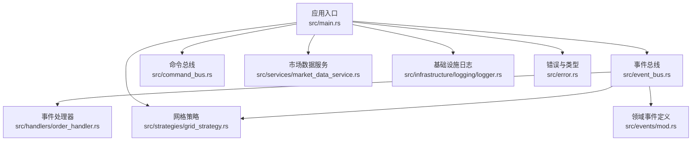
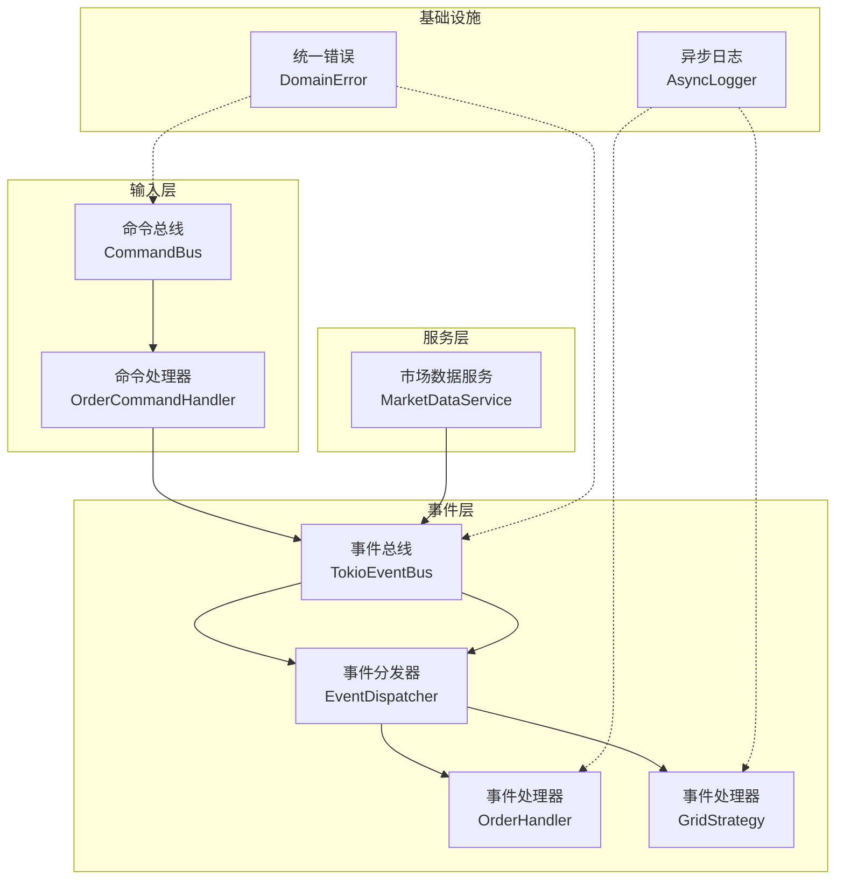
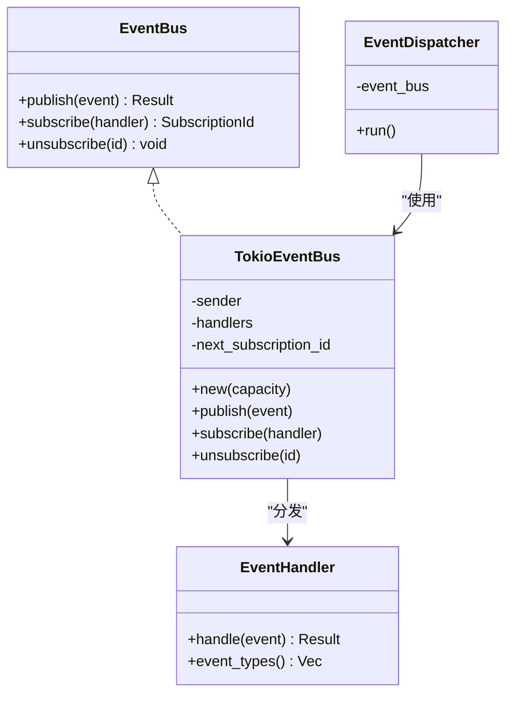
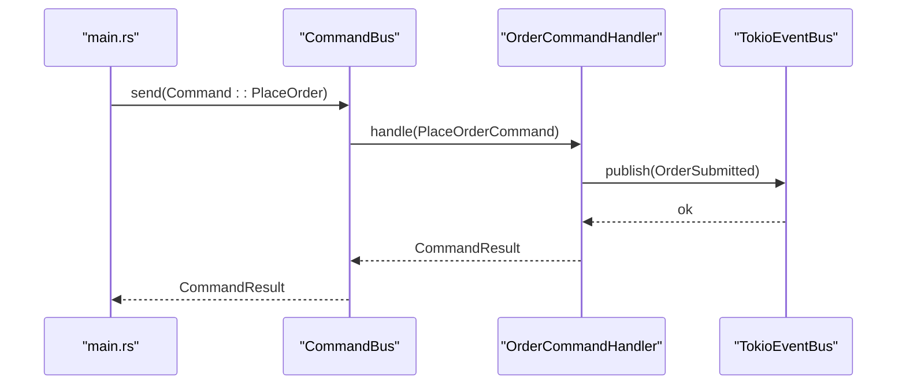
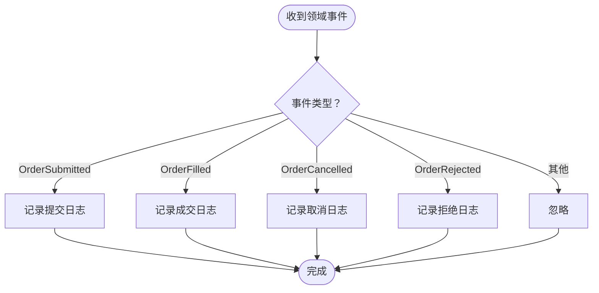
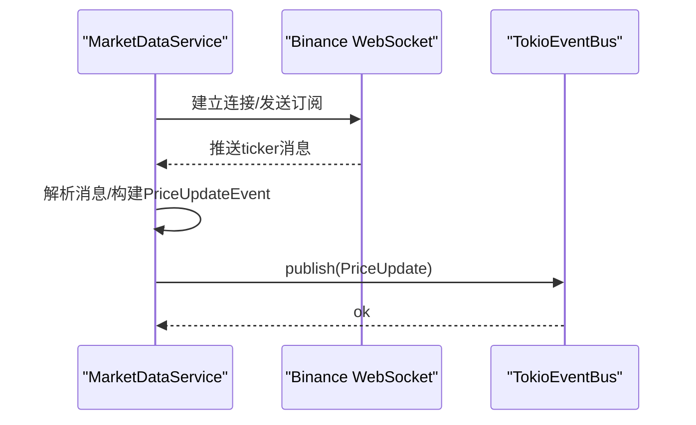
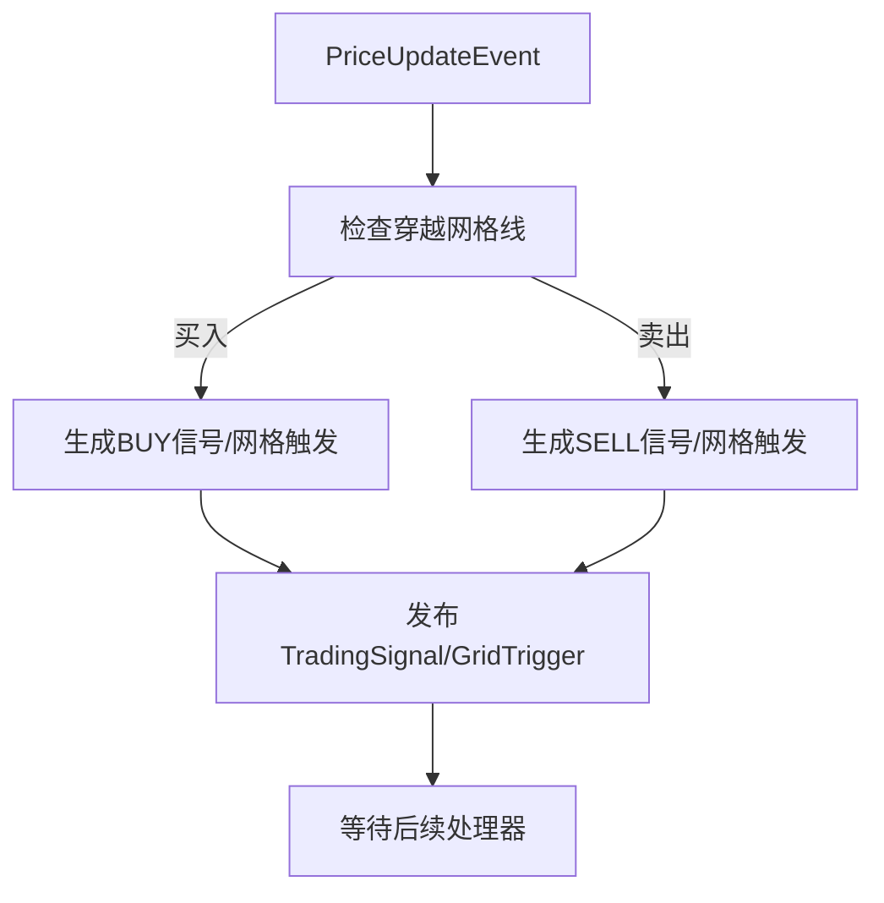
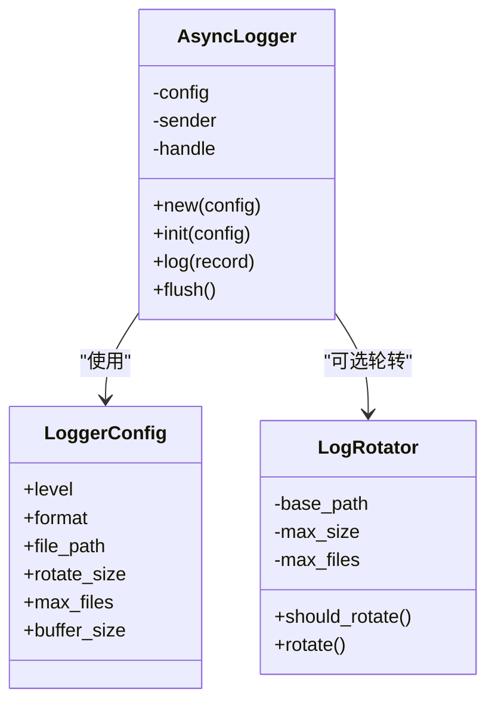
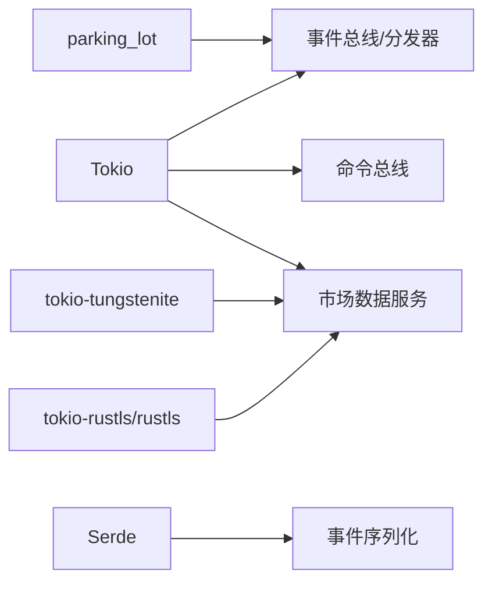

# 架构设计

<cite>
**本文引用的文件**
- [src/lib.rs](file://src/lib.rs)
- [src/main.rs](file://src/main.rs)
- [src/event_bus.rs](file://src/event_bus.rs)
- [src/command_bus.rs](file://src/command_bus.rs)
- [src/handlers/order_handler.rs](file://src/handlers/order_handler.rs)
- [src/events/mod.rs](file://src/events/mod.rs)
- [src/events/trading_events.rs](file://src/events/trading_events.rs)
- [src/services/market_data_service.rs](file://src/services/market_data_service.rs)
- [src/strategies/grid_strategy.rs](file://src/strategies/grid_strategy.rs)
- [src/infrastructure/logging/logger.rs](file://src/infrastructure/logging/logger.rs)
- [src/error.rs](file://src/error.rs)
- [Cargo.toml](file://Cargo.toml)
- [docs/CODE_EXPLANATION.md](file://docs/CODE_EXPLANATION.md)
- [docs/EVENT_DRIVEN_REFACTOR_GUIDE.md](file://docs/EVENT_DRIVEN_REFACTOR_GUIDE.md)
</cite>

## 目录
1. [引言](#引言)
2. [项目结构](#项目结构)
3. [核心组件](#核心组件)
4. [架构总览](#架构总览)
5. [详细组件分析](#详细组件分析)
6. [依赖分析](#依赖分析)
7. [性能考量](#性能考量)
8. [故障排查指南](#故障排查指南)
9. [结论](#结论)
10. [附录](#附录)

## 引言
本项目是一个基于事件驱动架构（EDA）、结合命令查询职责分离（CQRS）思想的量化交易系统，围绕Binance实时行情与网格策略展开。系统通过事件总线实现模块解耦，通过命令总线处理外部输入，通过策略引擎与服务层协同完成交易闭环，并辅以基础设施层的日志、错误与配置管理。

## 项目结构
项目采用按职责分层与按功能模块划分相结合的组织方式：
- 应用入口与装配：main.rs
- 事件与事件总线：event_bus.rs、events/mod.rs
- 命令与命令总线：command_bus.rs、commands/mod.rs
- 处理器：handlers/order_handler.rs
- 服务层：services/market_data_service.rs
- 策略引擎：strategies/grid_strategy.rs
- 基础设施：infrastructure/logging/logger.rs
- 错误与类型：error.rs
- 依赖与运行时：Cargo.toml
- 文档：docs/CODE_EXPLANATION.md、docs/EVENT_DRIVEN_REFACTOR_GUIDE.md

**图表来源**
- [src/main.rs:1-93](file://src/main.rs#L1-L93)
- [src/event_bus.rs:1-257](file://src/event_bus.rs#L1-L257)
- [src/command_bus.rs:1-19](file://src/command_bus.rs#L1-L19)
- [src/services/market_data_service.rs:1-503](file://src/services/market_data_service.rs#L1-L503)
- [src/strategies/grid_strategy.rs:1-401](file://src/strategies/grid_strategy.rs#L1-L401)
- [src/handlers/order_handler.rs:1-137](file://src/handlers/order_handler.rs#L1-L137)
- [src/events/mod.rs:1-102](file://src/events/mod.rs#L1-L102)
- [src/infrastructure/logging/logger.rs:1-415](file://src/infrastructure/logging/logger.rs#L1-L415)
- [src/error.rs:1-169](file://src/error.rs#L1-L169)

**章节来源**
- [src/lib.rs:1-9](file://src/lib.rs#L1-L9)
- [Cargo.toml:1-27](file://Cargo.toml#L1-L27)

## 核心组件
- 事件总线与事件分发器：提供发布/订阅与并行分发能力，支撑事件驱动解耦。
- 命令总线与命令处理器：接收外部命令，校验后发布领域事件，形成CQRS中的命令侧。
- 事件处理器：消费特定领域事件，执行副作用（如日志、持久化占位、后续策略触发）。
- 市场数据服务：连接Binance WebSocket，解析行情，发布价格事件。
- 策略引擎（网格策略）：订阅价格事件，根据网格规则生成交易信号与网格触发事件。
- 基础设施日志：异步日志记录器，支持文本/JSON格式、文件轮转与缓冲。
- 错误与类型：统一错误类型与便捷宏，便于跨层传播与处理。

**章节来源**
- [src/event_bus.rs:18-158](file://src/event_bus.rs#L18-L158)
- [src/command_bus.rs:5-19](file://src/command_bus.rs#L5-L19)
- [src/handlers/order_handler.rs:9-137](file://src/handlers/order_handler.rs#L9-L137)
- [src/services/market_data_service.rs:34-114](file://src/services/market_data_service.rs#L34-L114)
- [src/strategies/grid_strategy.rs:156-278](file://src/strategies/grid_strategy.rs#L156-L278)
- [src/infrastructure/logging/logger.rs:140-338](file://src/infrastructure/logging/logger.rs#L140-L338)
- [src/error.rs:12-169](file://src/error.rs#L12-L169)

## 架构总览
系统采用事件驱动与CQRS混合模式：
- 输入侧（命令）：命令总线接收命令，命令处理器校验并发布领域事件。
- 输出侧（事件）：事件总线并行分发至各事件处理器；策略引擎订阅价格事件生成信号事件。
- 服务层：市场数据服务负责实时行情接入；策略引擎负责信号生成；未来可扩展风控、订单执行等服务。
- 基础设施：日志、错误、配置与运行时（Tokio）。

**图表来源**
- [src/command_bus.rs:5-19](file://src/command_bus.rs#L5-L19)
- [src/handlers/order_handler.rs:93-137](file://src/handlers/order_handler.rs#L93-L137)
- [src/event_bus.rs:62-158](file://src/event_bus.rs#L62-L158)
- [src/services/market_data_service.rs:34-114](file://src/services/market_data_service.rs#L34-L114)
- [src/infrastructure/logging/logger.rs:140-338](file://src/infrastructure/logging/logger.rs#L140-L338)
- [src/error.rs:12-169](file://src/error.rs#L12-L169)

## 详细组件分析

### 事件总线与事件分发器
- 事件总线接口定义发布/订阅能力，支持动态处理器注册与过滤。
- 基于Tokio广播通道实现一对多事件分发，内部维护处理器映射与订阅ID。
- 事件分发器独立运行，从广播通道接收事件并并行调用所有处理器，错误独立处理，互不影响。

**图表来源**
- [src/event_bus.rs:18-158](file://src/event_bus.rs#L18-L158)

**章节来源**
- [src/event_bus.rs:18-158](file://src/event_bus.rs#L18-L158)

### 命令总线与命令处理器
- 命令总线封装单一命令处理入口，当前实现仅覆盖下单命令。
- 命令处理器负责参数校验、构造领域事件并发布到事件总线，返回统一命令结果类型。

**图表来源**
- [src/command_bus.rs:5-19](file://src/command_bus.rs#L5-L19)
- [src/handlers/order_handler.rs:93-137](file://src/handlers/order_handler.rs#L93-L137)
- [src/event_bus.rs:88-110](file://src/event_bus.rs#L88-L110)

**章节来源**
- [src/command_bus.rs:5-19](file://src/command_bus.rs#L5-L19)
- [src/handlers/order_handler.rs:93-137](file://src/handlers/order_handler.rs#L93-L137)

### 事件处理器（订单）
- 订单处理器订阅订单生命周期事件，负责记录日志与占位的后续处理（如持久化、状态更新、风控联动等）。

**图表来源**
- [src/handlers/order_handler.rs:16-91](file://src/handlers/order_handler.rs#L16-L91)

**章节来源**
- [src/handlers/order_handler.rs:16-91](file://src/handlers/order_handler.rs#L16-L91)

### 市场数据服务（WebSocket）
- 支持单流/组合流订阅，自动重连与心跳保活，支持HTTP CONNECT代理隧道与直连TLS握手。
- 解析Binance 24hrTicker消息，构造价格事件并发布到事件总线。

**图表来源**
- [src/services/market_data_service.rs:96-178](file://src/services/market_data_service.rs#L96-L178)
- [src/services/market_data_service.rs:303-407](file://src/services/market_data_service.rs#L303-L407)

**章节来源**
- [src/services/market_data_service.rs:96-178](file://src/services/market_data_service.rs#L96-L178)
- [src/services/market_data_service.rs:303-407](file://src/services/market_data_service.rs#L303-L407)

### 策略引擎（网格策略）
- 订阅价格事件，按网格区间与间距生成交易信号与网格触发事件，当前阶段仅打印信号，不执行下单。
- 通过事件总线发布信号事件，供后续风控/执行模块消费。

**图表来源**
- [src/strategies/grid_strategy.rs:189-252](file://src/strategies/grid_strategy.rs#L189-L252)

**章节来源**
- [src/strategies/grid_strategy.rs:189-252](file://src/strategies/grid_strategy.rs#L189-L252)

### 基础设施（日志）
- 异步日志记录器在独立线程中落盘，支持文本/JSON格式、文件轮转与缓冲，保证主线程非阻塞。
- 提供配置项：日志级别、格式、文件路径、轮转大小、最大文件数、缓冲区大小。

**图表来源**
- [src/infrastructure/logging/logger.rs:17-138](file://src/infrastructure/logging/logger.rs#L17-L138)
- [src/infrastructure/logging/logger.rs:140-338](file://src/infrastructure/logging/logger.rs#L140-L338)

**章节来源**
- [src/infrastructure/logging/logger.rs:17-138](file://src/infrastructure/logging/logger.rs#L17-L138)
- [src/infrastructure/logging/logger.rs:140-338](file://src/infrastructure/logging/logger.rs#L140-L338)

### 错误与类型
- 统一错误类型DomainError，分层映射基础设施、事件总线、命令总线、服务错误，便于跨层传播与定位。
- 提供便捷的错误创建与转换宏，简化调用端处理。

**章节来源**
- [src/error.rs:12-169](file://src/error.rs#L12-L169)

## 依赖分析
- 运行时与并发：Tokio提供异步运行时、广播通道、select!并发调度。
- 序列化：Serde用于事件与配置的序列化/反序列化。
- 网络：tokio-tungstenite、tokio-rustls、rustls/webpki-roots用于WebSocket/TLS。
- 并发原语：parking_lot的RwLock、DashMap等提升并发性能。
- 日志：log、env_logger配合自定义异步日志器。

**图表来源**
- [Cargo.toml:6-25](file://Cargo.toml#L6-L25)
- [src/event_bus.rs:8-10](file://src/event_bus.rs#L8-L10)
- [src/services/market_data_service.rs:8-21](file://src/services/market_data_service.rs#L8-L21)

**章节来源**
- [Cargo.toml:6-25](file://Cargo.toml#L6-L25)

## 性能考量
- 异步与并行：事件分发器使用并行future聚合处理，提升吞吐；Tokio广播通道天然具备背压与零拷贝友好性。
- 内存与序列化：事件采用紧凑结构体与Serde序列化，避免不必要的克隆；日志异步落盘降低I/O阻塞。
- 网络与实时性：WebSocket长连接+心跳保活，相比轮询显著降低延迟；代理隧道支持复杂网络环境。
- 可扩展性：事件驱动解耦，新增策略/处理器仅需订阅事件，不修改既有代码；命令侧可扩展更多命令类型。

[本节为通用性能讨论，无需“章节来源”]

## 故障排查指南
- 事件总线
  - 发布失败：检查广播通道容量与订阅者数量，关注背压与处理器异常。
  - 订阅/取消订阅：确认订阅ID正确分配与释放，避免悬挂处理器。
- 命令总线
  - 参数校验失败：检查命令参数合法性与类型转换。
  - 发布事件失败：检查事件总线状态与通道可用性。
- 市场数据服务
  - 连接失败/超时：检查代理配置、TLS握手、网络可达性与超时设置。
  - 心跳失败：确认Ping/Pong往返与心跳触发逻辑。
- 策略引擎
  - 信号未生成：检查网格配置、价格穿越判断与事件订阅。
- 日志
  - 异步写入失败：检查文件权限、磁盘空间与轮转配置。
- 错误传播
  - 使用统一错误类型定位来源模块，结合错误上下文快速定位。

**章节来源**
- [src/error.rs:12-169](file://src/error.rs#L12-L169)
- [src/event_bus.rs:88-158](file://src/event_bus.rs#L88-L158)
- [src/services/market_data_service.rs:116-178](file://src/services/market_data_service.rs#L116-L178)
- [src/infrastructure/logging/logger.rs:140-338](file://src/infrastructure/logging/logger.rs#L140-L338)

## 结论
该系统以事件驱动为核心，结合CQRS与分层架构，实现了从实时行情接入到策略信号生成的完整链路。事件总线与并行分发提升了系统解耦与吞吐；命令总线保证输入侧的可扩展与可追踪；基础设施层提供可靠的日志与错误处理。未来可在风控、订单执行、事件存储与监控方面进一步完善，形成更完整的事件溯源与可观测体系。

[本节为总结性内容，无需“章节来源”]

## 附录
- 与同类系统的差异与优势
  - 事件驱动：模块间松耦合，易于扩展与替换；对比传统函数调用驱动，具备更好的可维护性与可测试性。
  - CQRS：命令与查询分离，便于针对不同场景优化；策略与执行解耦，利于并行与扩展。
  - 实时性：WebSocket长连接与心跳保活，显著优于轮询；事件总线并行分发提升响应速度。
  - 并发模型：Tokio异步运行时与广播通道，兼顾高并发与低延迟。
  - 安全与合规：代理隧道支持、TLS握手、统一错误与日志，便于审计与合规。

**章节来源**
- [docs/CODE_EXPLANATION.md:75-762](file://docs/CODE_EXPLANATION.md#L75-L762)
- [docs/EVENT_DRIVEN_REFACTOR_GUIDE.md:72-191](file://docs/EVENT_DRIVEN_REFACTOR_GUIDE.md#L72-L191)