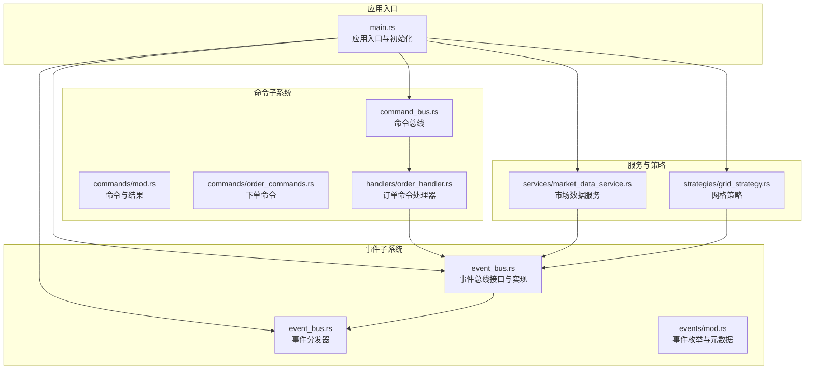
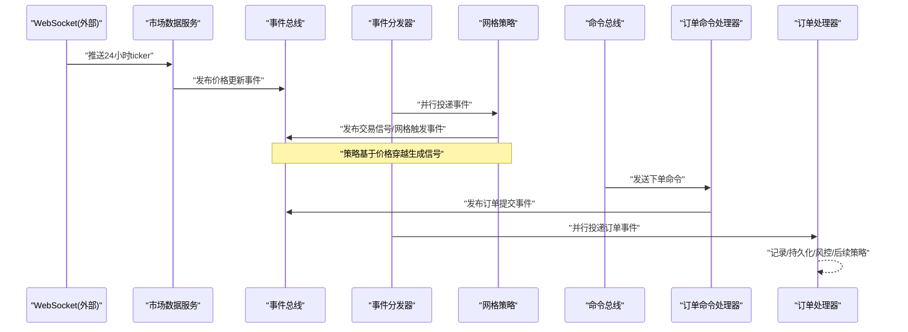
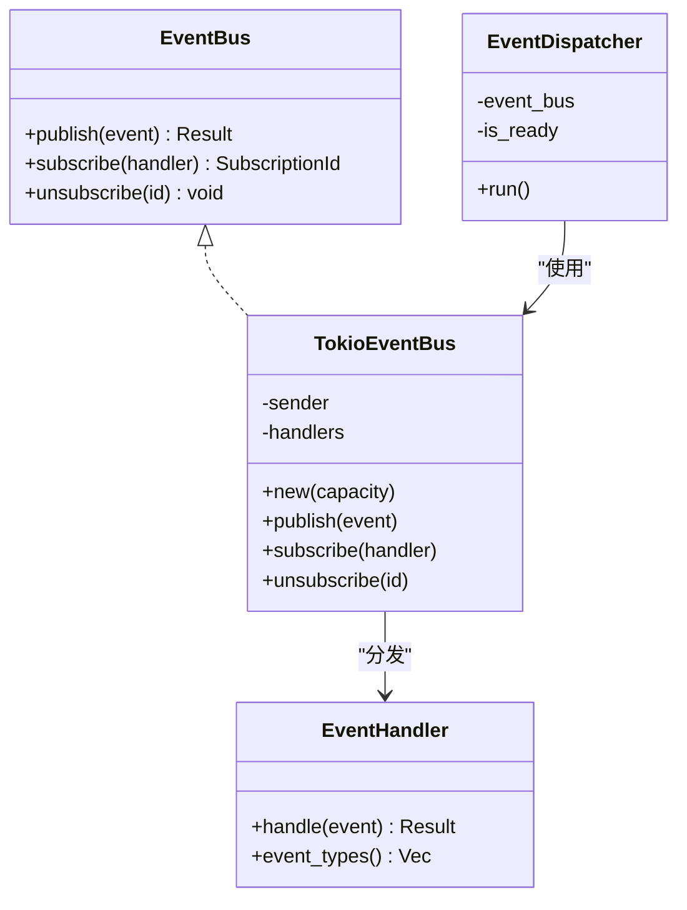
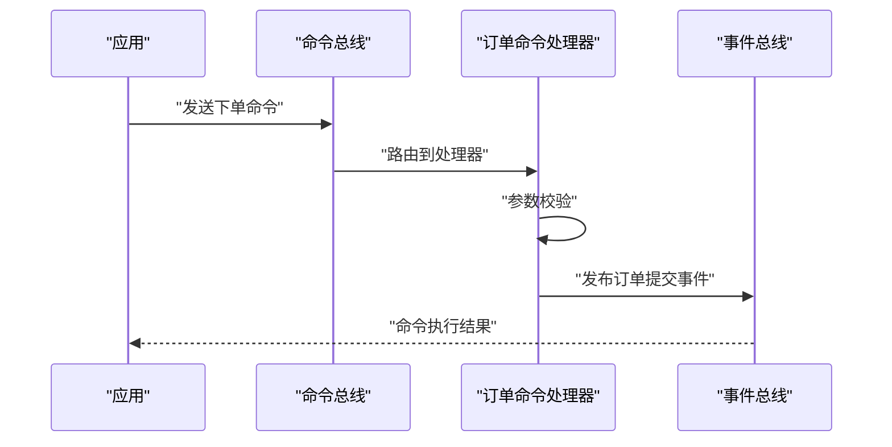
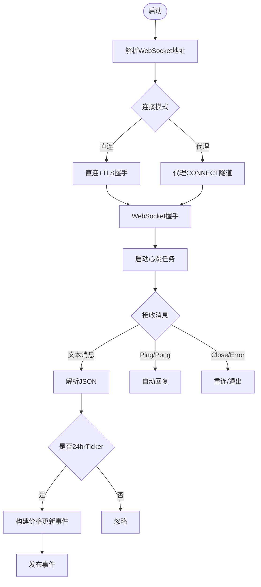
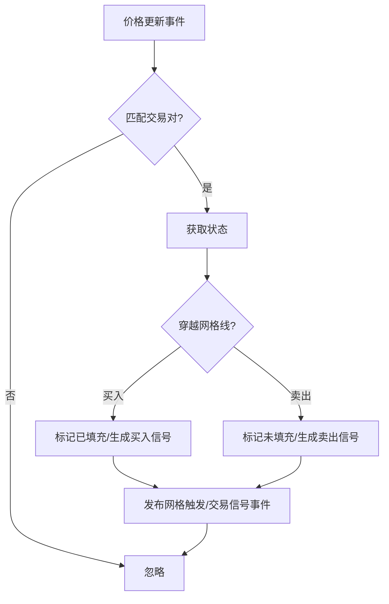
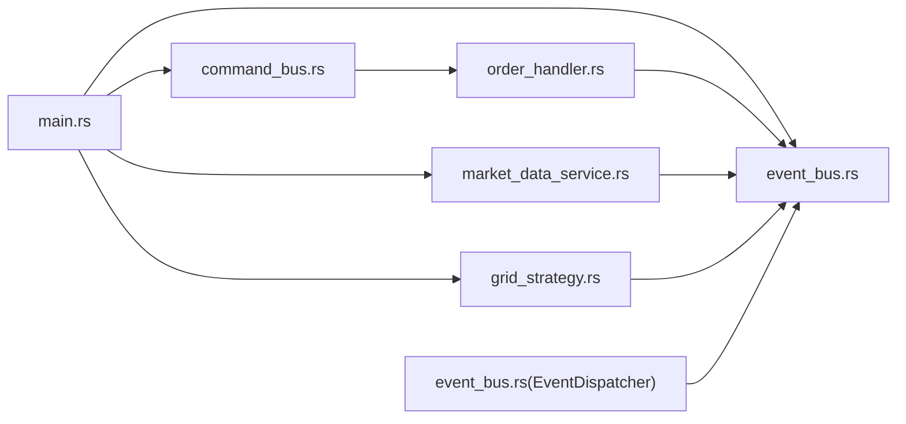

# 组件交互关系

<cite>
**本文引用的文件**
- [src/lib.rs](file://src/lib.rs)
- [src/main.rs](file://src/main.rs)
- [src/event_bus.rs](file://src/event_bus.rs)
- [src/command_bus.rs](file://src/command_bus.rs)
- [src/services/market_data_service.rs](file://src/services/market_data_service.rs)
- [src/strategies/grid_strategy.rs](file://src/strategies/grid_strategy.rs)
- [src/handlers/order_handler.rs](file://src/handlers/order_handler.rs)
- [src/events/mod.rs](file://src/events/mod.rs)
- [src/commands/mod.rs](file://src/commands/mod.rs)
- [src/commands/order_commands.rs](file://src/commands/order_commands.rs)
- [Cargo.toml](file://Cargo.toml)
</cite>

## 目录
1. [引言](#引言)
2. [项目结构](#项目结构)
3. [核心组件](#核心组件)
4. [架构总览](#架构总览)
5. [详细组件分析](#详细组件分析)
6. [依赖分析](#依赖分析)
7. [性能考量](#性能考量)
8. [故障排查指南](#故障排查指南)
9. [结论](#结论)
10. [附录](#附录)

## 引言
本文件面向Binance Rust事件驱动交易系统的组件交互关系，聚焦以下主题：
- 事件总线与事件处理器：事件的发布、订阅、分发与并行处理
- 命令总线与命令处理器：命令的路由与执行
- 市场数据服务与策略引擎：实时行情驱动交易信号
- 订单处理器与外部系统的协作：事件驱动的订单生命周期
- 数据流与控制流：从市场数据到交易信号再到订单命令的完整链路
- 组件解耦机制：接口抽象、异步通信与事件驱动的消息传递
- 生命周期管理：初始化顺序、依赖注入与资源清理
- 性能与扩展性：消息队列、缓冲区管理、背压处理与插件化架构

## 项目结构
项目采用按职责分层与功能模块划分相结合的方式组织代码，核心模块如下：
- 事件与事件总线：事件定义、事件总线接口与实现、事件分发器
- 命令与命令总线：命令定义、命令结果、命令总线与命令处理器
- 服务：市场数据服务（WebSocket接入、代理/直连、心跳与消息解析）
- 策略：网格策略（基于价格穿越生成交易信号）
- 处理器：订单处理器（处理订单生命周期事件）
- 基础设施与错误：日志、错误类型等

图表来源
- [src/main.rs:10-93](file://src/main.rs#L10-L93)
- [src/event_bus.rs:18-158](file://src/event_bus.rs#L18-L158)
- [src/command_bus.rs:5-19](file://src/command_bus.rs#L5-L19)
- [src/services/market_data_service.rs:35-440](file://src/services/market_data_service.rs#L35-L440)
- [src/strategies/grid_strategy.rs:159-278](file://src/strategies/grid_strategy.rs#L159-L278)
- [src/handlers/order_handler.rs:93-137](file://src/handlers/order_handler.rs#L93-L137)
- [src/events/mod.rs:48-89](file://src/events/mod.rs#L48-L89)
- [src/commands/mod.rs:6-77](file://src/commands/mod.rs#L6-L77)
- [src/commands/order_commands.rs:37-72](file://src/commands/order_commands.rs#L37-L72)

章节来源
- [src/lib.rs:1-9](file://src/lib.rs#L1-L9)
- [src/main.rs:10-93](file://src/main.rs#L10-L93)
- [Cargo.toml:1-27](file://Cargo.toml#L1-L27)

## 核心组件
- 事件总线与分发器
  - 事件总线接口定义发布、订阅、取消订阅能力；TokioEventBus基于广播通道实现，具备容量控制与并发分发
  - 事件分发器负责从广播通道接收事件并并行调用所有订阅处理器，同时处理错误
- 命令总线与命令处理器
  - 命令总线根据命令类型路由至对应处理器；当前实现支持下单命令
  - 订单命令处理器校验参数、构造订单提交事件并发布，模拟外部API调用
- 市场数据服务
  - 通过WebSocket接入Binance，支持直连与代理模式，自动重连与心跳维持，解析24小时ticker并发布价格更新事件
- 策略引擎（网格策略）
  - 基于价格穿越网格线生成交易信号与网格触发事件，供后续处理器消费
- 订单处理器
  - 订阅订单生命周期事件，记录日志并预留扩展点（持久化、风控、后续策略）

章节来源
- [src/event_bus.rs:18-158](file://src/event_bus.rs#L18-L158)
- [src/command_bus.rs:5-19](file://src/command_bus.rs#L5-L19)
- [src/services/market_data_service.rs:96-440](file://src/services/market_data_service.rs#L96-L440)
- [src/strategies/grid_strategy.rs:159-278](file://src/strategies/grid_strategy.rs#L159-L278)
- [src/handlers/order_handler.rs:16-91](file://src/handlers/order_handler.rs#L16-L91)

## 架构总览
系统采用事件驱动架构，围绕事件总线构建松耦合的组件网络。数据与控制流自外向内推进：
- 外部系统（Binance WebSocket）产生市场数据事件
- 策略订阅价格事件，生成交易信号与网格触发事件
- 订单命令由上层业务或策略触发，经命令总线路由到订单命令处理器
- 订单命令处理器发布订单提交事件
- 订单处理器订阅并处理订单生命周期事件，完成闭环

图表来源
- [src/services/market_data_service.rs:376-440](file://src/services/market_data_service.rs#L376-L440)
- [src/strategies/grid_strategy.rs:189-252](file://src/strategies/grid_strategy.rs#L189-L252)
- [src/command_bus.rs:14-18](file://src/command_bus.rs#L14-L18)
- [src/handlers/order_handler.rs:102-135](file://src/handlers/order_handler.rs#L102-L135)
- [src/event_bus.rs:128-157](file://src/event_bus.rs#L128-L157)

## 详细组件分析

### 事件总线与事件分发器
- 设计要点
  - 使用广播通道作为内部事件队列，支持多订阅者并行处理
  - 通过事件类型过滤减少无关处理开销
  - 分发器在接收事件后收集所有处理器并行执行，统一错误处理
- 关键接口
  - 发布：将事件推送到广播通道
  - 订阅：注册处理器并返回订阅ID
  - 取消订阅：移除处理器映射
- 并发模型
  - 分发器内部使用并行future集合，join_all等待全部完成，保证一致性

图表来源
- [src/event_bus.rs:18-110](file://src/event_bus.rs#L18-L110)
- [src/event_bus.rs:112-158](file://src/event_bus.rs#L112-L158)

章节来源
- [src/event_bus.rs:18-158](file://src/event_bus.rs#L18-L158)

### 命令总线与命令处理器
- 设计要点
  - 命令总线集中路由命令，当前支持下单命令
  - 订单命令处理器负责参数校验、构造事件并发布
- 控制流
  - 命令总线接收命令，匹配类型后调用对应处理器
  - 处理器发布订单提交事件，进入事件驱动的后续流程

图表来源
- [src/command_bus.rs:8-18](file://src/command_bus.rs#L8-L18)
- [src/handlers/order_handler.rs:93-137](file://src/handlers/order_handler.rs#L93-L137)

章节来源
- [src/command_bus.rs:5-19](file://src/command_bus.rs#L5-L19)
- [src/handlers/order_handler.rs:93-137](file://src/handlers/order_handler.rs#L93-L137)

### 市场数据服务
- 设计要点
  - 支持直连与代理两种连接模式，自动重连与心跳维持
  - 解析Binance 24小时ticker消息，提取关键字段并发布价格更新事件
- 关键流程
  - 连接建立与TLS握手
  - 代理CONNECT隧道（可选）
  - 心跳保活与消息接收
  - JSON解析与事件发布

图表来源
- [src/services/market_data_service.rs:117-178](file://src/services/market_data_service.rs#L117-L178)
- [src/services/market_data_service.rs:304-374](file://src/services/market_data_service.rs#L304-L374)
- [src/services/market_data_service.rs:376-440](file://src/services/market_data_service.rs#L376-L440)

章节来源
- [src/services/market_data_service.rs:96-440](file://src/services/market_data_service.rs#L96-L440)

### 策略引擎（网格策略）
- 设计要点
  - 基于价格穿越网格线生成交易信号与网格触发事件
  - 维护网格状态（已填充/未填充），避免重复触发
- 关键流程
  - 订阅价格更新事件
  - 检查穿越条件，生成信号并发布事件
  - 记录信号统计与网格级别

图表来源
- [src/strategies/grid_strategy.rs:189-252](file://src/strategies/grid_strategy.rs#L189-L252)

章节来源
- [src/strategies/grid_strategy.rs:159-278](file://src/strategies/grid_strategy.rs#L159-L278)

### 订单处理器
- 设计要点
  - 订阅订单生命周期事件（提交、成交、取消、拒绝）
  - 记录日志并预留扩展点（持久化、风控、后续策略）
- 关键流程
  - 订阅感兴趣事件类型
  - 根据事件类型分派处理逻辑

章节来源
- [src/handlers/order_handler.rs:16-91](file://src/handlers/order_handler.rs#L16-L91)

## 依赖分析
- 模块依赖
  - main依赖事件总线、命令总线、市场数据服务与网格策略
  - 事件总线与事件分发器相互协作
  - 命令总线依赖订单命令处理器
  - 市场数据服务与网格策略均依赖事件总线
  - 订单处理器订阅事件总线中的订单事件
- 外部依赖
  - 异步运行时与并发工具：tokio、futures-util、parking_lot
  - 网络与安全：tokio-tungstenite、tokio-rustls、rustls、webpki-roots
  - 序列化：serde、serde_json
  - 日志与时间：log、chrono
  - 标识符：uuid
  - 配置：config

图表来源
- [src/main.rs:10-93](file://src/main.rs#L10-L93)
- [src/event_bus.rs:112-158](file://src/event_bus.rs#L112-L158)
- [src/command_bus.rs:5-19](file://src/command_bus.rs#L5-L19)
- [src/services/market_data_service.rs:35-440](file://src/services/market_data_service.rs#L35-L440)
- [src/strategies/grid_strategy.rs:159-278](file://src/strategies/grid_strategy.rs#L159-L278)
- [src/handlers/order_handler.rs:16-91](file://src/handlers/order_handler.rs#L16-L91)

章节来源
- [Cargo.toml:6-25](file://Cargo.toml#L6-L25)

## 性能考量
- 事件总线与分发
  - 广播通道具备有限容量，可通过容量参数控制内存占用与背压行为
  - 分发器并行处理所有订阅处理器，join_all等待全部完成，适合高吞吐场景
- 市场数据服务
  - 心跳任务与Ping/Pong机制保障长连接稳定性
  - 代理模式与直连模式切换影响延迟与可靠性，需结合部署环境选择
- 命令处理
  - 命令处理器当前为同步事件发布，建议在生产环境引入异步处理与重试机制
- 背压与缓冲
  - 广播通道满载时新事件会被丢弃，需合理设置容量并监控丢失率
  - 可通过增加处理器并发度或拆分事件类型降低热点压力

章节来源
- [src/event_bus.rs:69-110](file://src/event_bus.rs#L69-L110)
- [src/event_bus.rs:128-157](file://src/event_bus.rs#L128-L157)
- [src/services/market_data_service.rs:323-374](file://src/services/market_data_service.rs#L323-L374)

## 故障排查指南
- 事件总线
  - 发布失败：检查广播通道容量与订阅者数量，确认分发器是否正常运行
  - 订阅/取消订阅异常：确保处理器实现正确且未panic
- 市场数据服务
  - 连接失败：检查代理配置、TLS握手与URL解析
  - 心跳失败：确认网络连通性与代理响应
  - 消息解析失败：检查Binance消息格式变化
- 策略引擎
  - 未生成信号：确认价格穿越条件与网格状态
- 订单处理器
  - 未收到事件：确认事件类型过滤与订阅范围
- 命令总线
  - 命令执行失败：检查参数校验与事件发布结果

章节来源
- [src/event_bus.rs:183-256](file://src/event_bus.rs#L183-L256)
- [src/services/market_data_service.rs:117-178](file://src/services/market_data_service.rs#L117-L178)
- [src/services/market_data_service.rs:376-440](file://src/services/market_data_service.rs#L376-L440)
- [src/strategies/grid_strategy.rs:264-278](file://src/strategies/grid_strategy.rs#L264-L278)
- [src/handlers/order_handler.rs:68-91](file://src/handlers/order_handler.rs#L68-L91)
- [src/command_bus.rs:14-18](file://src/command_bus.rs#L14-L18)

## 结论
本系统通过事件驱动架构实现了市场数据、策略与订单处理的解耦与高内聚。事件总线提供统一的消息通道，命令总线承载业务指令，市场数据服务与策略引擎分别负责外部数据接入与信号生成，订单处理器完成订单生命周期的事件化管理。整体设计具备良好的扩展性与可维护性，便于后续引入风控、账户与风险事件处理等模块。

## 附录
- 事件类型与命令类型
  - 事件类型涵盖市场、交易、账户、策略与风控事件
  - 命令类型当前包含下单命令，结果类型支持成功、失败与受理
- 初始化与生命周期
  - 应用入口负责创建事件总线与分发器、注册策略、启动市场数据服务与命令总线
  - 资源清理通过任务abort与通道关闭实现

章节来源
- [src/events/mod.rs:48-89](file://src/events/mod.rs#L48-L89)
- [src/commands/mod.rs:6-77](file://src/commands/mod.rs#L6-L77)
- [src/main.rs:14-93](file://src/main.rs#L14-L93)