# Binance客户端

<cite>
**本文档引用的文件**
- [Cargo.toml](file://Cargo.toml)
- [main.rs](file://src/main.rs)
- [lib.rs](file://src/lib.rs)
- [default.toml](file://config/default.toml)
- [ARCHITECTURE.md](file://docs/ARCHITECTURE.md)
- [CODE_EXPLANATION.md](file://docs/CODE_EXPLANATION.md)
- [binance_client.rs](file://src/clients/binance_client.rs)
- [market_data_service.rs](file://src/services/market_data_service.rs)
- [grid_strategy.rs](file://src/strategies/grid_strategy.rs)
- [momentum_strategy.rs](file://src/strategies/momentum_strategy.rs)
- [order_handler.rs](file://src/handlers/order_handler.rs)
- [event_bus.rs](file://src/event_bus.rs)
- [command_bus.rs](file://src/command_bus.rs)
- [risk_monitor_service.rs](file://src/risk/risk_monitor_service.rs)
- [order_execution_service.rs](file://src/services/order_execution_service.rs)
- [mod.rs](file://src/events/mod.rs)
- [mod.rs](file://src/commands/mod.rs)
- [mod.rs](file://src/backtest/mod.rs)
- [logger.rs](file://src/infrastructure/logging/logger.rs)
</cite>

## 更新摘要
**变更内容**
- 更新Binance客户端日志优化部分，反映账户信息获取和订单提交响应日志级别从INFO降级到DEBUG的变更
- 新增日志系统配置和输出行为说明
- 更新故障排除指南中的日志相关部分

## 目录
1. [简介](#简介)
2. [项目结构](#项目结构)
3. [核心组件](#核心组件)
4. [架构概览](#架构概览)
5. [详细组件分析](#详细组件分析)
6. [依赖关系分析](#依赖关系分析)
7. [性能考虑](#性能考虑)
8. [故障排除指南](#故障排除指南)
9. [结论](#结论)
10. [附录](#附录)

## 简介

这是一个基于事件驱动架构的Binance量化交易系统，使用Rust语言开发。系统采用现代异步编程模型，通过WebSocket实时获取市场数据，实现多种交易策略，并提供完整的风控和订单执行功能。

该系统的核心特点包括：
- **事件驱动架构**：基于发布-订阅模式实现组件解耦
- **实时数据处理**：通过WebSocket连接Binance获取毫秒级行情数据
- **多策略支持**：内置网格策略和动量策略，支持扩展
- **风控体系**：完整的风险监控和控制机制
- **订单执行**：与Binance API深度集成的订单执行服务
- **智能日志系统**：可配置的日志级别和输出行为

## 项目结构

项目采用清晰的分层架构设计，主要模块如下：

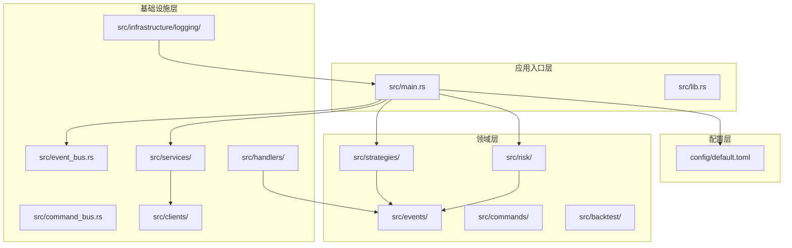

**图表来源**
- [main.rs:1-172](file://src/main.rs#L1-L172)
- [lib.rs:1-13](file://src/lib.rs#L1-L13)

**章节来源**
- [Cargo.toml:1-41](file://Cargo.toml#L1-L41)
- [lib.rs:1-13](file://src/lib.rs#L1-L13)

## 核心组件

### 事件总线系统

事件总线是整个系统的核心通信机制，采用发布-订阅模式实现组件间的松耦合通信。

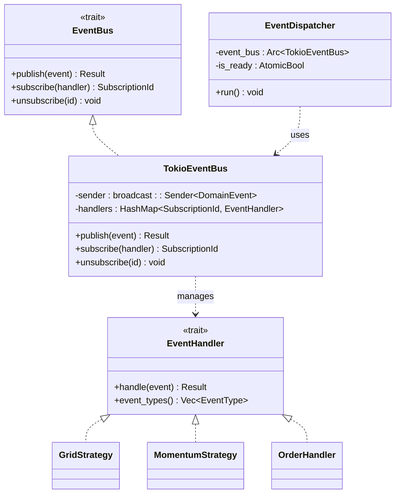

**图表来源**
- [event_bus.rs:18-112](file://src/event_bus.rs#L18-L112)
- [event_bus.rs:114-173](file://src/event_bus.rs#L114-L173)

### 市场数据服务

市场数据服务负责连接Binance WebSocket，实时获取各种市场数据流。

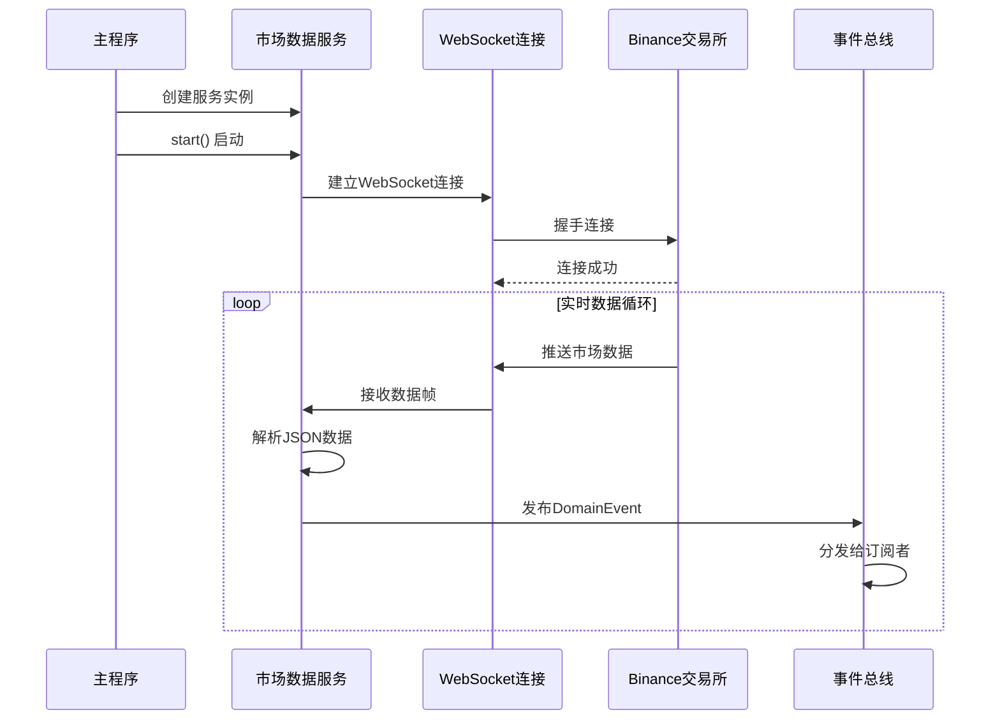

**图表来源**
- [market_data_service.rs:106-133](file://src/services/market_data_service.rs#L106-L133)
- [market_data_service.rs:135-190](file://src/services/market_data_service.rs#L135-L190)

### 策略引擎

系统支持多种交易策略，当前主要实现包括网格策略和动量策略。

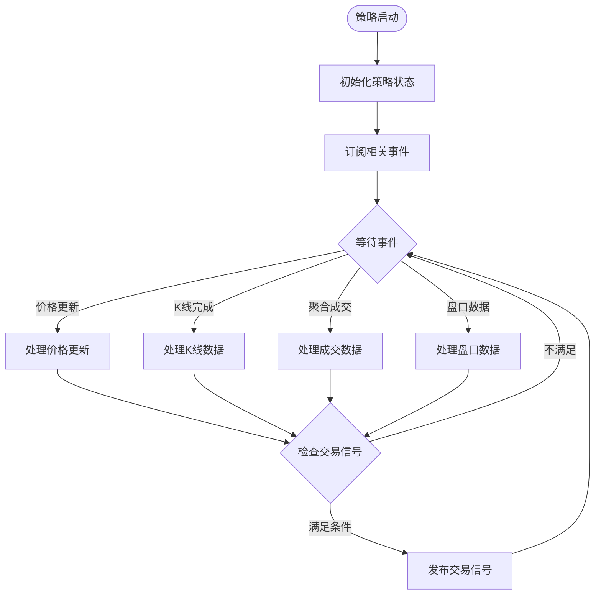

**图表来源**
- [momentum_strategy.rs:204-488](file://src/strategies/momentum_strategy.rs#L204-L488)
- [grid_strategy.rs:156-278](file://src/strategies/grid_strategy.rs#L156-L278)

**章节来源**
- [event_bus.rs:18-112](file://src/event_bus.rs#L18-L112)
- [market_data_service.rs:32-86](file://src/services/market_data_service.rs#L32-L86)
- [momentum_strategy.rs:204-488](file://src/strategies/momentum_strategy.rs#L204-L488)

## 架构概览

系统采用经典的四层架构设计，从外到内分别为入口层、应用层、领域层和基础设施层。

```mermaid
graph TB
subgraph "入口层 (Layer 4)"
MAIN[src/main.rs<br/>系统入口]
BACKTEST[src/bin/backtest.rs<br/>回测入口]
end
subgraph "应用层 (Layer 3)"
EVENT_BUS[src/event_bus.rs<br/>事件总线]
COMMAND_BUS[src/command_bus.rs<br/>命令总线]
ORDER_HANDLER[src/handlers/order_handler.rs<br/>订单处理器]
LOGGING[src/infrastructure/logging/<br/>日志系统]
end
subgraph "领域层 (Layer 2)"
GRID_STRATEGY[src/strategies/grid_strategy.rs<br/>网格策略]
MOMENTUM_STRATEGY[src/strategies/momentum_strategy.rs<br/>动量策略]
ORDER_EXECUTION[src/services/order_execution_service.rs<br/>订单执行服务]
RISK_SERVICE[src/risk/risk_monitor_service.rs<br/>风控监控服务]
BINANCE_CLIENT[src/clients/binance_client.rs<br/>Binance客户端]
end
subgraph "基础设施层 (Layer 1)"
WEBSOCKET[tokio-tungstenite<br/>WebSocket]
TLS[tokio-rustls<br/>TLS加密]
REQWEST[reqwest<br/>HTTP客户端]
LOG[log/env_logger<br/>日志系统]
END
MAIN --> EVENT_BUS
MAIN --> COMMAND_BUS
MAIN --> GRID_STRATEGY
MAIN --> MOMENTUM_STRATEGY
MAIN --> ORDER_EXECUTION
MAIN --> RISK_SERVICE
MAIN --> BINANCE_CLIENT
GRID_STRATEGY --> EVENT_BUS
MOMENTUM_STRATEGY --> EVENT_BUS
ORDER_EXECUTION --> EVENT_BUS
ORDER_HANDLER --> EVENT_BUS
ORDER_EXECUTION --> BINANCE_CLIENT
BINANCE_CLIENT --> REQWEST
BINANCE_CLIENT --> TLS
GRID_STRATEGY --> WEBSOCKET
MOMENTUM_STRATEGY --> WEBSOCKET
BINANCE_CLIENT --> WEBSOCKET
LOGGING --> MAIN
```

**图表来源**
- [ARCHITECTURE.md:13-104](file://docs/ARCHITECTURE.md#L13-L104)
- [main.rs:12-172](file://src/main.rs#L12-L172)

## 详细组件分析

### Binance客户端

Binance客户端提供了与Binance交易所API交互的完整封装，支持REST API的各种操作。

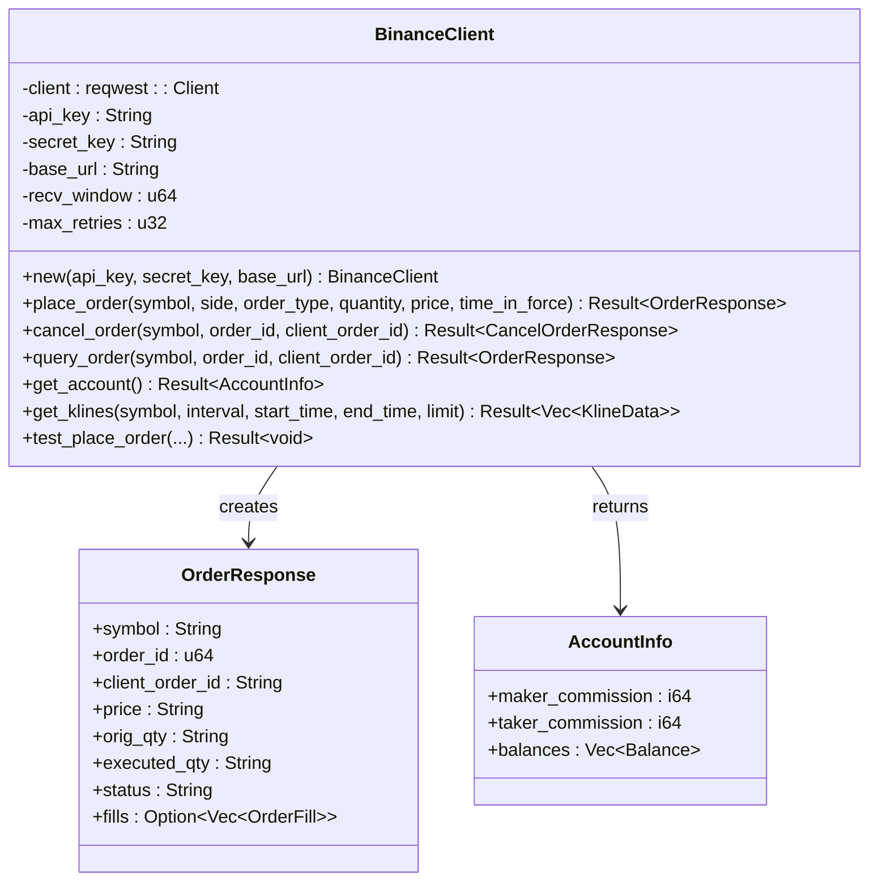

**图表来源**
- [binance_client.rs:16-25](file://src/clients/binance_client.rs#L16-L25)
- [binance_client.rs:27-55](file://src/clients/binance_client.rs#L27-L55)
- [binance_client.rs:94-124](file://src/clients/binance_client.rs#L94-L124)

#### API认证机制

系统使用HMAC-SHA256进行API签名认证：

1. **时间戳生成**：使用系统时间生成毫秒级时间戳
2. **参数排序**：使用BTreeMap确保参数顺序一致性
3. **签名计算**：对拼接的查询字符串进行HMAC-SHA256哈希
4. **请求发送**：在请求头中包含API密钥和签名

#### 日志优化

**更新** 系统进行了日志优化，将高频的日志输出从INFO级别降级到DEBUG级别，以减少日志噪音并提高系统性能。

**优化内容**：
- 账户信息获取响应日志：从`log::info!`降级到`log::debug!`
- 订单提交响应日志：从`log::info!`降级到`log::debug!`
- 订单撤销日志：保持`log::info!`级别不变
- 测试下单日志：保持`log::info!`级别不变

**日志级别说明**：
- **DEBUG**：详细的调试信息，包含API响应和账户信息
- **INFO**：重要的业务信息，如订单撤销和测试下单结果
- **WARN**：警告信息，如网络重试
- **ERROR**：错误信息，如API调用失败

**章节来源**
- [binance_client.rs:182-214](file://src/clients/binance_client.rs#L182-L214)
- [binance_client.rs:216-273](file://src/clients/binance_client.rs#L216-L273)
- [binance_client.rs:386-392](file://src/clients/binance_client.rs#L386-L392)
- [binance_client.rs:420](file://src/clients/binance_client.rs#L420)
- [binance_client.rs:462](file://src/clients/binance_client.rs#L462)
- [binance_client.rs:583](file://src/clients/binance_client.rs#L583)

### 日志系统

系统采用异步日志记录器，支持多种日志级别和输出格式。

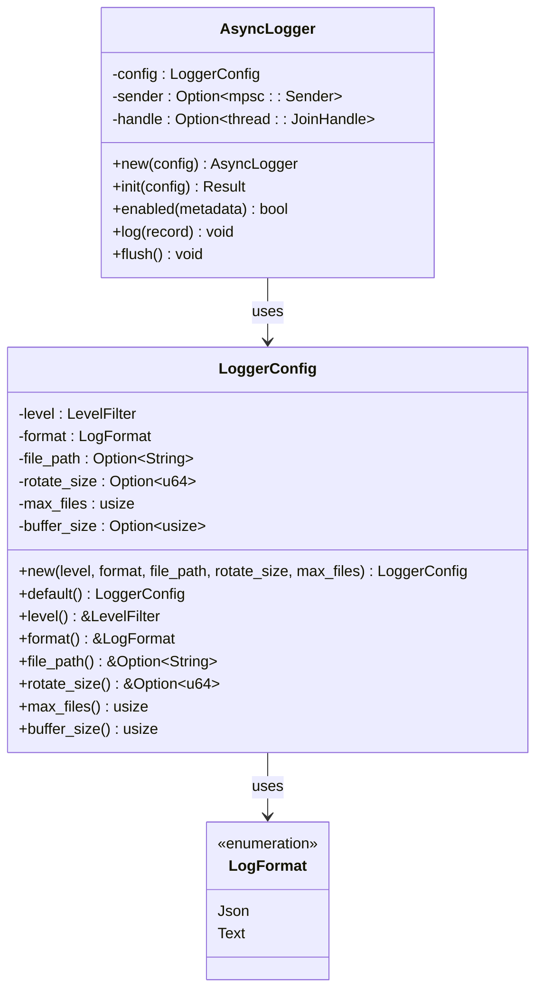

**图表来源**
- [logger.rs:17-79](file://src/infrastructure/logging/logger.rs#L17-L79)
- [logger.rs:161-261](file://src/infrastructure/logging/logger.rs#L161-L261)

#### 日志级别和输出行为

**日志级别配置**：
- **默认级别**：Info（可通过配置文件修改）
- **支持级别**：Trace、Debug、Info、Warn、Error
- **配置选项**：在`config/default.toml`中设置

**输出行为**：
- **文件输出**：所有级别的日志都会写入文件
- **控制台输出**：只有Warn和Error级别的日志会输出到控制台
- **日志轮转**：支持按大小轮转和历史文件清理

**章节来源**
- [logger.rs:50-79](file://src/infrastructure/logging/logger.rs#L50-L79)
- [logger.rs:246-249](file://src/infrastructure/logging/logger.rs#L246-L249)
- [logger.rs:321-328](file://src/infrastructure/logging/logger.rs#L321-L328)

### 市场数据服务

市场数据服务负责连接Binance WebSocket，支持多种连接模式和数据流类型。

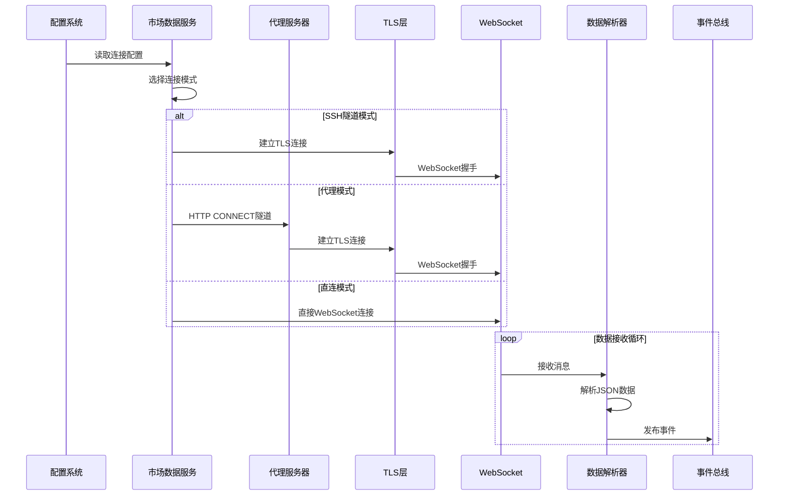

**图表来源**
- [market_data_service.rs:135-190](file://src/services/market_data_service.rs#L135-L190)
- [market_data_service.rs:264-334](file://src/services/market_data_service.rs#L264-L334)

#### 数据流类型

系统支持以下数据流类型：

| 数据流类型 | 用途 | 字段说明 |
|------------|------|----------|
| kline_1m | 1分钟K线数据 | 开盘价、最高价、最低价、收盘价、成交量 |
| kline_5m | 5分钟K线数据 | 5分钟K线周期数据 |
| aggTrade | 聚合成交数据 | 成交价格、数量、主动买方标识 |
| bookTicker | 最优买卖价 | 买一价、卖一价及相应挂单量 |

**章节来源**
- [market_data_service.rs:52-86](file://src/services/market_data_service.rs#L52-L86)
- [market_data_service.rs:422-474](file://src/services/market_data_service.rs#L422-L474)

### 策略引擎

系统实现了多种交易策略，当前主要包含网格策略和动量策略。

#### 网格策略

网格策略在预设的价格区间内均匀布置网格，当价格触及网格线时生成交易信号。

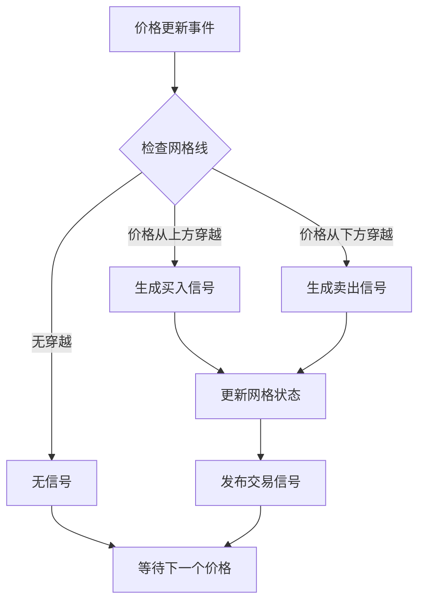

**图表来源**
- [grid_strategy.rs:102-153](file://src/strategies/grid_strategy.rs#L102-L153)

#### 动量策略

动量策略基于多数据源分析，结合趋势、RSI、成交量和盘口数据进行交易决策。

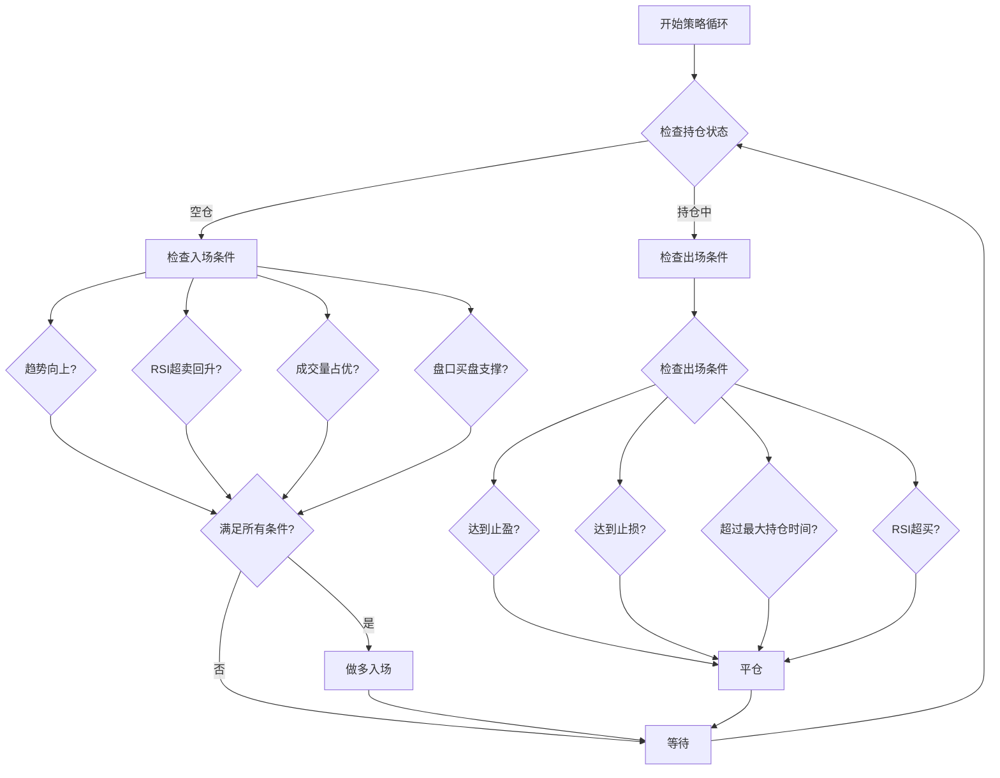

**图表来源**
- [momentum_strategy.rs:384-438](file://src/strategies/momentum_strategy.rs#L384-L438)

**章节来源**
- [grid_strategy.rs:156-278](file://src/strategies/grid_strategy.rs#L156-L278)
- [momentum_strategy.rs:204-488](file://src/strategies/momentum_strategy.rs#L204-L488)

### 风控监控服务

风控监控服务提供实时风险控制和监控功能，确保交易活动在安全范围内进行。

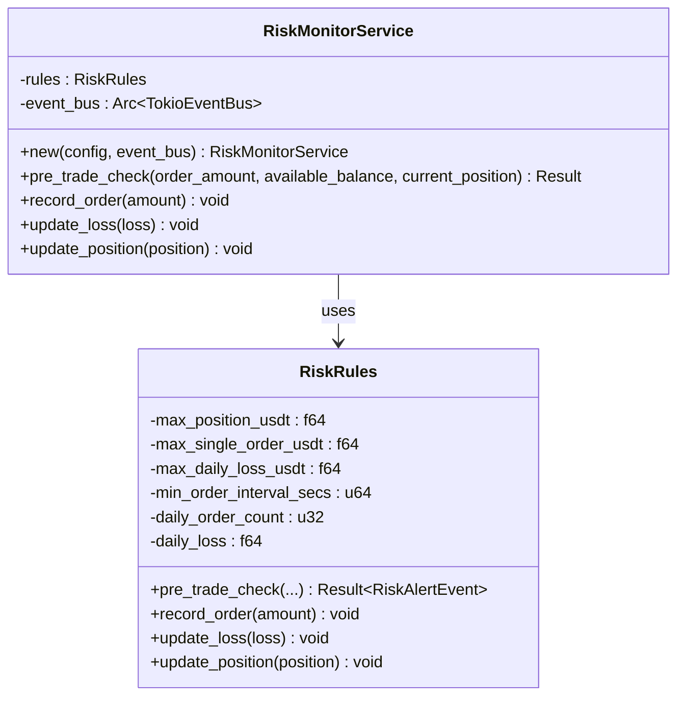

**图表来源**
- [risk_monitor_service.rs:14-79](file://src/risk/risk_monitor_service.rs#L14-L79)
- [risk_monitor_service.rs:81-135](file://src/risk/risk_monitor_service.rs#L81-L135)

### 订单执行服务

订单执行服务负责接收交易信号，通过风控检查后调用Binance API执行实际交易。

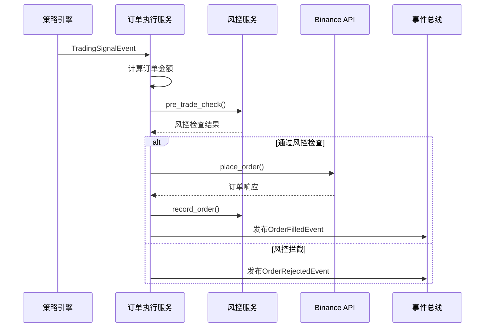

**图表来源**
- [order_execution_service.rs:136-258](file://src/services/order_execution_service.rs#L136-L258)

**章节来源**
- [risk_monitor_service.rs:14-79](file://src/risk/risk_monitor_service.rs#L14-L79)
- [order_execution_service.rs:43-286](file://src/services/order_execution_service.rs#L43-L286)

## 依赖关系分析

系统使用Cargo进行包管理，主要依赖包括异步运行时、网络通信、序列化等核心库。

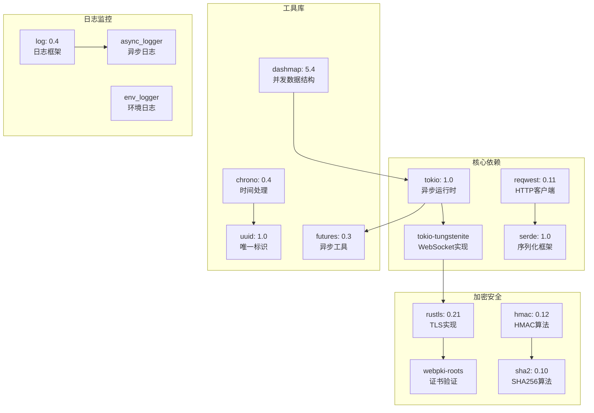

**图表来源**
- [Cargo.toml:14-39](file://Cargo.toml#L14-L39)

**章节来源**
- [Cargo.toml:14-39](file://Cargo.toml#L14-L39)

## 性能考虑

### 异步并发模型

系统采用Tokio异步运行时，充分利用非阻塞I/O提升性能：

- **事件总线**：使用broadcast channel实现一对多广播，支持高并发事件分发
- **WebSocket连接**：异步处理消息收发，避免阻塞主线程
- **HTTP请求**：并发处理多个API请求，提高响应速度

### 内存管理

- **Arc智能指针**：实现共享所有权，避免不必要的数据拷贝
- **RwLock读写锁**：在读多写少场景下提供更好的并发性能
- **缓冲区管理**：合理设置事件缓冲区大小，平衡内存使用和性能

### 网络优化

- **连接池**：复用HTTP连接，减少连接建立开销
- **指数退避**：网络异常时采用指数退避策略，避免雪崩效应
- **心跳检测**：定期发送ping消息，及时发现连接异常

### 日志性能优化

**更新** 系统通过日志级别优化减少了不必要的日志输出，提升了系统性能。

**优化措施**：
- 将高频的API响应和账户信息日志从INFO降级到DEBUG
- 保持重要的业务日志（订单撤销、测试下单）为INFO级别
- 异步日志记录器减少I/O阻塞
- 文件轮转机制避免日志文件过大影响性能

## 故障排除指南

### 常见问题诊断

#### API连接问题

**症状**：启动时显示API连接失败

**排查步骤**：
1. 检查API密钥和密钥是否正确配置
2. 验证IP白名单设置
3. 确认网络连接正常
4. 检查代理设置（如使用代理）

**解决方案**：
- 更新config/default.toml中的API密钥
- 在Binance账户中添加当前IP到白名单
- 使用`curl`测试网络连通性

#### WebSocket连接异常

**症状**：WebSocket连接频繁断开

**排查步骤**：
1. 检查网络稳定性
2. 验证代理配置（如使用代理）
3. 查看防火墙设置
4. 检查Binance服务器状态

**解决方案**：
- 使用直连模式绕过代理
- 调整重连间隔参数
- 检查本地防火墙规则

#### 事件处理延迟

**症状**：事件处理出现明显延迟

**排查步骤**：
1. 检查事件总线容量设置
2. 监控处理器负载情况
3. 分析事件类型分布
4. 检查磁盘I/O性能

**解决方案**：
- 增加事件总线缓冲区大小
- 优化事件处理器性能
- 调整事件过滤策略

#### 日志相关问题

**症状**：日志输出过多或过少

**排查步骤**：
1. 检查配置文件中的日志级别设置
2. 验证日志文件路径和权限
3. 查看日志轮转配置
4. 检查控制台输出行为

**解决方案**：
- 修改config/default.toml中的logging.level
- 确保日志目录存在且有写权限
- 调整rotate_size_mb和max_files参数
- 使用`tail -f logs/trading_YYYY-MM-DD_HHMMSS.log`查看实时日志

**章节来源**
- [main.rs:88-101](file://src/main.rs#L88-L101)
- [market_data_service.rs:112-133](file://src/services/market_data_service.rs#L112-L133)
- [logger.rs:246-249](file://src/infrastructure/logging/logger.rs#L246-L249)

## 结论

Binance客户端是一个设计精良的事件驱动量化交易系统，具有以下优势：

**架构优势**：
- 清晰的分层设计，职责分离明确
- 基于事件驱动的松耦合架构
- 支持扩展和定制的插件式设计

**技术优势**：
- 现代异步编程模型，高性能并发处理
- 完整的错误处理和监控机制
- 丰富的测试覆盖和文档支持
- 智能日志系统，支持灵活的日志级别配置

**功能优势**：
- 多种交易策略支持
- 完善的风险控制体系
- 与Binance API深度集成
- 日志优化提升了系统性能和可观测性

**日志优化优势**：
- 通过将高频日志从INFO降级到DEBUG，显著减少了日志噪音
- 保持重要业务日志的可见性，便于问题诊断
- 支持动态调整日志级别，适应不同环境需求
- 异步日志记录器确保日志写入不影响系统性能

该系统为量化交易提供了坚实的技术基础，可以根据具体需求进行扩展和定制。

## 附录

### 配置说明

系统使用TOML格式的配置文件，主要配置项包括：

| 配置类别 | 关键字 | 说明 | 默认值 |
|----------|--------|------|--------|
| 日志 | level | 日志级别 | info |
| 日志 | format | 日志格式 | text |
| 日志 | file_path | 日志文件路径 | logs/trading.log |
| 日志 | rotate_size_mb | 日志轮转大小(MB) | 50 |
| 日志 | max_files | 最大备份文件数 | 10 |
| Binance | api_key | API密钥 | 未设置 |
| Binance | secret_key | 密钥 | 未设置 |
| Binance | testnet | 是否使用测试网 | false |
| 策略 | symbol | 交易对 | BTCUSDT |
| 策略 | quantity_per_trade | 每笔交易数量 | 0.00013 |
| 策略 | take_profit_pct | 止盈百分比 | 2.0 |
| 策略 | stop_loss_pct | 止损百分比 | 0.8 |
| 风控 | max_position_usdt | 最大持仓金额 | 200.0 |
| 网络 | connection_mode | 连接模式 | ssh_tunnel |

### 日志级别说明

系统支持以下日志级别，按严重程度递增：

| 级别 | 用途 | 控制台输出 | 文件输出 |
|------|------|------------|----------|
| Trace | 详细调试信息 | 否 | 是 |
| Debug | 调试信息 | 否 | 是 |
| Info | 重要业务信息 | 否 | 是 |
| Warn | 警告信息 | 是 | 是 |
| Error | 错误信息 | 是 | 是 |

### 开发指南

#### 添加新策略

1. **创建策略文件**：在`src/strategies/`目录下创建新文件
2. **实现EventHandler trait**：定义事件处理逻辑
3. **注册策略**：在`src/main.rs`中注册新策略
4. **测试验证**：编写单元测试验证策略逻辑

#### 添加新事件

1. **定义事件结构**：在相应的事件模块中定义新事件
2. **更新DomainEvent枚举**：将新事件添加到统一事件枚举中
3. **实现序列化**：确保事件支持Serde序列化
4. **更新事件类型映射**：在`extract_event_type`函数中添加映射

#### 集成新API

1. **创建API客户端**：在`src/clients/`中创建新的客户端
2. **实现API方法**：添加所需的API调用方法
3. **错误处理**：实现适当的错误处理逻辑
4. **测试验证**：编写测试确保API调用正常工作

#### 日志优化实践

1. **识别高频日志**：分析系统性能瓶颈，识别频繁的日志输出
2. **调整日志级别**：将非关键信息从INFO降级到DEBUG
3. **保持关键日志**：确保重要的业务状态变化仍为INFO级别
4. **测试验证**：在不同日志级别下测试系统功能
5. **文档更新**：更新相关文档说明日志行为变化