# 事件总线系统

<cite>
**本文档引用的文件**
- [event_bus.rs](file://src/event_bus.rs)
- [mod.rs](file://src/events/mod.rs)
- [market_events.rs](file://src/events/market_events.rs)
- [trading_events.rs](file://src/events/trading_events.rs)
- [account_events.rs](file://src/events/account_events.rs)
- [risk_events.rs](file://src/events/risk_events.rs)
- [strategy_events.rs](file://src/events/strategy_events.rs)
- [order_handler.rs](file://src/handlers/order_handler.rs)
- [grid_strategy.rs](file://src/strategies/grid_strategy.rs)
- [main.rs](file://src/main.rs)
- [lib.rs](file://src/lib.rs)
- [error.rs](file://src/error.rs)
- [Cargo.toml](file://Cargo.toml)
</cite>

## 目录
1. [简介](#简介)
2. [项目结构](#项目结构)
3. [核心组件](#核心组件)
4. [架构概览](#架构概览)
5. [详细组件分析](#详细组件分析)
6. [依赖关系分析](#依赖关系分析)
7. [性能考虑](#性能考虑)
8. [故障排除指南](#故障排除指南)
9. [结论](#结论)
10. [附录](#附录)

## 简介

事件总线系统是Binance Rust交易系统的核心基础设施，采用事件驱动架构设计，实现了松耦合的事件发布订阅机制。该系统基于Tokio异步运行时构建，提供了高并发、高性能的事件处理能力，支持多种事件类型和处理器类型的灵活组合。

系统的主要目标包括：
- 提供统一的事件发布订阅接口
- 支持事件类型枚举和过滤机制
- 实现并发安全的事件分发
- 提供完整的错误处理和恢复机制
- 支持动态订阅和取消订阅

## 项目结构

事件总线系统位于项目的独立模块中，与业务逻辑模块保持清晰的分离：

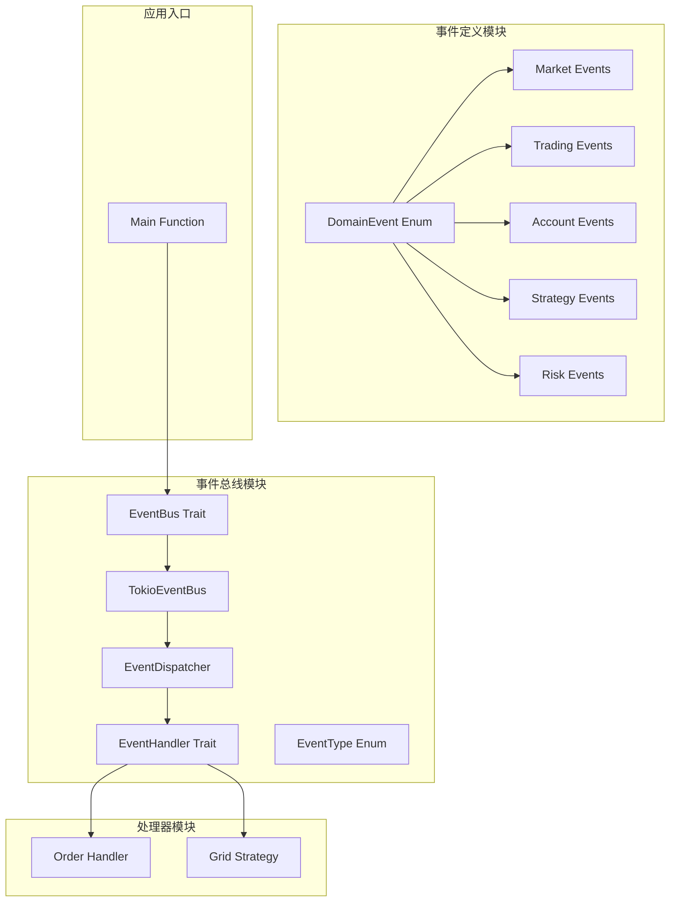

**图表来源**
- [event_bus.rs:1-257](file://src/event_bus.rs#L1-L257)
- [mod.rs:1-102](file://src/events/mod.rs#L1-L102)
- [main.rs:1-93](file://src/main.rs#L1-L93)

**章节来源**
- [lib.rs:1-9](file://src/lib.rs#L1-L9)
- [Cargo.toml:1-27](file://Cargo.toml#L1-L27)

## 核心组件

### EventBus Trait 接口设计

EventBus Trait定义了事件总线的核心接口，提供了统一的事件发布订阅能力：

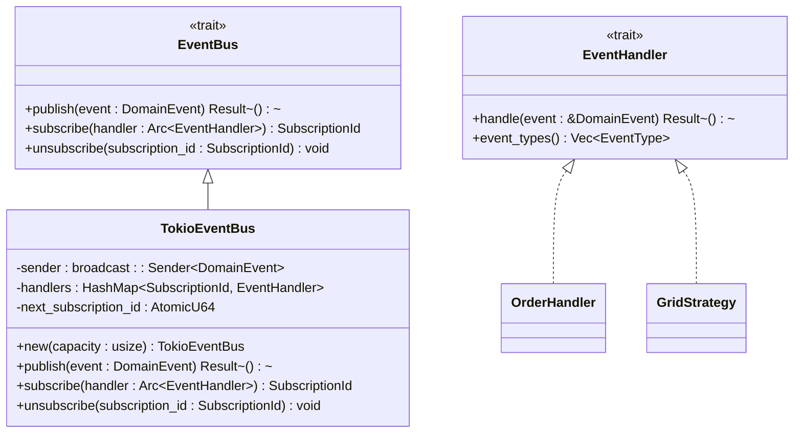

**图表来源**
- [event_bus.rs:18-39](file://src/event_bus.rs#L18-L39)
- [event_bus.rs:61-110](file://src/event_bus.rs#L61-L110)

### 事件类型枚举系统

系统定义了完整的事件类型枚举，覆盖了交易系统的各个领域：

| 事件类别 | 事件类型 | 描述 |
|---------|----------|------|
| 市场数据事件 | PriceUpdate | 价格更新事件 |
| 市场数据事件 | KlineCompleted | K线完成事件 |
| 市场数据事件 | OrderBookUpdate | 订单簿更新事件 |
| 交易事件 | OrderSubmitted | 订单提交事件 |
| 交易事件 | OrderFilled | 订单成交事件 |
| 交易事件 | OrderCancelled | 订单取消事件 |
| 交易事件 | OrderRejected | 订单拒绝事件 |
| 账户事件 | BalanceUpdate | 余额更新事件 |
| 账户事件 | PositionChange | 持仓变动事件 |
| 策略事件 | TradingSignal | 交易信号事件 |
| 策略事件 | GridTrigger | 网格触发事件 |
| 策略事件 | GridStateChange | 网格状态变更事件 |
| 风控事件 | RiskCheck | 风控检查事件 |
| 风控事件 | RiskAlert | 风控告警事件 |

**章节来源**
- [event_bus.rs:41-59](file://src/event_bus.rs#L41-L59)
- [mod.rs:48-89](file://src/events/mod.rs#L48-L89)

## 架构概览

事件总线系统采用生产者-消费者模式，结合广播通道实现事件的高效分发：

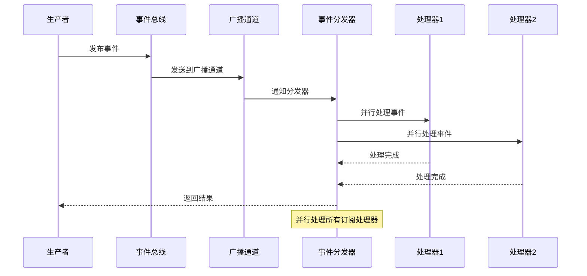

**图表来源**
- [event_bus.rs:87-158](file://src/event_bus.rs#L87-L158)

### 并发安全机制

系统通过以下机制确保并发安全：

1. **原子操作**：订阅ID使用原子整数保证线程安全
2. **读写锁**：处理器映射使用RwLock保护共享状态
3. **异步通道**：Tokio广播通道提供异步安全的事件传递
4. **Arc包装**：处理器使用Arc进行安全的共享所有权

**章节来源**
- [event_bus.rs:62-85](file://src/event_bus.rs#L62-L85)
- [event_bus.rs:112-158](file://src/event_bus.rs#L112-L158)

## 详细组件分析

### TokioEventBus 实现类

TokioEventBus是事件总线的具体实现，基于Tokio的广播通道构建：

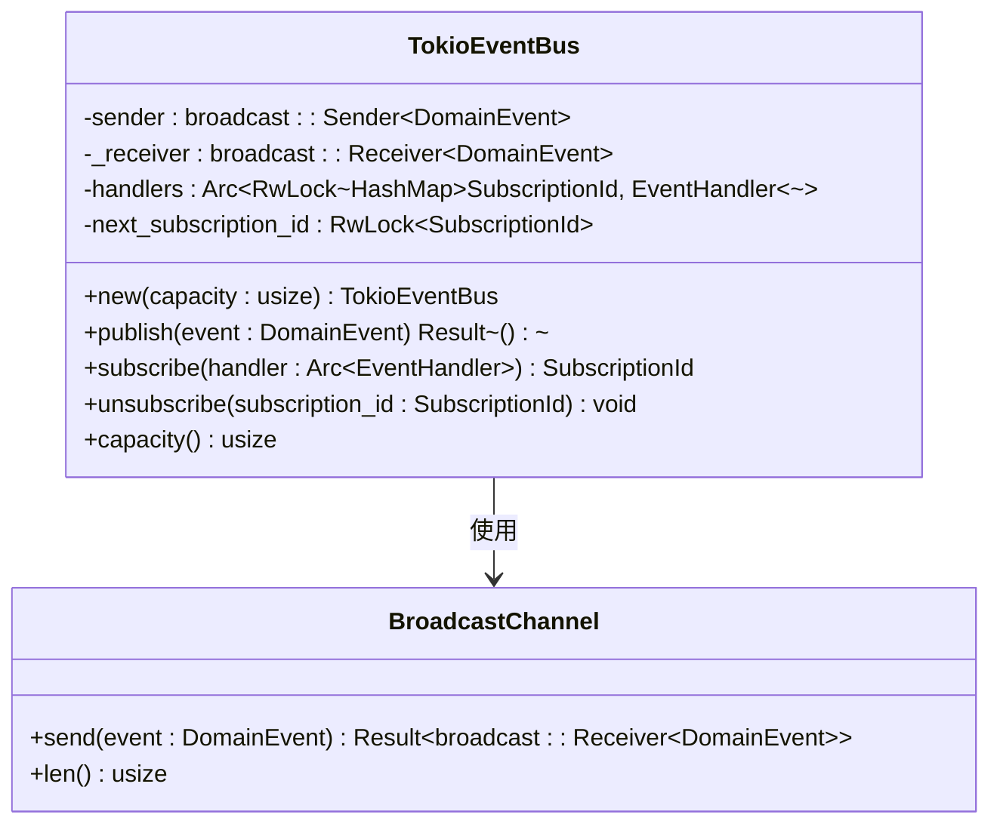

**图表来源**
- [event_bus.rs:61-110](file://src/event_bus.rs#L61-L110)

#### 订阅ID管理机制

系统采用递增的64位无符号整数作为订阅ID，确保唯一性和有序性：

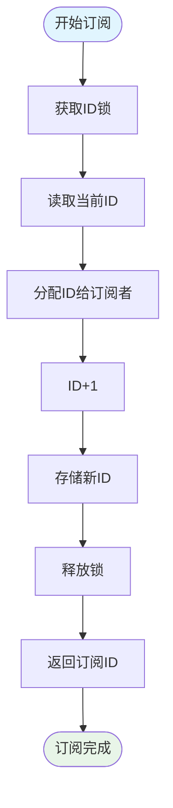

**图表来源**
- [event_bus.rs:95-105](file://src/event_bus.rs#L95-L105)

**章节来源**
- [event_bus.rs:69-110](file://src/event_bus.rs#L69-L110)

### EventDispatcher 工作原理

事件分发器负责监听广播通道并并行分发事件给所有订阅的处理器：

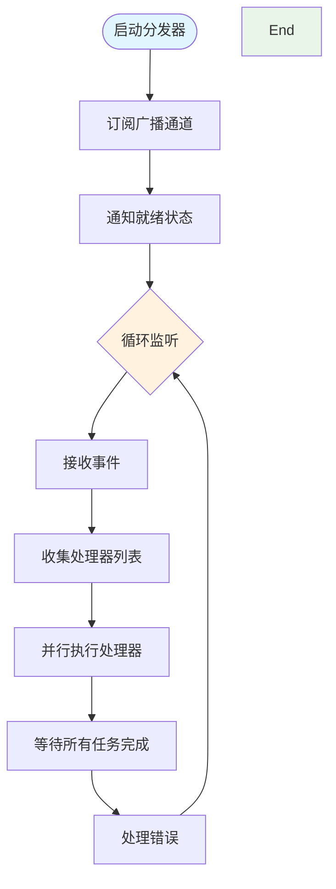

**图表来源**
- [event_bus.rs:129-157](file://src/event_bus.rs#L129-L157)

#### 并行处理机制

分发器使用Tokio的join_all函数实现并行处理，提高事件处理效率：

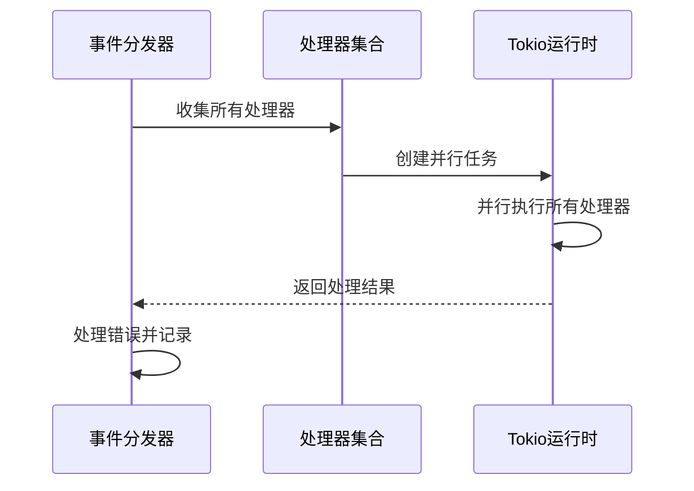

**图表来源**
- [event_bus.rs:142-155](file://src/event_bus.rs#L142-L155)

**章节来源**
- [event_bus.rs:119-158](file://src/event_bus.rs#L119-L158)

### 事件处理器接口设计理念

EventHandler Trait定义了事件处理器的标准接口，支持事件类型过滤和异步处理：

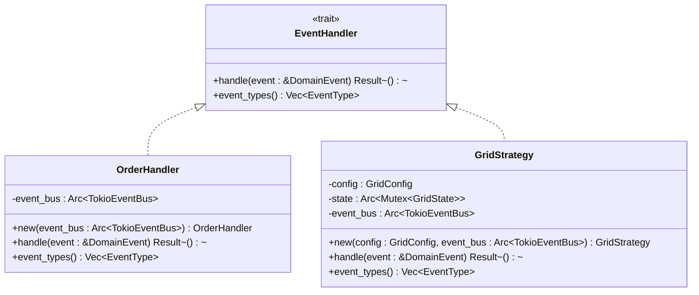

**图表来源**
- [event_bus.rs:31-39](file://src/event_bus.rs#L31-L39)
- [order_handler.rs:68-91](file://src/handlers/order_handler.rs#L68-L91)
- [grid_strategy.rs:264-278](file://src/strategies/grid_strategy.rs#L264-L278)

#### 事件过滤功能

处理器可以通过event_types方法指定感兴趣的事件类型，实现事件过滤：

| 过滤类型 | 说明 | 使用场景 |
|---------|------|---------|
| EventType::All | 订阅所有事件 | 调试和监控 |
| 具体事件类型 | 仅处理特定事件 | 专业化处理 |
| 多种事件类型 | 处理多个相关事件 | 组合处理器 |

**章节来源**
- [event_bus.rs:31-39](file://src/event_bus.rs#L31-L39)
- [order_handler.rs:83-90](file://src/handlers/order_handler.rs#L83-L90)
- [grid_strategy.rs:275-277](file://src/strategies/grid_strategy.rs#L275-L277)

### 实际代码示例

#### 创建自定义事件处理器

以下是一个自定义事件处理器的实现示例：

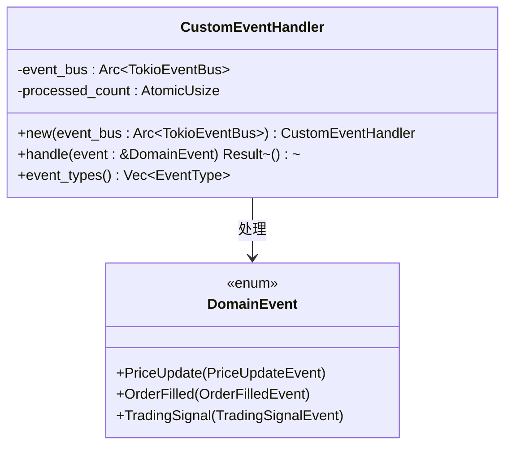

**图表来源**
- [order_handler.rs:68-91](file://src/handlers/order_handler.rs#L68-L91)

#### 事件发布流程

事件发布的基本流程如下：

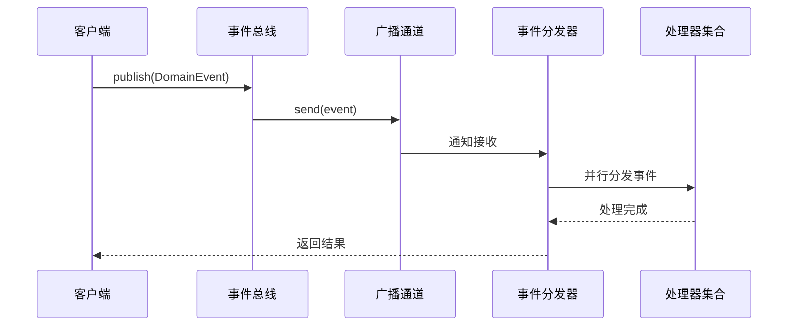

**图表来源**
- [event_bus.rs:89-93](file://src/event_bus.rs#L89-L93)
- [event_bus.rs:136-156](file://src/event_bus.rs#L136-L156)

**章节来源**
- [order_handler.rs:102-135](file://src/handlers/order_handler.rs#L102-L135)

## 依赖关系分析

事件总线系统依赖于多个关键库和模块：

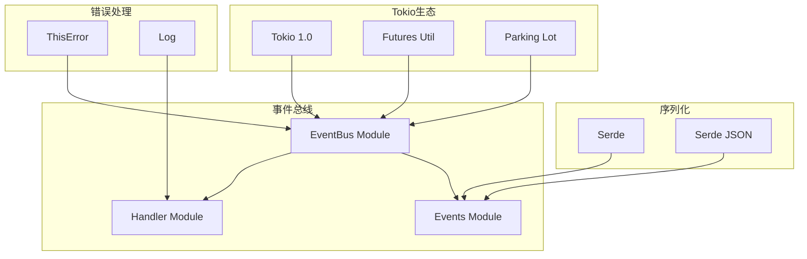

**图表来源**
- [Cargo.toml:6-24](file://Cargo.toml#L6-L24)

### 外部依赖分析

| 依赖库 | 版本 | 用途 | 关键特性 |
|-------|------|------|---------|
| tokio | 1.0 | 异步运行时 | 全功能特性集 |
| futures-util | 0.3 | 异步工具 | join_all并行处理 |
| parking_lot | 0.12 | 并发原语 | 读写锁实现 |
| serde | 1.0 | 数据序列化 | 结构化数据处理 |
| async-trait | 0.1 | 异步Trait | 异步方法抽象 |
| thiserror | 1.0 | 错误处理 | 统一错误类型 |

**章节来源**
- [Cargo.toml:6-24](file://Cargo.toml#L6-L24)

## 性能考虑

### 并发性能优化

事件总线系统通过以下机制优化性能：

1. **零拷贝广播**：使用Tokio广播通道避免事件复制
2. **并行处理**：使用join_all并行执行所有处理器
3. **原子操作**：最小化锁竞争
4. **异步I/O**：非阻塞的事件传递

### 内存管理

- 使用Arc进行智能指针共享
- RcuLock提供高效的读多写少场景
- 广播通道自动管理内存回收

### 可扩展性设计

系统支持动态添加和移除处理器，无需重启服务：

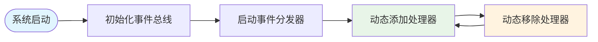

## 故障排除指南

### 常见错误类型

系统定义了完整的错误处理机制：

```mermaid
classDiagram
class EventBusError {
<<enum>>
+PublishFailed(String)
+SubscribeFailed(String)
+HandleFailed {handler : String, error : String}
+ChannelClosed
}
class DomainError {
<<enum>>
+Infrastructure(InfrastructureError)
+EventBus(EventBusError)
+CommandBus(CommandBusError)
+Service(ServiceError)
+Unknown(String)
}
DomainError --> EventBusError : 包装
```

**图表来源**
- [error.rs:85-99](file://src/error.rs#L85-L99)

#### 错误处理策略

| 错误类型 | 处理策略 | 影响范围 |
|---------|---------|---------|
| 发布失败 | 记录日志并重试 | 单个事件 |
| 处理失败 | 记录处理器ID和错误 | 单个处理器 |
| 通道关闭 | 重新初始化通道 | 系统级 |
| 订阅失败 | 返回错误给调用者 | 调用方 |

**章节来源**
- [error.rs:85-99](file://src/error.rs#L85-L99)
- [event_bus.rs:150-155](file://src/event_bus.rs#L150-L155)

### 调试和监控

系统提供了完善的调试支持：

1. **事件类型提取**：通过extract_event_type函数快速识别事件类型
2. **处理器状态监控**：实时查看处理器订阅状态
3. **性能指标**：统计事件处理时间和吞吐量

**章节来源**
- [event_bus.rs:162-181](file://src/event_bus.rs#L162-L181)

## 结论

事件总线系统为Binance Rust交易系统提供了强大的基础设施支持。通过采用事件驱动架构，系统实现了高度解耦的模块设计，支持灵活的扩展和维护。

### 主要优势

1. **高并发性能**：基于Tokio的异步架构提供优秀的并发处理能力
2. **灵活扩展**：支持动态订阅和取消订阅，便于功能扩展
3. **强类型安全**：完整的类型系统确保编译时错误检测
4. **统一错误处理**：提供一致的错误处理和恢复机制
5. **可观测性**：完善的日志和监控支持

### 未来改进方向

1. **事件持久化**：实现事件的持久化存储支持
2. **事件溯源**：构建完整的事件溯源能力
3. **性能监控**：增加更详细的性能指标收集
4. **负载均衡**：支持多实例部署和负载均衡

## 附录

### 事件总线使用示例

以下是在主程序中使用事件总线的完整示例：

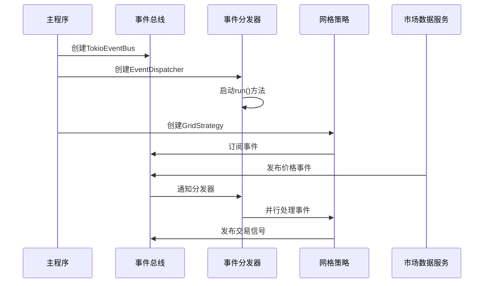

**图表来源**
- [main.rs:14-61](file://src/main.rs#L14-L61)

### 订阅取消机制

系统提供了完整的订阅生命周期管理：

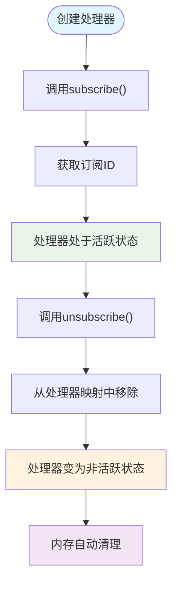

**图表来源**
- [event_bus.rs:107-109](file://src/event_bus.rs#L107-L109)

**章节来源**
- [main.rs:14-61](file://src/main.rs#L14-L61)
- [event_bus.rs:107-109](file://src/event_bus.rs#L107-L109)