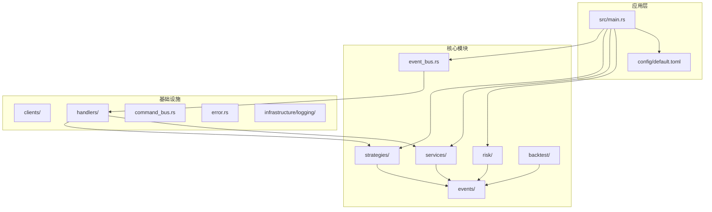
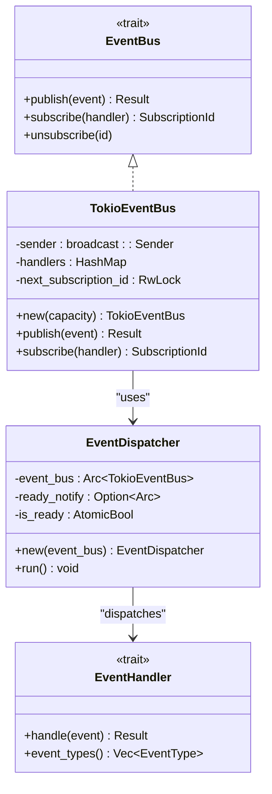
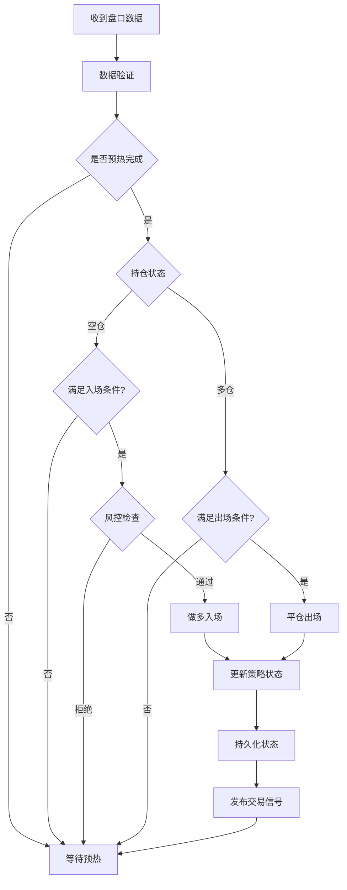
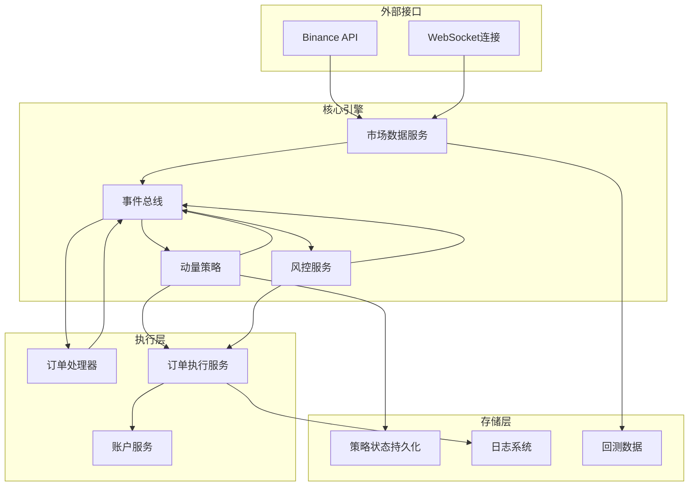
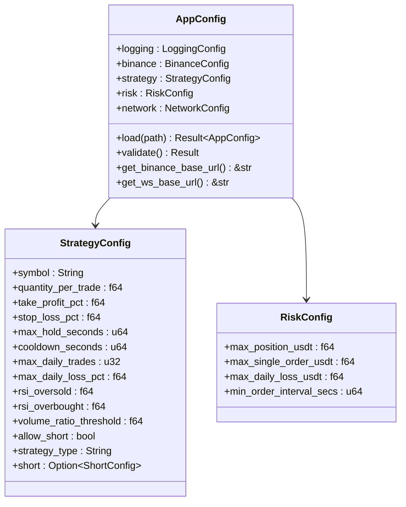
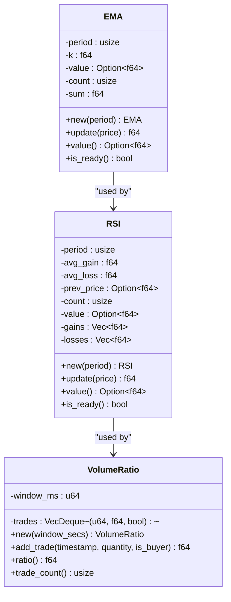
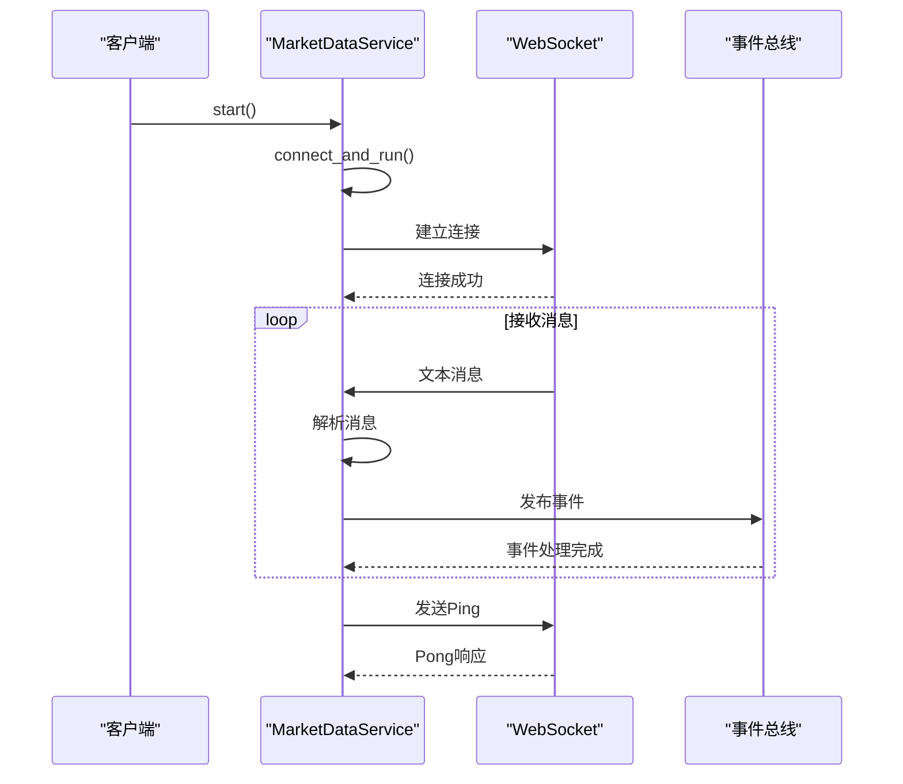
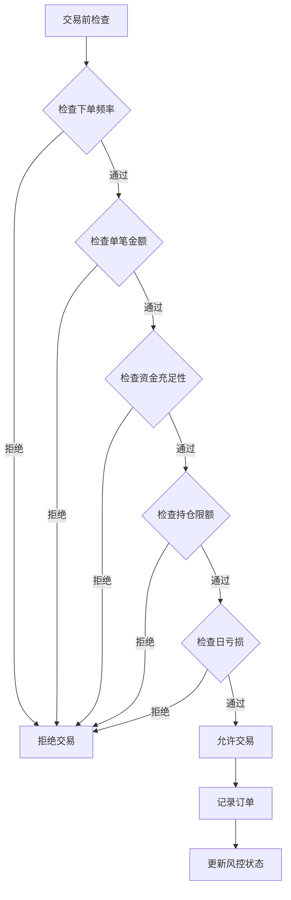
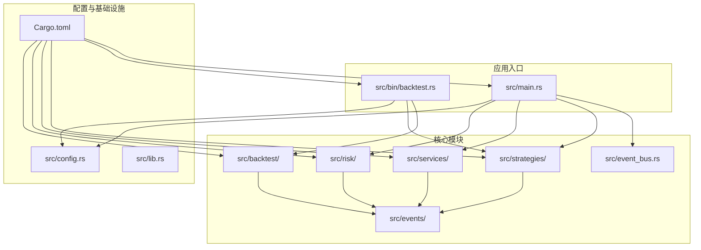

# 动量策略引擎

<cite>
**本文档引用的文件**
- [src/main.rs](file://src/main.rs)
- [src/lib.rs](file://src/lib.rs)
- [src/strategies/momentum_strategy.rs](file://src/strategies/momentum_strategy.rs)
- [src/strategies/indicators.rs](file://src/strategies/indicators.rs)
- [src/config.rs](file://src/config.rs)
- [src/event_bus.rs](file://src/event_bus.rs)
- [src/events/mod.rs](file://src/events/mod.rs)
- [src/events/market_events.rs](file://src/events/market_events.rs)
- [src/events/trading_events.rs](file://src/events/trading_events.rs)
- [src/services/market_data_service.rs](file://src/services/market_data_service.rs)
- [src/risk/risk_monitor_service.rs](file://src/risk/risk_monitor_service.rs)
- [src/risk/rules.rs](file://src/risk/rules.rs)
- [src/backtest/engine.rs](file://src/backtest/engine.rs)
- [src/backtest/data_loader.rs](file://src/backtest/data_loader.rs)
- [src/backtest/report.rs](file://src/backtest/report.rs)
- [config/default.toml](file://config/default.toml)
- [Cargo.toml](file://Cargo.toml)
</cite>

## 目录
1. [项目概述](#项目概述)
2. [项目结构](#项目结构)
3. [核心组件](#核心组件)
4. [架构概览](#架构概览)
5. [详细组件分析](#详细组件分析)
6. [依赖关系分析](#依赖关系分析)
7. [性能考虑](#性能考虑)
8. [故障排除指南](#故障排除指南)
9. [结论](#结论)

## 项目概述

动量策略引擎是一个基于 Rust 的事件驱动量化交易系统，专注于比特币市场的动量短线交易策略。该系统采用模块化设计，支持实时交易和回测功能，具备完善的风控机制和高性能的事件处理能力。

### 主要特性

- **事件驱动架构**：基于广播通道的异步事件处理系统
- **多数据源融合**：整合K线、成交、盘口等多种数据源
- **技术指标计算**：EMA、RSI、成交量比率等流式指标
- **风控监控**：实时资金、持仓、频率等多重风控检查
- **回测功能**：支持K线模式和录制数据回放回测
- **网络连接**：支持直连、代理、SSH隧道等多种连接模式

## 项目结构

**图表来源**
- [src/lib.rs:1-13](file://src/lib.rs#L1-L13)
- [src/main.rs:1-172](file://src/main.rs#L1-L172)

**章节来源**
- [src/lib.rs:1-13](file://src/lib.rs#L1-L13)
- [Cargo.toml:1-41](file://Cargo.toml#L1-L41)

## 核心组件

### 事件总线系统

事件总线采用广播通道实现，支持高并发的事件发布和订阅：

**图表来源**
- [src/event_bus.rs:18-173](file://src/event_bus.rs#L18-L173)

### 动量策略引擎

动量策略结合多种技术指标进行决策：

**图表来源**
- [src/strategies/momentum_strategy.rs:227-438](file://src/strategies/momentum_strategy.rs#L227-L438)

**章节来源**
- [src/strategies/momentum_strategy.rs:1-489](file://src/strategies/momentum_strategy.rs#L1-L489)
- [src/strategies/indicators.rs:1-260](file://src/strategies/indicators.rs#L1-L260)

## 架构概览

系统采用事件驱动的微服务架构，各组件通过事件总线进行松耦合通信：

**图表来源**
- [src/main.rs:57-169](file://src/main.rs#L57-L169)
- [src/services/market_data_service.rs:106-133](file://src/services/market_data_service.rs#L106-L133)

## 详细组件分析

### 配置管理系统

配置系统支持TOML文件配置和环境变量覆盖：

**图表来源**
- [src/config.rs:9-228](file://src/config.rs#L9-L228)

### 技术指标系统

实现流式技术指标计算，支持EMA、RSI、成交量比率等：

**图表来源**
- [src/strategies/indicators.rs:7-209](file://src/strategies/indicators.rs#L7-L209)

### 市场数据服务

负责连接Binance WebSocket并处理实时数据：

**图表来源**
- [src/services/market_data_service.rs:106-133](file://src/services/market_data_service.rs#L106-L133)
- [src/services/market_data_service.rs:336-420](file://src/services/market_data_service.rs#L336-L420)

### 风控监控系统

实现多层次的风险控制检查：

**图表来源**
- [src/risk/rules.rs:191-271](file://src/risk/rules.rs#L191-L271)

**章节来源**
- [src/config.rs:1-406](file://src/config.rs#L1-L406)
- [src/services/market_data_service.rs:1-705](file://src/services/market_data_service.rs#L1-L705)
- [src/risk/risk_monitor_service.rs:1-175](file://src/risk/risk_monitor_service.rs#L1-L175)
- [src/risk/rules.rs:1-419](file://src/risk/rules.rs#L1-L419)

## 依赖关系分析

系统采用模块化设计，各模块职责清晰：

**图表来源**
- [Cargo.toml:6-12](file://Cargo.toml#L6-L12)
- [src/lib.rs:1-13](file://src/lib.rs#L1-L13)

**章节来源**
- [Cargo.toml:1-41](file://Cargo.toml#L1-L41)
- [src/lib.rs:1-13](file://src/lib.rs#L1-L13)

## 性能考虑

### 事件处理性能

系统采用异步事件驱动架构，具有以下性能特点：

- **非阻塞设计**：所有事件处理都是异步的，避免阻塞主线程
- **并行处理**：事件分发器可以并行处理多个处理器
- **内存效率**：使用广播通道减少内存复制
- **背压处理**：通过容量控制防止内存溢出

### 技术指标优化

- **流式计算**：指标计算不需要存储历史数据，内存占用固定
- **预热机制**：确保指标在足够数据量后再进行交易决策
- **缓存策略**：合理使用缓存避免重复计算

### 网络连接优化

- **连接池**：复用WebSocket连接，减少连接开销
- **指数退避**：网络异常时自动重连，避免过度重试
- **心跳检测**：60秒超时检测，及时发现连接问题

## 故障排除指南

### 常见问题及解决方案

#### API连接问题
- **症状**：API连接失败，提示密钥或IP白名单问题
- **解决**：检查配置文件中的API密钥，确认IP已加入白名单

#### 网络连接问题
- **症状**：WebSocket连接失败或频繁断开
- **解决**：检查网络连接模式配置，尝试不同的连接方式

#### 风控触发
- **症状**：交易被风控服务拒绝
- **解决**：检查风控配置，调整风险参数或增加资金

#### 事件处理异常
- **症状**：某些事件处理失败
- **解决**：查看事件总线的错误日志，检查处理器实现

**章节来源**
- [src/main.rs:87-101](file://src/main.rs#L87-L101)
- [src/services/market_data_service.rs:112-130](file://src/services/market_data_service.rs#L112-L130)
- [src/risk/rules.rs:191-271](file://src/risk/rules.rs#L191-L271)

## 结论

动量策略引擎是一个设计精良的事件驱动量化交易系统，具有以下优势：

1. **架构清晰**：模块化设计，职责分离明确
2. **性能优异**：异步事件驱动，高并发处理能力强
3. **功能完整**：涵盖实时交易、回测、风控等完整功能
4. **扩展性强**：插件化设计，易于添加新功能
5. **可靠性高**：完善的错误处理和监控机制

该系统适合构建专业的量化交易应用，为用户提供稳定可靠的交易体验。通过合理的配置和参数调优，可以在不同的市场环境下获得稳定的收益表现。