# 命令总线系统

<cite>
**本文档引用的文件**
- [command_bus.rs](file://src/command_bus.rs)
- [commands/mod.rs](file://src/commands/mod.rs)
- [commands/order_commands.rs](file://src/commands/order_commands.rs)
- [handlers/order_handler.rs](file://src/handlers/order_handler.rs)
- [event_bus.rs](file://src/event_bus.rs)
- [events/mod.rs](file://src/events/mod.rs)
- [events/trading_events.rs](file://src/events/trading_events.rs)
- [error.rs](file://src/error.rs)
- [lib.rs](file://src/lib.rs)
- [main.rs](file://src/main.rs)
- [Cargo.toml](file://Cargo.toml)
</cite>

## 目录
1. [简介](#简介)
2. [项目结构](#项目结构)
3. [核心组件](#核心组件)
4. [架构概览](#架构概览)
5. [详细组件分析](#详细组件分析)
6. [依赖关系分析](#依赖关系分析)
7. [性能考虑](#性能考虑)
8. [故障排除指南](#故障排除指南)
9. [结论](#结论)

## 简介

命令总线系统是一个基于事件驱动架构的交易系统核心组件，采用CQRS（命令查询职责分离）模式设计。该系统实现了完整的订单处理流程，从命令接收、验证、执行到事件发布，形成了松耦合、可扩展的异步处理架构。

系统的核心设计理念包括：
- **命令与事件分离**：命令负责描述意图，事件记录已完成的事实
- **异步处理**：通过事件总线实现解耦的异步消息传递
- **可扩展性**：支持多种命令类型和事件处理器
- **错误处理**：统一的错误类型和传播机制

## 项目结构

该项目采用模块化组织方式，主要目录结构如下：

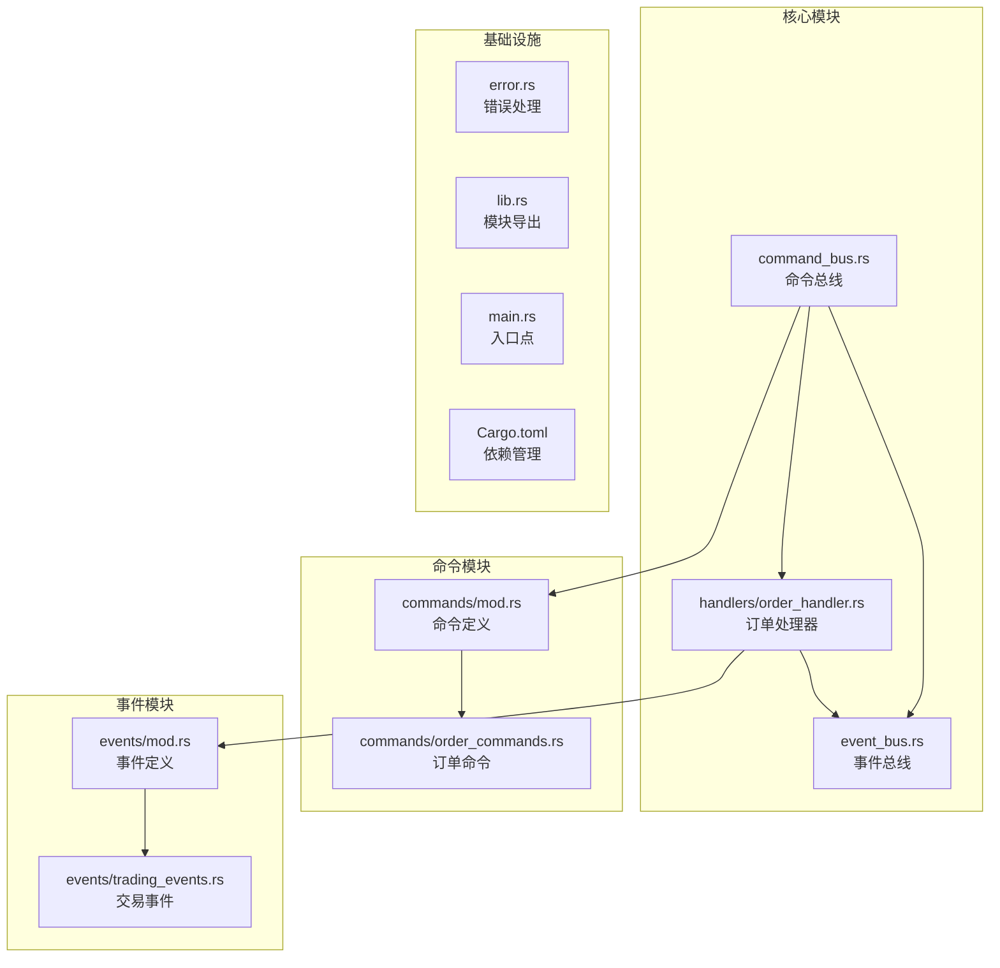

**图表来源**
- [lib.rs:1-9](file://src/lib.rs#L1-L9)
- [Cargo.toml:1-27](file://Cargo.toml#L1-L27)

**章节来源**
- [lib.rs:1-9](file://src/lib.rs#L1-L9)
- [Cargo.toml:1-27](file://Cargo.toml#L1-L27)

## 核心组件

### 命令总线架构

命令总线系统的核心组件包括命令定义、处理器和事件总线三个主要部分：

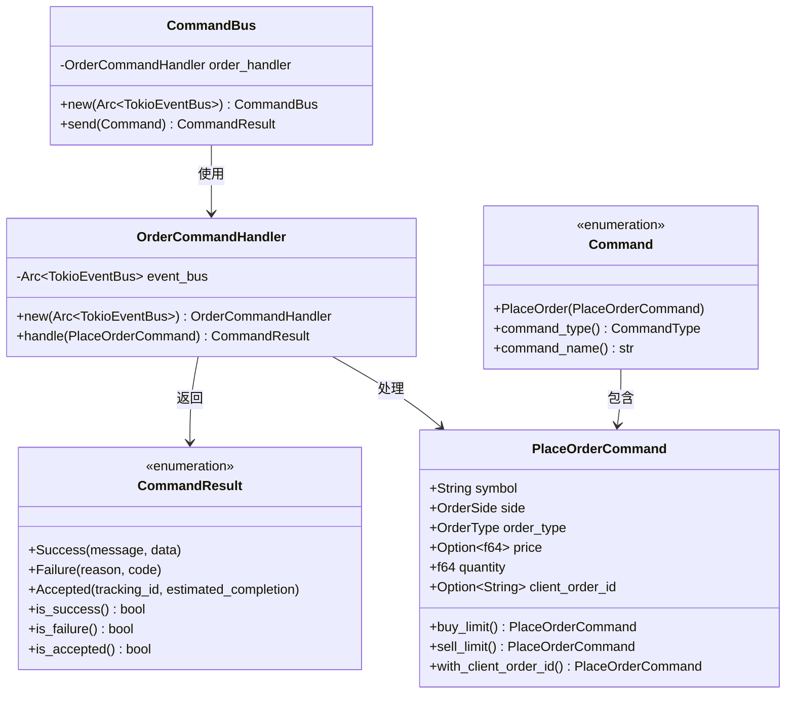

**图表来源**
- [command_bus.rs:5-19](file://src/command_bus.rs#L5-L19)
- [handlers/order_handler.rs:93-137](file://src/handlers/order_handler.rs#L93-L137)
- [commands/mod.rs:6-42](file://src/commands/mod.rs#L6-L42)
- [commands/order_commands.rs:36-72](file://src/commands/order_commands.rs#L36-L72)

### 命令类型系统

系统实现了完整的命令类型系统，支持多种命令类型和结果状态：

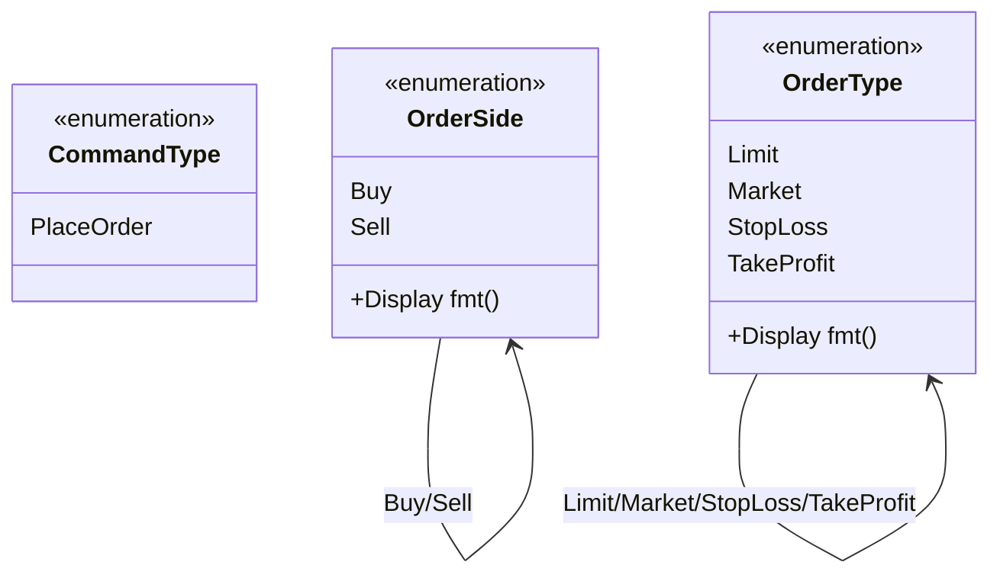

**图表来源**
- [commands/mod.rs:23-27](file://src/commands/mod.rs#L23-L27)
- [commands/order_commands.rs:3-35](file://src/commands/order_commands.rs#L3-L35)

**章节来源**
- [commands/mod.rs:6-77](file://src/commands/mod.rs#L6-L77)
- [commands/order_commands.rs:1-72](file://src/commands/order_commands.rs#L1-L72)

## 架构概览

### CQRS模式应用

系统严格遵循CQRS模式，将命令处理和查询处理分离：

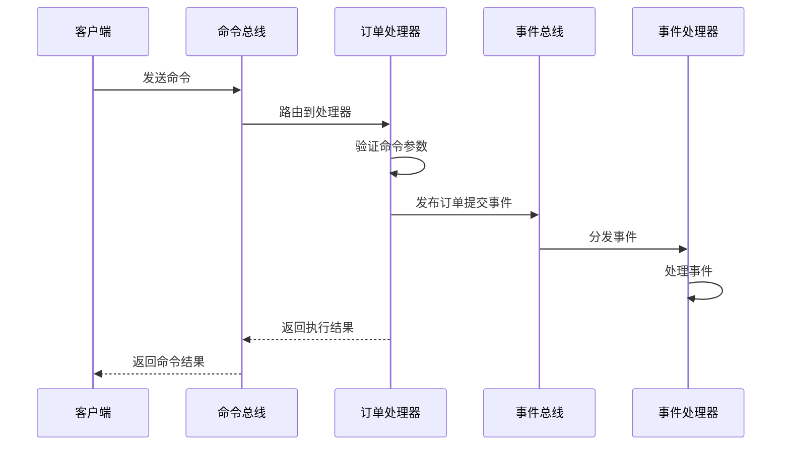

**图表来源**
- [command_bus.rs:14-18](file://src/command_bus.rs#L14-L18)
- [handlers/order_handler.rs:102-135](file://src/handlers/order_handler.rs#L102-L135)
- [event_bus.rs:88-110](file://src/event_bus.rs#L88-L110)

### 事件驱动架构

系统采用事件驱动架构，实现了松耦合的消息传递：

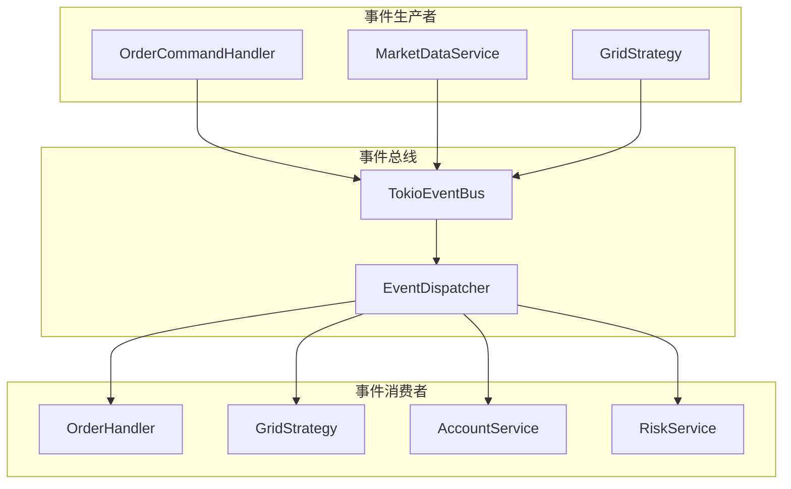

**图表来源**
- [handlers/order_handler.rs:16-66](file://src/handlers/order_handler.rs#L16-L66)
- [event_bus.rs:62-158](file://src/event_bus.rs#L62-L158)

**章节来源**
- [event_bus.rs:1-257](file://src/event_bus.rs#L1-L257)

## 详细组件分析

### 命令总线实现

命令总线作为系统的入口点，负责命令的路由和处理：

#### 核心功能

命令总线实现了以下核心功能：
- **命令路由**：根据命令类型将命令路由到相应的处理器
- **异步处理**：支持异步命令处理和事件发布
- **结果封装**：统一命令执行结果的格式

#### 命令处理流程

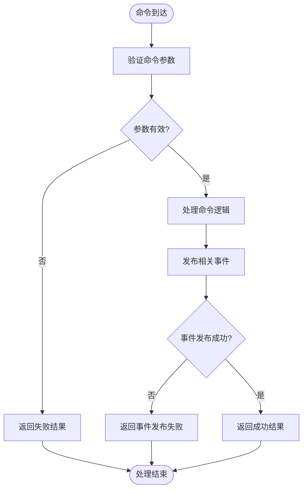

**图表来源**
- [handlers/order_handler.rs:102-135](file://src/handlers/order_handler.rs#L102-L135)

**章节来源**
- [command_bus.rs:1-19](file://src/command_bus.rs#L1-L19)

### 订单命令处理

#### OrderCommand实现

系统实现了完整的订单命令处理机制：

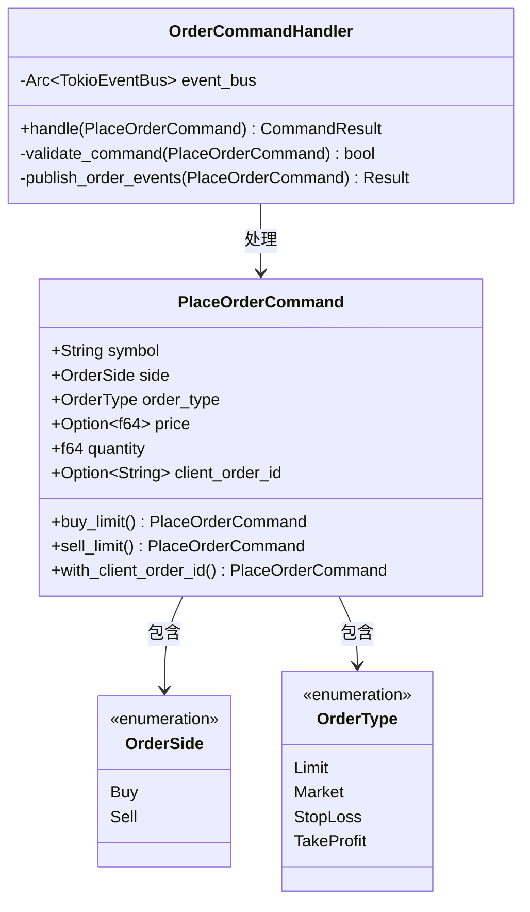

**图表来源**
- [handlers/order_handler.rs:93-137](file://src/handlers/order_handler.rs#L93-L137)
- [commands/order_commands.rs:36-72](file://src/commands/order_commands.rs#L36-L72)

#### 不同订单类型的处理

系统支持多种订单类型，每种类型都有特定的处理逻辑：

| 订单类型 | 描述 | 价格字段 | 适用场景 |
|---------|------|----------|----------|
| Limit | 限价单 | 必须指定价格 | 需要精确价格控制的交易 |
| Market | 市价单 | 无需价格 | 追求立即成交的交易 |
| StopLoss | 止损单 | 触发价格 | 风险控制和止损 |
| TakeProfit | 止盈单 | 触发价格 | 利润锁定 |

**章节来源**
- [commands/order_commands.rs:18-35](file://src/commands/order_commands.rs#L18-L35)

### 事件总线系统

#### 事件处理器架构

事件总线实现了高效的事件分发机制：

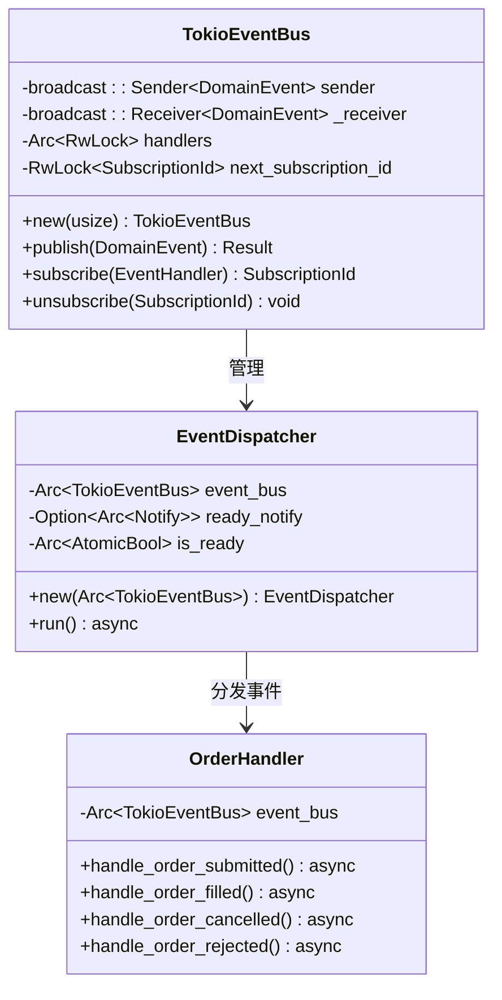

**图表来源**
- [event_bus.rs:62-158](file://src/event_bus.rs#L62-L158)
- [handlers/order_handler.rs:16-91](file://src/handlers/order_handler.rs#L16-L91)

#### 事件类型系统

系统定义了丰富的事件类型，支持完整的交易生命周期：

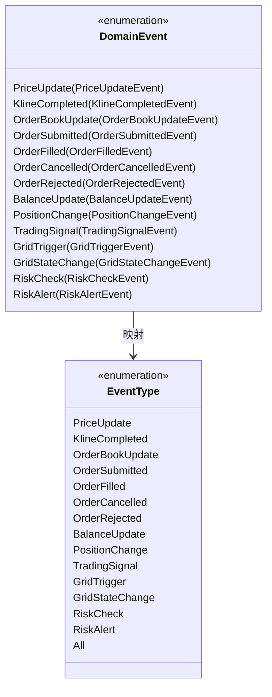

**图表来源**
- [events/mod.rs:48-89](file://src/events/mod.rs#L48-L89)
- [event_bus.rs:42-59](file://src/event_bus.rs#L42-L59)

**章节来源**
- [event_bus.rs:1-257](file://src/event_bus.rs#L1-L257)
- [events/mod.rs:1-102](file://src/events/mod.rs#L1-L102)

### 错误处理机制

系统实现了统一的错误处理机制，支持多层错误类型：

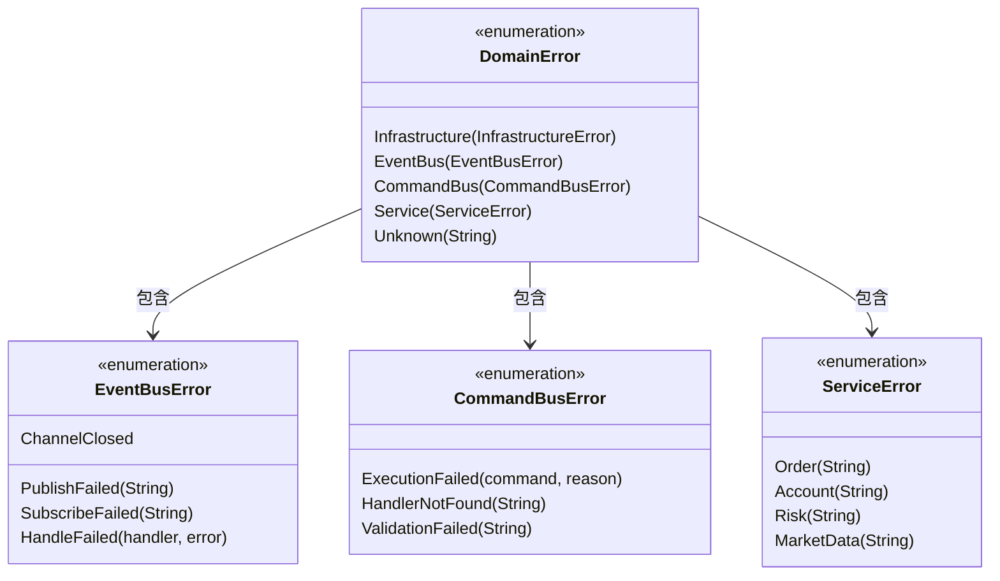

**图表来源**
- [error.rs:12-128](file://src/error.rs#L12-L128)

**章节来源**
- [error.rs:1-169](file://src/error.rs#L1-L169)

## 依赖关系分析

### 外部依赖

系统使用了现代化的Rust生态系统工具：

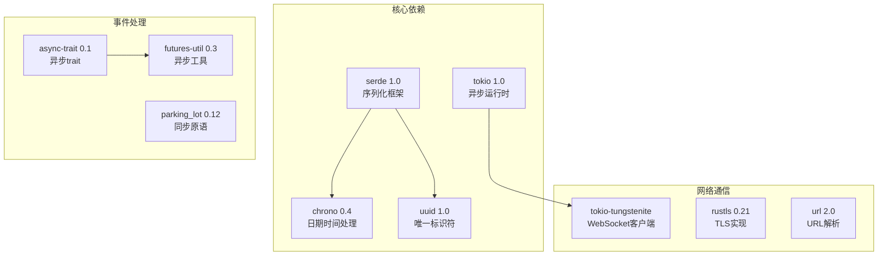

**图表来源**
- [Cargo.toml:6-25](file://Cargo.toml#L6-L25)

### 内部模块依赖

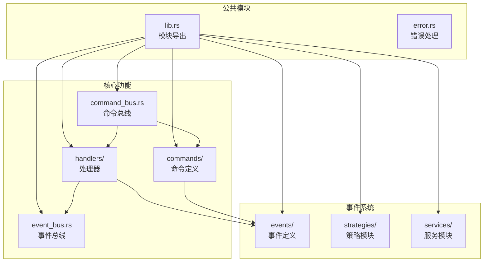

**图表来源**
- [lib.rs:1-9](file://src/lib.rs#L1-L9)

**章节来源**
- [Cargo.toml:1-27](file://Cargo.toml#L1-L27)

## 性能考虑

### 异步处理优化

系统采用了多项性能优化措施：

1. **异步事件处理**：使用Tokio运行时实现非阻塞事件处理
2. **并行事件分发**：事件分发器并行处理多个事件处理器
3. **零拷贝传输**：事件通过广播通道进行高效传输
4. **内存池化**：使用Arc智能指针减少内存分配

### 内存管理

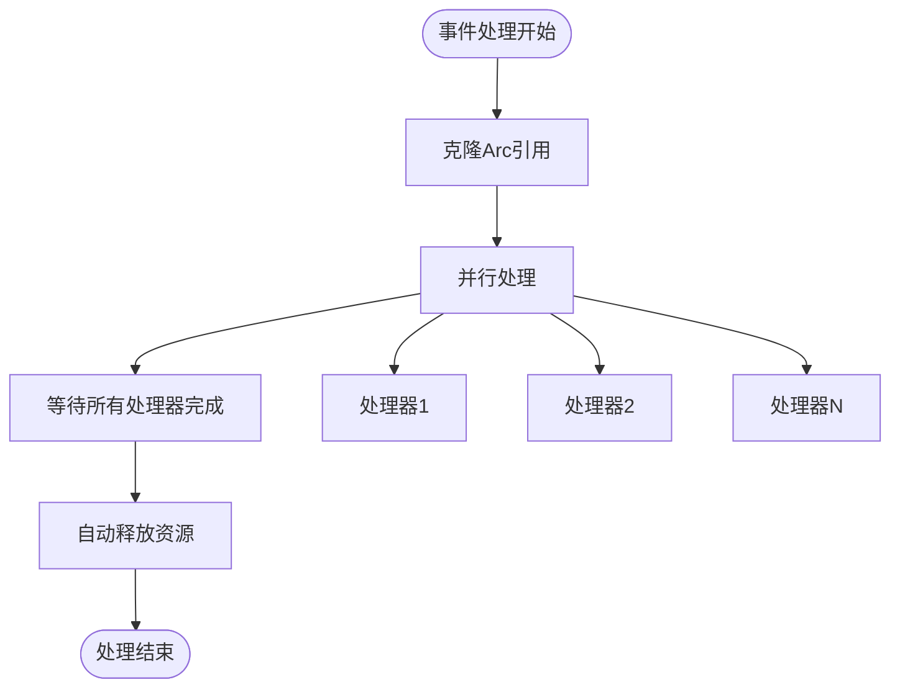

### 并发模型

系统采用生产者-消费者模式，支持高并发事件处理：

- **生产者**：命令处理器、市场数据服务、策略引擎
- **消费者**：事件处理器、业务逻辑服务
- **缓冲区**：广播通道提供事件缓冲
- **背压**：当消费者处理速度慢于生产速度时，自动丢弃过期事件

## 故障排除指南

### 常见问题诊断

#### 命令处理失败

当命令处理失败时，系统会返回详细的错误信息：

1. **参数验证失败**：检查命令参数的有效性
2. **事件发布失败**：检查事件总线连接状态
3. **处理器未找到**：确认处理器已正确注册

#### 事件处理异常

事件处理异常的排查步骤：

1. **检查事件处理器注册**：确认处理器已正确订阅事件类型
2. **验证事件序列化**：确保事件数据格式正确
3. **监控事件队列**：检查事件积压情况

### 调试技巧

#### 日志配置

系统使用标准的日志框架，支持多种日志级别：

- **INFO**：正常操作信息
- **WARN**：潜在问题警告
- **ERROR**：严重错误信息

#### 性能监控

建议监控的关键指标：
- 命令处理延迟
- 事件处理吞吐量
- 内存使用情况
- CPU利用率

**章节来源**
- [error.rs:85-128](file://src/error.rs#L85-L128)

## 结论

命令总线系统是一个设计精良的事件驱动架构实现，具有以下特点：

### 技术优势

1. **清晰的架构分离**：命令和事件的明确分离实现了良好的关注点分离
2. **高度可扩展性**：支持轻松添加新的命令类型和事件处理器
3. **强大的错误处理**：统一的错误类型系统提供了完整的错误传播机制
4. **高性能异步处理**：基于Tokio的异步架构确保了优秀的性能表现

### 应用价值

在交易系统中，该架构提供了以下关键价值：

1. **实时响应**：异步处理确保了交易指令的快速响应
2. **系统解耦**：事件驱动架构实现了各组件间的松耦合
3. **可维护性**：模块化的架构便于系统的维护和扩展
4. **可靠性**：完善的错误处理和监控机制确保了系统的稳定性

### 未来发展方向

系统可以在以下方面进一步改进：
- 添加更多的订单类型支持
- 实现事件溯源功能
- 增强监控和可观测性
- 优化内存使用效率
- 添加分布式部署支持

该系统为构建高性能、可扩展的交易系统奠定了坚实的基础，是事件驱动架构在金融领域的优秀实践案例。