# 回测系统

<cite>
**本文档引用的文件**
- [engine.rs](file://src/backtest/engine.rs)
- [data_loader.rs](file://src/backtest/data_loader.rs)
- [report.rs](file://src/backtest/report.rs)
- [recorder.rs](file://src/backtest/recorder.rs)
- [strategy_v2.rs](file://src/backtest/strategy_v2.rs)
- [backtest.rs](file://src/bin/backtest.rs)
- [config.rs](file://src/config.rs)
- [indicators.rs](file://src/strategies/indicators.rs)
- [momentum_strategy.rs](file://src/strategies/momentum_strategy.rs)
- [Cargo.toml](file://Cargo.toml)
- [default.toml](file://config/default.toml)
- [ARCHITECTURE.md](file://docs/ARCHITECTURE.md)
</cite>

## 目录
1. [简介](#简介)
2. [项目结构](#项目结构)
3. [核心组件](#核心组件)
4. [架构概览](#架构概览)
5. [详细组件分析](#详细组件分析)
6. [依赖关系分析](#依赖关系分析)
7. [性能考虑](#性能考虑)
8. [故障排除指南](#故障排除指南)
9. [结论](#结论)

## 简介

这是一个基于 Rust 的事件驱动回测系统，专为 Binance 期货交易设计。系统提供了多种回测模式，包括历史 K 线回测、实时数据回放回测，以及高级的 V2 策略引擎。该系统采用事件驱动架构，支持参数优化、多策略类型和复杂的风控机制。

## 项目结构

回测系统采用模块化设计，主要包含以下核心模块：

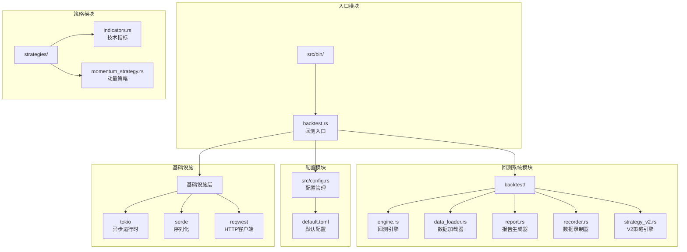

**图表来源**
- [engine.rs:1-631](file://src/backtest/engine.rs#L1-L631)
- [backtest.rs:1-562](file://src/bin/backtest.rs#L1-L562)
- [config.rs:1-406](file://src/config.rs#L1-L406)

**章节来源**
- [Cargo.toml:1-41](file://Cargo.toml#L1-L41)
- [ARCHITECTURE.md:1-723](file://docs/ARCHITECTURE.md#L1-L723)

## 核心组件

### 回测引擎 (BacktestEngine)

回测引擎是系统的核心组件，负责协调整个回测流程。它支持两种回测模式：

1. **K线模式**: 使用历史 K 线数据进行回测
2. **回放模式**: 使用录制的实时数据进行回放

引擎内置了完整的交易逻辑，包括入场、出场、风控和手续费计算。

### 数据加载器 (DataLoader)

数据加载器负责从 Binance API 下载历史数据，或将本地录制的数据转换为回测格式。支持 JSON 和 JSONL 格式的存储。

### 报告生成器 (BacktestReport)

报告生成器提供全面的回测统计分析，包括基础指标、详细指标和逐笔明细。

**章节来源**
- [engine.rs:110-122](file://src/backtest/engine.rs#L110-L122)
- [data_loader.rs:66-76](file://src/backtest/data_loader.rs#L66-L76)
- [report.rs:34-85](file://src/backtest/report.rs#L34-L85)

## 架构概览

系统采用事件驱动架构，实现了松耦合的设计模式：

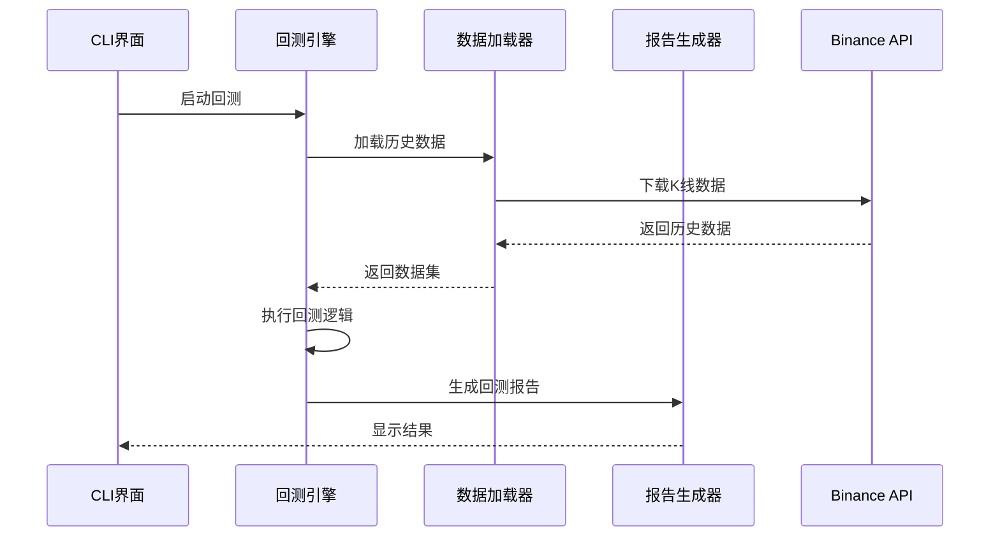

**图表来源**
- [backtest.rs:93-173](file://src/bin/backtest.rs#L93-L173)
- [engine.rs:116-122](file://src/backtest/engine.rs#L116-L122)

系统架构遵循分层设计原则：

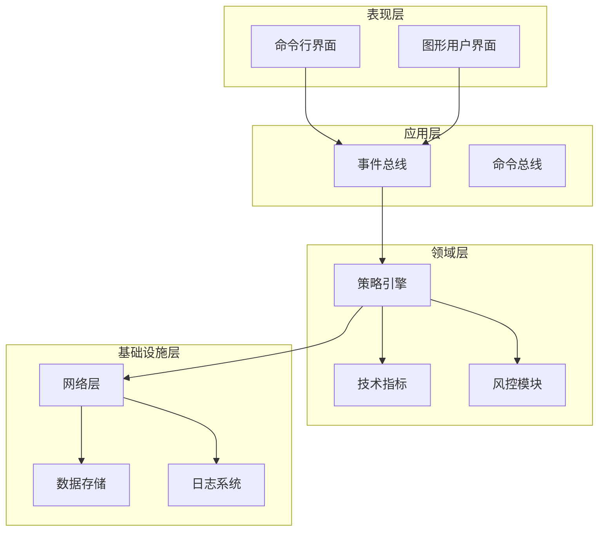

**图表来源**
- [ARCHITECTURE.md:13-104](file://docs/ARCHITECTURE.md#L13-L104)

## 详细组件分析

### 回测引擎组件分析

#### 核心数据结构

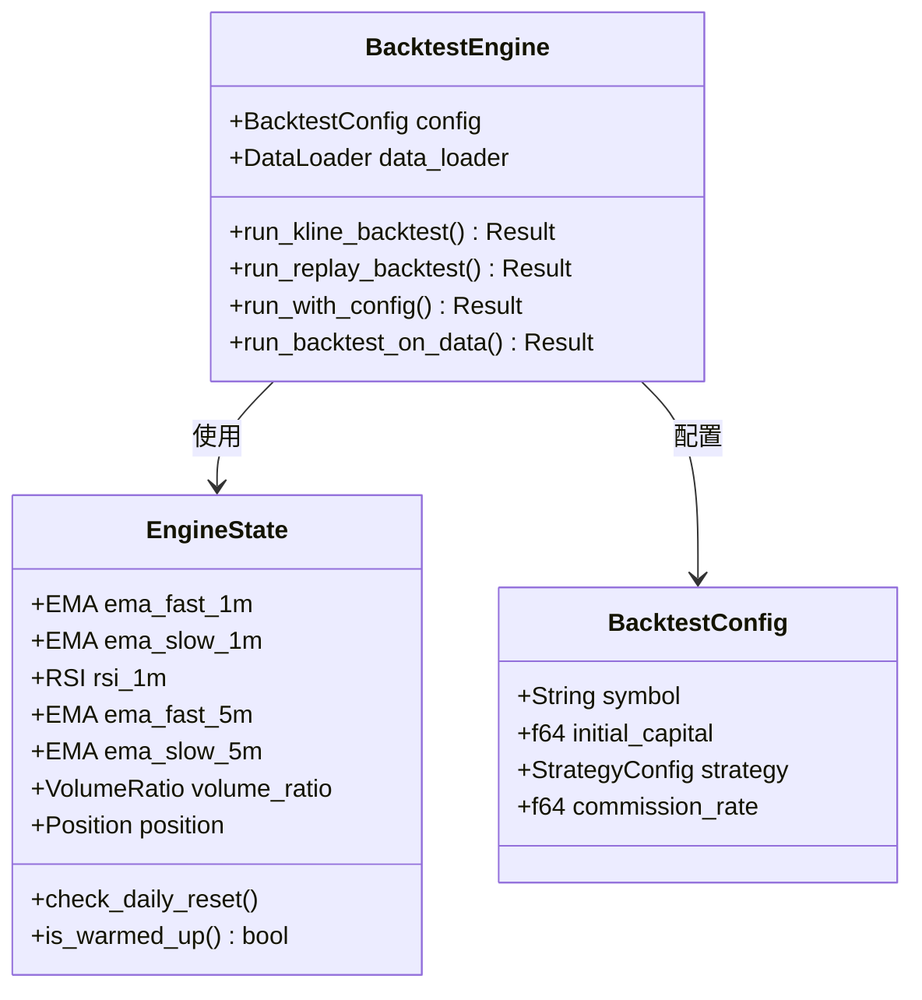

**图表来源**
- [engine.rs:111-122](file://src/backtest/engine.rs#L111-L122)
- [engine.rs:36-108](file://src/backtest/engine.rs#L36-L108)
- [engine.rs:20-26](file://src/backtest/engine.rs#L20-L26)

#### 回测流程时序图

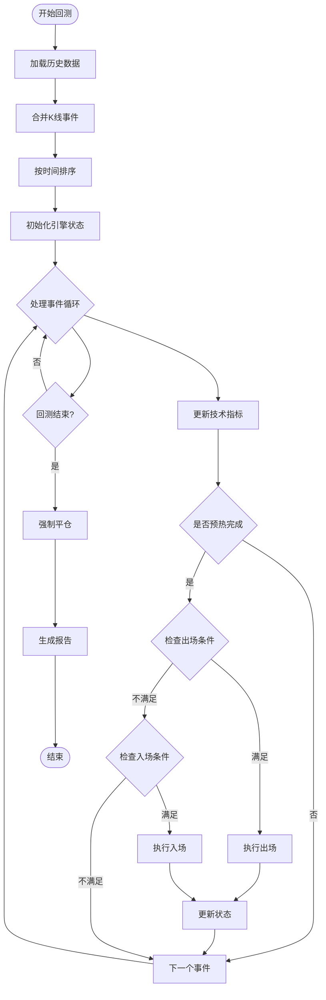

**图表来源**
- [engine.rs:124-314](file://src/backtest/engine.rs#L124-L314)
- [engine.rs:316-476](file://src/backtest/engine.rs#L316-L476)

**章节来源**
- [engine.rs:1-631](file://src/backtest/engine.rs#L1-L631)

### V2 策略引擎分析

#### 多策略类型支持

V2 引擎支持五种不同的策略类型：

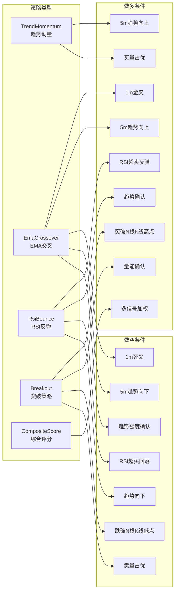

**图表来源**
- [strategy_v2.rs:14-27](file://src/backtest/strategy_v2.rs#L14-L27)
- [strategy_v2.rs:488-598](file://src/backtest/strategy_v2.rs#L488-L598)

#### Intra-bar 止损止盈机制

V2 引擎引入了 Intra-bar（K线内）止损止盈检查：

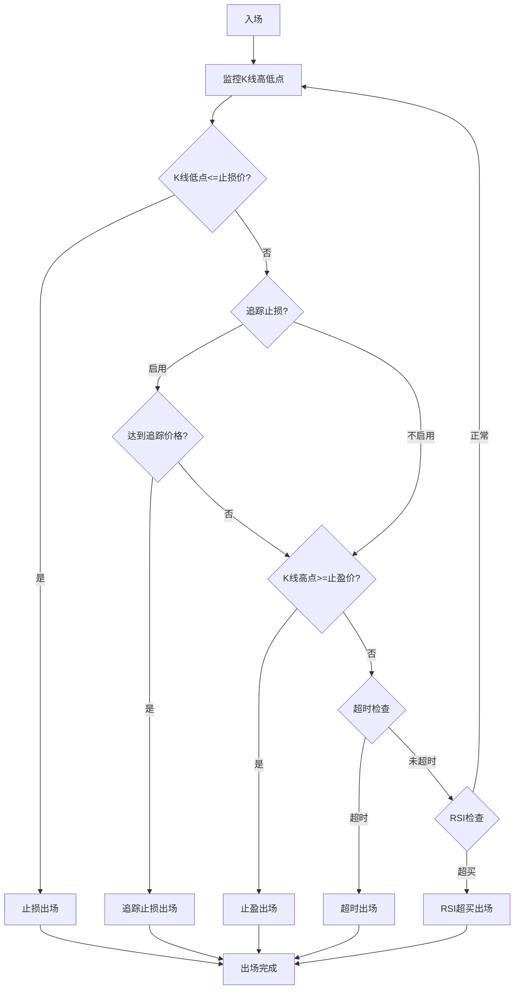

**图表来源**
- [strategy_v2.rs:374-464](file://src/backtest/strategy_v2.rs#L374-L464)

**章节来源**
- [strategy_v2.rs:1-602](file://src/backtest/strategy_v2.rs#L1-L602)

### 数据加载器组件分析

#### 数据格式支持

数据加载器支持多种数据格式：

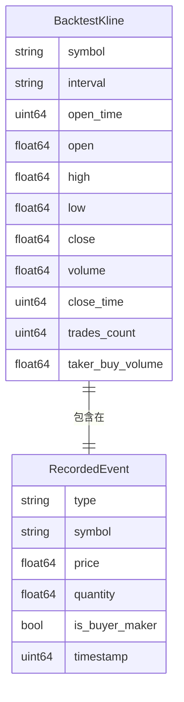

**图表来源**
- [data_loader.rs:10-42](file://src/backtest/data_loader.rs#L10-L42)
- [data_loader.rs:44-64](file://src/backtest/data_loader.rs#L44-L64)

#### 数据下载流程

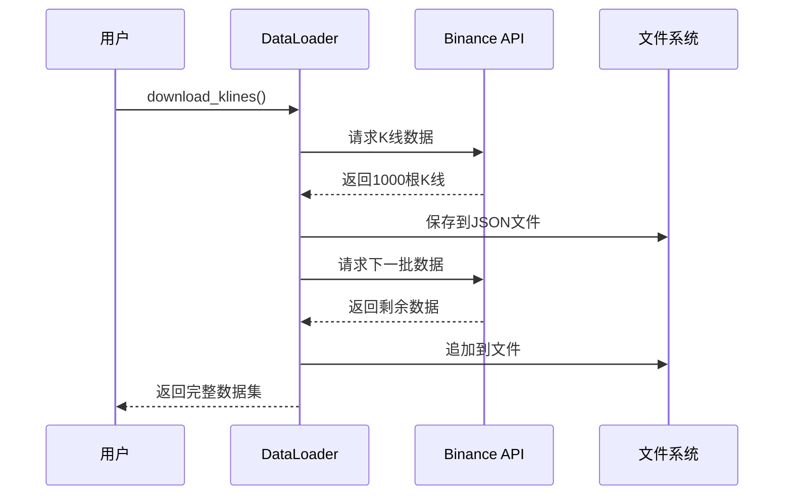

**图表来源**
- [data_loader.rs:78-137](file://src/backtest/data_loader.rs#L78-L137)

**章节来源**
- [data_loader.rs:1-193](file://src/backtest/data_loader.rs#L1-L193)

### 报告生成器组件分析

#### 统计指标计算

报告生成器提供全面的统计分析：

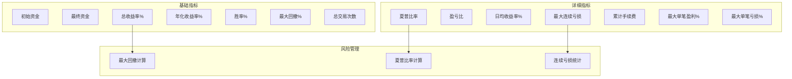

**图表来源**
- [report.rs:34-85](file://src/backtest/report.rs#L34-L85)
- [report.rs:201-256](file://src/backtest/report.rs#L201-L256)

**章节来源**
- [report.rs:1-312](file://src/backtest/report.rs#L1-L312)

## 依赖关系分析

### 核心依赖关系

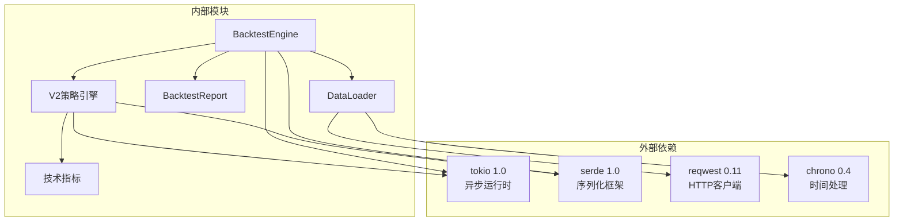

**图表来源**
- [Cargo.toml:14-38](file://Cargo.toml#L14-L38)
- [engine.rs:5-8](file://src/backtest/engine.rs#L5-L8)

### 配置管理

系统采用集中式配置管理：

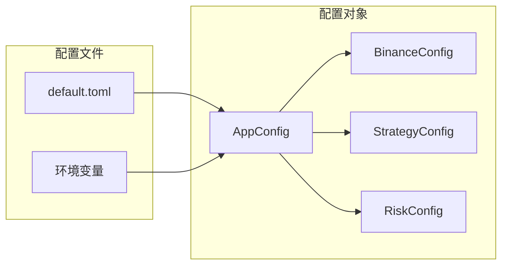

**图表来源**
- [config.rs:9-17](file://src/config.rs#L9-L17)
- [default.toml:1-80](file://config/default.toml#L1-L80)

**章节来源**
- [Cargo.toml:1-41](file://Cargo.toml#L1-L41)
- [config.rs:1-406](file://src/config.rs#L1-L406)

## 性能考虑

### 回测性能优化

1. **内存优化**: V2 引擎支持预加载数据到内存，避免重复 IO 操作
2. **并行处理**: 使用 tokio 异步运行时提高并发性能
3. **数据结构优化**: 使用 VecDeque 和 Vec 优化数据访问效率
4. **算法复杂度**: 指标计算采用 O(1) 时间复杂度

### 参数优化策略

系统提供了高效的参数优化机制：

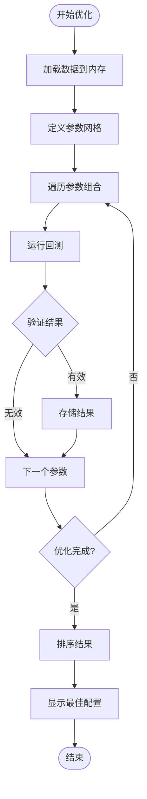

**图表来源**
- [backtest.rs:214-341](file://src/bin/backtest.rs#L214-L341)
- [backtest.rs:343-561](file://src/bin/backtest.rs#L343-L561)

## 故障排除指南

### 常见问题及解决方案

#### 数据下载失败

**问题**: 无法从 Binance 下载历史数据
**解决方案**:
1. 检查网络连接和代理设置
2. 验证 API 密钥权限
3. 检查请求频率限制
4. 确认交易对存在且支持历史数据

#### 回测结果异常

**问题**: 回测结果显示异常的交易信号
**排查步骤**:
1. 检查输入数据质量
2. 验证策略参数设置
3. 确认技术指标计算正确
4. 检查风控规则配置

#### 性能问题

**问题**: 回测执行速度过慢
**优化建议**:
1. 使用预加载数据模式
2. 调整参数网格规模
3. 优化硬件资源配置
4. 检查系统资源使用情况

**章节来源**
- [backtest.rs:175-212](file://src/bin/backtest.rs#L175-L212)
- [config.rs:117-209](file://src/config.rs#L117-L209)

## 结论

这个回测系统提供了完整的事件驱动回测解决方案，具有以下特点：

1. **模块化设计**: 清晰的模块划分和职责分离
2. **高性能**: 优化的算法和异步处理机制
3. **灵活性**: 支持多种策略类型和回测模式
4. **可扩展性**: 易于添加新的策略和指标
5. **可靠性**: 完善的错误处理和配置验证

系统适用于高频交易策略的开发、测试和优化，为量化交易提供了强大的技术支持。通过参数优化和多策略测试，用户可以更好地理解和改进交易策略的表现。