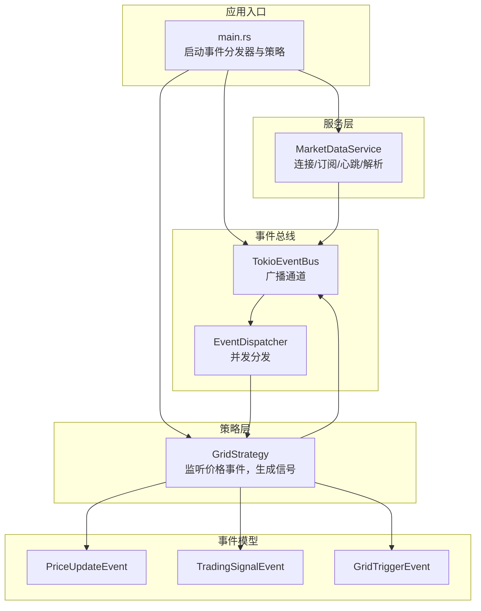
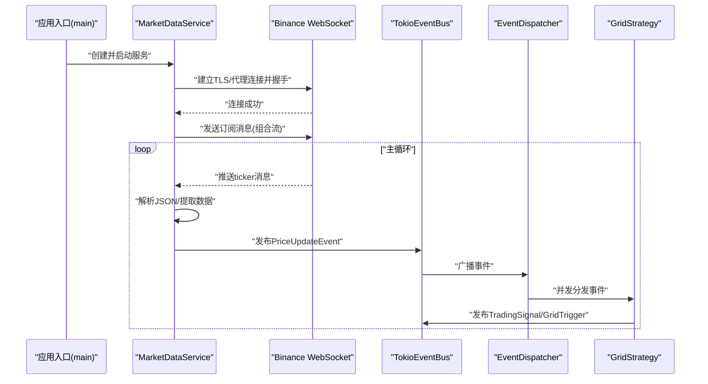
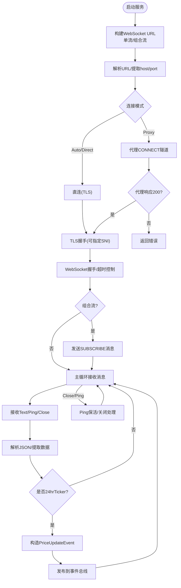
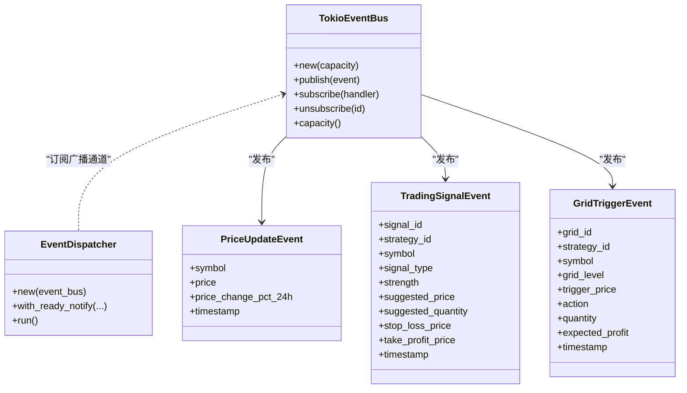
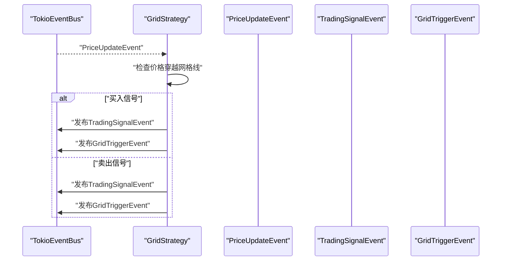
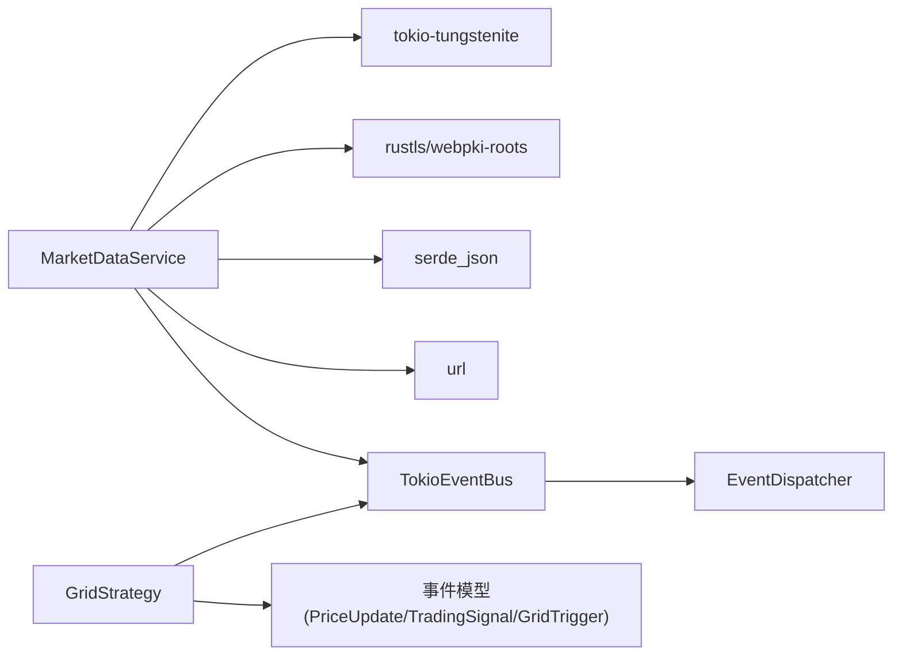

# 市场数据服务

<cite>
**本文引用的文件**
- [market_data_service.rs](file://src/services/market_data_service.rs)
- [market_events.rs](file://src/events/market_events.rs)
- [event_bus.rs](file://src/event_bus.rs)
- [error.rs](file://src/error.rs)
- [main.rs](file://src/main.rs)
- [grid_strategy.rs](file://src/strategies/grid_strategy.rs)
- [logger.rs](file://src/infrastructure/logging/logger.rs)
- [Cargo.toml](file://Cargo.toml)
</cite>

## 目录
1. [简介](#简介)
2. [项目结构](#项目结构)
3. [核心组件](#核心组件)
4. [架构总览](#架构总览)
5. [详细组件分析](#详细组件分析)
6. [依赖关系分析](#依赖关系分析)
7. [性能考量](#性能考量)
8. [故障排查指南](#故障排查指南)
9. [结论](#结论)
10. [附录](#附录)

## 简介
本文件面向“市场数据服务”的技术文档，聚焦于以下方面：
- WebSocket 连接实现与自动重连策略
- 实时数据处理机制与消息解析
- Binance WebSocket API 的集成方式（连接建立、订阅管理、消息解析）
- 数据流处理管道（从原始 WebSocket 消息到结构化事件的转换）
- 代理支持配置、连接状态管理、错误恢复机制
- 配置选项、性能优化与内存管理策略
- 实际使用示例：订阅不同市场数据流、处理数据更新、实现自定义数据处理器
- 与网格策略引擎的数据交互方式

## 项目结构
该项目采用事件驱动架构，核心模块如下：
- 服务层：市场数据服务负责连接 Binance WebSocket、订阅行情、解析消息并发布事件
- 事件总线：统一事件发布/订阅与分发
- 事件模型：定义价格更新、K线完成、订单簿更新、交易信号、网格触发等事件
- 策略层：网格策略监听价格事件，生成交易信号与网格触发事件
- 基础设施：日志、错误处理等

图表来源
- [main.rs:10-93](file://src/main.rs#L10-L93)
- [market_data_service.rs:35-440](file://src/services/market_data_service.rs#L35-L440)
- [event_bus.rs:62-158](file://src/event_bus.rs#L62-L158)
- [grid_strategy.rs:159-278](file://src/strategies/grid_strategy.rs#L159-L278)

章节来源
- [Cargo.toml:1-27](file://Cargo.toml#L1-L27)
- [main.rs:10-93](file://src/main.rs#L10-L93)

## 核心组件
- 市场数据服务：封装 WebSocket 连接、代理/直连、订阅管理、心跳、消息解析与事件发布
- 事件总线：基于广播通道的异步事件总线，支持并发分发
- 事件模型：定义价格更新、交易信号、网格触发等事件
- 网格策略：订阅价格事件，根据网格配置生成交易信号与网格触发事件
- 错误处理：统一 DomainError，分层错误类型便于定位与恢复
- 日志：异步日志记录器，支持文本/JSON 格式与日志轮转

章节来源
- [market_data_service.rs:35-440](file://src/services/market_data_service.rs#L35-L440)
- [event_bus.rs:18-158](file://src/event_bus.rs#L18-L158)
- [error.rs:12-169](file://src/error.rs#L12-L169)
- [grid_strategy.rs:159-278](file://src/strategies/grid_strategy.rs#L159-L278)
- [logger.rs:140-338](file://src/infrastructure/logging/logger.rs#L140-L338)

## 架构总览
市场数据服务通过 Binance WebSocket 接收实时行情，解析为结构化事件后发布到事件总线；策略订阅相应事件，生成交易信号并回传到事件总线，形成闭环。

图表来源
- [market_data_service.rs:117-374](file://src/services/market_data_service.rs#L117-L374)
- [event_bus.rs:129-157](file://src/event_bus.rs#L129-L157)
- [grid_strategy.rs:189-252](file://src/strategies/grid_strategy.rs#L189-L252)

## 详细组件分析

### 市场数据服务（MarketDataService）
- 连接模式
  - Auto：优先使用环境变量 HTTPS_PROXY 或 https_proxy
  - Direct：强制直连
  - Proxy：强制使用代理（需设置 HTTPS_PROXY）
  - SSH隧道：当环境变量 USE_SSH_TUNNEL 存在时，连接本地端口并以 stream.binance.com 作为 TLS 主机名进行校验
- 代理支持
  - 解析代理 URL，建立 TCP 连接
  - 发送 HTTP CONNECT 请求建立隧道
  - 读取代理响应头，校验 200 OK
  - 在隧道上进行 TLS 握手
- 连接与订阅
  - 组合流：一次性发送 SUBSCRIBE 请求，参数为多个 symbol@ticker
  - 单流：无需额外订阅，直接接收
- 心跳与保活
  - 定时发送 Ping，收到 Close/Ping 时自动处理
- 消息解析与事件发布
  - 解析 JSON，兼容组合流与单流格式
  - 过滤非 24hrTicker 的消息
  - 构造 PriceUpdateEvent 并发布到事件总线
- 自动重连
  - start 循环中捕获错误并按固定间隔重连
  - 连接成功后正常退出循环

图表来源
- [market_data_service.rs:44-51](file://src/services/market_data_service.rs#L44-L51)
- [market_data_service.rs:117-178](file://src/services/market_data_service.rs#L117-L178)
- [market_data_service.rs:232-301](file://src/services/market_data_service.rs#L232-L301)
- [market_data_service.rs:304-374](file://src/services/market_data_service.rs#L304-L374)
- [market_data_service.rs:377-407](file://src/services/market_data_service.rs#L377-L407)
- [market_data_service.rs:96-114](file://src/services/market_data_service.rs#L96-L114)

章节来源
- [market_data_service.rs:23-42](file://src/services/market_data_service.rs#L23-L42)
- [market_data_service.rs:44-51](file://src/services/market_data_service.rs#L44-L51)
- [market_data_service.rs:117-178](file://src/services/market_data_service.rs#L117-L178)
- [market_data_service.rs:232-301](file://src/services/market_data_service.rs#L232-L301)
- [market_data_service.rs:304-374](file://src/services/market_data_service.rs#L304-L374)
- [market_data_service.rs:377-407](file://src/services/market_data_service.rs#L377-L407)
- [market_data_service.rs:96-114](file://src/services/market_data_service.rs#L96-L114)

### 事件总线与事件模型
- 事件总线
  - 基于广播通道，支持并发分发
  - 订阅/取消订阅管理
  - Ready 通知机制，确保分发器就绪后再发布事件
- 事件模型
  - 价格更新、K线完成、订单簿更新
  - 交易事件（提交/成交/取消/拒绝）
  - 账户事件（余额/持仓）
  - 策略事件（交易信号、网格触发、网格状态变更）
  - 风控事件（风控检查/告警）

图表来源
- [event_bus.rs:62-158](file://src/event_bus.rs#L62-L158)
- [events/mod.rs:49-89](file://src/events/mod.rs#L49-L89)
- [market_events.rs:8-18](file://src/events/market_events.rs#L8-L18)
- [events/strategy_events.rs:8-30](file://src/events/strategy_events.rs#L8-L30)
- [events/strategy_events.rs:33-53](file://src/events/strategy_events.rs#L33-L53)

章节来源
- [event_bus.rs:18-158](file://src/event_bus.rs#L18-L158)
- [events/mod.rs:49-89](file://src/events/mod.rs#L49-L89)
- [market_events.rs:8-18](file://src/events/market_events.rs#L8-L18)
- [events/strategy_events.rs:8-30](file://src/events/strategy_events.rs#L8-L30)
- [events/strategy_events.rs:33-53](file://src/events/strategy_events.rs#L33-L53)

### 网格策略引擎
- 监听价格更新事件，根据网格配置判断穿越网格线并生成交易信号
- 发布 TradingSignalEvent 与 GridTriggerEvent
- 与事件总线解耦，通过订阅/发布实现松耦合

图表来源
- [grid_strategy.rs:189-252](file://src/strategies/grid_strategy.rs#L189-L252)
- [events/strategy_events.rs:8-30](file://src/events/strategy_events.rs#L8-L30)
- [events/strategy_events.rs:33-53](file://src/events/strategy_events.rs#L33-L53)

章节来源
- [grid_strategy.rs:159-278](file://src/strategies/grid_strategy.rs#L159-L278)

### 错误处理与日志
- 统一错误类型：Infrastructure/EventBus/CommandBus/Service/Unknown
- MarketData 专用错误：连接超时、TLS 握手失败、代理 CONNECT 失败、JSON 解析失败、发布事件失败等
- 日志：异步日志记录器，支持文本/JSON 格式、文件轮转、缓冲区大小配置

章节来源
- [error.rs:12-169](file://src/error.rs#L12-L169)
- [logger.rs:140-338](file://src/infrastructure/logging/logger.rs#L140-L338)

## 依赖关系分析
- 运行时依赖：Tokio（异步）、tokio-tungstenite（WebSocket）、rustls/webpki-roots（TLS）、serde/serde_json（序列化）、url（URL解析）、log/env_logger（日志）
- 事件总线与策略：通过事件总线实现解耦，策略可独立扩展
- 服务与策略：服务负责数据采集，策略负责决策，二者通过事件模型交互

图表来源
- [Cargo.toml:6-25](file://Cargo.toml#L6-L25)
- [market_data_service.rs:6-21](file://src/services/market_data_service.rs#L6-L21)
- [event_bus.rs:62-158](file://src/event_bus.rs#L62-L158)
- [grid_strategy.rs:159-278](file://src/strategies/grid_strategy.rs#L159-L278)

章节来源
- [Cargo.toml:6-25](file://Cargo.toml#L6-L25)

## 性能考量
- 并发分发：事件总线使用广播通道，EventDispatcher 并行调用所有处理器，提升吞吐
- 心跳保活：定时 Ping，降低连接中断风险
- 超时控制：连接/TLS/握手均设置超时，避免阻塞
- 代理隧道：CONNECT 成功后进入 TLS，减少不必要的握手开销
- 日志异步：异步日志记录器避免阻塞事件处理
- 内存管理：事件结构体为简单数据载体，避免深层拷贝；使用 Arc 管理共享资源

[本节为通用性能建议，不直接分析具体文件]

## 故障排查指南
- 连接失败
  - 检查网络与代理设置；确认 HTTPS_PROXY 或 https_proxy 环境变量
  - 若使用代理，确认代理服务器可达且返回 200 OK
  - 若启用 SSH 隧道，确认本地端口与 TLS 主机名配置正确
- TLS 握手失败
  - 确认系统根证书可用；检查 SNI 主机名与证书匹配
- WebSocket 握手超时
  - 检查防火墙/代理策略；适当增大 connect_timeout
- 代理 CONNECT 失败
  - 校验代理 URL 与端口；确认代理允许 CONNECT
- 消息解析失败
  - 检查 JSON 结构是否符合 Binance 格式；确认组合流 data 字段提取逻辑
- 事件发布失败
  - 检查事件总线容量与订阅者状态；查看 EventDispatcher 并行处理错误
- 自动重连
  - 查看重连间隔与错误日志；确认 start 循环中的错误处理

章节来源
- [market_data_service.rs:117-178](file://src/services/market_data_service.rs#L117-L178)
- [market_data_service.rs:232-301](file://src/services/market_data_service.rs#L232-L301)
- [market_data_service.rs:377-407](file://src/services/market_data_service.rs#L377-L407)
- [event_bus.rs:88-110](file://src/event_bus.rs#L88-L110)

## 结论
该市场数据服务完整实现了 Binance WebSocket 的连接、订阅、心跳与消息解析，并通过事件总线与网格策略引擎解耦协作。其设计具备良好的可扩展性与可维护性，适合在生产环境中部署并进一步扩展为多市场、多事件源的事件驱动交易系统。

[本节为总结性内容，不直接分析具体文件]

## 附录

### 配置选项与使用示例
- 连接模式
  - Auto：自动检测 HTTPS_PROXY/https_proxy
  - Direct：强制直连
  - Proxy：强制使用代理（需设置 HTTPS_PROXY）
  - SSH 隧道：设置 USE_SSH_TUNNEL 环境变量，连接本地端口并以 stream.binance.com 作为 TLS 主机名
- 重连与超时
  - 重连间隔：默认 5 秒
  - 连接超时：默认 30 秒
- 订阅管理
  - 单流：每个 symbol@ticker
  - 组合流：一次性订阅多个 symbol@ticker
- 实际使用示例
  - 在应用入口启动事件分发器与网格策略，创建 MarketDataService 并启动
  - 通过事件总线订阅 PriceUpdate 事件，实现自定义数据处理器
  - 策略侧监听价格事件，生成交易信号与网格触发事件

章节来源
- [market_data_service.rs:78-94](file://src/services/market_data_service.rs#L78-L94)
- [market_data_service.rs:54-76](file://src/services/market_data_service.rs#L54-L76)
- [main.rs:62-92](file://src/main.rs#L62-L92)