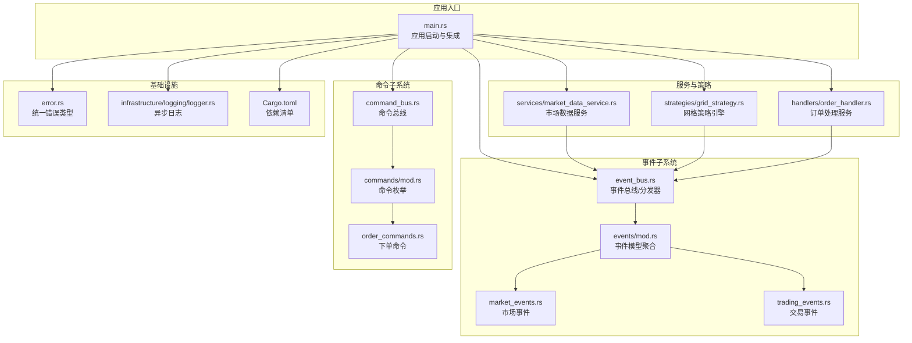
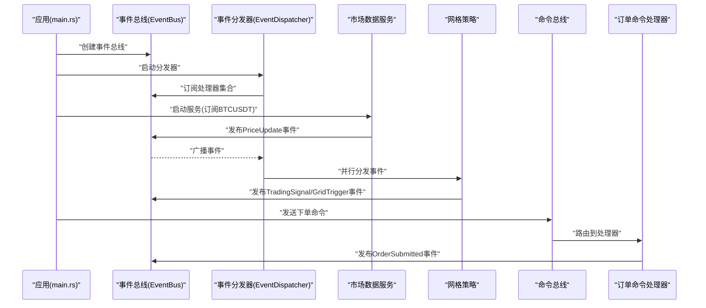
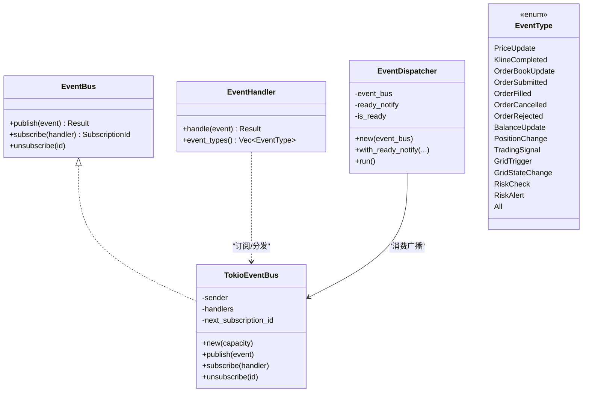
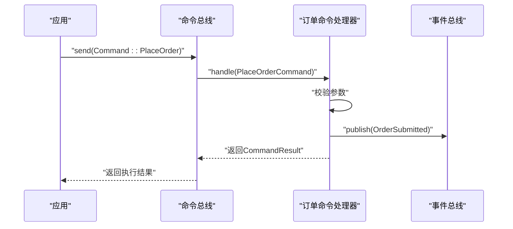
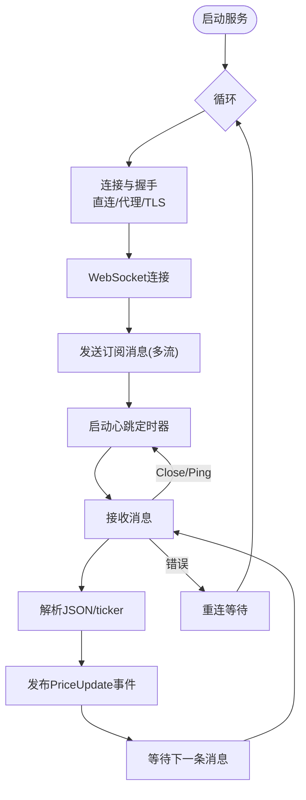
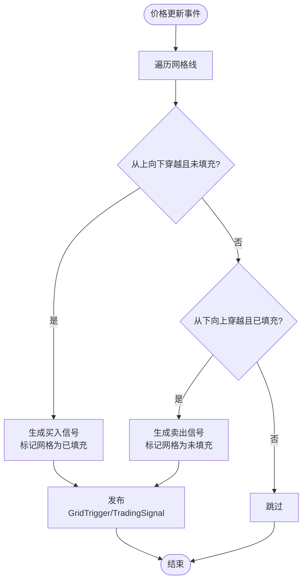
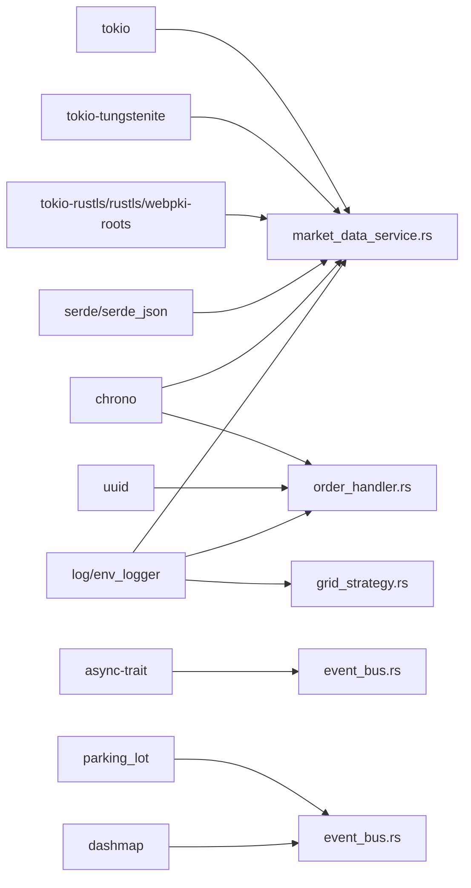

# 核心模块

<cite>
**本文引用的文件**
- [lib.rs](file://src/lib.rs)
- [main.rs](file://src/main.rs)
- [event_bus.rs](file://src/event_bus.rs)
- [command_bus.rs](file://src/command_bus.rs)
- [market_data_service.rs](file://src/services/market_data_service.rs)
- [grid_strategy.rs](file://src/strategies/grid_strategy.rs)
- [order_handler.rs](file://src/handlers/order_handler.rs)
- [mod.rs（命令）](file://src/commands/mod.rs)
- [order_commands.rs](file://src/commands/order_commands.rs)
- [mod.rs（事件）](file://src/events/mod.rs)
- [trading_events.rs](file://src/events/trading_events.rs)
- [market_events.rs](file://src/events/market_events.rs)
- [error.rs](file://src/error.rs)
- [logger.rs](file://src/infrastructure/logging/logger.rs)
- [Cargo.toml](file://Cargo.toml)
</cite>

## 目录
1. [简介](#简介)
2. [项目结构](#项目结构)
3. [核心组件](#核心组件)
4. [架构总览](#架构总览)
5. [详细组件分析](#详细组件分析)
6. [依赖分析](#依赖分析)
7. [性能考虑](#性能考虑)
8. [故障排查指南](#故障排查指南)
9. [结论](#结论)
10. [附录](#附录)

## 简介
本文件面向Binance Rust事件驱动交易系统的核心模块，系统采用事件驱动架构，围绕事件总线与命令总线构建，配合市场数据服务与网格策略引擎，形成“数据采集—事件发布—策略决策—命令下发—订单处理”的闭环。本文档从职责、接口设计、配置选项、使用方法、代码级图示与最佳实践等维度，全面阐述各模块。

## 项目结构
系统采用按功能域划分的模块组织方式，核心模块包括：
- 事件总线与事件模型：负责事件发布、订阅、分发与事件类型定义
- 命令总线与命令模型：负责命令路由、参数校验与执行结果封装
- 市场数据服务：负责WebSocket连接、实时行情解析与事件发布
- 网格策略引擎：负责价格穿越检测、交易信号生成与网格事件发布
- 订单处理服务：负责订单生命周期事件的消费与处理
- 基础设施与错误处理：统一错误类型、日志系统

图表来源
- [main.rs:10-93](file://src/main.rs#L10-L93)
- [event_bus.rs:18-110](file://src/event_bus.rs#L18-L110)
- [command_bus.rs:5-19](file://src/command_bus.rs#L5-L19)
- [market_data_service.rs:34-114](file://src/services/market_data_service.rs#L34-L114)
- [grid_strategy.rs:156-278](file://src/strategies/grid_strategy.rs#L156-L278)
- [order_handler.rs:9-91](file://src/handlers/order_handler.rs#L9-L91)
- [mod.rs（事件）:48-89](file://src/events/mod.rs#L48-L89)
- [mod.rs（命令）:6-21](file://src/commands/mod.rs#L6-L21)
- [order_commands.rs:36-72](file://src/commands/order_commands.rs#L36-L72)
- [error.rs:12-34](file://src/error.rs#L12-L34)
- [logger.rs:140-291](file://src/infrastructure/logging/logger.rs#L140-L291)
- [Cargo.toml:6-25](file://Cargo.toml#L6-L25)

章节来源
- [lib.rs:1-9](file://src/lib.rs#L1-L9)
- [main.rs:10-93](file://src/main.rs#L10-L93)
- [Cargo.toml:1-27](file://Cargo.toml#L1-L27)

## 核心组件
本节概述四大核心模块的职责与边界：
- 事件总线系统：提供发布/订阅/分发能力，支持并行分发与错误隔离
- 命令总线系统：集中路由命令，执行参数校验与结果封装
- 市场数据服务：连接Binance WebSocket，解析实时行情并发布价格事件
- 网格策略引擎：基于价格穿越生成交易信号与网格触发事件
- 订单处理服务：消费订单生命周期事件，进行业务处理（当前为占位）

章节来源
- [event_bus.rs:18-110](file://src/event_bus.rs#L18-L110)
- [command_bus.rs:5-19](file://src/command_bus.rs#L5-L19)
- [market_data_service.rs:34-114](file://src/services/market_data_service.rs#L34-L114)
- [grid_strategy.rs:156-278](file://src/strategies/grid_strategy.rs#L156-L278)
- [order_handler.rs:9-91](file://src/handlers/order_handler.rs#L9-L91)

## 架构总览
系统采用“事件驱动 + 命令驱动”双通道：
- 数据通道：市场数据服务通过WebSocket接收实时行情，解析为价格事件并发布到事件总线；策略订阅价格事件，生成交易信号与网格事件并发布
- 控制通道：应用通过命令总线发送下单命令，命令处理器校验参数后发布“订单提交”事件，订单处理器消费该事件并处理后续逻辑

图表来源
- [main.rs:14-60](file://src/main.rs#L14-L60)
- [event_bus.rs:88-158](file://src/event_bus.rs#L88-L158)
- [market_data_service.rs:96-114](file://src/services/market_data_service.rs#L96-L114)
- [grid_strategy.rs:189-252](file://src/strategies/grid_strategy.rs#L189-L252)
- [command_bus.rs:8-19](file://src/command_bus.rs#L8-L19)
- [order_handler.rs:93-137](file://src/handlers/order_handler.rs#L93-L137)

## 详细组件分析

### 事件总线系统
- 职责
  - 发布领域事件
  - 订阅处理器并维护订阅表
  - 事件分发器并发分发事件给所有订阅者
- 接口设计
  - EventBus Trait：publish、subscribe、unsubscribe
  - EventHandler Trait：handle、event_types
  - EventType 枚举：覆盖市场、交易、账户、策略、风控等事件类型
  - TokioEventBus：基于broadcast通道的实现
  - EventDispatcher：订阅广播通道并在循环中并行调用各处理器
- 配置与使用
  - 通过构造函数创建，传入容量参数
  - 订阅时返回自增订阅ID，支持取消订阅
  - 分发器启动后进入事件循环，使用join_all并行等待所有处理器完成
- 最佳实践
  - 处理器内部应快速处理并避免阻塞
  - 对异常进行捕获并记录，保证不影响其他处理器
  - 使用事件类型过滤减少无关事件处理

图表来源
- [event_bus.rs:18-110](file://src/event_bus.rs#L18-L110)
- [event_bus.rs:112-158](file://src/event_bus.rs#L112-L158)
- [event_bus.rs:41-59](file://src/event_bus.rs#L41-L59)

章节来源
- [event_bus.rs:18-110](file://src/event_bus.rs#L18-L110)
- [event_bus.rs:112-158](file://src/event_bus.rs#L112-L158)
- [event_bus.rs:41-59](file://src/event_bus.rs#L41-L59)

### 命令总线系统
- 职责
  - 路由命令到对应处理器
  - 封装执行结果（成功/失败/受理中）
- 接口设计
  - Command 枚举：当前包含下单命令
  - CommandResult：统一结果封装
  - CommandBus：根据命令类型路由到处理器
  - OrderCommandHandler：处理下单命令，进行参数校验并发布“订单提交”事件
- 命令类型与参数
  - 下单命令：支持买卖方向、订单类型（限价/市价/止损/止盈）、价格、数量、客户端订单ID
- 执行流程
  - 校验数量>0
  - 构造“订单提交”事件并发布
  - 返回CommandResult

图表来源
- [command_bus.rs:8-19](file://src/command_bus.rs#L8-L19)
- [order_handler.rs:93-137](file://src/handlers/order_handler.rs#L93-L137)
- [order_commands.rs:36-72](file://src/commands/order_commands.rs#L36-L72)
- [mod.rs（命令）:6-21](file://src/commands/mod.rs#L6-L21)

章节来源
- [command_bus.rs:5-19](file://src/command_bus.rs#L5-L19)
- [order_handler.rs:93-137](file://src/handlers/order_handler.rs#L93-L137)
- [order_commands.rs:36-72](file://src/commands/order_commands.rs#L36-L72)
- [mod.rs（命令）:6-21](file://src/commands/mod.rs#L6-L21)

### 市场数据服务
- 职责
  - 连接Binance WebSocket，订阅ticker流，解析行情并发布价格事件
  - 支持自动重连、心跳保活、代理/直连模式
- 接口设计
  - MarketDataService：构造、配置连接模式/超时/重连间隔、启动服务
  - ConnectionMode：Auto/Direct/Proxy
  - start：主循环，失败时按间隔重连
  - connect_and_run：根据模式选择直连或代理，完成TLS握手与WebSocket握手
  - handle_message：解析JSON，提取ticker数据，构造价格事件并发布
- 配置选项
  - 连接模式：Auto/Direct/Proxy（受环境变量影响）
  - 连接超时：默认30秒
  - 重连间隔：默认5秒
  - 代理：HTTPS_PROXY/https_proxy
  - SSH隧道：USE_SSH_TUNNEL环境变量启用本地回环+TLS主机名校验
- 使用方法
  - 构造事件总线与服务实例
  - 配置连接模式
  - 启动服务任务，持续接收并发布价格事件

图表来源
- [market_data_service.rs:96-114](file://src/services/market_data_service.rs#L96-L114)
- [market_data_service.rs:117-178](file://src/services/market_data_service.rs#L117-L178)
- [market_data_service.rs:303-374](file://src/services/market_data_service.rs#L303-L374)
- [market_data_service.rs:376-407](file://src/services/market_data_service.rs#L376-L407)

章节来源
- [market_data_service.rs:34-114](file://src/services/market_data_service.rs#L34-L114)
- [market_data_service.rs:117-178](file://src/services/market_data_service.rs#L117-L178)
- [market_data_service.rs:303-374](file://src/services/market_data_service.rs#L303-L374)
- [market_data_service.rs:376-407](file://src/services/market_data_service.rs#L376-L407)

### 网格策略引擎
- 职责
  - 基于价格穿越网格线生成交易信号与网格触发事件
  - 维护网格状态（每格是否已触发）
- 接口设计
  - GridConfig：策略ID、交易对、区间上下限、网格数量、每格数量、利润阈值
  - GridStrategy：实现EventHandler，订阅价格事件，生成信号并发布
  - GridState：网格线列表、上次价格、信号计数
- 策略逻辑
  - 价格从上向下穿越未填充网格线：生成买入信号
  - 价格从下向上穿越已填充网格线：生成卖出信号
  - 每次触发更新信号计数与网格填充状态
- 输出事件
  - TradingSignalEvent：包含信号ID、策略ID、交易对、信号类型、建议价格/数量、止盈止损等
  - GridTriggerEvent：网格触发事件，携带网格级别与数量

图表来源
- [grid_strategy.rs:102-154](file://src/strategies/grid_strategy.rs#L102-L154)
- [grid_strategy.rs:189-252](file://src/strategies/grid_strategy.rs#L189-L252)

章节来源
- [grid_strategy.rs:26-81](file://src/strategies/grid_strategy.rs#L26-L81)
- [grid_strategy.rs:83-154](file://src/strategies/grid_strategy.rs#L83-L154)
- [grid_strategy.rs:156-278](file://src/strategies/grid_strategy.rs#L156-L278)

### 订单处理服务
- 职责
  - 订阅订单生命周期事件（提交/成交/取消/拒绝），进行业务处理（当前为占位）
- 接口设计
  - OrderHandler：实现EventHandler，处理四类事件
  - 订阅事件类型：OrderSubmitted、OrderFilled、OrderCancelled、OrderRejected
- 使用方法
  - 将处理器注册到事件总线，即可自动消费相关事件

章节来源
- [order_handler.rs:9-91](file://src/handlers/order_handler.rs#L9-L91)

## 依赖分析
- 模块耦合
  - 事件总线是核心枢纽，被市场数据服务、网格策略、订单处理服务广泛依赖
  - 命令总线依赖事件总线以发布领域事件
  - 市场数据服务与网格策略之间通过事件解耦
- 外部依赖
  - 异步运行时与并发：tokio、futures-util
  - WebSocket与TLS：tokio-tungstenite、tokio-rustls、rustls、webpki-roots
  - 序列化：serde、serde_json
  - 并发容器：parking_lot、dashmap
  - 日志：log、env_logger
  - 时间与时序：chrono
  - 错误处理：thiserror
- 循环依赖
  - 未发现直接循环依赖；事件模型通过枚举聚合，避免循环导入

图表来源
- [Cargo.toml:6-25](file://Cargo.toml#L6-L25)
- [market_data_service.rs:8-21](file://src/services/market_data_service.rs#L8-L21)
- [order_handler.rs:1-7](file://src/handlers/order_handler.rs#L1-L7)
- [grid_strategy.rs:1-13](file://src/strategies/grid_strategy.rs#L1-L13)
- [event_bus.rs:5-10](file://src/event_bus.rs#L5-L10)

章节来源
- [Cargo.toml:6-25](file://Cargo.toml#L6-L25)

## 性能考虑
- 事件分发并行化：分发器使用join_all并行调用所有处理器，提升吞吐
- 广播通道容量：TokioEventBus的容量参数需结合负载评估，避免发布阻塞
- WebSocket长连接：心跳保活与Ping/Pong自动处理，降低断连概率
- 日志异步化：异步日志器避免I/O阻塞主线程
- 代理/直连选择：在受限网络环境下合理选择连接模式，减少握手与代理延迟

## 故障排查指南
- 事件总线
  - 发布失败：检查广播通道是否关闭或满载
  - 处理器异常：分发器会捕获并打印错误，定位具体处理器
- 命令总线
  - 参数校验失败：下单命令数量必须>0
  - 处理器未找到：确认命令类型与处理器映射
- 市场数据服务
  - URL解析失败/缺少host：检查WS地址构建逻辑
  - 握手超时/失败：检查网络、代理、TLS主机名
  - 代理CONNECT失败：确认代理地址与认证
  - JSON解析失败：检查消息格式与字段
- 网格策略
  - 未生成信号：确认价格穿越条件与网格填充状态
- 订单处理
  - 事件未消费：确认处理器已订阅相应事件类型

章节来源
- [error.rs:85-128](file://src/error.rs#L85-L128)
- [market_data_service.rs:121-178](file://src/services/market_data_service.rs#L121-L178)
- [market_data_service.rs:379-407](file://src/services/market_data_service.rs#L379-L407)
- [order_handler.rs:103-137](file://src/handlers/order_handler.rs#L103-L137)

## 结论
本系统通过事件总线与命令总线实现了清晰的解耦与高扩展性，市场数据服务与网格策略引擎分别承担数据接入与策略决策，订单处理服务负责生命周期事件的消费。配合完善的错误类型与异步日志，系统具备良好的可观测性与可维护性。建议在生产环境中进一步完善订单执行与风控模块，并引入事件溯源与持久化以增强审计与回放能力。

## 附录
- 使用示例（路径）
  - 启动事件总线与分发器：[main.rs:14-22](file://src/main.rs#L14-L22)
  - 发送下单命令：[main.rs:24-41](file://src/main.rs#L24-L41)
  - 注册网格策略：[main.rs:42-60](file://src/main.rs#L42-L60)
  - 启动市场数据服务：[main.rs:62-92](file://src/main.rs#L62-L92)
- 最佳实践
  - 事件处理器应无阻塞、幂等化
  - 命令处理器应前置参数校验与业务规则检查
  - WebSocket服务应具备指数退避与熔断策略
  - 日志级别与轮转策略需结合生产环境调整