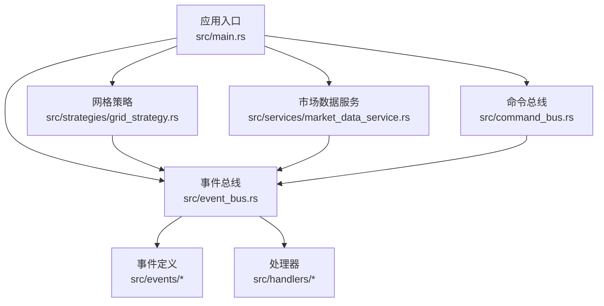
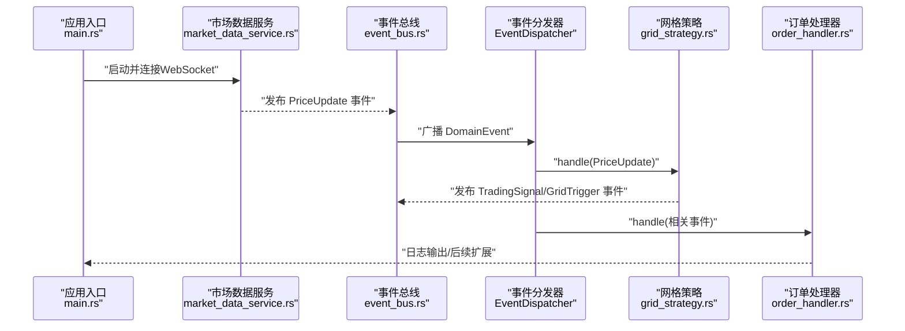
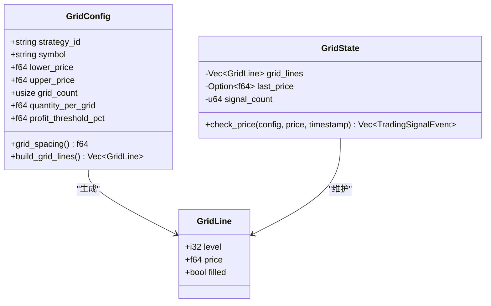
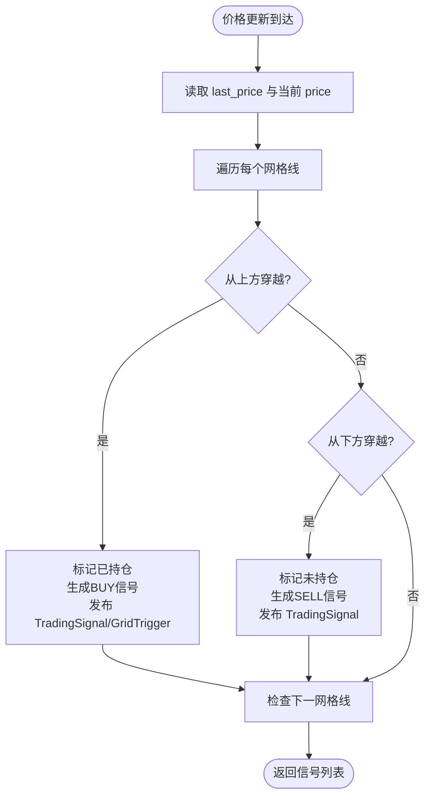
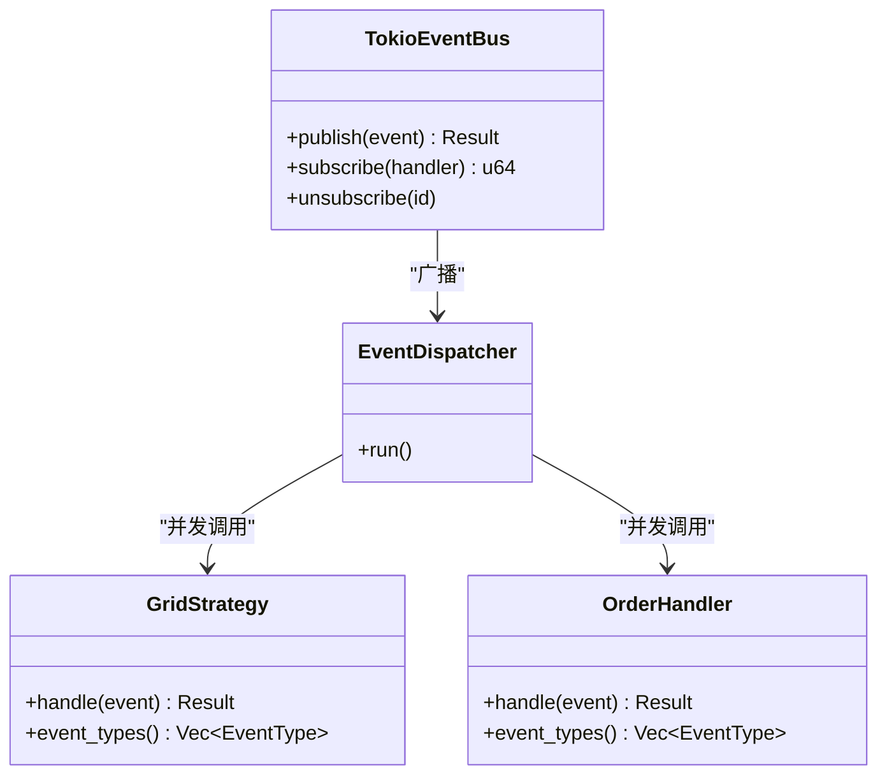
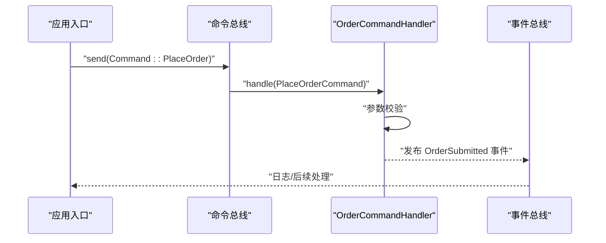
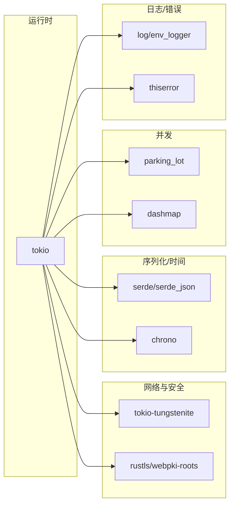

# 网格策略引擎

<cite>
**本文引用的文件**
- [main.rs](file://src/main.rs)
- [lib.rs](file://src/lib.rs)
- [Cargo.toml](file://Cargo.toml)
- [CODE_EXPLANATION.md](file://docs/CODE_EXPLANATION.md)
- [event_bus.rs](file://src/event_bus.rs)
- [command_bus.rs](file://src/command_bus.rs)
- [market_data_service.rs](file://src/services/market_data_service.rs)
- [grid_strategy.rs](file://src/strategies/grid_strategy.rs)
- [order_handler.rs](file://src/handlers/order_handler.rs)
- [mod.rs](file://src/commands/mod.rs)
- [order_commands.rs](file://src/commands/order_commands.rs)
- [mod.rs](file://src/events/mod.rs)
- [market_events.rs](file://src/events/market_events.rs)
- [trading_events.rs](file://src/events/trading_events.rs)
- [strategy_events.rs](file://src/events/strategy_events.rs)
</cite>

## 目录
1. [简介](#简介)
2. [项目结构](#项目结构)
3. [核心组件](#核心组件)
4. [架构总览](#架构总览)
5. [详细组件分析](#详细组件分析)
6. [依赖关系分析](#依赖关系分析)
7. [性能考量](#性能考量)
8. [故障排查指南](#故障排查指南)
9. [结论](#结论)
10. [附录](#附录)

## 简介
本文件为网格策略引擎的全面技术文档，围绕事件驱动架构下的网格交易策略展开，覆盖策略配置参数、价格区间与网格间距计算、价格穿越检测与交易信号生成、网格状态管理、订单簿维护与资金分配思路、风险管理控制、策略参数调优、性能监控与回测支持、事件总线集成与扩展新策略的方式，以及部署实践与最佳实践。

## 项目结构
该系统采用模块化组织，核心模块包括事件总线、命令总线、市场数据服务、网格策略、订单处理与事件定义等。应用入口负责装配组件、启动事件分发器、注册网格策略并启动市场数据服务，形成“实时行情 → 事件总线 → 策略/处理器”的闭环。

**图表来源**
- [main.rs:10-93](file://src/main.rs#L10-L93)
- [event_bus.rs:62-158](file://src/event_bus.rs#L62-L158)
- [command_bus.rs:5-19](file://src/command_bus.rs#L5-L19)
- [grid_strategy.rs:156-278](file://src/strategies/grid_strategy.rs#L156-L278)
- [market_data_service.rs:34-114](file://src/services/market_data_service.rs#L34-L114)
- [mod.rs:48-89](file://src/events/mod.rs#L48-L89)

**章节来源**
- [main.rs:10-93](file://src/main.rs#L10-L93)
- [lib.rs:1-9](file://src/lib.rs#L1-L9)

## 核心组件
- 事件总线与分发器：提供发布/订阅、并行分发、背压与错误隔离能力。
- 命令总线：将命令路由至相应处理器，当前实现支持下单命令。
- 市场数据服务：通过 WebSocket 连接 Binance，解析实时行情并发布价格更新事件。
- 网格策略：监听价格事件，按网格区间与间距生成交易信号，并发布网格触发与交易信号事件。
- 订单处理器：处理订单生命周期事件（提交、成交、取消、拒绝），为后续对接实盘做准备。
- 事件定义：统一的领域事件模型，包括市场数据、交易、账户、策略与风控事件。

**章节来源**
- [event_bus.rs:18-158](file://src/event_bus.rs#L18-L158)
- [command_bus.rs:5-19](file://src/command_bus.rs#L5-L19)
- [market_data_service.rs:34-440](file://src/services/market_data_service.rs#L34-L440)
- [grid_strategy.rs:26-278](file://src/strategies/grid_strategy.rs#L26-L278)
- [order_handler.rs:16-91](file://src/handlers/order_handler.rs#L16-L91)
- [mod.rs:48-89](file://src/events/mod.rs#L48-L89)

## 架构总览
系统采用事件驱动架构，核心流程如下：
- 市场数据服务订阅 Binance WebSocket，解析行情后发布价格更新事件。
- 事件分发器并发分发事件给所有订阅者（网格策略、风控模块、订单处理器等）。
- 网格策略根据价格穿越网格线生成交易信号，并发布网格触发与交易信号事件。
- 订单处理器消费相关事件，为后续实盘执行做准备。

**图表来源**
- [main.rs:14-93](file://src/main.rs#L14-L93)
- [market_data_service.rs:304-407](file://src/services/market_data_service.rs#L304-L407)
- [event_bus.rs:112-158](file://src/event_bus.rs#L112-L158)
- [grid_strategy.rs:189-252](file://src/strategies/grid_strategy.rs#L189-L252)
- [order_handler.rs:68-91](file://src/handlers/order_handler.rs#L68-L91)

## 详细组件分析

### 网格策略配置与网格生成
- 配置参数
  - 策略ID、交易对、区间上下限、网格数量、每格数量、利润阈值百分比。
- 网格间距与网格线
  - 间距 = (上限 - 下限) / 网格数量；网格线数量 = 网格数量 + 1。
- 状态结构
  - 维护网格线集合、上一次价格、信号计数。

**图表来源**
- [grid_strategy.rs:26-100](file://src/strategies/grid_strategy.rs#L26-L100)

**章节来源**
- [grid_strategy.rs:26-81](file://src/strategies/grid_strategy.rs#L26-L81)

### 价格穿越检测与交易信号生成
- 穿越条件
  - 从上方穿越：上一价格 > 网格价格 且 当前价格 ≤ 网格价格 且 未持仓 → 买入信号。
  - 从下方穿越：上一价格 < 网格价格 且 当前价格 ≥ 网格价格 且 已持仓 → 卖出信号。
- 信号属性
  - 信号ID、策略ID、交易对、信号类型（BUY/SELL）、强度、建议价格/数量、止损/止盈价格、时间戳。
- 网格触发事件
  - 发布网格触发事件，包含网格级别、触发价格、操作（Buy/Sell）、数量等。

**图表来源**
- [grid_strategy.rs:102-154](file://src/strategies/grid_strategy.rs#L102-L154)

**章节来源**
- [grid_strategy.rs:102-252](file://src/strategies/grid_strategy.rs#L102-L252)

### 网格状态管理与资金分配策略
- 状态管理
  - 每个网格线维护“是否已触发/已持仓”标志位，避免重复交易。
  - 通过 last_price 与当前价格比较判断穿越方向。
- 资金分配
  - 每格数量 quantity_per_grid 用于控制单笔委托规模。
  - 利润阈值 profit_threshold_pct 用于止盈价格计算（当前实现为买入价的百分比上浮）。
- 风险控制
  - 买入信号附带止损价格（当前实现为买入价的百分比下浮）。
  - 网格级别 level 便于定位与风控阈值映射。

**章节来源**
- [grid_strategy.rs:83-154](file://src/strategies/grid_strategy.rs#L83-L154)
- [grid_strategy.rs:117-147](file://src/strategies/grid_strategy.rs#L117-L147)

### 事件总线与处理器集成
- 事件总线
  - 广播通道实现一对多发布，支持订阅/取消订阅与动态处理器注册。
  - 分发器并发调用所有处理器，错误隔离，保证稳定性。
- 处理器
  - 网格策略实现 EventHandler，订阅 PriceUpdate 事件。
  - 订单处理器实现 EventHandler，订阅订单生命周期事件。
- 事件类型
  - EventType 枚举覆盖价格、K线、订单簿、订单、账户、策略、风控等。

**图表来源**
- [event_bus.rs:62-158](file://src/event_bus.rs#L62-L158)
- [grid_strategy.rs:264-278](file://src/strategies/grid_strategy.rs#L264-L278)
- [order_handler.rs:68-91](file://src/handlers/order_handler.rs#L68-L91)

**章节来源**
- [event_bus.rs:18-158](file://src/event_bus.rs#L18-L158)

### 命令总线与下单命令
- 命令总线
  - 将命令路由到对应处理器，当前支持 PlaceOrder 命令。
- 下单命令
  - 支持买卖、限价/市价、止损/止盈、客户端订单ID等。
  - 参数校验（数量>0），随后发布 OrderSubmitted 事件，供订单处理器消费。

**图表来源**
- [command_bus.rs:5-19](file://src/command_bus.rs#L5-L19)
- [order_handler.rs:93-137](file://src/handlers/order_handler.rs#L93-L137)
- [order_commands.rs:36-72](file://src/commands/order_commands.rs#L36-L72)

**章节来源**
- [command_bus.rs:5-19](file://src/command_bus.rs#L5-L19)
- [order_handler.rs:93-137](file://src/handlers/order_handler.rs#L93-L137)
- [order_commands.rs:36-72](file://src/commands/order_commands.rs#L36-L72)

### 市场数据服务与实时行情接入
- 连接模式
  - Auto/Direct/Proxy，支持环境变量 HTTPS_PROXY 自动检测。
  - 支持 SSH 隧道模式（USE_SSH_TUNNEL 环境变量）。
- WebSocket 连接
  - 单流/组合流格式，心跳 Ping/Pong，自动重连。
  - TLS 握手与代理 CONNECT 隧道。
- 消息解析
  - 解析 24 小时 ticker 数据，提取 symbol、price、change pct、timestamp。
  - 发布 PriceUpdate 事件。

**章节来源**
- [market_data_service.rs:23-82](file://src/services/market_data_service.rs#L23-L82)
- [market_data_service.rs:116-178](file://src/services/market_data_service.rs#L116-L178)
- [market_data_service.rs:303-407](file://src/services/market_data_service.rs#L303-L407)

### 事件定义与数据模型
- 统一事件枚举 DomainEvent，包含市场数据、交易、账户、策略、风控事件。
- 价格更新、K线完成、订单簿更新、订单生命周期、交易信号、网格触发/状态变更、风控检查/告警等。

**章节来源**
- [mod.rs:48-89](file://src/events/mod.rs#L48-L89)
- [market_events.rs:7-56](file://src/events/market_events.rs#L7-L56)
- [trading_events.rs:8-97](file://src/events/trading_events.rs#L8-L97)
- [strategy_events.rs:7-80](file://src/events/strategy_events.rs#L7-L80)

## 依赖关系分析
- 运行时与异步
  - Tokio 提供异步运行时、任务调度、通道与定时器。
- 网络与安全
  - tokio-tungstenite、rustls、webpki-roots 用于 WebSocket/TLS。
- 序列化与时间
  - serde/serde_json、chrono 用于事件序列化与时间戳。
- 并发与同步
  - parking_lot、dashmap 用于高效并发容器。
- 日志与错误
  - log/env_logger、thiserror 用于日志与错误类型。

**图表来源**
- [Cargo.toml:6-25](file://Cargo.toml#L6-L25)

**章节来源**
- [Cargo.toml:6-25](file://Cargo.toml#L6-L25)

## 性能考量
- 事件总线
  - 广播通道具备背压与丢弃旧消息的能力，避免阻塞。
  - 分发器并发执行所有处理器，提升吞吐。
- 异步与零拷贝
  - 使用异步 I/O 与引用传递事件，降低内存复制与锁竞争。
- 网格计算
  - 网格线一次性生成，check_price 为 O(n) 遍历，n 通常较小。
- 网络层
  - 心跳与自动重连保障连接稳定性；代理隧道与直连模式按环境选择，减少握手与转发开销。

[本节为通用性能讨论，不直接分析具体文件]

## 故障排查指南
- WebSocket 连接失败
  - 检查连接模式与代理环境变量，确认 HTTPS_PROXY 或直连配置正确。
  - 查看握手与 TLS 握手日志，关注超时与证书校验错误。
- 事件未到达
  - 确认事件分发器已就绪并开始运行。
  - 检查处理器订阅的事件类型是否匹配。
- 信号未生成
  - 确认 last_price 初始化与穿越条件满足。
  - 检查网格线是否正确生成，filled 标志是否被正确切换。
- 命令执行失败
  - 参数校验失败（数量<=0）会返回失败结果。
  - 发布事件失败会返回失败结果，需检查事件总线状态。

**章节来源**
- [market_data_service.rs:116-178](file://src/services/market_data_service.rs#L116-L178)
- [event_bus.rs:112-158](file://src/event_bus.rs#L112-L158)
- [grid_strategy.rs:189-252](file://src/strategies/grid_strategy.rs#L189-L252)
- [order_handler.rs:93-137](file://src/handlers/order_handler.rs#L93-L137)

## 结论
本网格策略引擎以事件驱动为核心，结合 WebSocket 实时行情、可扩展的事件总线与处理器体系，提供了清晰的策略实现路径。当前实现聚焦于信号生成与事件发布，后续可在此基础上扩展风控、订单执行与实盘对接，形成完整的自动化交易闭环。

[本节为总结性内容，不直接分析具体文件]

## 附录

### 策略参数调优指南
- 区间设置
  - 结合历史波动率与交易对特性，合理设置上下限，避免极端行情导致频繁穿越。
- 网格数量与间距
  - 网格数量越多，穿越越频繁，信号密度越高；间距过小易产生噪声，过大则响应滞后。
- 每格数量
  - 控制单笔委托规模，平衡流动性与资金占用。
- 利润阈值与止损
  - 止盈阈值影响单网格收益；止损比例用于控制单笔最大回撤。
- 风控阈值
  - 可按网格级别映射最大持仓、最大回撤、最大连续亏损等阈值。

[本节为通用指导，不直接分析具体文件]

### 回测支持与监控建议
- 回测
  - 可基于历史 K 线与事件模型进行回放，验证策略在不同市场环境下的表现。
- 监控
  - 关注事件吞吐、处理器耗时、信号生成频率、网格级别分布、止盈/止损命中率等指标。

[本节为通用指导，不直接分析具体文件]

### 部署案例与最佳实践
- 开发环境
  - 使用 Auto 模式，设置 HTTPS_PROXY 环境变量；通过日志观察事件流转。
- 生产环境
  - 使用 Direct 模式直连；启用自动重连与心跳；按需配置代理隧道。
- 策略扩展
  - 新增策略：实现 EventHandler，订阅所需事件类型，在 handle 中处理并发布新事件。
  - 新增事件：在 DomainEvent 与 EventType 中添加新类型，并在分发器中处理。

**章节来源**
- [main.rs:62-93](file://src/main.rs#L62-L93)
- [CODE_EXPLANATION.md:669-742](file://docs/CODE_EXPLANATION.md#L669-L742)