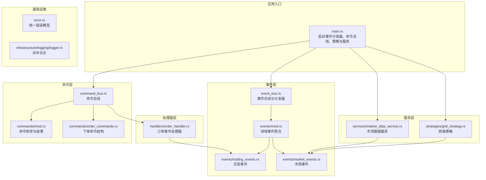
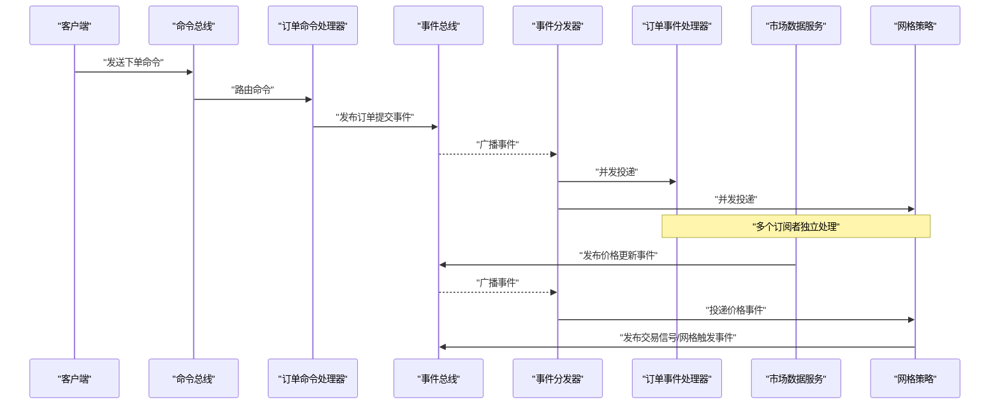
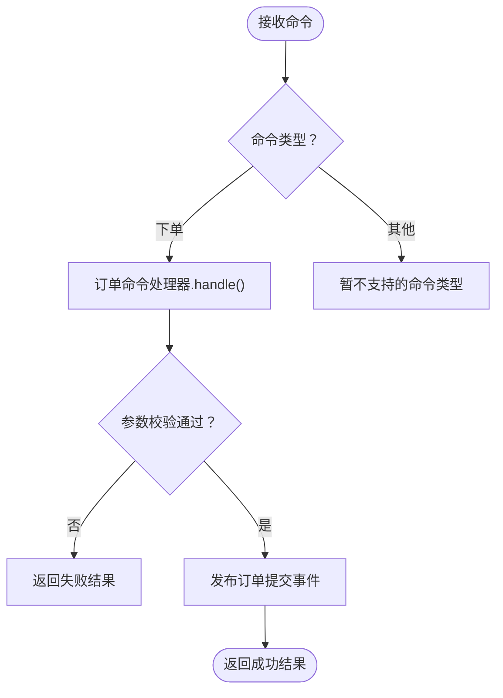
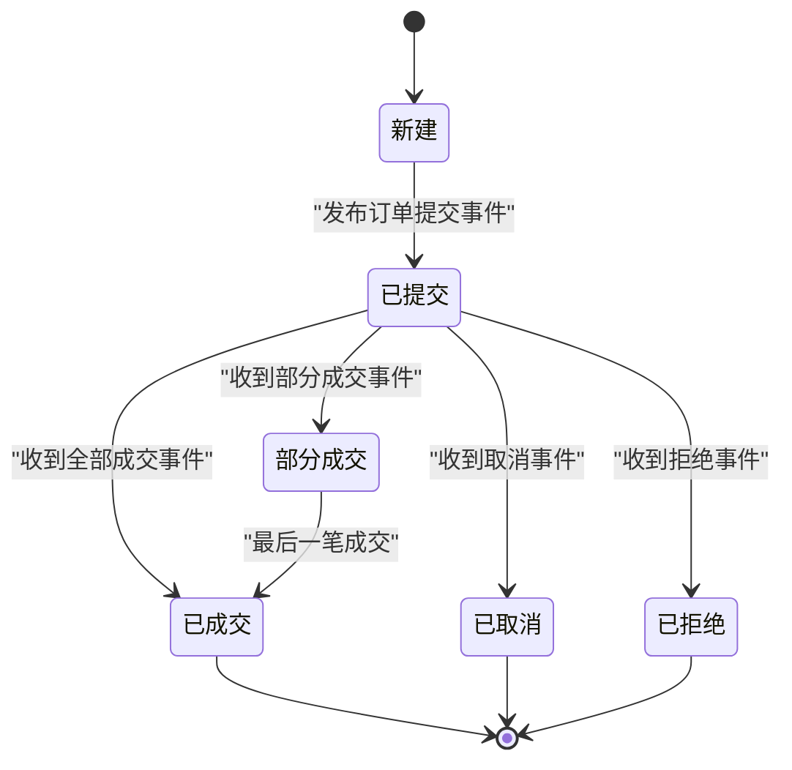
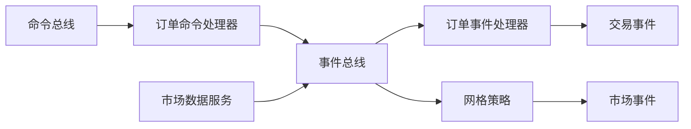

# 订单处理服务

<cite>
**本文引用的文件**
- [src/lib.rs](file://src/lib.rs)
- [src/main.rs](file://src/main.rs)
- [src/command_bus.rs](file://src/command_bus.rs)
- [src/commands/mod.rs](file://src/commands/mod.rs)
- [src/commands/order_commands.rs](file://src/commands/order_commands.rs)
- [src/event_bus.rs](file://src/event_bus.rs)
- [src/events/mod.rs](file://src/events/mod.rs)
- [src/events/trading_events.rs](file://src/events/trading_events.rs)
- [src/events/market_events.rs](file://src/events/market_events.rs)
- [src/handlers/order_handler.rs](file://src/handlers/order_handler.rs)
- [src/services/market_data_service.rs](file://src/services/market_data_service.rs)
- [src/strategies/grid_strategy.rs](file://src/strategies/grid_strategy.rs)
- [src/error.rs](file://src/error.rs)
- [src/infrastructure/logging/logger.rs](file://src/infrastructure/logging/logger.rs)
- [Cargo.toml](file://Cargo.toml)
</cite>

## 目录
1. [简介](#简介)
2. [项目结构](#项目结构)
3. [核心组件](#核心组件)
4. [架构总览](#架构总览)
5. [详细组件分析](#详细组件分析)
6. [依赖分析](#依赖分析)
7. [性能考虑](#性能考虑)
8. [故障排查指南](#故障排查指南)
9. [结论](#结论)
10. [附录](#附录)

## 简介
本文件面向“订单处理服务”的技术文档，围绕事件驱动架构下的订单生命周期进行系统化梳理，覆盖从订单创建、验证、提交、执行、成交、取消、拒绝，到与交易所API对接、订单簿管理、成交匹配、资金结算、错误处理与重试、异常恢复、监控与统计、报告生成，以及与命令总线、事件总线的协作关系，同时给出扩展自定义订单处理器的实践建议。

## 项目结构
该仓库采用模块化组织，核心模块包括：
- 命令与命令总线：封装外部指令输入与路由
- 事件与事件总线：统一发布/订阅与分发
- 事件处理器：对特定事件进行业务处理
- 服务：如市场数据服务，负责与外部系统交互
- 策略：如网格策略，基于事件生成交易信号
- 错误与基础设施：统一错误模型与日志

图表来源
- [src/main.rs:10-93](file://src/main.rs#L10-L93)
- [src/command_bus.rs:1-19](file://src/command_bus.rs#L1-L19)
- [src/commands/mod.rs:1-77](file://src/commands/mod.rs#L1-L77)
- [src/commands/order_commands.rs:1-72](file://src/commands/order_commands.rs#L1-L72)
- [src/event_bus.rs:18-158](file://src/event_bus.rs#L18-L158)
- [src/events/mod.rs:48-102](file://src/events/mod.rs#L48-L102)
- [src/events/trading_events.rs:8-97](file://src/events/trading_events.rs#L8-L97)
- [src/events/market_events.rs:7-56](file://src/events/market_events.rs#L7-L56)
- [src/handlers/order_handler.rs:9-137](file://src/handlers/order_handler.rs#L9-L137)
- [src/services/market_data_service.rs:34-440](file://src/services/market_data_service.rs#L34-L440)
- [src/strategies/grid_strategy.rs:156-278](file://src/strategies/grid_strategy.rs#L156-L278)
- [src/error.rs:12-169](file://src/error.rs#L12-L169)
- [src/infrastructure/logging/logger.rs:140-338](file://src/infrastructure/logging/logger.rs#L140-L338)

章节来源
- [src/lib.rs:1-9](file://src/lib.rs#L1-L9)
- [src/main.rs:10-93](file://src/main.rs#L10-L93)
- [Cargo.toml:1-27](file://Cargo.toml#L1-L27)

## 核心组件
- 命令总线：接收外部命令，路由至对应处理器；当前支持下单命令
- 事件总线：广播领域事件，事件分发器并发投递给订阅者
- 订单命令处理器：校验下单参数，发布“订单提交”事件
- 订单事件处理器：处理“订单提交/成交/取消/拒绝”事件，预留持久化与后续策略触发
- 市场数据服务：连接Binance WebSocket，解析行情并发布“价格更新”事件
- 网格策略：监听价格事件，按网格线生成“交易信号/网格触发”事件
- 统一错误模型：分层错误类型，便于定位与传播
- 异步日志：支持文本/JSON格式、文件轮转与异步写入

章节来源
- [src/command_bus.rs:5-19](file://src/command_bus.rs#L5-L19)
- [src/commands/mod.rs:6-77](file://src/commands/mod.rs#L6-L77)
- [src/commands/order_commands.rs:36-72](file://src/commands/order_commands.rs#L36-L72)
- [src/event_bus.rs:18-158](file://src/event_bus.rs#L18-L158)
- [src/events/mod.rs:48-102](file://src/events/mod.rs#L48-L102)
- [src/handlers/order_handler.rs:93-137](file://src/handlers/order_handler.rs#L93-L137)
- [src/services/market_data_service.rs:34-440](file://src/services/market_data_service.rs#L34-L440)
- [src/strategies/grid_strategy.rs:156-278](file://src/strategies/grid_strategy.rs#L156-L278)
- [src/error.rs:12-169](file://src/error.rs#L12-L169)
- [src/infrastructure/logging/logger.rs:140-338](file://src/infrastructure/logging/logger.rs#L140-L338)

## 架构总览
系统采用事件驱动架构，命令经命令总线进入，处理器发布领域事件，事件总线分发给多个订阅者（如订单处理器、策略、风控等）。市场数据服务作为外部数据源，持续产生价格事件，驱动策略生成交易信号，最终形成闭环。

图表来源
- [src/command_bus.rs:14-18](file://src/command_bus.rs#L14-L18)
- [src/handlers/order_handler.rs:102-135](file://src/handlers/order_handler.rs#L102-L135)
- [src/event_bus.rs:129-157](file://src/event_bus.rs#L129-L157)
- [src/services/market_data_service.rs:376-407](file://src/services/market_data_service.rs#L376-L407)
- [src/strategies/grid_strategy.rs:264-278](file://src/strategies/grid_strategy.rs#L264-L278)

## 详细组件分析

### 命令总线与命令模型
- 命令类型：当前支持下单命令
- 命令结果：成功/失败/已受理（携带跟踪ID与预估完成时间）
- 命令处理：根据命令类型路由到对应处理器；下单命令由订单命令处理器处理

图表来源
- [src/commands/mod.rs:6-77](file://src/commands/mod.rs#L6-L77)
- [src/commands/order_commands.rs:36-72](file://src/commands/order_commands.rs#L36-L72)
- [src/command_bus.rs:14-18](file://src/command_bus.rs#L14-L18)
- [src/handlers/order_handler.rs:102-135](file://src/handlers/order_handler.rs#L102-L135)

章节来源
- [src/commands/mod.rs:6-77](file://src/commands/mod.rs#L6-L77)
- [src/commands/order_commands.rs:36-72](file://src/commands/order_commands.rs#L36-L72)
- [src/command_bus.rs:5-19](file://src/command_bus.rs#L5-L19)

### 订单生命周期与状态转换
- 生命周期阶段：创建（下单命令）→ 提交（发布订单提交事件）→ 执行（由外部系统处理）→ 成交/取消/拒绝（由外部系统回推事件）
- 状态转换（概念性示意）：
  - 新建 → 已提交 → 部分成交 → 已成交 或 已取消 或 已拒绝
- 当前实现要点：
  - 下单命令通过参数校验后发布“订单提交”事件
  - “订单成交/取消/拒绝”事件由订单事件处理器接收并记录，预留后续策略触发与持久化

图表来源
- [src/handlers/order_handler.rs:26-65](file://src/handlers/order_handler.rs#L26-L65)
- [src/events/trading_events.rs:8-97](file://src/events/trading_events.rs#L8-L97)

章节来源
- [src/handlers/order_handler.rs:9-91](file://src/handlers/order_handler.rs#L9-L91)
- [src/events/trading_events.rs:8-97](file://src/events/trading_events.rs#L8-L97)

### 订单验证规则
- 数量必须大于0
- 价格类型与订单类型需满足相应约束（Limit/Market/StopLoss/TakeProfit）
- 可选字段：客户端订单ID等

章节来源
- [src/commands/order_commands.rs:36-72](file://src/commands/order_commands.rs#L36-L72)
- [src/handlers/order_handler.rs:104-107](file://src/handlers/order_handler.rs#L104-L107)

### 订单执行策略
- 当前实现：下单命令通过发布“订单提交”事件进入系统，具体与交易所API交互的执行逻辑以“TODO”形式预留
- 建议策略：
  - 引入订单执行器，对接交易所REST/WebSocket
  - 支持限价/市价/止损/止盈等订单类型映射
  - 实现订单修改/撤销的命令与事件闭环

章节来源
- [src/handlers/order_handler.rs:109-135](file://src/handlers/order_handler.rs#L109-L135)

### 与交易所API的集成
- 当前实现：通过事件发布“订单提交”，未直接调用交易所API
- 建议集成点：
  - 在订单命令处理器中增加API调用（REST/WS），并将返回映射为领域事件（成交/取消/拒绝）
  - 对接WebSocket接收实时成交回报，转化为“订单成交/取消/拒绝”事件
  - 实现幂等性与重试策略，保证事件一致性

章节来源
- [src/handlers/order_handler.rs:109-135](file://src/handlers/order_handler.rs#L109-L135)

### 订单簿管理与成交匹配
- 订单簿更新事件：提供买一/卖一与量级信息
- 成交匹配：由交易所内部完成，系统通过事件感知成交回报
- 建议：
  - 订阅订单簿更新事件，维护本地薄记（用于风控/统计）
  - 将成交回报事件映射为“订单成交”事件，驱动后续流程

章节来源
- [src/events/market_events.rs:41-56](file://src/events/market_events.rs#L41-L56)
- [src/events/trading_events.rs:50-69](file://src/events/trading_events.rs#L50-L69)

### 资金结算流程
- 成交事件包含手续费与资产信息，可用于结算与损益计算
- 建议：
  - 在订单事件处理器中累加可用/冻结资金
  - 与账户事件协同，生成结算报告

章节来源
- [src/events/trading_events.rs:50-69](file://src/events/trading_events.rs#L50-L69)

### 错误处理机制、重试策略与异常恢复
- 统一错误模型：基础设施/事件总线/命令总线/服务层错误分层
- 事件总线错误：发布失败、订阅失败、处理失败、通道关闭
- 命令总线错误：执行失败、处理器未找到、验证失败
- 服务错误：订单/账户/风控/市场数据错误
- 建议：
  - 事件发布失败时，记录日志并触发重试队列
  - 对外API调用增加指数退避重试与熔断保护
  - 异常恢复：隔离失败单元，保留事件溯源能力

章节来源
- [src/error.rs:12-169](file://src/error.rs#L12-L169)

### 订单监控、统计分析与报告生成
- 监控：事件分发器并发处理、吞吐与延迟观测
- 统计：按交易对/订单类型/时间窗口统计成交数量、金额、手续费
- 报告：基于事件聚合生成收益/风险指标
- 建议：
  - 订阅“订单成交/取消/拒绝”事件，构建统计表
  - 输出JSON/CSV报表，支持导出与可视化

章节来源
- [src/event_bus.rs:129-157](file://src/event_bus.rs#L129-L157)
- [src/events/trading_events.rs:50-69](file://src/events/trading_events.rs#L50-L69)

### 与命令总线、事件总线的协作
- 命令总线：接收外部命令，路由到处理器
- 事件总线：集中式事件发布/订阅，事件分发器并发投递
- 订阅过滤：处理器声明感兴趣的事件类型，减少无关处理

章节来源
- [src/command_bus.rs:14-18](file://src/command_bus.rs#L14-L18)
- [src/event_bus.rs:18-110](file://src/event_bus.rs#L18-L110)
- [src/handlers/order_handler.rs:68-91](file://src/handlers/order_handler.rs#L68-L91)

### 自定义订单处理器的实现
- 实现 EventHandler trait，声明 event_types
- 在 handle 中处理 DomainEvent 子集
- 订阅到事件总线，即可参与事件驱动流程

章节来源
- [src/event_bus.rs:18-39](file://src/event_bus.rs#L18-L39)
- [src/handlers/order_handler.rs:68-91](file://src/handlers/order_handler.rs#L68-L91)

## 依赖分析
- 运行时依赖：Tokio（异步）、Serde（序列化）、Tungstenite/Rustls（WebSocket/TLS）、Futures、URL、Chrono、UUID、parking_lot、dashmap
- 关键耦合：
  - 命令总线依赖事件总线与订单命令处理器
  - 订单处理器依赖事件总线与领域事件
  - 市场数据服务依赖事件总线与WebSocket
  - 策略依赖事件总线与事件类型

图表来源
- [src/command_bus.rs:1-19](file://src/command_bus.rs#L1-L19)
- [src/handlers/order_handler.rs:1-137](file://src/handlers/order_handler.rs#L1-L137)
- [src/services/market_data_service.rs:1-503](file://src/services/market_data_service.rs#L1-L503)
- [src/strategies/grid_strategy.rs:1-401](file://src/strategies/grid_strategy.rs#L1-L401)
- [src/event_bus.rs:1-257](file://src/event_bus.rs#L1-L257)

章节来源
- [Cargo.toml:6-25](file://Cargo.toml#L6-L25)

## 性能考虑
- 事件分发器并发处理：使用并行future收集与join_all，提升吞吐
- 异步I/O：WebSocket/TLS/网络读写均采用异步
- 日志异步化：避免阻塞事件处理路径
- 建议优化：
  - 事件缓冲区容量与背压策略
  - 订阅者处理耗时优化，必要时拆分子任务
  - WebSocket心跳与保活策略

章节来源
- [src/event_bus.rs:129-157](file://src/event_bus.rs#L129-L157)
- [src/infrastructure/logging/logger.rs:140-338](file://src/infrastructure/logging/logger.rs#L140-L338)

## 故障排查指南
- 事件发布失败：检查事件总线容量与订阅者健康状态
- 命令执行失败：核对命令参数与处理器映射
- 市场数据连接失败：检查代理/直连配置、TLS握手、URL解析
- 日志异常：确认日志初始化与文件权限

章节来源
- [src/error.rs:85-128](file://src/error.rs#L85-L128)
- [src/services/market_data_service.rs:117-178](file://src/services/market_data_service.rs#L117-L178)
- [src/infrastructure/logging/logger.rs:283-290](file://src/infrastructure/logging/logger.rs#L283-L290)

## 结论
本项目以事件驱动为核心，提供了清晰的命令-事件-处理器分层。订单处理服务当前聚焦于“下单命令→订单提交事件”的闭环，其余执行、成交、风控等环节以“TODO”形式预留，便于后续对接交易所API与完善业务逻辑。通过事件总线的高并发分发与统一错误模型，系统具备良好的可扩展性与可观测性。

## 附录
- 示例：主程序启动事件分发器、命令总线、网格策略与市场数据服务
- 测试：事件总线订阅/取消、网格策略信号生成、市场数据解析

章节来源
- [src/main.rs:10-93](file://src/main.rs#L10-L93)
- [src/event_bus.rs:183-256](file://src/event_bus.rs#L183-L256)
- [src/strategies/grid_strategy.rs:280-401](file://src/strategies/grid_strategy.rs#L280-L401)
- [src/services/market_data_service.rs:442-503](file://src/services/market_data_service.rs#L442-L503)