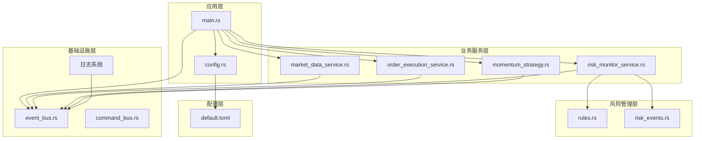
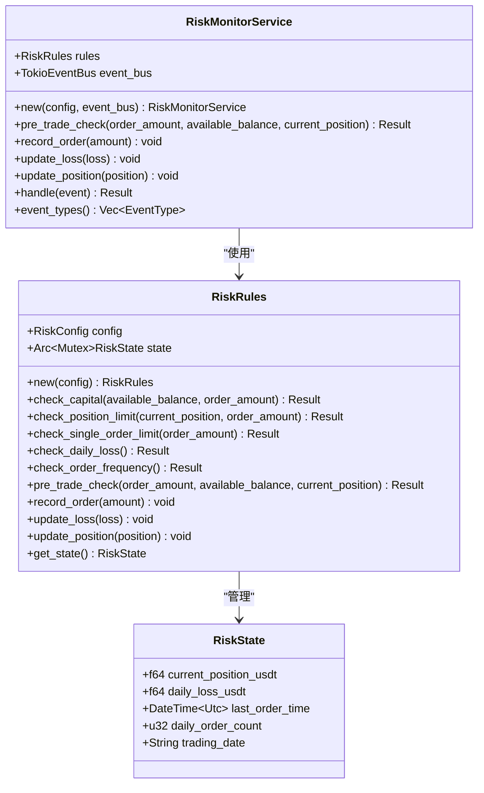
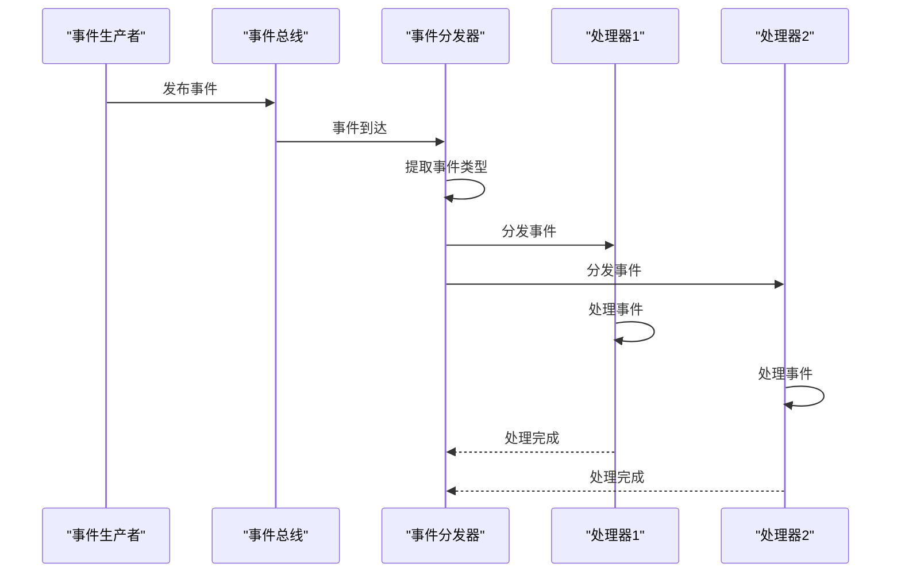
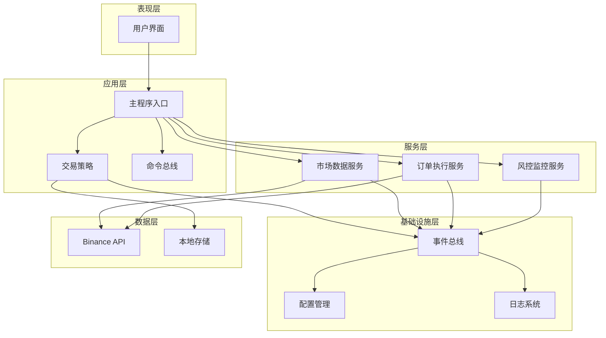
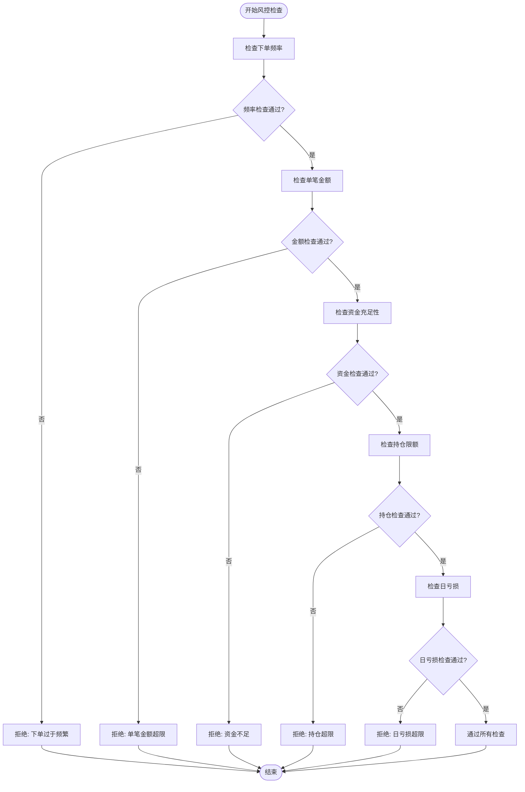
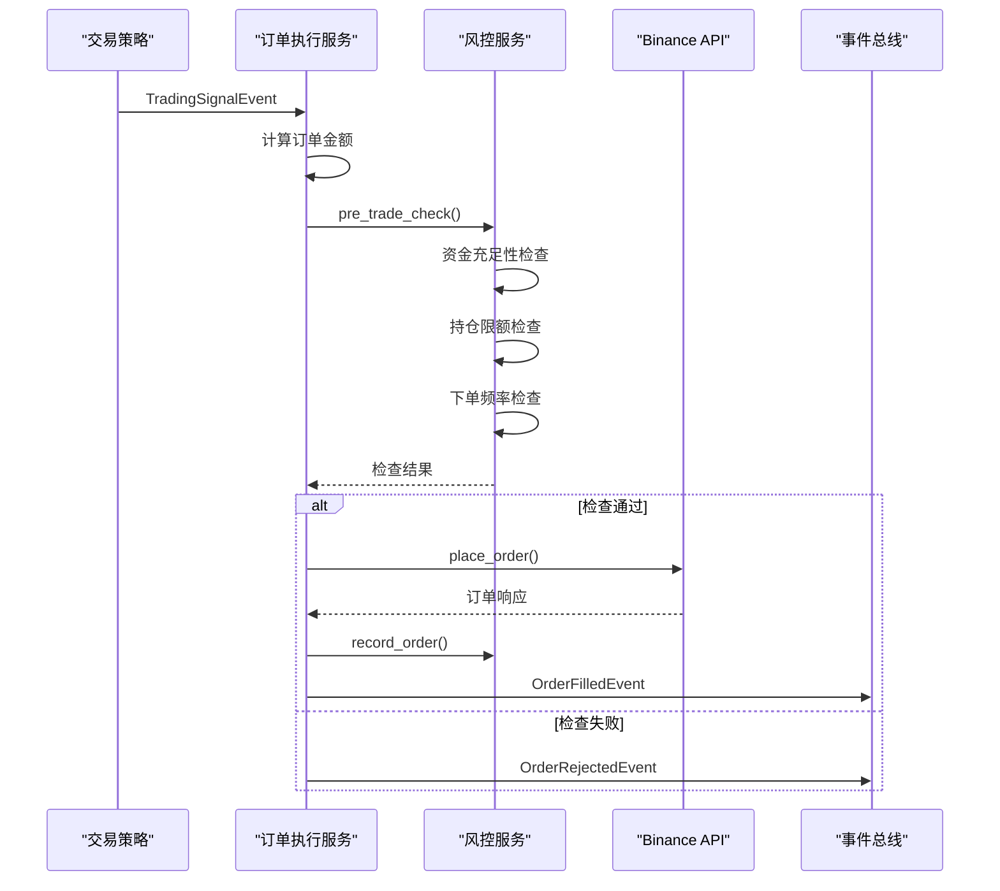
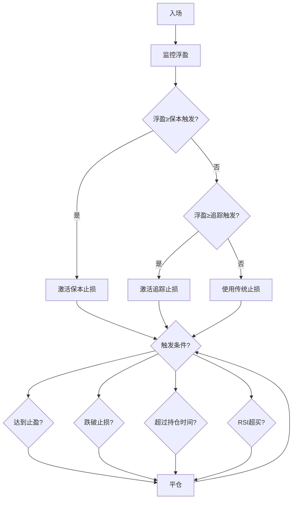
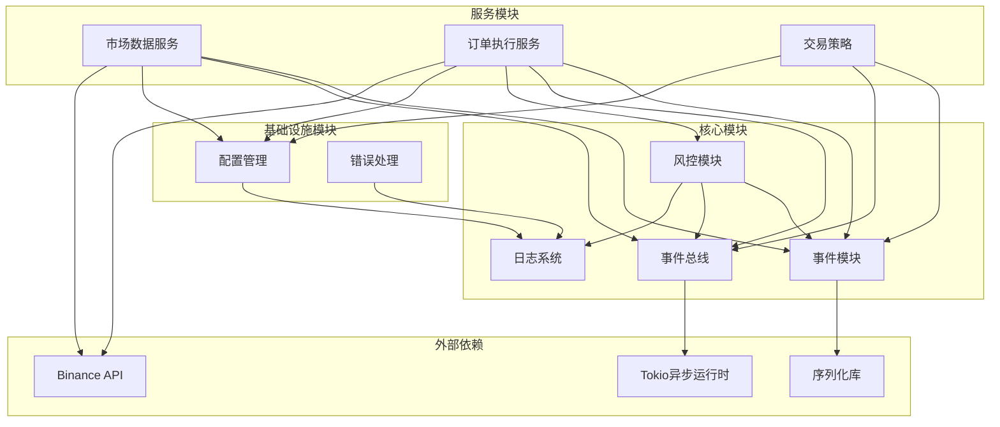
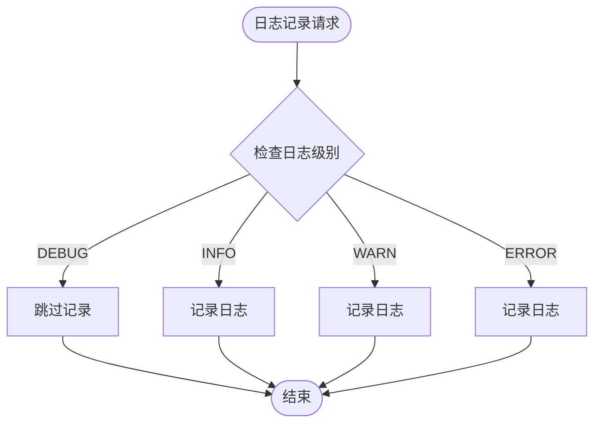

# 风控管理系统

<cite>
**本文档引用的文件**
- [src/lib.rs](file://src/lib.rs)
- [src/main.rs](file://src/main.rs)
- [src/risk/mod.rs](file://src/risk/mod.rs)
- [src/risk/risk_monitor_service.rs](file://src/risk/risk_monitor_service.rs)
- [src/risk/rules.rs](file://src/risk/rules.rs)
- [src/events/risk_events.rs](file://src/events/risk_events.rs)
- [src/config.rs](file://src/config.rs)
- [src/event_bus.rs](file://src/event_bus.rs)
- [src/command_bus.rs](file://src/command_bus.rs)
- [src/commands/order_commands.rs](file://src/commands/order_commands.rs)
- [src/services/market_data_service.rs](file://src/services/market_data_service.rs)
- [src/services/order_execution_service.rs](file://src/services/order_execution_service.rs)
- [src/strategies/momentum_strategy.rs](file://src/strategies/momentum_strategy.rs)
- [config/default.toml](file://config/default.toml)
- [Cargo.toml](file://Cargo.toml)
</cite>

## 更新摘要
**变更内容**
- 新增保本止损机制：当浮盈达到指定百分比时，止损自动移动到入场价
- 新增追踪止损机制：当浮盈达到追踪触发点时，止损跟随价格波动自动调整
- 新增对称风险管理参数配置：支持做多和做空的对称止损参数
- 更新风险管理服务日志优化部分，反映将订单填充监控和风险规则执行的日志级别从INFO降级到DEBUG的变更
- 新增日志系统性能优化说明，解释降低日志级别对系统效率的影响
- 更新故障排除指南中的日志分析部分
- **更新** 风险参数已从传统波段交易参数调整为超短线交易参数：止盈从2.0%降低到0.80%，止损从0.8%提高到0.25%，最大持仓时间从8小时缩短到60分钟，交易冷却时间从10分钟缩短到1分钟，日最大交易次数从15次增加到50次

## 目录
1. [项目概述](#项目概述)
2. [项目结构](#项目结构)
3. [核心组件](#核心组件)
4. [架构概览](#架构概览)
5. [详细组件分析](#详细组件分析)
6. [依赖关系分析](#依赖关系分析)
7. [性能考虑](#性能考虑)
8. [故障排除指南](#故障排除指南)
9. [结论](#结论)

## 项目概述

这是一个基于 Rust 的事件驱动型 Binance 量化交易风控管理系统。系统采用模块化设计，实现了完整的交易生命周期管理，包括市场数据获取、策略执行、订单管理和风控监控等功能。

系统的核心特点：
- **事件驱动架构**：基于发布-订阅模式的异步事件处理机制
- **多层次风控**：资金充足性、持仓限额、下单频率、日亏损控制等多重风控检查
- **高可用性**：支持多种网络连接模式，具备自动重连机制
- **实时监控**：实时监控账户余额、持仓变化和订单执行状态
- **策略灵活性**：支持多种交易策略，当前实现动量短线策略
- **高效日志系统**：通过优化日志级别提升系统整体性能
- **动态止损保护**：集成保本止损和追踪止损机制，提供动态风险控制

## 项目结构

**图表来源**
- [src/lib.rs:1-13](file://src/lib.rs#L1-L13)
- [src/main.rs:1-172](file://src/main.rs#L1-L172)
- [src/config.rs:1-406](file://src/config.rs#L1-L406)

**章节来源**
- [src/lib.rs:1-13](file://src/lib.rs#L1-L13)
- [src/main.rs:1-172](file://src/main.rs#L1-L172)
- [Cargo.toml:1-41](file://Cargo.toml#L1-L41)

## 核心组件

### 风控监控服务

风控监控服务是整个系统的核心风控组件，负责：

- **交易前风控检查**：在订单执行前进行多重风控检查
- **实时风险监控**：监控账户余额、持仓变化和订单执行状态
- **风险事件发布**：当触发风控条件时发布风险告警事件
- **高效日志记录**：使用DEBUG级别日志记录日常监控信息，减少日志噪音

**图表来源**
- [src/risk/risk_monitor_service.rs:14-79](file://src/risk/risk_monitor_service.rs#L14-L79)
- [src/risk/rules.rs:12-302](file://src/risk/rules.rs#L12-L302)

### 事件总线系统

事件总线系统实现了松耦合的事件通信机制：

- **发布-订阅模式**：支持多个处理器订阅同一事件类型
- **异步处理**：基于 Tokio 的异步事件分发
- **类型安全**：通过 EventType 枚举确保事件类型安全
- **并行处理**：支持多个处理器并行处理同一事件

**图表来源**
- [src/event_bus.rs:114-173](file://src/event_bus.rs#L114-L173)

**章节来源**
- [src/risk/risk_monitor_service.rs:1-175](file://src/risk/risk_monitor_service.rs#L1-L175)
- [src/risk/rules.rs:1-419](file://src/risk/rules.rs#L1-L419)
- [src/event_bus.rs:1-274](file://src/event_bus.rs#L1-L274)

## 架构概览

系统采用分层架构设计，各层职责清晰分离：

**图表来源**
- [src/main.rs:106-139](file://src/main.rs#L106-L139)
- [src/services/market_data_service.rs:32-41](file://src/services/market_data_service.rs#L32-L41)
- [src/services/order_execution_service.rs:43-50](file://src/services/order_execution_service.rs#L43-L50)

系统的关键特性：

1. **事件驱动**：所有组件通过事件进行通信，实现松耦合
2. **异步处理**：基于 Tokio 的异步运行时，提高并发性能
3. **模块化设计**：每个功能模块独立封装，便于维护和测试
4. **配置驱动**：通过配置文件控制系统行为，支持灵活部署
5. **高效日志系统**：通过优化日志级别提升系统整体性能
6. **动态风险控制**：集成保本止损和追踪止损机制，提供智能化风险保护

## 详细组件分析

### 风控规则引擎

风控规则引擎实现了多层次的风控检查机制：

#### 风控检查流程

**图表来源**
- [src/risk/rules.rs:191-271](file://src/risk/rules.rs#L191-L271)

#### 风控配置参数

系统支持以下风控配置参数：

| 参数名称 | 描述 | 默认值 | 单位 |
|---------|------|--------|------|
| max_position_usdt | 最大持仓金额 | 200.0 | USDT |
| max_single_order_usdt | 单笔最大金额 | 20.0 | USDT |
| max_daily_loss_usdt | 日亏损上限 | 30.0 | USDT |
| min_order_interval_secs | 最小下单间隔 | 10 | 秒 |

**章节来源**
- [src/risk/rules.rs:27-419](file://src/risk/rules.rs#L27-L419)
- [src/risk/risk_monitor_service.rs:1-175](file://src/risk/risk_monitor_service.rs#L1-L175)
- [config/default.toml:65-73](file://config/default.toml#L65-L73)

### 订单执行服务

订单执行服务负责将交易信号转换为实际的订单执行：

#### 订单执行流程

**图表来源**
- [src/services/order_execution_service.rs:136-258](file://src/services/order_execution_service.rs#L136-L258)

**章节来源**
- [src/services/order_execution_service.rs:1-312](file://src/services/order_execution_service.rs#L1-L312)

### 市场数据服务

市场数据服务负责从 Binance WebSocket 获取实时市场数据：

#### 连接模式支持

系统支持多种连接模式以适应不同的网络环境：

| 连接模式 | 描述 | 使用场景 |
|---------|------|----------|
| Auto | 自动检测 | 推荐模式，自动选择最佳连接方式 |
| Direct | 直接连接 | 直接访问 Binance 服务器 |
| Proxy | 代理连接 | 通过 HTTP 代理访问 |
| SSH隧道 | SSH隧道 | 通过 SSH 隧道访问 |

**章节来源**
- [src/services/market_data_service.rs:1-705](file://src/services/market_data_service.rs#L1-L705)

### 动量策略

动量策略实现了基于技术指标的高频交易策略，现已集成了先进的动态止损保护机制：

#### 动态止损保护机制

系统实现了三层动态止损保护机制：

1. **保本止损**：当浮盈达到指定百分比时，止损自动移动到入场价
2. **追踪止损**：当浮盈达到追踪触发点时，止损跟随价格波动自动调整
3. **传统止损**：基础的固定止损保护

**图表来源**
- [src/strategies/momentum_strategy.rs:389-401](file://src/strategies/momentum_strategy.rs#L389-L401)
- [src/strategies/momentum_strategy.rs:447-455](file://src/strategies/momentum_strategy.rs#L447-L455)

#### 策略参数配置

**更新** 策略参数已从传统波段交易参数调整为超短线交易参数：

| 参数名称 | 描述 | 默认值 | 单位 |
|---------|------|--------|------|
| symbol | 交易对 | BTCUSDT | - |
| quantity_per_trade | 每笔交易数量 | 0.00013 BTC | - |
| take_profit_pct | 止盈百分比 | 0.80% | 百分比 |
| stop_loss_pct | 止损百分比 | 0.25% | 百分比 |
| max_hold_seconds | 最大持仓时间 | 3600秒 | 秒 |
| cooldown_seconds | 交易冷却时间 | 60秒 | 秒 |
| max_daily_trades | 日最大交易次数 | 50次 | 次 |
| rsi_oversold | RSI超卖线 | 25.0 | 百分比 |
| rsi_overbought | RSI超买线 | 65.0 | 百分比 |
| breakeven_trigger_pct | 保本止损触发 | 0.5% | 百分比 |
| trailing_trigger_pct | 追踪止损触发 | 1.5% | 百分比 |
| trailing_distance_pct | 追踪止损回撤距离 | 0.5% | 百分比 |

**更新** 新增动态止损保护参数：
- **保本止损触发**：当浮盈达到0.5%时激活保本止损
- **追踪止损触发**：当浮盈达到1.5%时激活追踪止损
- **追踪止损回撤距离**：从最高点回撤0.5%时平仓

**更新** 策略参数已从传统波段交易参数调整为超短线交易参数：
- 止盈从2.0%降低到0.80%
- 止损从0.8%提高到0.25%
- 最大持仓时间从8小时(28800秒)缩短到60分钟(3600秒)
- 交易冷却时间从10分钟(600秒)缩短到1分钟(60秒)
- 日最大交易次数从15次增加到50次

**章节来源**
- [src/strategies/momentum_strategy.rs:1-489](file://src/strategies/momentum_strategy.rs#L1-L489)
- [config/default.toml:25-51](file://config/default.toml#L25-L51)

### 对称风险管理参数

系统支持对称的风险管理参数配置，确保做多和做空策略的一致性：

#### 对称参数配置

| 参数名称 | 做多配置 | 做空配置 | 描述 |
|---------|---------|---------|------|
| take_profit_pct | 0.80% | 0.80% | 止盈百分比 |
| stop_loss_pct | 0.25% | 0.25% | 止损百分比 |
| trailing_trigger_pct | 1.5% | 1.5% | 追踪止损触发 |
| trailing_distance_pct | 0.5% | 0.5% | 追踪止损回撤距离 |

**更新** 配置文件明确标注："做空使用与做多相同的TP/SL/追踪参数（对称策略）"

**章节来源**
- [config/default.toml:59](file://config/default.toml#L59)
- [src/config.rs:51-56](file://src/config.rs#L51-L56)

## 依赖关系分析

系统采用模块化设计，各模块之间的依赖关系如下：

**图表来源**
- [src/lib.rs:1-13](file://src/lib.rs#L1-L13)
- [Cargo.toml:14-39](file://Cargo.toml#L14-L39)

**章节来源**
- [src/lib.rs:1-13](file://src/lib.rs#L1-L13)
- [Cargo.toml:1-41](file://Cargo.toml#L1-L41)

## 性能考虑

### 异步处理优化

系统采用 Tokio 异步运行时，通过以下方式优化性能：

1. **非阻塞 I/O**：所有网络操作都是异步的，避免阻塞主线程
2. **事件驱动**：基于事件的松耦合架构，减少不必要的同步等待
3. **内存池**：使用 Arc 和 Mutex 实现共享状态的安全访问
4. **批量处理**：支持多个处理器并行处理同一事件

### 内存管理

- **零拷贝设计**：尽量避免不必要的数据复制
- **智能指针**：使用 Arc 实现共享所有权，减少内存占用
- **异步锁**：使用 tokio::sync::Mutex 提供高性能的异步互斥锁

### 网络优化

- **连接池**：复用 WebSocket 连接，减少连接开销
- **指数退避**：网络异常时采用指数退避重连策略
- **心跳检测**：定期发送 Ping/Pong 保持连接活跃

### 日志系统优化

**更新** 系统实施了日志级别的优化以提高整体性能：

#### 日志级别优化策略

1. **从INFO降级到DEBUG**：
   - 订单填充监控日志从INFO级别降级到DEBUG级别
   - 风险规则执行日志从INFO级别降级到DEBUG级别
   - 仅保留关键事件使用INFO级别

2. **性能提升效果**：
   - 显著减少日志写入操作，降低磁盘I/O压力
   - 减少日志处理开销，提高系统吞吐量
   - 降低CPU使用率，特别是在高频交易场景

3. **日志级别分布**：
   - **DEBUG级别**：日常监控信息、订单执行详情
   - **INFO级别**：重要系统状态变更、关键事件通知
   - **WARN级别**：潜在问题预警
   - **ERROR级别**：异常情况记录

#### 优化后的日志记录

**章节来源**
- [src/risk/risk_monitor_service.rs:86-118](file://src/risk/risk_monitor_service.rs#L86-L118)
- [src/risk/rules.rs:202-289](file://src/risk/rules.rs#L202-L289)

## 故障排除指南

### 常见问题及解决方案

#### API 密钥问题

**问题症状**：启动时出现 API 连接失败

**解决方案**：
1. 检查配置文件中的 API 密钥是否正确
2. 验证 IP 白名单设置
3. 确认网络连接正常

#### 网络连接问题

**问题症状**：WebSocket 连接失败或频繁断开

**解决方案**：
1. 检查网络连接状态
2. 尝试不同的连接模式
3. 验证代理设置（如果使用）

#### 风控拦截问题

**问题症状**：订单被风控服务拦截

**解决方案**：
1. 检查风控配置参数设置
2. 查看风控日志了解具体拦截原因
3. 调整交易参数以符合风控要求

#### 日志相关问题

**问题症状**：日志信息缺失或过多

**解决方案**：
1. **日志过少**：将日志级别调整为DEBUG或TRACE
2. **日志过多**：保持当前DEBUG级别，关注关键事件
3. **日志性能问题**：确认日志级别已正确优化

#### 动态止损机制问题

**问题症状**：动态止损未按预期触发

**解决方案**：
1. **参数层级错误**：确保 breakeven_trigger < trailing_trigger < take_profit
2. **追踪止损不生效**：检查 trailing_trigger_pct 设置是否合理
3. **保本止损过早激活**：调整 breakeven_trigger_pct 参数
4. **止损过于激进**：适当提高 trailing_distance_pct

**章节来源**
- [src/main.rs:87-101](file://src/main.rs#L87-L101)
- [src/risk/rules.rs:191-271](file://src/risk/rules.rs#L191-L271)
- [src/config.rs:175-193](file://src/config.rs#L175-L193)

### 日志分析

系统提供详细的日志记录，帮助诊断问题：

- **调试日志**：详细的操作流程记录（DEBUG级别）
- **信息日志**：重要的系统状态变更（INFO级别）
- **警告日志**：潜在问题的预警（WARN级别）
- **错误日志**：异常情况的详细描述（ERROR级别）

**更新** 日志系统已优化，减少了日常监控信息的日志输出，提高了系统整体性能。现在只有关键事件才会记录到INFO级别日志中。

## 结论

本风控管理系统采用了先进的事件驱动架构，实现了高度模块化和可扩展的设计。系统的主要优势包括：

1. **强大的风控能力**：多层次的风控检查机制确保交易安全
2. **高性能架构**：基于异步处理的高性能设计
3. **灵活配置**：通过配置文件实现灵活的系统定制
4. **完善的监控**：实时监控和日志记录功能
5. **高效的日志系统**：通过优化日志级别显著提升系统性能
6. **智能动态保护**：集成保本止损和追踪止损机制，提供智能化风险控制
7. **对称风险管理**：支持做多和做空的对称参数配置，确保策略一致性
8. **易于维护**：模块化设计便于代码维护和功能扩展

系统适用于高频交易场景，能够有效控制交易风险，提高交易系统的稳定性和可靠性。通过合理的配置和监控，可以实现稳定的量化交易策略执行。

**更新** 通过将订单填充监控和风险规则执行的日志级别从INFO降级到DEBUG，系统在保证必要监控信息的同时，显著提升了日志系统的整体效率，特别适合高频交易场景下的性能优化需求。

**更新** 策略参数已从传统波段交易参数调整为超短线交易参数，更适合高频交易场景：
- 更严格的止损设置(0.25%)降低单笔损失风险
- 更高的止盈目标(0.80%)提高盈利效率
- 更短的持仓时间(60分钟)适应快速市场波动
- 更短的冷却时间(1分钟)提高交易频率
- 更高的日交易次数(50次)充分利用市场机会

**更新** 新增的动态止损保护机制提供了更智能的风险控制：
- **保本止损**：在浮盈达到0.5%时自动激活，确保已实现利润安全
- **追踪止损**：在浮盈达到1.5%时激活，随价格波动自动调整止损位置
- **对称参数配置**：做多和做空使用相同的止损参数，确保策略一致性
- **智能触发逻辑**：根据市场走势自动调整保护策略，最大化利润空间