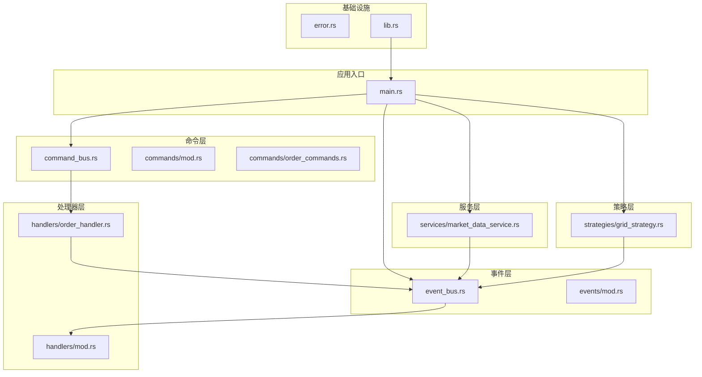
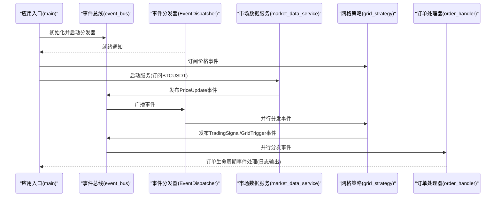
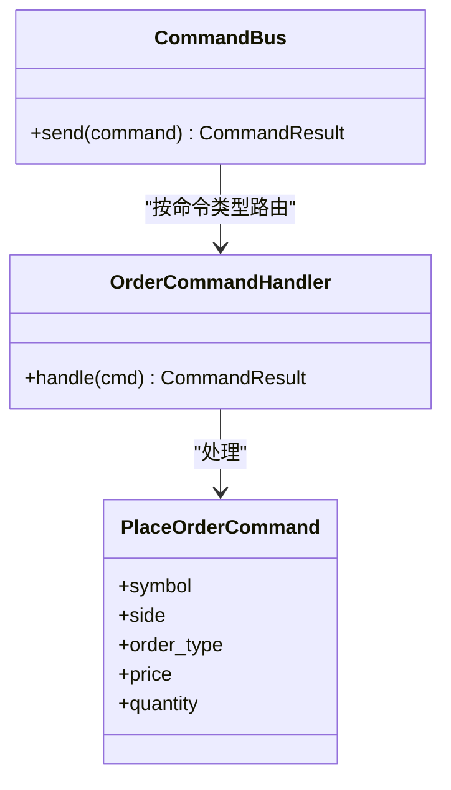
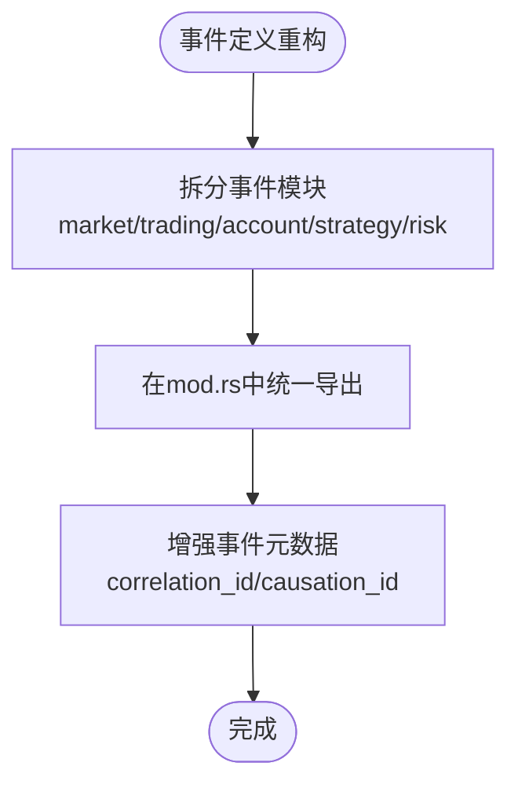
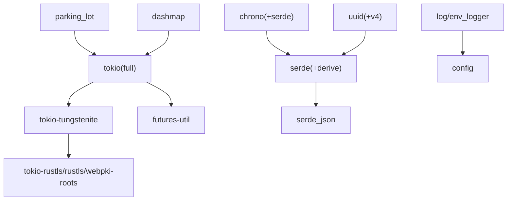

# 代码重构案例

<cite>
**本文引用的文件**
- [src/lib.rs](file://src/lib.rs)
- [src/main.rs](file://src/main.rs)
- [src/command_bus.rs](file://src/command_bus.rs)
- [src/event_bus.rs](file://src/event_bus.rs)
- [src/commands/mod.rs](file://src/commands/mod.rs)
- [src/commands/order_commands.rs](file://src/commands/order_commands.rs)
- [src/events/mod.rs](file://src/events/mod.rs)
- [src/handlers/mod.rs](file://src/handlers/mod.rs)
- [src/handlers/order_handler.rs](file://src/handlers/order_handler.rs)
- [src/services/market_data_service.rs](file://src/services/market_data_service.rs)
- [src/strategies/grid_strategy.rs](file://src/strategies/grid_strategy.rs)
- [src/error.rs](file://src/error.rs)
- [Cargo.toml](file://Cargo.toml)
- [docs/EVENT_DRIVEN_REFACTOR_GUIDE.md](file://docs/EVENT_DRIVEN_REFACTOR_GUIDE.md)
- [docs/CODE_EXPLANATION.md](file://docs/CODE_EXPLANATION.md)
</cite>

## 目录
1. [引言](#引言)
2. [项目结构](#项目结构)
3. [核心组件](#核心组件)
4. [架构总览](#架构总览)
5. [详细组件分析](#详细组件分析)
6. [依赖分析](#依赖分析)
7. [性能考量](#性能考量)
8. [故障排查指南](#故障排查指南)
9. [结论](#结论)
10. [附录](#附录)

## 引言
本文件围绕 Binance Rust 事件驱动交易系统，系统化梳理现有代码结构与运行机制，提出可落地的重构案例，覆盖架构演进、设计模式应用、代码结构优化、测试体系完善与文档改进等方面。目标是在不改变行为的前提下，提升代码质量、可维护性与可扩展性，为后续模块化演进打下坚实基础。

## 项目结构
当前项目采用按职责分层的模块化布局，核心模块包括事件定义、事件总线、命令总线、服务层（市场数据）、策略层（网格策略）、处理器层（订单处理）以及统一错误处理。入口程序负责装配组件并演示事件驱动流程。

**图表来源**
- [src/main.rs:1-93](file://src/main.rs#L1-L93)
- [src/event_bus.rs:1-257](file://src/event_bus.rs#L1-L257)
- [src/command_bus.rs:1-19](file://src/command_bus.rs#L1-L19)
- [src/commands/mod.rs:1-77](file://src/commands/mod.rs#L1-L77)
- [src/commands/order_commands.rs:1-72](file://src/commands/order_commands.rs#L1-L72)
- [src/handlers/order_handler.rs:1-137](file://src/handlers/order_handler.rs#L1-L137)
- [src/services/market_data_service.rs:1-503](file://src/services/market_data_service.rs#L1-L503)
- [src/strategies/grid_strategy.rs:1-401](file://src/strategies/grid_strategy.rs#L1-L401)
- [src/error.rs:1-169](file://src/error.rs#L1-L169)
- [src/lib.rs:1-9](file://src/lib.rs#L1-L9)

**章节来源**
- [src/lib.rs:1-9](file://src/lib.rs#L1-L9)
- [src/main.rs:1-93](file://src/main.rs#L1-L93)
- [Cargo.toml:1-27](file://Cargo.toml#L1-L27)

## 核心组件
- 事件总线与分发器：提供发布/订阅能力与并行分发，支撑事件驱动架构。
- 命令总线与命令/处理器：封装命令执行与事件发布，隔离外部调用与内部领域事件。
- 事件定义：统一 DomainEvent 枚举与事件元数据，保证跨模块一致性。
- 市场数据服务：通过 WebSocket 实时订阅并解析行情，发布价格事件。
- 网格策略：监听价格事件，按网格线穿越生成交易信号与网格触发事件。
- 错误处理：分层错误类型与统一 Result，便于传播与定位。

**章节来源**
- [src/event_bus.rs:18-158](file://src/event_bus.rs#L18-L158)
- [src/command_bus.rs:5-19](file://src/command_bus.rs#L5-L19)
- [src/commands/mod.rs:6-77](file://src/commands/mod.rs#L6-L77)
- [src/commands/order_commands.rs:3-72](file://src/commands/order_commands.rs#L3-L72)
- [src/events/mod.rs:48-102](file://src/events/mod.rs#L48-L102)
- [src/services/market_data_service.rs:34-114](file://src/services/market_data_service.rs#L34-L114)
- [src/strategies/grid_strategy.rs:156-278](file://src/strategies/grid_strategy.rs#L156-L278)
- [src/error.rs:12-132](file://src/error.rs#L12-L132)

## 架构总览
系统采用“事件驱动 + CQRS”思路：命令侧通过命令总线进入，转化为领域事件；事件侧通过事件总线广播，由订阅者并行处理。入口程序负责初始化事件总线、启动分发器、注册策略与服务，形成闭环。

**图表来源**
- [src/main.rs:10-93](file://src/main.rs#L10-L93)
- [src/event_bus.rs:112-158](file://src/event_bus.rs#L112-L158)
- [src/services/market_data_service.rs:303-374](file://src/services/market_data_service.rs#L303-L374)
- [src/strategies/grid_strategy.rs:264-278](file://src/strategies/grid_strategy.rs#L264-L278)
- [src/handlers/order_handler.rs:68-91](file://src/handlers/order_handler.rs#L68-L91)

## 详细组件分析

### 事件总线与分发器重构案例
- 重构动机
  - 现状：事件总线与分发器在同一文件中，逻辑集中，不利于扩展与测试。
  - 目标：将事件总线抽象与实现分离，明确分发器职责，增强可测试性与可替换性。
- 重构过程
  - 抽象 EventBus/EventHandler Trait，保持与现有实现兼容。
  - 将 TokioEventBus 与 EventDispatcher 拆分为独立模块，增加工厂与配置入口。
  - 为分发器增加生命周期控制与可观测性（如就绪通知、统计指标）。
- 重构效果
  - 提升模块内聚与解耦，便于引入其他实现（如基于 Kafka 的事件总线）。
  - 易于单元测试与集成测试，降低耦合度带来的测试复杂度。

**章节来源**
- [src/event_bus.rs:18-158](file://src/event_bus.rs#L18-L158)

### 命令总线与命令处理器重构案例
- 重构动机
  - 现状：命令总线直接依赖具体处理器，扩展新命令需修改总线分发逻辑。
  - 目标：引入命令处理器注册表与动态路由，支持按命令类型分发。
- 重构过程
  - 定义 CommandHandler trait 与注册表，命令总线根据命令类型查找处理器。
  - 将 PlaceOrderCommand 的处理迁移到独立的 OrderCommandHandler，保持单一职责。
  - 增加命令验证、幂等与追踪能力（correlation/causation）。
- 重构效果
  - 命令扩展无需改动总线核心，遵循开放封闭原则。
  - 命令执行链路更清晰，便于审计与排错。

**图表来源**
- [src/command_bus.rs:5-19](file://src/command_bus.rs#L5-L19)
- [src/handlers/order_handler.rs:93-137](file://src/handlers/order_handler.rs#L93-L137)
- [src/commands/order_commands.rs:37-72](file://src/commands/order_commands.rs#L37-L72)

**章节来源**
- [src/command_bus.rs:5-19](file://src/command_bus.rs#L5-L19)
- [src/handlers/order_handler.rs:93-137](file://src/handlers/order_handler.rs#L93-L137)
- [src/commands/order_commands.rs:3-72](file://src/commands/order_commands.rs#L3-L72)

### 事件定义与事件类型重构案例
- 重构动机
  - 现状：事件类型集中在一个枚举中，未来扩展将导致该文件膨胀。
  - 目标：按领域拆分事件模块（市场、交易、账户、策略、风控），统一导出。
- 重构过程
  - 拆分 market_events、trading_events、account_events、strategy_events、risk_events。
  - 在 events/mod.rs 中统一 re-export，保持对外接口一致。
  - 为事件元数据增加 correlation_id 与 causation_id，支持事件溯源。
- 重构效果
  - 模块边界清晰，便于团队协作与独立演进。
  - 事件溯源与审计能力增强，利于回溯与合规。

**图表来源**
- [src/events/mod.rs:1-102](file://src/events/mod.rs#L1-L102)

**章节来源**
- [src/events/mod.rs:1-102](file://src/events/mod.rs#L1-L102)

### 市场数据服务重构案例
- 重构动机
  - 现状：服务逻辑集中在单文件，网络连接、代理、TLS、心跳等混合在一起，难以测试。
  - 目标：按职责拆分连接、代理、TLS、消息处理等子模块，增强可测试性。
- 重构过程
  - 将连接与握手逻辑拆分为独立函数/模块，支持不同模式（直连/代理/隧道）。
  - 引入连接工厂与配置对象，支持链式配置（with_connection_mode/with_reconnect_interval）。
  - 增加心跳与保活机制的可配置化与可观测性。
- 重构效果
  - 单元测试覆盖连接、代理、TLS、消息解析等关键路径。
  - 便于模拟外部依赖，提升集成测试稳定性。

**章节来源**
- [src/services/market_data_service.rs:34-440](file://src/services/market_data_service.rs#L34-L440)

### 网格策略重构案例
- 重构动机
  - 现状：策略逻辑与事件处理耦合，状态管理分散，扩展新策略需复制粘贴。
  - 目标：引入策略基类/接口，统一事件处理与状态管理，支持多策略并行。
- 重构过程
  - 定义策略接口与基类，统一事件订阅与处理模板方法。
  - 将网格状态与信号生成逻辑抽取为可测试的纯函数，便于单元测试。
  - 增加策略注册表与生命周期管理（启动/停止/统计）。
- 重构效果
  - 策略开发标准化，降低学习成本与出错概率。
  - 策略间解耦，便于并行运行与资源隔离。

**章节来源**
- [src/strategies/grid_strategy.rs:156-278](file://src/strategies/grid_strategy.rs#L156-L278)

### 订单处理器重构案例
- 重构动机
  - 现状：处理器仅打印日志，缺乏实际业务逻辑，扩展困难。
  - 目标：引入订单生命周期事件处理流水线，支持持久化、风控联动与通知。
- 重构过程
  - 将订单事件处理拆分为多个步骤：状态更新、风控检查、通知与审计。
  - 引入事件处理器注册表，支持按事件类型路由到不同处理管线。
  - 增加幂等与去重机制，避免重复处理。
- 重构效果
  - 订单处理流程清晰、可扩展，便于接入真实交易执行。
  - 事件驱动的可观测性增强，便于监控与排错。

**章节来源**
- [src/handlers/order_handler.rs:68-91](file://src/handlers/order_handler.rs#L68-L91)

### 错误处理与统一结果重构案例
- 重构动机
  - 现状：错误类型分散，传播链路不一致，定位困难。
  - 目标：统一错误类型与 Result，提供分层错误与自动转换。
- 重构过程
  - 定义 DomainError 作为统一出口，分层映射到基础设施、事件总线、命令总线与服务错误。
  - 在各模块返回统一 Result，使用 ? 运算符自动转换。
  - 增加错误上下文与堆栈追踪能力。
- 重构效果
  - 错误处理一致化，便于统一捕获与上报。
  - 开发与运维排错效率显著提升。

**章节来源**
- [src/error.rs:12-132](file://src/error.rs#L12-L132)

## 依赖分析
- 运行时与异步：Tokio 提供异步运行时与通道；futures-util 支持 join_all 并行处理。
- 序列化：Serde 用于事件与配置的序列化；chrono、uuid 用于元数据。
- 网络与安全：tokio-tungstenite、tokio-rustls、rustls、webpki-roots 用于 WebSocket 与 TLS。
- 并发与锁：parking_lot 提供高性能锁；dashmap 用于共享哈希表。
- 日志与配置：log/env_logger、config 用于日志与配置管理。

**图表来源**
- [Cargo.toml:6-25](file://Cargo.toml#L6-L25)

**章节来源**
- [Cargo.toml:6-25](file://Cargo.toml#L6-L25)

## 性能考量
- 事件总线：使用 broadcast channel 实现一对多广播，具备背压与丢弃策略，适合高吞吐场景。
- 并行分发：EventDispatcher 对订阅者采用 join_all 并行处理，提升整体吞吐。
- 网络层：WebSocket 心跳与自动重连降低连接中断影响；代理隧道支持复杂网络环境。
- 内存与锁：Arc + RwLock 提供高效共享与读写分离；parking_lot 锁性能优异。
- 建议：在高并发场景下，可考虑引入事件批处理、分区与限流策略，避免事件风暴。

[本节为通用性能讨论，不直接分析具体文件]

## 故障排查指南
- 事件总线
  - 发布失败：检查通道容量与订阅者数量，确认 EventDispatcher 是否正常运行。
  - 订阅/取消订阅：验证订阅 ID 与哈希表状态，避免悬挂订阅。
- 市场数据服务
  - 连接失败：检查代理配置、超时设置与证书校验；区分代理 CONNECT 失败与 TLS 握手失败。
  - 心跳与保活：确认 Ping/Pong 循环与心跳间隔配置。
- 网格策略
  - 信号缺失：检查价格穿越判断与网格线构建；确认策略订阅了正确的 EventType。
- 订单处理器
  - 处理异常：查看事件类型匹配与处理器注册情况；关注错误日志与回退策略。
- 错误处理
  - 分层定位：根据错误类型快速定位来源模块；利用上下文信息与堆栈追踪。

**章节来源**
- [src/event_bus.rs:88-158](file://src/event_bus.rs#L88-L158)
- [src/services/market_data_service.rs:116-178](file://src/services/market_data_service.rs#L116-L178)
- [src/strategies/grid_strategy.rs:264-278](file://src/strategies/grid_strategy.rs#L264-L278)
- [src/handlers/order_handler.rs:68-91](file://src/handlers/order_handler.rs#L68-L91)
- [src/error.rs:12-132](file://src/error.rs#L12-L132)

## 结论
通过本次重构案例梳理，系统在事件驱动架构、模块边界、设计模式与错误处理方面已具备良好基础。建议按照“事件定义 → 事件总线 → 命令总线 → 服务与策略 → 处理器”的顺序逐步演进，持续完善测试与文档，最终达成高内聚、低耦合、可扩展、易维护的目标。

[本节为总结性内容，不直接分析具体文件]

## 附录
- 参考文档
  - 事件驱动重构指南：涵盖模块划分、开发路线与迁移方案。
  - 代码详解文档：优化后的架构说明、数据流与关键知识点。
- 开发建议
  - 采用增量重构：每次只改一处，确保测试通过后再推进。
  - 强化测试：为每个模块补充单元测试与集成测试，覆盖边界与异常路径。
  - 文档同步：随重构同步更新 API 文档与开发指南。

**章节来源**
- [docs/EVENT_DRIVEN_REFACTOR_GUIDE.md:1-1280](file://docs/EVENT_DRIVEN_REFACTOR_GUIDE.md#L1-L1280)
- [docs/CODE_EXPLANATION.md:1-762](file://docs/CODE_EXPLANATION.md#L1-L762)