# 基础使用示例

<cite>
**本文档引用的文件**
- [src/lib.rs](file://src/lib.rs)
- [src/main.rs](file://src/main.rs)
- [src/event_bus.rs](file://src/event_bus.rs)
- [src/command_bus.rs](file://src/command_bus.rs)
- [src/strategies/grid_strategy.rs](file://src/strategies/grid_strategy.rs)
- [src/services/market_data_service.rs](file://src/services/market_data_service.rs)
- [src/handlers/order_handler.rs](file://src/handlers/order_handler.rs)
- [src/events/mod.rs](file://src/events/mod.rs)
- [src/commands/mod.rs](file://src/commands/mod.rs)
- [src/commands/order_commands.rs](file://src/commands/order_commands.rs)
- [src/events/trading_events.rs](file://src/events/trading_events.rs)
- [Cargo.toml](file://Cargo.toml)
</cite>

## 目录
1. [简介](#简介)
2. [项目结构](#项目结构)
3. [核心组件](#核心组件)
4. [架构概览](#架构概览)
5. [详细组件示例](#详细组件示例)
6. [依赖关系分析](#依赖关系分析)
7. [性能考虑](#性能考虑)
8. [故障排除指南](#故障排除指南)
9. [结论](#结论)

## 简介

本文件提供了Binance Rust事件驱动交易系统的基础使用示例文档。该系统采用事件驱动架构，通过事件总线实现松耦合的组件通信，通过命令总线处理业务命令，通过网格策略实现自动化交易。

系统主要特性包括：
- 基于Tokio的异步事件总线
- 事件分发器实现事件路由
- 命令总线处理业务操作
- 网格交易策略实现
- 实时市场数据服务
- 完整的应用程序启动流程

## 项目结构

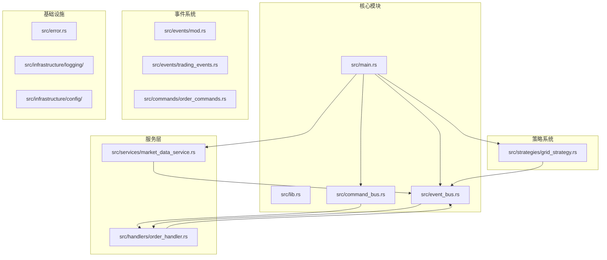

**图表来源**
- [src/lib.rs:1-9](file://src/lib.rs#L1-L9)
- [src/main.rs:1-93](file://src/main.rs#L1-L93)

**章节来源**
- [src/lib.rs:1-9](file://src/lib.rs#L1-L9)
- [Cargo.toml:1-27](file://Cargo.toml#L1-L27)

## 核心组件

### 事件总线系统

事件总线是整个系统的核心通信机制，负责事件的发布、订阅和分发。

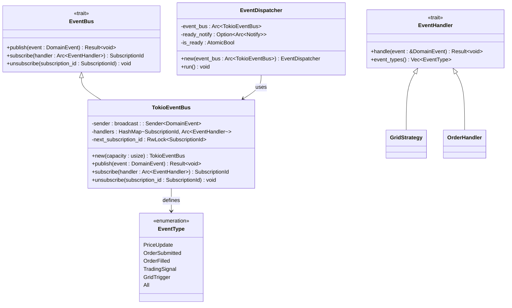

**图表来源**
- [src/event_bus.rs:18-110](file://src/event_bus.rs#L18-L110)
- [src/event_bus.rs:112-158](file://src/event_bus.rs#L112-L158)

### 命令总线系统

命令总线负责处理业务命令，将命令转换为相应的事件处理。

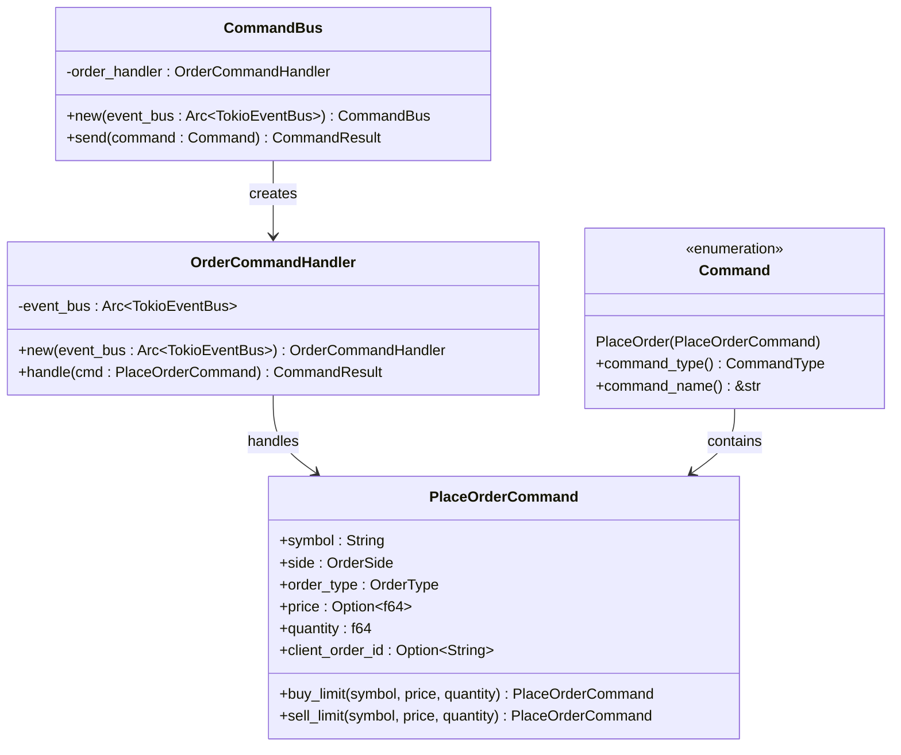

**图表来源**
- [src/command_bus.rs:5-19](file://src/command_bus.rs#L5-L19)
- [src/commands/mod.rs:6-27](file://src/commands/mod.rs#L6-L27)
- [src/commands/order_commands.rs:37-72](file://src/commands/order_commands.rs#L37-L72)

**章节来源**
- [src/event_bus.rs:18-110](file://src/event_bus.rs#L18-L110)
- [src/command_bus.rs:5-19](file://src/command_bus.rs#L5-L19)

## 架构概览

系统采用事件驱动架构，通过事件总线实现组件间的松耦合通信。

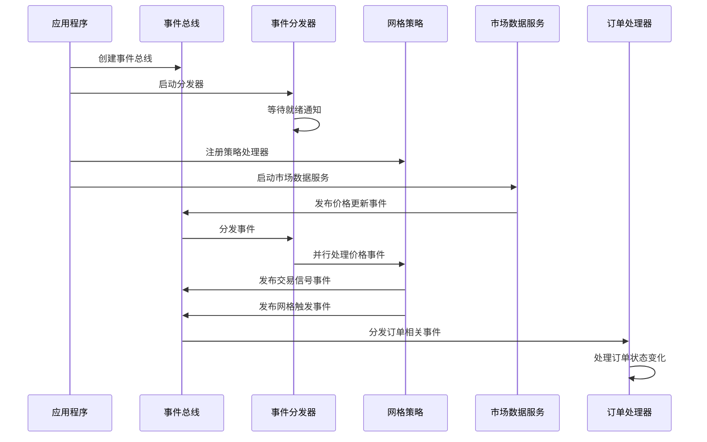

**图表来源**
- [src/main.rs:14-60](file://src/main.rs#L14-L60)
- [src/event_bus.rs:128-157](file://src/event_bus.rs#L128-L157)

## 详细组件示例

### 事件总线基本使用示例

#### 示例1：创建事件总线和分发器

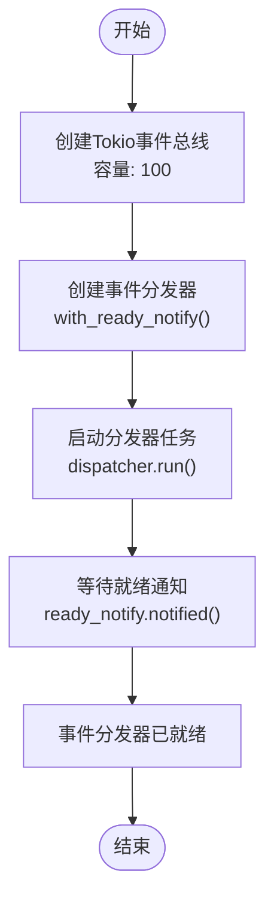

**图表来源**
- [src/main.rs:14-22](file://src/main.rs#L14-L22)
- [src/event_bus.rs:119-135](file://src/event_bus.rs#L119-L135)

**使用步骤**：
1. 创建事件总线实例：`let event_bus = Arc::new(TokioEventBus::new(100));`
2. 创建分发器：`let dispatcher = EventDispatcher::with_ready_notify(event_bus.clone(), ready_notify.clone());`
3. 启动分发器任务：`tokio::spawn(dispatcher.run());`
4. 等待就绪：`ready_notify.notified().await;`

**预期输出**：
```
事件驱动交易系统启动
事件分发器已就绪
```

#### 示例2：注册事件处理器

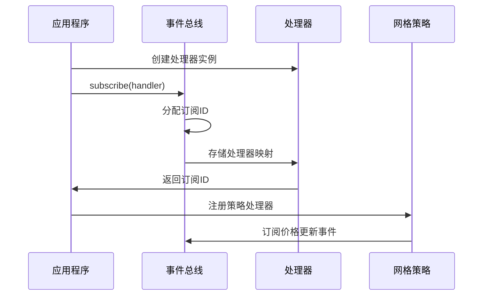

**图表来源**
- [src/event_bus.rs:95-109](file://src/event_bus.rs#L95-L109)
- [src/main.rs:58-60](file://src/main.rs#L58-L60)

**使用步骤**：
1. 创建处理器实例：`let grid_strategy = Arc::new(GridStrategy::new(grid_config, event_bus.clone()));`
2. 注册处理器：`event_bus.subscribe(grid_strategy);`
3. 处理器自动接收匹配的事件

**预期输出**：
```
✅ 网格策略已注册，等待价格事件...
```

#### 示例3：发布和订阅事件

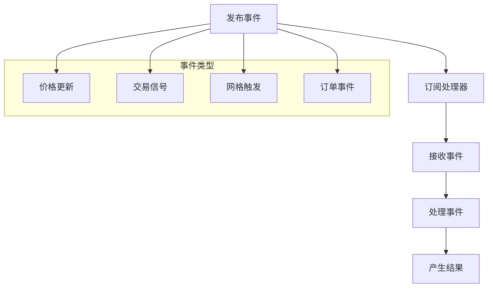

**图表来源**
- [src/event_bus.rs:89-93](file://src/event_bus.rs#L89-L93)
- [src/event_bus.rs:142-155](file://src/event_bus.rs#L142-L155)

**使用步骤**：
1. 发布事件：`event_bus.publish(DomainEvent::PriceUpdate(event)).await;`
2. 订阅处理器：`event_bus.subscribe(handler);`
3. 处理器自动接收并处理事件

**预期输出**：
```
💰 价格更新 | BTCUSDT | 50000.00 USDT | 24h涨跌: 2.50%
📊 [grid_btc_1] BUY 信号 | 价格: 50000.00 | 数量: 0.001 | 网格级别: 2 | 止盈: 50500.00
```

**章节来源**
- [src/main.rs:14-22](file://src/main.rs#L14-L22)
- [src/main.rs:58-60](file://src/main.rs#L58-L60)

### 命令总线基础示例

#### 示例4：创建命令和发送命令

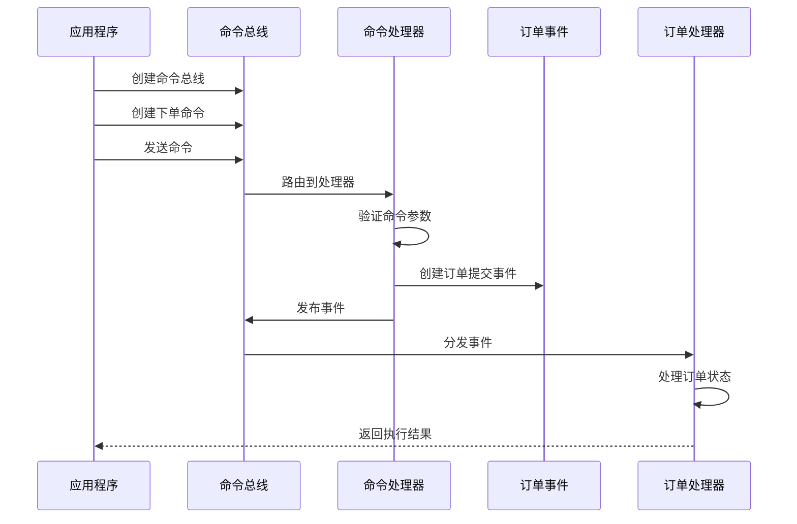

**图表来源**
- [src/main.rs:24-41](file://src/main.rs#L24-L41)
- [src/command_bus.rs:14-18](file://src/command_bus.rs#L14-L18)
- [src/handlers/order_handler.rs:103-135](file://src/handlers/order_handler.rs#L103-L135)

**使用步骤**：
1. 创建命令总线：`let command_bus = CommandBus::new(event_bus.clone());`
2. 创建下单命令：`let place_order_cmd = PlaceOrderCommand::buy_limit("BTCUSDT", 50000.0, 0.001);`
3. 包装命令：`let command = Command::PlaceOrder(place_order_cmd);`
4. 发送命令：`let result = command_bus.send(command).await;`

**预期输出**：
```
=== 开始测试命令总线 ===
命令执行结果: Success { message: "订单已提交", data: None }
✅ 命令执行成功!
```

#### 示例5：命令执行结果处理

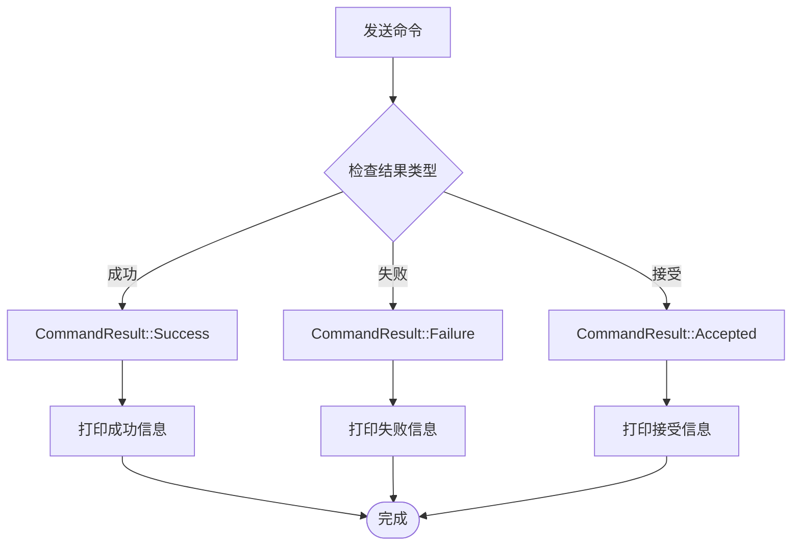

**图表来源**
- [src/commands/mod.rs:29-77](file://src/commands/mod.rs#L29-L77)
- [src/main.rs:36-40](file://src/main.rs#L36-L40)

**使用步骤**：
1. 检查命令结果：`result.is_success()`
2. 处理不同结果类型
3. 根据结果执行相应逻辑

**预期输出**：
```
✅ 命令执行成功!
```

**章节来源**
- [src/main.rs:24-41](file://src/main.rs#L24-L41)
- [src/commands/mod.rs:29-77](file://src/commands/mod.rs#L29-L77)

### 网格交易策略实现示例

#### 示例6：配置网格参数和注册策略

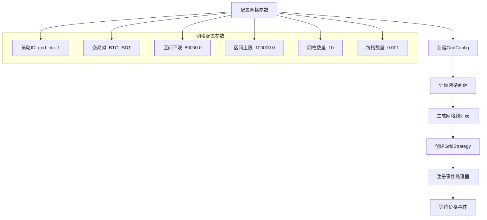

**图表来源**
- [src/main.rs:42-60](file://src/main.rs#L42-L60)
- [src/strategies/grid_strategy.rs:26-81](file://src/strategies/grid_strategy.rs#L26-L81)

**使用步骤**：
1. 创建网格配置：`GridConfig::new("grid_btc_1", "BTCUSDT", 80000.0, 100000.0, 10, 0.001)`
2. 计算网格间距：`grid_config.grid_spacing()`
3. 创建策略实例：`GridStrategy::new(grid_config, event_bus.clone())`
4. 注册策略：`event_bus.subscribe(grid_strategy)`

**预期输出**：
```
网格配置: 区间 [80000, 100000] | 10格 | 间距 2000 USDT
✅ 网格策略已注册，等待价格事件...
```

#### 示例7：处理价格事件和生成交易信号

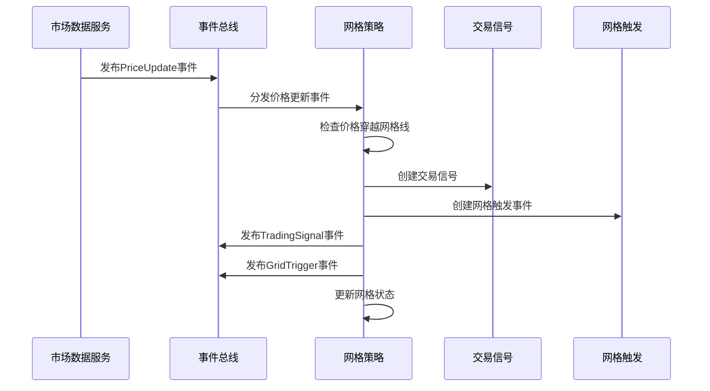

**图表来源**
- [src/strategies/grid_strategy.rs:189-252](file://src/strategies/grid_strategy.rs#L189-L252)

**使用步骤**：
1. 监听价格更新事件：`EventType::PriceUpdate`
2. 检查价格穿越：`state.check_price()`
3. 生成交易信号：根据网格线状态判断买卖
4. 发布信号事件：`TradingSignalEvent` 和 `GridTriggerEvent`

**预期输出**：
```
💰 价格更新 | BTCUSDT | 50000.00 USDT | 24h涨跌: 2.50%
📊 [grid_btc_1] BUY 信号 | 价格: 50000.00 | 数量: 0.001 | 网格级别: 2 | 止盈: 50500.00
```

**章节来源**
- [src/main.rs:42-60](file://src/main.rs#L42-L60)
- [src/strategies/grid_strategy.rs:189-252](file://src/strategies/grid_strategy.rs#L189-L252)

### 应用程序启动完整示例

#### 示例8：完整的应用程序启动流程

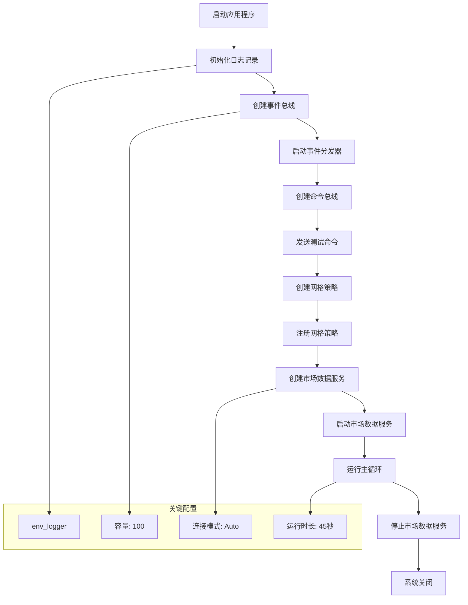

**图表来源**
- [src/main.rs:11-93](file://src/main.rs#L11-L93)

**使用步骤**：
1. 初始化日志：`env_logger::init();`
2. 创建事件总线：`Arc::new(TokioEventBus::new(100))`
3. 启动分发器：`EventDispatcher::with_ready_notify(...).run()`
4. 创建命令总线：`CommandBus::new(event_bus.clone())`
5. 注册网格策略：`event_bus.subscribe(grid_strategy)`
6. 启动市场数据服务：`market_data_service.start().await`
7. 运行指定时长：`tokio::time::sleep(Duration::from_secs(45)).await`

**预期输出**：
```
事件驱动交易系统启动
事件分发器已就绪
=== 开始测试命令总线 ===
命令执行结果: Success { message: "订单已提交", data: None }
✅ 命令执行成功!

=== 初始化网格策略 ===
网格配置: 区间 [80000, 100000] | 10格 | 间距 2000 USDT
✅ 网格策略已注册，等待价格事件...

=== 开始测试市场数据服务 ===
连接模式: Auto
🚀 正在启动市场数据服务...
正在接收Binance实时数据，持续45秒（观察网格交易信号）...
💰 价格更新 | BTCUSDT | 50000.00 USDT | 24h涨跌: 2.50%
📊 [grid_btc_1] BUY 信号 | 价格: 50000.00 | 数量: 0.001 | 网格级别: 2 | 止盈: 50500.00
...

程序已运行完成，即将退出
```

**章节来源**
- [src/main.rs:11-93](file://src/main.rs#L11-L93)

## 依赖关系分析

系统采用模块化设计，各组件之间通过清晰的接口进行交互。

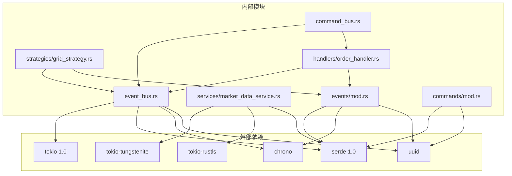

**图表来源**
- [Cargo.toml:6-25](file://Cargo.toml#L6-L25)
- [src/lib.rs:1-9](file://src/lib.rs#L1-L9)

**章节来源**
- [Cargo.toml:6-25](file://Cargo.toml#L6-L25)

## 性能考虑

### 事件处理性能

系统采用广播通道实现事件分发，支持多个处理器并行处理事件：

- **并发处理**：事件分发器使用`futures_util::future::join_all`并行处理所有处理器
- **内存管理**：使用`Arc`智能指针共享事件总线实例
- **锁优化**：使用`parking_lot::RwLock`提高读写性能

### 网格策略性能

网格策略实现了高效的网格线查找和状态管理：

- **网格线预计算**：在初始化时计算所有网格线价格
- **状态缓存**：使用`Mutex`保护状态，避免竞态条件
- **事件过滤**：只处理匹配交易对的价格更新事件

### 市场数据服务性能

市场数据服务支持多种连接模式和优化：

- **连接池**：复用TCP连接和TLS会话
- **代理支持**：支持HTTP代理和SSH隧道
- **心跳检测**：自动维护WebSocket连接
- **错误恢复**：自动重连机制

## 故障排除指南

### 事件总线问题

**问题1：事件未被处理器接收**
- 检查处理器是否正确注册：`event_bus.subscribe(handler)`
- 验证事件类型过滤：`handler.event_types()`返回正确的事件类型
- 确认事件分发器正在运行：检查就绪通知

**问题2：处理器崩溃导致系统异常**
- 查看事件处理错误日志：`eprintln!("事件处理失败：{}", e)`
- 确保处理器实现异步安全：使用`async_trait`
- 验证事件处理器的生命周期管理

### 命令总线问题

**问题3：命令执行失败**
- 检查命令参数验证：`quantity > 0.0`
- 验证事件发布：`event_bus.publish()`返回结果
- 查看命令结果类型：区分`Success`、`Failure`、`Accepted`

**问题4：订单处理异常**
- 检查订单事件序列化：确保`OrderSubmittedEvent`字段完整
- 验证订单处理器事件类型：`EventType::OrderSubmitted`
- 查看订单状态转换逻辑

### 网格策略问题

**问题5：网格信号不正确**
- 验证网格间距计算：`(upper_price - lower_price) / grid_count`
- 检查价格穿越逻辑：`last_price`和`current_price`比较
- 确认网格线状态更新：`filled`标志位切换

**问题6：策略性能问题**
- 优化网格线查找：使用二分搜索或哈希表
- 减少锁竞争：使用更细粒度的锁
- 避免不必要的事件发布：批量处理事件

### 市场数据服务问题

**问题7：WebSocket连接失败**
- 检查网络连接：`TcpStream::connect()`
- 验证TLS握手：`TlsConnector::connect()`
- 确认代理配置：`HTTPS_PROXY`环境变量

**问题8：数据解析错误**
- 验证JSON格式：`serde_json::from_str()`
- 检查字段完整性：`symbol`、`price`、`timestamp`
- 处理组合流格式：支持`stream`和`data`两种格式

**章节来源**
- [src/event_bus.rs:150-155](file://src/event_bus.rs#L150-L155)
- [src/handlers/order_handler.rs:105-107](file://src/handlers/order_handler.rs#L105-L107)
- [src/services/market_data_service.rs:117-178](file://src/services/market_data_service.rs#L117-L178)

## 结论

本基础使用示例文档展示了Binance Rust事件驱动交易系统的核心功能使用方法。系统采用事件驱动架构，具有以下特点：

1. **模块化设计**：清晰的模块分离和接口定义
2. **异步性能**：基于Tokio的高性能异步处理
3. **事件驱动**：松耦合的组件通信机制
4. **可扩展性**：易于添加新的事件处理器和命令处理器
5. **生产就绪**：支持多种连接模式和错误恢复机制

通过这些示例，开发者可以快速理解和使用系统的各项功能，包括事件总线的基本使用、命令总线的操作、网格交易策略的实现以及完整的应用程序启动流程。