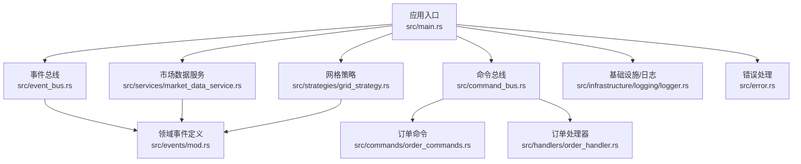
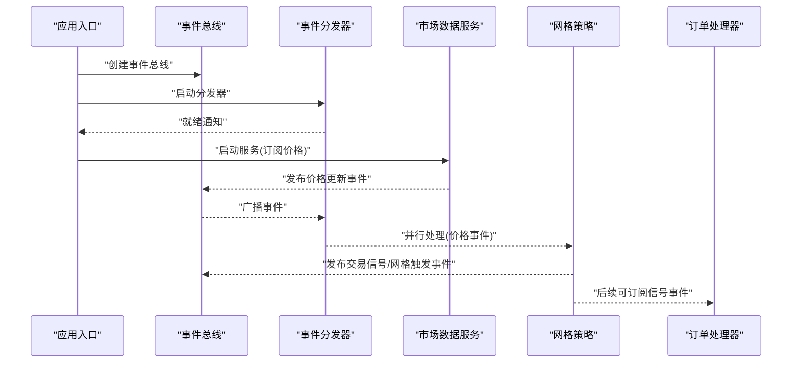
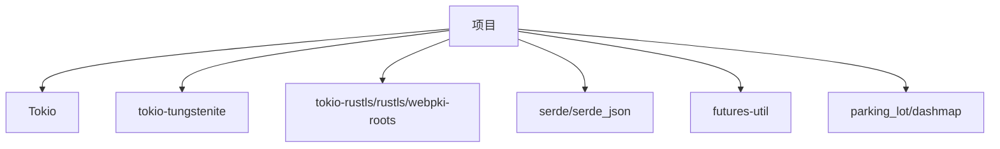

# 性能优化案例

<cite>
**本文引用的文件**
- [src/lib.rs](file://src/lib.rs)
- [src/main.rs](file://src/main.rs)
- [src/event_bus.rs](file://src/event_bus.rs)
- [src/command_bus.rs](file://src/command_bus.rs)
- [src/services/market_data_service.rs](file://src/services/market_data_service.rs)
- [src/strategies/grid_strategy.rs](file://src/strategies/grid_strategy.rs)
- [src/handlers/order_handler.rs](file://src/handlers/order_handler.rs)
- [src/commands/order_commands.rs](file://src/commands/order_commands.rs)
- [src/events/mod.rs](file://src/events/mod.rs)
- [src/events/market_events.rs](file://src/events/market_events.rs)
- [src/events/trading_events.rs](file://src/events/trading_events.rs)
- [src/events/strategy_events.rs](file://src/events/strategy_events.rs)
- [src/error.rs](file://src/error.rs)
- [src/infrastructure/logging/logger.rs](file://src/infrastructure/logging/logger.rs)
- [Cargo.toml](file://Cargo.toml)
- [docs/CODE_EXPLANATION.md](file://docs/CODE_EXPLANATION.md)
</cite>

## 目录
1. [简介](#简介)
2. [项目结构](#项目结构)
3. [核心组件](#核心组件)
4. [架构总览](#架构总览)
5. [详细组件分析](#详细组件分析)
6. [依赖关系分析](#依赖关系分析)
7. [性能考量](#性能考量)
8. [故障排查指南](#故障排查指南)
9. [结论](#结论)
10. [附录](#附录)

## 简介
本文件面向Binance Rust事件驱动交易系统，聚焦性能优化实践与实现方案，覆盖内存使用、并发处理、网络I/O、CPU使用与垃圾回收五大维度。文档结合仓库现有代码结构，给出可落地的优化建议、流程图与序列图，并提供对比分析思路与测试数据采集方法，帮助在保持系统稳定性的同时提升吞吐与延迟表现。

## 项目结构
系统采用模块化组织，围绕事件总线为核心，串联市场数据服务、策略引擎、命令总线与处理器等模块；Cargo.toml声明了Tokio、WebSocket、TLS、序列化等高性能依赖。

**图表来源**
- [src/main.rs:10-93](file://src/main.rs#L10-L93)
- [src/event_bus.rs:18-110](file://src/event_bus.rs#L18-L110)
- [src/command_bus.rs:5-19](file://src/command_bus.rs#L5-L19)
- [src/services/market_data_service.rs:35-42](file://src/services/market_data_service.rs#L35-L42)
- [src/strategies/grid_strategy.rs:159-163](file://src/strategies/grid_strategy.rs#L159-L163)
- [src/handlers/order_handler.rs:16-18](file://src/handlers/order_handler.rs#L16-L18)
- [src/commands/order_commands.rs:37-44](file://src/commands/order_commands.rs#L37-L44)
- [src/events/mod.rs:48-89](file://src/events/mod.rs#L48-L89)
- [src/error.rs:14-34](file://src/error.rs#L14-L34)
- [src/infrastructure/logging/logger.rs:140-144](file://src/infrastructure/logging/logger.rs#L140-L144)

**章节来源**
- [src/lib.rs:1-9](file://src/lib.rs#L1-L9)
- [Cargo.toml:6-25](file://Cargo.toml#L6-L25)

## 核心组件
- 事件总线与分发器：基于Tokio广播通道，支持多订阅者并行处理，具备背压与错误聚合能力。
- 市场数据服务：WebSocket连接Binance，支持代理/直连、自动重连、心跳保活与消息解析。
- 策略引擎：网格策略监听价格事件，按穿越规则生成交易信号并发布后续事件。
- 命令总线与处理器：封装下单命令，发布订单提交事件，便于后续风控与执行模块接入。
- 日志与错误：异步日志记录器与统一错误类型，保障可观测性与可维护性。

**章节来源**
- [src/event_bus.rs:62-158](file://src/event_bus.rs#L62-L158)
- [src/services/market_data_service.rs:96-114](file://src/services/market_data_service.rs#L96-L114)
- [src/strategies/grid_strategy.rs:159-278](file://src/strategies/grid_strategy.rs#L159-L278)
- [src/command_bus.rs:5-19](file://src/command_bus.rs#L5-L19)
- [src/handlers/order_handler.rs:16-91](file://src/handlers/order_handler.rs#L16-L91)
- [src/infrastructure/logging/logger.rs:140-291](file://src/infrastructure/logging/logger.rs#L140-L291)
- [src/error.rs:14-128](file://src/error.rs#L14-L128)

## 架构总览
事件驱动架构以“发布-订阅”解耦模块，WebSocket提供低延迟实时数据，Tokio异步运行时支撑高并发处理。

**图表来源**
- [src/main.rs:14-22](file://src/main.rs#L14-L22)
- [src/event_bus.rs:129-157](file://src/event_bus.rs#L129-L157)
- [src/services/market_data_service.rs:304-374](file://src/services/market_data_service.rs#L304-L374)
- [src/strategies/grid_strategy.rs:266-273](file://src/strategies/grid_strategy.rs#L266-L273)
- [src/handlers/order_handler.rs:69-91](file://src/handlers/order_handler.rs#L69-L91)

## 详细组件分析

### 内存使用优化案例
目标：降低事件与数据结构的内存占用，优化缓存策略，减少不必要的克隆与分配。

- 事件与数据结构
  - 使用紧凑的事件模型与按需字段，避免在高频事件中携带冗余元数据。
  - 事件枚举采用按需负载，仅在必要时包含完整payload，减少序列化体积。
  - 价格事件与K线事件字段精简，仅保留关键字段，避免频繁序列化/反序列化带来的堆分配。

- 缓存策略
  - 网格策略中的网格线列表与状态缓存，避免重复计算网格间距与线位。
  - 使用局部缓存（如上次价格）减少跨函数参数传递与临时变量分配。
  - 对热点字符串（如symbol）采用驻留或复用策略，减少重复分配。

- 并发共享与锁粒度
  - 事件总线处理器表使用读写锁，读多写少场景下提升并发读取吞吐。
  - 分发器在每次分发前复制处理器集合，避免在处理过程中持有锁。

- 优化前后对比思路
  - 使用基准测试工具（如Criterion）测量事件发布/订阅路径的内存分配次数与峰值内存。
  - 对比不同事件负载大小下的分配曲线，评估序列化/反序列化成本。
  - 对比启用/禁用缓存策略的内存占用与吞吐差异。

**章节来源**
- [src/events/market_events.rs:8-18](file://src/events/market_events.rs#L8-L18)
- [src/events/trading_events.rs:8-25](file://src/events/trading_events.rs#L8-L25)
- [src/strategies/grid_strategy.rs:84-100](file://src/strategies/grid_strategy.rs#L84-L100)
- [src/event_bus.rs:137-140](file://src/event_bus.rs#L137-L140)

### 并发处理优化案例
目标：利用Tokio异步运行时，优化事件分发性能，实现高并发事件处理。

- 并行分发
  - 分发器对所有订阅处理器并行调用，使用批量join_all等待完成，显著提升吞吐。
  - 错误聚合：单个处理器失败不影响其他处理器，保证整体鲁棒性。

- 通道与背压
  - 使用广播通道承载事件，天然支持一对多广播与背压，避免过载丢失。
  - 容量配置：根据峰值事件速率调整通道容量，平衡延迟与内存占用。

- 并发模型
  - 事件处理器实现异步处理，避免阻塞分发线程。
  - 使用Arc共享状态，减少锁竞争与上下文切换。

- 优化前后对比思路
  - 通过并发测试（多订阅者、高QPS事件）统计事件从发布到全部处理完成的延迟分布。
  - 对比不同处理器数量下的吞吐与尾延迟，评估并行度收益与锁竞争影响。

**章节来源**
- [src/event_bus.rs:129-157](file://src/event_bus.rs#L129-L157)
- [src/event_bus.rs:62-85](file://src/event_bus.rs#L62-L85)

### 网络I/O优化案例
目标：优化WebSocket连接，降低网络延迟，实现高效实时数据传输。

- 连接模式与代理
  - 支持自动检测、直连与强制代理三种模式，满足不同部署环境需求。
  - HTTP CONNECT隧道实现端到端加密，兼容代理网络。

- 自动重连与心跳
  - 连接失败自动重连，指数退避策略减少抖动。
  - 心跳保活：定时Ping维持连接活性，避免中间设备断开。

- 消息处理与解析
  - 使用tokio::select!并行处理消息接收与心跳触发，避免阻塞。
  - 解析ticker数据时仅提取必要字段，减少JSON解析与对象构建成本。

- 优化前后对比思路
  - 采集连接建立时延、首次消息到达时延、断线恢复时延与消息延迟分布。
  - 对比不同连接模式与代理配置下的吞吐与丢包率。

**章节来源**
- [src/services/market_data_service.rs:23-32](file://src/services/market_data_service.rs#L23-L32)
- [src/services/market_data_service.rs:96-114](file://src/services/market_data_service.rs#L96-L114)
- [src/services/market_data_service.rs:324-374](file://src/services/market_data_service.rs#L324-L374)
- [src/services/market_data_service.rs:409-439](file://src/services/market_data_service.rs#L409-L439)

### CPU使用优化案例
目标：优化计算密集型任务，减少不必要的计算开销，提升CPU利用率。

- 事件类型过滤
  - 处理器通过event_types过滤无关事件，减少无意义处理与分支判断。
  - 事件类型提取函数按需匹配，避免复杂模式匹配开销。

- 网格穿越检测
  - 仅在价格穿越网格线时生成信号，避免重复计算与无效事件发布。
  - 使用局部状态缓存（上次价格）减少跨函数参数传递与临时变量。

- 命令处理与序列化
  - 下单命令参数校验前置，失败快速返回，避免后续序列化与事件发布。
  - 使用Display trait简化枚举到字符串的转换，减少match分支。

- 优化前后对比思路
  - 使用perf或火焰图定位热点函数，对比优化前后的CPU占用与调用栈。
  - 对比不同事件负载下的CPU使用率、IPC与指令数。

**章节来源**
- [src/event_bus.rs:162-181](file://src/event_bus.rs#L162-L181)
- [src/strategies/grid_strategy.rs:102-153](file://src/strategies/grid_strategy.rs#L102-L153)
- [src/handlers/order_handler.rs:102-135](file://src/handlers/order_handler.rs#L102-L135)

### 垃圾回收优化案例
目标：减少GC压力，优化内存分配模式，实现低延迟系统响应。

- 异步日志记录器
  - 异步写入线程与主逻辑解耦，避免主线程阻塞。
  - 日志消息通过MPSC通道传递，减少主线程的IO阻塞与分配。

- 事件与数据结构
  - 事件与命令结构体字段精简，避免大对象频繁分配。
  - 使用&DomainEvent引用而非所有权转移，减少克隆与分配。

- 并发容器与锁
  - 使用RwLock降低读写冲突，提升并发读取性能。
  - 处理器表使用Arc共享，避免重复克隆与分配。

- 优化前后对比思路
  - 使用指标采集GC暂停时间、分配速率与堆大小，对比优化前后的GC行为。
  - 对比不同事件负载下的停顿分布与吞吐变化。

**章节来源**
- [src/infrastructure/logging/logger.rs:140-291](file://src/infrastructure/logging/logger.rs#L140-L291)
- [src/event_bus.rs:189-205](file://src/event_bus.rs#L189-L205)

## 依赖关系分析
系统依赖Tokio生态与网络栈，关键依赖包括异步运行时、WebSocket、TLS与序列化库。

**图表来源**
- [Cargo.toml:7-24](file://Cargo.toml#L7-L24)

**章节来源**
- [Cargo.toml:7-24](file://Cargo.toml#L7-L24)

## 性能考量
- 事件总线容量与背压：合理设置广播通道容量，避免过载导致丢弃与延迟。
- 并行度权衡：处理器数量与CPU核心数匹配，避免过度并行导致上下文切换开销。
- 网络参数：连接超时、心跳间隔与重连策略需结合网络质量调整。
- 日志级别与格式：生产环境建议文本格式与较低级别，减少序列化开销。
- 代理与直连：在服务器环境优先直连，减少代理链路延迟。

## 故障排查指南
- 事件处理失败：检查EventDispatcher错误聚合逻辑，定位具体处理器错误。
- WebSocket连接失败：确认代理配置、TLS握手与心跳保活是否正常。
- 命令执行失败：验证参数校验与事件发布结果，查看日志与错误类型映射。
- 日志写入异常：检查异步日志线程状态与文件权限，确保落盘与轮转正常。

**章节来源**
- [src/event_bus.rs:150-155](file://src/event_bus.rs#L150-L155)
- [src/services/market_data_service.rs:168-177](file://src/services/market_data_service.rs#L168-L177)
- [src/handlers/order_handler.rs:129-132](file://src/handlers/order_handler.rs#L129-L132)
- [src/infrastructure/logging/logger.rs:181-226](file://src/infrastructure/logging/logger.rs#L181-L226)

## 结论
通过事件驱动架构与Tokio异步运行时，系统在实时性与可扩展性方面具备良好基础。结合本文的内存、并发、网络、CPU与GC优化建议，可在不牺牲稳定性的前提下进一步提升性能。建议在生产环境中持续采集关键指标，迭代优化参数与实现细节。

## 附录
- 代码结构与模块职责参考：[docs/CODE_EXPLANATION.md](file://docs/CODE_EXPLANATION.md)
- 事件类型与元数据定义：[src/events/mod.rs:21-46](file://src/events/mod.rs#L21-L46)
- 错误类型与统一结果：[src/error.rs:14-131](file://src/error.rs#L14-131)