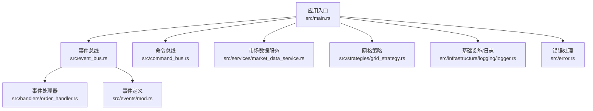
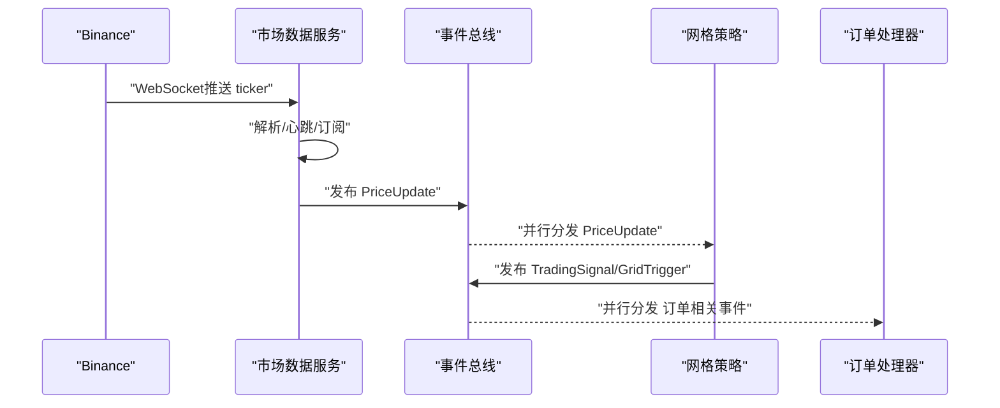
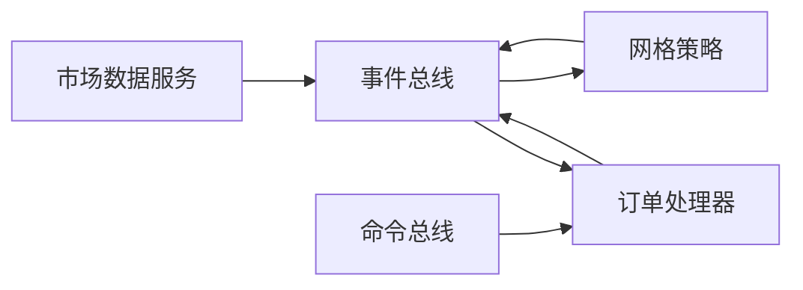

# 故障排除指南

<cite>
**本文引用的文件**
- [src/main.rs](file://src/main.rs)
- [src/lib.rs](file://src/lib.rs)
- [src/error.rs](file://src/error.rs)
- [src/event_bus.rs](file://src/event_bus.rs)
- [src/command_bus.rs](file://src/command_bus.rs)
- [src/services/market_data_service.rs](file://src/services/market_data_service.rs)
- [src/strategies/grid_strategy.rs](file://src/strategies/grid_strategy.rs)
- [src/handlers/order_handler.rs](file://src/handlers/order_handler.rs)
- [src/infrastructure/logging/logger.rs](file://src/infrastructure/logging/logger.rs)
- [src/events/mod.rs](file://src/events/mod.rs)
- [Cargo.toml](file://Cargo.toml)
- [docs/CODE_EXPLANATION.md](file://docs/CODE_EXPLANATION.md)
- [docs/EVENT_DRIVEN_REFACTOR_GUIDE.md](file://docs/EVENT_DRIVEN_REFACTOR_GUIDE.md)
</cite>

## 目录
1. [简介](#简介)
2. [项目结构](#项目结构)
3. [核心组件](#核心组件)
4. [架构总览](#架构总览)
5. [详细组件故障排除](#详细组件故障排除)
6. [依赖关系分析](#依赖关系分析)
7. [性能问题诊断](#性能问题诊断)
8. [故障排除指南](#故障排除指南)
9. [结论](#结论)
10. [附录](#附录)

## 简介
本指南面向Binance Rust事件驱动交易系统的运维与开发人员，聚焦于常见问题的诊断与解决。内容覆盖网络连接问题排查（WebSocket连接失败、代理配置、防火墙阻断）、事件处理异常（处理器错误、事件丢失、重复处理）、性能问题（瓶颈识别、内存泄漏、CPU过高）、配置问题（系统配置、环境变量、依赖版本）以及日志分析技巧（定位错误、追踪链路、性能分析）。每个问题均提供症状、可能原因、诊断步骤与具体解决方法。

## 项目结构
系统采用事件驱动架构，核心模块包括事件总线、命令总线、市场数据服务、策略引擎、事件与命令处理器、基础设施与错误处理等。应用入口负责装配组件并启动服务。

**图表来源**
- [src/main.rs:10-93](file://src/main.rs#L10-L93)
- [src/event_bus.rs:18-110](file://src/event_bus.rs#L18-L110)
- [src/command_bus.rs:5-19](file://src/command_bus.rs#L5-L19)
- [src/services/market_data_service.rs:35-114](file://src/services/market_data_service.rs#L35-L114)
- [src/strategies/grid_strategy.rs:159-278](file://src/strategies/grid_strategy.rs#L159-L278)
- [src/handlers/order_handler.rs:16-91](file://src/handlers/order_handler.rs#L16-L91)
- [src/events/mod.rs:48-89](file://src/events/mod.rs#L48-L89)
- [src/infrastructure/logging/logger.rs:140-290](file://src/infrastructure/logging/logger.rs#L140-L290)
- [src/error.rs:12-34](file://src/error.rs#L12-L34)

**章节来源**
- [src/lib.rs:1-9](file://src/lib.rs#L1-L9)
- [src/main.rs:10-93](file://src/main.rs#L10-L93)
- [docs/CODE_EXPLANATION.md:75-122](file://docs/CODE_EXPLANATION.md#L75-L122)

## 核心组件
- 事件总线与分发器：负责事件发布、订阅与并行分发，支持广播通道与处理器集合管理。
- 命令总线：接收命令并路由至相应处理器（如下单命令），返回命令执行结果。
- 市场数据服务：通过WebSocket连接Binance，支持代理/直连、自动重连、心跳保活、消息解析与事件发布。
- 策略引擎（网格策略）：订阅价格事件，根据网格线穿越生成交易信号，并发布网格触发与交易信号事件。
- 订单处理器：订阅订单生命周期事件，记录日志并预留后续处理（持久化、状态更新等）。
- 日志与错误：统一错误类型与日志配置，支持文本/JSON格式、异步落盘与轮转。

**章节来源**
- [src/event_bus.rs:18-158](file://src/event_bus.rs#L18-L158)
- [src/command_bus.rs:5-19](file://src/command_bus.rs#L5-L19)
- [src/services/market_data_service.rs:35-440](file://src/services/market_data_service.rs#L35-L440)
- [src/strategies/grid_strategy.rs:159-278](file://src/strategies/grid_strategy.rs#L159-L278)
- [src/handlers/order_handler.rs:16-91](file://src/handlers/order_handler.rs#L16-L91)
- [src/infrastructure/logging/logger.rs:140-290](file://src/infrastructure/logging/logger.rs#L140-L290)
- [src/error.rs:12-128](file://src/error.rs#L12-L128)

## 架构总览
事件驱动数据流：市场数据服务接收Binance推送，解析为领域事件并发布；事件总线并行分发给订阅者（策略、风控、订单等）；策略生成信号事件并再次发布，形成清晰的解耦链路。

**图表来源**
- [src/services/market_data_service.rs:304-374](file://src/services/market_data_service.rs#L304-L374)
- [src/event_bus.rs:129-157](file://src/event_bus.rs#L129-L157)
- [src/strategies/grid_strategy.rs:265-278](file://src/strategies/grid_strategy.rs#L265-L278)
- [src/handlers/order_handler.rs:68-91](file://src/handlers/order_handler.rs#L68-L91)

## 详细组件故障排除

### 网络连接问题排查
- 症状
  - WebSocket连接失败、频繁断开、无法接收实时数据。
  - 代理模式提示未设置HTTPS_PROXY或CONNECT失败。
  - 直连模式出现TLS握手超时或连接超时。
- 可能原因
  - 代理配置错误或代理不可达。
  - 防火墙/安全组阻断WSS端口。
  - DNS解析异常或SSH隧道配置错误。
  - 证书校验失败或时间不同步。
- 诊断步骤
  - 检查连接模式与环境变量：确认ConnectionMode与HTTPS_PROXY/https_proxy是否匹配。
  - 验证代理连通性：尝试curl或浏览器访问代理地址。
  - 测试直连：临时改为Direct模式，观察是否可连接。
  - 检查防火墙：确认出站WSS端口开放。
  - 查看日志：关注握手超时、代理响应码、TLS错误等。
- 解决方法
  - 正确设置HTTPS_PROXY（小写/大写均可），或在Direct模式下移除代理变量。
  - 使用SSH隧道时，确保本地端口映射正确且TLS主机名与证书一致。
  - 调整connect_timeout与reconnect_interval参数，避免过短导致频繁重试。
  - 若为内网环境，确认NAT/防火墙策略允许WSS出站。

**章节来源**
- [src/services/market_data_service.rs:23-42](file://src/services/market_data_service.rs#L23-L42)
- [src/services/market_data_service.rs:117-178](file://src/services/market_data_service.rs#L117-L178)
- [src/services/market_data_service.rs:231-301](file://src/services/market_data_service.rs#L231-L301)
- [src/services/market_data_service.rs:96-114](file://src/services/market_data_service.rs#L96-L114)
- [src/main.rs:65-76](file://src/main.rs#L65-L76)

### 事件处理异常排查
- 症状
  - 事件处理失败、日志报错、事件未到达或重复处理。
  - 策略未生成信号或信号延迟。
- 可能原因
  - 处理器未正确订阅或event_types过滤不当。
  - 并行处理中个别处理器panic或阻塞。
  - 事件总线容量不足导致丢弃旧事件。
  - 事件类型映射缺失或解析失败。
- 诊断步骤
  - 检查订阅注册：确认事件处理器已subscribe且返回有效订阅ID。
  - 查看EventDispatcher错误收集：分发器会打印事件处理失败信息。
  - 核对事件类型枚举与extract_event_type映射。
  - 检查事件总线容量与背压行为。
- 解决方法
  - 修正event_types过滤，确保只订阅感兴趣事件。
  - 为处理器增加错误日志与边界保护，避免panic传播。
  - 调整事件总线容量，必要时启用持久化存储。
  - 完善DomainEvent与EventType映射，保证解析稳定。

**章节来源**
- [src/event_bus.rs:18-110](file://src/event_bus.rs#L18-L110)
- [src/event_bus.rs:129-157](file://src/event_bus.rs#L129-L157)
- [src/event_bus.rs:162-181](file://src/event_bus.rs#L162-L181)
- [src/strategies/grid_strategy.rs:265-278](file://src/strategies/grid_strategy.rs#L265-L278)

### 事件丢失与重复处理
- 症状
  - 事件未被任何处理器消费。
  - 同一事件被多次处理。
- 可能原因
  - 订阅者未正确注册或被意外注销。
  - 广播通道容量过小导致丢弃。
  - 处理器内部状态未正确更新（如网格策略的filled标记）。
- 诊断步骤
  - 确认订阅ID与注销流程，避免重复订阅或遗漏注销。
  - 监控事件总线容量与丢弃情况。
  - 检查处理器内部状态一致性与幂等性。
- 解决方法
  - 使用稳定的订阅/注销流程，避免并发竞态。
  - 增大广播通道容量或引入持久化事件存储。
  - 为处理器增加去重与幂等逻辑（如基于事件ID或时间戳）。

**章节来源**
- [src/event_bus.rs:95-110](file://src/event_bus.rs#L95-L110)
- [src/strategies/grid_strategy.rs:102-154](file://src/strategies/grid_strategy.rs#L102-L154)

### 命令处理异常
- 症状
  - 命令执行失败、返回ValidationFailed或ExecutionFailed。
  - 下单命令未产生预期事件。
- 可能原因
  - 命令参数校验失败（如数量<=0）。
  - 事件发布失败导致命令结果异常。
  - 订单处理器未订阅相关事件。
- 诊断步骤
  - 检查命令参数与校验逻辑。
  - 查看命令总线send返回结果与事件发布日志。
  - 确认订单处理器已订阅OrderSubmitted/Filled/Cancelled/Rejected事件。
- 解决方法
  - 修正参数校验与错误信息。
  - 修复事件发布失败路径，确保异常被捕获并返回。
  - 补充或修复订单处理器订阅。

**章节来源**
- [src/command_bus.rs:14-19](file://src/command_bus.rs#L14-L19)
- [src/handlers/order_handler.rs:68-91](file://src/handlers/order_handler.rs#L68-L91)
- [src/handlers/order_handler.rs:102-136](file://src/handlers/order_handler.rs#L102-L136)

### 性能问题诊断
- 症状
  - CPU使用率过高、内存增长、事件积压。
- 可能原因
  - 处理器内部存在阻塞I/O或长时间计算。
  - 事件总线容量不足引发丢弃。
  - 日志级别过高导致I/O压力。
  - 并发度不合理或锁竞争。
- 诊断步骤
  - 使用系统监控工具（top/htop、perf、火焰图）定位热点。
  - 检查事件总线容量与背压表现。
  - 降低日志级别或调整日志轮转策略。
  - 评估处理器并发模型与锁粒度。
- 解决方法
  - 将阻塞操作移至后台任务或使用异步I/O。
  - 调整事件总线容量与缓冲策略。
  - 优化日志配置，避免高频写盘。
  - 采用更细粒度的锁或无锁结构。

**章节来源**
- [src/infrastructure/logging/logger.rs:140-290](file://src/infrastructure/logging/logger.rs#L140-L290)
- [src/event_bus.rs:82-84](file://src/event_bus.rs#L82-L84)

### 配置问题排查
- 症状
  - 程序启动失败、连接异常、功能不可用。
- 可能原因
  - 环境变量未设置（HTTPS_PROXY/https_proxy）。
  - 连接模式与网络环境不匹配（Auto/Proxy/Direct）。
  - 依赖库版本不兼容或缺失。
- 诊断步骤
  - 检查环境变量是否存在且格式正确。
  - 对照应用入口中的连接模式配置与实际网络环境。
  - 运行cargo tree查看依赖树，核对版本。
- 解决方法
  - 正确设置HTTPS_PROXY或切换Direct模式。
  - 在服务器环境使用Direct模式，开发环境使用Auto/Proxy。
  - 升级/降级依赖至兼容版本，确保编译通过。

**章节来源**
- [src/main.rs:65-76](file://src/main.rs#L65-L76)
- [Cargo.toml:6-24](file://Cargo.toml#L6-L24)

### 日志分析技巧
- 症状
  - 问题难以定位、错误信息不明确、链路追踪困难。
- 可能原因
  - 日志级别过低或过高、格式不统一、未落盘或轮转异常。
- 诊断步骤
  - 使用AsyncLogger配置文本/JSON格式，设置合适级别与缓冲。
  - 检查日志轮转策略与文件权限。
  - 通过关键字搜索（如“WebSocket”、“代理”、“事件处理失败”）快速定位。
- 解决方法
  - 调整日志级别与格式，便于机器解析与人工阅读。
  - 启用异步写盘与轮转，避免I/O成为瓶颈。
  - 增加关键路径的日志埋点（如握手、订阅、发布、处理）。

**章节来源**
- [src/infrastructure/logging/logger.rs:140-290](file://src/infrastructure/logging/logger.rs#L140-L290)

## 依赖关系分析
- 组件耦合
  - 事件总线与处理器通过Arc<dyn EventHandler>解耦，支持多处理器并行处理。
  - 市场数据服务与事件总线松耦合，通过DomainEvent发布。
  - 命令总线与处理器通过命令枚举路由，职责清晰。
- 外部依赖
  - WebSocket/TLS、HTTP代理、JSON序列化、异步运行时等。
- 循环依赖
  - 未见直接循环依赖；模块间通过事件与接口解耦。

**图表来源**
- [src/services/market_data_service.rs:35-114](file://src/services/market_data_service.rs#L35-L114)
- [src/event_bus.rs:18-110](file://src/event_bus.rs#L18-L110)
- [src/command_bus.rs:5-19](file://src/command_bus.rs#L5-L19)

**章节来源**
- [src/lib.rs:1-9](file://src/lib.rs#L1-L9)
- [src/event_bus.rs:18-110](file://src/event_bus.rs#L18-L110)
- [src/command_bus.rs:5-19](file://src/command_bus.rs#L5-L19)

## 性能问题诊断
- 识别瓶颈
  - 使用perf或火焰图定位CPU热点。
  - 观察事件总线背压与丢弃情况。
- 内存泄漏检测
  - 使用heaptrack或valgrind检测泄漏。
  - 检查Arc引用计数与循环引用。
- CPU使用率过高
  - 优化阻塞I/O为异步。
  - 减少不必要的序列化/反序列化。
  - 控制日志频率与级别。

[本节为通用指导，无需特定文件来源]

## 故障排除指南

### 网络连接问题
- 代理配置错误
  - 症状：代理CONNECT失败、代理URL解析失败。
  - 诊断：检查HTTPS_PROXY/https_proxy是否设置，代理地址与端口是否可达。
  - 解决：修正代理变量或切换Direct模式。
- 防火墙阻断
  - 症状：连接超时、握手超时。
  - 诊断：确认WSS端口出站策略。
  - 解决：放行9443端口或使用直连。
- 证书/时间问题
  - 症状：TLS握手失败。
  - 诊断：检查系统时间与证书链。
  - 解决：同步时间、更新信任根。

**章节来源**
- [src/services/market_data_service.rs:149-164](file://src/services/market_data_service.rs#L149-L164)
- [src/services/market_data_service.rs:197-229](file://src/services/market_data_service.rs#L197-L229)

### 事件处理异常
- 处理器错误
  - 症状：事件处理失败日志。
  - 诊断：查看EventDispatcher错误收集与处理器日志。
  - 解决：修复panic、增加边界检查。
- 事件丢失
  - 症状：无信号或延迟。
  - 诊断：检查订阅注册与事件类型映射。
  - 解决：修正订阅与映射。
- 事件重复
  - 症状：重复信号。
  - 诊断：检查处理器内部状态（如filled标记）。
  - 解决：增加幂等逻辑与去重。

**章节来源**
- [src/event_bus.rs:129-157](file://src/event_bus.rs#L129-L157)
- [src/strategies/grid_strategy.rs:102-154](file://src/strategies/grid_strategy.rs#L102-L154)

### 命令处理异常
- 参数校验失败
  - 症状：ValidationFailed。
  - 诊断：检查命令参数与校验逻辑。
  - 解决：修正参数或校验规则。
- 事件发布失败
  - 症状：命令执行返回失败。
  - 诊断：查看事件发布日志。
  - 解决：修复发布路径或回退策略。

**章节来源**
- [src/handlers/order_handler.rs:102-136](file://src/handlers/order_handler.rs#L102-L136)

### 性能问题
- CPU过高
  - 症状：高占用。
  - 诊断：火焰图/perf分析。
  - 解决：异步化阻塞操作、减少序列化。
- 内存泄漏
  - 症状：内存持续增长。
  - 诊断：heaptrack/valgrind。
  - 解决：检查Arc循环引用与资源释放。
- 事件积压
  - 症状：事件总线丢弃。
  - 诊断：监控容量与丢弃计数。
  - 解决：增大容量或引入持久化。

**章节来源**
- [src/infrastructure/logging/logger.rs:140-290](file://src/infrastructure/logging/logger.rs#L140-L290)
- [src/event_bus.rs:82-84](file://src/event_bus.rs#L82-L84)

### 配置问题
- 环境变量
  - 症状：代理模式但未设置代理变量。
  - 诊断：检查HTTPS_PROXY/https_proxy。
  - 解决：设置正确的代理变量或切换Direct。
- 依赖版本
  - 症状：编译失败或运行时错误。
  - 诊断：cargo tree查看版本。
  - 解决：统一依赖版本。

**章节来源**
- [src/main.rs:65-76](file://src/main.rs#L65-L76)
- [Cargo.toml:6-24](file://Cargo.toml#L6-L24)

### 日志分析
- 症状：定位困难、链路不清晰。
- 诊断：文本/JSON格式、轮转策略、关键字搜索。
- 解决：优化日志级别与格式，启用异步写盘。

**章节来源**
- [src/infrastructure/logging/logger.rs:140-290](file://src/infrastructure/logging/logger.rs#L140-L290)

## 结论
通过事件驱动架构，系统实现了模块解耦与可观测性提升。针对网络、事件、命令、性能与配置问题，建议按“症状—原因—诊断—解决”的闭环流程处理，并结合日志与监控工具进行持续优化。对于生产环境，建议启用直连模式、合理配置事件总线容量、优化日志策略与处理器并发模型。

[本节为总结，无需特定文件来源]

## 附录
- 关键流程图与序列图已在前述章节中给出，便于对照代码定位问题。
- 建议在开发与运维环境中分别设置不同的连接模式与日志级别，以平衡开发效率与生产稳定性。

[本节为补充说明，无需特定文件来源]