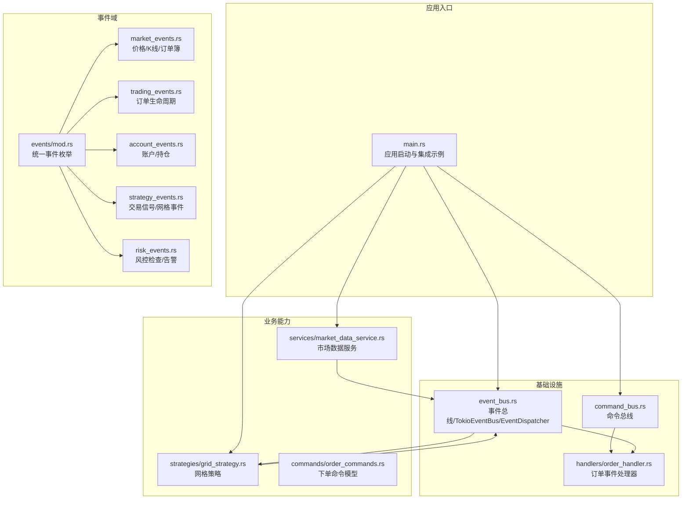
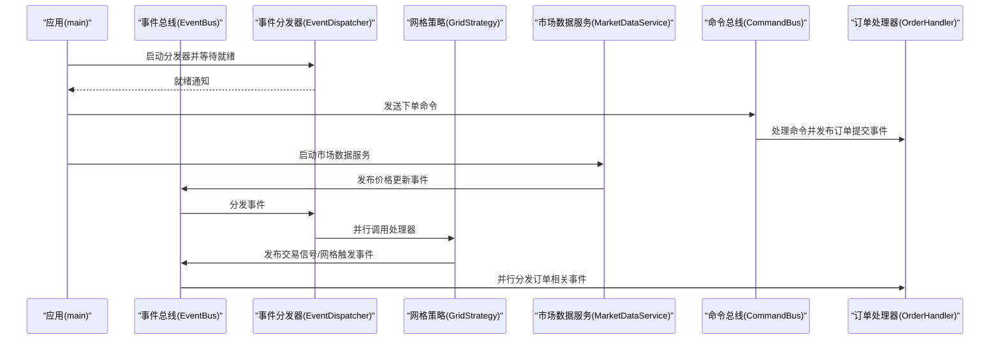
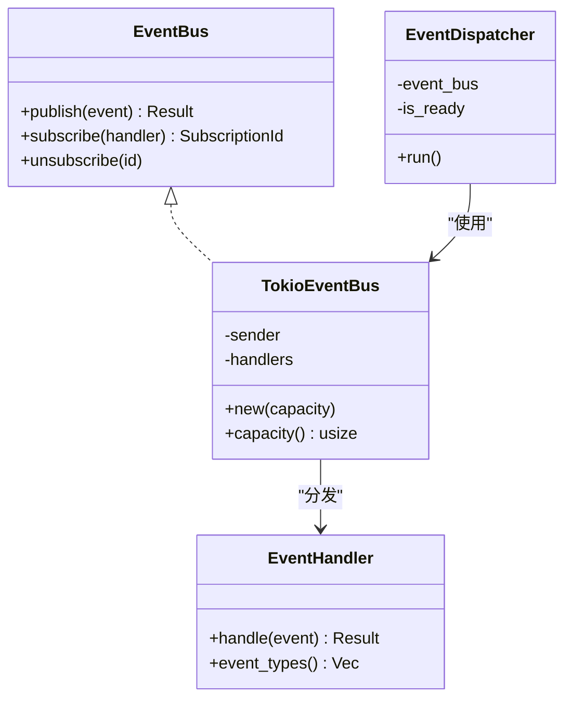
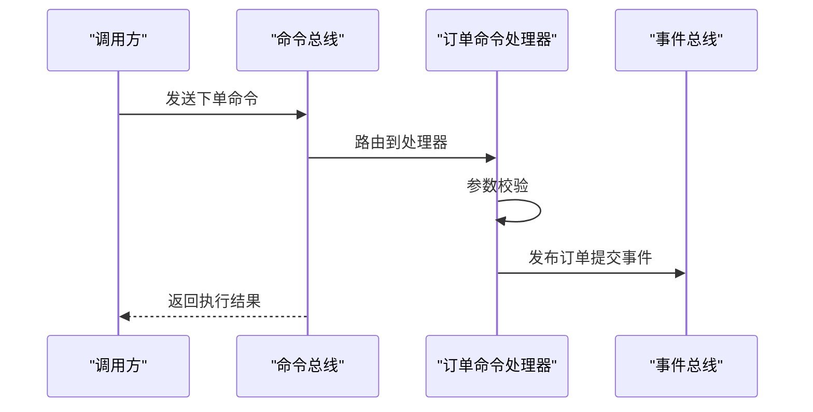
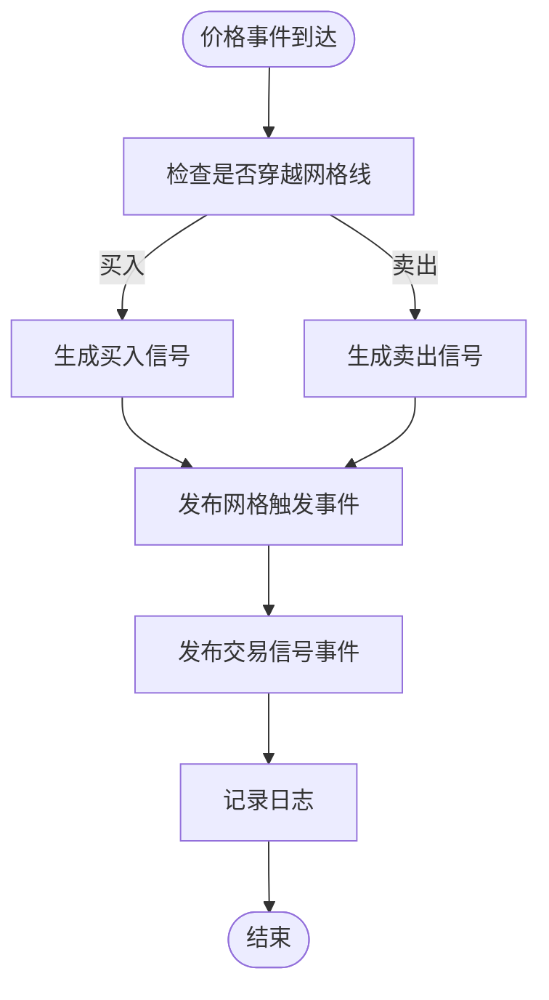
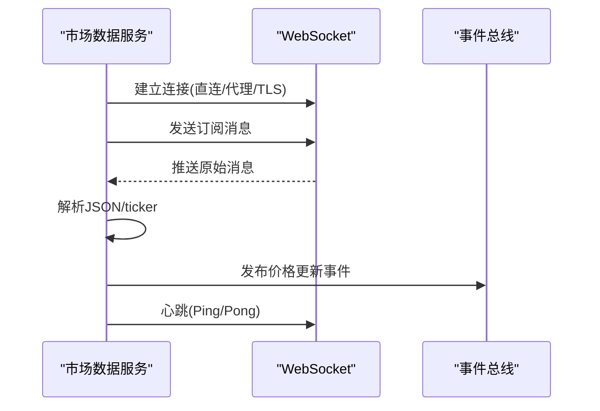
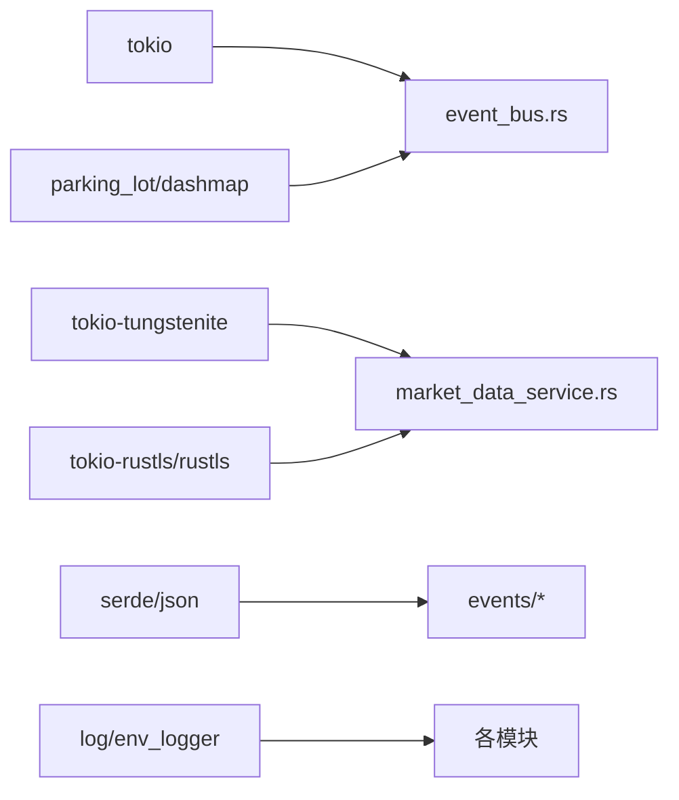

# 示例与最佳实践

<cite>
**本文引用的文件**
- [src/main.rs](file://src/main.rs)
- [src/lib.rs](file://src/lib.rs)
- [src/event_bus.rs](file://src/event_bus.rs)
- [src/command_bus.rs](file://src/command_bus.rs)
- [src/handlers/order_handler.rs](file://src/handlers/order_handler.rs)
- [src/commands/order_commands.rs](file://src/commands/order_commands.rs)
- [src/services/market_data_service.rs](file://src/services/market_data_service.rs)
- [src/strategies/grid_strategy.rs](file://src/strategies/grid_strategy.rs)
- [src/events/mod.rs](file://src/events/mod.rs)
- [src/events/market_events.rs](file://src/events/market_events.rs)
- [src/events/trading_events.rs](file://src/events/trading_events.rs)
- [src/events/account_events.rs](file://src/events/account_events.rs)
- [src/events/strategy_events.rs](file://src/events/strategy_events.rs)
- [src/events/risk_events.rs](file://src/events/risk_events.rs)
- [Cargo.toml](file://Cargo.toml)
</cite>

## 目录
1. [简介](#简介)
2. [项目结构](#项目结构)
3. [核心组件](#核心组件)
4. [架构总览](#架构总览)
5. [详细组件分析](#详细组件分析)
6. [依赖关系分析](#依赖关系分析)
7. [性能考量](#性能考量)
8. [故障排查指南](#故障排查指南)
9. [结论](#结论)
10. [附录](#附录)

## 简介
本文件面向希望基于该事件驱动交易系统进行实战开发的工程师，提供从基础使用到高级应用的完整示例与最佳实践。内容覆盖：
- 基础使用：事件监听、简单网格策略、订单处理流程
- 高级功能：多策略组合、复杂风控、高性能数据处理、分布式部署思路
- 性能优化：内存、并发、网络I/O优化与效果对比
- 常见问题与避坑建议
- 代码重构案例：提升可维护性与扩展性
- 安全与合规注意事项

## 项目结构
该项目采用“事件驱动 + 命令总线”的分层设计，围绕事件总线、事件模型、命令与处理器、策略与服务展开。

图表来源
- [src/main.rs:10-93](file://src/main.rs#L10-L93)
- [src/event_bus.rs:61-158](file://src/event_bus.rs#L61-L158)
- [src/command_bus.rs:5-19](file://src/command_bus.rs#L5-L19)
- [src/handlers/order_handler.rs:16-91](file://src/handlers/order_handler.rs#L16-L91)
- [src/strategies/grid_strategy.rs:156-278](file://src/strategies/grid_strategy.rs#L156-L278)
- [src/services/market_data_service.rs:34-114](file://src/services/market_data_service.rs#L34-L114)
- [src/commands/order_commands.rs:37-72](file://src/commands/order_commands.rs#L37-L72)
- [src/events/mod.rs:48-89](file://src/events/mod.rs#L48-L89)

章节来源
- [src/lib.rs:1-9](file://src/lib.rs#L1-L9)
- [src/main.rs:10-93](file://src/main.rs#L10-L93)

## 核心组件
- 事件总线与分发器：负责事件发布、订阅与并行分发，支持广播通道与动态处理器集合。
- 事件模型：统一的 DomainEvent 枚举，涵盖市场、交易、账户、策略、风控事件。
- 命令总线：将命令转换为领域事件，解耦外部调用与内部处理。
- 策略：网格策略监听价格事件，生成交易信号与网格触发事件。
- 市场数据服务：连接Binance WebSocket，解析并发布价格事件，支持代理/直连与自动重连。
- 订单处理器：消费订单生命周期事件，作为后续策略/风控/账务的接入点。

章节来源
- [src/event_bus.rs:18-110](file://src/event_bus.rs#L18-L110)
- [src/events/mod.rs:48-89](file://src/events/mod.rs#L48-L89)
- [src/command_bus.rs:5-19](file://src/command_bus.rs#L5-L19)
- [src/strategies/grid_strategy.rs:156-278](file://src/strategies/grid_strategy.rs#L156-L278)
- [src/services/market_data_service.rs:34-114](file://src/services/market_data_service.rs#L34-L114)
- [src/handlers/order_handler.rs:16-91](file://src/handlers/order_handler.rs#L16-L91)

## 架构总览
系统以事件为中心，形成“数据采集 → 事件发布 → 并行分发 → 多处理器消费”的流水线。命令通过命令总线转化为事件，策略与服务作为处理器订阅感兴趣事件，实现松耦合扩展。

图表来源
- [src/main.rs:14-92](file://src/main.rs#L14-L92)
- [src/event_bus.rs:112-158](file://src/event_bus.rs#L112-L158)
- [src/command_bus.rs:14-18](file://src/command_bus.rs#L14-L18)
- [src/handlers/order_handler.rs:68-91](file://src/handlers/order_handler.rs#L68-L91)
- [src/strategies/grid_strategy.rs:264-278](file://src/strategies/grid_strategy.rs#L264-L278)
- [src/services/market_data_service.rs:303-374](file://src/services/market_data_service.rs#L303-L374)

## 详细组件分析

### 事件总线与分发器
- 设计要点
  - 使用广播通道承载事件，支持高吞吐与低延迟。
  - 订阅者集合使用读写锁保护，订阅/取消订阅与分发并行安全。
  - 分发器并发调用所有处理器，join_all 聚合结果并统一记录错误。
- 性能特性
  - 发布为O(1)，订阅为O(n)遍历，n为处理器数量。
  - 并行处理提升整体吞吐，适合多策略/多处理器场景。
- 使用建议
  - 控制处理器数量与职责边界，避免单处理器阻塞。
  - 对耗时任务异步化，减少分发器等待。

图表来源
- [src/event_bus.rs:18-110](file://src/event_bus.rs#L18-L110)
- [src/event_bus.rs:112-158](file://src/event_bus.rs#L112-L158)

章节来源
- [src/event_bus.rs:18-158](file://src/event_bus.rs#L18-L158)

### 命令总线与下单命令
- 设计要点
  - 命令总线根据命令类型路由至对应处理器。
  - 下单命令包含参数校验与事件发布，便于审计与可观测。
- 使用建议
  - 将“下单”抽象为命令，便于引入幂等、重试、补偿等机制。
  - 事件发布失败时返回失败结果，避免状态不一致。

图表来源
- [src/command_bus.rs:8-18](file://src/command_bus.rs#L8-L18)
- [src/handlers/order_handler.rs:93-136](file://src/handlers/order_handler.rs#L93-L136)
- [src/commands/order_commands.rs:37-72](file://src/commands/order_commands.rs#L37-L72)

章节来源
- [src/command_bus.rs:5-19](file://src/command_bus.rs#L5-L19)
- [src/handlers/order_handler.rs:93-136](file://src/handlers/order_handler.rs#L93-L136)
- [src/commands/order_commands.rs:37-72](file://src/commands/order_commands.rs#L37-L72)

### 网格策略（基础网格交易）
- 功能概述
  - 在价格穿越网格线时生成买入/卖出信号，并发布网格触发与交易信号事件。
  - 支持利润阈值、网格间距、每格数量等配置。
- 关键流程
  - 订阅价格事件 → 检查穿越 → 生成信号 → 发布事件 → 记录日志。
- 使用建议
  - 将“下单”逻辑从策略中剥离，策略只负责信号生成。
  - 结合风控事件，对信号进行二次过滤。

图表来源
- [src/strategies/grid_strategy.rs:102-153](file://src/strategies/grid_strategy.rs#L102-L153)
- [src/strategies/grid_strategy.rs:234-249](file://src/strategies/grid_strategy.rs#L234-L249)

章节来源
- [src/strategies/grid_strategy.rs:156-278](file://src/strategies/grid_strategy.rs#L156-L278)

### 市场数据服务（实时行情）
- 功能概述
  - 连接Binance WebSocket，解析ticker数据，发布价格更新事件。
  - 支持直连、代理、自动检测；具备自动重连与心跳保活。
- 关键流程
  - 解析URL → 选择连接模式 → 建立TLS/代理隧道 → 握手 → 订阅/心跳 → 消息解析 → 发布事件。
- 使用建议
  - 在容器/云环境优先直连，必要时通过环境变量启用代理。
  - 对异常进行分类处理，区分网络/协议/上游错误。

图表来源
- [src/services/market_data_service.rs:116-178](file://src/services/market_data_service.rs#L116-L178)
- [src/services/market_data_service.rs:303-374](file://src/services/market_data_service.rs#L303-L374)

章节来源
- [src/services/market_data_service.rs:34-114](file://src/services/market_data_service.rs#L34-L114)
- [src/services/market_data_service.rs:116-178](file://src/services/market_data_service.rs#L116-L178)
- [src/services/market_data_service.rs:303-374](file://src/services/market_data_service.rs#L303-L374)

### 订单处理器（事件消费）
- 功能概述
  - 消费订单生命周期事件（提交/成交/取消/拒绝），作为后续策略与风控的入口。
- 使用建议
  - 将持久化、通知、风控联动放在处理器内部或下游处理器中，保持单一职责。

章节来源
- [src/handlers/order_handler.rs:16-91](file://src/handlers/order_handler.rs#L16-L91)

### 事件模型（统一DomainEvent）
- 设计要点
  - 通过枚举统一管理所有事件类型，便于序列化、路由与监控。
  - 事件元数据包含唯一ID、时间戳、版本、关联/因果ID，便于追踪与审计。
- 使用建议
  - 为每个事件定义清晰的语义与边界，避免过度聚合。

章节来源
- [src/events/mod.rs:48-89](file://src/events/mod.rs#L48-L89)
- [src/events/market_events.rs:7-18](file://src/events/market_events.rs#L7-L18)
- [src/events/trading_events.rs:8-48](file://src/events/trading_events.rs#L8-L48)
- [src/events/account_events.rs:7-35](file://src/events/account_events.rs#L7-L35)
- [src/events/strategy_events.rs:7-30](file://src/events/strategy_events.rs#L7-L30)
- [src/events/risk_events.rs:7-24](file://src/events/risk_events.rs#L7-L24)

## 依赖关系分析
- 运行时依赖
  - 并发与异步：tokio、futures-util
  - 网络与TLS：tokio-tungstenite、tokio-rustls、rustls、webpki-roots
  - 序列化：serde、serde_json
  - 日志：log、env_logger
  - 并发工具：parking_lot、dashmap
- 模块耦合
  - 事件总线与处理器松耦合，通过事件枚举与Trait接口交互。
  - 命令总线与处理器通过命令枚举路由，职责清晰。
  - 策略与服务均通过事件总线与其他组件解耦。

图表来源
- [Cargo.toml:6-25](file://Cargo.toml#L6-L25)

章节来源
- [Cargo.toml:6-25](file://Cargo.toml#L6-L25)

## 性能考量
- 内存使用优化
  - 事件总线使用广播通道，避免队列堆积导致内存膨胀；合理设置容量与背压。
  - 处理器内部避免大对象频繁分配，复用结构体或使用池化策略。
- 并发处理优化
  - 分发器并行调用所有处理器，建议将CPU密集型与IO密集型任务分离。
  - 控制订阅处理器数量，避免过多上下文切换。
- 网络I/O优化
  - WebSocket心跳周期与超时参数按环境调整；代理模式增加额外RTT，需权衡稳定性与延迟。
  - 合理拆分订阅流，避免单连接承载过多主题导致丢包或延迟。
- 效果对比建议
  - 通过基准测试分别测量直连与代理模式下的延迟与吞吐差异。
  - 对比不同广播容量与处理器数量对延迟尾部的影响。

## 故障排查指南
- WebSocket连接失败
  - 检查代理环境变量与URL解析；确认TLS握手与CONNECT隧道成功。
  - 观察握手超时与连接超时错误，适当增大超时参数。
- 事件未到达处理器
  - 确认处理器订阅的事件类型与事件总线匹配。
  - 检查分发器是否正常运行且未出现错误日志。
- 订单事件未消费
  - 确认订单处理器已订阅相应事件类型。
  - 检查事件发布路径与序列化一致性。
- 网格策略无信号
  - 确认订阅交易对与价格事件正确到达。
  - 检查网格配置（区间、数量、每格数量）与穿越逻辑。

章节来源
- [src/services/market_data_service.rs:116-178](file://src/services/market_data_service.rs#L116-L178)
- [src/event_bus.rs:128-157](file://src/event_bus.rs#L128-L157)
- [src/handlers/order_handler.rs:68-91](file://src/handlers/order_handler.rs#L68-L91)
- [src/strategies/grid_strategy.rs:264-278](file://src/strategies/grid_strategy.rs#L264-L278)

## 结论
该事件驱动交易系统以事件总线为核心，实现了数据采集、策略生成、订单处理与风控告警的解耦协作。通过命令总线与统一事件模型，系统具备良好的扩展性与可观测性。建议在生产环境中结合代理/直连策略、合理的广播容量与处理器数量、以及完善的错误处理与监控体系，持续优化性能与稳定性。

## 附录

### 基础使用示例清单
- 事件监听
  - 启动事件分发器并等待就绪，订阅处理器即可接收事件。
  - 参考路径：[src/main.rs:18-22](file://src/main.rs#L18-L22)
- 基本网格策略
  - 配置网格参数并注册策略，观察价格事件触发的信号输出。
  - 参考路径：[src/main.rs:42-60](file://src/main.rs#L42-L60)、[src/strategies/grid_strategy.rs:156-278](file://src/strategies/grid_strategy.rs#L156-L278)
- 订单处理流程
  - 通过命令总线发送下单命令，订单处理器消费事件并记录日志。
  - 参考路径：[src/main.rs:24-41](file://src/main.rs#L24-L41)、[src/handlers/order_handler.rs:93-136](file://src/handlers/order_handler.rs#L93-L136)

### 高级功能示例清单
- 多策略组合
  - 为不同交易对或不同策略类型分别注册处理器，事件总线并行分发。
  - 参考路径：[src/event_bus.rs:142-148](file://src/event_bus.rs#L142-L148)
- 复杂风险控制
  - 引入风控处理器订阅风控检查/告警事件，实现熔断与限流。
  - 参考路径：[src/events/risk_events.rs:7-72](file://src/events/risk_events.rs#L7-L72)
- 高性能数据处理
  - 通过广播通道与并行分发提升吞吐；对热点处理器进行拆分与限速。
  - 参考路径：[src/event_bus.rs:112-158](file://src/event_bus.rs#L112-L158)
- 分布式部署
  - 将事件总线与处理器拆分为独立服务，通过消息中间件或共享事件存储实现跨节点协作。
  - 参考路径：[src/event_bus.rs:18-110](file://src/event_bus.rs#L18-L110)

### 性能优化案例
- 内存优化
  - 控制事件大小与生命周期，避免在事件中携带冗余数据。
  - 参考路径：[src/events/mod.rs:91-102](file://src/events/mod.rs#L91-L102)
- 并发优化
  - 使用并行分发与join_all聚合，减少串行等待。
  - 参考路径：[src/event_bus.rs:142-148](file://src/event_bus.rs#L142-L148)
- 网络I/O优化
  - 选择合适的连接模式与超时参数，代理模式下增加重试与降级策略。
  - 参考路径：[src/services/market_data_service.rs:116-178](file://src/services/market_data_service.rs#L116-L178)

### 常见问题与避坑建议
- 事件未被消费
  - 确认事件类型过滤与订阅范围；检查分发器运行状态。
  - 参考路径：[src/event_bus.rs:128-157](file://src/event_bus.rs#L128-L157)
- 下单命令失败
  - 参数校验失败或事件发布失败，需返回明确错误码与日志。
  - 参考路径：[src/handlers/order_handler.rs:104-132](file://src/handlers/order_handler.rs#L104-L132)
- 网格信号异常
  - 检查网格间距与穿越逻辑，避免重复触发或遗漏。
  - 参考路径：[src/strategies/grid_strategy.rs:102-153](file://src/strategies/grid_strategy.rs#L102-L153)

### 代码重构案例
- 降低策略与下单耦合
  - 将“下单”逻辑从策略中抽离，策略只生成信号事件，由专门的下单处理器或编排器执行。
  - 参考路径：[src/strategies/grid_strategy.rs:234-249](file://src/strategies/grid_strategy.rs#L234-L249)、[src/handlers/order_handler.rs:93-136](file://src/handlers/order_handler.rs#L93-L136)
- 提升事件模型可维护性
  - 为新事件类型添加元数据与版本字段，便于演进与兼容。
  - 参考路径：[src/events/mod.rs:21-46](file://src/events/mod.rs#L21-L46)
- 增强错误处理与可观测性
  - 在关键路径增加错误包装与日志，统一错误码与告警。
  - 参考路径：[src/services/market_data_service.rs:116-178](file://src/services/market_data_service.rs#L116-L178)

### 安全与合规
- 传输安全
  - 使用TLS握手与受信根证书，避免中间人攻击。
  - 参考路径：[src/services/market_data_service.rs:197-229](file://src/services/market_data_service.rs#L197-L229)
- 代理与网络隔离
  - 明确代理配置与环境变量，避免误用导致流量泄露。
  - 参考路径：[src/services/market_data_service.rs:137-147](file://src/services/market_data_service.rs#L137-L147)
- 数据最小化与审计
  - 事件中避免携带敏感信息；保留必要的审计字段（时间戳、版本、关联ID）。
  - 参考路径：[src/events/mod.rs:21-46](file://src/events/mod.rs#L21-L46)