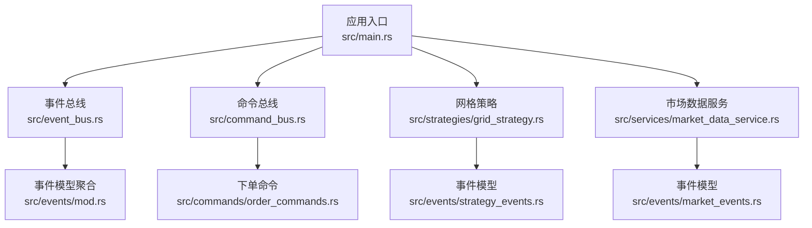
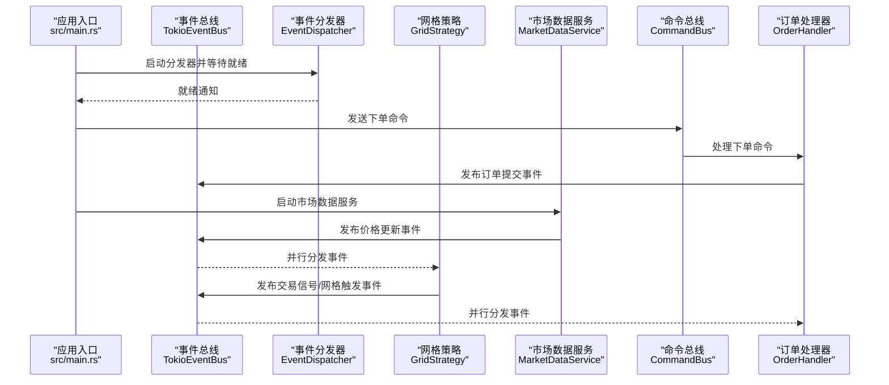
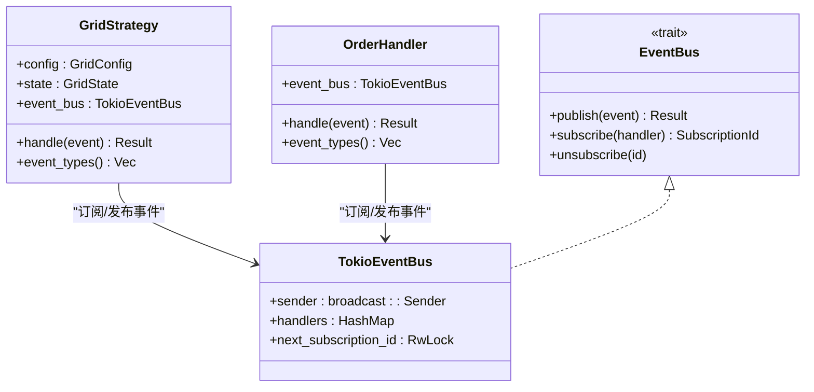
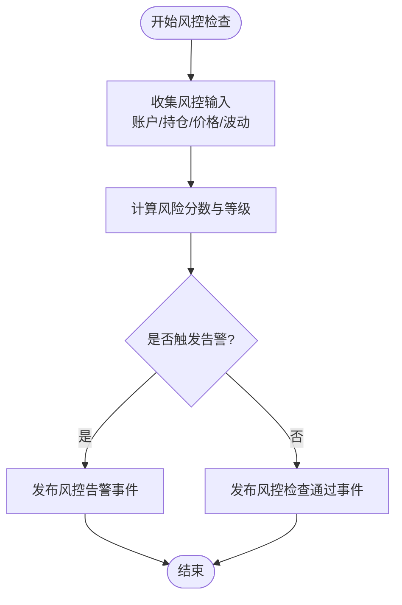
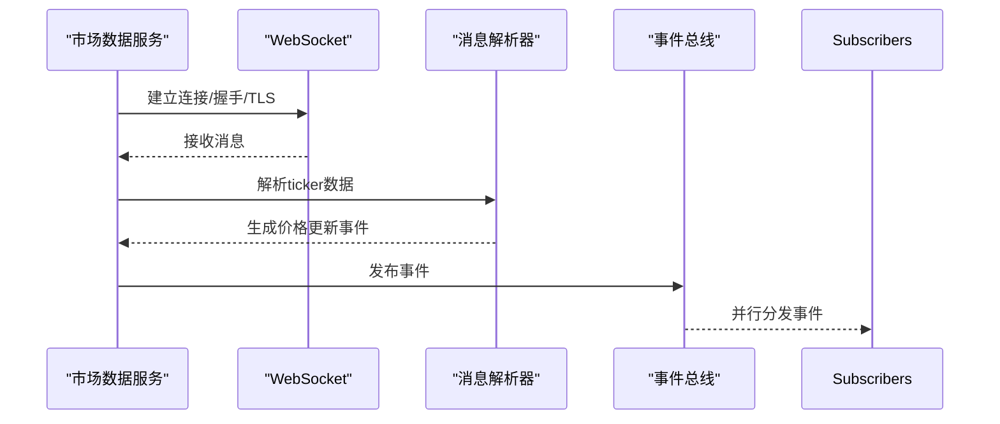
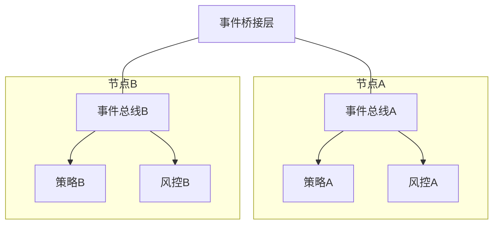
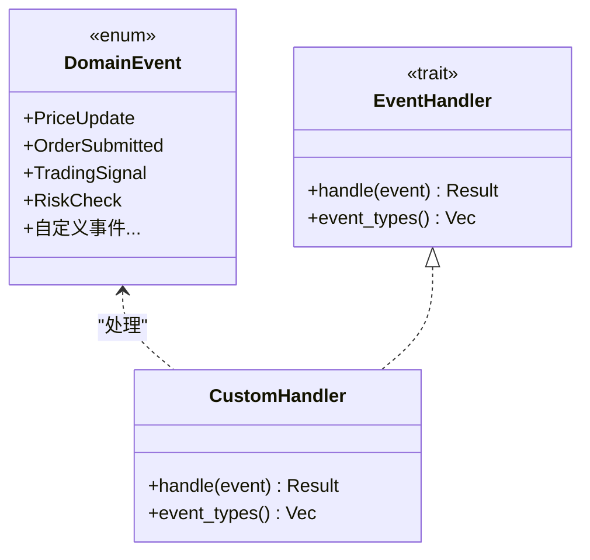
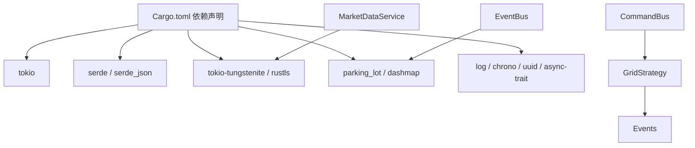

# 高级功能示例

<cite>
**本文引用的文件**
- [src/lib.rs](file://src/lib.rs)
- [src/main.rs](file://src/main.rs)
- [src/event_bus.rs](file://src/event_bus.rs)
- [src/command_bus.rs](file://src/command_bus.rs)
- [src/events/mod.rs](file://src/events/mod.rs)
- [src/events/market_events.rs](file://src/events/market_events.rs)
- [src/events/trading_events.rs](file://src/events/trading_events.rs)
- [src/events/account_events.rs](file://src/events/account_events.rs)
- [src/events/risk_events.rs](file://src/events/risk_events.rs)
- [src/events/strategy_events.rs](file://src/events/strategy_events.rs)
- [src/strategies/grid_strategy.rs](file://src/strategies/grid_strategy.rs)
- [src/services/market_data_service.rs](file://src/services/market_data_service.rs)
- [src/commands/order_commands.rs](file://src/commands/order_commands.rs)
- [src/handlers/order_handler.rs](file://src/handlers/order_handler.rs)
- [Cargo.toml](file://Cargo.toml)
</cite>

## 目录
1. [简介](#简介)
2. [项目结构](#项目结构)
3. [核心组件](#核心组件)
4. [架构总览](#架构总览)
5. [详细组件分析](#详细组件分析)
6. [依赖关系分析](#依赖关系分析)
7. [性能考量](#性能考量)
8. [故障排查指南](#故障排查指南)
9. [结论](#结论)
10. [附录](#附录)

## 简介
本文件面向希望在Binance Rust事件驱动交易系统中实现高级功能的开发者，围绕以下目标提供系统化示例与最佳实践：
- 多策略组合：在同一事件总线上并行运行多个不同策略，协调策略间的交互与事件传播。
- 复杂风控体系：实现动态风控检查、止损止盈机制与仓位管理，覆盖风险事件的产生与告警。
- 高性能数据处理：优化市场数据吞吐、批量事件处理、内存与并发控制，支撑高频场景。
- 分布式部署：在多节点部署交易系统，实现事件分发的分布式架构思路与落地要点。
- 自定义事件处理器：扩展系统能力，新增事件类型与处理器，满足业务定制需求。

## 项目结构
该仓库采用按职责分层的模块化组织方式，核心目录与职责如下：
- src/lib.rs：模块导出入口，统一对外暴露事件、总线、命令、处理器、服务与策略。
- src/main.rs：应用入口，演示事件总线、命令总线、网格策略与市场数据服务的集成运行。
- src/event_bus.rs：事件总线与分发器实现，支持广播通道、并行分发与订阅管理。
- src/command_bus.rs：命令总线，将命令路由至对应处理器（当前为下单命令）。
- src/events/*：事件模型与聚合，涵盖市场、交易、账户、策略、风控五大类事件。
- src/strategies/grid_strategy.rs：网格策略示例，监听价格事件并生成交易信号与网格触发事件。
- src/services/market_data_service.rs：市场数据服务，封装Binance WebSocket连接、代理/直连、心跳与消息解析。
- src/commands/order_commands.rs：下单命令模型与构造方法。
- src/handlers/order_handler.rs：订单事件处理器，负责处理订单生命周期事件。

**图表来源**
- [src/main.rs:10-93](file://src/main.rs#L10-L93)
- [src/event_bus.rs:61-110](file://src/event_bus.rs#L61-L110)
- [src/command_bus.rs:5-19](file://src/command_bus.rs#L5-L19)
- [src/strategies/grid_strategy.rs:156-278](file://src/strategies/grid_strategy.rs#L156-L278)
- [src/services/market_data_service.rs:34-94](file://src/services/market_data_service.rs#L34-L94)
- [src/events/mod.rs:48-89](file://src/events/mod.rs#L48-L89)

**章节来源**
- [src/lib.rs:1-9](file://src/lib.rs#L1-L9)
- [src/main.rs:10-93](file://src/main.rs#L10-L93)
- [Cargo.toml:1-27](file://Cargo.toml#L1-L27)

## 核心组件
- 事件总线与分发器
  - 使用广播通道实现事件发布/订阅，分发器并发调用所有订阅处理器，错误独立处理。
  - 支持订阅ID管理与动态取消订阅。
- 事件模型
  - 统一的DomainEvent枚举，涵盖市场、交易、账户、策略、风控事件，便于跨策略与风控模块协作。
- 命令总线
  - 将命令映射到具体处理器，当前支持下单命令，未来可扩展更多命令类型。
- 策略与处理器
  - 网格策略监听价格事件，生成交易信号与网格触发事件；订单处理器处理订单生命周期事件。

**章节来源**
- [src/event_bus.rs:18-110](file://src/event_bus.rs#L18-L110)
- [src/events/mod.rs:48-89](file://src/events/mod.rs#L48-L89)
- [src/command_bus.rs:5-19](file://src/command_bus.rs#L5-L19)
- [src/strategies/grid_strategy.rs:156-278](file://src/strategies/grid_strategy.rs#L156-L278)
- [src/handlers/order_handler.rs:68-91](file://src/handlers/order_handler.rs#L68-L91)

## 架构总览
系统采用事件驱动架构，事件在总线上广播，多个处理器并行消费；命令通过命令总线进入系统，最终转化为领域事件以供订阅者处理。

**图表来源**
- [src/main.rs:14-60](file://src/main.rs#L14-L60)
- [src/event_bus.rs:112-158](file://src/event_bus.rs#L112-L158)
- [src/command_bus.rs:14-18](file://src/command_bus.rs#L14-L18)
- [src/handlers/order_handler.rs:102-135](file://src/handlers/order_handler.rs#L102-L135)
- [src/services/market_data_service.rs:303-374](file://src/services/market_data_service.rs#L303-L374)
- [src/strategies/grid_strategy.rs:189-252](file://src/strategies/grid_strategy.rs#L189-L252)

## 详细组件分析

### 多策略组合示例
目标：在同一事件总线上注册多个策略，协同工作并避免相互干扰。
- 设计要点
  - 每个策略实现EventHandler接口，声明感兴趣事件类型（如价格更新、网格触发等）。
  - 策略内部维护自身状态（如网格策略的状态机），通过互斥锁保护共享状态。
  - 事件总线并行分发，各策略独立处理，互不影响。
- 实施步骤
  - 在应用入口创建事件总线与分发器。
  - 注册多个策略实例（例如网格策略、均线策略、波动率策略等），每个策略订阅其关心的事件。
  - 通过事件总线的订阅/取消订阅API管理策略生命周期。
- 注意事项
  - 策略间尽量避免共享可变状态，必要时使用Arc<Mutex<...>>。
  - 控制事件类型粒度，避免过度订阅导致处理开销增大。

**图表来源**
- [src/strategies/grid_strategy.rs:156-278](file://src/strategies/grid_strategy.rs#L156-L278)
- [src/handlers/order_handler.rs:68-91](file://src/handlers/order_handler.rs#L68-L91)
- [src/event_bus.rs:18-110](file://src/event_bus.rs#L18-L110)

**章节来源**
- [src/strategies/grid_strategy.rs:156-278](file://src/strategies/grid_strategy.rs#L156-L278)
- [src/handlers/order_handler.rs:68-91](file://src/handlers/order_handler.rs#L68-L91)
- [src/event_bus.rs:18-110](file://src/event_bus.rs#L18-L110)

### 复杂风险控制系统示例
目标：实现动态风控检查、止损止盈机制与仓位管理，覆盖风险事件的产生与告警。
- 风控事件模型
  - 风控检查事件：包含检查类型、结果、风险等级与分数。
  - 风控告警事件：包含告警级别、类型、消息、触发规则与建议操作。
- 实现路径
  - 在策略或账户处理器中触发风控检查事件，评估资金充足性、持仓限额、止损与市场波动等。
  - 根据检查结果发布风控告警事件，通知上层风控模块或阻断交易。
  - 结合账户事件（如余额与持仓变化）进行动态风控。
- 与现有模块的衔接
  - 风控事件定义位于风控事件模块，可与策略事件、交易事件共同在事件总线上流转。
  - 风控处理器可订阅相关事件，形成闭环。

**图表来源**
- [src/events/risk_events.rs:7-72](file://src/events/risk_events.rs#L7-L72)
- [src/events/risk_events.rs:74-101](file://src/events/risk_events.rs#L74-L101)

**章节来源**
- [src/events/risk_events.rs:7-138](file://src/events/risk_events.rs#L7-L138)

### 高性能数据处理示例
目标：优化市场数据处理性能、批量处理大量事件、内存与并发控制。
- WebSocket连接与代理
  - 支持自动/直连/代理三种连接模式，结合环境变量灵活部署。
  - 通过TLS握手与HTTP CONNECT隧道实现安全连接。
- 消息解析与事件发布
  - 解析组合流与单流格式，提取ticker数据并发布价格更新事件。
  - 心跳检测与Ping/Pong维持长连接稳定。
- 并发与背压
  - 事件总线使用广播通道，分发器并行调用所有处理器。
  - 建议根据处理器数量与负载调整事件总线容量，避免丢弃事件。
- 内存与序列化
  - 使用Serde进行高效序列化，减少CPU与内存占用。
  - 对于高频事件，考虑事件压缩或批处理策略（需在应用层实现）。

**图表来源**
- [src/services/market_data_service.rs:116-178](file://src/services/market_data_service.rs#L116-L178)
- [src/services/market_data_service.rs:376-407](file://src/services/market_data_service.rs#L376-L407)
- [src/event_bus.rs:128-157](file://src/event_bus.rs#L128-L157)

**章节来源**
- [src/services/market_data_service.rs:23-94](file://src/services/market_data_service.rs#L23-L94)
- [src/services/market_data_service.rs:116-178](file://src/services/market_data_service.rs#L116-L178)
- [src/services/market_data_service.rs:303-374](file://src/services/market_data_service.rs#L303-L374)
- [src/event_bus.rs:128-157](file://src/event_bus.rs#L128-L157)

### 分布式部署示例
目标：在多节点部署交易系统，实现事件分发的分布式架构。
- 架构思路
  - 事件总线：单节点内使用本地广播通道；跨节点可通过外部消息中间件（如Kafka/RabbitMQ）实现事件桥接。
  - 策略与处理器：每个节点运行独立的策略实例，订阅本地事件总线；通过桥接层转发关键事件。
  - 数据源：多节点可并行连接Binance，或集中化接入以降低带宽与合规成本。
- 落地要点
  - 事件去重与因果链：为事件引入correlation_id/causation_id，保证跨节点一致性。
  - 故障恢复：分发器与处理器具备重试与死信队列能力。
  - 负载均衡：按交易对或策略类型分片，避免热点事件造成瓶颈。

[本图为概念性架构图，无需图表来源]

### 自定义事件处理器示例
目标：扩展系统功能，新增事件类型与处理器。
- 新增事件类型
  - 在事件模块中定义新事件结构体，并将其纳入DomainEvent枚举。
  - 为事件补充元数据与序列化支持。
- 新增处理器
  - 实现EventHandler接口，定义event_types过滤条件。
  - 在handle方法中编写事件处理逻辑，必要时发布新的领域事件。
- 集成与测试
  - 在应用入口注册处理器，确保事件总线正确分发。
  - 编写单元测试验证事件序列化与处理器行为。

**图表来源**
- [src/events/mod.rs:48-89](file://src/events/mod.rs#L48-L89)
- [src/event_bus.rs:31-39](file://src/event_bus.rs#L31-L39)

**章节来源**
- [src/events/mod.rs:48-89](file://src/events/mod.rs#L48-L89)
- [src/event_bus.rs:31-39](file://src/event_bus.rs#L31-L39)

## 依赖关系分析
- 运行时依赖
  - 异步运行时：Tokio（全功能特性）。
  - 网络与TLS：tokio-tungstenite、tokio-rustls、rustls、webpki-roots。
  - 序列化：serde、serde_json。
  - 并发工具：parking_lot、dashmap。
- 模块耦合
  - 事件总线与事件模型低耦合，通过枚举与Trait解耦。
  - 策略与处理器通过事件总线松耦合，便于扩展与替换。
  - 命令总线与处理器通过命令枚举解耦，易于扩展命令类型。

**图表来源**
- [Cargo.toml:6-25](file://Cargo.toml#L6-L25)

**章节来源**
- [Cargo.toml:6-25](file://Cargo.toml#L6-L25)

## 性能考量
- 事件总线容量与背压
  - 根据峰值事件速率设置广播通道容量，避免丢失事件；在高负载时考虑持久化桥接。
- 并行分发与错误隔离
  - 分发器并行调用所有处理器，单个处理器错误不应影响其他处理器。
- 序列化与内存
  - 使用Serde进行零拷贝序列化，减少CPU与内存占用；对高频事件可考虑压缩或批处理。
- 网络与连接
  - 合理设置重连间隔与超时，启用心跳维持长连接稳定；在代理/直连之间按环境选择最优路径。
- 策略状态管理
  - 使用轻量级状态结构，避免频繁深拷贝；必要时采用不可变数据结构与Copy语义。

[本节为通用性能指导，无需章节来源]

## 故障排查指南
- WebSocket连接问题
  - 检查连接模式与代理配置，确认环境变量设置正确；查看握手与TLS错误日志。
- 事件未到达处理器
  - 确认处理器已订阅相应事件类型；检查事件总线容量与分发器是否正常运行。
- 命令执行失败
  - 校验命令参数（如数量必须大于0）；检查事件发布是否成功。
- 风控告警频繁
  - 检查风控阈值与评分逻辑；核对账户与持仓数据是否及时更新。

**章节来源**
- [src/services/market_data_service.rs:116-178](file://src/services/market_data_service.rs#L116-L178)
- [src/handlers/order_handler.rs:102-135](file://src/handlers/order_handler.rs#L102-L135)
- [src/event_bus.rs:128-157](file://src/event_bus.rs#L128-L157)

## 结论
本示例文档展示了在Binance Rust事件驱动交易系统中实现多策略组合、复杂风控、高性能数据处理、分布式部署与自定义事件处理器的关键路径。通过事件总线与命令总线的清晰边界、事件模型的统一抽象以及策略与处理器的松耦合设计，系统具备良好的可扩展性与可维护性。建议在生产环境中进一步完善桥接层、监控与可观测性，并针对业务场景细化风控规则与策略组合策略。

[本节为总结性内容，无需章节来源]

## 附录
- 事件类型速览
  - 市场数据：价格更新、K线完成、订单簿更新。
  - 交易：订单提交、成交、取消、拒绝。
  - 账户：余额更新、持仓变动。
  - 策略：交易信号、网格触发、网格状态变更。
  - 风控：风控检查、风控告警。
- 命令类型速览
  - 下单命令：支持限价/市价/止损/止盈，支持客户端订单ID。

**章节来源**
- [src/events/mod.rs:48-89](file://src/events/mod.rs#L48-L89)
- [src/commands/order_commands.rs:36-72](file://src/commands/order_commands.rs#L36-L72)