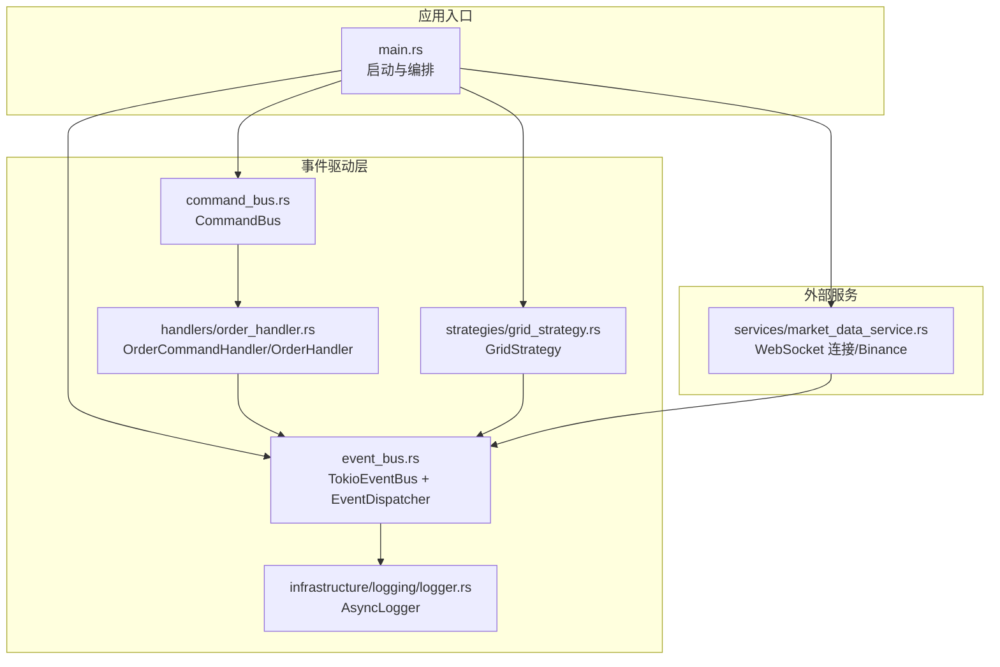
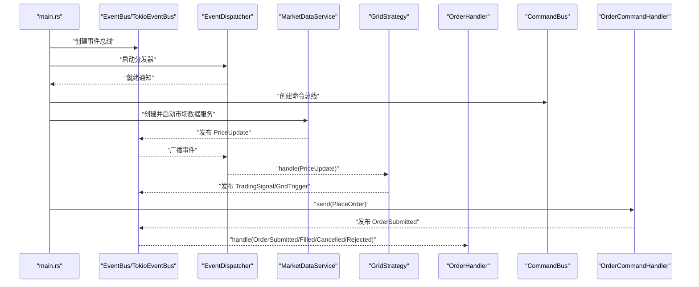
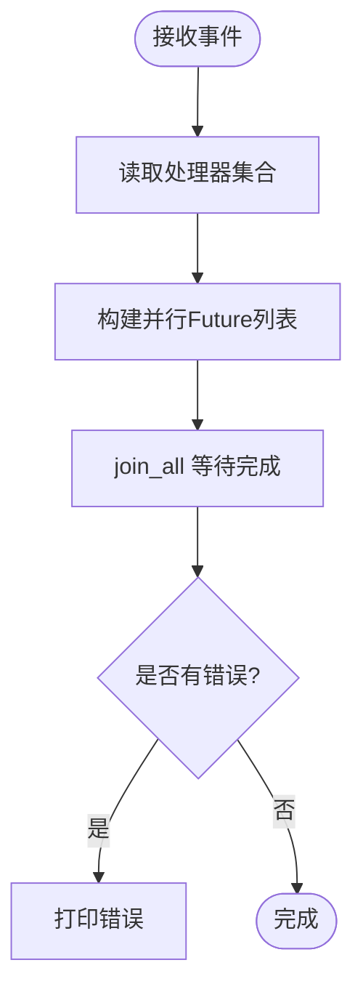
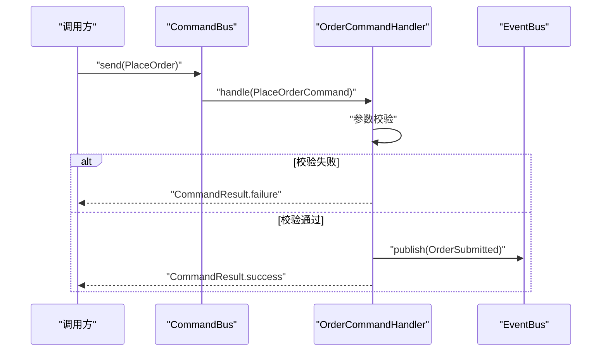
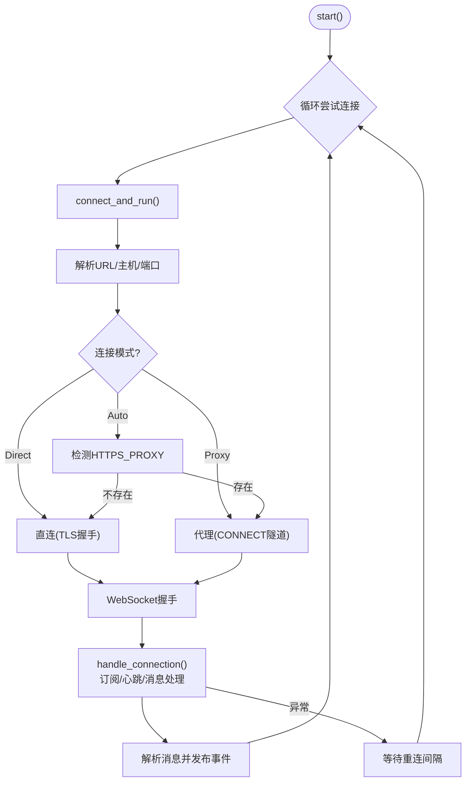
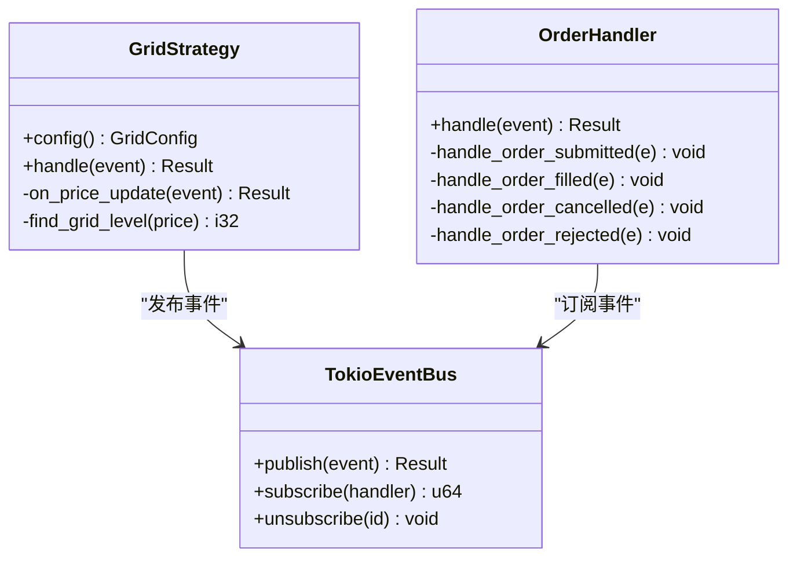
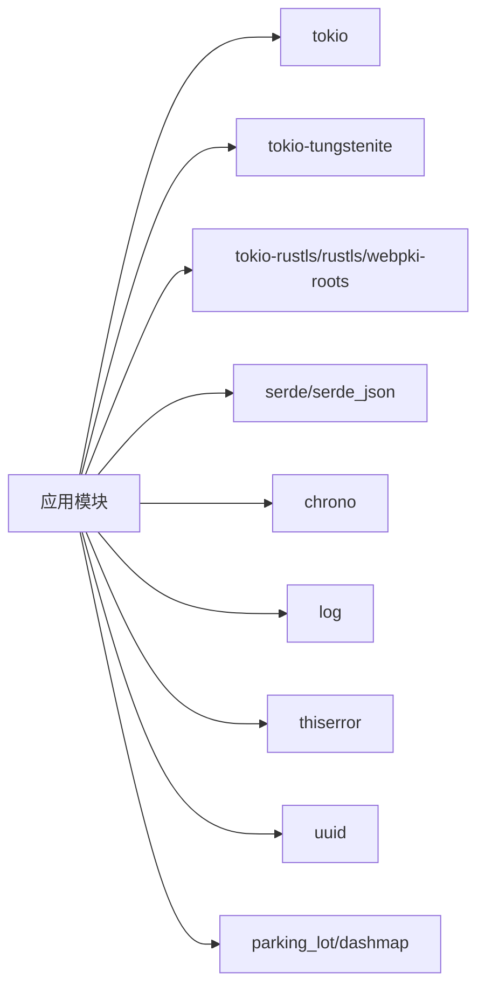

# 故障排除

<cite>
**本文引用的文件**   
- [src/main.rs](file://src/main.rs)
- [src/lib.rs](file://src/lib.rs)
- [src/error.rs](file://src/error.rs)
- [src/command_bus.rs](file://src/command_bus.rs)
- [src/event_bus.rs](file://src/event_bus.rs)
- [src/infrastructure/logging/logger.rs](file://src/infrastructure/logging/logger.rs)
- [src/handlers/order_handler.rs](file://src/handlers/order_handler.rs)
- [src/services/market_data_service.rs](file://src/services/market_data_service.rs)
- [src/strategies/grid_strategy.rs](file://src/strategies/grid_strategy.rs)
- [src/events/mod.rs](file://src/events/mod.rs)
- [Cargo.toml](file://Cargo.toml)
- [docs/CODE_EXPLANATION.md](file://docs/CODE_EXPLANATION.md)
- [docs/EVENT_DRIVEN_REFACTOR_GUIDE.md](file://docs/EVENT_DRIVEN_REFACTOR_GUIDE.md)
</cite>

## 目录
1. [简介](#简介)
2. [项目结构](#项目结构)
3. [核心组件](#核心组件)
4. [架构总览](#架构总览)
5. [详细组件分析](#详细组件分析)
6. [依赖关系分析](#依赖关系分析)
7. [性能考量](#性能考量)
8. [故障排除指南](#故障排除指南)
9. [结论](#结论)
10. [附录](#附录)

## 简介
本文件面向运维与开发工程师，提供系统运行期的故障排除与问题诊断指南。内容覆盖 WebSocket 连接中断、事件处理异常、内存泄漏与性能瓶颈的排查流程；错误日志的分析方法与根因技巧；网络连接问题（代理、防火墙、DNS）的定位与修复；事件总线与命令总线异常（消息积压、处理器崩溃、死锁）的诊断与修复；以及系统恢复与重启的最佳实践与应急响应策略。

## 项目结构
该系统采用事件驱动架构，核心模块包括：
- 事件总线与分发器：负责事件发布、订阅与并行分发
- 命令总线：接收命令并路由至处理器
- 市场数据服务：通过 WebSocket 订阅实时行情并发布事件
- 策略引擎：订阅价格事件，生成交易信号并发布事件
- 订单处理器：处理订单生命周期事件
- 日志基础设施：异步日志、轮转与格式化

**图表来源**
- [src/main.rs:11-93](file://src/main.rs#L11-L93)
- [src/event_bus.rs:62-158](file://src/event_bus.rs#L62-L158)
- [src/command_bus.rs:5-19](file://src/command_bus.rs#L5-L19)
- [src/handlers/order_handler.rs:93-137](file://src/handlers/order_handler.rs#L93-L137)
- [src/strategies/grid_strategy.rs:156-278](file://src/strategies/grid_strategy.rs#L156-L278)
- [src/services/market_data_service.rs:35-114](file://src/services/market_data_service.rs#L35-L114)
- [src/infrastructure/logging/logger.rs:140-291](file://src/infrastructure/logging/logger.rs#L140-L291)

**章节来源**
- [src/lib.rs:1-9](file://src/lib.rs#L1-L9)
- [src/main.rs:11-93](file://src/main.rs#L11-L93)
- [docs/CODE_EXPLANATION.md:75-122](file://docs/CODE_EXPLANATION.md#L75-L122)

## 核心组件
- 事件总线与分发器
  - 基于广播通道，支持多订阅者并行处理
  - 分发器独立任务，负责从通道接收事件并并发调用处理器
- 命令总线
  - 接收命令，路由到对应处理器（当前实现处理下单命令）
- 市场数据服务
  - WebSocket 连接、代理支持、TLS 握手、心跳保活、消息解析与事件发布
- 策略与处理器
  - 网格策略：监听价格事件，生成交易信号并发布
  - 订单处理器：处理订单生命周期事件并记录日志
- 日志系统
  - 异步写入、线程内轮转、文本/JSON 格式、缓冲与刷新策略

**章节来源**
- [src/event_bus.rs:18-110](file://src/event_bus.rs#L18-L110)
- [src/event_bus.rs:112-158](file://src/event_bus.rs#L112-L158)
- [src/command_bus.rs:5-19](file://src/command_bus.rs#L5-L19)
- [src/services/market_data_service.rs:35-114](file://src/services/market_data_service.rs#L35-L114)
- [src/strategies/grid_strategy.rs:156-278](file://src/strategies/grid_strategy.rs#L156-L278)
- [src/handlers/order_handler.rs:93-137](file://src/handlers/order_handler.rs#L93-L137)
- [src/infrastructure/logging/logger.rs:140-291](file://src/infrastructure/logging/logger.rs#L140-L291)

## 架构总览
系统通过事件总线实现模块解耦：市场数据服务产生价格事件，策略与处理器订阅感兴趣事件并做出反应；命令总线接收命令，驱动领域行为并发布相应事件。

**图表来源**
- [src/main.rs:14-60](file://src/main.rs#L14-L60)
- [src/event_bus.rs:129-157](file://src/event_bus.rs#L129-L157)
- [src/services/market_data_service.rs:304-374](file://src/services/market_data_service.rs#L304-L374)
- [src/strategies/grid_strategy.rs:265-278](file://src/strategies/grid_strategy.rs#L265-L278)
- [src/handlers/order_handler.rs:69-91](file://src/handlers/order_handler.rs#L69-L91)
- [src/command_bus.rs:14-18](file://src/command_bus.rs#L14-L18)

## 详细组件分析

### 事件总线与分发器
- 并发处理：分发器收集所有处理器句柄，使用 join_all 并发调用，提升吞吐
- 错误隔离：单个处理器失败不影响其他处理器，错误通过标准错误输出
- 容量与背压：广播通道具备容量限制，过载时自动丢弃旧事件
- 订阅管理：动态订阅/取消订阅，支持多处理器并行处理

**图表来源**
- [src/event_bus.rs:137-156](file://src/event_bus.rs#L137-L156)

**章节来源**
- [src/event_bus.rs:62-110](file://src/event_bus.rs#L62-L110)
- [src/event_bus.rs:112-158](file://src/event_bus.rs#L112-L158)

### 命令总线与处理器
- 命令路由：根据命令类型分派到对应处理器（当前实现处理下单命令）
- 参数校验：在处理前进行参数校验，失败时返回失败结果
- 事件发布：命令成功后发布相应领域事件，驱动后续处理

**图表来源**
- [src/command_bus.rs:14-18](file://src/command_bus.rs#L14-L18)
- [src/handlers/order_handler.rs:103-135](file://src/handlers/order_handler.rs#L103-L135)

**章节来源**
- [src/command_bus.rs:5-19](file://src/command_bus.rs#L5-L19)
- [src/handlers/order_handler.rs:93-137](file://src/handlers/order_handler.rs#L93-L137)

### 市场数据服务（WebSocket）
- 连接模式：支持 Auto/Direct/Proxy，自动检测环境变量或强制直连/代理
- 代理隧道：HTTP CONNECT 隧道，TLS 在隧道之上
- 心跳保活：定时 Ping/Pong，维持连接活跃
- 消息解析：解析 ticker 数据，发布价格事件
- 自动重连：异常断开后按间隔重连

**图表来源**
- [src/services/market_data_service.rs:96-114](file://src/services/market_data_service.rs#L96-L114)
- [src/services/market_data_service.rs:117-178](file://src/services/market_data_service.rs#L117-L178)
- [src/services/market_data_service.rs:304-374](file://src/services/market_data_service.rs#L304-L374)

**章节来源**
- [src/services/market_data_service.rs:23-82](file://src/services/market_data_service.rs#L23-L82)
- [src/services/market_data_service.rs:117-178](file://src/services/market_data_service.rs#L117-L178)
- [src/services/market_data_service.rs:304-374](file://src/services/market_data_service.rs#L304-L374)

### 策略与处理器
- 网格策略：根据价格穿越网格线生成交易信号，发布 GridTrigger 与 TradingSignal
- 订单处理器：处理订单生命周期事件，记录日志并预留后续处理

**图表来源**
- [src/strategies/grid_strategy.rs:156-278](file://src/strategies/grid_strategy.rs#L156-L278)
- [src/handlers/order_handler.rs:69-91](file://src/handlers/order_handler.rs#L69-L91)
- [src/event_bus.rs:62-110](file://src/event_bus.rs#L62-L110)

**章节来源**
- [src/strategies/grid_strategy.rs:156-278](file://src/strategies/grid_strategy.rs#L156-L278)
- [src/handlers/order_handler.rs:16-91](file://src/handlers/order_handler.rs#L16-L91)

### 日志系统
- 异步写入：日志通过通道发送到专用线程，避免阻塞主逻辑
- 轮转策略：按大小轮转，保留多份历史文件
- 格式化：支持文本与 JSON 两种格式，便于机器解析与人类阅读
- 缓冲与刷新：每次写入后立即刷新，保证可观测性

**章节来源**
- [src/infrastructure/logging/logger.rs:140-291](file://src/infrastructure/logging/logger.rs#L140-L291)

## 依赖关系分析
- 运行时与网络
  - tokio、tokio-tungstenite、tokio-rustls、rustls、webpki-roots
- 序列化与时间
  - serde、serde_json、chrono
- 日志与并发
  - log、parking_lot、dashmap
- 错误与类型
  - thiserror、uuid

**图表来源**
- [Cargo.toml:6-25](file://Cargo.toml#L6-L25)

**章节来源**
- [Cargo.toml:6-25](file://Cargo.toml#L6-L25)

## 性能考量
- 事件总线
  - 广播通道容量影响背压与延迟，建议结合负载压测调整容量
  - 并发分发提升吞吐，但需关注处理器内部锁竞争
- WebSocket
  - 心跳间隔与连接超时需平衡保活与资源占用
  - 代理隧道增加一层 TCP/TLS，注意端到端加密与中间设备超时
- 日志
  - 异步写入降低主线程阻塞，但磁盘写入与轮转仍可能成为瓶颈
- 命令与事件处理
  - 参数校验前置，避免无效事件传播
  - 处理器内部避免长时间阻塞操作，必要时拆分为子任务

[本节为通用指导，不直接分析具体文件]

## 故障排除指南

### 一、WebSocket 连接中断
- 现象
  - 连接频繁断开、服务日志出现握手/连接超时、Ping/Pong 丢失
- 诊断步骤
  - 检查连接模式与代理配置：确认是否使用代理、代理地址与端口正确
  - 查看 TLS 握手与主机名验证：确认目标主机名与证书链有效
  - 观察心跳：确认 Ping/Pong 是否正常往返
  - 监控自动重连：确认重连间隔与失败次数
- 修复建议
  - 直连优先：生产环境建议 Direct 模式，减少中间环节
  - 代理隧道：若必须使用代理，确保 CONNECT 成功且隧道上 TLS 正常
  - 超时与重连：适当增大连接超时与心跳间隔，避免中间设备超时
  - DNS 与防火墙：确认可达性与端口开放

**章节来源**
- [src/services/market_data_service.rs:23-82](file://src/services/market_data_service.rs#L23-L82)
- [src/services/market_data_service.rs:117-178](file://src/services/market_data_service.rs#L117-L178)
- [src/services/market_data_service.rs:304-374](file://src/services/market_data_service.rs#L304-L374)

### 二、事件处理异常
- 现象
  - 事件处理失败打印到标准错误；部分事件未被消费；吞吐下降
- 诊断步骤
  - 检查分发器日志：确认是否存在处理器失败并被隔离
  - 核查处理器事件类型过滤：避免不必要的处理
  - 观察广播通道容量：确认是否存在积压或丢弃
- 修复建议
  - 为处理器增加幂等与重试策略
  - 对耗时操作异步化，避免阻塞分发器
  - 调整事件总线容量与处理器数量，平衡吞吐与延迟

**章节来源**
- [src/event_bus.rs:129-157](file://src/event_bus.rs#L129-L157)
- [src/event_bus.rs:162-181](file://src/event_bus.rs#L162-L181)

### 三、内存泄漏与内存增长
- 现象
  - RSS 持续增长、GC/回收不生效、长时间运行后 OOM
- 诊断步骤
  - 使用系统工具（如 top、htop、valgrind、massif）观察内存曲线
  - 检查事件总线与处理器是否持有长期引用（例如缓存未清理）
  - 核查日志轮转与文件句柄是否正确关闭
- 修复建议
  - 清理缓存与状态，设置最大长度与过期策略
  - 确保日志线程与文件句柄在 Drop 中正确释放
  - 限制广播通道容量，避免事件堆积

**章节来源**
- [src/infrastructure/logging/logger.rs:293-303](file://src/infrastructure/logging/logger.rs#L293-L303)

### 四、性能瓶颈
- 现象
  - 延迟升高、事件积压、CPU 使用率异常
- 诊断步骤
  - 使用性能分析工具（perf、flamegraph）定位热点
  - 检查事件总线并发度与处理器内部锁竞争
  - 观察网络 I/O 与 TLS 握手耗时
- 修复建议
  - 增加处理器并行度，拆分处理器职责
  - 优化序列化与反序列化，减少拷贝
  - 调整心跳与重连策略，降低网络抖动影响

[本节为通用指导，不直接分析具体文件]

### 五、网络连接问题（代理/防火墙/DNS）
- 现象
  - 连接超时、握手失败、代理 CONNECT 失败
- 诊断步骤
  - 确认环境变量 HTTPS_PROXY/https_proxy 是否正确
  - 使用 telnet/curl 验证代理可达性与端口
  - 检查防火墙策略与出站规则
  - 验证 DNS 解析与证书主机名匹配
- 修复建议
  - 生产环境使用 Direct 模式，避免代理链路
  - 若必须使用代理，确保 CONNECT 成功与 TLS 验证通过
  - 配置正确的 DNS 与证书信任链

**章节来源**
- [src/services/market_data_service.rs:137-178](file://src/services/market_data_service.rs#L137-L178)

### 六、事件总线与命令总线异常
- 现象
  - 命令执行失败、事件未发布、处理器崩溃、消息积压
- 诊断步骤
  - 检查命令总线路由与处理器注册
  - 核查事件总线发布/订阅状态与容量
  - 观察错误类型：发布失败、订阅失败、处理失败、通道关闭
- 修复建议
  - 为处理器增加错误隔离与降级策略
  - 为命令增加校验与回滚机制
  - 调整总线容量与处理器并发度

**章节来源**
- [src/error.rs:85-112](file://src/error.rs#L85-L112)
- [src/command_bus.rs:14-18](file://src/command_bus.rs#L14-L18)
- [src/event_bus.rs:89-110](file://src/event_bus.rs#L89-L110)

### 七、系统恢复与重启最佳实践
- 优雅关闭
  - 等待事件处理队列清空，关闭 WebSocket 连接与日志线程
- 状态保存
  - 事件溯源与快照：定期持久化事件与状态，便于恢复
- 数据一致性
  - 命令幂等与事件去重，避免重复处理
- 重启策略
  - 先停后启：停止市场数据服务与事件分发器，再重启各组件
  - 顺序启动：先事件总线与分发器，再策略与处理器，最后服务

**章节来源**
- [src/services/market_data_service.rs:372-374](file://src/services/market_data_service.rs#L372-L374)
- [src/infrastructure/logging/logger.rs:293-303](file://src/infrastructure/logging/logger.rs#L293-L303)

### 八、应急响应流程
- 立即行动
  - 评估影响范围与严重程度
  - 临时降级：禁用高风险策略或暂停新命令
- 诊断与修复
  - 快速定位：日志、指标、网络连通性
  - 修复：修正配置、重启服务、扩容资源
- 复盘与改进
  - 记录根因与修复过程，完善监控与告警

[本节为通用指导，不直接分析具体文件]

## 结论
通过事件驱动架构，系统实现了模块解耦与高吞吐事件处理。故障排除的关键在于：明确事件流向、利用日志与指标定位问题、区分网络/总线/处理器层面的异常，并采取针对性的修复与优化措施。生产环境建议采用直连模式、合理配置总线容量与心跳、完善日志轮转与监控告警，以保障稳定性与可观测性。

[本节为总结性内容，不直接分析具体文件]

## 附录

### A. 错误类型与日志分析要点
- 错误类型
  - 基础设施错误：配置、IO、日志、数据库
  - 事件总线错误：发布失败、订阅失败、处理失败、通道关闭
  - 命令总线错误：执行失败、处理器未找到、验证失败
  - 服务错误：订单、账户、风控、市场数据
- 日志分析
  - 识别错误类别与上下文，查看错误堆栈与源位置
  - 关注事件总线与 WebSocket 的关键节点（发布、订阅、握手、心跳）
  - 结合日志轮转与文件句柄状态判断资源泄露

**章节来源**
- [src/error.rs:12-128](file://src/error.rs#L12-L128)
- [src/infrastructure/logging/logger.rs:140-291](file://src/infrastructure/logging/logger.rs#L140-L291)

### B. 常见问题与快速定位清单
- WebSocket
  - 代理/直连配置是否正确
  - 证书主机名与 DNS 是否匹配
  - 心跳是否正常，连接是否被中间设备断开
- 事件总线
  - 处理器是否注册成功
  - 广播通道容量是否足够
  - 处理器内部是否存在阻塞或死锁
- 命令总线
  - 命令参数是否通过校验
  - 对应处理器是否存在
- 日志
  - 异步线程是否正常退出
  - 轮转是否成功，文件句柄是否泄漏

**章节来源**
- [src/services/market_data_service.rs:117-178](file://src/services/market_data_service.rs#L117-L178)
- [src/event_bus.rs:129-157](file://src/event_bus.rs#L129-L157)
- [src/command_bus.rs:14-18](file://src/command_bus.rs#L14-L18)
- [src/infrastructure/logging/logger.rs:293-303](file://src/infrastructure/logging/logger.rs#L293-L303)