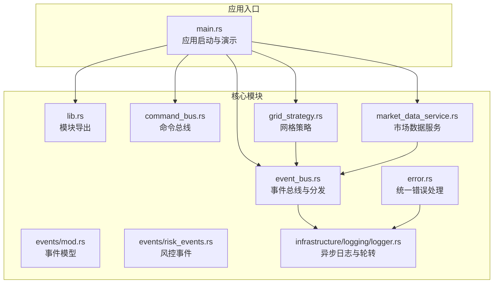
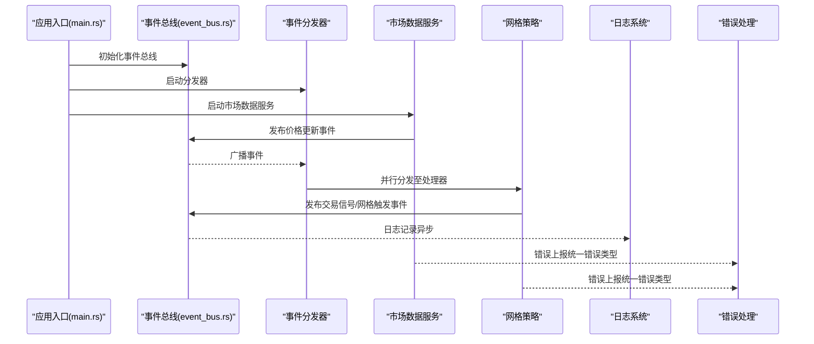
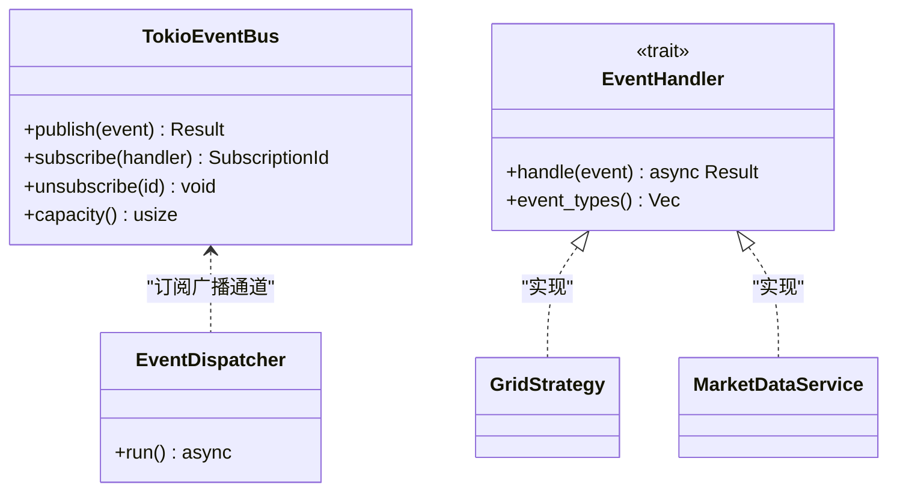
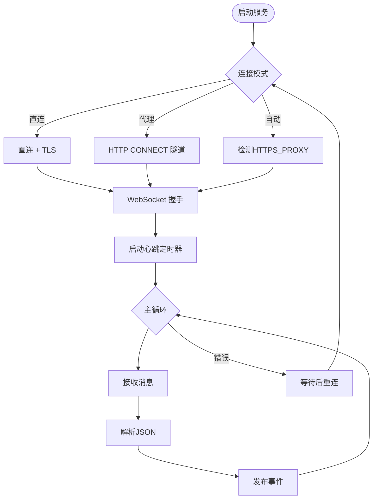
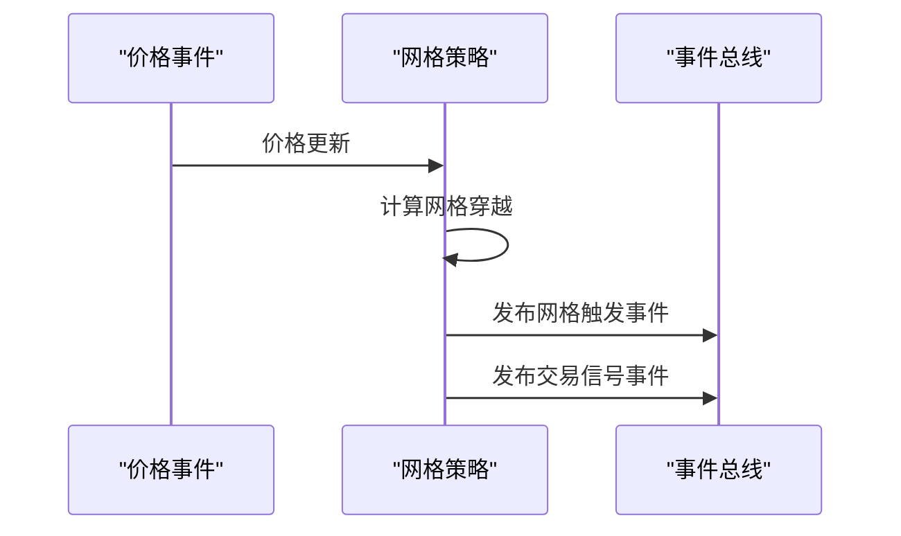
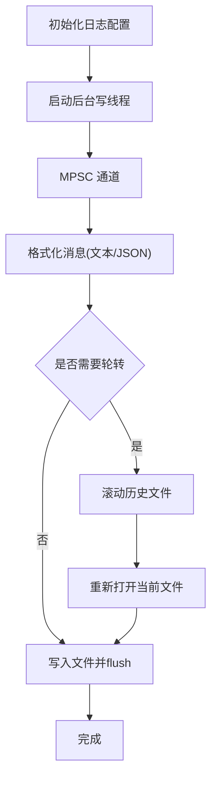
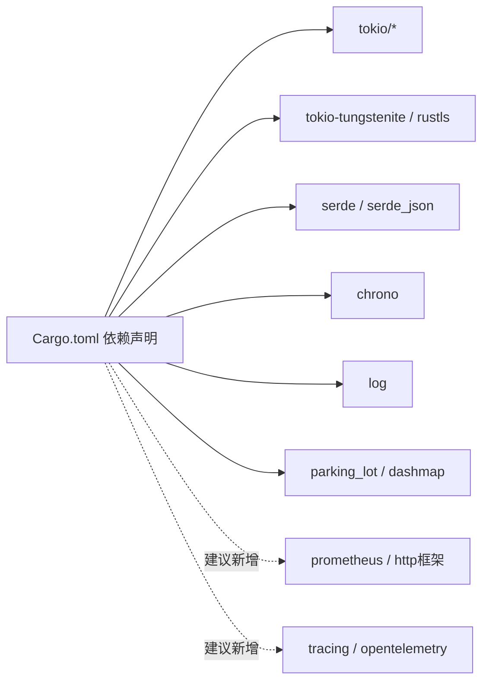

# 监控告警

<cite>
**本文引用的文件**
- [src/main.rs](file://src/main.rs)
- [src/lib.rs](file://src/lib.rs)
- [Cargo.toml](file://Cargo.toml)
- [src/infrastructure/logging/logger.rs](file://src/infrastructure/logging/logger.rs)
- [src/error.rs](file://src/error.rs)
- [src/event_bus.rs](file://src/event_bus.rs)
- [src/command_bus.rs](file://src/command_bus.rs)
- [src/services/market_data_service.rs](file://src/services/market_data_service.rs)
- [src/strategies/grid_strategy.rs](file://src/strategies/grid_strategy.rs)
- [src/events/mod.rs](file://src/events/mod.rs)
- [src/events/risk_events.rs](file://src/events/risk_events.rs)
- [docs/CODE_EXPLANATION.md](file://docs/CODE_EXPLANATION.md)
</cite>

## 目录
1. [简介](#简介)
2. [项目结构](#项目结构)
3. [核心组件](#核心组件)
4. [架构总览](#架构总览)
5. [详细组件分析](#详细组件分析)
6. [依赖关系分析](#依赖关系分析)
7. [性能考量](#性能考量)
8. [故障排查指南](#故障排查指南)
9. [结论](#结论)
10. [附录](#附录)

## 简介
本文件面向运维与开发团队，提供一套完整的监控与告警体系建设方案，结合仓库现有代码结构与能力，覆盖以下关键主题：
- 关键性能指标监控：事件处理延迟、内存使用率、CPU负载、WebSocket连接状态、命令执行成功率等
- 日志系统配置与管理：日志级别、日志轮转、日志聚合与分析工具集成
- Prometheus 指标暴露与 Grafana 仪表板配置示例
- 告警规则：阈值告警、异常检测与故障通知机制
- 分布式追踪：Jaeger/Zipkin 的集成与使用建议
- 健康检查端点与外部监控系统对接
- 监控数据可视化与报表生成最佳实践

## 项目结构
该项目采用模块化组织，围绕“事件驱动”架构构建，核心模块包括：
- 事件总线与事件模型：负责事件的发布、订阅与分发
- 命令总线与命令：封装业务命令的发送与处理
- 市场数据服务：连接 Binance WebSocket，订阅行情并发布事件
- 策略模块：基于价格事件生成交易信号
- 基础设施与错误处理：统一错误类型与日志基础设施

图表来源
- [src/main.rs:1-93](file://src/main.rs#L1-L93)
- [src/lib.rs:1-9](file://src/lib.rs#L1-L9)
- [src/event_bus.rs:1-257](file://src/event_bus.rs#L1-L257)
- [src/command_bus.rs:1-19](file://src/command_bus.rs#L1-L19)
- [src/services/market_data_service.rs:1-503](file://src/services/market_data_service.rs#L1-L503)
- [src/strategies/grid_strategy.rs:1-401](file://src/strategies/grid_strategy.rs#L1-L401)
- [src/events/mod.rs:1-102](file://src/events/mod.rs#L1-L102)
- [src/events/risk_events.rs:1-137](file://src/events/risk_events.rs#L1-L137)
- [src/error.rs:1-169](file://src/error.rs#L1-L169)
- [src/infrastructure/logging/logger.rs:1-415](file://src/infrastructure/logging/logger.rs#L1-L415)

章节来源
- [src/main.rs:1-93](file://src/main.rs#L1-L93)
- [src/lib.rs:1-9](file://src/lib.rs#L1-L9)

## 核心组件
- 事件总线与分发器：提供广播式事件发布与并行分发，支持订阅/取消订阅与处理器集合的动态管理
- 市场数据服务：封装 WebSocket 连接、TLS 握手、代理/直连模式、心跳与消息解析，异常时自动重连
- 网格策略：监听价格事件，按网格线穿越生成交易信号与网格触发事件
- 命令总线：封装下单命令的发送流程
- 日志系统：异步写入、可配置格式与轮转、线程安全
- 统一错误处理：分层错误类型与便捷错误来源标注

章节来源
- [src/event_bus.rs:1-257](file://src/event_bus.rs#L1-L257)
- [src/services/market_data_service.rs:1-503](file://src/services/market_data_service.rs#L1-L503)
- [src/strategies/grid_strategy.rs:1-401](file://src/strategies/grid_strategy.rs#L1-L401)
- [src/command_bus.rs:1-19](file://src/command_bus.rs#L1-L19)
- [src/infrastructure/logging/logger.rs:1-415](file://src/infrastructure/logging/logger.rs#L1-L415)
- [src/error.rs:1-169](file://src/error.rs#L1-L169)

## 架构总览
下图展示了从应用入口到事件总线、再到策略与服务的整体交互，以及日志与错误处理的横切关注点。

图表来源
- [src/main.rs:1-93](file://src/main.rs#L1-L93)
- [src/event_bus.rs:112-158](file://src/event_bus.rs#L112-L158)
- [src/services/market_data_service.rs:96-114](file://src/services/market_data_service.rs#L96-L114)
- [src/strategies/grid_strategy.rs:156-278](file://src/strategies/grid_strategy.rs#L156-L278)
- [src/infrastructure/logging/logger.rs:305-338](file://src/infrastructure/logging/logger.rs#L305-L338)
- [src/error.rs:12-34](file://src/error.rs#L12-L34)

## 详细组件分析

### 事件总线与分发器
- 能力概述
  - 广播通道发布事件，订阅者集合动态维护
  - 分发器并发调用各处理器，错误独立捕获并记录
  - 支持订阅/取消订阅与处理器集合快照
- 性能与可靠性
  - 广播通道容量可配置，影响事件积压与丢弃策略
  - 并行处理提升吞吐，但需注意处理器内部幂等与一致性
- 监控要点
  - 事件积压：通过通道长度与处理器耗时评估
  - 处理器失败率：统计错误数量与类型占比
  - 订阅活跃度：跟踪订阅/取消订阅频率

图表来源
- [src/event_bus.rs:61-110](file://src/event_bus.rs#L61-L110)
- [src/event_bus.rs:112-158](file://src/event_bus.rs#L112-L158)
- [src/strategies/grid_strategy.rs:264-278](file://src/strategies/grid_strategy.rs#L264-L278)
- [src/services/market_data_service.rs:303-374](file://src/services/market_data_service.rs#L303-L374)

章节来源
- [src/event_bus.rs:1-257](file://src/event_bus.rs#L1-L257)

### 市场数据服务（WebSocket）
- 能力概述
  - 支持直连、代理、自动检测三种连接模式
  - TLS 握手与证书校验，支持 SSH 隧道场景
  - 心跳保活与 Ping/Pong 自动处理
  - JSON 解析与事件发布，异常自动重连
- 监控要点
  - 连接状态：连接次数、断开原因、重连次数
  - 延迟指标：从收到消息到发布事件的时延
  - 消息解析：JSON 解析失败率、字段缺失率
  - 心跳健康：Ping/Pong 周期、超时次数

图表来源
- [src/services/market_data_service.rs:23-42](file://src/services/market_data_service.rs#L23-L42)
- [src/services/market_data_service.rs:116-178](file://src/services/market_data_service.rs#L116-L178)
- [src/services/market_data_service.rs:303-374](file://src/services/market_data_service.rs#L303-L374)
- [src/services/market_data_service.rs:376-440](file://src/services/market_data_service.rs#L376-L440)

章节来源
- [src/services/market_data_service.rs:1-503](file://src/services/market_data_service.rs#L1-L503)
- [docs/CODE_EXPLANATION.md:312-361](file://docs/CODE_EXPLANATION.md#L312-L361)

### 网格策略
- 能力概述
  - 基于价格穿越网格线生成交易信号与网格触发事件
  - 买卖信号与止盈止损建议参数化
- 监控要点
  - 信号生成频率与强度分布
  - 网格级别命中率与仓位占用情况
  - 事件发布成功率与延迟

图表来源
- [src/strategies/grid_strategy.rs:189-252](file://src/strategies/grid_strategy.rs#L189-L252)
- [src/strategies/grid_strategy.rs:264-278](file://src/strategies/grid_strategy.rs#L264-L278)

章节来源
- [src/strategies/grid_strategy.rs:1-401](file://src/strategies/grid_strategy.rs#L1-L401)

### 命令总线
- 能力概述
  - 封装下单命令的发送流程，当前实现仅覆盖下单命令
- 监控要点
  - 命令执行成功率、失败原因分类
  - 命令处理延迟与队列长度

章节来源
- [src/command_bus.rs:1-19](file://src/command_bus.rs#L1-L19)
- [src/main.rs:24-41](file://src/main.rs#L24-L41)

### 日志系统
- 能力概述
  - 异步日志写入，支持文本/JSON 格式
  - 文件轮转：按大小阈值滚动，保留多份历史文件
  - 线程安全：MPSC 通道 + 后台写线程
- 监控要点
  - 日志写入延迟与丢弃率
  - 轮转触发频率与失败率
  - 格式切换对下游解析的影响

图表来源
- [src/infrastructure/logging/logger.rs:140-338](file://src/infrastructure/logging/logger.rs#L140-L338)
- [src/infrastructure/logging/logger.rs:81-138](file://src/infrastructure/logging/logger.rs#L81-L138)

章节来源
- [src/infrastructure/logging/logger.rs:1-415](file://src/infrastructure/logging/logger.rs#L1-L415)

### 统一错误处理
- 能力概述
  - 分层错误类型：基础设施、事件总线、命令总线、服务
  - 统一结果类型，便于传播与聚合
- 监控要点
  - 各层错误占比与趋势
  - 常见错误类型 TopN 与根因定位

章节来源
- [src/error.rs:1-169](file://src/error.rs#L1-L169)

## 依赖关系分析
- 运行时依赖
  - 异步运行时与网络栈：tokio、tokio-tungstenite、tokio-rustls、futures-util
  - 序列化与时间：serde、serde_json、chrono
  - 日志与并发：log、parking_lot、dashmap
- 监控相关依赖
  - Prometheus（建议引入）：prometheus、warp 或 actix_web（视服务端框架而定）
  - 分布式追踪（建议引入）：tracing、tracing-opentelemetry、opentelemetry-jaeger

图表来源
- [Cargo.toml:6-25](file://Cargo.toml#L6-L25)

章节来源
- [Cargo.toml:1-27](file://Cargo.toml#L1-L27)

## 性能考量
- 事件总线
  - 广播通道容量与背压策略：根据峰值事件速率调整容量，避免阻塞
  - 处理器并行度：合理拆分处理器职责，避免热点竞争
- WebSocket
  - 心跳周期与超时：平衡保活与资源消耗
  - 消息解析与序列化：批量/压缩策略（如适用）
- 日志
  - 异步写入与缓冲：避免阻塞事件循环
  - 轮转策略：结合磁盘与IO能力设置阈值

## 故障排查指南
- WebSocket 连接失败
  - 检查代理环境变量与模式配置
  - 查看 TLS 握手与 URL 解析错误
  - 关注 Ping/Pong 超时与连接中断
- 事件处理异常
  - 分发器错误收集：逐个处理器失败统计
  - 事件类型过滤：确认处理器订阅范围
- 日志问题
  - 异步写线程退出：检查通道关闭与线程 join
  - 轮转失败：权限、磁盘空间、文件句柄
- 命令执行失败
  - 参数校验与处理器映射
  - 结合统一错误类型定位根因

章节来源
- [src/services/market_data_service.rs:116-178](file://src/services/market_data_service.rs#L116-L178)
- [src/event_bus.rs:128-157](file://src/event_bus.rs#L128-L157)
- [src/infrastructure/logging/logger.rs:293-303](file://src/infrastructure/logging/logger.rs#L293-L303)
- [src/error.rs:101-128](file://src/error.rs#L101-L128)

## 结论
本项目具备良好的事件驱动基础与日志基础设施，建议在此基础上扩展：
- 指标采集与暴露：引入 Prometheus 指标与 HTTP 端点
- 健康检查与就绪探针：保障容器化部署稳定性
- 分布式追踪：为关键链路打点，提升排障效率
- 告警规则：基于阈值与异常检测构建自动化告警
- 可视化与报表：结合 Grafana 构建仪表板与趋势报表

## 附录

### 关键指标清单与采集建议
- 事件处理延迟
  - 方法：在事件进入处理器时记录时间戳，在发布事件时记录时间戳，计算差值
  - 指标：直方图/摘要，按事件类型分桶
- 内存使用率
  - 方法：进程级指标（RSS/堆），结合 GC/分配速率
  - 指标：gauge（绝对值）、rate（增长速率）
- CPU 负载
  - 方法：进程级 CPU 百分比、goroutine/线程数
  - 指标：gauge、rate
- WebSocket 连接状态
  - 方法：连接次数、断开原因、重连次数、Ping/Pong 超时
  - 指标：counter、gauge
- 命令执行成功率
  - 方法：命令发送、处理、完成/失败计数
  - 指标：rate、错误码分布

### 日志系统配置与管理
- 日志级别：生产环境建议 Info/Warning，调试阶段可临时提升
- 日志格式：JSON 便于机器解析；文本便于人工审阅
- 日志轮转：按大小阈值滚动，保留 N 份历史文件
- 日志聚合：集中收集（如 Loki/ELK），结合标签检索与告警

章节来源
- [src/infrastructure/logging/logger.rs:17-79](file://src/infrastructure/logging/logger.rs#L17-L79)
- [src/infrastructure/logging/logger.rs:81-138](file://src/infrastructure/logging/logger.rs#L81-L138)

### Prometheus 指标暴露与 Grafana 仪表板
- 指标暴露
  - 选择 HTTP 框架（如 warp/axum），注册指标收集器
  - 暴露进程级指标（如 prometheus/client_*.rs）
- Grafana 仪表板
  - 事件处理延迟直方图
  - WebSocket 连接状态与重连次数
  - 命令执行成功率与错误分布
  - 日志写入延迟与轮转失败率

### 告警规则设置
- 阈值告警
  - 连接断开率、事件积压、日志写入延迟
- 异常检测
  - 事件处理时延突增、错误率异常上升
- 故障通知
  - 集成通知渠道（邮件/IM/电话），分级告警

### 分布式追踪集成（Jaeger/Zipkin）
- 采样策略：生产环境建议低采样率
- Span 标签：事件类型、处理器、错误码
- 查询与关联：按 traceId 关联日志与指标

### 健康检查端点与外部监控对接
- 健康检查：/health（存活）、/ready（就绪）
- 对接：Prometheus 抓取、Grafana 数据源、告警平台