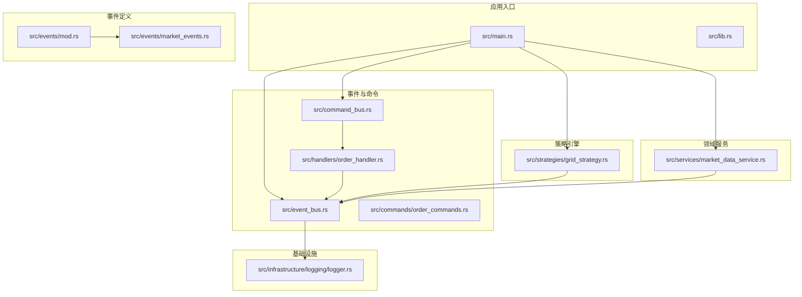
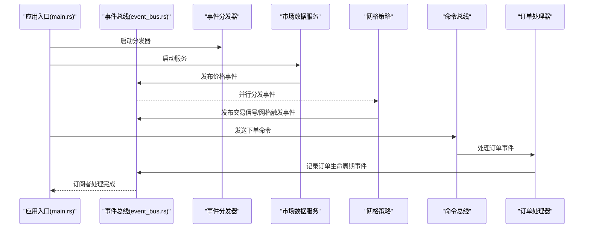
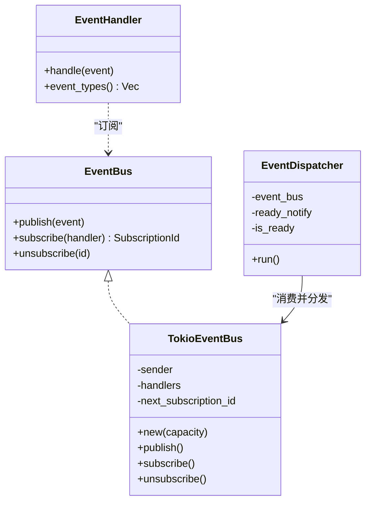
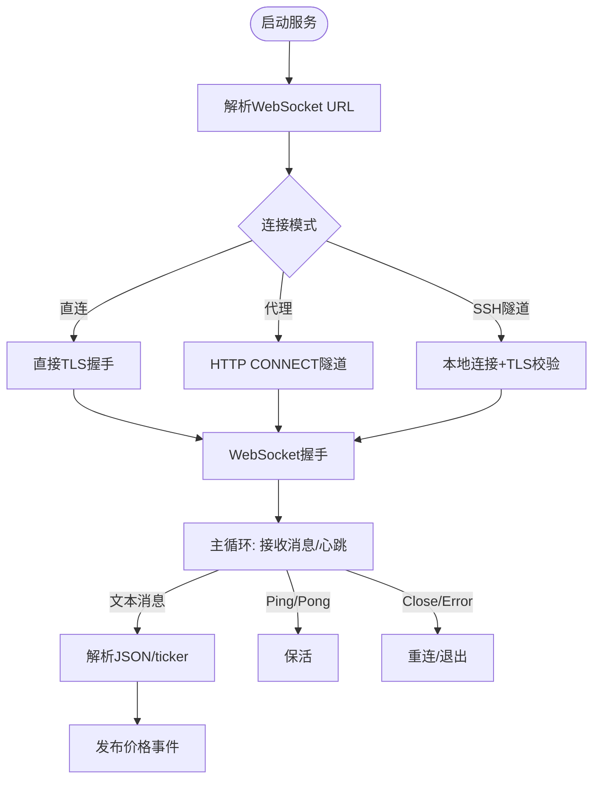
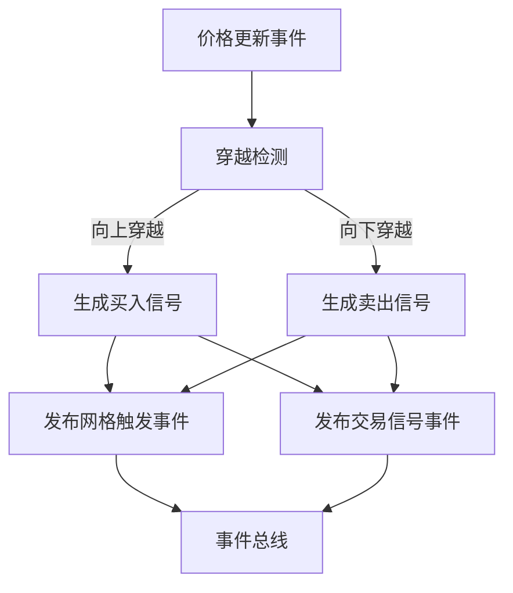
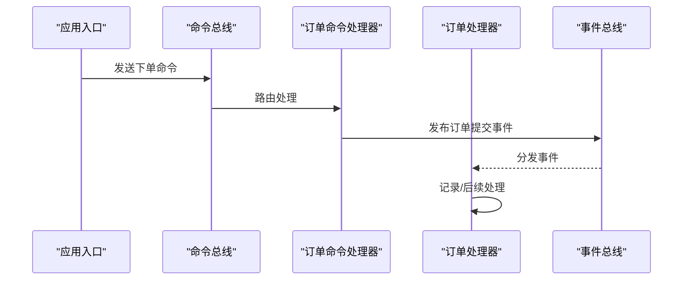
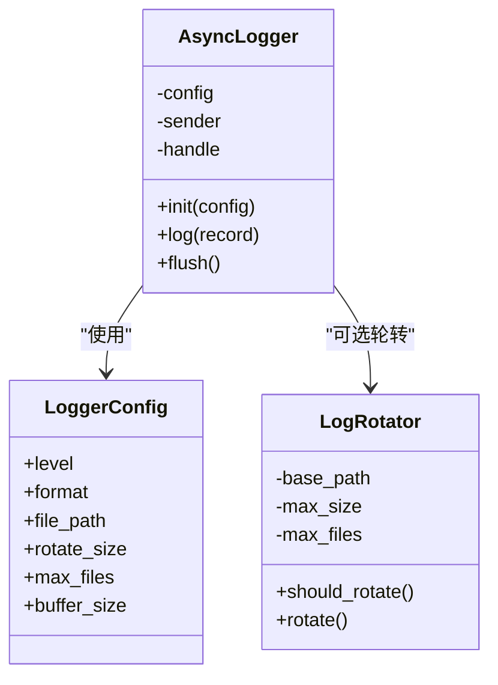
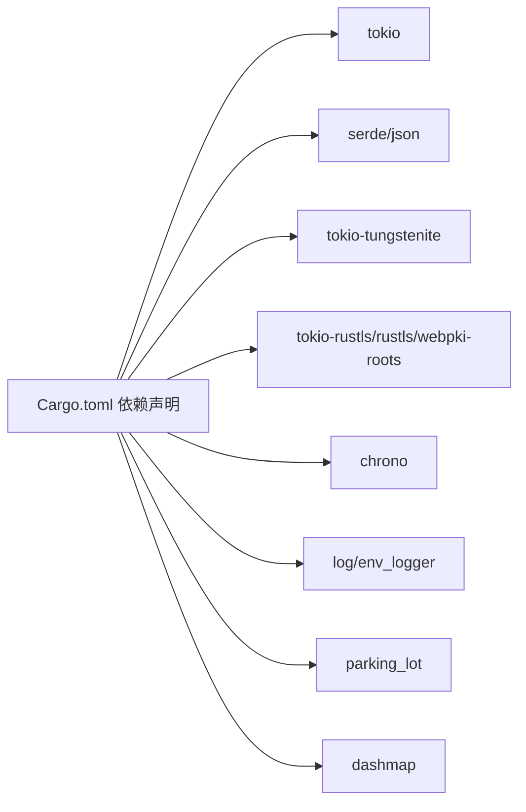

# 运维自动化

<cite>
**本文引用的文件**
- [Cargo.toml](file://Cargo.toml)
- [main.rs](file://src/main.rs)
- [lib.rs](file://src/lib.rs)
- [event_bus.rs](file://src/event_bus.rs)
- [command_bus.rs](file://src/command_bus.rs)
- [market_data_service.rs](file://src/services/market_data_service.rs)
- [grid_strategy.rs](file://src/strategies/grid_strategy.rs)
- [order_commands.rs](file://src/commands/order_commands.rs)
- [order_handler.rs](file://src/handlers/order_handler.rs)
- [mod.rs](file://src/events/mod.rs)
- [market_events.rs](file://src/events/market_events.rs)
- [logger.rs](file://src/infrastructure/logging/logger.rs)
- [CODE_EXPLANATION.md](file://docs/CODE_EXPLANATION.md)
- [EVENT_DRIVEN_REFACTOR_GUIDE.md](file://docs/EVENT_DRIVEN_REFACTOR_GUIDE.md)
</cite>

## 目录
1. [简介](#简介)
2. [项目结构](#项目结构)
3. [核心组件](#核心组件)
4. [架构总览](#架构总览)
5. [详细组件分析](#详细组件分析)
6. [依赖关系分析](#依赖关系分析)
7. [性能与可靠性](#性能与可靠性)
8. [运维自动化实践](#运维自动化实践)
9. [故障排查指南](#故障排查指南)
10. [结论](#结论)
11. [附录](#附录)

## 简介
本项目是一个基于事件驱动架构的量化交易系统，核心围绕“事件总线”“命令总线”“策略引擎”“市场数据服务”等模块展开。该架构具备高内聚、低耦合、可扩展性强的特点，天然适合作为运维自动化的起点：通过事件驱动实现监控、告警、扩容、故障转移、自愈、备份恢复、滚动/蓝绿发布等运维能力。

## 项目结构
项目采用按领域分层与按功能模块划分相结合的方式组织代码，便于在运维层面进行模块化治理与自动化编排。

**图表来源**
- [main.rs:1-93](file://src/main.rs#L1-L93)
- [lib.rs:1-9](file://src/lib.rs#L1-L9)
- [event_bus.rs:1-257](file://src/event_bus.rs#L1-L257)
- [command_bus.rs:1-19](file://src/command_bus.rs#L1-L19)
- [order_commands.rs:1-72](file://src/commands/order_commands.rs#L1-L72)
- [order_handler.rs:1-137](file://src/handlers/order_handler.rs#L1-L137)
- [market_data_service.rs:1-503](file://src/services/market_data_service.rs#L1-L503)
- [grid_strategy.rs:1-401](file://src/strategies/grid_strategy.rs#L1-L401)
- [mod.rs:1-102](file://src/events/mod.rs#L1-L102)
- [market_events.rs:1-94](file://src/events/market_events.rs#L1-L94)
- [logger.rs:1-415](file://src/infrastructure/logging/logger.rs#L1-L415)

**章节来源**
- [main.rs:1-93](file://src/main.rs#L1-L93)
- [lib.rs:1-9](file://src/lib.rs#L1-L9)
- [CODE_EXPLANATION.md:75-122](file://docs/CODE_EXPLANATION.md#L75-L122)

## 核心组件
- 事件总线与分发器：负责事件的发布、订阅、并行分发与错误隔离。
- 命令总线与命令处理器：负责命令的路由与执行，发布相应领域事件。
- 市场数据服务：负责连接Binance WebSocket，解析实时行情并发布价格事件。
- 策略引擎（网格策略）：订阅价格事件，生成交易信号与网格触发事件。
- 日志基础设施：提供异步日志、轮转与格式化能力，支撑可观测性与审计。
- 事件定义：统一的领域事件模型，支撑事件溯源与监控。

**章节来源**
- [event_bus.rs:18-110](file://src/event_bus.rs#L18-L110)
- [command_bus.rs:5-19](file://src/command_bus.rs#L5-L19)
- [order_handler.rs:93-137](file://src/handlers/order_handler.rs#L93-L137)
- [market_data_service.rs:34-114](file://src/services/market_data_service.rs#L34-L114)
- [grid_strategy.rs:156-278](file://src/strategies/grid_strategy.rs#L156-L278)
- [logger.rs:140-291](file://src/infrastructure/logging/logger.rs#L140-L291)
- [mod.rs:48-89](file://src/events/mod.rs#L48-L89)

## 架构总览
系统采用事件驱动架构，核心流程为：市场数据服务产生价格事件，事件总线分发给订阅者；策略引擎根据价格生成交易信号；命令总线接收命令并发布相应事件；日志基础设施记录运行轨迹。

**图表来源**
- [main.rs:10-93](file://src/main.rs#L10-L93)
- [event_bus.rs:112-158](file://src/event_bus.rs#L112-L158)
- [market_data_service.rs:96-114](file://src/services/market_data_service.rs#L96-L114)
- [grid_strategy.rs:189-252](file://src/strategies/grid_strategy.rs#L189-L252)
- [command_bus.rs:14-18](file://src/command_bus.rs#L14-L18)
- [order_handler.rs:68-91](file://src/handlers/order_handler.rs#L68-L91)

## 详细组件分析

### 事件总线与分发器
- 职责：发布领域事件、管理订阅者、并行分发、错误隔离。
- 关键点：使用广播通道实现一对多分发；分发器独立任务运行；订阅者列表线程安全；支持“订阅所有事件”的通配类型。
- 运维价值：可作为监控、告警、审计的统一事件源；支持事件溯源与回放。

**图表来源**
- [event_bus.rs:18-110](file://src/event_bus.rs#L18-L110)
- [event_bus.rs:112-158](file://src/event_bus.rs#L112-L158)

**章节来源**
- [event_bus.rs:18-110](file://src/event_bus.rs#L18-L110)
- [event_bus.rs:112-158](file://src/event_bus.rs#L112-L158)

### 市场数据服务（WebSocket）
- 职责：连接Binance WebSocket，订阅价格流，心跳保活，自动重连，代理支持（HTTP CONNECT）。
- 关键点：支持单流/组合流；解析ticker事件；发布价格更新事件；支持SSH隧道模式；TLS握手与代理隧道。
- 运维价值：可作为监控数据源；心跳与重连保障高可用；代理/隧道适配复杂网络环境。

**图表来源**
- [market_data_service.rs:96-178](file://src/services/market_data_service.rs#L96-L178)
- [market_data_service.rs:303-374](file://src/services/market_data_service.rs#L303-L374)

**章节来源**
- [market_data_service.rs:23-82](file://src/services/market_data_service.rs#L23-L82)
- [market_data_service.rs:96-178](file://src/services/market_data_service.rs#L96-L178)
- [market_data_service.rs:303-374](file://src/services/market_data_service.rs#L303-L374)

### 策略引擎（网格策略）
- 职责：在价格穿越网格线时生成交易信号，并发布网格触发与交易信号事件。
- 关键点：网格线生成、穿越检测、状态标记、事件发布。
- 运维价值：可作为风控与交易信号的统一出口；事件可用于审计与回放。

**图表来源**
- [grid_strategy.rs:102-154](file://src/strategies/grid_strategy.rs#L102-L154)
- [grid_strategy.rs:234-249](file://src/strategies/grid_strategy.rs#L234-L249)

**章节来源**
- [grid_strategy.rs:26-81](file://src/strategies/grid_strategy.rs#L26-L81)
- [grid_strategy.rs:102-154](file://src/strategies/grid_strategy.rs#L102-L154)
- [grid_strategy.rs:234-249](file://src/strategies/grid_strategy.rs#L234-L249)

### 命令总线与订单处理器
- 职责：命令总线接收命令并路由至处理器；处理器处理订单生命周期事件并记录。
- 关键点：下单命令参数校验；发布订单提交事件；后续可接入风控与执行模块。
- 运维价值：命令执行可审计；事件可用于回放与合规。

**图表来源**
- [command_bus.rs:14-18](file://src/command_bus.rs#L14-L18)
- [order_handler.rs:93-137](file://src/handlers/order_handler.rs#L93-L137)
- [order_handler.rs:68-91](file://src/handlers/order_handler.rs#L68-L91)

**章节来源**
- [command_bus.rs:5-19](file://src/command_bus.rs#L5-L19)
- [order_handler.rs:93-137](file://src/handlers/order_handler.rs#L93-L137)
- [order_handler.rs:68-91](file://src/handlers/order_handler.rs#L68-L91)

### 日志基础设施
- 职责：异步日志写入、格式化（文本/JSON）、文件轮转、缓冲与刷新。
- 关键点：后台线程异步落盘；可配置轮转大小与文件数；支持结构化日志。
- 运维价值：高吞吐日志输出；便于集中化收集与分析。

**图表来源**
- [logger.rs:17-79](file://src/infrastructure/logging/logger.rs#L17-L79)
- [logger.rs:81-138](file://src/infrastructure/logging/logger.rs#L81-L138)
- [logger.rs:140-291](file://src/infrastructure/logging/logger.rs#L140-L291)

**章节来源**
- [logger.rs:17-79](file://src/infrastructure/logging/logger.rs#L17-L79)
- [logger.rs:81-138](file://src/infrastructure/logging/logger.rs#L81-L138)
- [logger.rs:140-291](file://src/infrastructure/logging/logger.rs#L140-L291)

## 依赖关系分析
- 运行时与异步：Tokio作为异步运行时，广泛用于任务、通道与超时控制。
- 网络与TLS：tokio-tungstenite、tokio-rustls、rustls、webpki-roots用于WebSocket与TLS握手。
- 序列化：serde/serde_json用于事件与命令的序列化。
- 日志：log、env_logger、chrono用于日志与时间。
- 并发与集合：parking_lot、dashmap用于高性能并发容器。

**图表来源**
- [Cargo.toml:6-26](file://Cargo.toml#L6-L26)

**章节来源**
- [Cargo.toml:6-26](file://Cargo.toml#L6-L26)

## 性能与可靠性
- 并行分发：事件分发器使用join_all并行处理订阅者，降低延迟。
- 背压与容量：广播通道具备内置背压，避免过载。
- 心跳与保活：WebSocket心跳与Ping/Pong维持连接稳定。
- 自动重连：指数退避或固定间隔重连，提升可用性。
- 异步日志：后台线程异步写盘，避免阻塞主流程。

**章节来源**
- [event_bus.rs:142-156](file://src/event_bus.rs#L142-L156)
- [market_data_service.rs:323-374](file://src/services/market_data_service.rs#L323-L374)
- [logger.rs:160-234](file://src/infrastructure/logging/logger.rs#L160-L234)

## 运维自动化实践

### 系统启动与停止自动化
- 启动顺序建议
  1) 初始化事件总线与分发器，等待就绪通知。
  2) 启动市场数据服务，订阅所需交易对。
  3) 注册策略引擎（如网格策略），订阅价格事件。
  4) 启动命令总线，处理外部命令（如下单）。
- 停止与优雅退出
  - 使用tokio::time::sleep控制运行时长，到期后取消任务。
  - 通过abort中断长时间运行的任务，确保进程可退出。
- systemd集成要点
  - ExecStart：指向可执行二进制。
  - Restart：on-failure 或 always。
  - Environment：通过环境变量控制代理、日志级别、连接模式。
  - TimeoutStopSec：为优雅退出预留时间。
- Docker/Kubernetes
  - Docker：暴露健康检查端口，使用HEALTHCHECK探测事件总线与WebSocket连接。
  - Kubernetes：Deployment/StatefulSet结合探针；ConfigMap注入环境变量；Secret管理敏感参数。

**章节来源**
- [main.rs:10-93](file://src/main.rs#L10-L93)
- [event_bus.rs:119-157](file://src/event_bus.rs#L119-L157)
- [market_data_service.rs:96-114](file://src/services/market_data_service.rs#L96-L114)

### 备份与恢复自动化
- 事件存储（建议）
  - 基于事件溯源，将DomainEvent持久化到数据库（SQLite/PostgreSQL）。
  - 使用StorableEvent结构，包含全局序列号与聚合根标识。
- 备份策略
  - 增量备份：按时间窗口导出事件流。
  - 全量备份：定期导出完整事件表。
- 恢复流程
  - 从备份重建事件流，重放事件重建状态。
  - 对比校验：校验序列号与一致性。
- 配置与日志备份
  - 配置文件与日志目录纳入定期归档。
  - 日志轮转策略：按大小轮转，保留N份历史。

**章节来源**
- [mod.rs:91-102](file://src/events/mod.rs#L91-L102)
- [logger.rs:81-138](file://src/infrastructure/logging/logger.rs#L81-L138)

### 滚动更新与蓝绿部署
- 滚动更新
  - 通过Kubernetes Deployment的滚动策略，逐步替换Pod。
  - 健康检查：就绪探针与存活探针，确保新实例完全就绪后再终止旧实例。
- 蓝绿部署
  - 两套完全相同的环境（蓝色/绿色），通过服务选择器切换流量。
  - 预热：新版本预热一段时间，确认稳定后再切换。
- 配置变更
  - 使用ConfigMap/环境变量注入运行参数（如代理、连接模式、日志级别）。
  - 热重载：在应用内监听配置变更并更新行为（如日志级别）。

**章节来源**
- [EVENT_DRIVEN_REFACTOR_GUIDE.md:519-560](file://docs/EVENT_DRIVEN_REFACTOR_GUIDE.md#L519-L560)

### 监控与告警自动化
- 指标采集
  - 事件总线容量、订阅者数量、事件分发耗时。
  - WebSocket连接状态、心跳间隔、重连次数。
  - 日志写入速率、轮转触发次数。
- 告警策略
  - 连接断开/重连频繁、事件积压、日志写入失败。
- 自愈机制
  - 连接异常自动重连；事件积压时降级处理；日志轮转失败报警并降级到标准输出。

**章节来源**
- [logger.rs:140-291](file://src/infrastructure/logging/logger.rs#L140-L291)
- [market_data_service.rs:323-374](file://src/services/market_data_service.rs#L323-L374)
- [event_bus.rs:81-84](file://src/event_bus.rs#L81-L84)

### CI/CD流水线
- 构建与测试
  - Cargo构建、单元测试、集成测试。
  - 代码格式化与Lint检查。
- 打包与部署
  - Docker镜像构建，多阶段优化。
  - Kubernetes部署清单与滚动策略。
- 自动化测试
  - 单元测试覆盖事件、命令、策略与服务。
  - 集成测试模拟WebSocket与事件分发。

**章节来源**
- [EVENT_DRIVEN_REFACTOR_GUIDE.md:519-560](file://docs/EVENT_DRIVEN_REFACTOR_GUIDE.md#L519-L560)

### 运维任务自动化
- 日志清理：按大小轮转，保留N份历史。
- 数据归档：事件与配置定期归档到对象存储。
- 性能优化：调整事件总线容量、日志缓冲大小、WebSocket心跳间隔。

**章节来源**
- [logger.rs:81-138](file://src/infrastructure/logging/logger.rs#L81-L138)
- [event_bus.rs:81-84](file://src/event_bus.rs#L81-L84)

### 运维工具开发与集成
- 自定义监控脚本：基于事件总线统计指标，输出JSON供Prometheus抓取。
- 管理界面：基于事件与命令的Web面板，展示策略状态、订单状态与告警。
- 运维面板：可视化展示事件流、连接状态、日志与配置。

**章节来源**
- [mod.rs:48-89](file://src/events/mod.rs#L48-L89)
- [order_handler.rs:26-65](file://src/handlers/order_handler.rs#L26-L65)

## 故障排查指南
- WebSocket连接失败
  - 检查代理环境变量与连接模式；确认TLS握手与CONNECT隧道。
  - 查看心跳与Ping/Pong是否正常；关注重连日志。
- 事件积压
  - 检查订阅者处理耗时；优化事件处理器；必要时增加并行度。
- 日志写入异常
  - 检查文件权限与磁盘空间；确认轮转逻辑；必要时降级到标准输出。
- 命令执行失败
  - 检查命令参数校验与事件发布；查看处理器日志。

**章节来源**
- [market_data_service.rs:116-178](file://src/services/market_data_service.rs#L116-L178)
- [event_bus.rs:142-156](file://src/event_bus.rs#L142-L156)
- [logger.rs:160-234](file://src/infrastructure/logging/logger.rs#L160-L234)
- [order_handler.rs:102-135](file://src/handlers/order_handler.rs#L102-L135)

## 结论
本项目以事件驱动为核心，天然具备可观测性与可扩展性，非常适合构建自动化运维体系。通过事件总线统一事件源、以策略与处理器实现业务闭环、以日志与监控保障可观测，可覆盖从启动停止、备份恢复、滚动/蓝绿发布、监控告警到CI/CD与日常运维任务的全生命周期运维自动化需求。

## 附录
- 开发与运维参考文档
  - 事件驱动重构指南：涵盖模块开发、测试策略、迁移方案与性能优化。
  - 代码详解文档：涵盖架构设计、模块职责、数据流与开发指南。

**章节来源**
- [EVENT_DRIVEN_REFACTOR_GUIDE.md:1-1280](file://docs/EVENT_DRIVEN_REFACTOR_GUIDE.md#L1-L1280)
- [CODE_EXPLANATION.md:1-762](file://docs/CODE_EXPLANATION.md#L1-L762)