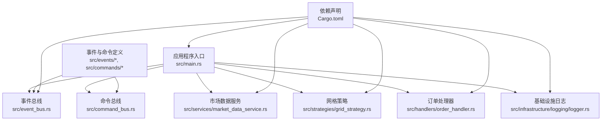
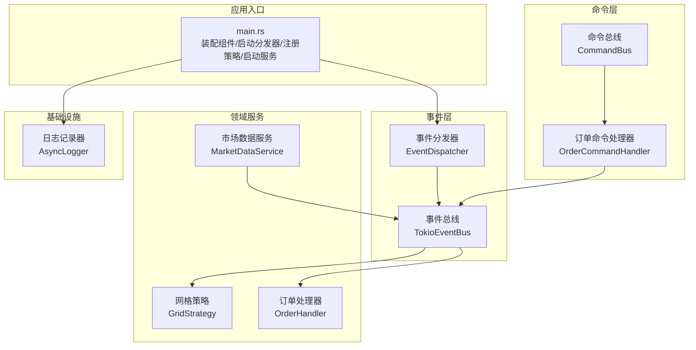
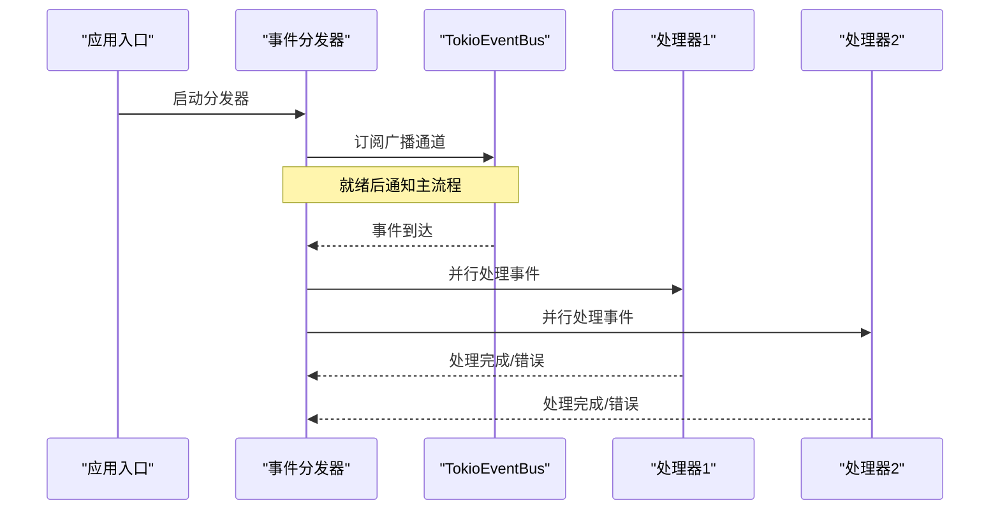
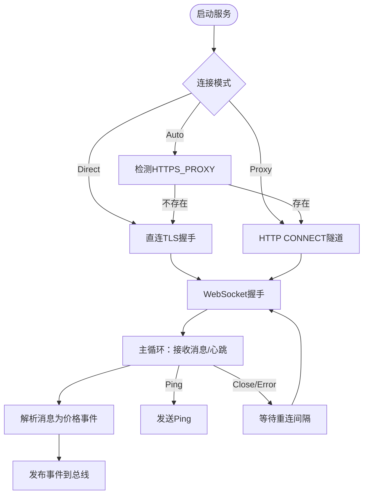
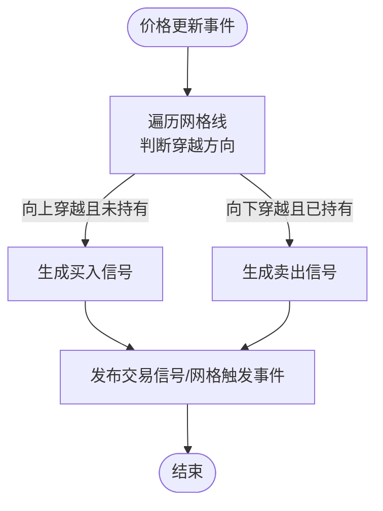
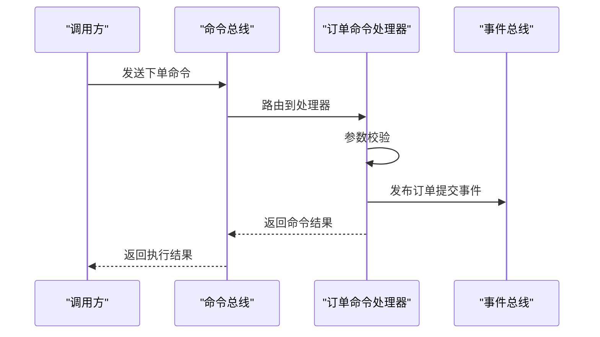
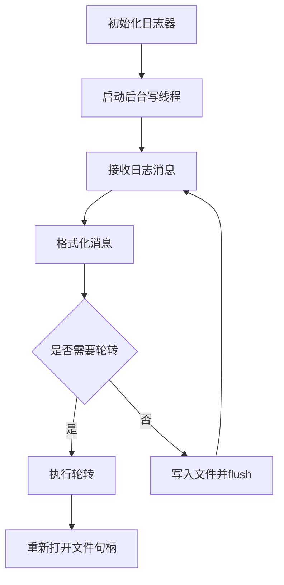
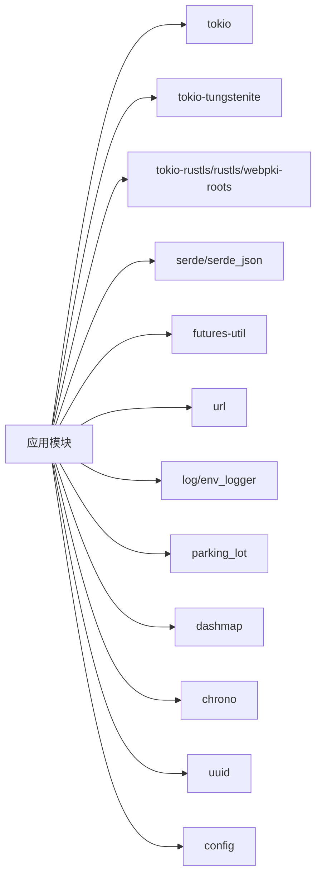

# 部署运维

<cite>
**本文引用的文件**
- [Cargo.toml](file://Cargo.toml)
- [main.rs](file://src/main.rs)
- [lib.rs](file://src/lib.rs)
- [CODE_EXPLANATION.md](file://docs/CODE_EXPLANATION.md)
- [EVENT_DRIVEN_REFACTOR_GUIDE.md](file://docs/EVENT_DRIVEN_REFACTOR_GUIDE.md)
- [event_bus.rs](file://src/event_bus.rs)
- [market_data_service.rs](file://src/services/market_data_service.rs)
- [grid_strategy.rs](file://src/strategies/grid_strategy.rs)
- [order_handler.rs](file://src/handlers/order_handler.rs)
- [logger.rs](file://src/infrastructure/logging/logger.rs)
- [error.rs](file://src/infrastructure/error/error.rs)
</cite>

## 目录
1. [简介](#简介)
2. [项目结构](#项目结构)
3. [核心组件](#核心组件)
4. [架构总览](#架构总览)
5. [详细组件分析](#详细组件分析)
6. [依赖关系分析](#依赖关系分析)
7. [性能与资源规划](#性能与资源规划)
8. [部署与运维指南](#部署与运维指南)
9. [监控与告警](#监控与告警)
10. [故障排除手册](#故障排除手册)
11. [备份与灾难恢复](#备份与灾难恢复)
12. [结论](#结论)

## 简介
本文件面向将“Binance Rust事件驱动交易系统”部署到生产环境的工程团队，提供从容器化、Kubernetes、云平台到运维脚本、监控告警、故障排查与灾备的完整指导。文档基于仓库现有代码与文档，聚焦事件驱动架构、WebSocket实时数据接入、网格策略与命令总线等核心模块，给出可落地的部署与运维实践。

## 项目结构
项目采用模块化组织，核心模块包括事件总线、命令总线、市场数据服务、策略引擎、事件与命令定义、基础设施（日志）等。入口程序负责装配组件、启动事件分发器、注册策略与服务，并演示命令总线与市场数据服务的使用。

**图表来源**
- [main.rs:10-93](file://src/main.rs#L10-L93)
- [lib.rs:1-9](file://src/lib.rs#L1-L9)
- [Cargo.toml:6-24](file://Cargo.toml#L6-L24)

**章节来源**
- [main.rs:10-93](file://src/main.rs#L10-L93)
- [lib.rs:1-9](file://src/lib.rs#L1-L9)
- [Cargo.toml:6-24](file://Cargo.toml#L6-L24)

## 核心组件
- 事件总线与分发器：基于Tokio广播通道，支持订阅/取消订阅、并行分发、错误隔离。
- 市场数据服务：通过Binance WebSocket实时订阅ticker，支持直连与HTTP CONNECT代理隧道，具备心跳与自动重连。
- 网格策略：在价格穿越网格线时生成交易信号事件，支持利润阈值与止盈止损建议。
- 命令总线与处理器：演示下单命令的处理流程，发布订单生命周期事件。
- 基础设施日志：异步日志记录器，支持文本/JSON格式、文件轮转与缓冲。

**章节来源**
- [event_bus.rs:18-110](file://src/event_bus.rs#L18-L110)
- [market_data_service.rs:23-114](file://src/services/market_data_service.rs#L23-L114)
- [grid_strategy.rs:26-154](file://src/strategies/grid_strategy.rs#L26-L154)
- [order_handler.rs:93-136](file://src/handlers/order_handler.rs#L93-L136)
- [logger.rs:17-79](file://src/infrastructure/logging/logger.rs#L17-L79)

## 架构总览
系统采用事件驱动架构，事件生产者（市场数据服务）发布领域事件，事件总线并行分发给订阅者（策略、风控、订单等）。命令总线接收外部命令，转换为领域事件，驱动系统状态演进。

**图表来源**
- [main.rs:14-60](file://src/main.rs#L14-L60)
- [event_bus.rs:61-117](file://src/event_bus.rs#L61-L117)
- [market_data_service.rs:34-42](file://src/services/market_data_service.rs#L34-L42)
- [grid_strategy.rs:156-182](file://src/strategies/grid_strategy.rs#L156-L182)
- [order_handler.rs:16-24](file://src/handlers/order_handler.rs#L16-L24)
- [logger.rs:140-144](file://src/infrastructure/logging/logger.rs#L140-L144)

## 详细组件分析

### 事件总线与分发器
- 事件总线：基于广播通道，支持发布、订阅、取消订阅；订阅者集合使用读写锁保护。
- 分发器：独立任务，订阅广播通道，读取事件后并行调用所有订阅处理器，错误独立处理，不影响其他处理器。

**图表来源**
- [event_bus.rs:112-158](file://src/event_bus.rs#L112-L158)

**章节来源**
- [event_bus.rs:18-110](file://src/event_bus.rs#L18-L110)
- [event_bus.rs:112-158](file://src/event_bus.rs#L112-L158)

### 市场数据服务（WebSocket）
- 连接模式：支持Auto/Direct/Proxy三种模式，结合环境变量与SSH隧道支持。
- 代理隧道：通过HTTP CONNECT建立代理隧道，随后在隧道上进行TLS握手。
- 心跳与重连：定时发送Ping，接收Close/Ping，异常时按配置重连。
- 消息解析：解析组合流与单流格式的ticker事件，发布价格更新事件。

**图表来源**
- [market_data_service.rs:23-82](file://src/services/market_data_service.rs#L23-L82)
- [market_data_service.rs:116-178](file://src/services/market_data_service.rs#L116-L178)
- [market_data_service.rs:303-374](file://src/services/market_data_service.rs#L303-L374)

**章节来源**
- [market_data_service.rs:23-114](file://src/services/market_data_service.rs#L23-L114)
- [market_data_service.rs:116-178](file://src/services/market_data_service.rs#L116-L178)
- [market_data_service.rs:303-374](file://src/services/market_data_service.rs#L303-L374)

### 网格策略
- 配置：网格数量、区间上下限、每格数量、利润阈值等。
- 状态：网格线列表、上次价格、信号计数。
- 触发：价格穿越网格线时生成买入/卖出信号事件，并发布网格触发事件。

**图表来源**
- [grid_strategy.rs:102-154](file://src/strategies/grid_strategy.rs#L102-L154)

**章节来源**
- [grid_strategy.rs:26-81](file://src/strategies/grid_strategy.rs#L26-L81)
- [grid_strategy.rs:102-154](file://src/strategies/grid_strategy.rs#L102-L154)

### 命令总线与处理器
- 命令总线：根据命令类型路由至相应处理器。
- 订单命令处理器：参数校验、记录日志、发布订单提交事件。

**图表来源**
- [command_bus.rs:5-19](file://src/command_bus.rs#L5-L19)
- [order_handler.rs:93-136](file://src/handlers/order_handler.rs#L93-L136)

**章节来源**
- [command_bus.rs:1-19](file://src/command_bus.rs#L1-L19)
- [order_handler.rs:93-136](file://src/handlers/order_handler.rs#L93-L136)

### 基础设施日志
- 异步日志：通过通道与后台线程写入文件，支持文本/JSON格式、文件轮转、缓冲大小配置。
- 轮转策略：按大小轮转，保留固定数量历史文件。

**图表来源**
- [logger.rs:140-234](file://src/infrastructure/logging/logger.rs#L140-L234)
- [logger.rs:81-138](file://src/infrastructure/logging/logger.rs#L81-L138)

**章节来源**
- [logger.rs:17-79](file://src/infrastructure/logging/logger.rs#L17-L79)
- [logger.rs:140-234](file://src/infrastructure/logging/logger.rs#L140-L234)
- [logger.rs:81-138](file://src/infrastructure/logging/logger.rs#L81-L138)

## 依赖关系分析
- 运行时与网络：Tokio异步运行时、WebSocket客户端、TLS客户端、URL解析、Future工具集。
- 序列化：Serde JSON用于事件与命令的序列化。
- 日志：log + env_logger用于日志框架集成。
- 并发与数据结构：parking_lot、dashmap用于高性能并发容器。
- 配置：config用于配置加载（重构文档中提及）。

**图表来源**
- [Cargo.toml:6-24](file://Cargo.toml#L6-L24)

**章节来源**
- [Cargo.toml:6-24](file://Cargo.toml#L6-L24)

## 性能与资源规划
- 事件总线容量：根据峰值事件速率设置广播通道容量，避免背压丢失。
- 并行分发：分发器对所有订阅处理器并行调用，注意处理器内部I/O与CPU开销。
- WebSocket连接：合理设置心跳间隔与超时，避免中间设备断开；组合流订阅提升吞吐。
- 日志写入：异步写入+文件轮转，避免阻塞事件循环；根据磁盘IO能力调整轮转阈值。
- 内存与并发：使用Arc+RwLock管理共享状态，避免频繁克隆；DashMap用于高并发读写场景。

[本节为通用性能建议，不直接分析具体文件，故无“章节来源”]

## 部署与运维指南

### Docker容器化部署
- 基础镜像：建议使用Debian/Alpine或官方Rust镜像作为基础，启用多阶段构建优化体积。
- 构建步骤：在CI中执行构建，产物拷贝至最终镜像；确保运行用户权限最小化。
- 环境变量：
  - 网络与代理：HTTPS_PROXY/https_proxy（用于代理模式）、USE_SSH_TUNNEL（启用本地端口转发）。
  - 日志：RUST_LOG（日志级别）、LOG_FORMAT（文本/JSON）、LOG_FILE_PATH（日志文件路径）、LOG_ROTATE_SIZE、LOG_MAX_FILES。
  - 事件总线：EVENT_BUS_CAPACITY（广播通道容量）。
- 健康检查：暴露HTTP端口或通过进程存活探测；WebSocket连接状态可作为应用层健康检查依据。
- 资源限制：CPU/内存配额与启动参数（如线程数、通道容量）配合K8s资源限制使用。

[本节为通用容器化实践，不直接分析具体文件，故无“章节来源”]

### Kubernetes集群部署
- Deployment：副本数根据事件吞吐与处理器CPU占用评估；使用PodDisruptionBudget保证SLA。
- Service：ClusterIP即可，若需外部访问可通过Ingress或LoadBalancer。
- ConfigMap：存放运行参数（如事件总线容量、日志配置），挂载为环境变量或配置文件。
- Secret：存放API密钥（如未来对接Binance API时使用）。
- HPA：基于CPU/内存或自定义指标（事件积压、处理耗时）自动扩缩容。
- Pod安全：非root运行、只读根文件系统、最小权限RBAC。

[本节为通用K8s实践，不直接分析具体文件，故无“章节来源”]

### 云平台部署方案
- AWS/GCP/Azure：使用ECS/EKS/GKE托管容器服务；结合云原生监控与日志服务（CloudWatch/Stackdriver/Log Analytics）。
- VPC/子网：将WebSocket直连与代理模式结合，必要时通过NAT网关或专用通道访问公网。
- 对象存储：日志轮转文件上传至对象存储归档；事件存储可考虑云数据库或消息队列。
- CDN/加速：若引入Web前端或API，使用CDN加速静态资源与API响应。

[本节为通用云平台实践，不直接分析具体文件，故无“章节来源”]

### 系统配置参数
- 网络设置
  - 连接模式：ConnectionMode::Auto/Direct/Proxy（见入口程序注释与服务实现）。
  - 代理：HTTPS_PROXY/https_proxy；HTTP CONNECT隧道。
  - SSH隧道：USE_SSH_TUNNEL启用本地端口转发。
- 安全配置
  - TLS：rustls信任根证书，服务器名称验证。
  - 证书：使用webpki-roots内置信任锚。
- 性能调优
  - 事件总线容量：EVENT_BUS_CAPACITY。
  - 心跳间隔：服务内部默认30秒，可按网络质量调整。
  - 重连间隔：服务内部默认5秒，可根据网络稳定性调整。
- 资源限制
  - 日志轮转：LOG_ROTATE_SIZE（字节）、LOG_MAX_FILES。
  - 日志缓冲：LOG_BUFFER_SIZE（消息数）。

**章节来源**
- [main.rs:65-76](file://src/main.rs#L65-L76)
- [market_data_service.rs:23-82](file://src/services/market_data_service.rs#L23-L82)
- [market_data_service.rs:116-178](file://src/services/market_data_service.rs#L116-L178)
- [logger.rs:17-79](file://src/infrastructure/logging/logger.rs#L17-L79)

### 运维脚本与自动化工具
- 启动脚本：封装环境变量注入、日志目录创建、守护进程化（systemd或supervisord）。
- 健康检查：探测WebSocket连接状态、事件总线容量与积压、日志写入状态。
- 自动化部署：CI/CD流水线（GitHub Actions/GitLab CI/Jenkins）完成构建、测试、打包与发布。
- 配置热更新：通过ConfigMap/Secret滚动更新，应用监听变更并重启或重载。

[本节为通用运维实践，不直接分析具体文件，故无“章节来源”]

## 监控与告警
- 关键指标
  - 事件积压：事件总线容量与已发送数量差值。
  - 处理耗时：每个处理器的事件处理耗时分布。
  - 连接状态：WebSocket连接次数、断线次数、重连次数。
  - 日志写入：写入失败次数、轮转失败次数。
- 日志聚合
  - 结构化日志：JSON格式便于解析与检索。
  - 归档：轮转文件上传对象存储或集中日志系统。
- 性能分析
  - 火焰图：定位CPU热点；慢查询/慢事件处理器。
  - 延迟分布：P50/P95/P99价格更新到信号发布的端到端延迟。
- 故障告警
  - 连接断线：超过阈值的重连次数触发告警。
  - 处理失败：处理器错误率上升触发告警。
  - 日志写入失败：连续失败触发告警。

[本节为通用监控实践，不直接分析具体文件，故无“章节来源”]

## 故障排除手册

### 常见问题诊断
- WebSocket连接失败
  - 检查代理配置（HTTPS_PROXY/https_proxy）与HTTP CONNECT隧道。
  - 查看TLS握手与服务器名称验证日志。
  - 确认防火墙与NAT设备未中断长连接。
- 事件积压
  - 检查处理器处理耗时与并发度；增加广播通道容量。
  - 评估订阅者数量与事件类型过滤。
- 日志写入失败
  - 检查文件权限与磁盘空间；确认轮转策略有效。
- 代理CONNECT失败
  - 校验代理地址与端口；确认代理响应包含200状态。

**章节来源**
- [market_data_service.rs:231-301](file://src/services/market_data_service.rs#L231-L301)
- [market_data_service.rs:197-229](file://src/services/market_data_service.rs#L197-L229)
- [logger.rs:108-137](file://src/infrastructure/logging/logger.rs#L108-L137)

### 性能瓶颈分析
- 事件总线：广播通道容量不足导致丢弃；处理器并行度不够。
- 网络：心跳间隔过短导致CPU占用；组合流订阅提升吞吐。
- 日志：同步写入阻塞；异步写入+轮转优化。

**章节来源**
- [event_bus.rs:61-85](file://src/event_bus.rs#L61-L85)
- [market_data_service.rs:323-333](file://src/services/market_data_service.rs#L323-L333)
- [logger.rs:140-234](file://src/infrastructure/logging/logger.rs#L140-L234)

### 系统恢复流程
- 优雅重启：等待事件处理完成，关闭WebSocket与日志线程。
- 快速回滚：拉取上一个稳定镜像，恢复配置与卷。
- 热修复：通过配置热更新或补丁镜像，避免长时间停机。

[本节为通用恢复流程，不直接分析具体文件，故无“章节来源”]

## 备份与灾难恢复
- 事件存储（重构文档中提及事件存储概念）：可选将事件持久化至数据库或消息队列，支持重放与审计。
- 日志归档：轮转文件上传对象存储，保留一定周期以便审计。
- 配置备份：ConfigMap/Secret版本化管理，支持快速回滚。
- 灾难演练：定期进行故障注入与恢复演练，验证备份与恢复流程。

[本节为通用灾备实践，不直接分析具体文件，故无“章节来源”]

## 结论
本文基于仓库现有代码与重构文档，给出了事件驱动交易系统的部署与运维全景：从容器化、Kubernetes、云平台到日志、监控、故障排查与灾备。建议在生产环境中结合业务流量与SLA，细化参数与告警阈值，并通过CI/CD与混沌工程持续优化系统韧性。